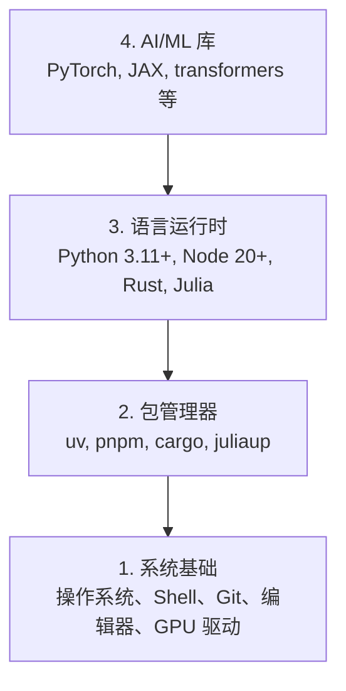

# 开发环境

> 工具塑造思维。一次配置好，配置到位。

**类型：** 实践
**语言：** Python, Node.js, Rust
**前置要求：** 无
**时间：** 约 45 分钟

## 学习目标

- 从零配置 Python 3.11+、Node.js 20+ 和 Rust 工具链
- 配置虚拟环境和包管理器，实现可复现的构建
- 验证 CUDA/MPS GPU 访问，并运行一个张量运算测试
- 理解四层环境栈：系统、包管理、运行时、AI 库

## 问题

你即将通过 200+ 节课学习 AI 工程，使用 Python、TypeScript、Rust 和 Julia。如果你的环境出了问题，每节课都会变成跟工具链的搏斗，而不是学习本身。

大多数人跳过环境配置，然后花几个小时调试导入错误、版本冲突和缺失的 CUDA 驱动。我们现在就把这件事做一次，做对。

## 概念

AI 工程环境有四层：



我们从底层往上安装。每一层都依赖其下面的那一层。

## 动手实现

### 第一步：系统基础

检查你的系统并安装基础工具。

```bash
# macOS
xcode-select --install
brew install git curl wget

# Ubuntu/Debian
sudo apt update && sudo apt install -y build-essential git curl wget

# Windows（使用 WSL2）
wsl --install -d Ubuntu-24.04
```

### 第二步：Python 与 uv

我们使用 `uv`——它比 pip 快 10-100 倍，并自动管理虚拟环境。

```bash
curl -LsSf https://astral.sh/uv/install.sh | sh

uv python install 3.12

uv venv
source .venv/bin/activate  # Windows 上用 .venv\Scripts\activate

uv pip install numpy matplotlib jupyter
```

验证：

```python
import sys
print(f"Python {sys.version}")

import numpy as np
print(f"NumPy {np.__version__}")
a = np.array([1, 2, 3])
print(f"向量: {a}, 与自身的点积: {np.dot(a, a)}")
```

### 第三步：Node.js 与 pnpm

用于 TypeScript 课程（Agent、MCP 服务器、Web 应用）。

```bash
curl -fsSL https://fnm.vercel.app/install | bash
fnm install 22
fnm use 22

npm install -g pnpm

node -e "console.log('Node', process.version)"
```

### 第四步：Rust

用于性能敏感课程（推理、系统编程）。

```bash
curl --proto '=https' --tlsv1.2 -sSf https://sh.rustup.rs | sh

rustc --version
cargo --version
```

### 第五步：Julia（可选）

用于数学密集型课程，Julia 在这些场景表现出色。

```bash
curl -fsSL https://install.julialang.org | sh

julia -e 'println("Julia ", VERSION)'
```

### 第六步：GPU 配置（如果有 GPU）

```bash
# NVIDIA
nvidia-smi

# 安装带 CUDA 支持的 PyTorch
uv pip install torch torchvision torchaudio --index-url https://download.pytorch.org/whl/cu124
```

```python
import torch
print(f"CUDA 可用: {torch.cuda.is_available()}")
if torch.cuda.is_available():
    print(f"GPU: {torch.cuda.get_device_name(0)}")
```

没有 GPU？没关系。大多数课程可以在 CPU 上运行。对于训练密集型课程，可使用 Google Colab 或云 GPU。

### 第七步：验证所有配置

运行验证脚本：

```bash
python phases/00-setup-and-tooling/01-dev-environment/code/verify.py
```

## 实际使用

你的环境现在已为本课程所有内容做好准备。各语言的使用场景如下：

| 语言 | 使用阶段 | 包管理器 |
|----------|---------|-----------------|
| Python | 阶段 1-12（ML、DL、NLP、视觉、音频、LLM）| uv |
| TypeScript | 阶段 13-17（工具、Agent、群体、基础设施）| pnpm |
| Rust | 阶段 12、15-17（性能敏感系统）| cargo |
| Julia | 阶段 1（数学基础）| Pkg |

## 交付产出

本节课产出一个任何人都可以运行的验证脚本，用于检查环境配置。

参见 `outputs/prompt-env-check.md`，其中提供了一个帮助 AI 助手诊断环境问题的提示词。

## 练习

1. 运行验证脚本并修复所有失败项
2. 为本课程创建一个 Python 虚拟环境并安装 PyTorch
3. 用全部四种语言各写一个"Hello World"并分别运行
