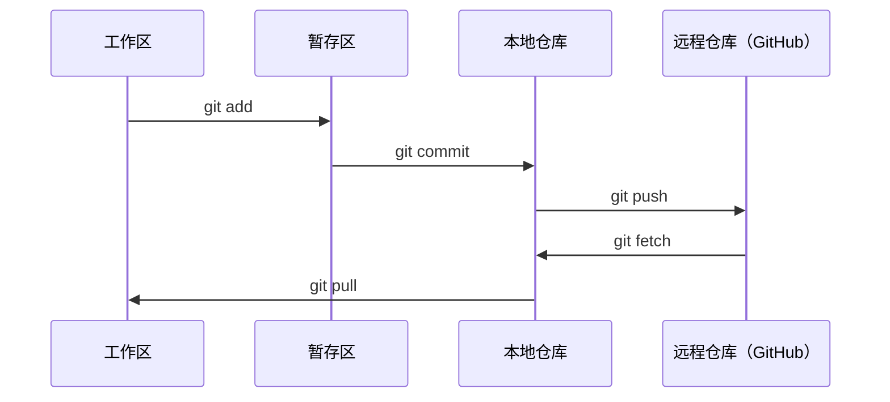

# Git 与协作

> 版本控制不是可选项。你在这里构建的每一个实验、每一个模型、每一节课都需要被追踪。

**类型：** 学习
**语言：** --
**前置要求：** 阶段 0，第 01 课
**时间：** 约 30 分钟

## 学习目标

- 配置 git 身份，掌握 add、commit、push 的日常工作流
- 创建和合并分支，在不破坏 main 的前提下进行隔离实验
- 编写 `.gitignore`，排除模型检查点和大型二进制文件
- 用 `git log` 浏览提交历史，理解项目演进过程

## 问题

你即将在 20 个阶段中编写数百个代码文件。没有版本控制，你会丢失工作成果，搞坏无法撤销的东西，也无法与他人协作。

Git 是工具，GitHub 是代码存放的地方。本课只讲这门课需要的内容，不多不少。

## 概念



记住三件事：
1. 经常保存（`git commit`）
2. 推送到远程（`git push`）
3. 用分支做实验（`git checkout -b experiment`）

## 动手实现

### 第一步：配置 git

```bash
git config --global user.name "你的名字"
git config --global user.email "you@example.com"
```

### 第二步：日常工作流

```bash
git status
git add file.py
git commit -m "添加感知机实现"
git push origin main
```

### 第三步：用分支做实验

```bash
git checkout -b experiment/new-optimizer

# ... 做修改，提交 ...

git checkout main
git merge experiment/new-optimizer
```

### 第四步：使用本课程仓库

```bash
git clone https://github.com/rohitg00/ai-engineering-from-scratch.git
cd ai-engineering-from-scratch

git checkout -b my-progress
# 完成各节课，提交你的代码
git push origin my-progress
```

## 实际使用

本课程中你需要的命令就这些：

| 命令 | 使用时机 |
|---------|------|
| `git clone` | 获取课程仓库 |
| `git add` + `git commit` | 保存你的工作 |
| `git push` | 备份到 GitHub |
| `git checkout -b` | 试验新想法而不破坏 main |
| `git log --oneline` | 查看你做了什么 |

就这些。本课程不需要 rebase、cherry-pick 或 submodule。

## 练习

1. 克隆本仓库，创建一个名为 `my-progress` 的分支，创建一个文件，提交并推送
2. 创建一个 `.gitignore`，排除模型检查点文件（`.pt`、`.pth`、`.safetensors`）
3. 用 `git log --oneline` 查看本仓库的提交历史，阅读课程是如何被添加进来的

## 关键术语

| 术语 | 大家怎么说 | 实际含义 |
|------|----------------|----------------------|
| Commit（提交）| "保存" | 项目在某个时间点的完整快照 |
| Branch（分支）| "副本" | 指向某次提交的指针，随着工作向前移动 |
| Merge（合并）| "合并代码" | 将一个分支的修改应用到另一个分支 |
| Remote（远程）| "云端" | 托管在其他地方的仓库副本（GitHub、GitLab）|
