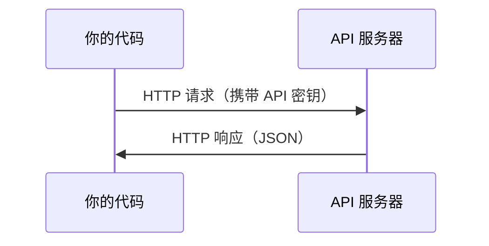

# API 与密钥管理

> 每个 AI API 的工作方式都一样：发送请求，获得响应。细节会变，模式不变。

**类型：** 实践
**语言：** Python, TypeScript
**前置要求：** 阶段 0，第 01 课
**时间：** 约 30 分钟

## 学习目标

- 使用环境变量和 `.env` 文件安全存储 API 密钥
- 分别用 Anthropic Python SDK 和原始 HTTP 发起 LLM API 调用
- 对比 SDK 和原始 HTTP 的请求/响应格式，方便调试
- 识别并处理常见 API 错误，包括认证错误和速率限制

## 问题

从阶段 11 开始，你会调用 LLM API（Anthropic、OpenAI、Google）。在阶段 13-16，你会构建在循环中使用这些 API 的 Agent。你需要了解 API 密钥如何工作、如何安全存储，以及如何发起第一次 API 调用。

## 概念



每次 API 调用包含：
1. 端点（URL）
2. API 密钥（认证）
3. 请求体（你想要什么）
4. 响应体（你得到什么）

## 动手实现

### 第一步：安全存储 API 密钥

永远不要把 API 密钥写进代码。使用环境变量。

```bash
export ANTHROPIC_API_KEY="sk-ant-..."
export OPENAI_API_KEY="sk-..."
```

或使用 `.env` 文件（将其加入 `.gitignore`）：

```
ANTHROPIC_API_KEY=sk-ant-...
OPENAI_API_KEY=sk-...
```

### 第二步：第一次 API 调用（Python）

```python
import anthropic

client = anthropic.Anthropic()

response = client.messages.create(
    model="claude-sonnet-4-20250514",
    max_tokens=256,
    messages=[{"role": "user", "content": "用一句话解释什么是神经网络？"}]
)

print(response.content[0].text)
```

### 第三步：第一次 API 调用（TypeScript）

```typescript
import Anthropic from "@anthropic-ai/sdk";

const client = new Anthropic();

const response = await client.messages.create({
  model: "claude-sonnet-4-20250514",
  max_tokens: 256,
  messages: [{ role: "user", content: "用一句话解释什么是神经网络？" }],
});

console.log(response.content[0].text);
```

### 第四步：原始 HTTP（不用 SDK）

```python
import os
import urllib.request
import json

url = "https://api.anthropic.com/v1/messages"
headers = {
    "Content-Type": "application/json",
    "x-api-key": os.environ["ANTHROPIC_API_KEY"],
    "anthropic-version": "2023-06-01",
}
body = json.dumps({
    "model": "claude-sonnet-4-20250514",
    "max_tokens": 256,
    "messages": [{"role": "user", "content": "用一句话解释什么是神经网络？"}],
}).encode()

req = urllib.request.Request(url, data=body, headers=headers, method="POST")
with urllib.request.urlopen(req) as resp:
    result = json.loads(resp.read())
    print(result["content"][0]["text"])
```

这就是 SDK 在底层做的事。理解原始 HTTP 调用有助于调试。

## 实际使用

本课程所需 API：

| API | 使用时机 | 免费额度 |
|-----|-----------------|-----------|
| Anthropic（Claude）| 阶段 11-16（Agent、工具）| 注册赠 $5 额度 |
| OpenAI | 阶段 11（对比实验）| 注册赠 $5 额度 |
| Hugging Face | 阶段 4-10（模型、数据集）| 免费 |

现在不需要全部配置好，等课程用到时再设置即可。

## 交付产出

本节课产出：
- `outputs/prompt-api-troubleshooter.md`——诊断常见 API 错误的提示词

## 练习

1. 获取一个 Anthropic API 密钥，发起你的第一次 API 调用
2. 尝试原始 HTTP 版本，对比响应格式与 SDK 版本的差异
3. 故意使用一个错误的 API 密钥，阅读错误信息

## 关键术语

| 术语 | 大家怎么说 | 实际含义 |
|------|----------------|----------------------|
| API 密钥 | "API 的密码" | 标识你账户并授权请求的唯一字符串 |
| 速率限制（Rate limit）| "被限速了" | 每分钟/小时的最大请求数，防止滥用并确保公平使用 |
| Token | "一个词"（API 语境中）| 计费单位：输入和输出 Token 分别计数和收费 |
| 流式传输（Streaming）| "实时响应" | 逐词获取响应，而不是等待完整响应 |
