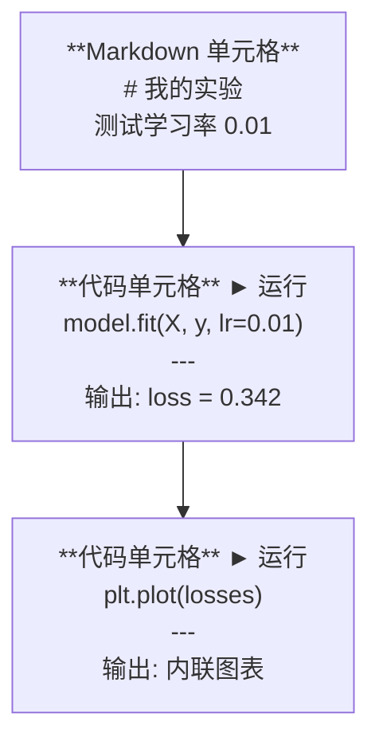
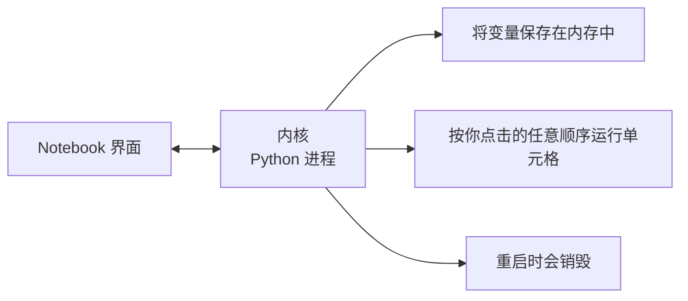

# Jupyter Notebook

> Notebook 是 AI 工程的实验台。你在这里做原型，然后把可用的东西移到生产环境。

**类型：** 实践
**语言：** Python
**前置要求：** 阶段 0，第 01 课
**时间：** 约 30 分钟

## 学习目标

- 安装并启动 JupyterLab、Jupyter Notebook，或带 Jupyter 扩展的 VS Code
- 使用魔法命令（`%timeit`、`%%time`、`%matplotlib inline`）进行基准测试和内联可视化
- 区分何时使用 Notebook 与脚本，应用"在 Notebook 中探索，在脚本中交付"的工作流
- 识别并避免常见的 Notebook 陷阱：乱序执行、隐藏状态和内存泄漏

## 问题

每篇 AI 论文、教程和 Kaggle 竞赛都使用 Jupyter Notebook。它让你能分块运行代码、内联查看输出、将代码与解释混合书写，并快速迭代。如果你试图在不使用 Notebook 的情况下学习 AI，就像做数学题没有草稿纸。

但 Notebook 也有真实的陷阱。人们用它做所有事情，包括它非常不擅长的事情。了解何时用 Notebook、何时用脚本，会让你以后少走很多调试弯路。

## 概念

Notebook 是一个单元格列表。每个单元格是代码或文本。



内核（Kernel）是在后台运行的 Python 进程。当你运行一个单元格时，它将代码发送给内核，内核执行后返回结果。所有单元格共享同一个内核，因此变量在单元格之间保持存在。



"按任意顺序运行"这一点既是超能力，也是埋雷之处。

## 动手实现

### 第一步：选择你的界面

三个选项，同一格式：

| 界面 | 安装 | 适合场景 |
|-----------|---------|----------|
| JupyterLab | `pip install jupyterlab` 然后 `jupyter lab` | 完整 IDE 体验，多标签、文件浏览器、终端 |
| Jupyter Notebook | `pip install notebook` 然后 `jupyter notebook` | 简单、轻量，一次一个 Notebook |
| VS Code | 安装"Jupyter"扩展 | 已在你的编辑器中，git 集成，支持调试 |

三者读写同一种 `.ipynb` 文件。选你喜欢的。JupyterLab 在 AI 工作中最常见。

```bash
pip install jupyterlab
jupyter lab
```

### 第二步：重要的快捷键

操作分两种模式。按 `Escape` 进入命令模式（左侧蓝色条），按 `Enter` 进入编辑模式（绿色条）。

**命令模式（最常用）：**

| 按键 | 操作 |
|-----|--------|
| `Shift+Enter` | 运行单元格，移到下一个 |
| `A` | 在上方插入单元格 |
| `B` | 在下方插入单元格 |
| `DD` | 删除单元格 |
| `M` | 转换为 Markdown |
| `Y` | 转换为代码 |
| `Z` | 撤销单元格操作 |
| `Ctrl+Shift+H` | 显示所有快捷键 |

**编辑模式：**

| 按键 | 操作 |
|-----|--------|
| `Tab` | 自动补全 |
| `Shift+Tab` | 显示函数签名 |
| `Ctrl+/` | 切换注释 |

`Shift+Enter` 是你每天会用上千次的键。先学这个。

### 第三步：单元格类型

**代码单元格**运行 Python 并显示输出：

```python
import numpy as np
data = np.random.randn(1000)
data.mean(), data.std()
```

输出：`(0.0032, 0.9987)`

**Markdown 单元格**渲染格式化文本。用它来记录你在做什么以及为什么这样做。支持标题、粗体、斜体、LaTeX 数学（`$E = mc^2$`）、表格和图片。

### 第四步：魔法命令

这些不是 Python 语句，而是 Jupyter 专属命令，以 `%`（行魔法）或 `%%`（单元格魔法）开头。

**计时你的代码：**

```python
%timeit np.random.randn(10000)
```

输出：`45.2 us +/- 1.3 us per loop`

```python
%%time
model.fit(X_train, y_train, epochs=10)
```

输出：`Wall time: 2.34 s`

`%timeit` 多次运行并取平均值，`%%time` 只运行一次。微基准测试用 `%timeit`，训练运行用 `%%time`。

**开启内联图表：**

```python
%matplotlib inline
```

之后每个 `plt.plot()` 或 `plt.show()` 都会直接在 Notebook 中渲染。

**不离开 Notebook 安装包：**

```python
!pip install scikit-learn
```

`!` 前缀运行任何 Shell 命令。

**查看环境变量：**

```python
%env CUDA_VISIBLE_DEVICES
```

### 第五步：内联显示富格式输出

Notebook 会自动显示单元格中最后一个表达式的结果。你也可以主动控制：

```python
import pandas as pd

df = pd.DataFrame({
    "model": ["线性模型", "随机森林", "神经网络"],
    "accuracy": [0.72, 0.89, 0.94],
    "training_time": [0.1, 2.3, 45.6]
})
df
```

这会渲染一个格式化的 HTML 表格，而不是纯文本。图表同样如此：

```python
import matplotlib.pyplot as plt

plt.figure(figsize=(8, 4))
plt.plot([1, 2, 3, 4], [1, 4, 2, 3])
plt.title("内联图表")
plt.show()
```

图表直接出现在单元格下方。这就是 Notebook 主导 AI 工作的原因——你能同时看到数据、图表和代码。

显示图片：

```python
from IPython.display import Image, display
display(Image(filename="architecture.png"))
```

### 第六步：Google Colab

Colab 是云端的免费 Jupyter Notebook。它提供 GPU、预装库和 Google Drive 集成，无需任何配置。

1. 访问 [colab.research.google.com](https://colab.research.google.com)
2. 上传本课程中的任意 `.ipynb` 文件
3. 运行时 > 更改运行时类型 > T4 GPU（免费）

Colab 与本地 Jupyter 的区别：
- 文件在会话之间不持久（保存到 Drive 或下载）
- 预装：numpy、pandas、matplotlib、torch、tensorflow、sklearn
- `from google.colab import files` 用于上传/下载文件
- `from google.colab import drive; drive.mount('/content/drive')` 用于持久存储
- 免费层空闲 90 分钟后会超时

## 实际使用

### Notebook vs 脚本：什么时候用哪个

| 使用 Notebook | 使用脚本 |
|-------------------|-----------------|
| 探索数据集 | 训练流水线 |
| 原型化模型 | 可复用工具函数 |
| 可视化结果 | 包含 `if __name__` 的代码 |
| 解释你的工作 | 定时运行的代码 |
| 快速实验 | 生产代码 |
| 课程练习 | 包和库 |

规则：**在 Notebook 中探索，在脚本中交付**。

AI 工作中常见的工作流：
1. 在 Notebook 中探索数据
2. 在 Notebook 中原型化模型
3. 一旦可行，将代码移到 `.py` 文件
4. 将这些 `.py` 文件导回 Notebook 进行进一步实验

### 常见陷阱

**乱序执行。** 你运行了第 5 格，然后第 2 格，然后第 7 格。Notebook 在你机器上运行正常，但别人从头到尾运行时就会崩溃。解决方法：分享前运行"内核 > 重启并全部运行"。

**隐藏状态。** 你删除了一个单元格，但它创建的变量还留在内存中。Notebook 看起来干净，但依赖一个"幽灵单元格"。解决方法：定期重启内核。

**内存泄漏。** 加载 4GB 数据集，训练模型，再加载另一个数据集。什么都没被释放。解决方法：使用 `del variable_name` 和 `gc.collect()`，或重启内核。

## 交付产出

本节课产出：
- `outputs/prompt-notebook-helper.md`——用于调试 Notebook 问题的提示词

## 练习

1. 打开 JupyterLab，创建一个 Notebook，用 `%timeit` 对比列表推导式与 numpy 生成 10 万个随机数的速度
2. 创建一个同时包含 Markdown 和代码单元格的 Notebook，加载 CSV，显示数据框，绘制图表。然后运行"内核 > 重启并全部运行"验证从头到尾可正常执行
3. 将 `code/notebook_tips.py` 中的代码粘贴到 Colab Notebook，并在免费 GPU 上运行

## 关键术语

| 术语 | 大家怎么说 | 实际含义 |
|------|----------------|----------------------|
| 内核（Kernel）| "运行我代码的那个东西" | 执行单元格代码并在内存中保存变量的独立 Python 进程 |
| 单元格（Cell）| "代码块" | Notebook 中可独立运行的单位，可以是代码或 Markdown |
| 魔法命令（Magic command）| "Jupyter 技巧" | 以 `%` 或 `%%` 为前缀的特殊命令，用于控制 Notebook 环境 |
| `.ipynb` | "Notebook 文件" | 包含单元格、输出和元数据的 JSON 文件，即 IPython Notebook |

## 延伸阅读

- [JupyterLab 文档](https://jupyterlab.readthedocs.io/)——完整功能集
- [Google Colab FAQ](https://research.google.com/colaboratory/faq.html)——Colab 特有的限制和功能
- [28 个 Jupyter Notebook 技巧](https://www.dataquest.io/blog/jupyter-notebook-tips-tricks-shortcuts/)——高级用户快捷键
