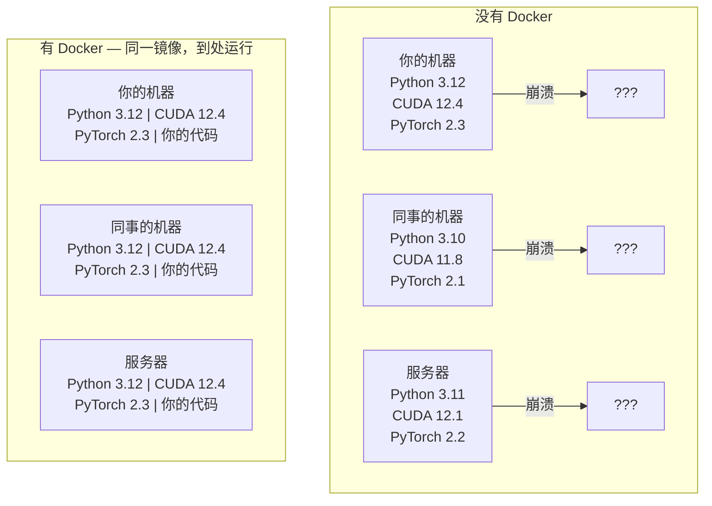

# Docker 在 AI 中的应用

> 容器让"在我机器上能跑"成为过去式。

**类型：** 实践
**语言：** Python
**前置要求：** 阶段 0，第 01 和 03 课
**时间：** 约 60 分钟

## 学习目标

- 通过 Dockerfile 构建支持 GPU 的 Docker 镜像，包含 CUDA、PyTorch 和 AI 库
- 将宿主目录挂载为卷，跨容器重建持久化模型、数据集和代码
- 配置 NVIDIA Container Toolkit，使容器内可访问 GPU
- 使用 Docker Compose 编排多服务 AI 应用（推理服务器 + 向量数据库）

## 问题

你在笔记本上用 PyTorch 2.3、CUDA 12.4 和 Python 3.12 训练了一个模型。你的同事用的是 PyTorch 2.1、CUDA 11.8 和 Python 3.10。模型在他的机器上崩溃了。你的 Dockerfile 在两台机器上都能运行。

AI 项目的依赖关系是个噩梦。典型的技术栈包括 Python、PyTorch、CUDA 驱动、cuDNN、系统级 C 库，以及需要精确编译器版本的 flash-attn 等专用包。Docker 将所有这些打包进一个镜像，在任何地方运行效果完全相同。

## 概念

Docker 将你的代码、运行时、库和系统工具打包成一个隔离单元，称为容器。把它想象成一个轻量级虚拟机，只不过它共享宿主操作系统内核，而不是运行自己的内核，所以几秒内就能启动，而非需要几分钟。



### 为什么 AI 项目比其他项目更需要 Docker

1. **GPU 驱动很脆弱。** CUDA 12.4 的代码无法在 CUDA 11.8 上运行。Docker 通过 NVIDIA Container Toolkit 将 CUDA 工具包隔离在容器内，同时共享宿主 GPU 驱动。

2. **模型权重体积庞大。** 一个 70 亿参数的模型以 fp16 格式存储需要 14 GB。你不想每次重建都重新下载。Docker 卷可以让你从宿主机挂载模型目录。

3. **多服务架构很常见。** 真实的 AI 应用不只是一个 Python 脚本，而是一个推理服务器、一个用于 RAG 的向量数据库，可能还有一个 Web 前端。Docker Compose 用一条命令编排所有这些服务。

### 关键词汇

| 术语 | 含义 |
|------|------|
| 镜像（Image）| 只读模板，是你的"配方"，从 Dockerfile 构建 |
| 容器（Container）| 镜像的运行实例，是你的"厨房" |
| Dockerfile | 逐层构建镜像的指令集 |
| 卷（Volume）| 容器重启后仍然存在的持久化存储 |
| docker-compose | 用 YAML 定义多容器应用的工具 |

### AI 中常见的容器模式

```
开发容器（Dev Container）
  完整工具链。编辑器支持。Jupyter。调试工具。
  用于开发和实验阶段。

训练容器（Training Container）
  精简版。只有训练脚本和依赖。
  在 GPU 集群上运行。没有编辑器，没有 Jupyter。

推理容器（Inference Container）
  针对服务进行优化。镜像体积小。冷启动速度快。
  在生产环境的负载均衡器后运行。
```

## 动手实现

### 第一步：安装 Docker

```bash
# macOS
brew install --cask docker
open /Applications/Docker.app

# Ubuntu
curl -fsSL https://get.docker.com | sh
sudo usermod -aG docker $USER
# 注销并重新登录以使组变更生效
```

验证：

```bash
docker --version
docker run hello-world
```

### 第二步：安装 NVIDIA Container Toolkit（Linux + NVIDIA GPU）

这让 Docker 容器能够访问你的 GPU。macOS 和 Windows（WSL2）用户可以跳过此步；Docker Desktop 在这些平台上以不同方式处理 GPU 直通。

```bash
distribution=$(. /etc/os-release;echo $ID$VERSION_ID)
curl -fsSL https://nvidia.github.io/libnvidia-container/gpgkey | sudo gpg --dearmor -o /usr/share/keyrings/nvidia-container-toolkit-keyring.gpg
curl -s -L https://nvidia.github.io/libnvidia-container/$distribution/libnvidia-container.list | \
    sed 's#deb https://#deb [signed-by=/usr/share/keyrings/nvidia-container-toolkit-keyring.gpg] https://#g' | \
    sudo tee /etc/apt/sources.list.d/nvidia-container-toolkit.list

sudo apt-get update
sudo apt-get install -y nvidia-container-toolkit
sudo nvidia-ctk runtime configure --runtime=docker
sudo systemctl restart docker
```

测试容器内的 GPU 访问：

```bash
docker run --rm --gpus all nvidia/cuda:12.4.1-base-ubuntu22.04 nvidia-smi
```

如果能看到 GPU 信息，说明工具包工作正常。

### 第三步：了解基础镜像

选对基础镜像能省去数小时的调试时间。

```
nvidia/cuda:12.4.1-devel-ubuntu22.04
  完整 CUDA 工具链，包含编译器。
  适用于：需要 nvcc 编译包（flash-attn、bitsandbytes）
  大小：约 4 GB

nvidia/cuda:12.4.1-runtime-ubuntu22.04
  仅 CUDA 运行时，无编译器。
  适用于：运行预构建代码
  大小：约 1.5 GB

pytorch/pytorch:2.3.1-cuda12.4-cudnn9-runtime
  在 CUDA 基础上预装 PyTorch。
  适用于：跳过 PyTorch 安装步骤
  大小：约 6 GB

python:3.12-slim
  无 CUDA，仅 CPU。
  适用于：CPU 推理、轻量工具
  大小：约 150 MB
```

### 第四步：为 AI 开发编写 Dockerfile

以下是 `code/Dockerfile` 的内容，逐步解读：

```dockerfile
FROM nvidia/cuda:12.4.1-devel-ubuntu22.04

ENV DEBIAN_FRONTEND=noninteractive
ENV PYTHONUNBUFFERED=1

RUN apt-get update && apt-get install -y --no-install-recommends \
    python3.12 \
    python3.12-venv \
    python3.12-dev \
    python3-pip \
    git \
    curl \
    build-essential \
    && rm -rf /var/lib/apt/lists/*

RUN update-alternatives --install /usr/bin/python python /usr/bin/python3.12 1

RUN python -m pip install --no-cache-dir --upgrade pip setuptools wheel

RUN python -m pip install --no-cache-dir \
    torch==2.3.1 \
    torchvision==0.18.1 \
    torchaudio==2.3.1 \
    --index-url https://download.pytorch.org/whl/cu124

RUN python -m pip install --no-cache-dir \
    numpy \
    pandas \
    scikit-learn \
    matplotlib \
    jupyter \
    transformers \
    datasets \
    accelerate \
    safetensors

WORKDIR /workspace

VOLUME ["/workspace", "/models"]

EXPOSE 8888

CMD ["python"]
```

构建镜像：

```bash
docker build -t ai-dev -f phases/00-setup-and-tooling/07-docker-for-ai/code/Dockerfile .
```

第一次构建需要一段时间（下载 CUDA 基础镜像 + PyTorch）。后续构建会使用缓存层。

运行容器：

```bash
docker run --rm -it --gpus all \
    -v $(pwd):/workspace \
    -v ~/models:/models \
    ai-dev python -c "import torch; print(f'PyTorch {torch.__version__}, CUDA: {torch.cuda.is_available()}')"
```

在容器内运行 Jupyter：

```bash
docker run --rm -it --gpus all \
    -v $(pwd):/workspace \
    -v ~/models:/models \
    -p 8888:8888 \
    ai-dev jupyter notebook --ip=0.0.0.0 --port=8888 --no-browser --allow-root
```

### 第五步：数据和模型的卷挂载

卷挂载对 AI 工作至关重要。没有它，容器停止时你的 14 GB 模型下载就会消失。

```bash
# 挂载你的代码
-v $(pwd):/workspace

# 挂载共享模型目录
-v ~/models:/models

# 挂载数据集
-v ~/datasets:/data
```

在训练脚本中，从挂载路径加载：

```python
from transformers import AutoModel

model = AutoModel.from_pretrained("/models/llama-7b")
```

模型文件存储在宿主文件系统中。随意重建容器，无需重新下载。

### 第六步：用 Docker Compose 编排多服务 AI 应用

一个真实的 RAG 应用需要推理服务器和向量数据库。Docker Compose 用一条命令运行它们。

参见 `code/docker-compose.yml`：

```yaml
services:
  ai-dev:
    build:
      context: .
      dockerfile: Dockerfile
    deploy:
      resources:
        reservations:
          devices:
            - driver: nvidia
              count: all
              capabilities: [gpu]
    volumes:
      - ../../../:/workspace
      - ~/models:/models
      - ~/datasets:/data
    ports:
      - "8888:8888"
    stdin_open: true
    tty: true
    command: jupyter notebook --ip=0.0.0.0 --port=8888 --no-browser --allow-root

  qdrant:
    image: qdrant/qdrant:v1.12.5
    ports:
      - "6333:6333"
      - "6334:6334"
    volumes:
      - qdrant_data:/qdrant/storage

volumes:
  qdrant_data:
```

启动所有服务：

```bash
cd phases/00-setup-and-tooling/07-docker-for-ai/code
docker compose up -d
```

现在你的 AI 开发容器可以通过服务名 `http://qdrant:6333` 访问向量数据库。Docker Compose 自动创建共享网络。

在 AI 容器内测试连接：

```python
from qdrant_client import QdrantClient

client = QdrantClient(host="qdrant", port=6333)
print(client.get_collections())
```

停止所有服务：

```bash
docker compose down
```

加 `-v` 同时删除 qdrant 卷：

```bash
docker compose down -v
```

### 第七步：AI 工作中实用的 Docker 命令

```bash
# 列出正在运行的容器
docker ps

# 列出所有镜像及其大小
docker images

# 删除未使用的镜像（回收磁盘空间）
docker system prune -a

# 在运行中的容器内查看 GPU 使用情况
docker exec -it <container_id> nvidia-smi

# 从容器复制文件到宿主机
docker cp <container_id>:/workspace/results.csv ./results.csv

# 查看容器日志
docker logs -f <container_id>
```

## 实际使用

你现在拥有了一个可复现的 AI 开发环境。在本课程接下来的学习中：

- 用 `docker compose up` 同时启动开发环境和向量数据库
- 将代码、模型和数据作为卷挂载，确保重建后不会丢失
- 当某节课需要新的 Python 包时，将其添加到 Dockerfile 并重新构建
- 与队友共享你的 Dockerfile，他们将获得完全相同的环境

### 没有 GPU？

去掉 `--gpus all` 标志和 NVIDIA deploy 块。容器仍然可以用于 CPU 相关的课程。PyTorch 会自动检测 CUDA 不可用并回退到 CPU 运行。

## 练习

1. 构建 Dockerfile，并在容器内运行 `python -c "import torch; print(torch.__version__)"`
2. 启动 docker-compose 堆栈，验证 Qdrant 在 AI 容器中可通过 `http://qdrant:6333/collections` 访问
3. 将 `flask` 添加到 Dockerfile，重新构建，并在 5000 端口运行一个简单的 API 服务器，用 `-p 5000:5000` 映射端口
4. 用 `docker images` 查看镜像大小。尝试将基础镜像从 `devel` 换成 `runtime`，比较两者大小

## 关键术语

| 术语 | 大家怎么说 | 实际含义 |
|------|----------------|----------------------|
| 容器（Container）| "轻量级虚拟机" | 使用宿主内核的隔离进程，拥有自己的文件系统和网络 |
| 镜像层（Image layer）| "缓存步骤" | 每条 Dockerfile 指令创建一个层，未修改的层会被缓存，使重建更快 |
| NVIDIA Container Toolkit | "Docker 中的 GPU" | 通过 `--gpus` 标志将宿主 GPU 暴露给容器的运行时钩子 |
| 卷挂载（Volume mount）| "共享文件夹" | 宿主目录映射到容器内，容器停止后变更仍然保留 |
| 基础镜像（Base image）| "起点" | Dockerfile 中 `FROM` 指定的镜像，决定了预安装的内容 |
