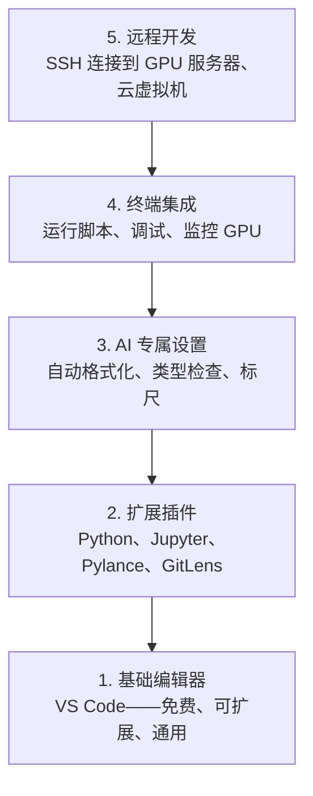

# 编辑器配置

> 编辑器是你的副驾驶。一次配置好，让它不再成为障碍，开始真正发挥作用。

**类型：** 实践
**语言：** --
**前置要求：** 阶段 0，第 01 课
**时间：** 约 20 分钟

## 学习目标

- 安装 VS Code 及 Python、Jupyter、代码检查和远程 SSH 等核心扩展
- 配置保存时格式化、类型检查和 Notebook 输出滚动，适配 AI 工作流
- 设置 Remote SSH，像操作本地文件一样编辑和调试远程 GPU 机器上的代码
- 评估其他编辑器选择（Cursor、Windsurf、Neovim）及其在 AI 工作中的权衡

## 问题

你将在编辑器里花费数千个小时——写 Python、运行 Notebook、调试训练循环、SSH 连接到 GPU 服务器。配置不当的编辑器让每次工作都充满摩擦：没有自动补全、没有类型提示、没有内联错误提示、需要手动格式化、终端工作流笨拙。

正确配置只需 20 分钟。跳过它，代价是每天浪费 20 分钟。

## 概念

AI 工程师的编辑器配置需要五个要素：



## 动手实现

### 第一步：安装 VS Code

推荐使用 VS Code。它免费、跨平台、原生支持 Jupyter Notebook，扩展生态系统涵盖 AI 工作所需的一切。

从 [code.visualstudio.com](https://code.visualstudio.com/) 下载。

在终端中验证：

```bash
code --version
```

如果 macOS 上找不到 `code`，打开 VS Code，按 `Cmd+Shift+P`，输入"Shell Command"，选择"Install 'code' command in PATH"。

### 第二步：安装核心扩展

在 VS Code 的集成终端中（`Ctrl+\`` 或 `Cmd+\``），安装 AI 工作所需的扩展：

```bash
code --install-extension ms-python.python
code --install-extension ms-python.vscode-pylance
code --install-extension ms-toolsai.jupyter
code --install-extension eamodio.gitlens
code --install-extension ms-vscode-remote.remote-ssh
code --install-extension ms-python.debugpy
code --install-extension ms-python.black-formatter
code --install-extension charliermarsh.ruff
```

各扩展的作用：

| 扩展 | 用途 |
|------|------|
| Python | 语言支持、虚拟环境检测、运行/调试 |
| Pylance | 快速类型检查、自动补全、导入解析 |
| Jupyter | 在 VS Code 内运行 Notebook，变量浏览器 |
| GitLens | 查看谁修改了什么，内联 git blame |
| Remote SSH | 像操作本地一样打开远程 GPU 服务器上的文件夹 |
| Debugpy | Python 单步调试 |
| Black Formatter | 保存时自动格式化，风格统一 |
| Ruff | 快速代码检查，捕获常见错误 |

本课的 `code/.vscode/extensions.json` 文件包含完整推荐列表。打开项目文件夹时，VS Code 会提示你安装它们。

### 第三步：配置设置

从本课的 `code/.vscode/settings.json` 复制设置，或通过 `设置 > 打开设置（JSON）` 手动应用。

AI 工作中的关键设置：

```jsonc
{
    "python.analysis.typeCheckingMode": "basic",
    "editor.formatOnSave": true,
    "editor.rulers": [88, 120],
    "notebook.output.scrolling": true,
    "files.autoSave": "afterDelay"
}
```

这些设置为何重要：

- **基础类型检查**：在运行前捕获错误的参数类型。节省调试张量形状不匹配和 API 参数错误的时间。
- **保存时格式化**：再也不用操心格式问题，Black 自动处理。
- **88 和 120 列标尺**：Black 在 88 列换行，120 列标记提示文档字符串和注释过长。
- **Notebook 输出滚动**：训练循环会打印数千行，没有滚动功能输出面板会爆炸。
- **自动保存**：你会忘记保存，训练脚本会运行过时的代码，自动保存可以防止这种情况。

### 第四步：终端集成

VS Code 的集成终端是你运行训练脚本、监控 GPU 和管理环境的地方。

合理配置：

```jsonc
{
    "terminal.integrated.defaultProfile.osx": "zsh",
    "terminal.integrated.defaultProfile.linux": "bash",
    "terminal.integrated.fontSize": 13,
    "terminal.integrated.scrollback": 10000
}
```

实用快捷键：

| 操作 | macOS | Linux/Windows |
|------|-------|---------------|
| 切换终端 | `` Ctrl+` `` | `` Ctrl+` `` |
| 新建终端 | `Ctrl+Shift+`` ` | `Ctrl+Shift+`` ` |
| 分割终端 | `Cmd+\` | `Ctrl+\` |

分割终端很实用：一个运行脚本，一个用 `nvidia-smi -l 1` 或 `watch -n 1 nvidia-smi` 监控 GPU。

### 第五步：远程开发（SSH 连接到 GPU 服务器）

这是 AI 工作中最重要的扩展。你会在远程机器（云虚拟机、实验室服务器、Lambda、Vast.ai）上进行训练。Remote SSH 让你打开远程文件系统、编辑文件、运行终端和调试，一切如同在本地操作。

设置步骤：

1. 安装 Remote SSH 扩展（第二步已完成）。
2. 按 `Ctrl+Shift+P`（或 `Cmd+Shift+P`），输入"Remote-SSH: Connect to Host"。
3. 输入 `user@your-gpu-box-ip`。
4. VS Code 自动在远程机器上安装其服务器组件。

设置 SSH 密钥以实现免密登录：

```bash
ssh-keygen -t ed25519 -C "your-email@example.com"
ssh-copy-id user@your-gpu-box-ip
```

将主机添加到 `~/.ssh/config` 以便快速访问：

```
Host gpu-box
    HostName 203.0.113.50
    User ubuntu
    IdentityFile ~/.ssh/id_ed25519
    ForwardAgent yes
```

现在"Remote-SSH: Connect to Host > gpu-box"即可立即连接。

## 其他选择

### Cursor

[cursor.com](https://cursor.com) 是内置 AI 代码生成的 VS Code 分支。它使用相同的扩展生态和设置格式。如果你用 Cursor，本课所有内容同样适用。导入相同的 `settings.json` 和 `extensions.json` 即可。

### Windsurf

[windsurf.com](https://windsurf.com) 是另一个 AI 优先的 VS Code 分支。同理：相同的扩展，相同的设置格式，相同的 Remote SSH 支持。

### Vim/Neovim

如果你已经在用 Vim 或 Neovim 且效率很高，继续用就好。AI Python 工作的最低配置：

- **pyright** 或 **pylsp** 用于类型检查（通过 Mason 或手动安装）
- **nvim-lspconfig** 用于语言服务器集成
- **jupyter-vim** 或 **molten-nvim** 用于类似 Notebook 的执行体验
- **telescope.nvim** 用于文件/符号搜索
- **none-ls.nvim** 配合 black 和 ruff 进行格式化/代码检查

如果你还没用过 Vim，现在不要开始学。学习曲线会和学 AI 工程抢时间。用 VS Code。

## 实际使用

有了这套配置，你的日常工作流如下：

1. 在 VS Code 中打开项目文件夹（或通过 Remote SSH 连接到 GPU 服务器）。
2. 在编辑器中写 Python，享受自动补全、类型提示和内联错误提示。
3. 用 Jupyter 扩展在编辑器内运行 Notebook。
4. 用集成终端运行训练脚本、执行 `uv pip install` 和监控 GPU。
5. 提交前用 GitLens 审查变更。

## 练习

1. 安装 VS Code 及第二步列出的所有扩展
2. 将本课的 `settings.json` 复制到你的 VS Code 配置中
3. 打开一个 Python 文件，验证 Pylance 显示类型提示且 Black 在保存时自动格式化
4. 如果有远程机器访问权限，设置 Remote SSH 并打开其中的文件夹

## 关键术语

| 术语 | 大家怎么说 | 实际含义 |
|------|----------------|----------------------|
| LSP | "自动补全引擎" | 语言服务器协议：编辑器从语言专属服务器获取类型信息、补全和诊断的标准协议 |
| Pylance | "Python 插件" | 微软基于 Pyright 的 Python 语言服务器，提供类型检查和 IntelliSense |
| Remote SSH | "在服务器上工作" | VS Code 扩展，在远程机器上运行轻量服务器，将 UI 流式传输到本地编辑器 |
| 保存时格式化（Format on save）| "自动美化" | 每次保存时，编辑器运行格式化工具（Black、Ruff），保持代码风格始终一致 |
