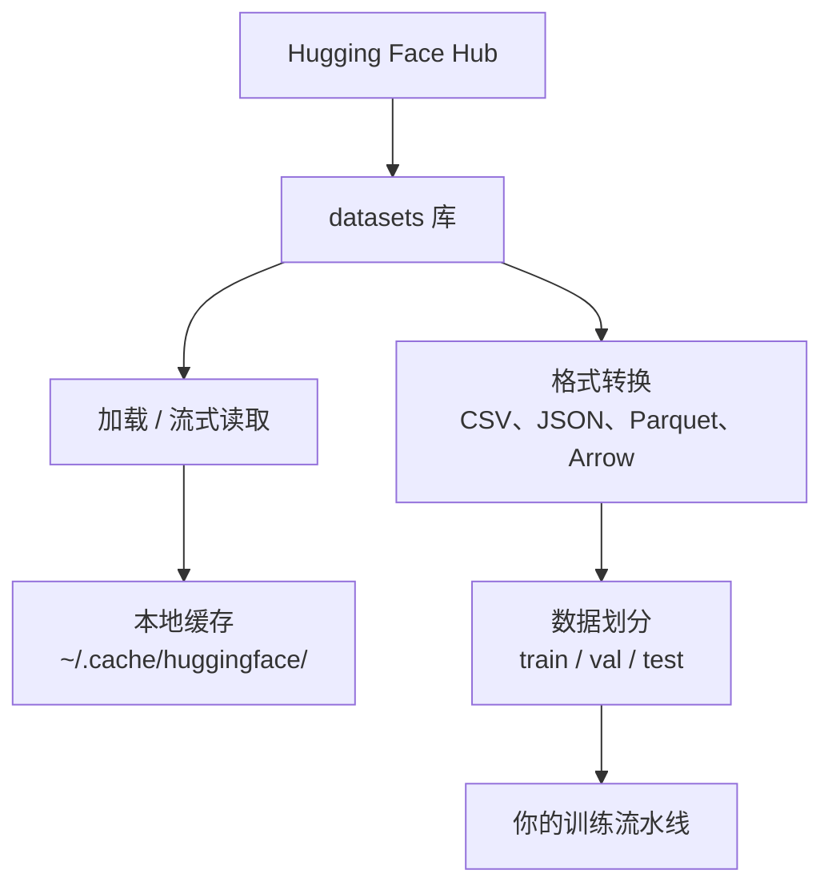

# 数据管理

> 数据是燃料。你如何管理它，决定了你能跑多快。

**类型：** 实践
**语言：** Python
**前置要求：** 阶段 0，第 01 课
**时间：** 约 45 分钟

## 学习目标

- 使用 Hugging Face `datasets` 库加载、流式读取和缓存数据集
- 在 CSV、JSON、Parquet 和 Arrow 格式之间相互转换，并了解各自的权衡
- 使用固定随机种子创建可复现的训练/验证/测试划分
- 使用 `.gitignore`、Git LFS 或 DVC 管理大型模型和数据集文件

## 问题

每个 AI 项目都从数据开始。你需要找到数据集、下载它们、在格式之间转换、为训练和评估进行划分，并对它们进行版本管理以确保实验可复现。每次手动操作既慢又容易出错。你需要一套可重复的工作流。

## 概念



Hugging Face `datasets` 库是 AI 工作中加载数据的标准方式，开箱即用地处理下载、缓存、格式转换和流式读取。

## 动手实现

### 第一步：安装 datasets 库

```bash
pip install datasets huggingface_hub
```

### 第二步：加载数据集

```python
from datasets import load_dataset

dataset = load_dataset("imdb")
print(dataset)
print(dataset["train"][0])
```

这会下载 IMDB 电影评论数据集。首次下载后，后续从 `~/.cache/huggingface/datasets/` 的缓存加载。

### 第三步：流式读取大型数据集

有些数据集太大无法全部存储在磁盘上。流式读取可以逐行加载，无需下载整个数据集。

```python
dataset = load_dataset("wikimedia/wikipedia", "20220301.en", split="train", streaming=True)

for i, example in enumerate(dataset):
    print(example["title"])
    if i >= 4:
        break
```

流式读取返回 `IterableDataset`。你在数据到达时逐行处理。无论数据集大小，内存使用量保持不变。

### 第四步：数据集格式

`datasets` 库底层使用 Apache Arrow。你可以根据流水线需求转换为其他格式。

```python
dataset = load_dataset("imdb", split="train")

dataset.to_csv("imdb_train.csv")
dataset.to_json("imdb_train.json")
dataset.to_parquet("imdb_train.parquet")
```

格式对比：

| 格式 | 大小 | 读取速度 | 最适合 |
|------|------|---------|--------|
| CSV | 大 | 慢 | 人类可读，适合电子表格 |
| JSON | 大 | 慢 | API 调用，嵌套数据 |
| Parquet | 小 | 快 | 分析查询，列式存储 |
| Arrow | 小 | 最快 | 内存处理（`datasets` 内部使用） |

AI 工作中，Parquet 是最佳存储格式。Arrow 是内存中的工作格式。CSV 和 JSON 用于数据交换。

### 第五步：数据划分

每个机器学习项目都需要三个划分：

- **训练集（Train）**：模型从中学习（通常占 80%）
- **验证集（Validation）**：训练期间检查进度（通常占 10%）
- **测试集（Test）**：训练完成后的最终评估（通常占 10%）

有些数据集预先划分好了。如果没有，手动划分：

```python
dataset = load_dataset("imdb", split="train")

split = dataset.train_test_split(test_size=0.2, seed=42)
train_val = split["train"].train_test_split(test_size=0.125, seed=42)

train_ds = train_val["train"]
val_ds = train_val["test"]
test_ds = split["test"]

print(f"Train: {len(train_ds)}, Val: {len(val_ds)}, Test: {len(test_ds)}")
```

始终设置随机种子以确保可复现性。相同的种子每次产生相同的划分。

### 第六步：下载和缓存模型

模型是大文件。`huggingface_hub` 库负责下载和缓存。

```python
from huggingface_hub import hf_hub_download, snapshot_download

model_path = hf_hub_download(
    repo_id="sentence-transformers/all-MiniLM-L6-v2",
    filename="config.json"
)
print(f"缓存位置: {model_path}")

model_dir = snapshot_download("sentence-transformers/all-MiniLM-L6-v2")
print(f"完整模型位置: {model_dir}")
```

模型缓存到 `~/.cache/huggingface/hub/`。下载一次后，后续运行瞬间加载。

### 第七步：处理大文件

模型权重和大型数据集不应进入 git。有三种选择：

**选项 A：.gitignore（最简单）**

```
*.bin
*.safetensors
*.pt
*.onnx
data/*.parquet
data/*.csv
models/
```

**选项 B：Git LFS（在 git 中追踪大文件）**

```bash
git lfs install
git lfs track "*.bin"
git lfs track "*.safetensors"
git add .gitattributes
```

Git LFS 在仓库中存储指针，实际文件存储在独立服务器上。GitHub 提供 1 GB 免费额度。

**选项 C：DVC（数据版本控制）**

```bash
pip install dvc
dvc init
dvc add data/training_set.parquet
git add data/training_set.parquet.dvc data/.gitignore
git commit -m "Track training data with DVC"
```

DVC 创建小型 `.dvc` 文件指向你的数据。数据本身存储在 S3、GCS 或其他远程存储后端。

| 方案 | 复杂度 | 最适合 |
|------|--------|--------|
| .gitignore | 低 | 个人项目，可重新下载的数据 |
| Git LFS | 中 | 团队通过 git 共享模型权重 |
| DVC | 高 | 可复现实验、大型数据集、团队协作 |

本课程使用 `.gitignore` 就够了。当你需要跨机器复现精确实验时，才需要 DVC。

### 第八步：存储模式

**本地存储**适用于 10 GB 以下的数据集，HF 缓存自动处理。

**云存储**适用于更大的数据或跨机器共享：

```python
import os

local_path = os.path.expanduser("~/.cache/huggingface/datasets/")

# s3_path = "s3://my-bucket/datasets/"
# gcs_path = "gs://my-bucket/datasets/"
```

DVC 直接集成 S3 和 GCS：

```bash
dvc remote add -d myremote s3://my-bucket/dvc-store
dvc push
```

本课程本地存储就足够了。在远程 GPU 实例上进行微调时，云存储才变得重要。

## 本课程使用的数据集

| 数据集 | 所在课程 | 大小 | 教授内容 |
|--------|---------|------|---------|
| IMDB | 分词、分类 | 84 MB | 文本分类基础 |
| WikiText | 语言建模 | 181 MB | 下一个 token 预测 |
| SQuAD | 问答系统 | 35 MB | 问答、文本片段抽取 |
| Common Crawl（子集）| 嵌入 | 不定 | 大规模文本处理 |
| MNIST | 视觉基础 | 21 MB | 图像分类基础 |
| COCO（子集）| 多模态 | 不定 | 图像-文本对 |

现在不需要全部下载，每节课会说明需要什么数据。

## 实际使用

运行工具脚本验证一切正常：

```bash
python code/data_utils.py
```

这会下载一个小型数据集、进行格式转换和划分，并打印摘要。

## 交付产出

本节课产出：
- `code/data_utils.py`——可复用的数据加载和缓存工具
- `outputs/prompt-data-helper.md`——用于查找特定任务合适数据集的提示词

## 练习

1. 加载 `glue` 数据集的 `mrpc` 配置，检查前 5 个样本
2. 流式读取 `c4` 数据集，统计 10 秒内能处理多少个样本
3. 将数据集转换为 Parquet 格式，比较与 CSV 的文件大小
4. 使用固定种子创建 70/15/15 的训练/验证/测试划分，验证各划分大小

## 关键术语

| 术语 | 大家怎么说 | 实际含义 |
|------|----------------|----------------------|
| 数据集划分（Dataset split）| "训练数据" | 命名的数据子集（train/val/test），在机器学习生命周期的不同阶段使用 |
| 流式读取（Streaming）| "懒加载" | 从远程源逐行处理数据，无需下载完整数据集 |
| Parquet | "压缩 CSV" | 为分析查询和存储效率优化的列式文件格式 |
| Arrow | "快速数据框" | datasets 库内部使用的内存列式格式，支持零拷贝读取 |
| Git LFS | "git 大文件" | 将大文件存储在 git 仓库外部同时在版本控制中保留指针的扩展 |
| DVC | "数据版本控制" | 与云存储集成的数据集和模型版本控制系统 |
| 缓存（Cache）| "已经下载了" | 之前获取数据的本地副本，默认存储在 ~/.cache/huggingface/ |
