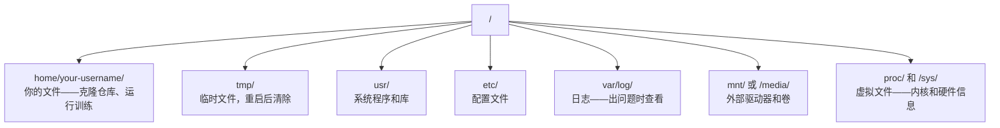

# Linux 在 AI 中的应用

> 大多数 AI 运行在 Linux 上。你需要掌握足够多的知识，不至于卡壳。

**类型：** 学习
**语言：** --
**前置要求：** 阶段 0，第 01 课
**时间：** 约 30 分钟

## 学习目标

- 从命令行导航 Linux 文件系统并执行基本文件操作
- 使用 `chmod` 和 `chown` 管理文件权限，解决"权限拒绝"错误
- 使用 `apt` 安装系统包，为 AI 工作配置全新的 GPU 服务器
- 识别 macOS 和 Linux 的常见差异，避免在远程机器上踩坑

## 问题

你在 macOS 或 Windows 上开发，但一旦 SSH 进入云 GPU 服务器、租用 Lambda 实例或启动 EC2 机器，你就落地在 Ubuntu 上。终端是你唯一的界面——没有 Finder，没有文件资源管理器，没有图形界面。如果你不会从命令行导航文件系统、安装包、管理进程，你就会一边付着闲置 GPU 的费用，一边谷歌"Linux 怎么解压文件"。

这是一份生存指南，只涵盖在远程 Linux 机器上进行 AI 工作所必需的内容。

## 文件系统结构

Linux 将所有内容组织在单一根目录 `/` 下，没有 `C:\` 或 `/Volumes`。你实际会接触到的目录：



你的主目录是 `~` 或 `/home/your-username`，几乎所有操作都在这里进行。

## 基础命令

这 15 条命令覆盖了你在远程 GPU 服务器上 95% 的操作。

### 导航

```bash
pwd                         # 我在哪里？
ls                          # 这里有什么？
ls -la                      # 这里有什么？包括隐藏文件和详细信息
cd /path/to/dir             # 去那里
cd ~                        # 回主目录
cd ..                       # 上一级
```

### 文件和目录

```bash
mkdir my-project            # 创建目录
mkdir -p a/b/c              # 一次性创建嵌套目录

cp file.txt backup.txt      # 复制文件
cp -r src/ src-backup/      # 复制目录（递归）

mv old.txt new.txt          # 重命名文件
mv file.txt /tmp/           # 移动文件

rm file.txt                 # 删除文件（没有回收站，直接消失）
rm -rf my-dir/              # 删除目录及其所有内容
```

`rm -rf` 是永久性的，没有撤销。按回车前请仔细确认路径。

### 读取文件

```bash
cat file.txt                # 打印整个文件
head -20 file.txt           # 前 20 行
tail -20 file.txt           # 后 20 行
tail -f log.txt             # 实时追踪日志文件（Ctrl+C 停止）
less file.txt               # 翻页浏览文件（q 退出）
```

### 搜索

```bash
grep "error" training.log           # 查找包含 "error" 的行
grep -r "learning_rate" .           # 在当前目录所有文件中搜索
grep -i "cuda" config.yaml          # 大小写不敏感搜索

find . -name "*.py"                 # 在当前目录下查找所有 Python 文件
find . -name "*.ckpt" -size +1G     # 查找大于 1GB 的检查点文件
```

## 权限

Linux 中每个文件都有所有者和权限位。当脚本无法执行或无法写入目录时，你就会遇到这个问题。

```bash
ls -l train.py
# -rwxr-xr-- 1 user group 2048 Mar 19 10:00 train.py
#  ^^^             所有者权限：读、写、执行
#     ^^^          组权限：读、执行
#        ^^        其他人：只读
```

常见修复：

```bash
chmod +x train.sh           # 使脚本可执行
chmod 755 deploy.sh         # 所有者：全部，其他人：读+执行
chmod 644 config.yaml       # 所有者：读+写，其他人：只读

chown user:group file.txt   # 更改文件所有者（需要 sudo）
```

遇到"权限拒绝"时，几乎总是权限问题。`chmod +x` 或 `sudo` 能解决大多数情况。

## 包管理（apt）

Ubuntu 使用 `apt`，这是安装系统级软件的方式。

```bash
sudo apt update             # 刷新包列表（总是先执行这步）
sudo apt install -y htop    # 安装包（-y 跳过确认）
sudo apt install -y build-essential  # C 编译器、make 等，许多 Python 包需要
sudo apt install -y tmux    # 终端复用器（断开连接后保持会话存活）

apt list --installed        # 已安装了什么？
sudo apt remove htop        # 卸载
```

在全新 GPU 服务器上常见的安装清单：

```bash
sudo apt update && sudo apt install -y \
    build-essential \
    git \
    curl \
    wget \
    tmux \
    htop \
    unzip \
    python3-venv
```

## 用户与 sudo

你通常以普通用户身份登录，某些操作需要 root（管理员）权限。

```bash
whoami                      # 我是哪个用户？
sudo command                # 以 root 身份运行单条命令
sudo su                     # 切换为 root（用 exit 返回，谨慎使用）
```

在云 GPU 实例上，你通常是唯一用户且已有 sudo 权限。不要用 root 运行所有命令，只在必要时使用 sudo。

## 进程与 systemd

当训练卡住或需要查看正在运行的进程时：

```bash
htop                        # 交互式进程查看器（q 退出）
ps aux | grep python        # 查找正在运行的 Python 进程
kill 12345                  # 优雅地停止 PID 为 12345 的进程
kill -9 12345               # 强制终止（优雅方式无效时使用）
nvidia-smi                  # GPU 进程和内存使用情况
```

systemd 管理服务（后台守护进程），运行推理服务器时会用到：

```bash
sudo systemctl start nginx          # 启动服务
sudo systemctl stop nginx           # 停止服务
sudo systemctl restart nginx        # 重启服务
sudo systemctl status nginx         # 检查是否运行
sudo systemctl enable nginx         # 开机自动启动
```

## 磁盘空间

GPU 服务器的磁盘空间通常有限，模型和数据集会很快填满。

```bash
df -h                       # 所有挂载驱动器的磁盘使用情况
df -h /home                 # /home 的磁盘使用情况

du -sh *                    # 当前目录各项目的大小
du -sh ~/.cache             # 缓存大小（pip、huggingface 模型在这里）
du -sh /data/checkpoints/   # 查看检查点有多大

# 找出最占空间的目录
du -h --max-depth=1 / 2>/dev/null | sort -hr | head -20
```

常见的节省空间方法：

```bash
# 清除 pip 缓存
pip cache purge

# 清除 apt 缓存
sudo apt clean

# 删除不需要的旧检查点
rm -rf checkpoints/epoch_01/ checkpoints/epoch_02/
```

## 网络

从命令行下载模型、传输文件和调用 API：

```bash
# 下载文件
wget https://example.com/model.bin                   # 下载文件
curl -O https://example.com/data.tar.gz              # 用 curl 下载
curl -s https://api.example.com/health | python3 -m json.tool  # 调用 API，格式化 JSON

# 在机器间传输文件
scp model.bin user@remote:/data/                     # 复制文件到远程机器
scp user@remote:/data/results.csv .                  # 从远程复制文件到本地
scp -r user@remote:/data/checkpoints/ ./local-dir/   # 复制目录

# 同步目录（适合大型传输，比 scp 更快，支持断点续传）
rsync -avz --progress ./data/ user@remote:/data/
rsync -avz --progress user@remote:/results/ ./results/
```

大文件传输使用 `rsync` 而非 `scp`，它只传输变更的字节并能从中断处继续。

## tmux：保持会话存活

SSH 进入远程服务器时，关闭笔记本会终止你的训练。tmux 可以防止这种情况。

```bash
tmux new -s train           # 创建名为 "train" 的新会话
# ... 启动训练，然后：
# Ctrl+B，再按 D             # 断开连接（训练继续运行）

tmux ls                     # 列出所有会话
tmux attach -t train        # 重新连接到会话

# tmux 内部：
# Ctrl+B，再按 %            # 垂直分割面板
# Ctrl+B，再按 "            # 水平分割面板
# Ctrl+B，再按方向键        # 在面板间切换
```

长时间训练任务务必在 tmux 内运行。务必。

## Windows 用户的 WSL2

如果你用 Windows，WSL2 可以提供真实的 Linux 环境，无需双系统启动。

```bash
# 在 PowerShell（管理员模式）中
wsl --install -d Ubuntu-24.04

# 重启后，从开始菜单打开 Ubuntu
sudo apt update && sudo apt upgrade -y
```

WSL2 运行真实的 Linux 内核，本课所有内容都可在其中使用。从 WSL 内部访问 Windows 文件路径为 `/mnt/c/Users/YourName/`。

在 Windows 端安装 NVIDIA 驱动后，GPU 直通即可工作。安装 Windows 版 NVIDIA 驱动（不是 Linux 版），CUDA 将在 WSL2 内可用。

## 踩坑指南：从 macOS 到 Linux

从 macOS 迁移时容易踩的坑：

| macOS | Linux | 注意 |
|-------|-------|------|
| `brew install` | `sudo apt install` | 包名有时不同。`brew install htop` vs `sudo apt install htop` 效果相同，但 `brew install readline` vs `sudo apt install libreadline-dev` 就不同了。|
| `open file.txt` | `xdg-open file.txt` | 但远程服务器上没有图形界面，用 `cat` 或 `less` 代替。|
| `pbcopy` / `pbpaste` | 不可用 | SSH 上没有剪贴板管道功能。|
| `~/.zshrc` | `~/.bashrc` | macOS 默认用 zsh，大多数 Linux 服务器用 bash。|
| `/opt/homebrew/` | `/usr/bin/`、`/usr/local/bin/` | 可执行文件存放在不同位置。|
| `sed -i '' 's/a/b/' file` | `sed -i 's/a/b/' file` | macOS sed（BSD 版）在 `-i` 后需要空字符串，Linux 不需要。|
| 大小写不敏感文件系统 | 大小写敏感文件系统 | `Model.py` 和 `model.py` 在 Linux 上是两个不同的文件。|
| 行尾符 `\n` | 行尾符 `\n` | 相同。但 Windows 使用 `\r\n`，会导致 bash 脚本出错。运行 `dos2unix` 修复。|

## 速查卡

```
导航：     pwd, ls, cd, find
文件：     cp, mv, rm, mkdir, cat, head, tail, less
搜索：     grep, find
权限：     chmod, chown, sudo
包管理：   apt update, apt install
进程：     htop, ps, kill, nvidia-smi
服务：     systemctl start/stop/restart/status
磁盘：     df -h, du -sh
网络：     curl, wget, scp, rsync
会话：     tmux new/attach/detach
```

## 练习

1. SSH 进入任意 Linux 机器（或打开 WSL2），导航到主目录，创建一个项目文件夹，用 `touch` 在其中创建三个空文件，然后用 `ls -la` 列出它们。
2. 用 apt 安装 `htop`，运行它，找出内存占用最多的进程。
3. 创建一个 tmux 会话，在其中运行 `sleep 300`，断开连接，列出所有会话，然后重新连接。
4. 用 `df -h` 检查可用磁盘空间，再用 `du -sh ~/.cache/*` 找出缓存中占用空间最多的内容。
5. 用 `scp` 将本地文件传输到远程机器，再用 `rsync` 做相同传输，比较两者体验。
