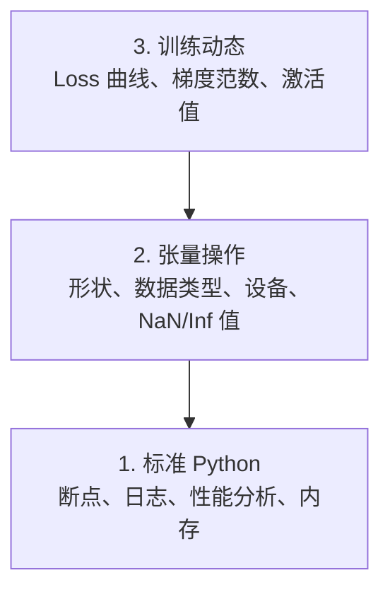

# 调试与性能分析

> 最糟糕的 AI Bug 不会崩溃。它们默默地在垃圾数据上训练，然后给你一条漂亮的 loss 曲线。

**类型：** 实践
**语言：** Python
**前置要求：** 第 01 课（开发环境），基础 PyTorch 使用经验
**时间：** 约 60 分钟

## 学习目标

- 使用条件 `breakpoint()` 和 `debug_print` 在训练中途检查张量形状、数据类型和 NaN 值
- 使用 `cProfile`、`line_profiler` 和 `tracemalloc` 对训练循环进行性能分析，找出瓶颈
- 检测常见 AI Bug：形状不匹配、NaN loss、数据泄漏和张量设备错误
- 配置 TensorBoard 可视化 loss 曲线、权重直方图和梯度分布

## 问题

AI 代码的失败方式与普通代码不同。Web 应用崩溃时有堆栈跟踪。配置错误的训练循环会运行 8 小时，烧掉 200 美元的 GPU 费用，最终产出一个对每个输入都预测均值的模型——代码从未报错。Bug 是张量放在了错误的设备上、忘记了 `.detach()`，或者标签泄漏进了特征。

你需要能在浪费时间和算力之前捕获这些静默失败的调试工具。

## 概念

AI 调试在三个层面上进行：



大多数人直接跳到第 3 层（盯着 TensorBoard 看）。但 80% 的 AI Bug 存在于第 1 和第 2 层。

## 动手实现

### 第一部分：打印调试（真的有效）

打印调试被低估了，不应该被忽视。对于张量代码，有针对性的打印语句胜过单步调试器，因为你需要同时看到形状、数据类型和值的范围。

```python
def debug_print(name, tensor):
    print(f"{name}: shape={tensor.shape}, dtype={tensor.dtype}, "
          f"device={tensor.device}, "
          f"min={tensor.min().item():.4f}, max={tensor.max().item():.4f}, "
          f"mean={tensor.mean().item():.4f}, "
          f"has_nan={tensor.isnan().any().item()}")
```

在每个可疑操作后调用这个函数。找到 Bug 后删除打印语句。简单直接。

### 第二部分：Python 调试器（pdb 和 breakpoint）

内置调试器在 AI 工作中被低估。在训练循环中放入 `breakpoint()`，以交互方式检查张量。

```python
def training_step(model, batch, criterion, optimizer):
    inputs, labels = batch
    outputs = model(inputs)
    loss = criterion(outputs, labels)

    if loss.item() > 100 or torch.isnan(loss):
        breakpoint()

    loss.backward()
    optimizer.step()
```

调试器启动后的常用命令：

- `p outputs.shape` 检查形状
- `p loss.item()` 查看 loss 值
- `p torch.isnan(outputs).sum()` 统计 NaN 数量
- `p model.fc1.weight.grad` 检查梯度
- `c` 继续执行，`q` 退出

这是条件调试——只在出现问题时停下来。对于 10,000 步的训练来说，这很重要。

### 第三部分：Python 日志

当调试超出快速检查的范围时，用日志替代打印语句。

```python
import logging

logging.basicConfig(
    level=logging.INFO,
    format="%(asctime)s [%(levelname)s] %(message)s",
    handlers=[
        logging.FileHandler("training.log"),
        logging.StreamHandler()
    ]
)
logger = logging.getLogger(__name__)

logger.info("Starting training: lr=%.4f, batch_size=%d", lr, batch_size)
logger.warning("Loss spike detected: %.4f at step %d", loss.item(), step)
logger.error("NaN loss at step %d, stopping", step)
```

日志提供时间戳、严重级别和文件输出。凌晨 3 点训练失败时，你需要的是日志文件，而不是已经滚出屏幕的终端输出。

### 第四部分：计时代码段

了解时间花在哪里是优化的第一步。

```python
import time

class Timer:
    def __init__(self, name=""):
        self.name = name

    def __enter__(self):
        self.start = time.perf_counter()
        return self

    def __exit__(self, *args):
        elapsed = time.perf_counter() - self.start
        print(f"[{self.name}] {elapsed:.4f}s")

with Timer("data loading"):
    batch = next(dataloader_iter)

with Timer("forward pass"):
    outputs = model(batch)

with Timer("backward pass"):
    loss.backward()
```

常见发现：数据加载占用了 60% 的训练时间。解决方法是在 DataLoader 中设置 `num_workers > 0`，而不是换一块更快的 GPU。

### 第五部分：cProfile 和 line_profiler

需要比手动计时更精确的分析时：

```bash
python -m cProfile -s cumtime train.py
```

这会显示按累计时间排序的所有函数调用。逐行分析：

```bash
pip install line_profiler
```

```python
@profile
def train_step(model, data, target):
    output = model(data)
    loss = F.cross_entropy(output, target)
    loss.backward()
    return loss

# 运行方式：kernprof -l -v train.py
```

### 第六部分：内存分析

#### 使用 tracemalloc 分析 CPU 内存

```python
import tracemalloc

tracemalloc.start()

# 你的代码
model = build_model()
data = load_dataset()

snapshot = tracemalloc.take_snapshot()
top_stats = snapshot.statistics("lineno")
for stat in top_stats[:10]:
    print(stat)
```

#### 使用 memory_profiler 分析 CPU 内存

```bash
pip install memory_profiler
```

```python
from memory_profiler import profile

@profile
def load_data():
    raw = read_csv("data.csv")       # 观察内存在这里的跳升
    processed = preprocess(raw)       # 以及这里
    return processed
```

运行 `python -m memory_profiler your_script.py` 查看逐行内存使用情况。

#### 使用 PyTorch 分析 GPU 内存

```python
import torch

if torch.cuda.is_available():
    print(torch.cuda.memory_summary())

    print(f"Allocated: {torch.cuda.memory_allocated() / 1e9:.2f} GB")
    print(f"Cached: {torch.cuda.memory_reserved() / 1e9:.2f} GB")
```

遇到 OOM（显存溢出）时：

1. 减小 batch size（第一步，始终这样做）
2. 使用 `torch.cuda.empty_cache()` 释放缓存内存
3. 对大型中间张量使用 `del tensor` 然后 `torch.cuda.empty_cache()`
4. 使用混合精度（`torch.cuda.amp`）将内存使用减半
5. 对非常深的模型使用梯度检查点

### 第七部分：常见 AI Bug 及检测方法

#### 形状不匹配

最常见的 Bug。张量的形状是 `[batch, features]`，但模型期望 `[batch, channels, height, width]`。

```python
def check_shapes(model, sample_input):
    print(f"Input: {sample_input.shape}")
    hooks = []

    def make_hook(name):
        def hook(module, inp, out):
            in_shape = inp[0].shape if isinstance(inp, tuple) else inp.shape
            out_shape = out.shape if hasattr(out, "shape") else type(out)
            print(f"  {name}: {in_shape} -> {out_shape}")
        return hook

    for name, module in model.named_modules():
        hooks.append(module.register_forward_hook(make_hook(name)))

    with torch.no_grad():
        model(sample_input)

    for h in hooks:
        h.remove()
```

用一个样本 batch 运行一次，即可映射模型中的每个形状变换。

#### NaN Loss

NaN loss 意味着某处发生了爆炸。常见原因：

- 学习率过高
- 自定义损失函数中的除以零
- 对零或负数取对数
- RNN 中的梯度爆炸

```python
def detect_nan(model, loss, step):
    if torch.isnan(loss):
        print(f"NaN loss at step {step}")
        for name, param in model.named_parameters():
            if param.grad is not None:
                if torch.isnan(param.grad).any():
                    print(f"  NaN gradient in {name}")
                if torch.isinf(param.grad).any():
                    print(f"  Inf gradient in {name}")
        return True
    return False
```

#### 数据泄漏

你的模型在测试集上达到了 99% 的准确率——听起来很棒？这是个 Bug。

```python
def check_data_leakage(train_set, test_set, id_column="id"):
    train_ids = set(train_set[id_column].tolist())
    test_ids = set(test_set[id_column].tolist())
    overlap = train_ids & test_ids
    if overlap:
        print(f"DATA LEAKAGE: {len(overlap)} samples in both train and test")
        return True
    return False
```

还要检查时序泄漏：用未来的数据预测过去。划分前按时间戳排序。

#### 设备错误

不同设备（CPU vs GPU）上的张量会引发运行时错误。但有时张量默默地留在 CPU 上，而其他一切都在 GPU 上，训练就变得很慢。

```python
def check_devices(model, *tensors):
    model_device = next(model.parameters()).device
    print(f"Model device: {model_device}")
    for i, t in enumerate(tensors):
        if t.device != model_device:
            print(f"  WARNING: tensor {i} on {t.device}, model on {model_device}")
```

### 第八部分：TensorBoard 基础

TensorBoard 让你看到训练过程中内部发生的一切。

```bash
pip install tensorboard
```

```python
from torch.utils.tensorboard import SummaryWriter

writer = SummaryWriter("runs/experiment_1")

for step in range(num_steps):
    loss = train_step(model, batch)

    writer.add_scalar("loss/train", loss.item(), step)
    writer.add_scalar("lr", optimizer.param_groups[0]["lr"], step)

    if step % 100 == 0:
        for name, param in model.named_parameters():
            writer.add_histogram(f"weights/{name}", param, step)
            if param.grad is not None:
                writer.add_histogram(f"grads/{name}", param.grad, step)

writer.close()
```

启动 TensorBoard：

```bash
tensorboard --logdir=runs
```

观察要点：

- **Loss 不下降**：学习率太低，或模型架构有问题
- **Loss 剧烈震荡**：学习率太高
- **Loss 变为 NaN**：数值不稳定（见上方 NaN 章节）
- **训练 loss 下降，验证 loss 上升**：过拟合
- **权重直方图坍缩到零**：梯度消失
- **梯度直方图爆炸**：需要梯度裁剪

### 第九部分：VS Code 调试器

交互式调试时，配置 VS Code 的 `launch.json`：

```json
{
    "version": "0.2.0",
    "configurations": [
        {
            "name": "Debug Training",
            "type": "debugpy",
            "request": "launch",
            "program": "${file}",
            "console": "integratedTerminal",
            "justMyCode": false
        }
    ]
}
```

点击代码行左侧设置断点，在变量面板检查张量属性，调试控制台可以在执行中途运行任意 Python 表达式。

适合逐步跟踪数据预处理管道中的每个变换。

## 实际使用

以下是能捕获大多数 AI Bug 的调试工作流：

1. **训练前**：用样本 batch 运行 `check_shapes`，确认输入和输出维度符合预期。
2. **前 10 步**：对 loss、输出和梯度使用 `debug_print`，确认没有 NaN 且值在合理范围内。
3. **训练过程中**：记录 loss、学习率和梯度范数，用 TensorBoard 可视化。
4. **出现问题时**：在失败点放入 `breakpoint()`，以交互方式检查张量。
5. **性能问题**：计时数据加载 vs 前向传播 vs 反向传播，接近 OOM 时分析内存。

## 交付产出

运行调试工具脚本：

```bash
python phases/00-setup-and-tooling/12-debugging-and-profiling/code/debug_tools.py
```

参见 `outputs/prompt-debug-ai-code.md` 了解帮助诊断 AI 专属 Bug 的提示词。

## 练习

1. 运行 `debug_tools.py`，阅读每个部分的输出。修改虚拟模型以引入 NaN（提示：在前向传播中除以零），观察检测器捕获它。
2. 用 `cProfile` 对训练循环进行性能分析，找出最慢的函数。
3. 使用 `tracemalloc` 找出数据加载管道中哪一行分配的内存最多。
4. 为简单训练运行配置 TensorBoard，判断模型是否过拟合。
5. 在训练循环中使用 `breakpoint()`，练习从调试器提示符检查张量形状、设备和梯度值。
