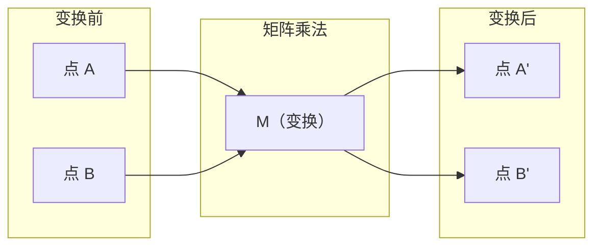
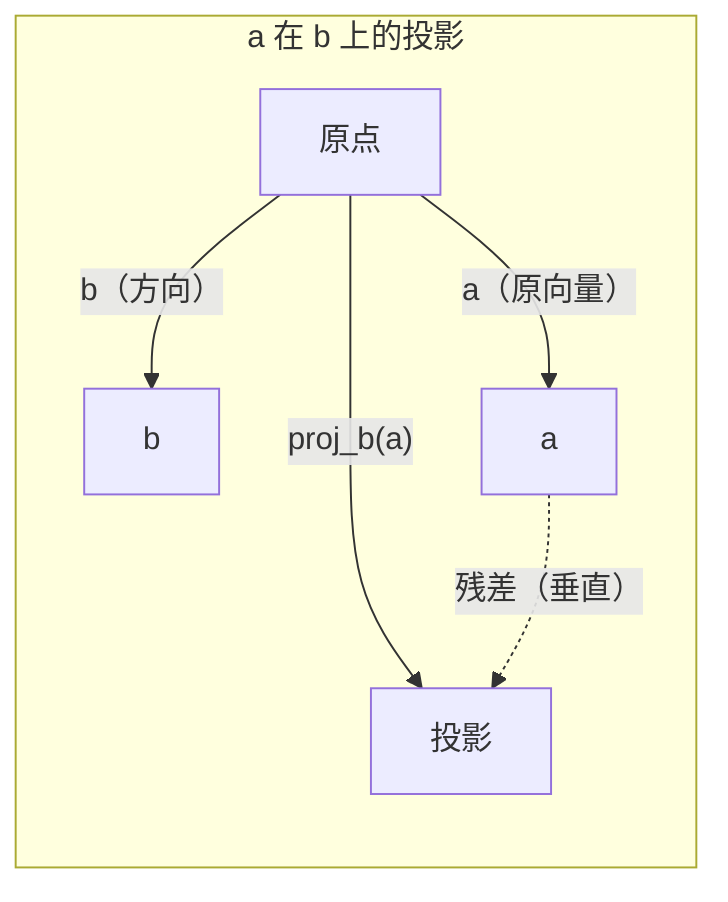

# 线性代数直觉

> 每个 AI 模型不过是戴着花帽子的矩阵运算。

**类型：** 学习
**语言：** Python, Julia
**前置要求：** 阶段 0
**时间：** 约 60 分钟

## 学习目标

- 从零开始用 Python 实现向量和矩阵运算（加法、点积、矩阵乘法）
- 从几何角度解释点积、投影和 Gram-Schmidt 过程的含义
- 使用行化简确定一组向量的线性无关性、秩和基
- 将线性代数概念与 AI 应用关联：嵌入、注意力分数和 LoRA

## 问题

打开任何一篇机器学习论文，第一页内就会看到向量、矩阵、点积和变换。没有线性代数直觉，这些不过是符号。有了它，你就能看清神经网络实际在做什么——在空间中移动点。

你不需要成为数学家。你需要从几何上理解这些运算的含义，然后自己动手实现它们。

## 概念

### 向量是点（也是方向）

向量就是一列数字，但这些数字有意义——它们是空间中的坐标。

**二维向量 [3, 2]：**

| x | y | 含义 |
|---|---|------|
| 3 | 2 | 向量从原点 (0,0) 指向平面上的 (3, 2) |

该向量的模为 sqrt(3^2 + 2^2) = sqrt(13)，方向朝右上方。

在 AI 中，向量表示一切：
- 一个词 → 768 个数字组成的向量（在嵌入空间中的"含义"）
- 一张图像 → 数百万像素值组成的向量
- 一个用户 → 偏好值组成的向量

### 矩阵是变换

矩阵将一个向量变换为另一个向量，可以旋转、缩放、拉伸或投影。



在 AI 中，矩阵就是模型本身：
- 神经网络权重 → 将输入变换为输出的矩阵
- 注意力分数 → 决定关注点的矩阵
- 嵌入 → 将词映射为向量的矩阵

### 点积衡量相似度

两个向量的点积告诉你它们有多相似。

```
a · b = a₁×b₁ + a₂×b₂ + ... + aₙ×bₙ

同向：       a · b > 0  （相似）
垂直：       a · b = 0  （无关）
反向：       a · b < 0  （相反）
```

这正是搜索引擎、推荐系统和 RAG 的工作原理——找到点积大的向量。

### 线性无关

如果一组向量中没有任何一个可以用其余向量的线性组合表示，则称它们线性无关。如果 v1、v2、v3 相互独立，它们张成三维空间；如果其中一个是其他的组合，它们只能张成一个平面。

**为什么在 AI 中重要：** 特征矩阵的列应线性无关。如果两个特征完全相关（线性相关），模型就无法区分它们的效果。这会在回归中导致多重共线性——权重矩阵变得不稳定，输入的微小变化会产生剧烈的输出波动。

**具体示例：**

```
v1 = [1, 0, 0]
v2 = [0, 1, 0]
v3 = [2, 1, 0]   # v3 = 2*v1 + v2
```

v1 和 v2 相互独立——两者都不是对方的标量倍或线性组合。但 v3 = 2*v1 + v2，所以 {v1, v2, v3} 是一个相关集。这三个向量都在 xy 平面内，无论如何组合都无法到达 [0, 0, 1]。你有三个向量，但只有两个自由度。

在数据集中：如果 feature_3 = 2*feature_1 + feature_2，添加 feature_3 不会给模型带来任何新信息，还会使正规方程变为奇异——不存在唯一的权重解。

### 基与秩

基是张成整个空间的最小线性无关向量集，基向量的数量就是空间的维度。

三维空间的标准基为 {[1,0,0], [0,1,0], [0,0,1]}，但任意三个在三维空间中线性无关的向量都构成有效的基。基的选择就是坐标系的选择。

矩阵的秩 = 线性无关列的数量 = 线性无关行的数量。如果秩 < min(行数, 列数)，则矩阵是秩亏的，这意味着：
- 方程组有无穷多个解（或无解）
- 变换中存在信息损失
- 矩阵不可逆

| 情形 | 秩 | 对 ML 的含义 |
|------|----|-----------| 
| 满秩（秩 = min(m, n)）| 最大可能值 | 存在唯一最小二乘解，模型条件良好 |
| 秩亏（秩 < min(m, n)）| 低于最大值 | 特征冗余，存在无穷多权重解，需要正则化 |
| 秩为 1 | 1 | 每一列都是某向量的缩放副本，所有数据都在一条直线上 |
| 接近秩亏（奇异值很小）| 数值上偏低 | 矩阵病态，微小输入噪声导致巨大输出变化，使用 SVD 截断或岭回归 |

### 投影

将向量 **a** 投影到向量 **b** 上，得到 **a** 在 **b** 方向上的分量：

```
proj_b(a) = (a · b / b · b) * b
```

残差（a - proj_b(a)）与 b 垂直。这种正交分解是最小二乘拟合的基础。

投影在 ML 中无处不在：
- 线性回归将观测值到列空间的距离最小化——解就是一种投影
- PCA 将数据投影到方差最大的方向
- Transformer 中的注意力机制计算查询向量到键向量的投影



**示例：** a = [3, 4]，b = [1, 0]

proj_b(a) = (3×1 + 4×0) / (1×1 + 0×0) × [1, 0] = 3 × [1, 0] = [3, 0]

投影去掉了 y 分量。这是最简单形式的降维——丢弃你不关心的方向。

### Gram-Schmidt 过程

将任意线性无关向量集转化为标准正交基。标准正交意味着每个向量长度为 1，且任意两个向量互相垂直。

算法：
1. 取第一个向量，归一化
2. 取第二个向量，减去其在第一个上的投影，归一化
3. 取第三个向量，减去其在所有前面向量上的投影，归一化
4. 对其余向量重复上述步骤

```
输入：v1, v2, v3, ...（线性无关）

u1 = v1 / |v1|

w2 = v2 - (v2 · u1) * u1
u2 = w2 / |w2|

w3 = v3 - (v3 · u1) * u1 - (v3 · u2) * u2
u3 = w3 / |w3|

输出：u1, u2, u3, ...（标准正交基）
```

这就是 QR 分解的内部实现：Q 是标准正交基，R 记录投影系数。QR 分解应用于：
- 求解线性方程组（比高斯消元更稳定）
- 计算特征值（QR 算法）
- 最小二乘回归（标准数值方法）

## 动手实现

### 第一步：从零开始实现向量（Python）

```python
class Vector:
    def __init__(self, components):
        self.components = list(components)
        self.dim = len(self.components)

    def __add__(self, other):
        return Vector([a + b for a, b in zip(self.components, other.components)])

    def __sub__(self, other):
        return Vector([a - b for a, b in zip(self.components, other.components)])

    def dot(self, other):
        return sum(a * b for a, b in zip(self.components, other.components))

    def magnitude(self):
        return sum(x**2 for x in self.components) ** 0.5

    def normalize(self):
        mag = self.magnitude()
        return Vector([x / mag for x in self.components])

    def cosine_similarity(self, other):
        return self.dot(other) / (self.magnitude() * other.magnitude())

    def __repr__(self):
        return f"Vector({self.components})"


a = Vector([1, 2, 3])
b = Vector([4, 5, 6])

print(f"a + b = {a + b}")
print(f"a · b = {a.dot(b)}")
print(f"|a| = {a.magnitude():.4f}")
print(f"余弦相似度 = {a.cosine_similarity(b):.4f}")
```

### 第二步：从零开始实现矩阵（Python）

```python
class Matrix:
    def __init__(self, rows):
        self.rows = [list(row) for row in rows]
        self.shape = (len(self.rows), len(self.rows[0]))

    def __matmul__(self, other):
        if isinstance(other, Vector):
            return Vector([
                sum(self.rows[i][j] * other.components[j] for j in range(self.shape[1]))
                for i in range(self.shape[0])
            ])
        rows = []
        for i in range(self.shape[0]):
            row = []
            for j in range(other.shape[1]):
                row.append(sum(
                    self.rows[i][k] * other.rows[k][j]
                    for k in range(self.shape[1])
                ))
            rows.append(row)
        return Matrix(rows)

    def transpose(self):
        return Matrix([
            [self.rows[j][i] for j in range(self.shape[0])]
            for i in range(self.shape[1])
        ])

    def __repr__(self):
        return f"Matrix({self.rows})"


rotation_90 = Matrix([[0, -1], [1, 0]])
point = Vector([3, 1])

rotated = rotation_90 @ point
print(f"原始点: {point}")
print(f"旋转 90° 后: {rotated}")
```

### 第三步：为什么这对 AI 重要

```python
import random

random.seed(42)
weights = Matrix([[random.gauss(0, 0.1) for _ in range(3)] for _ in range(2)])
input_vector = Vector([1.0, 0.5, -0.3])

output = weights @ input_vector
print(f"输入（3D）: {input_vector}")
print(f"输出（2D）: {output}")
print("这就是神经网络一层所做的事——矩阵乘法。")
```

### 第四步：Julia 版本

```julia
a = [1.0, 2.0, 3.0]
b = [4.0, 5.0, 6.0]

println("a + b = ", a + b)
println("a · b = ", a ⋅ b)       # Julia 支持 Unicode 运算符
println("|a| = ", √(a ⋅ a))
println("余弦相似度 = ", (a ⋅ b) / (√(a ⋅ a) * √(b ⋅ b)))

# 矩阵-向量乘法
W = [0.1 -0.2 0.3; 0.4 0.5 -0.1]
x = [1.0, 0.5, -0.3]
println("Wx = ", W * x)
println("这就是神经网络一层。")
```

### 第五步：从零实现线性无关性和投影（Python）

```python
def is_linearly_independent(vectors):
    n = len(vectors)
    dim = len(vectors[0].components)
    mat = Matrix([v.components[:] for v in vectors])
    rows = [row[:] for row in mat.rows]
    rank = 0
    for col in range(dim):
        pivot = None
        for row in range(rank, len(rows)):
            if abs(rows[row][col]) > 1e-10:
                pivot = row
                break
        if pivot is None:
            continue
        rows[rank], rows[pivot] = rows[pivot], rows[rank]
        scale = rows[rank][col]
        rows[rank] = [x / scale for x in rows[rank]]
        for row in range(len(rows)):
            if row != rank and abs(rows[row][col]) > 1e-10:
                factor = rows[row][col]
                rows[row] = [rows[row][j] - factor * rows[rank][j] for j in range(dim)]
        rank += 1
    return rank == n


def project(a, b):
    scalar = a.dot(b) / b.dot(b)
    return Vector([scalar * x for x in b.components])


def gram_schmidt(vectors):
    orthonormal = []
    for v in vectors:
        w = v
        for u in orthonormal:
            proj = project(w, u)
            w = w - proj
        if w.magnitude() < 1e-10:
            continue
        orthonormal.append(w.normalize())
    return orthonormal


v1 = Vector([1, 0, 0])
v2 = Vector([1, 1, 0])
v3 = Vector([1, 1, 1])
basis = gram_schmidt([v1, v2, v3])
for i, u in enumerate(basis):
    print(f"u{i+1} = {u}")
    print(f"  |u{i+1}| = {u.magnitude():.6f}")

print(f"u1 · u2 = {basis[0].dot(basis[1]):.6f}")
print(f"u1 · u3 = {basis[0].dot(basis[2]):.6f}")
print(f"u2 · u3 = {basis[1].dot(basis[2]):.6f}")
```

## 实际使用

用 NumPy 实现同样的功能——这是你实际会用到的：

```python
import numpy as np

a = np.array([1, 2, 3], dtype=float)
b = np.array([4, 5, 6], dtype=float)

print(f"a + b = {a + b}")
print(f"a · b = {np.dot(a, b)}")
print(f"|a| = {np.linalg.norm(a):.4f}")
print(f"余弦相似度 = {np.dot(a, b) / (np.linalg.norm(a) * np.linalg.norm(b)):.4f}")

W = np.random.randn(2, 3) * 0.1
x = np.array([1.0, 0.5, -0.3])
print(f"Wx = {W @ x}")
```

### 用 NumPy 计算秩、投影和 QR 分解

```python
import numpy as np

A = np.array([[1, 2], [2, 4]])
print(f"秩: {np.linalg.matrix_rank(A)}")

a = np.array([3, 4])
b = np.array([1, 0])
proj = (np.dot(a, b) / np.dot(b, b)) * b
print(f"{a} 在 {b} 上的投影: {proj}")

Q, R = np.linalg.qr(np.random.randn(3, 3))
print(f"Q 是正交矩阵: {np.allclose(Q @ Q.T, np.eye(3))}")
print(f"R 是上三角矩阵: {np.allclose(R, np.triu(R))}")
```

### PyTorch——张量是带自动微分的向量

```python
import torch

x = torch.randn(3, requires_grad=True)
y = torch.tensor([1.0, 0.0, 0.0])

similarity = torch.dot(x, y)
similarity.backward()

print(f"x = {x.data}")
print(f"y = {y.data}")
print(f"点积 = {similarity.item():.4f}")
print(f"d(dot)/dx = {x.grad}")
```

点积对 x 的梯度就是 y。PyTorch 自动计算出来了。神经网络中的每个操作都由这样的运算构成——矩阵乘法、点积、投影——自动微分跟踪所有这些操作的梯度。

你刚刚从零实现了 NumPy 一行代码就能完成的事情。现在你知道幕后发生了什么。

## 交付产出

本节课产出：
- `outputs/prompt-linear-algebra-tutor.md`——用于 AI 助手通过几何直觉教授线性代数的提示词

## 关联

本课所有内容都与现代 AI 的具体部分相关联：

| 概念 | 出现在哪里 |
|------|-----------|
| 点积 | Transformer 中的注意力分数，RAG 中的余弦相似度 |
| 矩阵乘法 | 每个神经网络层，每个线性变换 |
| 线性无关 | 特征选择，避免多重共线性 |
| 秩 | 判断方程组可解性，LoRA（低秩适配） |
| 投影 | 线性回归（投影到列空间），PCA |
| Gram-Schmidt / QR | 数值求解器，特征值计算 |
| 标准正交基 | 稳定的数值计算，白化变换 |

LoRA 值得特别提及。它通过将权重更新分解为低秩矩阵来微调大型语言模型。与其更新一个 4096×4096 的权重矩阵（1600 万参数），LoRA 更新两个大小为 4096×16 和 16×4096 的矩阵（13.1 万参数）。秩为 16 的约束意味着 LoRA 假设权重更新存在于完整 4096 维空间的 16 维子空间中。这是线性代数真正在发挥作用。

## 练习

1. 实现 `Vector.angle_between(other)`，返回两个向量之间的角度（以度为单位）
2. 创建一个 2D 缩放矩阵，将 x 坐标加倍、y 坐标扩大三倍，然后应用到向量 [1, 1]
3. 给定 5 个随机的类词向量（维度为 50），用余弦相似度找到最相似的两个
4. 验证 Gram-Schmidt 输出确实是标准正交的：检查每对向量的点积为 0，每个向量的模为 1
5. 创建一个秩为 2 的 3×3 矩阵，用 `matrix_rank()` 验证。然后解释各列张成什么几何对象。
6. 将向量 [1, 2, 3] 投影到 [1, 1, 1] 上，从几何上解释结果的含义。

## 关键术语

| 术语 | 大家怎么说 | 实际含义 |
|------|----------------|----------------------|
| 向量（Vector）| "一个箭头" | 表示 n 维空间中的点或方向的数字列表 |
| 矩阵（Matrix）| "一张数字表" | 将向量从一个空间映射到另一个空间的变换 |
| 点积（Dot product）| "相乘再求和" | 衡量两个向量对齐程度的量——相似度搜索的核心 |
| 嵌入（Embedding）| "AI 黑魔法" | 表示某事物（词、图像、用户）含义的向量 |
| 线性无关（Linear independence）| "它们不重叠" | 集合中没有向量可以写成其余向量的线性组合 |
| 秩（Rank）| "有多少维度" | 矩阵中线性无关列（或行）的数量 |
| 投影（Projection）| "影子" | 一个向量在另一个向量方向上的分量 |
| 基（Basis）| "坐标轴" | 张成空间的最小线性无关向量集 |
| 标准正交（Orthonormal）| "垂直的单位向量" | 互相垂直且每个向量长度为 1 的向量集 |
