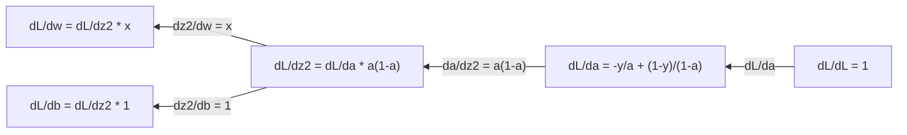
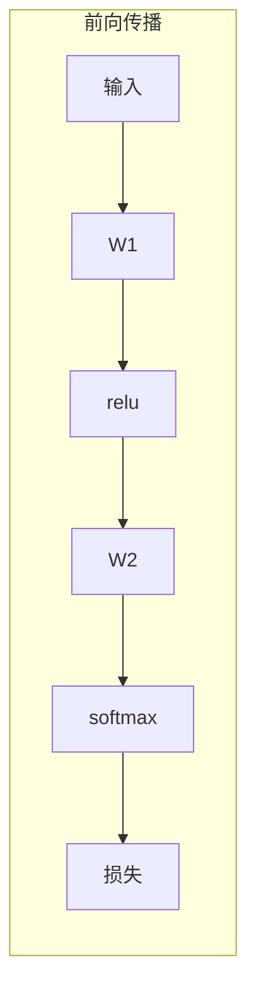
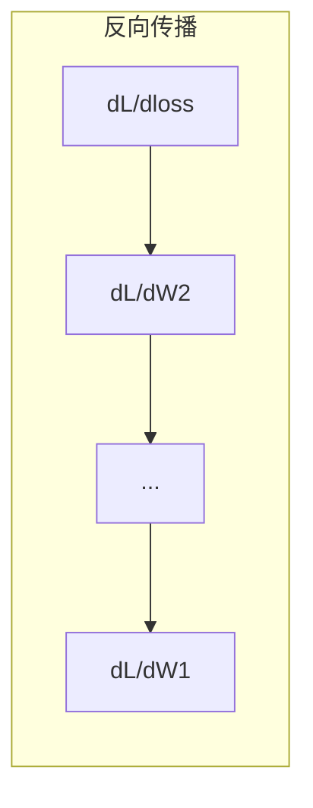

# 机器学习中的微积分

> 导数告诉你哪个方向是下坡。这就是神经网络学习所需要的全部。

**类型：** 学习
**语言：** Python
**前置要求：** 阶段 1，第 01-03 课
**时间：** 约 60 分钟

## 学习目标

- 计算常见 ML 函数（x²、sigmoid、交叉熵）的数值导数和解析导数
- 从零实现梯度下降，在一维和二维中最小化损失函数
- 推导线性回归模型的梯度，通过手动权重更新进行训练
- 解释 Hessian 矩阵、Taylor 级数近似及其与优化方法的关联

## 问题

你有一个拥有数百万权重的神经网络，每个权重都是一个旋钮。你需要弄清楚每个旋钮应该朝哪个方向转，才能让模型稍微少错一点。微积分给你这个方向。

没有微积分，训练神经网络就是随机尝试调整然后期待最好的结果。有了导数，你就能精确地知道每个权重如何影响误差，每次都能正确地转动每个旋钮。

## 概念

### 什么是导数？

导数衡量变化率。对于函数 y = f(x)，导数 f'(x) 告诉你：如果将 x 轻微移动一点，y 会变化多少？

从几何上看，导数是某点处切线的斜率。

**f(x) = x²：**

| x | f(x) | f'(x)（斜率） |
|---|------|--------------|
| 0 | 0    | 0（平坦，在底部） |
| 1 | 1    | 2 |
| 2 | 4    | 4（该点切线斜率） |
| 3 | 9    | 6 |

在 x=2 处，斜率为 4。如果将 x 向右移动一点，y 大约增加该量的 4 倍。在 x=0 处，斜率为 0，你处于碗底。

形式化定义：

```
f'(x) = lim   f(x + h) - f(x)
        h->0  -----------------
                     h
```

在代码中，跳过极限过程，直接使用一个非常小的 h，这就是数值导数。

### 偏导数：每次对一个变量求导

真实函数有许多输入，神经网络的损失依赖于数千个权重。偏导数将所有其他变量视为常数，只对其中一个变量求导。

```
f(x, y) = x² + 3xy + y²

∂f/∂x = 2x + 3y     （把 y 当常数）
∂f/∂y = 3x + 2y     （把 x 当常数）
```

每个偏导数回答：如果只微调这一个权重，损失会如何变化？

### 梯度：所有偏导数组成的向量

梯度将每个偏导数收集到一个向量中。对于函数 f(x, y, z)，梯度为：

```
∇f = [ ∂f/∂x, ∂f/∂y, ∂f/∂z ]
```

梯度指向最陡上升的方向，要最小化函数，就朝相反方向走。

**f(x,y) = x² + y² 的等高线：**

函数呈碗形，等高线为同心圆，最小值在 (0, 0)。

| 点 | 梯度 | -梯度（下降方向） |
|----|------|-----------------|
| (1, 1) | [2, 2]（指向上坡，远离最小值） | [-2, -2]（指向下坡，朝向最小值） |
| (0, 0) | [0, 0]（平坦，在最小值处） | [0, 0] |

这就是梯度下降的图示：计算梯度，取反，迈出一步。

### 与优化的关联

训练神经网络就是优化。你有一个损失函数 L(w1, w2, ..., wn) 衡量模型的错误程度，你要最小化它。

```
梯度下降更新规则：

  w_new = w_old - learning_rate * ∂L/∂w

对每个权重：
  1. 计算损失关于该权重的偏导数
  2. 从权重中减去它的一小倍数
  3. 重复
```

学习率控制步长。太大会越过最小值，太小则爬行般缓慢。

**损失曲面（一维切片）：**

| 特征 | 描述 |
|------|------|
| 全局最小值 | 整条曲线上最低的点——最优解 |
| 局部最小值 | 比邻近点低但不是全局最低的谷 |
| 斜率 | 梯度下降从任意起点沿斜率向下走 |

梯度下降沿斜率向下走，可能陷入局部最小值，但在高维空间（数百万权重）中，这在实践中很少是问题。

### 数值导数 vs 解析导数

有两种方法计算导数。

解析法：手动应用微积分规则。对于 f(x) = x²，导数是 f'(x) = 2x，精确且快速。

数值法：使用定义近似计算，对一个很小的 h 计算 f(x+h) 和 f(x-h)，然后用差商近似。

```
数值法（中心差分）：

f'(x) ≈ f(x + h) - f(x - h)
         -----------------------
                  2h

h = 0.0001 在实践中效果良好
```

数值导数速度较慢，但适用于任何函数。解析导数速度快，但需要你自行推导公式。神经网络框架使用第三种方法：自动微分，以机械方式计算精确导数，这在阶段 3 中会介绍。

### 简单函数的手算导数

这些是你在 ML 中会反复看到的导数。

```
函数                  导数                    应用
----                  ----                    ----
f(x) = x²            f'(x) = 2x              损失函数（MSE）
f(x) = wx + b        f'(w) = x               线性层（关于权重的梯度）
                      f'(b) = 1               线性层（关于偏置的梯度）
                      f'(x) = w               线性层（关于输入的梯度）
f(x) = e^x           f'(x) = e^x             Softmax、注意力机制
f(x) = ln(x)         f'(x) = 1/x             交叉熵损失
f(x) = 1/(1+e^-x)    f'(x) = f(x)(1-f(x))   Sigmoid 激活函数
```

对于 f(x) = x²：

```
f(x) = x²    f'(x) = 2x

  x     f(x)   f'(x)   含义
  -2     4      -4      斜率向左倾斜（递减）
  -1     1      -2      斜率向左倾斜（递减）
   0     0       0      平坦（最小值！）
   1     1       2      斜率向右倾斜（递增）
   2     4       4      斜率向右倾斜（递增）
```

对于 x=3, b=1 时的 f(w) = wx + b：

```
f(w) = 3w + 1    f'(w) = 3

关于 w 的导数就是 x。
如果 x 很大，w 的微小变化会导致输出的巨大变化。
```

### 链式法则

当函数相互嵌套时，链式法则告诉你如何求导。

```
如果 y = f(g(x))，则 dy/dx = f'(g(x)) * g'(x)

示例：y = (3x + 1)²
  外层：f(u) = u²       f'(u) = 2u
  内层：g(x) = 3x + 1   g'(x) = 3
  dy/dx = 2(3x + 1) * 3 = 6(3x + 1)
```

神经网络是函数的链：输入 → 线性层 → 激活函数 → 线性层 → 激活函数 → 损失。反向传播就是从输出到输入反复应用链式法则，这就是整个算法。

### Hessian 矩阵

梯度告诉你斜率，Hessian 矩阵告诉你曲率。

Hessian 是二阶偏导数组成的矩阵。对于函数 f(x1, x2, ..., xn)，Hessian 的第 (i, j) 项为：

```
H[i][j] = ∂²f / (∂x_i ∂x_j)
```

对于二变量函数 f(x, y)：

```
H = | ∂²f/∂x²    ∂²f/∂x∂y |
    | ∂²f/∂y∂x   ∂²f/∂y²  |
```

**Hessian 在临界点（梯度为 0 处）的含义：**

| Hessian 性质 | 含义 | 曲面示例 |
|-------------|------|---------|
| 正定（所有特征值 > 0）| 局部最小值 | 开口朝上的碗 |
| 负定（所有特征值 < 0）| 局部最大值 | 开口朝下的碗 |
| 不定（特征值有正有负）| 鞍点 | 马鞍形 |

**示例：** f(x, y) = x² - y²（鞍函数）

```
∂f/∂x = 2x       ∂f/∂y = -2y
∂²f/∂x² = 2      ∂²f/∂y² = -2    ∂²f/∂x∂y = 0

H = | 2   0 |
    | 0  -2 |

特征值：2 和 -2（一正一负）
--> (0, 0) 是鞍点
```

与 f(x, y) = x² + y²（碗形）对比：

```
H = | 2  0 |
    | 0  2 |

特征值：2 和 2（均为正）
--> (0, 0) 是局部最小值
```

**Hessian 在 ML 中的重要性：**

牛顿法使用 Hessian 比梯度下降迈出更好的优化步骤，它不只是沿斜率走，还考虑了曲率：

```
牛顿法更新：   w_new = w_old - H^(-1) * 梯度
梯度下降：     w_new = w_old - lr * 梯度
```

牛顿法收敛更快，因为 Hessian "重新缩放"了梯度——陡峭方向步伐更小，平坦方向步伐更大。

问题在于：对于有 N 个参数的神经网络，Hessian 是 N×N 矩阵。一百万参数的模型需要一兆项的矩阵，这就是为什么我们使用近似方法。

| 方法 | 使用什么 | 计算代价 | 收敛速度 |
|------|---------|---------|---------|
| 梯度下降 | 仅一阶导数 | O(N)/步 | 慢（线性） |
| 牛顿法 | 完整 Hessian | O(N³)/步 | 快（二次） |
| L-BFGS | 从梯度历史近似 Hessian | O(N)/步 | 中等（超线性） |
| Adam | 每参数自适应率（对角 Hessian 近似）| O(N)/步 | 中等 |
| 自然梯度 | Fisher 信息矩阵（统计 Hessian）| O(N²)/步 | 快 |

实践中，Adam 是深度学习的默认优化器，通过追踪每个参数的梯度均值和方差，廉价地近似二阶信息。

### Taylor 级数近似

任何光滑函数都可以在局部用多项式近似：

```
f(x + h) = f(x) + f'(x)·h + (1/2)·f''(x)·h² + (1/6)·f'''(x)·h³ + ...
```

包含的项越多，近似越好——但只在 x 附近有效。

**Taylor 级数在 ML 中的重要性：**

- **一阶 Taylor = 梯度下降。** 使用 f(x + h) ≈ f(x) + f'(x)·h 是线性近似，梯度下降通过最小化这个线性模型来选择 h = -lr × f'(x)。

- **二阶 Taylor = 牛顿法。** 使用 f(x + h) ≈ f(x) + f'(x)·h + (1/2)·f''(x)·h²，得到二次模型，最小化它给出 h = -f'(x)/f''(x)——即牛顿步。

- **损失函数设计。** MSE 和交叉熵是光滑的，意味着它们的 Taylor 展开性质良好。这不是偶然，光滑损失让优化过程可预测。

```
近似阶数         捕获内容        优化方法
------           --------        --------
0 阶（常数）     仅函数值        随机搜索
1 阶（线性）     斜率            梯度下降
2 阶（二次）     曲率            牛顿法
更高阶           更精细的结构    在 ML 中极少使用
```

关键洞察：所有基于梯度的优化实际上都是在局部近似损失函数，然后走到该近似的最小值处。

### ML 中的积分

导数告诉你变化率，积分计算累积量——曲线下的面积。

在 ML 中你很少手动计算积分，但这个概念无处不在：

**概率。** 对于密度为 p(x) 的连续随机变量：
```
P(a < X < b) = ∫从a到b p(x) dx
```
a 到 b 之间概率密度曲线下的面积就是落在该区间的概率。

**期望值。** 按概率加权的平均结果：
```
E[f(X)] = ∫ f(x) * p(x) dx
```
数据分布上的期望损失是一个积分，训练最小化的是其经验近似。

**KL 散度。** 衡量两个分布的差异程度：
```
KL(p || q) = ∫ p(x) * log(p(x) / q(x)) dx
```
用于 VAE、知识蒸馏和贝叶斯推断。

**归一化常数。** 在贝叶斯推断中：
```
p(w | 数据) = p(数据 | w) * p(w) / ∫ p(数据 | w) * p(w) dw
```
分母是对所有可能参数值的积分，通常难以处理，这就是为什么我们使用 MCMC 和变分推断等近似方法。

| 积分概念 | 在 ML 中的应用 |
|---------|-------------|
| 曲线下面积 | 从密度函数求概率 |
| 期望值 | 损失函数、风险最小化 |
| KL 散度 | VAE、策略优化、知识蒸馏 |
| 归一化 | 贝叶斯后验、softmax 分母 |
| 边际似然 | 模型比较、证据下界（ELBO） |

### 计算图中的多变量链式法则

链式法则不只适用于线性排列的标量函数。在神经网络中，变量可以分支和合并，导数以如下方式流动：


反向传播从右到左计算梯度：



每条箭头乘以局部导数。任何参数的梯度都是从损失到该参数路径上所有局部导数的乘积。当路径分支和合并时，将贡献相加（多变量链式法则）。

这就是反向传播的全部：通过计算图从输出到输入系统地应用链式法则。

### Jacobian 矩阵

当函数将向量映射到向量时（如神经网络层），其导数是一个矩阵。Jacobian 包含每个输出关于每个输入的所有偏导数。

对于 f: R^n → R^m，Jacobian J 是 m×n 矩阵：

| | x1 | x2 | ... | xn |
|---|---|---|---|---|
| f1 | ∂f1/∂x1 | ∂f1/∂x2 | ... | ∂f1/∂xn |
| f2 | ∂f2/∂x1 | ∂f2/∂x2 | ... | ∂f2/∂xn |
| ... | ... | ... | ... | ... |
| fm | ∂fm/∂x1 | ∂fm/∂x2 | ... | ∂fm/∂xn |

你不需要手动为神经网络计算 Jacobian，PyTorch 会处理。但了解它的存在有助于理解反向传播中的形状：如果一层将 R^n 映射到 R^m，其 Jacobian 是 m×n，梯度通过这个矩阵的转置反向流动。

### 为什么这对神经网络很重要

神经网络中的每个权重都有一个梯度，梯度告诉你如何调整该权重以降低损失。





每个权重更新：
- `W1 = W1 - lr * dL/dW1`
- `W2 = W2 - lr * dL/dW2`

前向传播计算预测和损失，反向传播计算损失关于每个权重的梯度，然后每个权重向下坡方向迈一小步。重复数百万次，这就是深度学习。

## 动手实现

### 第一步：从零实现数值导数

```python
def numerical_derivative(f, x, h=1e-7):
    return (f(x + h) - f(x - h)) / (2 * h)

def f(x):
    return x ** 2

for x in [-2, -1, 0, 1, 2]:
    numerical = numerical_derivative(f, x)
    analytical = 2 * x
    print(f"x={x:2d}  f'(x) 数值={numerical:.6f}  解析={analytical:.1f}")
```

数值导数与解析结果精确到多位小数。

### 第二步：偏导数和梯度

```python
def numerical_gradient(f, point, h=1e-7):
    gradient = []
    for i in range(len(point)):
        point_plus = list(point)
        point_minus = list(point)
        point_plus[i] += h
        point_minus[i] -= h
        partial = (f(point_plus) - f(point_minus)) / (2 * h)
        gradient.append(partial)
    return gradient

def f_multi(point):
    x, y = point
    return x**2 + 3*x*y + y**2

grad = numerical_gradient(f_multi, [1.0, 2.0])
print(f"(1,2) 处的数值梯度: {[f'{g:.4f}' for g in grad]}")
print(f"(1,2) 处的解析梯度: [2*1+3*2, 3*1+2*2] = [{2*1+3*2}, {3*1+2*2}]")
```

### 第三步：梯度下降求 f(x) = x² 的最小值

```python
x = 5.0
lr = 0.1
for step in range(20):
    grad = 2 * x
    x = x - lr * grad
    print(f"step {step:2d}  x={x:8.4f}  f(x)={x**2:10.6f}")
```

从 x=5 出发，每步越来越接近 x=0（最小值）。

### 第四步：二维函数的梯度下降

```python
def f_2d(point):
    x, y = point
    return x**2 + y**2

point = [4.0, 3.0]
lr = 0.1
for step in range(30):
    grad = numerical_gradient(f_2d, point)
    point = [p - lr * g for p, g in zip(point, grad)]
    loss = f_2d(point)
    if step % 5 == 0 or step == 29:
        print(f"step {step:2d}  point=({point[0]:7.4f}, {point[1]:7.4f})  f={loss:.6f}")
```

### 第五步：比较数值导数和解析导数

```python
import math

test_functions = [
    ("x^2",      lambda x: x**2,          lambda x: 2*x),
    ("x^3",      lambda x: x**3,          lambda x: 3*x**2),
    ("sin(x)",   lambda x: math.sin(x),   lambda x: math.cos(x)),
    ("e^x",      lambda x: math.exp(x),   lambda x: math.exp(x)),
    ("1/x",      lambda x: 1/x,           lambda x: -1/x**2),
]

x = 2.0
print(f"{'函数':<12} {'数值':>12} {'解析':>12} {'误差':>12}")
print("-" * 50)
for name, f, df in test_functions:
    num = numerical_derivative(f, x)
    ana = df(x)
    err = abs(num - ana)
    print(f"{name:<12} {num:12.6f} {ana:12.6f} {err:12.2e}")
```

### 第六步：数值计算 Hessian

```python
def hessian_2d(f, x, y, h=1e-5):
    fxx = (f(x + h, y) - 2 * f(x, y) + f(x - h, y)) / (h ** 2)
    fyy = (f(x, y + h) - 2 * f(x, y) + f(x, y - h)) / (h ** 2)
    fxy = (f(x + h, y + h) - f(x + h, y - h) - f(x - h, y + h) + f(x - h, y - h)) / (4 * h ** 2)
    return [[fxx, fxy], [fxy, fyy]]

def saddle(x, y):
    return x ** 2 - y ** 2

def bowl(x, y):
    return x ** 2 + y ** 2

H_saddle = hessian_2d(saddle, 0.0, 0.0)
H_bowl = hessian_2d(bowl, 0.0, 0.0)
print(f"鞍函数 Hessian: {H_saddle}")  # [[2, 0], [0, -2]] -- 特征值符号混合
print(f"碗形函数 Hessian: {H_bowl}")  # [[2, 0], [0, 2]] -- 均为正
```

鞍函数的 Hessian 特征值为 2 和 -2（符号混合，确认鞍点），碗形函数特征值为 2 和 2（均为正，确认最小值）。

### 第七步：Taylor 近似实践

```python
import math

def taylor_approx(f, f_prime, f_double_prime, x0, h, order=2):
    result = f(x0)
    if order >= 1:
        result += f_prime(x0) * h
    if order >= 2:
        result += 0.5 * f_double_prime(x0) * h ** 2
    return result

x0 = 0.0
for h in [0.1, 0.5, 1.0, 2.0]:
    true_val = math.sin(h)
    t1 = taylor_approx(math.sin, math.cos, lambda x: -math.sin(x), x0, h, order=1)
    t2 = taylor_approx(math.sin, math.cos, lambda x: -math.sin(x), x0, h, order=2)
    print(f"h={h:.1f}  sin(h)={true_val:.4f}  一阶={t1:.4f}  二阶={t2:.4f}")
```

在 x0=0 附近，sin(x) ≈ x（一阶 Taylor）。对于小 h 近似效果很好，但对于大 h 会失效。这就是为什么梯度下降在小学习率下效果最好——每步都假设线性近似是准确的。

### 第八步：这对神经网络意味着什么

```python
import random

random.seed(42)

w = random.gauss(0, 1)
b = random.gauss(0, 1)
lr = 0.01

xs = [1.0, 2.0, 3.0, 4.0, 5.0]
ys = [3.0, 5.0, 7.0, 9.0, 11.0]

for epoch in range(200):
    total_loss = 0
    dw = 0
    db = 0
    for x, y in zip(xs, ys):
        pred = w * x + b
        error = pred - y
        total_loss += error ** 2
        dw += 2 * error * x
        db += 2 * error
    dw /= len(xs)
    db /= len(xs)
    total_loss /= len(xs)
    w -= lr * dw
    b -= lr * db
    if epoch % 40 == 0 or epoch == 199:
        print(f"epoch {epoch:3d}  w={w:.4f}  b={b:.4f}  loss={total_loss:.6f}")

print(f"\n学到的：y = {w:.2f}x + {b:.2f}")
print(f"真实值：y = 2x + 1")
```

每个基于梯度的训练循环都遵循这个模式：预测、计算损失、计算梯度、更新权重。

## 实际使用

用 NumPy，同样的操作更简洁更快速：

```python
import numpy as np

x = np.array([1, 2, 3, 4, 5], dtype=float)
y = np.array([3, 5, 7, 9, 11], dtype=float)

w, b = np.random.randn(), np.random.randn()
lr = 0.01

for epoch in range(200):
    pred = w * x + b
    error = pred - y
    loss = np.mean(error ** 2)
    dw = np.mean(2 * error * x)
    db = np.mean(2 * error)
    w -= lr * dw
    b -= lr * db

print(f"学到的：y = {w:.2f}x + {b:.2f}")
```

你刚刚从零实现了梯度下降。PyTorch 自动完成梯度计算，但更新循环完全相同。

## 练习

1. 实现 `numerical_second_derivative(f, x)`，通过调用两次 `numerical_derivative` 来实现。验证 x³ 在 x=2 处的二阶导数为 12。
2. 使用梯度下降求 f(x, y) = (x - 3)² + (y + 1)² 的最小值，从 (0, 0) 出发，答案应收敛到 (3, -1)。
3. 为梯度下降循环添加动量：维护一个累积过去梯度的速度向量。在 f(x) = x⁴ - 3x² 上比较有无动量的收敛速度。

## 关键术语

| 术语 | 大家怎么说 | 实际含义 |
|------|----------------|----------------------|
| 导数（Derivative）| "斜率" | 函数在某点的变化率，告诉你输入每变化一个单位时输出如何变化 |
| 偏导数（Partial derivative）| "对一个变量的导数" | 保持其他所有变量不变时对某一变量的导数 |
| 梯度（Gradient）| "最陡上升方向" | 所有偏导数组成的向量，指向函数增长最快的方向 |
| 梯度下降（Gradient descent）| "走下坡" | 从参数中减去梯度（乘以学习率）以降低损失，是神经网络训练的核心 |
| 学习率（Learning rate）| "步长" | 控制每步梯度下降大小的标量，太大会发散，太小会收敛缓慢 |
| 链式法则（Chain rule）| "导数相乘" | 对复合函数求导的规则：df/dx = df/dg × dg/dx，反向传播的数学基础 |
| Jacobian 矩阵（Jacobian）| "导数矩阵" | 当函数将向量映射到向量时，Jacobian 是所有输出关于所有输入的偏导数矩阵 |
| 数值导数（Numerical derivative）| "有限差分" | 通过在两个相近点求函数值并计算斜率来近似导数 |
| 反向传播（Backpropagation）| "反向自动微分" | 使用链式法则从输出到输入逐层计算梯度，神经网络的学习方式 |
| Hessian 矩阵（Hessian）| "二阶导数矩阵" | 所有二阶偏导数组成的矩阵，描述函数的曲率，临界点处正定 Hessian 意味着局部最小值 |
| Taylor 级数（Taylor series）| "多项式近似" | 用导数在某点附近近似函数：f(x+h) ≈ f(x) + f'(x)h + (1/2)f''(x)h² + ...，是理解梯度下降和牛顿法原理的基础 |
| 积分（Integral）| "曲线下面积" | 某一范围内量的累积，在 ML 中积分定义概率、期望值和 KL 散度 |

## 延伸阅读

- [3Blue1Brown：微积分的本质](https://www.3blue1brown.com/topics/calculus) — 导数、积分和链式法则的视觉直觉
- [Stanford CS231n：反向传播](https://cs231n.github.io/optimization-2/) — 梯度如何在神经网络层间流动
