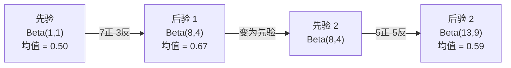

# 贝叶斯定理

> 概率关乎你的预期。贝叶斯定理关乎你的学习。

**类型：** 实践
**语言：** Python
**前置要求：** 阶段 1，第 06 课（概率基础）
**时间：** 约 75 分钟

## 学习目标

- 应用贝叶斯定理，从先验、似然和证据计算后验概率
- 从零构建朴素贝叶斯文本分类器，使用拉普拉斯平滑和对数空间计算
- 比较 MLE 和 MAP 估计，解释 MAP 如何对应 L2 正则化
- 使用 Beta-二项共轭先验为 A/B 测试实现序贯贝叶斯更新

## 问题

一项医学检测准确率为 99%。你检测呈阳性。你实际患病的概率是多少？

大多数人会说 99%。真实答案取决于疾病有多罕见。如果每 10,000 人中只有 1 人患病，阳性结果只给你约 1% 的患病概率。其余 99% 的阳性结果都是健康人的假阳性。

这不是脑筋急转弯，这就是贝叶斯定理。每个垃圾邮件过滤器、每个医疗诊断、每个量化不确定性的机器学习模型都使用这个推理方式。你从一个信念出发，看到证据，然后更新信念。

如果在不理解这些的情况下构建 ML 系统，你会误解模型输出、设置错误的阈值，并发布过度自信的预测。

## 概念

### 从联合概率到贝叶斯

你已经在第 06 课中学到，条件概率是：

```
P(A|B) = P(A 且 B) / P(B)
```

对称地：

```
P(B|A) = P(A 且 B) / P(A)
```

两个表达式共享同一个分子：P(A 且 B)。令它们相等并整理：

```
P(A 且 B) = P(A|B) * P(B) = P(B|A) * P(A)

因此：

P(A|B) = P(B|A) * P(A) / P(B)
```

这就是贝叶斯定理。四个量，一个方程。

### 四个组成部分

| 组成 | 名称 | 含义 |
|------|------|------|
| P(A\|B) | 后验 | 看到证据 B 后对 A 的更新信念 |
| P(B\|A) | 似然 | 若 A 为真，证据 B 出现的概率 |
| P(A) | 先验 | 看到任何证据之前对 A 的信念 |
| P(B) | 证据 | 在所有可能情况下看到 B 的总概率 |

证据项 P(B) 起归一化作用。你可以用全概率公式展开它：

```
P(B) = P(B|A) * P(A) + P(B|非A) * P(非A)
```

### 医学检测示例

一种疾病影响万分之一的人。检测准确率为 99%（能检出 99% 的患者，1% 的假阳性率）。

```
P(患病)        = 0.0001   （先验：疾病罕见）
P(阳性|患病)   = 0.99     （似然：检测能检出）
P(阳性|健康)   = 0.01     （假阳性率）

P(阳性) = P(阳性|患病) * P(患病) + P(阳性|健康) * P(健康)
        = 0.99 * 0.0001 + 0.01 * 0.9999
        = 0.000099 + 0.009999
        = 0.010098

P(患病|阳性) = P(阳性|患病) * P(患病) / P(阳性)
             = 0.99 * 0.0001 / 0.010098
             = 0.0098
             = 0.98%
```

不到 1%。先验主导一切。当某种状况很罕见时，即使准确率很高的检测也会产生大量假阳性。这就是为什么医生要进行确认检测。

### 垃圾邮件过滤示例

你收到一封包含"抽奖"字样的邮件。它是垃圾邮件吗？

```
P(垃圾邮件)          = 0.3    （30% 的邮件是垃圾邮件）
P("抽奖"|垃圾邮件)   = 0.05   （5% 的垃圾邮件含"抽奖"）
P("抽奖"|正常邮件)   = 0.001  （0.1% 的正常邮件含"抽奖"）

P("抽奖") = 0.05 * 0.3 + 0.001 * 0.7
          = 0.015 + 0.0007
          = 0.0157

P(垃圾邮件|"抽奖") = 0.05 * 0.3 / 0.0157
                  = 0.955
                  = 95.5%
```

一个词让概率从 30% 跃升至 95.5%。真实的垃圾邮件过滤器会同时对数百个词应用贝叶斯定理。

### 朴素贝叶斯：独立性假设

朴素贝叶斯通过假设所有特征在给定类别的条件下相互独立，将贝叶斯定理扩展到多个特征：

```
P(类别 | 特征_1, 特征_2, ..., 特征_n)
  = P(类别) * P(特征_1|类别) * P(特征_2|类别) * ... * P(特征_n|类别)
    / P(特征_1, 特征_2, ..., 特征_n)
```

"朴素"就是这个独立性假设。在文本中，词的出现并非独立（"New"和"York"是相关的）。但这个假设在实践中效果出奇地好，因为分类器只需要对类别排序，不需要产生精确校准的概率。

由于分母对所有类别相同，你可以跳过它，只比较分子：

```
得分(类别) = P(类别) * 所有 P(特征_i | 类别) 的乘积
```

选择得分最高的类别。

### 最大似然估计（MLE）

如何从训练数据获得 P(特征|类别)？计数。

```
P("免费"|垃圾邮件) = (含"免费"的垃圾邮件数) / (垃圾邮件总数)
```

这就是 MLE：选择使观测数据最可能出现的参数值。你在最大化似然函数，对于离散计数，这等价于相对频率。

问题：如果某个词在训练时从未出现在垃圾邮件中，MLE 给它的概率为零。一个未见过的词会使整个乘积归零。用拉普拉斯平滑解决这个问题：

```
P(词|类别) = (count(词, 类别) + 1) / (类别中的总词数 + 词汇量)
```

对每个计数加 1，确保没有概率为零。

### 最大后验估计（MAP）

MLE 问：什么参数使 P(数据|参数) 最大？

MAP 问：什么参数使 P(参数|数据) 最大？

由贝叶斯定理：

```
P(参数|数据) 正比于 P(数据|参数) * P(参数)
```

MAP 对参数本身增加了一个先验。如果你相信参数应该较小，就将其编码为惩罚大值的先验。这与 ML 中的 L2 正则化完全相同。岭回归中的"岭"惩罚就是字面意义上的权重高斯先验。

| 估计方法 | 最优化 | ML 对应 |
|----------|--------|---------|
| MLE | P(数据\|参数) | 无正则化训练 |
| MAP | P(数据\|参数) * P(参数) | L2/L1 正则化 |

### 贝叶斯派 vs 频率派：实践中的区别

频率派将参数视为固定的未知量。他们问："如果重复这个实验多次，会发生什么？"

贝叶斯派将参数视为分布。他们问："根据我观察到的，我对参数有什么信念？"

在构建 ML 系统时，实践差异：

| 方面 | 频率派 | 贝叶斯派 |
|------|--------|---------|
| 输出 | 点估计 | 值的分布 |
| 不确定性 | 置信区间（关于过程） | 可信区间（关于参数） |
| 小数据 | 可能过拟合 | 先验作为正则化 |
| 计算 | 通常更快 | 常需要采样（MCMC） |

大多数生产 ML 是频率派的（SGD、点估计）。贝叶斯方法在需要校准不确定性（医疗决策、安全关键系统）或数据稀少时（少样本学习、冷启动）大放异彩。

### 为什么贝叶斯思维对 ML 重要

这种联系比类比更深：

**先验就是正则化。** 权重的高斯先验就是 L2 正则化。拉普拉斯先验就是 L1。每次添加正则化项，你都在做关于期望参数值的贝叶斯陈述。

**后验就是不确定性。** 单一预测概率不能告诉你模型对该估计有多确信。贝叶斯方法给你一个分布："我认为 P(垃圾邮件) 在 0.8 到 0.95 之间。"

**贝叶斯更新就是在线学习。** 今天的后验变成明天的先验。当模型看到新数据时，它增量地更新信念，而不是从头重新训练。

**模型比较是贝叶斯的。** 贝叶斯信息准则（BIC）、边缘似然和贝叶斯因子都使用贝叶斯推理在不过拟合的情况下选择模型。

## 动手实现

### 第一步：贝叶斯定理函数

```python
def bayes(prior, likelihood, false_positive_rate):
    evidence = likelihood * prior + false_positive_rate * (1 - prior)
    posterior = likelihood * prior / evidence
    return posterior

result = bayes(prior=0.0001, likelihood=0.99, false_positive_rate=0.01)
print(f"P(患病|阳性) = {result:.4f}")
```

### 第二步：朴素贝叶斯分类器

```python
import math
from collections import defaultdict

class NaiveBayes:
    def __init__(self, smoothing=1.0):
        self.smoothing = smoothing
        self.class_counts = defaultdict(int)
        self.word_counts = defaultdict(lambda: defaultdict(int))
        self.class_word_totals = defaultdict(int)
        self.vocab = set()

    def train(self, documents, labels):
        for doc, label in zip(documents, labels):
            self.class_counts[label] += 1
            words = doc.lower().split()
            for word in words:
                self.word_counts[label][word] += 1
                self.class_word_totals[label] += 1
                self.vocab.add(word)

    def predict(self, document):
        words = document.lower().split()
        total_docs = sum(self.class_counts.values())
        vocab_size = len(self.vocab)
        best_class = None
        best_score = float("-inf")
        for cls in self.class_counts:
            score = math.log(self.class_counts[cls] / total_docs)
            for word in words:
                count = self.word_counts[cls].get(word, 0)
                total = self.class_word_totals[cls]
                score += math.log((count + self.smoothing) / (total + self.smoothing * vocab_size))
            if score > best_score:
                best_score = score
                best_class = cls
        return best_class
```

对数概率防止下溢。将许多小概率相乘会产生浮点数无法表示的极小数字。对数概率求和在数值上稳定且数学等价。

### 第三步：在垃圾邮件数据上训练

```python
train_docs = [
    "win free money now",
    "free lottery ticket winner",
    "claim your prize today free",
    "urgent offer free cash",
    "congratulations you won free",
    "meeting tomorrow at noon",
    "project update attached",
    "can we schedule a call",
    "quarterly report review",
    "lunch on thursday sounds good",
    "team standup notes attached",
    "please review the pull request",
]

train_labels = [
    "spam", "spam", "spam", "spam", "spam",
    "ham", "ham", "ham", "ham", "ham", "ham", "ham",
]

classifier = NaiveBayes()
classifier.train(train_docs, train_labels)

test_messages = [
    "free money waiting for you",
    "meeting rescheduled to friday",
    "you won a free prize",
    "please review the attached report",
]

for msg in test_messages:
    print(f"  '{msg}' -> {classifier.predict(msg)}")
```

### 第四步：查看学到的概率

```python
def show_top_words(classifier, cls, n=5):
    vocab_size = len(classifier.vocab)
    total = classifier.class_word_totals[cls]
    probs = {}
    for word in classifier.vocab:
        count = classifier.word_counts[cls].get(word, 0)
        probs[word] = (count + classifier.smoothing) / (total + classifier.smoothing * vocab_size)
    sorted_words = sorted(probs.items(), key=lambda x: x[1], reverse=True)
    for word, prob in sorted_words[:n]:
        print(f"    {word}: {prob:.4f}")

print("\n垃圾邮件高频词：")
show_top_words(classifier, "spam")
print("\n正常邮件高频词：")
show_top_words(classifier, "ham")
```

## 实际使用

scikit-learn 提供了生产就绪的朴素贝叶斯实现：

```python
from sklearn.feature_extraction.text import CountVectorizer
from sklearn.naive_bayes import MultinomialNB
from sklearn.metrics import classification_report

vectorizer = CountVectorizer()
X_train = vectorizer.fit_transform(train_docs)
clf = MultinomialNB()
clf.fit(X_train, train_labels)

X_test = vectorizer.transform(test_messages)
predictions = clf.predict(X_test)
for msg, pred in zip(test_messages, predictions):
    print(f"  '{msg}' -> {pred}")
```

算法相同。CountVectorizer 处理分词和词汇表构建。MultinomialNB 内部处理平滑和对数概率。你的从零实现用 40 行代码做了同样的事情。

## 交付产出

这里构建的 NaiveBayes 类演示了完整流程：分词、带拉普拉斯平滑的概率估计、对数空间预测。`code/bayes.py` 中的代码端到端运行，除 Python 标准库外无任何依赖。

### 共轭先验

当先验和后验属于同一分布族时，该先验称为"共轭"。这使贝叶斯更新在代数上非常简洁——无需数值积分即可得到封闭形式的后验。

| 似然 | 共轭先验 | 后验 | 示例 |
|------|----------|------|------|
| 伯努利 | Beta(a, b) | Beta(a + 成功次数, b + 失败次数) | 硬币偏差估计 |
| 正态（已知方差） | Normal(mu_0, sigma_0) | Normal(加权均值, 更小方差) | 传感器校准 |
| 泊松 | Gamma(a, b) | Gamma(a + 计数之和, b + n) | 到达率建模 |
| 多项 | Dirichlet(alpha) | Dirichlet(alpha + 计数) | 主题建模，语言模型 |

为什么这很重要：没有共轭先验，你需要蒙特卡洛采样或变分推断来近似后验。有了共轭先验，你只需更新两个数。

Beta 分布是实践中最常见的共轭先验。Beta(a, b) 表示你对某个概率参数的信念。均值为 a/(a+b)。a+b 越大，分布越集中（越确信）。

Beta 先验的特殊情况：
- Beta(1, 1) = 均匀分布。你对参数没有任何意见。
- Beta(10, 10) = 峰值在 0.5。你强烈相信参数接近 0.5。
- Beta(1, 10) = 偏向 0。你相信参数较小。

更新规则极其简单：

```
先验：     Beta(a, b)
数据：     s 次成功，f 次失败
后验：     Beta(a + s, b + f)
```

无积分。无采样。只需加法。

### 序贯贝叶斯更新

贝叶斯推断天然是序贯的。今天的后验变成明天的先验。这就是实际系统如何在不重新处理所有历史数据的情况下增量学习。

具体示例：估计硬币是否公平。

**第一天：尚无数据。**
从 Beta(1, 1) 开始——均匀先验。你没有任何意见。
- 先验均值：0.5
- 先验在 [0, 1] 上是平坦的

**第二天：观察到 7 次正面，3 次反面。**
后验 = Beta(1 + 7, 1 + 3) = Beta(8, 4)
- 后验均值：8/12 = 0.667
- 证据表明硬币偏向正面

**第三天：再观察到 5 次正面，5 次反面。**
将昨天的后验作为今天的先验。
后验 = Beta(8 + 5, 4 + 5) = Beta(13, 9)
- 后验均值：13/22 = 0.591
- 均衡的新数据将估计拉回了 0.5



观察顺序不影响结果。Beta(1,1) 一次性用 12 次正面和 8 次反面更新，得到 Beta(13, 9)——与序贯更新结果相同。序贯更新和批量更新数学上等价，但序贯更新让你在每一步都能做决策，无需存储原始数据。

这是生产 ML 系统中在线学习的基础。多臂老虎机的 Thompson 采样、增量推荐系统和流式异常检测器都使用这种模式。

### 与 A/B 测试的联系

A/B 测试本质上是贝叶斯推断。

设置：你在测试两种按钮颜色。变体 A（蓝色）和变体 B（绿色）。你想知道哪个获得更多点击。

贝叶斯 A/B 测试：

1. **先验。** 两个变体都从 Beta(1, 1) 开始。没有先验偏好。
2. **数据。** 变体 A：1000 次浏览中 50 次点击。变体 B：1000 次浏览中 65 次点击。
3. **后验。**
   - A：Beta(1 + 50, 1 + 950) = Beta(51, 951)，均值 = 0.051
   - B：Beta(1 + 65, 1 + 935) = Beta(66, 936)，均值 = 0.066
4. **决策。** 计算 P(B > A)——B 的真实转化率高于 A 的概率。

解析计算 P(B > A) 很困难，但蒙特卡洛使其变得简单：

```
1. 从 Beta(51, 951) 抽取 100,000 个样本  -> samples_A
2. 从 Beta(66, 936) 抽取 100,000 个样本  -> samples_B
3. P(B > A) = B > A 的样本比例
```

如果 P(B > A) > 0.95，发布变体 B。如果在 0.05 到 0.95 之间，继续收集数据。如果 P(B > A) < 0.05，发布变体 A。

相对于频率派 A/B 测试的优势：
- 你得到直接的概率陈述："有 97% 的概率 B 更好"
- 无 p 值混乱。不再需要"无法拒绝零假设"这样的表述。
- 任何时候都可以查看结果，不会导致假阳性率膨胀（无"偷看问题"）
- 可以融入先验知识（例如，以往测试表明转化率通常在 3-8%）

| 方面 | 频率派 A/B | 贝叶斯 A/B |
|------|-----------|-----------|
| 输出 | p 值 | P(B > A) |
| 解读 | "如果 A=B，这个数据有多令人惊讶？" | "B 比 A 好的可能性有多大？" |
| 提前停止 | 导致假阳性率膨胀 | 任何时候都安全（前提是先验选择合理且模型设定正确） |
| 先验知识 | 不使用 | 编码为 Beta 先验 |
| 决策规则 | p < 0.05 | P(B > A) > 阈值 |

## 练习

1. **多次检测。** 一名患者在两次独立检测中均呈阳性（两次准确率均为 99%，患病率 1/10,000）。两次检测后 P(患病) 是多少？将第一次检测的后验作为第二次的先验。

2. **平滑的影响。** 用 0.01、0.1、1.0 和 10.0 的平滑值运行垃圾邮件分类器。高频词的概率如何变化？当 smoothing=0 且某个词只出现在正常邮件中时会发生什么？

3. **添加特征。** 扩展 NaiveBayes 类，将消息长度（短/长）作为特征与词计数一起使用。从训练数据估计 P(短|垃圾邮件) 和 P(短|正常邮件)，并将其融入预测得分。

4. **手动 MAP。** 给定观测数据（10 次硬币翻转中 7 次正面），用 Beta(2,2) 先验计算偏差的 MAP 估计。与 MLE 估计（7/10）对比。

## 关键术语

| 术语 | 大家怎么说 | 实际含义 |
|------|------------|----------|
| 先验（Prior）| "我的初始猜测" | P(假设)，观察证据之前的信念。在 ML 中：正则化项。|
| 似然（Likelihood）| "数据的拟合程度" | P(证据\|假设)，特定假设下观测数据出现的概率。|
| 后验（Posterior）| "我的更新信念" | P(假设\|证据)，先验乘以似然后归一化。|
| 证据（Evidence）| "归一化常数" | 所有假设下的 P(数据)，确保后验之和为 1。|
| 朴素贝叶斯（Naive Bayes）| "那个简单的文本分类器" | 假设特征在给定类别下独立的分类器，尽管假设不成立，但效果很好。|
| 拉普拉斯平滑（Laplace smoothing）| "加一平滑" | 对每个特征加一个小计数，防止未见数据产生零概率。|
| MLE | "就用频率" | 选择使 P(数据\|参数) 最大的参数。无先验，小数据可能过拟合。|
| MAP | "有先验的 MLE" | 选择使 P(数据\|参数) * P(参数) 最大的参数，等价于正则化 MLE。|
| 对数概率（Log-probability）| "在对数空间工作" | 使用 log(P) 而非 P，避免乘以许多小数时的浮点下溢。|
| 假阳性（False positive）| "错误的警报" | 检测结果为阳性，但真实状态为阴性。基率谬误的驱动因素。|

## 延伸阅读

- [3Blue1Brown：贝叶斯定理](https://www.youtube.com/watch?v=HZGCoVF3YvM) — 医学检测示例的可视化讲解
- [Stanford CS229：生成学习算法](https://cs229.stanford.edu/notes2022fall/cs229-notes2.pdf) — 朴素贝叶斯及其与判别模型的联系
- [Think Bayes](https://greenteapress.com/wp/think-bayes/) — 免费书籍，用 Python 代码学贝叶斯统计
- [scikit-learn 朴素贝叶斯](https://scikit-learn.org/stable/modules/naive_bayes.html) — 生产实现及各变体的使用场景
