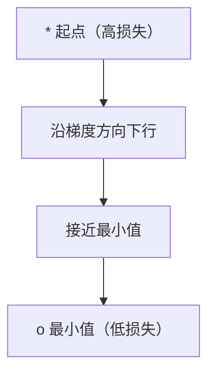
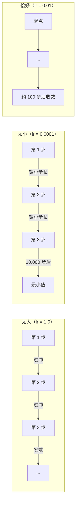
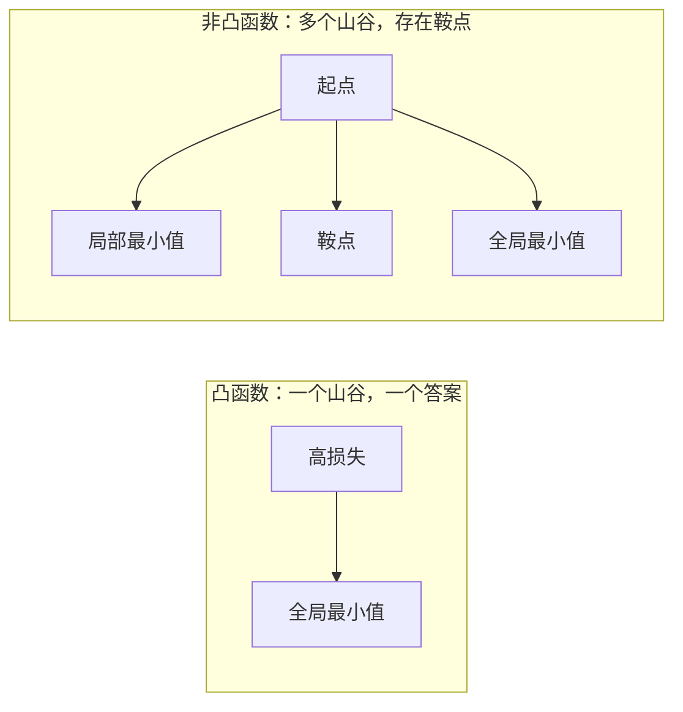
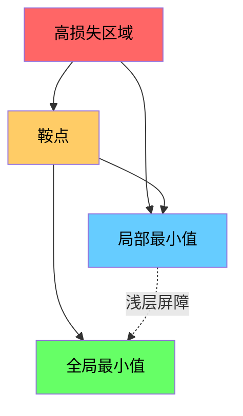

# 优化

> 训练神经网络不过是找到山谷的底部。

**类型：** 实践
**语言：** Python
**前置要求：** 阶段 1，第 04-05 课（导数、梯度）
**时间：** 约 75 分钟

## 学习目标

- 从零实现朴素梯度下降、带动量的 SGD 和 Adam
- 在 Rosenbrock 函数上对比各优化器的收敛速度，解释为什么 Adam 为每个权重自适应调整学习率
- 区分凸函数和非凸损失曲面，解释鞍点在高维中的作用
- 配置学习率调度（阶梯衰减、余弦退火、预热）以提高训练稳定性

## 问题

你有一个损失函数。它告诉你模型有多错。你有梯度。它们告诉你哪个方向会让损失更大。现在你需要一个向下走的策略。

最朴素的方法很简单：沿梯度反方向移动，步长由学习率控制，然后重复。这就是梯度下降，它确实有效。但"有效"是有条件的。学习率太大，你会完全飞过山谷，在两壁之间反弹。太小，你要走数千步才能爬到答案。遇到鞍点，即使还没找到最小值，你也会停下来。

深度学习中的每个优化器都是同一个问题的答案：怎样更快、更可靠地到达山谷底部？

## 概念

### 优化的含义

优化是找到使函数最小化（或最大化）的输入值。在机器学习中，函数是损失，输入是模型的权重。训练就是优化。

```
最小化 L(w)，其中：
  L = 损失函数
  w = 模型权重（可能有数百万个参数）
```

### 梯度下降（朴素版）

最简单的优化器。计算损失对每个权重的梯度，将每个权重沿梯度反方向移动，步长由学习率控制。

```
w = w - lr * gradient
```

整个算法就这一行。



### 学习率：最重要的超参数

学习率控制步长，决定收敛的一切。



没有公式能给出正确的学习率，只能通过实验寻找。常用起点：Adam 用 0.001，带动量的 SGD 用 0.01。

### SGD vs 批量 vs 小批量

朴素梯度下降在整个数据集上计算梯度后才迈一步，这叫批量梯度下降。稳定但慢。

随机梯度下降（SGD）在单个随机样本上计算梯度并立即更新。噪声大但快。

小批量梯度下降折中处理：在小批量数据（32、64、128、256 个样本）上计算梯度后更新。这是实际使用的方式。

| 变体 | 批量大小 | 梯度质量 | 每步速度 | 噪声 |
|------|----------|----------|----------|------|
| 批量 GD | 整个数据集 | 精确 | 慢 | 无 |
| SGD | 1 个样本 | 噪声很大 | 快 | 高 |
| 小批量 | 32-256 | 良好估计 | 均衡 | 适中 |

SGD 和小批量中的噪声不是缺陷，它有助于逃脱浅层局部最小值和鞍点。

### 动量：滚下山的球

朴素梯度下降只看当前梯度。如果梯度在窄谷中来回振荡（很常见），进展会很慢。动量通过将历史梯度累积为速度项来解决这个问题。

```
v = beta * v + gradient
w = w - lr * v
```

类比：一个滚下山的球。它不会在每个颠簸处停下重启。它在一致方向上积累速度，并抑制振荡。


`beta`（通常为 0.9）控制保留多少历史。beta 越大，动量越强，路径越平滑，但对方向变化的响应越慢。

### Adam：自适应学习率

不同的权重需要不同的学习率。一个很少获得大梯度的权重，最终获得大梯度时应该迈更大的步。一个总是获得巨大梯度的权重应该迈更小的步。

Adam（自适应矩估计）为每个权重跟踪两件事：

1. 一阶矩（m）：梯度的运行均值（类似动量）
2. 二阶矩（v）：梯度平方的运行均值（梯度量级）

```
m = beta1 * m + (1 - beta1) * gradient
v = beta2 * v + (1 - beta2) * gradient^2

m_hat = m / (1 - beta1^t)    偏差修正
v_hat = v / (1 - beta2^t)    偏差修正

w = w - lr * m_hat / (sqrt(v_hat) + epsilon)
```

除以 `sqrt(v_hat)` 是关键：梯度大的权重被一个大数除（实际步长小）；梯度小的权重被一个小数除（实际步长大）。每个权重都有自己的自适应学习率。

默认超参数：`lr=0.001, beta1=0.9, beta2=0.999, epsilon=1e-8`。这些默认值对大多数问题效果良好。

### 学习率调度

固定学习率是一种妥协。训练早期，你需要大步长以快速取得进展；训练后期，你需要小步长以在最小值附近微调。

常见调度：

| 调度 | 公式 | 使用场景 |
|------|------|----------|
| 阶梯衰减 | 每 N 个 epoch lr = lr * factor | 简单，手动控制 |
| 指数衰减 | lr = lr_0 * decay^t | 平滑缩减 |
| 余弦退火 | lr = lr_min + 0.5 * (lr_max - lr_min) * (1 + cos(pi * t / T)) | Transformer，现代训练 |
| 预热+衰减 | 线性上升，然后衰减 | 大模型，防止早期不稳定 |

### 凸函数 vs 非凸函数

凸函数只有一个最小值，梯度下降总能找到它。像 `f(x) = x^2` 这样的二次函数是凸的。

神经网络损失函数是非凸的，有很多局部最小值、鞍点和平坦区域。



在实践中，高维神经网络的局部最小值很少是问题。大多数局部最小值的损失值接近全局最小值。鞍点（某些方向平坦，其他方向弯曲）才是真正的障碍。动量和小批量的噪声有助于逃脱鞍点。

### 损失曲面可视化

损失是所有权重的函数。对于有 100 万个权重的模型，损失曲面存在于 100 万零 1 维的空间中。我们通过在权重空间中选取两个随机方向并沿这些方向绘制损失来可视化它，从而得到一个二维曲面。



尖锐极小值泛化差，平坦极小值泛化好。这是带动量的 SGD 在最终测试精度上常常优于 Adam 的原因之一：其噪声阻止了落入尖锐极小值。

## 动手实现

### 第一步：定义测试函数

Rosenbrock 函数是经典的优化基准。其最小值在 (1, 1) 处，位于一个窄弯曲山谷内——容易找到但难以沿着走。

```
f(x, y) = (1 - x)^2 + 100 * (y - x^2)^2
```

```python
def rosenbrock(params):
    x, y = params
    return (1 - x) ** 2 + 100 * (y - x ** 2) ** 2

def rosenbrock_gradient(params):
    x, y = params
    df_dx = -2 * (1 - x) + 200 * (y - x ** 2) * (-2 * x)
    df_dy = 200 * (y - x ** 2)
    return [df_dx, df_dy]
```

### 第二步：朴素梯度下降

```python
class GradientDescent:
    def __init__(self, lr=0.001):
        self.lr = lr

    def step(self, params, grads):
        return [p - self.lr * g for p, g in zip(params, grads)]
```

### 第三步：带动量的 SGD

```python
class SGDMomentum:
    def __init__(self, lr=0.001, momentum=0.9):
        self.lr = lr
        self.momentum = momentum
        self.velocity = None

    def step(self, params, grads):
        if self.velocity is None:
            self.velocity = [0.0] * len(params)
        self.velocity = [
            self.momentum * v + g
            for v, g in zip(self.velocity, grads)
        ]
        return [p - self.lr * v for p, v in zip(params, self.velocity)]
```

### 第四步：Adam

```python
class Adam:
    def __init__(self, lr=0.001, beta1=0.9, beta2=0.999, epsilon=1e-8):
        self.lr = lr
        self.beta1 = beta1
        self.beta2 = beta2
        self.epsilon = epsilon
        self.m = None
        self.v = None
        self.t = 0

    def step(self, params, grads):
        if self.m is None:
            self.m = [0.0] * len(params)
            self.v = [0.0] * len(params)

        self.t += 1

        self.m = [
            self.beta1 * m + (1 - self.beta1) * g
            for m, g in zip(self.m, grads)
        ]
        self.v = [
            self.beta2 * v + (1 - self.beta2) * g ** 2
            for v, g in zip(self.v, grads)
        ]

        m_hat = [m / (1 - self.beta1 ** self.t) for m in self.m]
        v_hat = [v / (1 - self.beta2 ** self.t) for v in self.v]

        return [
            p - self.lr * mh / (vh ** 0.5 + self.epsilon)
            for p, mh, vh in zip(params, m_hat, v_hat)
        ]
```

### 第五步：运行对比

```python
def optimize(optimizer, func, grad_func, start, steps=5000):
    params = list(start)
    history = [params[:]]
    for _ in range(steps):
        grads = grad_func(params)
        params = optimizer.step(params, grads)
        history.append(params[:])
    return history

start = [-1.0, 1.0]

gd_history = optimize(GradientDescent(lr=0.0005), rosenbrock, rosenbrock_gradient, start)
sgd_history = optimize(SGDMomentum(lr=0.0001, momentum=0.9), rosenbrock, rosenbrock_gradient, start)
adam_history = optimize(Adam(lr=0.01), rosenbrock, rosenbrock_gradient, start)

for name, history in [("GD", gd_history), ("SGD+M", sgd_history), ("Adam", adam_history)]:
    final = history[-1]
    loss = rosenbrock(final)
    print(f"{name:6s} -> x={final[0]:.6f}, y={final[1]:.6f}, loss={loss:.8f}")
```

预期输出：Adam 收敛最快，带动量的 SGD 路径更平滑，朴素 GD 沿窄谷进展缓慢。

## 实际使用

在实践中，使用 PyTorch 或 JAX 的优化器。它们处理参数分组、权重衰减、梯度裁剪和 GPU 加速。

```python
import torch

model = torch.nn.Linear(784, 10)

sgd = torch.optim.SGD(model.parameters(), lr=0.01, momentum=0.9)
adam = torch.optim.Adam(model.parameters(), lr=0.001)
adamw = torch.optim.AdamW(model.parameters(), lr=0.001, weight_decay=0.01)

scheduler = torch.optim.lr_scheduler.CosineAnnealingLR(adam, T_max=100)
```

经验法则：

- 从 Adam（lr=0.001）开始，无需调参即可解决大多数问题。
- 需要最佳最终精度且能承受更多调参时，切换到带动量的 SGD（lr=0.01, momentum=0.9）。
- 对 Transformer 使用 AdamW（带解耦权重衰减的 Adam）。
- 训练超过几个 epoch 时始终使用学习率调度。
- 训练不稳定时降低学习率；训练太慢时提高学习率。

## 交付产出

本节课产出一个选择正确优化器的提示词，见 `outputs/prompt-optimizer-guide.md`。

这里构建的优化器类将在阶段 3 从零训练神经网络时再次出现。

## 练习

1. **学习率扫描。** 用学习率 [0.0001, 0.0005, 0.001, 0.005, 0.01] 在 Rosenbrock 函数上运行朴素梯度下降。打印每个学习率 5000 步后的最终损失。找出仍能收敛的最大学习率。

2. **动量对比。** 用动量值 [0.0, 0.5, 0.9, 0.99] 在 Rosenbrock 函数上运行 SGD，追踪每步的损失。哪个动量值收敛最快？哪个会过冲？

3. **鞍点逃脱。** 定义函数 `f(x, y) = x^2 - y^2`（原点是鞍点）。从 (0.01, 0.01) 出发，对比朴素 GD、带动量的 SGD 和 Adam 的行为。哪个能逃脱鞍点？

4. **实现学习率衰减。** 为 GradientDescent 类添加指数衰减调度：`lr = lr_0 * 0.999^step`。在 Rosenbrock 函数上对比有无衰减的收敛情况。

## 关键术语

| 术语 | 大家怎么说 | 实际含义 |
|------|------------|----------|
| 梯度下降（Gradient descent）| "向下走" | 通过减去按学习率缩放的梯度来更新权重，最基本的优化器 |
| 学习率（Learning rate）| "步长" | 控制每次更新权重移动距离的标量，太大导致发散，太小浪费计算 |
| 动量（Momentum）| "继续滚" | 将历史梯度累积为速度向量，抑制振荡并加速一致方向上的移动 |
| SGD | "随机采样" | 随机梯度下降，在随机子集上计算梯度而非全量数据集，实践中几乎总是指小批量 SGD |
| 小批量（Mini-batch）| "一块数据" | 用于估计梯度的小型训练数据子集（32-256 个样本），平衡速度与梯度精度 |
| Adam | "默认优化器" | 自适应矩估计，追踪每个权重梯度和梯度平方的运行均值，为每个权重提供自适应学习率 |
| 偏差修正（Bias correction）| "修正冷启动" | Adam 的一阶矩和二阶矩初始化为零，偏差修正通过除以 (1 - beta^t) 来补偿早期步骤 |
| 学习率调度（Learning rate schedule）| "随时间改变 lr" | 在训练过程中调整学习率的函数，早期大步，晚期小步 |
| 凸函数（Convex function）| "一个山谷" | 任何局部最小值都是全局最小值的函数，梯度下降总能找到它，神经网络损失不是凸的 |
| 鞍点（Saddle point）| "平坦但不是最小值" | 梯度为零但在某些方向是最小值、在其他方向是最大值的点，在高维中很常见 |
| 损失曲面（Loss landscape）| "地形图" | 在权重空间中绘制的损失函数，通过沿两个随机方向切割来可视化 |
| 收敛（Convergence）| "到达那里" | 优化器已到达进一步更新不能显著减少损失的点 |

## 延伸阅读

- [Sebastian Ruder：梯度下降优化算法综述](https://ruder.io/optimizing-gradient-descent/) — 所有主要优化器的全面综述
- [动量究竟是如何工作的（Distill）](https://distill.pub/2017/momentum/) — 动量动力学的交互式可视化
- [Adam：一种随机优化方法（Kingma & Ba, 2014）](https://arxiv.org/abs/1412.6980) — 原始 Adam 论文，易读且简短
- [神经网络损失曲面可视化（Li 等, 2018）](https://arxiv.org/abs/1712.09913) — 展示尖锐极小值与平坦极小值的论文
