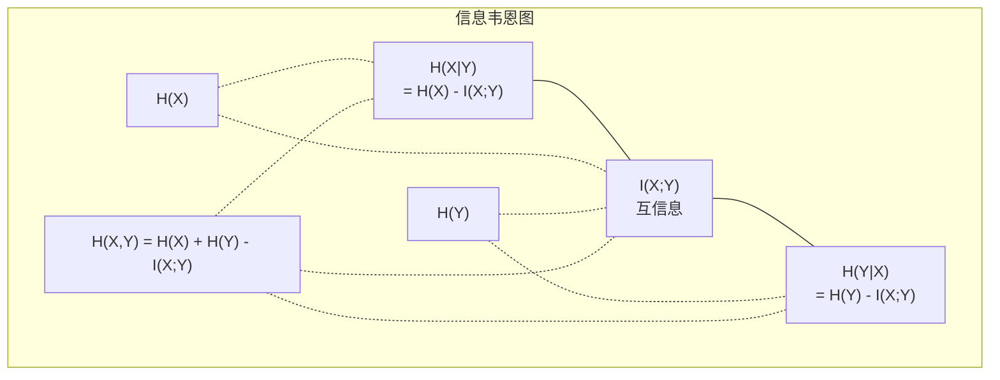

# 信息论

> 信息论度量惊讶程度。损失函数建立在它之上。

**类型：** 学习
**语言：** Python
**前置要求：** 阶段 1，第 06 课（概率）
**时间：** 约 60 分钟

## 学习目标

- 从零计算熵、交叉熵和 KL 散度，解释它们之间的关系
- 推导为何最小化交叉熵损失等价于最大化对数似然
- 计算特征与目标之间的互信息，对特征重要性排序
- 将困惑度解释为语言模型的有效词汇量

## 问题

你在每个分类模型中都会调用 `CrossEntropyLoss()`。你在每篇语言模型论文中都会看到"困惑度"。你在 VAE、蒸馏和 RLHF 中读到 KL 散度。这些不是孤立的概念，它们都是同一个想法的不同外衣。

信息论给你提供推理不确定性、压缩和预测的语言。Claude Shannon 在 1948 年发明它来解决通信问题。结果发现，训练神经网络就是一个通信问题：模型试图通过学到的权重这一噪声信道传输正确标签。

本课从零构建每个公式，让你看到它们从何而来，以及为何有效。

## 概念

### 信息量（惊讶度）

当不太可能发生的事情发生时，它携带更多信息。硬币正面？不令人惊讶。中彩票？非常令人惊讶。

概率为 p 的事件的信息量：

```
I(x) = -log(p(x))
```

以 2 为底的对数给你比特（bits），以自然数为底给你奈特（nats）。思想相同，单位不同。

```
事件              概率      惊讶度（比特）
公平硬币正面      0.5       1.0
掷出 6 点        0.167     2.58
千分之一事件      0.001     9.97
必然事件          1.0       0.0
```

必然事件携带零信息量，你已经知道它会发生。

### 熵（平均惊讶度）

熵是分布所有可能结果的期望惊讶度。

```
H(P) = -sum( p(x) * log(p(x)) )  对所有 x
```

公平硬币对二元变量具有最大熵：1 比特。偏置硬币（99% 正面）熵低：0.08 比特。你已经知道会发生什么，所以每次翻转几乎没有告诉你任何新信息。

```
公平硬币：  H = -(0.5 * log2(0.5) + 0.5 * log2(0.5)) = 1.0 比特
偏置硬币：  H = -(0.99 * log2(0.99) + 0.01 * log2(0.01)) = 0.08 比特
```

熵衡量分布中不可压缩的不确定性，你无法压缩到低于它。

### 交叉熵（你每天使用的损失函数）

交叉熵衡量当你用分布 Q 来编码实际来自分布 P 的事件时的平均惊讶度。

```
H(P, Q) = -sum( p(x) * log(q(x)) )  对所有 x
```

P 是真实分布（标签），Q 是模型的预测。如果 Q 与 P 完全匹配，交叉熵等于熵。任何不匹配都会使其更大。

在分类中，P 是 one-hot 向量（真实类别概率为 1，其他为 0）。这将交叉熵简化为：

```
H(P, Q) = -log(q(真实类别))
```

这就是分类的完整交叉熵损失公式——最大化正确类别的预测概率。

### KL 散度（分布之间的距离）

KL 散度衡量使用 Q 代替 P 时额外的惊讶度。

```
D_KL(P || Q) = sum( p(x) * log(p(x) / q(x)) )  对所有 x
             = H(P, Q) - H(P)
```

交叉熵等于熵加上 KL 散度。由于训练期间真实分布的熵是常数，最小化交叉熵与最小化 KL 散度相同——你在将模型的分布推向真实分布。

KL 散度不对称：D_KL(P || Q) ≠ D_KL(Q || P)，它不是真正的距离度量。

### 互信息

互信息衡量知道一个变量告诉你关于另一个变量多少信息。

```
I(X; Y) = H(X) - H(X|Y)
        = H(X) + H(Y) - H(X, Y)
```

如果 X 和 Y 独立，互信息为零——知道一个对另一个毫无帮助。如果它们完全相关，互信息等于任一变量的熵。

在特征选择中，特征与目标之间的高互信息意味着该特征有用；低互信息意味着它是噪声。

### 条件熵

H(Y|X) 衡量观察 X 后 Y 的剩余不确定性。

```
H(Y|X) = H(X,Y) - H(X)
```

两个极端：
- 如果 X 完全决定 Y，则 H(Y|X) = 0。知道 X 消除了关于 Y 的所有不确定性。例如：X = 摄氏温度，Y = 华氏温度。
- 如果 X 对 Y 毫无帮助，则 H(Y|X) = H(Y)。知道 X 根本不减少你的不确定性。例如：X = 硬币翻转，Y = 明天天气。

条件熵总是非负的且不超过 H(Y)：

```
0 <= H(Y|X) <= H(Y)
```

在机器学习中，条件熵出现在决策树中。在每次分裂时，算法选择使 H(Y|X) 最小的特征——即移除关于标签 Y 最多不确定性的特征。

### 联合熵

H(X,Y) 是 X 和 Y 联合分布的熵。

```
H(X,Y) = -sum sum p(x,y) * log(p(x,y))   对所有 x, y
```

关键性质：

```
H(X,Y) <= H(X) + H(Y)
```

当 X 和 Y 独立时等号成立。如果它们共享信息，联合熵小于各自熵的总和。"缺失的"熵正好等于互信息。



关系式：
- H(X,Y) = H(X) + H(Y|X) = H(Y) + H(X|Y)
- I(X;Y) = H(X) - H(X|Y) = H(Y) - H(Y|X)
- H(X,Y) = H(X) + H(Y) - I(X;Y)

### 互信息（深入探讨）

互信息 I(X;Y) 量化知道一个变量减少了对另一个变量不确定性的程度。

```
I(X;Y) = H(X) - H(X|Y)
       = H(Y) - H(Y|X)
       = H(X) + H(Y) - H(X,Y)
       = sum sum p(x,y) * log(p(x,y) / (p(x) * p(y)))
```

性质：
- I(X;Y) >= 0 恒成立，观察某事从不会减少信息。
- I(X;Y) = 0 当且仅当 X 和 Y 独立。
- I(X;Y) = I(Y;X)，对称，不同于 KL 散度。
- I(X;X) = H(X)，变量与自身共享所有信息。

**互信息用于特征选择。** 在 ML 中，你想要对目标有信息量的特征。互信息给你一种原则性的方式对特征排序：

1. 对每个特征 X_i，计算 I(X_i; Y)，其中 Y 是目标变量。
2. 按互信息得分对特征排序。
3. 保留前 k 个特征。

这适用于特征和目标之间的任何关系——线性、非线性、单调或非单调。相关系数只能捕捉线性关系，互信息捕捉一切。

| 方法 | 检测 | 计算成本 | 处理类别变量？ |
|------|------|----------|--------------|
| 皮尔逊相关 | 线性关系 | O(n) | 否 |
| 斯皮尔曼相关 | 单调关系 | O(n log n) | 否 |
| 互信息 | 任何统计依赖 | O(n log n)（分桶） | 是 |

### 标签平滑与交叉熵

标准分类使用硬目标：[0, 0, 1, 0]。真实类别概率为 1，其他为 0。标签平滑用软目标替换它们：

```
软目标 = (1 - epsilon) * 硬目标 + epsilon / 类别数
```

epsilon = 0.1，4 个类别：
- 硬目标：[0, 0, 1, 0]
- 软目标：[0.025, 0.025, 0.925, 0.025]

从信息论的角度来看，标签平滑增加了目标分布的熵。硬 one-hot 目标熵为 0——没有不确定性。软目标具有正熵。

为什么这有帮助：
- 防止模型将 logits 推向极端值（完全匹配 one-hot 目标需要无限 logits）
- 作为正则化：模型不能 100% 确信
- 改善校准：预测概率更好地反映真实不确定性
- 减少训练和推断行为之间的差距

带标签平滑的交叉熵损失变为：

```
L = (1 - epsilon) * CE(硬目标, 预测) + epsilon * H_均匀(预测)
```

第二项惩罚远离均匀分布的预测——对置信度的直接正则化。

### 为什么交叉熵是分类损失

三个视角，同一结论。

**信息论视角。** 交叉熵衡量使用模型分布代替真实分布时浪费的比特数。最小化它使你的模型成为现实的最高效编码器。

**最大似然视角。** 对于 N 个真实类别为 y_i 的训练样本：

```
似然          = product( q(y_i) )
对数似然       = sum( log(q(y_i)) )
负对数似然     = -sum( log(q(y_i)) )
```

最后一行就是交叉熵损失。最小化交叉熵 = 最大化模型下训练数据的似然。

**梯度视角。** 交叉熵对 logits 的梯度简单地就是（预测 - 真实）。干净、稳定且计算快速。这就是它与 softmax 完美配对的原因。

### 比特 vs 奈特

唯一区别是对数底数。

```
以 2 为底    -> 比特（bits）    （信息论传统）
以 e 为底    -> 奈特（nats）    （机器学习惯例）
以 10 为底   -> 哈特利（hartleys）（很少使用）
```

1 奈特 = 1/ln(2) 比特 = 1.4427 比特。PyTorch 和 TensorFlow 默认使用自然对数（奈特）。

### 困惑度

困惑度是交叉熵的指数。它告诉你模型在不确定的情况下有效地从多少个等可能选项中选择。

```
困惑度 = 2^H(P,Q)   （使用比特时）
困惑度 = e^H(P,Q)   （使用奈特时）
```

困惑度为 50 的语言模型，平均而言，就像从 50 个可能的下一个词中均匀选择一样困惑。越低越好。

GPT-2 在常见基准上达到困惑度约 30。现代模型在表示充分的领域中可以达到个位数。

## 动手实现

### 第一步：信息量与熵

```python
import math

def information_content(p, base=2):
    if p <= 0 or p > 1:
        return float('inf') if p <= 0 else 0.0
    return -math.log(p) / math.log(base)

def entropy(probs, base=2):
    return sum(
        p * information_content(p, base)
        for p in probs if p > 0
    )

fair_coin = [0.5, 0.5]
biased_coin = [0.99, 0.01]
fair_die = [1/6] * 6

print(f"公平硬币熵：  {entropy(fair_coin):.4f} 比特")
print(f"偏置硬币熵：  {entropy(biased_coin):.4f} 比特")
print(f"公平骰子熵：  {entropy(fair_die):.4f} 比特")
```

### 第二步：交叉熵与 KL 散度

```python
def cross_entropy(p, q, base=2):
    total = 0.0
    for pi, qi in zip(p, q):
        if pi > 0:
            if qi <= 0:
                return float('inf')
            total += pi * (-math.log(qi) / math.log(base))
    return total

def kl_divergence(p, q, base=2):
    return cross_entropy(p, q, base) - entropy(p, base)

true_dist = [0.7, 0.2, 0.1]
good_model = [0.6, 0.25, 0.15]
bad_model = [0.1, 0.1, 0.8]

print(f"真实分布的熵：  {entropy(true_dist):.4f} 比特")
print(f"交叉熵（好模型）：{cross_entropy(true_dist, good_model):.4f} 比特")
print(f"交叉熵（差模型）：{cross_entropy(true_dist, bad_model):.4f} 比特")
print(f"KL 散度（好）：  {kl_divergence(true_dist, good_model):.4f} 比特")
print(f"KL 散度（差）：  {kl_divergence(true_dist, bad_model):.4f} 比特")
```

### 第三步：交叉熵作为分类损失

```python
def softmax(logits):
    max_logit = max(logits)
    exps = [math.exp(z - max_logit) for z in logits]
    total = sum(exps)
    return [e / total for e in exps]

def cross_entropy_loss(true_class, logits):
    probs = softmax(logits)
    return -math.log(probs[true_class])

logits = [2.0, 1.0, 0.1]
true_class = 0

probs = softmax(logits)
loss = cross_entropy_loss(true_class, logits)

print(f"Logits:    {logits}")
print(f"Softmax:   {[f'{p:.4f}' for p in probs]}")
print(f"真实类别:   {true_class}")
print(f"损失:       {loss:.4f} 奈特")
print(f"困惑度:     {math.exp(loss):.2f}")
```

### 第四步：交叉熵等于负对数似然

```python
import random

random.seed(42)

n_samples = 1000
n_classes = 3
true_labels = [random.randint(0, n_classes - 1) for _ in range(n_samples)]
model_logits = [[random.gauss(0, 1) for _ in range(n_classes)] for _ in range(n_samples)]

ce_loss = sum(
    cross_entropy_loss(label, logits)
    for label, logits in zip(true_labels, model_logits)
) / n_samples

nll = -sum(
    math.log(softmax(logits)[label])
    for label, logits in zip(true_labels, model_logits)
) / n_samples

print(f"交叉熵损失：      {ce_loss:.6f}")
print(f"负对数似然：      {nll:.6f}")
print(f"差异：            {abs(ce_loss - nll):.2e}")
```

### 第五步：互信息

```python
def mutual_information(joint_probs, base=2):
    rows = len(joint_probs)
    cols = len(joint_probs[0])

    margin_x = [sum(joint_probs[i][j] for j in range(cols)) for i in range(rows)]
    margin_y = [sum(joint_probs[i][j] for i in range(rows)) for j in range(cols)]

    mi = 0.0
    for i in range(rows):
        for j in range(cols):
            pxy = joint_probs[i][j]
            if pxy > 0:
                mi += pxy * math.log(pxy / (margin_x[i] * margin_y[j])) / math.log(base)
    return mi

independent = [[0.25, 0.25], [0.25, 0.25]]
dependent = [[0.45, 0.05], [0.05, 0.45]]

print(f"MI（独立）：  {mutual_information(independent):.4f} 比特")
print(f"MI（相关）：  {mutual_information(dependent):.4f} 比特")
```

## 实际使用

使用 NumPy 的相同概念——你在实践中会这样使用：

```python
import numpy as np

def np_entropy(p):
    p = np.asarray(p, dtype=float)
    mask = p > 0
    result = np.zeros_like(p)
    result[mask] = p[mask] * np.log(p[mask])
    return -result.sum()

def np_cross_entropy(p, q):
    p, q = np.asarray(p, dtype=float), np.asarray(q, dtype=float)
    mask = p > 0
    return -(p[mask] * np.log(q[mask])).sum()

def np_kl_divergence(p, q):
    return np_cross_entropy(p, q) - np_entropy(p)

true = np.array([0.7, 0.2, 0.1])
pred = np.array([0.6, 0.25, 0.15])
print(f"熵：        {np_entropy(true):.4f} 奈特")
print(f"交叉熵：    {np_cross_entropy(true, pred):.4f} 奈特")
print(f"KL 散度：   {np_kl_divergence(true, pred):.4f} 奈特")
```

你从零构建了 `torch.nn.CrossEntropyLoss()` 内部所做的事。现在你知道为什么训练中损失会下降：你的模型预测分布正在越来越接近真实分布，以浪费信息的奈特数来衡量。

## 练习

1. 假设英文字母均匀分布（26 个字母），计算其熵。然后用实际字母频率估计。哪个更高？为什么？

2. 一个模型对真实类别为 1 的样本输出 logits [5.0, 2.0, 0.5]。手动计算交叉熵损失，然后用你的 `cross_entropy_loss` 函数验证。什么 logits 会给出零损失？

3. 证明 KL 散度不对称。选取两个分布 P 和 Q，计算 D_KL(P || Q) 和 D_KL(Q || P)，解释为什么它们不同。

4. 构建一个计算词元预测序列困惑度的函数。给定一系列（真实词元索引，预测 logits）对，返回序列的困惑度。

## 关键术语

| 术语 | 大家怎么说 | 实际含义 |
|------|------------|----------|
| 信息量（Information content）| "惊讶度" | 编码一个事件所需的比特数（或奈特数）：-log(p) |
| 熵（Entropy）| "随机性" | 分布所有结果的平均惊讶度，衡量不可约的不确定性 |
| 交叉熵（Cross-entropy）| "损失函数" | 使用模型分布 Q 对来自真实分布 P 的事件编码时的平均惊讶度 |
| KL 散度（KL divergence）| "分布之间的距离" | 使用 Q 代替 P 时浪费的额外比特数，等于交叉熵减去熵，不对称 |
| 互信息（Mutual information）| "X 和 Y 的关联程度" | 知道 Y 后 X 的不确定性减少量，为零意味着独立 |
| Softmax | "将 logits 转为概率" | 指数化并归一化，将任意实值向量映射为有效概率分布 |
| 困惑度（Perplexity）| "模型有多困惑" | 交叉熵的指数，模型在每步中有效选择的词汇量 |
| 比特（Bits）| "香农的单位" | 以 2 为底的对数衡量的信息量，一比特解决一次公平硬币翻转 |
| 奈特（Nats）| "ML 的单位" | 以自然对数衡量的信息量，PyTorch 和 TensorFlow 默认使用 |
| 负对数似然（NLL loss）| "NLL 损失" | 对 one-hot 标签与交叉熵损失完全相同，最小化它就是最大化正确预测的概率 |

## 延伸阅读

- [Shannon 1948：通信的数学理论](https://people.math.harvard.edu/~ctm/home/text/others/shannon/entropy/entropy.pdf) — 原始论文，至今仍然可读
- [可视化信息论（Chris Olah）](https://colah.github.io/posts/2015-09-Visual-Information/) — 熵和 KL 散度的最佳可视化讲解
- [PyTorch CrossEntropyLoss 文档](https://pytorch.org/docs/stable/generated/torch.nn.CrossEntropyLoss.html) — 框架如何实现你刚刚构建的内容
