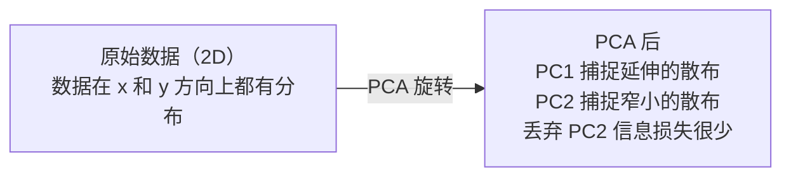

# 降维

> 高维数据有结构。从正确的角度看，你能发现它。

**类型：** 实践
**语言：** Python
**前置要求：** 阶段 1，第 01 课（线性代数直觉）、第 02 课（向量、矩阵与运算）、第 03 课（特征值与特征向量）、第 06 课（概率与分布）
**时间：** 约 90 分钟

## 学习目标

- 从零实现 PCA：中心化数据、计算协方差矩阵、特征分解、投影
- 使用解释方差比和肘部法则选择主成分数量
- 对比 PCA、t-SNE 和 UMAP 在 2D 可视化 MNIST 数字时的效果，解释各自的权衡
- 应用带 RBF 核的核 PCA，处理标准 PCA 无法处理的非线性数据结构

## 问题

你有一个每个样本 784 个特征的数据集。也许是手写数字的像素值，也许是基因表达水平，也许是用户行为信号。你无法可视化 784 个维度，无法绘制它们，甚至无法思考它们。

但这 784 个特征中的大多数是冗余的。实际信息存在于一个小得多的曲面上。一个手写的"7"不需要 784 个独立的数字来描述——它只需要几个：笔画的角度、横杠的长度、倾斜程度。其余都是噪声。

降维找到那个更小的曲面。它将你的 784 维数据压缩到 2、10 或 50 维，同时保留重要的结构。

## 概念

### 维度诅咒

高维空间违背直觉。随着维度增长，有三件事会出问题。

**距离变得毫无意义。** 在高维中，任意两个随机点之间的距离收敛到相同值。如果每个点与其他每个点的距离大致相同，最近邻搜索就失效了。

```
维度     随机点间距离比（最大/最小）
2        ~5.0
10       ~1.8
100      ~1.2
1000     ~1.02
```

**体积集中在角落。** d 维单位超立方体有 2^d 个角。在 100 维中，几乎所有体积都在角落，远离中心。数据点分散到边缘，模型在内部区域严重缺乏数据。

**需要指数级更多的数据。** 要在空间中保持相同的样本密度，从 2D 到 20D 意味着需要 10^18 倍的数据。你永远不够用。降维让数据密度恢复到可处理的程度。

### PCA：找到重要的方向

主成分分析（PCA）找到数据变化最大的轴。它旋转坐标系，使第一个轴捕捉最大方差，第二个轴捕捉次大方差，依此类推。

算法：

```
1. 中心化数据     （从每个特征中减去均值）
2. 计算协方差     （特征如何协同变化）
3. 特征分解       （找到主方向）
4. 按特征值排序   （最大方差优先）
5. 投影           （保留前 k 个特征向量，丢弃其余）
```

为什么用特征分解？协方差矩阵是对称半正定的。其特征向量是特征空间中的正交方向。特征值告诉你每个方向捕捉了多少方差。最大特征值对应的特征向量指向最大方差方向。



- **PCA 前：** 数据云斜向分布在 x 和 y 轴上
- **PCA 后：** 坐标系旋转，使 PC1 与最大方差方向（延伸散布）对齐，PC2 与最小方差方向（窄散布）对齐
- **降维：** 丢弃 PC2 将数据投影到 PC1 上，信息损失极少

### 解释方差比

每个主成分捕捉总方差的一个比例。解释方差比告诉你是多少。

```
成分     特征值     解释比例    累积
PC1      4.73       0.473       0.473
PC2      2.51       0.251       0.724
PC3      1.12       0.112       0.836
PC4      0.89       0.089       0.925
...
```

当累积解释方差达到 0.95 时，你知道这些成分捕捉了 95% 的信息。之后的部分大多是噪声。

### 选择成分数量

三种策略：

1. **阈值法。** 保留足够多的成分以解释 90-95% 的方差。
2. **肘部法则。** 绘制每个成分的解释方差，寻找急剧下降点。
3. **下游性能法。** 将 PCA 用作预处理，扫描 k 值并测量模型精度。精度趋于平稳时的 k 值就是最优点。

### t-SNE：保留邻域

t 分布随机邻域嵌入（t-SNE）专为可视化设计。它将高维数据映射到 2D（或 3D），同时保留哪些点相互靠近。

直觉：在原始空间中，根据点对之间的距离计算概率分布，相近的点获得高概率，远的点获得低概率。然后找到满足相同概率分布的 2D 排列。在 784 维中是邻居的点在 2D 中仍然是邻居。

t-SNE 的关键特性：
- 非线性，能展开 PCA 无法处理的复杂流形。
- 随机性，不同的运行产生不同的布局。
- 困惑度参数控制考虑多少个邻居（典型范围：5-50）。
- 输出中簇之间的距离没有意义，只有簇本身有意义。
- 大数据集上较慢，默认 O(n²)。

### UMAP：更快，更好的全局结构

均匀流形近似与投影（UMAP）与 t-SNE 类似，但有两个优势：
- 更快，使用近似最近邻图而非计算所有成对距离。
- 更好的全局结构，输出中簇的相对位置比 t-SNE 更有意义。

UMAP 在高维空间中构建加权图（"模糊拓扑表示"），然后找到尽可能保留这个图的低维布局。

关键参数：
- `n_neighbors`：定义局部结构的邻居数量（类似困惑度），更高的值保留更多全局结构。
- `min_dist`：输出中点聚集的紧密程度，更低的值创建更密集的簇。

### 何时使用哪种方法

| 方法 | 使用场景 | 保留 | 速度 |
|------|----------|------|------|
| PCA | 训练前的预处理 | 全局方差 | 快（精确），可处理数百万样本 |
| PCA | 快速探索性可视化 | 线性结构 | 快 |
| t-SNE | 发表质量的 2D 图 | 局部邻域 | 慢（理想 < 10k 样本） |
| UMAP | 大规模 2D 可视化 | 局部 + 部分全局结构 | 中等（可处理数百万） |
| PCA | 模型特征降维 | 按方差排序的特征 | 快 |
| t-SNE/UMAP | 理解簇结构 | 簇分离 | 中等到慢 |

经验法则：用 PCA 做预处理和数据压缩；用 t-SNE 或 UMAP 在 2D 中可视化结构。

### 核 PCA

标准 PCA 找到线性子空间，旋转坐标系并丢弃轴。但如果数据位于非线性流形上呢？2D 中的圆不能被任何直线分离，标准 PCA 无济于事。

核 PCA 在核函数诱导的高维特征空间中应用 PCA，无需显式计算该空间中的坐标。这是核技巧——与 SVM 背后的想法相同。

算法：
1. 计算核矩阵 K，其中 K_ij = k(x_i, x_j)
2. 在特征空间中中心化核矩阵
3. 对中心化核矩阵进行特征分解
4. 前 k 个特征向量（按 1/sqrt(特征值) 缩放）就是投影

常见核函数：

| 核 | 公式 | 适用于 |
|----|------|--------|
| RBF（高斯）| exp(-gamma * \|\|x - y\|\|²) | 大多数非线性数据，平滑流形 |
| 多项式 | (x · y + c)^d | 多项式关系 |
| Sigmoid | tanh(alpha * x · y + c) | 类神经网络映射 |

何时选择核 PCA vs 标准 PCA：

| 标准 | 标准 PCA | 核 PCA |
|------|----------|--------|
| 数据结构 | 线性子空间 | 非线性流形 |
| 速度 | O(min(n²d, d²n)) | O(n²d + n³) |
| 可解释性 | 成分是特征的线性组合 | 成分缺乏直接特征解释 |
| 可扩展性 | 可处理数百万样本 | 核矩阵为 n×n，受内存限制 |
| 重建 | 直接逆变换 | 需要预像近似 |

经典示例：2D 中的同心圆。两圈点，一圈在另一圈内部。标准 PCA 将两者投影到同一条线上——对分类毫无用处。带 RBF 核的核 PCA 将内圆和外圆映射到不同区域，使它们线性可分。

### 重建误差

你的降维效果如何？你将 784 维压缩到 50 维。损失了什么？

测量重建误差：
1. 将数据投影到 k 维：X_reduced = X @ W_k
2. 重建：X_hat = X_reduced @ W_k^T
3. 计算 MSE：mean((X - X_hat)²)

对于 PCA，重建误差与解释方差有简洁的关系：

```
重建误差 = 未包含的特征值之和
总方差   = 所有特征值之和
损失比例 = （丢弃的特征值之和）/（所有特征值之和）
```

绘制累积解释方差与成分数量的关系曲线给你"肘部"曲线。正确的成分数量是：
- 曲线趋于平坦（回报递减）
- 累积方差超过阈值（通常 0.90 或 0.95）
- 下游任务性能趋于稳定

重建误差不仅用于选择 k。你还可以用它做异常检测：重建误差高的样本是不符合学到子空间的异常值，这是生产系统中基于 PCA 的异常检测的基础。

## 动手实现

### 第一步：从零实现 PCA

```python
import numpy as np

class PCA:
    def __init__(self, n_components):
        self.n_components = n_components
        self.components = None
        self.mean = None
        self.eigenvalues = None
        self.explained_variance_ratio_ = None

    def fit(self, X):
        self.mean = np.mean(X, axis=0)
        X_centered = X - self.mean

        cov_matrix = np.cov(X_centered, rowvar=False)

        eigenvalues, eigenvectors = np.linalg.eigh(cov_matrix)

        sorted_idx = np.argsort(eigenvalues)[::-1]
        eigenvalues = eigenvalues[sorted_idx]
        eigenvectors = eigenvectors[:, sorted_idx]

        self.components = eigenvectors[:, :self.n_components].T
        self.eigenvalues = eigenvalues[:self.n_components]
        total_var = np.sum(eigenvalues)
        self.explained_variance_ratio_ = self.eigenvalues / total_var

        return self

    def transform(self, X):
        X_centered = X - self.mean
        return X_centered @ self.components.T

    def fit_transform(self, X):
        self.fit(X)
        return self.transform(X)
```

### 第二步：在合成数据上测试

```python
np.random.seed(42)
n_samples = 500

t = np.random.uniform(0, 2 * np.pi, n_samples)
x1 = 3 * np.cos(t) + np.random.normal(0, 0.2, n_samples)
x2 = 3 * np.sin(t) + np.random.normal(0, 0.2, n_samples)
x3 = 0.5 * x1 + 0.3 * x2 + np.random.normal(0, 0.1, n_samples)

X_synthetic = np.column_stack([x1, x2, x3])

pca = PCA(n_components=2)
X_reduced = pca.fit_transform(X_synthetic)

print(f"原始形状：{X_synthetic.shape}")
print(f"降维后形状：{X_reduced.shape}")
print(f"解释方差比：{pca.explained_variance_ratio_}")
print(f"捕捉的总方差：{sum(pca.explained_variance_ratio_):.4f}")
```

### 第三步：MNIST 数字 2D 可视化

```python
from sklearn.datasets import fetch_openml

mnist = fetch_openml("mnist_784", version=1, as_frame=False, parser="auto")
X_mnist = mnist.data[:5000].astype(float)
y_mnist = mnist.target[:5000].astype(int)

pca_mnist = PCA(n_components=50)
X_pca50 = pca_mnist.fit_transform(X_mnist)
print(f"50 个成分捕捉了 {sum(pca_mnist.explained_variance_ratio_):.2%} 的方差")

pca_2d = PCA(n_components=2)
X_pca2d = pca_2d.fit_transform(X_mnist)
print(f"2 个成分捕捉了 {sum(pca_2d.explained_variance_ratio_):.2%} 的方差")
```

### 第四步：与 sklearn 对比

```python
from sklearn.decomposition import PCA as SklearnPCA
from sklearn.manifold import TSNE

sklearn_pca = SklearnPCA(n_components=2)
X_sklearn_pca = sklearn_pca.fit_transform(X_mnist)

print(f"\n我们的 PCA 解释方差：    {pca_2d.explained_variance_ratio_}")
print(f"Sklearn PCA 解释方差：   {sklearn_pca.explained_variance_ratio_}")

diff = np.abs(np.abs(X_pca2d) - np.abs(X_sklearn_pca))
print(f"最大绝对差异：           {diff.max():.10f}")

tsne = TSNE(n_components=2, perplexity=30, random_state=42)
X_tsne = tsne.fit_transform(X_mnist)
print(f"\nt-SNE 输出形状：{X_tsne.shape}")
```

### 第五步：UMAP 对比

```python
try:
    from umap import UMAP

    reducer = UMAP(n_components=2, n_neighbors=15, min_dist=0.1, random_state=42)
    X_umap = reducer.fit_transform(X_mnist)
    print(f"UMAP 输出形状：{X_umap.shape}")
except ImportError:
    print("安装 umap-learn：pip install umap-learn")
```

## 实际使用

PCA 作为分类器前的预处理：

```python
from sklearn.decomposition import PCA as SklearnPCA
from sklearn.linear_model import LogisticRegression
from sklearn.model_selection import train_test_split
from sklearn.metrics import accuracy_score

X_train, X_test, y_train, y_test = train_test_split(
    X_mnist, y_mnist, test_size=0.2, random_state=42
)

results = {}
for k in [10, 30, 50, 100, 200]:
    pca_k = SklearnPCA(n_components=k)
    X_tr = pca_k.fit_transform(X_train)
    X_te = pca_k.transform(X_test)

    clf = LogisticRegression(max_iter=1000, random_state=42)
    clf.fit(X_tr, y_train)
    acc = accuracy_score(y_test, clf.predict(X_te))
    var_captured = sum(pca_k.explained_variance_ratio_)
    results[k] = (acc, var_captured)
    print(f"k={k:>3d}  精度={acc:.4f}  方差={var_captured:.4f}")
```

性能在远未到 784 维之前就趋于平稳。该平稳点就是你的工作点。

## 交付产出

本节课产出：
- `outputs/skill-dimensionality-reduction.md` — 为给定任务选择正确降维技术的技能文档

## 练习

1. 修改 PCA 类以支持 `inverse_transform`。分别用 10、50 和 200 个成分重建 MNIST 数字，打印每种情况下的重建误差（与原始数据的均方差）。

2. 用困惑度值 5、30 和 100 在同一 MNIST 子集上运行 t-SNE，描述输出如何变化。为什么困惑度影响簇的紧密程度？

3. 取一个 50 个特征但只有 5 个信息特征的数据集（用 `sklearn.datasets.make_classification` 生成）。应用 PCA，检查解释方差曲线是否正确识别出数据实际上是 5 维的。

## 关键术语

| 术语 | 大家怎么说 | 实际含义 |
|------|------------|----------|
| 维度诅咒（Curse of dimensionality）| "特征太多了" | 随着维度增长，距离、体积和数据密度的行为都违背直觉，模型需要指数级更多数据来补偿 |
| PCA | "降维" | 旋转坐标系，使轴与最大方差方向对齐，然后丢弃低方差轴 |
| 主成分（Principal component）| "一个重要方向" | 协方差矩阵的特征向量，数据变化最大的特征空间方向 |
| 解释方差比（Explained variance ratio）| "这个成分有多少信息" | 一个主成分捕捉的总方差比例，对前 k 个比例求和可看到 k 个成分保留了多少 |
| 协方差矩阵（Covariance matrix）| "特征如何相关" | 对称矩阵，(i,j) 处的元素衡量特征 i 和特征 j 如何协同变化，对角元素是各自的方差 |
| t-SNE | "那个簇图" | 非线性方法，通过保留成对邻域概率将高维数据映射到 2D，适合可视化，不适合预处理 |
| UMAP | "更快的 t-SNE" | 基于拓扑数据分析的非线性方法，保留局部和部分全局结构，比 t-SNE 更具可扩展性 |
| 困惑度（Perplexity）| "t-SNE 的旋钮" | 控制每个点考虑的有效邻居数量，低困惑度关注非常局部的结构，高困惑度捕捉更广泛的模式 |
| 流形（Manifold）| "数据所在的曲面" | 嵌入在高维空间中的低维曲面，在 3D 中皱缩的纸张就是一个 2D 流形 |

## 延伸阅读

- [主成分分析教程](https://arxiv.org/abs/1404.1100)（Shlens）— 从头推导 PCA 的清晰讲解
- [如何有效使用 t-SNE](https://distill.pub/2016/misread-tsne/)（Wattenberg 等）— t-SNE 陷阱和参数选择的交互指南
- [UMAP 文档](https://umap-learn.readthedocs.io/) — UMAP 作者的理论和实践指导
