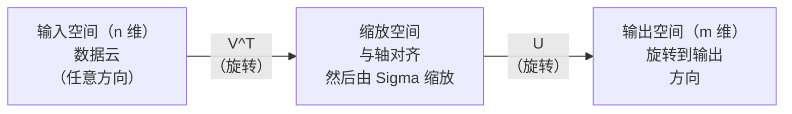
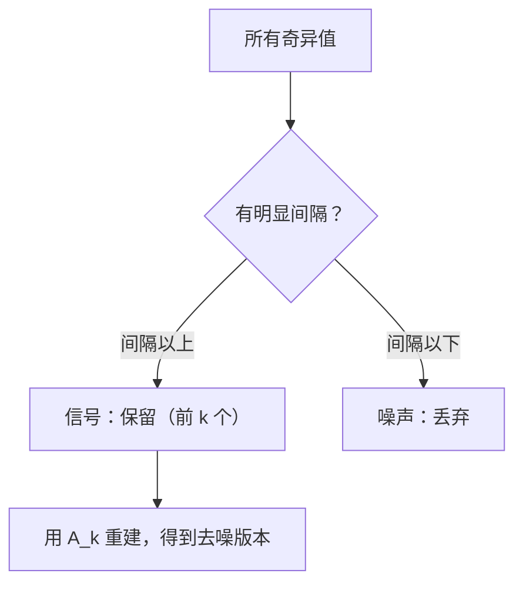

# 奇异值分解

> SVD 是线性代数的瑞士军刀。每个矩阵都有 SVD，每个数据科学家都需要它。

**类型：** 实践
**语言：** Python, Julia
**前置要求：** 阶段 1，第 01 课（线性代数直觉）、第 02 课（向量与矩阵运算）、第 03 课（矩阵变换）
**时间：** 约 120 分钟

## 学习目标

- 通过幂迭代实现 SVD，解释 U、Sigma 和 V^T 的几何含义
- 将截断 SVD 应用于图像压缩，测量压缩比与重建误差
- 通过 SVD 计算 Moore-Penrose 伪逆，求解超定最小二乘系统
- 将 SVD 与 PCA、推荐系统（潜在因子）和 NLP 中的潜在语义分析相关联

## 问题

你有一个 1000×2000 的矩阵。也许是用户-电影评分，也许是文档-词频表，也许是图像的像素值。你需要压缩它、去噪它、找到其中的隐藏结构，或用它求解最小二乘系统。特征分解只适用于方阵，即使如此也要求矩阵有完整的线性无关特征向量集。

SVD 适用于任何矩阵。任意形状。任意秩。无条件限制。它将矩阵分解为三个因子，揭示矩阵对空间做了什么的几何原理。它是整个线性代数中最通用、最有用的因子分解。

## 概念

### SVD 的几何含义

每个矩阵，不论形状，都按顺序执行三个操作：旋转、缩放、旋转。SVD 让这个分解变得明确。

```
A = U * Sigma * V^T

     m×n      m×m      m×n      n×n
   （任意）  （旋转）  （缩放）  （旋转）
```

给定任意矩阵 A，SVD 将其分解为：
- V^T 旋转输入空间（n 维）中的向量
- Sigma 沿每个轴缩放（拉伸或压缩）
- U 将结果旋转到输出空间（m 维）



这样理解：你把矩阵交给 SVD，它告诉你："这个矩阵将一个输入球体，先用 V^T 旋转，再用 Sigma 拉伸成椭球体，然后用 U 旋转椭球体。"奇异值就是椭球体各轴的长度。

### 完整分解

对于形状为 m×n 的矩阵 A：

```
A = U * Sigma * V^T

其中：
  U      是 m×m 的正交矩阵（U^T U = I）
  Sigma  是 m×n 的对角矩阵（对角线上是奇异值）
  V      是 n×n 的正交矩阵（V^T V = I）

奇异值 sigma_1 >= sigma_2 >= ... >= sigma_r > 0
其中 r = rank(A)
```

U 的列称为左奇异向量，V 的列称为右奇异向量，Sigma 的对角元素称为奇异值。奇异值总是非负的，且按降序排列。

### 左奇异向量、奇异值、右奇异向量

SVD 的每个分量都有独特的几何含义。

**右奇异向量（V 的列）：** 构成输入空间（R^n）的标准正交基。它们是输入空间中被矩阵映射到输出空间中正交方向的方向。把它们看作定义域的自然坐标系。

**奇异值（Sigma 的对角线）：** 缩放因子。第 i 个奇异值告诉你矩阵沿第 i 个右奇异向量拉伸向量的程度。奇异值为零意味着矩阵完全压缩了那个方向。

**左奇异向量（U 的列）：** 构成输出空间（R^m）的标准正交基。第 i 个左奇异向量是第 i 个右奇异向量（缩放后）落入输出空间的方向。

它们之间的关系：

```
A * v_i = sigma_i * u_i

矩阵 A 取第 i 个右奇异向量 v_i，
将其缩放 sigma_i 倍，并映射到第 i 个左奇异向量 u_i。
```

这给你提供了任意矩阵如何逐坐标工作的图像。

### 外积形式

SVD 可以写成秩-1 矩阵之和：

```
A = sigma_1 * u_1 * v_1^T + sigma_2 * u_2 * v_2^T + ... + sigma_r * u_r * v_r^T

每项 sigma_i * u_i * v_i^T 是秩-1 矩阵（外积）。
完整矩阵是 r 个这样的矩阵之和，其中 r 是秩。
```

这种形式是低秩近似的基础。每一项增加一层结构。第一项捕捉单一最重要的模式，第二项捕捉次重要的，依此类推。截断这个求和在任何给定秩下给出最好的近似。

```
秩-1 近似：  A_1 = sigma_1 * u_1 * v_1^T
             （捕捉主导模式）

秩-2 近似：  A_2 = sigma_1 * u_1 * v_1^T + sigma_2 * u_2 * v_2^T
             （捕捉两个最重要的模式）

秩-k 近似：  A_k = 前 k 项之和
             （由 Eckart-Young 定理保证最优）
```

### 与特征分解的关系

SVD 和特征分解深度相连。A 的奇异值和奇异向量直接来自 A^T A 和 A A^T 的特征值和特征向量。

```
A^T A = V * Sigma^T * U^T * U * Sigma * V^T
      = V * Sigma^T * Sigma * V^T
      = V * D * V^T

其中 D = Sigma^T * Sigma 是对角线上有 sigma_i^2 的对角矩阵。

所以：
- 右奇异向量（V）是 A^T A 的特征向量
- 奇异值的平方（sigma_i^2）是 A^T A 的特征值

类似地：
A A^T = U * Sigma * V^T * V * Sigma^T * U^T
      = U * Sigma * Sigma^T * U^T

所以：
- 左奇异向量（U）是 A A^T 的特征向量
- A A^T 的特征值也是 sigma_i^2
```

这个联系告诉你三件事：
1. 奇异值总是实数且非负（它们是半正定矩阵特征值的平方根）。
2. 你可以通过 A^T A 的特征分解计算 SVD，但这会平方条件数并损失数值精度。专用 SVD 算法避免了这一点。
3. 当 A 是方形且对称半正定时，SVD 和特征分解是同一件事。

### 截断 SVD：低秩近似

Eckart-Young-Mirsky 定理指出，A 的最佳秩-k 近似（在 Frobenius 范数和谱范数下）通过只保留前 k 个奇异值及其对应向量获得：

```
A_k = U_k * Sigma_k * V_k^T

其中：
  U_k     是 m×k（U 的前 k 列）
  Sigma_k 是 k×k（Sigma 的左上角 k×k 块）
  V_k     是 n×k（V 的前 k 列）

近似误差 = sigma_{k+1}  （谱范数）
         = sqrt(sigma_{k+1}^2 + ... + sigma_r^2)  （Frobenius 范数）
```

这不仅仅是"一个好的"近似，它被证明是秩-k 的最佳可能近似。没有其他秩-k 矩阵比它更接近 A。

| 分量 | 相对大小 | 在秩-3 近似中保留？ |
|------|----------|---------------------|
| sigma_1 | 最大 | 是 |
| sigma_2 | 大 | 是 |
| sigma_3 | 中大 | 是 |
| sigma_4 | 中 | 否（误差） |
| sigma_5 | 中小 | 否（误差） |
| ... | 小 | 否（误差） |

如果奇异值衰减快，小 k 就能捕捉大部分矩阵。如果衰减慢，矩阵没有低秩结构。

### 用 SVD 压缩图像

灰度图像是像素强度的矩阵。800×600 图像有 480,000 个值。SVD 让你用少得多的值近似它。

```
原始图像：800 × 600 = 480,000 个值

秩-k SVD：
  U_k：     800 × k 个值
  Sigma_k： k 个值
  V_k：     600 × k 个值
  合计：    k × (800 + 600 + 1) = k × 1401 个值

  k=10：   14,010 个值   （原始的 2.9%）
  k=50：   70,050 个值   （原始的 14.6%）
  k=100：  140,100 个值  （原始的 29.2%）

  k 越小压缩比越好，但视觉质量越差。
```

关键洞察：自然图像的奇异值衰减很快。前几个奇异值捕捉宽泛结构（形状、梯度），后面的捕捉细节和噪声。截断到秩 50 通常产生看起来与原始几乎相同的图像，同时节省 85% 的存储空间。

### SVD 用于推荐系统

Netflix 大奖让这个方法声名大噪。你有一个大多数条目缺失的用户-电影评分矩阵。

```
           电影1  电影2  电影3  电影4  电影5
  用户1    [  5     ?      3     ?      1  ]
  用户2    [  ?     4      ?     2      ?  ]
  用户3    [  3     ?      5     ?      ?  ]
  用户4    [  ?     ?      ?     4      3  ]

  ? = 未知评分
```

思路：这个评分矩阵是低秩的。用户的品味不是完全独立的，有少数潜在因子（动作 vs 剧情，老片 vs 新片，高智商 vs 爽片）解释了大多数偏好。

对评分矩阵进行 SVD 分解：
- U：用户在潜在因子空间中的特征向量
- Sigma：每个潜在因子的重要性
- V^T：电影在潜在因子空间中的特征向量

用户对电影的预测评分是其用户特征向量与电影特征向量的点积（由奇异值加权）。低秩近似填补了缺失条目。

在实践中，你使用 Simon Funk 的增量 SVD 或 ALS（交替最小二乘法）等变体，直接处理缺失数据。但核心思想相同：通过 SVD 进行潜在因子分解。

### SVD 在 NLP 中：潜在语义分析

潜在语义分析（LSA），也称潜在语义索引（LSI），将 SVD 应用于词-文档矩阵。

```
           文档1  文档2  文档3  文档4
  "猫"     [  3     0      1     0  ]
  "狗"     [  2     0      0     1  ]
  "鱼"     [  0     4      1     0  ]
  "宠物"   [  1     1      1     1  ]
  "海洋"   [  0     3      0     0  ]

秩-2 SVD 后：

  每个文档变成二维"概念空间"中的一个点。
  每个词也变成同一空间中的一个点。
  关于相似主题的文档聚集在一起。
  含义相近的词聚集在一起。

  "猫"和"狗"靠近（陆地宠物）。
  "鱼"和"海洋"靠近（水的概念）。
  文档1 和文档3 如果主题相似则聚集。
```

LSA 是从原始文本中捕捉语义相似性的最早成功方法之一。它有效，是因为同义词倾向于出现在相似的文档中，所以 SVD 将它们分组到相同的潜在维度中。现代词嵌入（Word2Vec、GloVe）可以看作这个思想的后裔。

### SVD 用于去噪

嘈杂数据的信号集中在前几个奇异值，噪声分布在所有奇异值上。截断去除噪声底层。

**干净信号的奇异值：**

| 分量 | 大小 | 类型 |
|------|------|------|
| sigma_1 | 非常大 | 信号 |
| sigma_2 | 大 | 信号 |
| sigma_3 | 中等 | 信号 |
| sigma_4 | 接近零 | 可忽略 |
| sigma_5 | 接近零 | 可忽略 |

**嘈杂信号的奇异值（噪声叠加到所有分量）：**

| 分量 | 大小 | 类型 |
|------|------|------|
| sigma_1 | 非常大 | 信号 |
| sigma_2 | 大 | 信号 |
| sigma_3 | 中等 | 信号 |
| sigma_4 | 小 | 噪声 |
| sigma_5 | 小 | 噪声 |
| ... | 小 | 噪声 |



这用于信号处理、科学测量和数据清洗。每当你有被加性噪声破坏的矩阵时，截断 SVD 是分离信号与噪声的原则性方法。

### 通过 SVD 计算伪逆

Moore-Penrose 伪逆 A+ 将矩阵求逆推广到非方阵和奇异矩阵。SVD 使计算变得轻而易举。

```
若 A = U * Sigma * V^T，则：

A+ = V * Sigma+ * U^T

其中 Sigma+ 的构造方法：
  1. 转置 Sigma（交换行列）
  2. 将每个非零对角元素 sigma_i 替换为 1/sigma_i
  3. 零保持为零

A（m×n）：   A+ 为 (n×m)
Sigma（m×n）：Sigma+ 为 (n×m)
```

伪逆求解最小二乘问题。若 Ax = b 没有精确解（超定系统），则 x = A+ b 是最小二乘解（最小化 ||Ax - b||）。

```
超定系统（方程数多于未知数）：

  [1  1]         [3]
  [2  1] x   =   [5]       不存在精确解。
  [3  1]         [6]

  x_ls = A+ b = V * Sigma+ * U^T * b

  这给出最小化残差平方和的 x。
  与正规方程 (A^T A)^(-1) A^T b 结果相同，
  但数值上更稳定。
```

### 数值稳定性优势

计算 A^T A 的特征分解会使奇异值的平方成为 A^T A 的特征值，从而平方条件数，放大数值误差。

```
示例：
  A 的奇异值为 [1000, 1, 0.001]
  A 的条件数：1000 / 0.001 = 10^6

  A^T A 的特征值为 [10^6, 1, 10^{-6}]
  A^T A 的条件数：10^6 / 10^{-6} = 10^{12}

  直接计算 SVD：处理条件数 10^6
  通过 A^T A 计算：处理条件数 10^{12}
                   （损失 6 位精度）
```

现代 SVD 算法（Golub-Kahan 双对角化）直接在 A 上工作，从不构造 A^T A。这就是为什么你应该始终优先使用 `np.linalg.svd(A)` 而非 `np.linalg.eig(A.T @ A)`。

### 与 PCA 的联系

PCA 就是对中心化数据做 SVD。这不是类比，它们字面上是同一个计算。

```
给定数据矩阵 X（n_samples × n_features），已中心化（减去均值）：

协方差矩阵：C = (1/(n-1)) * X^T X

PCA 找到 C 的特征向量。但：

  X = U * Sigma * V^T    （X 的 SVD）

  X^T X = V * Sigma^2 * V^T

  C = (1/(n-1)) * V * Sigma^2 * V^T

所以主成分恰好是右奇异向量 V。
每个成分的解释方差是 sigma_i^2 / (n-1)。

在 sklearn 中，PCA 使用 SVD 实现，而非特征分解。
速度更快，数值更稳定。
```

这意味着你在第 10 课中学到的关于降维的所有内容，底层都是 SVD。PCA 是机器学习中 SVD 最常见的应用。

## 动手实现

### 第一步：用幂迭代从零实现 SVD

思路：为找到最大奇异值及其向量，在 A^T A（或 A A^T）上使用幂迭代。然后"缩减"矩阵并重复寻找下一个奇异值。

```python
import numpy as np

def power_iteration(M, num_iters=100):
    n = M.shape[1]
    v = np.random.randn(n)
    v = v / np.linalg.norm(v)

    for _ in range(num_iters):
        Mv = M @ v
        v = Mv / np.linalg.norm(Mv)

    eigenvalue = v @ M @ v
    return eigenvalue, v

def svd_from_scratch(A, k=None):
    m, n = A.shape
    if k is None:
        k = min(m, n)

    sigmas = []
    us = []
    vs = []

    A_residual = A.copy().astype(float)

    for _ in range(k):
        AtA = A_residual.T @ A_residual
        eigenvalue, v = power_iteration(AtA, num_iters=200)

        if eigenvalue < 1e-10:
            break

        sigma = np.sqrt(eigenvalue)
        u = A_residual @ v / sigma

        sigmas.append(sigma)
        us.append(u)
        vs.append(v)

        A_residual = A_residual - sigma * np.outer(u, v)

    U = np.column_stack(us) if us else np.empty((m, 0))
    S = np.array(sigmas)
    V = np.column_stack(vs) if vs else np.empty((n, 0))

    return U, S, V
```

### 第二步：测试并与 NumPy 对比

```python
np.random.seed(42)
A = np.random.randn(5, 4)

U_ours, S_ours, V_ours = svd_from_scratch(A)
U_np, S_np, Vt_np = np.linalg.svd(A, full_matrices=False)

print("我们的奇异值：", np.round(S_ours, 4))
print("NumPy 奇异值：", np.round(S_np, 4))

A_reconstructed = U_ours @ np.diag(S_ours) @ V_ours.T
print(f"重建误差：{np.linalg.norm(A - A_reconstructed):.8f}")
```

### 第三步：图像压缩演示

```python
def compress_image_svd(image_matrix, k):
    U, S, Vt = np.linalg.svd(image_matrix, full_matrices=False)
    compressed = U[:, :k] @ np.diag(S[:k]) @ Vt[:k, :]
    return compressed

np.random.seed(42)
rows, cols = 200, 300
image = np.random.randn(rows, cols)

for k in [1, 5, 10, 20, 50]:
    compressed = compress_image_svd(image, k)
    error = np.linalg.norm(image - compressed) / np.linalg.norm(image)
    original_size = rows * cols
    compressed_size = k * (rows + cols + 1)
    ratio = compressed_size / original_size
    print(f"k={k:>3d}  误差={error:.4f}  存储={ratio:.1%}")
```

### 第四步：去噪

```python
np.random.seed(42)
clean = np.outer(np.sin(np.linspace(0, 4*np.pi, 100)),
                 np.cos(np.linspace(0, 2*np.pi, 80)))
noise = 0.3 * np.random.randn(100, 80)
noisy = clean + noise

U, S, Vt = np.linalg.svd(noisy, full_matrices=False)
denoised = U[:, :5] @ np.diag(S[:5]) @ Vt[:5, :]

print(f"嘈杂误差：  {np.linalg.norm(noisy - clean):.4f}")
print(f"去噪误差：  {np.linalg.norm(denoised - clean):.4f}")
print(f"改善：      {(1 - np.linalg.norm(denoised - clean) / np.linalg.norm(noisy - clean)):.1%}")
```

### 第五步：伪逆

```python
A = np.array([[1, 1], [2, 1], [3, 1]], dtype=float)
b = np.array([3, 5, 6], dtype=float)

U, S, Vt = np.linalg.svd(A, full_matrices=False)
S_inv = np.diag(1.0 / S)
A_pinv = Vt.T @ S_inv @ U.T

x_svd = A_pinv @ b
x_lstsq = np.linalg.lstsq(A, b, rcond=None)[0]
x_pinv = np.linalg.pinv(A) @ b

print(f"SVD 伪逆解：      {x_svd}")
print(f"np.linalg.lstsq：{x_lstsq}")
print(f"np.linalg.pinv：  {x_pinv}")
```

## 实际使用

完整工作演示在 `code/svd.py` 中。运行它可以看到 SVD 应用于图像压缩、推荐系统、潜在语义分析和去噪。

```bash
python svd.py
```

Julia 版本在 `code/svd.jl` 中，使用 Julia 原生 `svd()` 函数和 `LinearAlgebra` 包演示相同概念。

```bash
julia svd.jl
```

## 交付产出

本节课产出：
- `outputs/skill-svd.md` — 知道何时以及如何在实际项目中应用 SVD 的技能文档

## 练习

1. 不使用幂迭代，从零实现完整 SVD。通过计算 A^T A 的特征分解获得 V 和奇异值，然后计算 U = A V Sigma^{-1}。与幂迭代版本和 NumPy 对比数值精度。

2. 加载一张真实灰度图像（或将彩色图像转为灰度）。在秩 1、5、10、25、50、100 下压缩。对每个秩计算压缩比和相对误差。找出图像视觉上可接受的秩。

3. 构建一个小型推荐系统。创建一个 10×8 的用户-电影评分矩阵，部分条目已知，缺失条目用行均值填充。计算 SVD 并重建秩-3 近似。用重建矩阵预测缺失评分，验证预测是否合理。

4. 创建一个包含 3 个合成主题的 100×50 文档-词矩阵，每个主题有 5 个关联词。添加噪声。应用 SVD，验证前 3 个奇异值是否远大于其余奇异值。将文档投影到 3D 潜在空间，检查同一主题的文档是否聚集在一起。

5. 生成一个干净的低秩矩阵（秩为 3，大小 50×40），添加不同水平（sigma = 0.1、0.5、1.0、2.0）的高斯噪声。对每个噪声水平，通过扫描 k 值（从 1 到 40）并测量与干净矩阵的重建误差来找到最优截断秩。绘制最优 k 如何随噪声水平变化。

## 关键术语

| 术语 | 大家怎么说 | 实际含义 |
|------|------------|----------|
| SVD | "分解任意矩阵" | 将 A 分解为 U Sigma V^T，其中 U 和 V 是正交矩阵，Sigma 是对角线上有非负元素的对角矩阵，适用于任意形状的矩阵 |
| 奇异值（Singular value）| "这个分量有多重要" | Sigma 的第 i 个对角元素，衡量矩阵沿第 i 个主方向拉伸的程度，总是非负且按降序排列 |
| 左奇异向量（Left singular vector）| "输出方向" | U 的一列，输出空间中第 i 个右奇异向量（被 sigma_i 缩放后）落入的方向 |
| 右奇异向量（Right singular vector）| "输入方向" | V 的一列，矩阵将其映射到第 i 个左奇异向量（被 sigma_i 缩放后）的输入空间方向 |
| 截断 SVD（Truncated SVD）| "低秩近似" | 只保留前 k 个奇异值及其向量，产生对原矩阵可证明最优的秩-k 近似（Eckart-Young 定理） |
| 秩（Rank）| "真实维度" | 非零奇异值的数量，告诉你矩阵实际使用的独立方向数 |
| 伪逆（Pseudoinverse）| "广义逆" | V Sigma+ U^T，对非零奇异值求倒数，对零保持不变，为非方阵或奇异矩阵解最小二乘问题 |
| 条件数（Condition number）| "对误差有多敏感" | sigma_max / sigma_min，条件数大意味着小的输入变化导致大的输出变化，SVD 直接揭示这一点 |
| 潜在因子（Latent factor）| "隐藏变量" | SVD 发现的低秩空间中的一个维度，在推荐中潜在因子可能对应类型偏好，在 NLP 中可能对应主题 |
| Frobenius 范数（Frobenius norm）| "矩阵总大小" | 所有元素平方和的平方根，等于所有奇异值平方和的平方根，用于衡量近似误差 |
| Eckart-Young 定理（Eckart-Young theorem）| "SVD 给出最佳压缩" | 对任意目标秩 k，截断 SVD 最小化所有可能秩-k 矩阵的近似误差 |
| 幂迭代（Power iteration）| "找最大特征向量" | 反复将随机向量乘以矩阵并归一化，收敛到最大特征值对应的特征向量，许多 SVD 算法的构建块 |

## 延伸阅读

- [Gilbert Strang：线性代数及其应用，第 7 章](https://math.mit.edu/~gs/linearalgebra/) — SVD 的深入处理及应用
- [3Blue1Brown：SVD 究竟是什么？](https://www.youtube.com/watch?v=vSczTbgc8Rc) — SVD 的几何直觉
- [我们推荐奇异值分解](https://www.ams.org/publicoutreach/feature-column/fcarc-svd) — 美国数学学会的易读综述
- [Netflix 大奖与矩阵分解](https://sifter.org/~simon/journal/20061211.html) — Simon Funk 关于 SVD 推荐的原始博文
- [潜在语义分析](https://en.wikipedia.org/wiki/Latent_semantic_analysis) — SVD 在 NLP 中的原始应用
- [Trefethen 和 Bau 的数值线性代数](https://people.maths.ox.ac.uk/trefethen/text.html) — 理解 SVD 算法及其数值性质的黄金标准
