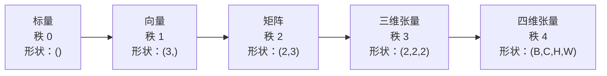
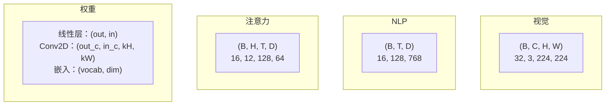
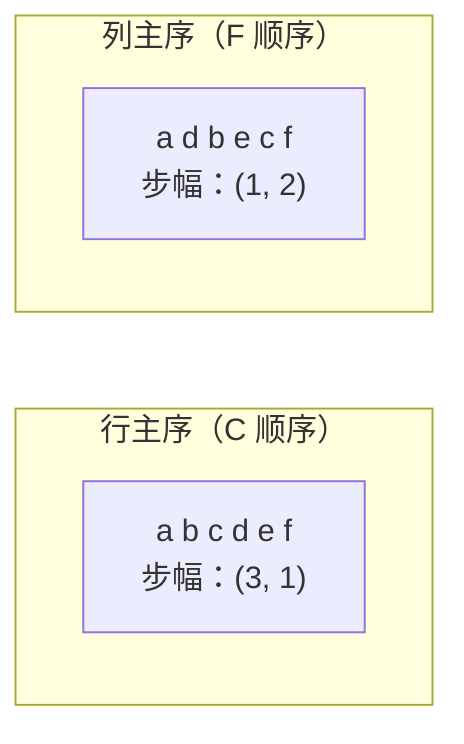
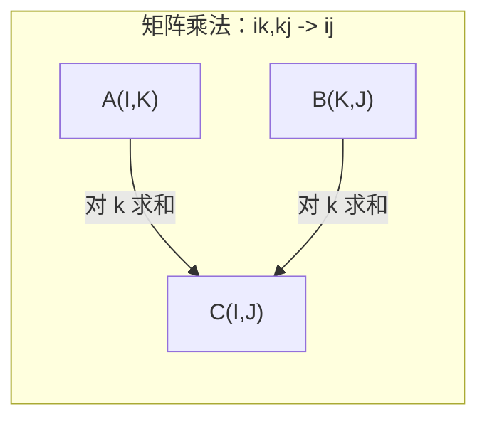

# 张量操作

> 张量是数据与深度学习之间的通用语言。每张图像、每个句子、每个梯度都流经它们。

**类型：** 实践
**语言：** Python
**前置要求：** 阶段 1，第 01 课（线性代数直觉）、第 02 课（向量、矩阵与运算）
**时间：** 约 90 分钟

## 学习目标

- 从零实现张量类，支持形状、步幅、reshape、转置和逐元素操作
- 应用广播规则在不复制数据的情况下对不同形状的张量进行操作
- 用 einsum 表达式实现点积、矩阵乘法、外积和批量操作
- 追踪多头注意力每个步骤中的精确张量形状

## 问题

你构建了一个 Transformer。前向传播代码看起来很整洁。你运行它，得到：`RuntimeError: mat1 and mat2 shapes cannot be multiplied (32x768 and 512x768)`。你盯着形状看，尝试转置，现在又说 `Expected 4D input (got 3D input)`。你加了 unsqueeze，又有其他东西出错了。

形状错误是深度学习代码中最常见的 bug。概念上并不难——每个操作都有形状约定——但它们会迅速积累。一个 Transformer 有数十个 reshape、转置和广播链在一起。一个轴错了，错误就会级联。更糟的是，有些形状错误根本不抛出错误，它们会悄悄地沿着错误的维度广播或对错误的轴求和，产生垃圾结果。

矩阵处理两组事物之间的成对关系。真实数据不能放入二维。32 张 224×224 RGB 图像的批次是一个 4D 张量：`(32, 3, 224, 224)`。12 个头的自注意力也是 4D：`(batch, heads, seq_len, head_dim)`。你需要一个推广到任意维度数量的数据结构，其操作能在所有维度上干净地组合。这个结构就是张量。掌握其操作，形状错误将变得轻而易举地可调试。

## 概念

### 什么是张量

张量是具有统一数据类型的多维数字数组。维度数称为**秩**（或**阶**）。每个维度是一个**轴**。**形状**是列出每个轴大小的元组。



总元素数 = 所有大小的乘积。形状 `(2, 3, 4)` 包含 `2 * 3 * 4 = 24` 个元素。

### 深度学习中的张量形状

不同数据类型按惯例映射到特定的张量形状。



PyTorch 使用 NCHW（通道优先）。TensorFlow 默认使用 NHWC（通道最后）。布局不匹配会导致无声的性能下降或错误。

### 内存布局的工作原理

2D 数组在内存中是一个一维字节序列。**步幅**告诉你沿每个轴移动一步需要跳过多少个元素。



转置不移动数据，它交换步幅，使张量**不连续**——一行的元素在内存中不再相邻。

### 广播规则

广播让你在不复制数据的情况下对不同形状的张量进行操作。从右对齐形状，当两个维度相等或其中一个为 1 时，它们是兼容的。维度较少的张量在左边填充 1。

```
张量 A：     (8, 1, 6, 1)
张量 B：        (7, 1, 5)
填充后 B：   (1, 7, 1, 5)
结果：       (8, 7, 6, 5)
```

### Einsum：通用张量操作

Einstein 求和用字母标记每个轴。出现在输入但不出现在输出中的轴被求和，出现在两者中的轴被保留。



关键模式：`i,i->` （点积）、`i,j->ij`（外积）、`ii->`（迹）、`ij->ji`（转置）、`bij,bjk->bik`（批量矩阵乘法）、`bhtd,bhsd->bhts`（注意力得分）。

## 动手实现

代码在 `code/tensors.py` 中。每个步骤都参考那里的实现。

### 第一步：张量存储与步幅

张量存储一个扁平数字列表加上形状元数据。步幅告诉索引逻辑如何将多维索引映射到扁平位置。

```python
class Tensor:
    def __init__(self, data, shape=None):
        if isinstance(data, (list, tuple)):
            self._data, self._shape = self._flatten_nested(data)
        elif isinstance(data, np.ndarray):
            self._data = data.flatten().tolist()
            self._shape = tuple(data.shape)
        else:
            self._data = [data]
            self._shape = ()

        if shape is not None:
            total = reduce(lambda a, b: a * b, shape, 1)
            if total != len(self._data):
                raise ValueError(
                    f"无法将 {len(self._data)} 个元素 reshape 成形状 {shape}"
                )
            self._shape = tuple(shape)

        self._strides = self._compute_strides(self._shape)

    @staticmethod
    def _compute_strides(shape):
        if len(shape) == 0:
            return ()
        strides = [1] * len(shape)
        for i in range(len(shape) - 2, -1, -1):
            strides[i] = strides[i + 1] * shape[i + 1]
        return tuple(strides)
```

对于形状 `(3, 4)`，步幅为 `(4, 1)`——前进一行跳过 4 个元素，前进一列跳过 1 个元素。

### 第二步：Reshape、squeeze、unsqueeze

Reshape 在不改变元素顺序的情况下改变形状。元素总数必须保持不变。对一个维度使用 `-1` 可推断其大小。

```python
t = Tensor(list(range(12)), shape=(2, 6))
r = t.reshape((3, 4))
r = t.reshape((-1, 3))
```

Squeeze 删除大小为 1 的轴，Unsqueeze 插入一个。Unsqueeze 对广播至关重要——将偏置向量 `(D,)` 加到批次 `(B, T, D)` 时，需要 unsqueeze 为 `(1, 1, D)`。

```python
t = Tensor(list(range(6)), shape=(1, 3, 1, 2))
s = t.squeeze()
v = Tensor([1, 2, 3])
u = v.unsqueeze(0)
```

### 第三步：转置与置换

转置交换两个轴，置换重新排列所有轴。这是在 NCHW 和 NHWC 之间转换的方式。

```python
mat = Tensor(list(range(6)), shape=(2, 3))
tr = mat.transpose(0, 1)

t4d = Tensor(list(range(24)), shape=(1, 2, 3, 4))
perm = t4d.permute((0, 2, 3, 1))
```

转置或置换后，张量在内存中不连续。在 PyTorch 中，`view` 在不连续张量上会失败——先使用 `reshape` 或调用 `.contiguous()`。

### 第四步：逐元素操作与归约

逐元素操作（加、乘、减）独立应用于每个元素并保留形状。归约（求和、均值、最大值）将一个或多个轴折叠。

```python
a = Tensor([[1, 2], [3, 4]])
b = Tensor([[10, 20], [30, 40]])
c = a + b
d = a * 2
s = a.sum(axis=0)
```

CNN 中的全局平均池化：`(B, C, H, W).mean(axis=[2, 3])` 产生 `(B, C)`。NLP 中的序列均值池化：`(B, T, D).mean(axis=1)` 产生 `(B, D)`。

### 第五步：使用 NumPy 广播

`tensors.py` 中的 `demo_broadcasting_numpy()` 函数展示核心模式。

```python
activations = np.random.randn(4, 3)
bias = np.array([0.1, 0.2, 0.3])
result = activations + bias

images = np.random.randn(2, 3, 4, 4)
scale = np.array([0.5, 1.0, 1.5]).reshape(1, 3, 1, 1)
result = images * scale

a = np.array([1, 2, 3]).reshape(-1, 1)
b = np.array([10, 20, 30, 40]).reshape(1, -1)
outer = a * b
```

通过广播计算成对距离：将 `(M, 2)` reshape 为 `(M, 1, 2)`，将 `(N, 2)` reshape 为 `(1, N, 2)`，相减、平方、沿最后一个轴求和、取平方根。结果：`(M, N)`。

### 第六步：Einsum 操作

`demo_einsum()` 和 `demo_einsum_gallery()` 函数遍历每种常见模式。

```python
a = np.array([1.0, 2.0, 3.0])
b = np.array([4.0, 5.0, 6.0])
dot = np.einsum("i,i->", a, b)

A = np.array([[1, 2], [3, 4], [5, 6]], dtype=float)
B = np.array([[7, 8, 9], [10, 11, 12]], dtype=float)
matmul = np.einsum("ik,kj->ij", A, B)

batch_A = np.random.randn(4, 3, 5)
batch_B = np.random.randn(4, 5, 2)
batch_mm = np.einsum("bij,bjk->bik", batch_A, batch_B)
```

一次收缩的计算量是所有索引大小（保留的和求和的）的乘积。对于 `bij,bjk->bik`，B=32, I=128, J=64, K=128：`32 * 128 * 64 * 128 = 33,554,432` 次乘加操作。

### 第七步：通过 einsum 实现注意力机制

`demo_attention_einsum()` 函数端到端实现多头注意力。

```python
B, H, T, D = 2, 4, 8, 16
E = H * D

X = np.random.randn(B, T, E)
W_q = np.random.randn(E, E) * 0.02

Q = np.einsum("bte,ek->btk", X, W_q)
Q = Q.reshape(B, T, H, D).transpose(0, 2, 1, 3)

scores = np.einsum("bhtd,bhsd->bhts", Q, K) / np.sqrt(D)
weights = softmax(scores, axis=-1)
attn_output = np.einsum("bhts,bhsd->bhtd", weights, V)

concat = attn_output.transpose(0, 2, 1, 3).reshape(B, T, E)
output = np.einsum("bte,ek->btk", concat, W_o)
```

每个步骤都是一个张量操作：投影（通过 einsum 的矩阵乘法）、头分割（reshape + 转置）、注意力得分（通过 einsum 的批量矩阵乘法）、加权求和（通过 einsum 的批量矩阵乘法）、头合并（转置 + reshape）、输出投影（通过 einsum 的矩阵乘法）。

## 实际使用

### 从零实现 vs NumPy

| 操作 | 从零实现（Tensor 类） | NumPy |
|------|---------------------|-------|
| 创建 | `Tensor([[1,2],[3,4]])` | `np.array([[1,2],[3,4]])` |
| Reshape | `t.reshape((3,4))` | `a.reshape(3,4)` |
| 转置 | `t.transpose(0,1)` | `a.T` 或 `a.transpose(0,1)` |
| Squeeze | `t.squeeze(0)` | `np.squeeze(a, 0)` |
| 求和 | `t.sum(axis=0)` | `a.sum(axis=0)` |
| Einsum | 不适用 | `np.einsum("ij,jk->ik", a, b)` |

### 从零实现 vs PyTorch

```python
import torch

t = torch.tensor([[1, 2, 3], [4, 5, 6]], dtype=torch.float32)
t.shape
t.stride()
t.is_contiguous()

t.reshape(3, 2)
t.unsqueeze(0)
t.transpose(0, 1)
t.transpose(0, 1).contiguous()

torch.einsum("ik,kj->ij", A, B)
```

PyTorch 增加了自动微分、GPU 支持和优化的 BLAS 内核。形状语义完全相同。如果你理解了从零实现的版本，PyTorch 形状错误就变得可读了。

### 每种神经网络层都是张量操作

| 操作 | 张量形式 | Einsum |
|------|----------|--------|
| 线性层 | `Y = X @ W.T + b` | `"bd,od->bo"` + 偏置 |
| 注意力 QKV | `Q = X @ W_q` | `"btd,dh->bth"` |
| 注意力得分 | `Q @ K.T / sqrt(d)` | `"bhtd,bhsd->bhts"` |
| 注意力输出 | `softmax(scores) @ V` | `"bhts,bhsd->bhtd"` |
| 批归一化 | `(X - mu) / sigma * gamma` | 逐元素 + 广播 |
| Softmax | `exp(x) / sum(exp(x))` | 逐元素 + 归约 |

## 交付产出

本节课产出两个可复用提示词：

1. **`outputs/prompt-tensor-shapes.md`** — 用于调试张量形状不匹配的系统提示词，包含每种常见操作（matmul、broadcast、cat、Linear、Conv2d、BatchNorm、softmax）的决策表和修复查找表。

2. **`outputs/prompt-tensor-debugger.md`** — 当形状错误阻塞你时，可粘贴到任何 AI 助手的分步调试提示词，输入错误消息和你的张量形状，获得精确的修复方案。

## 练习

1. **简单 — Reshape 往返。** 取一个形状为 `(2, 3, 4)` 的张量，reshape 为 `(6, 4)`，再到 `(24,)`，再回到 `(2, 3, 4)`。通过打印每个步骤的扁平数据验证元素顺序被保留。

2. **中等 — 实现广播。** 为 `Tensor` 类添加 `broadcast_to(shape)` 方法，将大小为 1 的维度扩展以匹配目标形状。然后修改 `_elementwise_op`，在操作前自动广播。用形状 `(3, 1)` 和 `(1, 4)` 测试，产生 `(3, 4)`。

3. **困难 — 从零构建 einsum。** 实现一个基本的 `einsum(subscripts, *tensors)` 函数，至少处理：点积（`i,i->`）、矩阵乘法（`ij,jk->ik`）、外积（`i,j->ij`）和转置（`ij->ji`）。解析下标字符串，识别收缩索引，并遍历所有索引组合。与 `np.einsum` 的结果对比。

4. **困难 — 注意力形状追踪。** 编写一个函数，以 `batch_size`、`seq_len`、`embed_dim` 和 `num_heads` 为输入，打印多头注意力每个步骤的精确形状：输入、Q/K/V 投影、头分割、注意力得分、softmax 权重、加权求和、头合并、输出投影。与 `demo_attention_einsum()` 的输出对比验证。

## 关键术语

| 术语 | 大家怎么说 | 实际含义 |
|------|------------|----------|
| 张量（Tensor）| "多维矩阵" | 具有统一类型、定义形状、步幅和操作的多维数组 |
| 秩（Rank）| "维度数" | 轴的数量，矩阵的秩为 2，不等于其矩阵秩 |
| 形状（Shape）| "张量的大小" | 列出每个轴大小的元组，`(2, 3)` 表示 2 行 3 列 |
| 步幅（Stride）| "内存如何布局" | 沿每个轴前进一位需要跳过的元素数 |
| 广播（Broadcasting）| "形状不同时自动工作" | 严格的规则集：从右对齐，维度必须相等或其中一个为 1 |
| 连续（Contiguous）| "张量正常" | 元素在内存中按逻辑布局顺序存储，没有间隙或重排 |
| Einsum | "花哨的矩阵乘法写法" | 一种通用符号，用一行表达任何张量收缩、外积、迹或转置 |
| View | "与 reshape 相同" | 共享同一内存缓冲区但有不同形状/步幅元数据的张量，对不连续数据失败 |
| 收缩（Contraction）| "对索引求和" | 两个张量之间共享索引相乘后求和，产生更低秩结果的一般操作 |
| NCHW/NHWC | "PyTorch vs TensorFlow 格式" | 图像张量的内存布局约定，NCHW 将通道放在空间维度之前，NHWC 放在之后 |

## 延伸阅读

- [NumPy 广播](https://numpy.org/doc/stable/user/basics.broadcasting.html) — 带可视化示例的规范规则
- [PyTorch 张量视图](https://pytorch.org/docs/stable/tensor_view.html) — 何时视图有效，何时会复制
- [einops](https://github.com/arogozhnikov/einops) — 使张量 reshape 可读且安全的库
- [图解 Transformer](https://jalammar.github.io/illustrated-transformer/) — 可视化注意力机制中流动的张量形状
- [NumPy 中的 Einstein 求和](https://numpy.org/doc/stable/reference/generated/numpy.einsum.html) — 带示例的完整 einsum 文档
