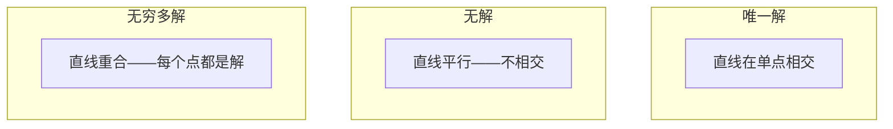

# 线性方程组

> 求解 Ax = b 是数学中最古老的问题，但它至今仍在驱动你的神经网络。

**类型：** 实践
**语言：** Python
**前置条件：** 第 1 阶段，第 01 课（线性代数直觉）、第 02 课（向量与矩阵）、第 03 课（矩阵变换）
**时间：** ~120 分钟

## 学习目标

- 使用带部分主元选取的高斯消元法和回代法求解 Ax = b
- 对矩阵进行 LU、QR 和 Cholesky 分解，并解释各自的适用场景
- 推导最小二乘的法方程，并将其与线性回归和岭回归联系起来
- 使用条件数诊断病态方程组，并应用正则化使其稳定

## 问题所在

每次训练线性回归，你都在求解一个线性方程组。每次计算最小二乘拟合，你都在求解一个线性方程组。每次神经网络层计算 `y = Wx + b`，它都在评估线性方程组的一侧。当你添加正则化时，你在修改这个方程组。当你使用高斯过程时，你在分解一个矩阵。当你对马氏距离求逆协方差矩阵时，你在求解一个线性方程组。

方程 Ax = b 无处不在。A 是已知系数矩阵，b 是已知输出向量，x 是你想找的未知向量。在线性回归中，A 是你的数据矩阵，b 是目标向量，x 是权重向量。整个模型简化为：找到使 Ax 尽量接近 b 的 x。

本课从零构建求解该方程的每种主要方法。你将理解为什么某些方法快速而另一些稳定，为什么某些方法只适用于方阵而其他方法处理超定方程组，以及为什么矩阵的条件数决定了你的答案是否有任何意义。

## 核心概念

### Ax = b 的几何含义

线性方程组有几何解释。每个方程定义一个超平面。解是所有超平面相交的点（或点集）。

```
2x + y = 5          二维中的两条直线。
x - y  = 1          它们相交于 x=2, y=1。
```

可能发生三种情况：



用矩阵形式，"唯一解"意味着 A 可逆。"无解"意味着方程组不相容。"无穷多解"意味着 A 有零空间。大多数 ML 问题属于"没有精确解"类别，因为数据点（方程）多于参数（未知量）。这就是最小二乘发挥作用的地方。

### 列图像 vs 行图像

有两种读取 Ax = b 的方式。

**行图像。** A 的每一行定义一个方程，每个方程是一个超平面，解是所有超平面的交点。

**列图像。** A 的每一列是一个向量，问题变为：A 的列的什么线性组合产生 b？

```
A = | 2  1 |    b = | 5 |
    | 1 -1 |        | 1 |

行图像：同时求解 2x + y = 5 和 x - y = 1。

列图像：找 x1, x2 使得：
  x1 * [2, 1] + x2 * [1, -1] = [5, 1]
  2 * [2, 1] + 1 * [1, -1] = [4+1, 2-1] = [5, 1]   ✓
```

列图像更根本。如果 b 在 A 的列空间中，方程组有解。如果不在，你找到列空间中最近的点，那个最近的点就是最小二乘解。

### 高斯消元法

高斯消元法将 Ax = b 变换为上三角方程组 Ux = c，然后用回代法求解。这是最直接的方法。

算法：

```
1. 对每一列 k（主列）：
   a. 找到列 k 中第 k 行或以下的最大元素（部分主元选取）。
   b. 将该行与第 k 行交换。
   c. 对第 k 行以下的每一行 i：
      - 计算乘数 m = A[i][k] / A[k][k]
      - 从第 i 行减去 m 倍的第 k 行。
2. 回代：从最后一个方程向上求解。
```

示例：

```
原始：
| 2  1  1 | 8 |       R2 = R2 - (2)R1     | 2  1   1 |  8 |
| 4  3  3 |20 |  -->  R3 = R3 - (1)R1 --> | 0  1   1 |  4 |
| 2  3  1 |12 |                            | 0  2   0 |  4 |

                       R3 = R3 - (2)R2     | 2  1   1 |  8 |
                                       --> | 0  1   1 |  4 |
                                           | 0  0  -2 | -4 |

回代：
  -2 * x3 = -4    -->  x3 = 2
  x2 + 2  = 4     -->  x2 = 2
  2*x1 + 2 + 2 = 8 --> x1 = 2
```

高斯消元法代价 O(n^3)。对于 1000×1000 的方程组，约十亿次浮点运算。快速，但如果需要多次求解相同的 A，可以做得更好。

### 部分主元选取：为什么重要

不用主元选取，高斯消元法可能失败或产生垃圾结果。如果主元元素为零，就会除以零。如果主元很小，就会放大舍入误差。

```
不好的主元：                         带部分主元选取：
| 0.001  1 | 1.001 |            先交换行：
| 1      1 | 2     |            | 1      1 | 2     |
                                 | 0.001  1 | 1.001 |
m = 1/0.001 = 1000              m = 0.001/1 = 0.001
（误差被大量放大）                  （乘数小，计算稳定）
```

在精度有限的浮点运算中，不用主元选取的版本可能丢失有效数字。部分主元选取始终选择最大的可用主元，以最小化误差放大。

### LU 分解

LU 分解将 A 分解为下三角矩阵 L 和上三角矩阵 U：A = LU。L 矩阵存储高斯消元的乘数，U 矩阵是消元的结果。

```
A = L @ U

| 2  1  1 |   | 1  0  0 |   | 2  1   1 |
| 4  3  3 | = | 2  1  0 | @ | 0  1   1 |
| 2  3  1 |   | 1  2  1 |   | 0  0  -2 |
```

为什么分解而不直接消元？因为有了 L 和 U，对任何新的 b 求解 Ax = b 只需 O(n^2)：

```
Ax = b
LUx = b
令 y = Ux：
  Ly = b    （前代，O(n^2)）
  Ux = y    （回代，O(n^2)）
```

O(n^3) 的代价在分解时只付一次。之后每次求解是 O(n^2)。如果需要对相同的 A 求解 1000 个不同的 b 向量，LU 节省约 1000/3 倍的总工作量。

带部分主元选取的 LU 分解得到 PA = LU，其中 P 是记录行交换的置换矩阵。

### QR 分解

QR 分解将 A 分解为正交矩阵 Q 和上三角矩阵 R：A = QR。

正交矩阵满足 Q^T Q = I。它的列是正交规范向量。乘以 Q 保持长度和角度不变。

```
A = Q @ R

Q 有正交规范列：Q^T Q = I
R 是上三角的

求解 Ax = b：
  QRx = b
  Rx = Q^T b    （只需乘以 Q^T，不需要求逆）
  回代得到 x。
```

QR 在求解最小二乘问题时比 LU 数值更稳定。Gram-Schmidt 过程逐列构建 Q：

```
给定 A 的列 a1, a2, ...：

q1 = a1 / ||a1||

q2 = a2 - (a2 . q1) * q1        （减去在 q1 上的投影）
q2 = q2 / ||q2||                （归一化）

q3 = a3 - (a3 . q1) * q1 - (a3 . q2) * q2
q3 = q3 / ||q3||

R[i][j] = qi . aj    对于 i <= j
```

每步移除沿所有前面 q 向量的分量，只留下新的正交方向。

### Cholesky 分解

当 A 是对称的（A = A^T）且正定的（所有特征值为正），可以将其分解为 A = L L^T，其中 L 是下三角矩阵。这是 Cholesky 分解。

```
A = L @ L^T

| 4  2 |   | 2  0 |   | 2  1 |
| 2  5 | = | 1  2 | @ | 0  2 |

L[i][i] = sqrt(A[i][i] - sum(L[i][k]^2 for k < i))
L[i][j] = (A[i][j] - sum(L[i][k]*L[j][k] for k < j)) / L[j][j]    对于 i > j
```

Cholesky 比 LU 快两倍，只需一半的存储。它只适用于对称正定矩阵，但这类矩阵频繁出现：

- 协方差矩阵是对称半正定的（带正则化是正定的）。
- 高斯过程中的核矩阵是对称正定的。
- 凸函数在极小值处的 Hessian 是对称正定的。
- A^T A 始终是对称半正定的。

在高斯过程中，你用 Cholesky 分解核矩阵 K，然后求解 K alpha = y 得到预测均值。Cholesky 因子也给出边际似然的对数行列式：log det(K) = 2 * sum(log(diag(L)))。

### 最小二乘：当 Ax = b 没有精确解时

如果 A 是 m × n 且 m > n（方程多于未知量），方程组是超定的，没有精确解。你改为最小化平方误差：

```
最小化 ||Ax - b||^2

这是残差的平方和：
  sum((A[i,:] @ x - b[i])^2 for i in range(m))
```

最小值满足法方程：

```
A^T A x = A^T b
```

推导：展开 ||Ax - b||^2 = (Ax - b)^T (Ax - b) = x^T A^T A x - 2 x^T A^T b + b^T b。对 x 求梯度，令其为零：2 A^T A x - 2 A^T b = 0。

```
原始方程组（超定，4 个方程，2 个未知量）：
| 1  1 |         | 3 |
| 1  2 | x     = | 5 |       没有精确的 x 满足所有 4 个方程。
| 1  3 |         | 6 |
| 1  4 |         | 8 |

法方程：
A^T A = | 4  10 |    A^T b = | 22 |
        | 10 30 |            | 63 |

求解：x = [1.5, 1.7]

这就是线性回归。x[0] 是截距，x[1] 是斜率。
```

### 法方程 = 线性回归

联系是精确的。在线性回归中，数据矩阵 X 每行一个样本，每列一个特征。目标向量 y 每行一个样本。权重向量 w 满足：

```
X^T X w = X^T y
w = (X^T X)^(-1) X^T y
```

这是线性回归的封闭形式解。每次调用 `sklearn.linear_model.LinearRegression.fit()` 都在计算这个（或通过 QR 或 SVD 的等价形式）。

加上正则化项 lambda * I，就得到岭回归：

```
(X^T X + lambda * I) w = X^T y
w = (X^T X + lambda * I)^(-1) X^T y
```

正则化使矩阵条件更好（更容易精确求逆），并通过将权重向零收缩来防止过拟合。当 lambda > 0 时，矩阵 X^T X + lambda * I 始终是对称正定的，因此可以用 Cholesky 求解。

### 伪逆（Moore-Penrose）

伪逆 A+ 将矩阵求逆推广到非方阵和奇异矩阵。对任意矩阵 A：

```
x = A+ b

其中 A+ = V Sigma+ U^T    （通过 SVD 计算）
```

Sigma+ 通过对每个非零奇异值取倒数并转置形成。如果 A = U Sigma V^T，则 A+ = V Sigma+ U^T。

```
A = U Sigma V^T        （SVD）

Sigma = | 5  0 |       Sigma+ = | 1/5  0  0 |
        | 0  2 |                | 0  1/2  0 |
        | 0  0 |

A+ = V Sigma+ U^T
```

伪逆给出最小范数最小二乘解。如果方程组有：
- 唯一解：A+ b 给出它。
- 无解：A+ b 给出最小二乘解。
- 无穷多解：A+ b 给出 ||x|| 最小的那个。

NumPy 的 `np.linalg.lstsq` 和 `np.linalg.pinv` 都内部使用 SVD。

### 条件数

条件数衡量解对输入微小变化的敏感程度。对矩阵 A，条件数为：

```
kappa(A) = ||A|| * ||A^(-1)|| = sigma_max / sigma_min
```

其中 sigma_max 和 sigma_min 是最大和最小奇异值。

```
条件良好（kappa ~ 1）：              条件差（kappa ~ 10^15）：
b 的微小变化 -->                    b 的微小变化 -->
x 的微小变化                         x 的巨大变化

| 2  0 |   kappa = 2/1 = 2          | 1   1          |   kappa ~ 10^15
| 0  1 |   可以安全求解              | 1   1+10^(-15) |   解是垃圾
```

经验法则：
- kappa < 100：安全，解准确。
- kappa ~ 10^k：从浮点精度中损失约 k 位数字。
- kappa ~ 10^16（对于 float64）：解毫无意义。矩阵实际上是奇异的。

在 ML 中，当特征几乎共线时会出现病态。正则化（加上 lambda * I）将条件数从 sigma_max / sigma_min 改善为 (sigma_max + lambda) / (sigma_min + lambda)。

### 迭代方法：共轭梯度法

对于非常大的稀疏方程组（数百万个未知量），LU 或 Cholesky 等直接方法代价太高。迭代方法通过在多次迭代中改进猜测来近似解。

共轭梯度法（CG）在 A 是对称正定时求解 Ax = b。在精确算术中，它最多 n 次迭代找到精确解，但如果 A 的特征值聚集，通常收敛得更快。

```
算法草图：
  x0 = 初始猜测（通常为零）
  r0 = b - A x0           （残差）
  p0 = r0                 （搜索方向）

  对于 k = 0, 1, 2, ...：
    alpha = (rk . rk) / (pk . A pk)
    x_{k+1} = xk + alpha * pk
    r_{k+1} = rk - alpha * A pk
    beta = (r_{k+1} . r_{k+1}) / (rk . rk)
    p_{k+1} = r_{k+1} + beta * pk
    如果 ||r_{k+1}|| < 容差：停止
```

CG 用于：
- 大规模优化（Newton-CG 方法）
- 求解 PDE 离散化
- 核矩阵太大无法分解的核方法
- 其他迭代求解器的预条件

收敛速度取决于条件数。条件更好的方程组收敛更快，这是正则化有帮助的另一个原因。

### 完整图景：何时用哪种方法

| 方法 | 要求 | 代价 | 使用场景 |
|------|------|------|---------|
| 高斯消元法 | 方阵，非奇异 A | O(n^3) | 方阵方程组的一次性求解 |
| LU 分解 | 方阵，非奇异 A | O(n^3) 分解 + O(n^2) 求解 | 同一 A 的多次求解 |
| QR 分解 | 任意 A (m >= n) | O(mn^2) | 最小二乘，数值稳定 |
| Cholesky | 对称正定 A | O(n^3/3) | 协方差矩阵、高斯过程、岭回归 |
| 法方程 | 超定（m > n） | O(mn^2 + n^3) | 线性回归（小 n） |
| SVD / 伪逆 | 任意 A | O(mn^2) | 秩亏方程组，最小范数解 |
| 共轭梯度法 | 对称正定，稀疏 A | O(n * k * nnz) | 大型稀疏方程组，k = 迭代次数 |

### 与 ML 的联系

本课中的每种方法都出现在生产 ML 中：

**线性回归。** 封闭形式解求解法方程 X^T X w = X^T y。通过 Cholesky（n 小时）或 QR（注重数值稳定性时）或 SVD（矩阵可能秩亏时）完成。

**岭回归。** 向 X^T X 加上 lambda * I。正则化方程组 (X^T X + lambda * I) w = X^T y 始终可以通过 Cholesky 求解，因为当 lambda > 0 时 X^T X + lambda * I 是对称正定的。

**高斯过程。** 预测均值需要求解 K alpha = y，其中 K 是核矩阵。K 的 Cholesky 分解是标准方法。对数边际似然使用 log det(K) = 2 sum(log(diag(L)))。

**神经网络初始化。** 正交初始化使用 QR 分解创建列正交规范的权重矩阵。这防止深层网络中的信号坍塌。

**预条件。** 大规模优化器使用不完全 Cholesky 或不完全 LU 作为共轭梯度求解器的预条件器。

**特征工程。** X^T X 的条件数告诉你特征是否共线。如果 kappa 很大，删除特征或添加正则化。

## 实践

### 步骤 1：带部分主元选取的高斯消元法

```python
import numpy as np

def gaussian_elimination(A, b):
    n = len(b)
    Ab = np.hstack([A.astype(float), b.reshape(-1, 1).astype(float)])

    for k in range(n):
        max_row = k + np.argmax(np.abs(Ab[k:, k]))
        Ab[[k, max_row]] = Ab[[max_row, k]]

        if abs(Ab[k, k]) < 1e-12:
            raise ValueError(f"矩阵在主元 {k} 处是奇异的或接近奇异的")

        for i in range(k + 1, n):
            m = Ab[i, k] / Ab[k, k]
            Ab[i, k:] -= m * Ab[k, k:]

    x = np.zeros(n)
    for i in range(n - 1, -1, -1):
        x[i] = (Ab[i, -1] - Ab[i, i+1:n] @ x[i+1:n]) / Ab[i, i]

    return x
```

### 步骤 2：LU 分解

```python
def lu_decompose(A):
    n = A.shape[0]
    L = np.eye(n)
    U = A.astype(float).copy()
    P = np.eye(n)

    for k in range(n):
        max_row = k + np.argmax(np.abs(U[k:, k]))
        if max_row != k:
            U[[k, max_row]] = U[[max_row, k]]
            P[[k, max_row]] = P[[max_row, k]]
            if k > 0:
                L[[k, max_row], :k] = L[[max_row, k], :k]

        for i in range(k + 1, n):
            L[i, k] = U[i, k] / U[k, k]
            U[i, k:] -= L[i, k] * U[k, k:]

    return P, L, U
```

### 步骤 3：Cholesky 分解

```python
def cholesky(A):
    n = A.shape[0]
    L = np.zeros_like(A, dtype=float)

    for i in range(n):
        for j in range(i + 1):
            s = A[i, j] - L[i, :j] @ L[j, :j]
            if i == j:
                if s <= 0:
                    raise ValueError("矩阵不是正定的")
                L[i, j] = np.sqrt(s)
            else:
                L[i, j] = s / L[j, j]

    return L
```

### 步骤 4：通过法方程求最小二乘

```python
def least_squares_normal(A, b):
    AtA = A.T @ A
    Atb = A.T @ b
    return gaussian_elimination(AtA, Atb)

def ridge_regression(A, b, lam):
    n = A.shape[1]
    AtA = A.T @ A + lam * np.eye(n)
    Atb = A.T @ b
    L = cholesky(AtA)
    y = np.zeros(n)
    for i in range(n):
        y[i] = (Atb[i] - L[i, :i] @ y[:i]) / L[i, i]
    x = np.zeros(n)
    for i in range(n - 1, -1, -1):
        x[i] = (y[i] - L.T[i, i+1:] @ x[i+1:]) / L.T[i, i]
    return x
```

### 步骤 5：条件数

```python
def condition_number(A):
    U, S, Vt = np.linalg.svd(A)
    return S[0] / S[-1]
```

## 关键术语

| 术语 | 人们怎么说 | 实际含义 |
|------|-----------|---------|
| 线性方程组 | "求解 x" | 一组线性方程 Ax = b。找到 x 意味着找到在变换 A 下产生输出 b 的输入。 |
| 高斯消元法 | "行化简" | 系统地用行操作将对角线以下的元素置零，产生可用回代法求解的上三角方程组。O(n^3)。 |
| 部分主元选取 | "为了稳定性交换行" | 在消元列 k 之前，将该列中绝对值最大的行交换到主元位置。防止除以小数。 |
| LU 分解 | "分解为三角矩阵" | 写成 A = LU，L 是下三角（存储乘数），U 是上三角（消元后的矩阵）。分摊多次求解的 O(n^3) 代价。 |
| QR 分解 | "正交分解" | 写成 A = QR，Q 有正交规范列，R 是上三角。对最小二乘比 LU 更稳定。 |
| Cholesky 分解 | "矩阵的平方根" | 对对称正定 A，写成 A = LL^T。代价是 LU 的一半。用于协方差矩阵、核矩阵和岭回归。 |
| 最小二乘 | "不可能精确时的最佳拟合" | 当方程组超定（方程多于未知量）时，最小化残差平方和 ||Ax - b||^2。 |
| 法方程 | "微积分的快捷方式" | A^T A x = A^T b。将 ||Ax - b||^2 的梯度置为零。这就是线性回归的封闭形式解。 |
| 伪逆 | "非方阵的求逆" | A+ = V Sigma+ U^T（通过 SVD）。对任意矩阵，无论方阵还是矩形、奇异还是非奇异，给出最小范数最小二乘解。 |
| 条件数 | "这个答案有多可信" | kappa = sigma_max / sigma_min。衡量对输入扰动的敏感性。损失约 log10(kappa) 位精度。 |
| 岭回归 | "正则化最小二乘" | 求解 (X^T X + lambda I) w = X^T y。加上 lambda I 改善条件并将权重向零收缩。防止过拟合。 |
| 共轭梯度法 | "大矩阵的迭代 Ax=b" | 对称正定方程组的迭代求解器。最多 n 步收敛。对大型稀疏方程组实用，因为分解代价太高。 |
| 超定方程组 | "数据多于参数" | m × n 方程组中 m > n。不存在精确解。最小二乘找到最佳近似。这就是每个回归问题。 |
| 回代 | "从下往上求解" | 给定上三角方程组，先求最后一个方程，然后向上回代。O(n^2)。 |
| 前代 | "从上往下求解" | 给定下三角方程组，先求第一个方程，然后向前代入。O(n^2)。在 LU 求解的 L 步中使用。 |
