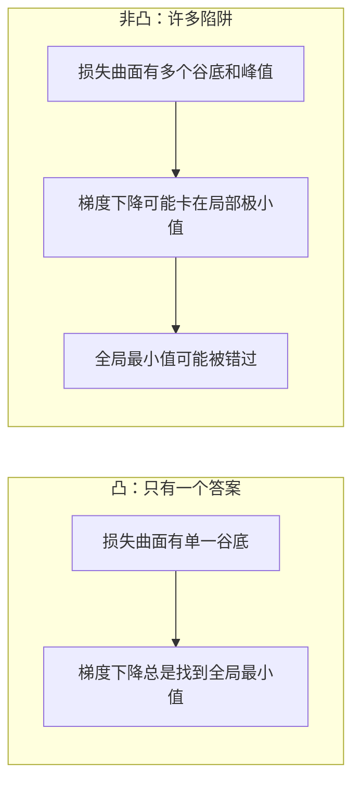
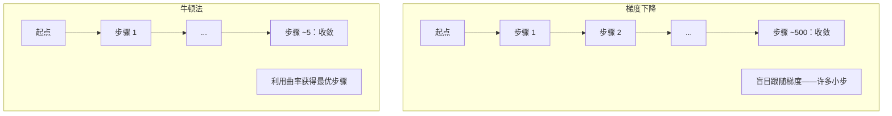
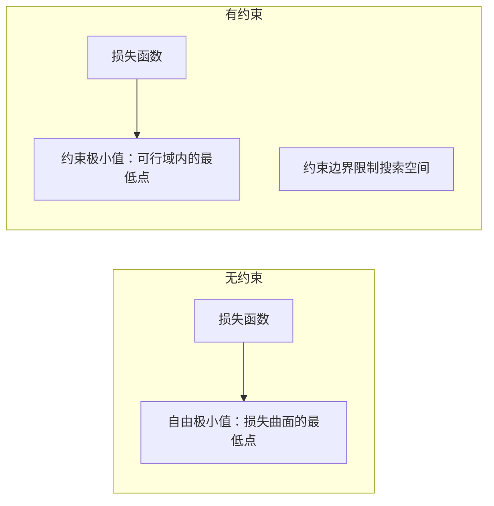
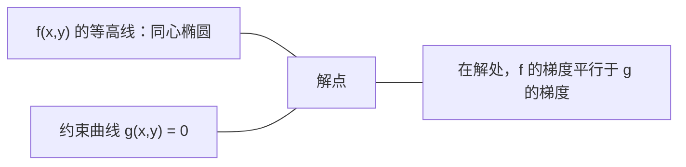

# 凸优化

> 凸问题只有一个谷底。神经网络有数百万个。了解两者的区别很重要。

**类型：** 实践
**语言：** Python
**前置条件：** 第 1 阶段，第 04 课（ML 微积分）、第 08 课（优化）
**时间：** ~90 分钟

## 学习目标

- 使用定义、二阶导数和 Hessian 准则验证函数是否为凸函数
- 实现牛顿法，并将其二次收敛与梯度下降进行比较
- 使用拉格朗日乘数法求解约束优化问题，并解读 KKT 条件
- 解释为什么神经网络损失曲面是非凸的，但 SGD 仍然能找到好的解

## 问题所在

第 08 课教了你梯度下降、动量和 Adam。这些优化器在任何曲面上都向下走。但它们没有任何保证。非凸曲面上的梯度下降可能陷入糟糕的局部极小值、卡在鞍点上，或永远振荡。你之所以使用它，是因为神经网络是非凸的，没有替代方案。

但机器学习中有许多问题是凸的：线性回归、逻辑回归、SVM、LASSO、岭回归。对于这些问题，存在更强大的工具：带数学保证的优化。凸问题只有一个谷底。任何向下走的算法都会到达全局最小值。不需要重新启动，不需要复杂的学习率调度，不需要祈祷。

理解凸性做三件事：第一，它告诉你问题何时容易（凸）或困难（非凸）。第二，它为凸问题提供更快的工具，如牛顿法。第三，它解释贯穿 ML 的概念：正则化作为约束，SVM 中的对偶，以及深度学习为什么尽管违反了凸性给你的每个好性质却依然有效。

## 核心概念

### 凸集

集合 S 是凸集，如果 S 中任意两点之间的线段也完全在 S 内。

| 凸集 | 非凸集 |
|------|--------|
| **矩形**：内部任意两点可以被一条保持在内部的线段连接 | **星形/月牙形**：两个内部点之间的线可能穿出集合 |
| **三角形**：对所有内部点该性质成立 | **圆环/环形**：孔意味着某些线段离开集合 |
| 任意两点之间的线段保持在集合内 | 某些点对之间的线段穿出集合 |

形式检验：对 S 中的任意点 x, y 和 [0, 1] 中的任意 t，点 tx + (1-t)y 也在 S 中。

凸集的例子：
- 直线、平面、整个 R^n
- 球（圆、球面、超球面）
- 半空间：{x : a^T x <= b}
- 任意数量凸集的交集

非凸集的例子：
- 圆环（环形）
- 两个不相交圆的并集
- 任何有"凹陷"或"孔"的集合

### 凸函数

函数 f 是凸函数，如果其定义域是凸集，且对定义域内的任意两点 x, y 和 [0, 1] 中的任意 t：

```
f(tx + (1-t)y) <= t*f(x) + (1-t)*f(y)
```

几何上：图像上任意两点之间的线段位于图像上方或图像上。

| 性质 | 凸函数 | 非凸函数 |
|------|--------|---------|
| **线段检验** | 图像上任意两点之间的线位于曲线**上方或上面** | 图像上某些点之间的线**低于**曲线 |
| **形状** | 单一碗/谷底向上弯曲 | 多个峰和谷，曲率混合 |
| **局部极小值** | 每个局部极小值都是全局极小值 | 可能存在不同高度的多个局部极小值 |

常见凸函数：
- f(x) = x^2（抛物线）
- f(x) = |x|（绝对值）
- f(x) = e^x（指数）
- f(x) = max(0, x)（ReLU，尽管是分段线性）
- f(x) = -log(x) 对 x > 0（负对数）
- 任意线性函数 f(x) = a^T x + b（既凸又凹）

### 凸性检验

三种实用检验，从最容易到最严格。

**检验 1：二阶导数检验（一维）。** 如果 f''(x) >= 0 对所有 x 成立，则 f 是凸函数。

- f(x) = x^2：f''(x) = 2 >= 0。凸函数。
- f(x) = x^3：f''(x) = 6x。在 x < 0 时为负。非凸函数。
- f(x) = e^x：f''(x) = e^x > 0。凸函数。

**检验 2：Hessian 检验（多元）。** 如果对所有 x，Hessian 矩阵 H(x) 是半正定的，则 f 是凸函数。Hessian 是二阶偏导数矩阵。

**检验 3：定义检验。** 直接验证不等式 f(tx + (1-t)y) <= t*f(x) + (1-t)*f(y)。适用于导数难以计算的函数。

### 为什么凸性重要

凸优化的核心定理：

**对于凸函数，每个局部极小值都是全局极小值。**

这意味着梯度下降不会被困住。任何向下的路径都通向相同的答案。算法保证收敛到最优解。



结果：
- 不需要随机重启
- 不需要复杂的学习率调度
- 可以证明收敛（速率取决于函数性质）
- 解是唯一的（在平坦区域内除外）

### ML 中的凸 vs 非凸

| 问题 | 凸？ | 原因 |
|------|------|------|
| 线性回归（MSE） | 是 | 损失关于权重是二次的 |
| 逻辑回归 | 是 | 对数损失关于权重是凸的 |
| SVM（铰链损失） | 是 | 线性函数的最大值 |
| LASSO（L1 回归） | 是 | 凸函数之和是凸的 |
| 岭回归（L2） | 是 | 二次 + 二次 = 凸 |
| 神经网络（任意损失） | 否 | 非线性激活创建非凸曲面 |
| k-means 聚类 | 否 | 离散分配步骤 |
| 矩阵分解 | 否 | 未知量的乘积 |

带凸损失的线性模型是凸的。一旦添加带非线性激活的隐藏层，凸性就被打破了。

### Hessian 矩阵

函数 f: R^n -> R 的 Hessian H 是二阶偏导数的 n × n 矩阵。

```
H[i][j] = d^2 f / (dx_i dx_j)
```

对于 f(x, y) = x^2 + 3xy + y^2：

```
df/dx = 2x + 3y       d^2f/dx^2 = 2      d^2f/dxdy = 3
df/dy = 3x + 2y       d^2f/dydx = 3      d^2f/dy^2 = 2

H = [ 2  3 ]
    [ 3  2 ]
```

Hessian 告诉你曲率：
- 所有特征值为正：函数在每个方向向上弯曲（在该点是凸的）
- 所有特征值为负：在每个方向向下弯曲（凹的，局部最大值）
- 混合符号：鞍点（在某些方向向上，在其他方向向下弯曲）
- 零特征值：在该方向是平的（退化的）

对于凸性，Hessian 必须在各处（不仅仅是一个点）都是半正定的（所有特征值 >= 0）。

### 牛顿法

梯度下降使用一阶信息（梯度）。牛顿法使用二阶信息（Hessian）。它在当前点拟合一个二次近似，然后直接跳到该二次函数的极小值。

```
更新规则：
  x_new = x - H^(-1) * 梯度

与梯度下降比较：
  x_new = x - lr * 梯度
```

牛顿法用逆 Hessian 替换标量学习率。这根据局部曲率自动调整步长和方向。



优点：
- 在极小值附近二次收敛（每步误差平方）
- 不需要调整学习率
- 尺度不变（无论如何参数化问题都有效）

缺点：
- 计算 Hessian 需要 O(n^2) 内存和 O(n^3) 来求逆
- 对于有 100 万个权重的神经网络，需要 10^12 个条目和 10^18 次操作
- 深度学习中不实用

### 约束优化

无约束优化：对所有 x 最小化 f(x)。
约束优化：在约束条件下最小化 f(x)。

实际问题有约束。你想最小化成本，但预算有限。你想最小化误差，但模型复杂度受限。



### 拉格朗日乘数法

拉格朗日乘数法将约束问题转化为无约束问题。

问题：在 g(x) = 0 的约束下最小化 f(x)。

解：引入新变量（拉格朗日乘数 lambda）并求解无约束问题：

```
L(x, lambda) = f(x) + lambda * g(x)
```

在解处，L 的梯度为零：

```
dL/dx = df/dx + lambda * dg/dx = 0
dL/dlambda = g(x) = 0
```

几何直觉：在约束极小值处，f 的梯度必须平行于约束 g 的梯度。如果不平行，你可以沿约束曲面移动并进一步减小 f。



示例：在 x + y = 1 的约束下最小化 f(x,y) = x^2 + y^2。

```
L = x^2 + y^2 + lambda(x + y - 1)

dL/dx = 2x + lambda = 0  =>  x = -lambda/2
dL/dy = 2y + lambda = 0  =>  y = -lambda/2
dL/dlambda = x + y - 1 = 0

由前两个：x = y
代入：2x = 1，所以 x = y = 0.5，lambda = -1
```

直线 x + y = 1 上距原点最近的点是 (0.5, 0.5)。

### KKT 条件

Karush-Kuhn-Tucker 条件将拉格朗日乘数法扩展到不等式约束。

问题：在 g_i(x) <= 0 对所有 i = 1, ..., m 成立的约束下最小化 f(x)。

KKT 条件（最优性的必要条件）：

```
1. 稳定性：    df/dx + sum(lambda_i * dg_i/dx) = 0
2. 原始可行性：g_i(x) <= 0  对所有 i
3. 对偶可行性：lambda_i >= 0  对所有 i
4. 互补松弛：  lambda_i * g_i(x) = 0  对所有 i
```

互补松弛是关键洞察：要么约束是活跃的（g_i = 0，解位于边界上），要么乘数为零（约束无关紧要）。不影响解的约束 lambda = 0。

KKT 条件对 SVM 至关重要。支持向量是约束活跃的数据点（lambda > 0）。所有其他数据点的 lambda = 0，不影响决策边界。

### 正则化作为约束优化

L1 和 L2 正则化不是任意的技巧。它们是伪装的约束优化问题。

**L2 正则化（岭）：**

```
最小化  Loss(w)  满足  ||w||^2 <= t

等价的无约束形式：
最小化  Loss(w) + lambda * ||w||^2
```

约束 ||w||^2 <= t 定义一个球（二维中是圆，三维中是球面）。解是损失等高线第一次接触这个球的地方。

**L1 正则化（LASSO）：**

```
最小化  Loss(w)  满足  ||w||_1 <= t

等价的无约束形式：
最小化  Loss(w) + lambda * ||w||_1
```

约束 ||w||_1 <= t 定义一个菱形（二维中的旋转正方形）。

| 性质 | L2 约束（圆） | L1 约束（菱形） |
|------|-------------|--------------|
| **约束形状** | 圆（高维中是球面） | 菱形（二维中旋转正方形） |
| **损失等高线接触处** | 光滑边界——圆上的任意点 | 角——与坐标轴对齐 |
| **解的行为** | 权重小但非零 | 某些权重恰好为零（稀疏） |
| **结果** | 权重收缩 | 特征选择 |

这解释了为什么 L1 产生稀疏模型（特征选择），而 L2 只收缩权重。菱形的角与轴对齐。损失等高线更可能接触角，将一个或多个权重恰好设为零。

### 对偶

每个约束优化问题（原问题）都有一个伴随问题（对偶问题）。对于凸问题，原问题和对偶问题具有相同的最优值。这是强对偶性。

拉格朗日对偶函数：

```
原问题：在 g(x) <= 0 的约束下最小化 f(x)
拉格朗日量：L(x, lambda) = f(x) + lambda * g(x)
对偶函数：d(lambda) = min_x L(x, lambda)
对偶问题：在 lambda >= 0 的约束下最大化 d(lambda)
```

为什么对偶性重要：
- 对偶问题有时比原问题更容易求解
- SVM 用对偶形式求解，其中问题只依赖数据点之间的点积（使核技巧成为可能）
- 对偶提供了原问题最优值的下界，可用于检验解的质量

对于 SVM：

```
原问题：找 w, b 使间隔 2/||w|| 最大，满足
        y_i(w^T x_i + b) >= 1 对所有 i

对偶问题：最大化 sum(alpha_i) - 0.5 * sum_ij(alpha_i * alpha_j * y_i * y_j * x_i^T x_j)
          满足 alpha_i >= 0 且 sum(alpha_i * y_i) = 0

对偶只涉及点积 x_i^T x_j。
用 K(x_i, x_j) 替换 x_i^T x_j 得到核技巧。
```

### 为什么深度学习尽管非凸却有效

神经网络损失函数是极端非凸的。按所有经典标准，优化它们应该失败。然而随机梯度下降可靠地找到好的解。几个因素解释了这一点。

**大多数局部极小值已经足够好。** 在高维空间中，随机临界点（梯度为零处）绝大多数是鞍点，而不是局部极小值。存在的少数局部极小值的损失值往往接近全局极小值。当参数空间有数百万个维度时，陷入糟糕的局部极小值极不可能。

**鞍点而非局部极小值才是真正的障碍。** 在有 n 个参数的函数中，鞍点有混合正负曲率方向。对于高维中随机临界点，所有 n 个特征值都为正（局部极小值）的概率约为 2^(-n)。几乎所有临界点都是鞍点。SGD 的噪声有助于逃离它们。

**过参数化使曲面更平滑。** 参数多于训练样本的网络有更平滑、更连通的损失曲面。更宽的网络有更少的坏局部极小值。这违反直觉，但与经验一致。

**随机噪声作为隐式正则化。** 小批量 SGD 添加的噪声防止陷入尖锐极小值。尖锐极小值过拟合；平坦极小值泛化。噪声使优化偏向损失曲面的平坦区域。

### 实践中的二阶方法

纯牛顿法对大型模型不实用。几种近似使二阶信息可用。

**L-BFGS（有限内存 BFGS）：** 使用最后 m 次梯度差异近似逆 Hessian。需要 O(mn) 内存而不是 O(n^2)。适用于最多约 10,000 个参数的问题。用于经典 ML（逻辑回归、CRF），但不用于深度学习。

**自然梯度：** 使用 Fisher 信息矩阵（对数似然的期望 Hessian）代替标准 Hessian。这考虑了概率分布的几何。K-FAC（Kronecker 分解近似曲率）将 Fisher 矩阵近似为 Kronecker 乘积，使其对神经网络实用。

**Hessian 无关优化：** 使用共轭梯度法求解 Hx = g，而无需形成 H。只需要 Hessian 向量积，可以通过自动微分在 O(n) 时间内计算。

**对角近似：** Adam 的二阶矩是 Hessian 对角线的对角近似。AdaHessian 通过 Hutchinson 估计量使用实际 Hessian 对角线元素来扩展这一点。

| 方法 | 内存 | 每步代价 | 使用时机 |
|------|------|---------|---------|
| 梯度下降 | O(n) | O(n) | 基线，大型模型 |
| 牛顿法 | O(n^2) | O(n^3) | 小型凸问题 |
| L-BFGS | O(mn) | O(mn) | 中型凸问题 |
| Adam | O(n) | O(n) | 深度学习默认 |
| K-FAC | O(n) | O(n) 每层 | 研究，大批量训练 |

## 实践

### 步骤 1：凸性检验器

构建一个通过采样点并检验定义来经验性测试凸性的函数。

```python
import random
import math

def check_convexity(f, dim, bounds=(-5, 5), samples=1000):
    violations = 0
    for _ in range(samples):
        x = [random.uniform(*bounds) for _ in range(dim)]
        y = [random.uniform(*bounds) for _ in range(dim)]
        t = random.uniform(0, 1)
        mid = [t * xi + (1 - t) * yi for xi, yi in zip(x, y)]
        lhs = f(mid)
        rhs = t * f(x) + (1 - t) * f(y)
        if lhs > rhs + 1e-10:
            violations += 1
    return violations == 0, violations
```

### 步骤 2：二维牛顿法

使用显式 Hessian 实现牛顿法。比较与梯度下降的收敛速度。

```python
def newtons_method(f, grad_f, hessian_f, x0, steps=50, tol=1e-12):
    x = list(x0)
    history = [x[:]]
    for _ in range(steps):
        g = grad_f(x)
        H = hessian_f(x)
        det = H[0][0] * H[1][1] - H[0][1] * H[1][0]
        if abs(det) < 1e-15:
            break
        H_inv = [
            [H[1][1] / det, -H[0][1] / det],
            [-H[1][0] / det, H[0][0] / det],
        ]
        dx = [
            H_inv[0][0] * g[0] + H_inv[0][1] * g[1],
            H_inv[1][0] * g[0] + H_inv[1][1] * g[1],
        ]
        x = [x[0] - dx[0], x[1] - dx[1]]
        history.append(x[:])
        if sum(gi ** 2 for gi in g) < tol:
            break
    return history
```

### 步骤 3：拉格朗日乘数求解器

使用拉格朗日量上的梯度下降求解约束优化。

```python
def lagrange_solve(f_grad, g_val, g_grad, x0, lr=0.01,
                   lr_lambda=0.01, steps=5000):
    x = list(x0)
    lam = 0.0
    history = []
    for _ in range(steps):
        fg = f_grad(x)
        gv = g_val(x)
        gg = g_grad(x)
        x = [
            xi - lr * (fgi + lam * ggi)
            for xi, fgi, ggi in zip(x, fg, gg)
        ]
        lam = lam + lr_lambda * gv
        history.append((x[:], lam, gv))
    return history
```

### 步骤 4：比较一阶与二阶

在同一二次函数上运行梯度下降和牛顿法。计算收敛所需的步骤数。

```python
def quadratic(x):
    return 5 * x[0] ** 2 + x[1] ** 2

def quadratic_grad(x):
    return [10 * x[0], 2 * x[1]]

def quadratic_hessian(x):
    return [[10, 0], [0, 2]]
```

牛顿法将在 1 步内收敛（对二次函数精确）。梯度下降将需要数百步，因为 Hessian 特征值之比为 5，产生一个细长的谷底。

## 关键术语

| 术语 | 含义 |
|------|------|
| 凸集 | 集合内任意两点之间的线段保持在集合内的集合 |
| 凸函数 | 图像上任意两点之间的线位于图像上方或图像上的函数。等价地，Hessian 处处半正定 |
| 局部极小值 | 低于所有附近点的点。对于凸函数，每个局部极小值都是全局极小值 |
| 全局极小值 | 函数在整个定义域上的最低点 |
| Hessian 矩阵 | 所有二阶偏导数的矩阵。编码曲率信息 |
| 半正定 | 所有特征值均非负的矩阵。"二阶导数 >= 0"的多维类比 |
| 条件数 | Hessian 最大与最小特征值之比。高条件数意味着细长谷底和缓慢梯度下降 |
| 牛顿法 | 使用逆 Hessian 确定步长方向和大小的二阶优化器。在极小值附近二次收敛 |
| 拉格朗日乘数 | 引入以将约束优化问题转化为无约束问题的变量 |
| KKT 条件 | 不等式约束下最优性的必要条件。推广了拉格朗日乘数法 |
| 互补松弛 | 在解处，要么约束是活跃的，要么其乘数为零。两者都非零是不可能的 |
| 对偶 | 每个约束问题都有一个伴随对偶问题。对于凸问题，两者具有相同的最优值 |
| 强对偶 | 原问题和对偶问题的最优值相等。对满足 Slater 条件的凸问题成立 |
| L-BFGS | 近似二阶方法，存储最后 m 次梯度差异而非完整 Hessian |
| 鞍点 | 梯度为零但在某些方向是极小值、其他方向是极大值的点 |
| 过参数化 | 使用比训练样本更多的参数。使损失曲面更平滑，减少坏的局部极小值 |
