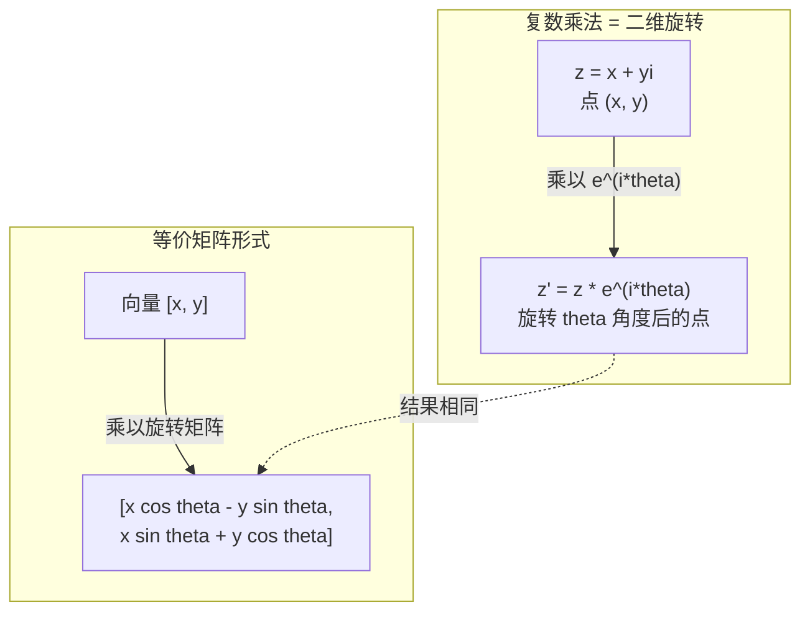
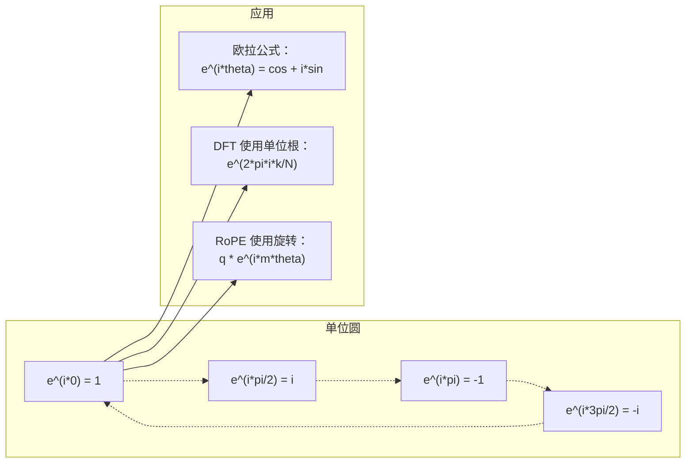

# AI 中的复数

> -1 的平方根并不是虚数。它是旋转、频率和信号处理的核心钥匙。

**类型：** 学习
**语言：** Python
**前置知识：** 第一阶段，第 01-04 课（线性代数、微积分）
**时长：** ~60 分钟

## 学习目标

- 以直角坐标和极坐标形式进行复数运算（加法、乘法、除法、共轭）
- 应用欧拉公式在复指数与三角函数之间互相转换
- 用单位根实现离散傅里叶变换（DFT）
- 解释复数旋转如何构成 Transformer 中 RoPE 和正弦位置编码的基础

## 问题

打开一篇关于傅里叶变换的论文，满眼都是 `i`。看 Transformer 的位置编码，看到不同频率的 `sin` 和 `cos`——这正是复指数的实部和虚部。读量子计算相关内容，发现一切都用复向量空间表达。

复数看起来很抽象。一个建立在 -1 的平方根之上的数系，感觉像是数学把戏。但它不是把戏，而是旋转和振荡的自然语言。凡是旋转、振动或振荡的事物，复数都是正确的描述工具。

不理解复数，就无法理解离散傅里叶变换，无法理解 FFT，无法理解现代语言模型中 RoPE（旋转位置编码）的工作原理，也无法理解原始 Transformer 论文中的正弦位置编码为何使用那些频率。

本课从零开始构建复数运算，将其与几何联系起来，并展示复数在机器学习中出现的具体位置。

## 概念

### 什么是复数？

复数由两部分组成：实部和虚部。

```
z = a + bi

其中：
  a 是实部
  b 是虚部
  i 是虚数单位，定义为 i^2 = -1
```

就这么简单。将数轴扩展为一个平面：实数在一条轴上，虚数在另一条轴上。每个复数都是这个平面上的一个点。

### 复数运算

**加法。** 实部相加，虚部相加。

```
(a + bi) + (c + di) = (a + c) + (b + d)i

示例：(3 + 2i) + (1 + 4i) = 4 + 6i
```

**乘法。** 使用分配律，记住 i^2 = -1。

```
(a + bi)(c + di) = ac + adi + bci + bdi^2
                 = ac + adi + bci - bd
                 = (ac - bd) + (ad + bc)i

示例：(3 + 2i)(1 + 4i) = 3 + 12i + 2i + 8i^2
                        = 3 + 14i - 8
                        = -5 + 14i
```

**共轭。** 改变虚部的符号。

```
(a + bi) 的共轭 = a - bi
```

一个复数与其共轭的乘积始终是实数：

```
(a + bi)(a - bi) = a^2 + b^2
```

**除法。** 分子和分母同乘以分母的共轭。

```
(a + bi) / (c + di) = (a + bi)(c - di) / (c^2 + d^2)
```

这样可以消除分母中的虚部，得到一个整洁的复数。

### 复平面

复平面将每个复数映射到二维平面上的一个点。水平轴是实轴，垂直轴是虚轴。

```
z = 3 + 2i  对应点 (3, 2)
z = -1 + 0i 对应点 (-1, 0)，在实轴上
z = 0 + 4i  对应点 (0, 4)，在虚轴上
```

复数同时是一个点，也是从原点出发的向量。这种双重解释使复数在几何上极为有用。

### 极坐标形式

平面上的任意点都可以用距离原点的距离和与正实轴的夹角来描述。

```
z = r * (cos(theta) + i*sin(theta))

其中：
  r = |z| = sqrt(a^2 + b^2)     （模，或绝对值）
  theta = atan2(b, a)             （辐角，或相位角）
```

直角坐标形式（a + bi）适合加法，极坐标形式（r, theta）适合乘法。

**极坐标形式的乘法。** 模相乘，辐角相加。

```
z1 = r1 * e^(i*theta1)
z2 = r2 * e^(i*theta2)

z1 * z2 = (r1 * r2) * e^(i*(theta1 + theta2))
```

这就是复数天然适合旋转的原因。乘以一个模为 1 的复数，就是纯旋转。

### 欧拉公式

复指数与三角函数之间的桥梁：

```
e^(i*theta) = cos(theta) + i*sin(theta)
```

这是本课最重要的公式。当 theta = pi 时：

```
e^(i*pi) = cos(pi) + i*sin(pi) = -1 + 0i = -1

因此：e^(i*pi) + 1 = 0
```

五个基本常数（e、i、pi、1、0）在一个方程中相连。

### 欧拉公式对 ML 的意义

欧拉公式说，随着 theta 的变化，`e^(i*theta)` 在单位圆上运动。theta = 0 时，在 (1, 0)；theta = pi/2 时，在 (0, 1)；theta = pi 时，在 (-1, 0)；theta = 3*pi/2 时，在 (0, -1)。旋转一周对应 theta = 2*pi。

这意味着复指数就是旋转。而旋转在信号处理和机器学习中无处不在。

### 与二维旋转的联系

将复数 (x + yi) 乘以 e^(i*theta)，就是将点 (x, y) 绕原点旋转角度 theta。

```
通过复数乘法旋转：
  (x + yi) * (cos(theta) + i*sin(theta))
  = (x*cos(theta) - y*sin(theta)) + (x*sin(theta) + y*cos(theta))i

通过矩阵乘法旋转：
  [cos(theta)  -sin(theta)] [x]   [x*cos(theta) - y*sin(theta)]
  [sin(theta)   cos(theta)] [y] = [x*sin(theta) + y*cos(theta)]
```

两者结果完全相同。复数乘法就是二维旋转，旋转矩阵只是复数乘法的矩阵写法。



### 相量与旋转信号

复指数 e^(i*omega*t) 是以角频率 omega 绕单位圆旋转的点。随着 t 增大，该点沿圆运动。

这个旋转点的实部是 cos(omega*t)，虚部是 sin(omega*t)。正弦信号就是旋转复数的投影。

```
e^(i*omega*t) = cos(omega*t) + i*sin(omega*t)

实部：      cos(omega*t)    -- 余弦波
虚部：      sin(omega*t)    -- 正弦波
```

这就是相量表示法。无需追踪一条起伏的正弦波，只需追踪一个平滑旋转的箭头。相位移变成角度偏移，幅度变化变成模的变化，信号叠加变成向量加法。

### 单位根

N 次单位根是单位圆上均匀分布的 N 个点：

```
w_k = e^(2*pi*i*k/N)    对于 k = 0, 1, 2, ..., N-1
```

对于 N = 4，单位根为：1、i、-1、-i（四个方向上的点）。
对于 N = 8，在此基础上再加四个对角线方向的点。

单位根是离散傅里叶变换（DFT）的基础。DFT 将信号分解为这 N 个等间距频率上的分量。

### 与 DFT 的联系

信号 x[0], x[1], ..., x[N-1] 的离散傅里叶变换为：

```
X[k] = sum_{n=0}^{N-1} x[n] * e^(-2*pi*i*k*n/N)
```

每个 X[k] 衡量信号与第 k 个单位根（即频率为 k 的复正弦）的相关程度。DFT 将信号分解为 N 个旋转相量，并给出每个相量的幅度和相位。

### 为什么 i 并不虚

"虚数"这个词是历史的意外。笛卡尔用它带有贬义。但 i 并不比负数更"虚"——负数刚被引入时人们同样拒绝接受。负数回答"从 3 中减去 5 等于多少"，虚数单位回答"平方得 -1 的是什么"。

更实用的角度：i 是一个 90 度旋转算子。将一个实数乘以 i 一次，旋转 90 度到达虚轴；再乘以 i（即乘以 i^2），再旋转 90 度——现在指向负实数方向。这就是为什么 i^2 = -1，毫无神秘之处，不过是两次 90 度旋转构成了一次 180 度旋转。

这就是复数在工程中无处不在的原因。凡是涉及旋转的事物——电磁波、量子态、信号振荡、位置编码——都天然地用复数来描述。

### 复指数与三角函数的对比

欧拉公式之前，工程师写信号为 A*cos(omega*t + phi)——幅度 A、频率 omega、相位 phi。这没错，但运算起来很麻烦，两个不同相位的余弦相加需要三角恒等式。

用复指数，同样的信号是 A*e^(i*(omega*t + phi))。两个信号相加就是两个复数相加，调制（相乘）就是模相乘、辐角相加，相位移变成角度加法，频移变成与相量相乘。

整个信号处理领域改用复指数表示法，正是因为数学更简洁。"真实信号"始终只是复数表示的实部，虚部作为辅助量一同参与运算，使所有代数运算自然正确。

### 与 Transformer 的联系

**正弦位置编码**（原始 Transformer 论文）：

```
PE(pos, 2i)   = sin(pos / 10000^(2i/d))
PE(pos, 2i+1) = cos(pos / 10000^(2i/d))
```

正弦和余弦对是不同频率复指数的实部和虚部。每个频率为编码位置提供不同的"分辨率"：低频变化缓慢（粗粒度位置），高频变化迅速（细粒度位置）。组合在一起，为每个位置提供独特的频率指纹。

**RoPE（旋转位置编码）** 更进一步，显式地将查询向量和键向量乘以复数旋转矩阵。两个词元之间的相对位置变成旋转角度，注意力通过这些旋转向量计算，使模型通过复数乘法感知相对位置。

| 运算 | 代数形式 | 几何意义 |
|------|----------|----------|
| 加法 | (a+c) + (b+d)i | 平面上的向量加法 |
| 乘法 | (ac-bd) + (ad+bc)i | 旋转并缩放 |
| 共轭 | a - bi | 关于实轴的镜像 |
| 模 | sqrt(a^2 + b^2) | 到原点的距离 |
| 辐角 | atan2(b, a) | 与正实轴的夹角 |
| 除法 | 乘以共轭 | 逆旋转并重新缩放 |
| 幂次 | r^n * e^(i*n*theta) | 旋转 n 次，模缩放为 r^n |



## 动手实现

### 第一步：复数类

构建一个支持运算、模、辐角以及直角坐标和极坐标互转的复数类。

```python
import math

class Complex:
    def __init__(self, real, imag=0.0):
        self.real = real
        self.imag = imag

    def __add__(self, other):
        return Complex(self.real + other.real, self.imag + other.imag)

    def __mul__(self, other):
        r = self.real * other.real - self.imag * other.imag
        i = self.real * other.imag + self.imag * other.real
        return Complex(r, i)

    def __truediv__(self, other):
        denom = other.real ** 2 + other.imag ** 2
        r = (self.real * other.real + self.imag * other.imag) / denom
        i = (self.imag * other.real - self.real * other.imag) / denom
        return Complex(r, i)

    def magnitude(self):
        return math.sqrt(self.real ** 2 + self.imag ** 2)

    def phase(self):
        return math.atan2(self.imag, self.real)

    def conjugate(self):
        return Complex(self.real, -self.imag)
```

### 第二步：极坐标转换与欧拉公式

```python
def to_polar(z):
    return z.magnitude(), z.phase()

def from_polar(r, theta):
    return Complex(r * math.cos(theta), r * math.sin(theta))

def euler(theta):
    return Complex(math.cos(theta), math.sin(theta))
```

验证：`euler(theta).magnitude()` 应始终为 1.0。`euler(0)` 应给出 (1, 0)，`euler(pi)` 应给出 (-1, 0)。

### 第三步：旋转

将点 (x, y) 旋转角度 theta 只需一次复数乘法：

```python
point = Complex(3, 4)
rotated = point * euler(math.pi / 4)
```

模保持不变，只有角度改变。

### 第四步：用复数运算实现 DFT

```python
def dft(signal):
    N = len(signal)
    result = []
    for k in range(N):
        total = Complex(0, 0)
        for n in range(N):
            angle = -2 * math.pi * k * n / N
            total = total + Complex(signal[n], 0) * euler(angle)
        result.append(total)
    return result
```

这是 O(N^2) 的 DFT。每个输出 X[k] 是信号样本与单位根乘积的累加。

### 第五步：逆 DFT

逆 DFT 从频谱重建原始信号，与正向 DFT 相比只有两处不同：指数符号取反，以及除以 N。

```python
def idft(spectrum):
    N = len(spectrum)
    result = []
    for n in range(N):
        total = Complex(0, 0)
        for k in range(N):
            angle = 2 * math.pi * k * n / N
            total = total + spectrum[k] * euler(angle)
        result.append(Complex(total.real / N, total.imag / N))
    return result
```

可以实现完美重建：先做 DFT 再做逆 DFT，能精确还原原始信号，不损失任何信息。

### 第六步：单位根

```python
def roots_of_unity(N):
    return [euler(2 * math.pi * k / N) for k in range(N)]
```

验证两个性质：
- 每个根的模恰好为 1。
- 所有 N 个根之和为零（它们因对称性相互抵消）。

这两个性质使 DFT 可逆。单位根构成频域的正交基。

## 实际使用

Python 内置复数支持，字面量 `j` 表示虚数单位。

```python
z = 3 + 2j
w = 1 + 4j

print(z + w)
print(z * w)
print(abs(z))

import cmath
print(cmath.phase(z))
print(cmath.exp(1j * cmath.pi))
```

对于数组，numpy 原生支持复数：

```python
import numpy as np

z = np.array([1+2j, 3+4j, 5+6j])
print(np.abs(z))
print(np.angle(z))
print(np.conj(z))
print(np.real(z))
print(np.imag(z))

signal = np.sin(2 * np.pi * 5 * np.linspace(0, 1, 128))
spectrum = np.fft.fft(signal)
freqs = np.fft.fftfreq(128, d=1/128)
```

## 交付

运行 `code/complex_numbers.py` 生成 `outputs/skill-complex-arithmetic.md`。

## 练习

1. **手算复数运算。** 计算 (2 + 3i) * (4 - i) 并用代码验证，再计算 (5 + 2i) / (1 - 3i)。在复平面上画出两个结果，验证乘法确实对第一个数进行了旋转和缩放。

2. **旋转序列。** 从点 (1, 0) 开始，连续乘以 e^(i*pi/6) 十二次，验证 12 次乘法后回到 (1, 0)。打印每步的坐标，确认它们描绘出一个正十二边形。

3. **已知信号的 DFT。** 创建一个由 sin(2*pi*3*t) 和 0.5*sin(2*pi*7*t) 相加、在 32 个点上采样的信号，运行 DFT，验证幅度频谱在频率 3 和 7 处有峰值，且频率 7 处的峰值是频率 3 处的一半。

4. **单位根可视化。** 计算 8 次单位根，验证它们的和为零，并验证将任意一个根乘以本原根 e^(2*pi*i/8) 得到下一个根。

5. **旋转矩阵等价性。** 对 10 个随机角度和 10 个随机点，验证复数乘法与 2×2 旋转矩阵-向量乘法的结果相同，打印最大数值误差。

## 关键术语

| 术语 | 含义 |
|------|------|
| 复数 | 形如 a + bi 的数，a 是实部，b 是虚部，i^2 = -1 |
| 虚数单位 | 数 i，定义为 i^2 = -1。并非哲学意义上的"虚"——它是旋转算子 |
| 复平面 | x 轴为实轴、y 轴为虚轴的二维平面，也称阿尔冈平面 |
| 模（绝对值） | 到原点的距离：sqrt(a^2 + b^2)，记作 \|z\| |
| 辐角（相位） | 与正实轴的夹角：atan2(b, a)，记作 arg(z) |
| 共轭 | 关于实轴的镜像：a + bi 的共轭为 a - bi |
| 极坐标形式 | 将 z 表示为 r * e^(i*theta) 而非 a + bi，便于乘法运算 |
| 欧拉公式 | e^(i*theta) = cos(theta) + i*sin(theta)，连接指数与三角函数 |
| 相量 | 表示正弦信号的旋转复数 e^(i*omega*t) |
| 单位根 | e^(2*pi*i*k/N)（k = 0 到 N-1）的 N 个复数，单位圆上均匀分布的 N 个点 |
| DFT | 离散傅里叶变换，用单位根将信号分解为复正弦分量 |
| RoPE | 旋转位置编码，用复数乘法在 Transformer 注意力机制中编码相对位置 |

## 延伸阅读

- [欧拉公式的直观理解](https://betterexplained.com/articles/intuitive-understanding-of-eulers-formula/) — 无需繁琐符号，建立几何直觉
- [Su 等：RoFormer（2021）](https://arxiv.org/abs/2104.09864) — 介绍使用复数旋转的旋转位置编码的论文
- [Vaswani 等：Attention Is All You Need（2017）](https://arxiv.org/abs/1706.03762) — 含正弦位置编码的原始 Transformer 论文
- [3Blue1Brown：欧拉公式与群论入门](https://www.youtube.com/watch?v=mvmuCPvRoWQ) — 为何 e^(i*pi) = -1 的可视化解释
- [Needham：视觉复分析](https://global.oup.com/academic/product/visual-complex-analysis-9780198534464) — 充满几何洞见的最佳可视化复数教材
- [Strang：线性代数导论，第 10 章](https://math.mit.edu/~gs/linearalgebra/) — 线性代数和特征值背景下的复数
