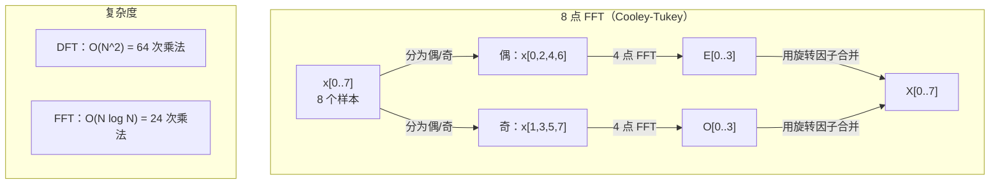
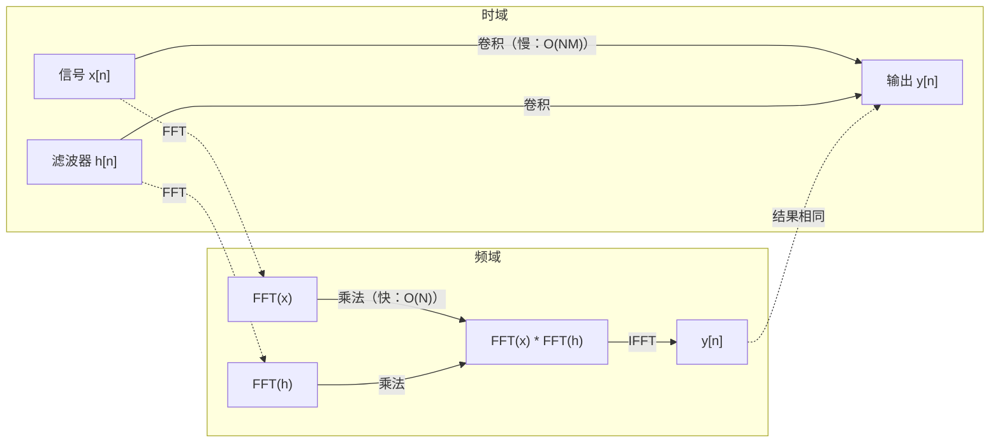

# 傅里叶变换

> 每个信号都是正弦波的叠加。傅里叶变换告诉你具体是哪些正弦波。

**类型：** 构建
**语言：** Python
**前置知识：** 第一阶段，第 01-04 课、第 19 课（复数）
**时长：** ~90 分钟

## 学习目标

- 从零实现 DFT 并与 O(N log N) 的 Cooley-Tukey FFT 对比验证
- 解读频率系数：从信号中提取幅度、相位和功率谱
- 应用卷积定理通过 FFT 乘法执行卷积
- 将傅里叶频率分解与 Transformer 位置编码和 CNN 卷积层关联

## 问题

音频录音是时间上的压强测量序列，股票价格是按天的数值序列，图像是空间上的像素强度网格。这些都是时域（或空域）数据——你看到的是某种索引下值的变化。

但许多模式在时域中是不可见的：这段音频是纯音还是和弦？这个股价有没有周期性规律？这张图像有没有重复纹理？这些问题涉及频率内容，而时域把它们隐藏了。

傅里叶变换将数据从时域转换到频域。它接受一个信号，将其分解为不同频率的正弦波。每个正弦波都有幅度（强度）和相位（起始位置）。傅里叶变换给出这两者。

这对机器学习很重要，因为频域思维无处不在：卷积神经网络执行卷积，而卷积在频域就是乘法；Transformer 位置编码用频率分解来表示位置；音频模型（语音识别、音乐生成）在频谱图上操作；时间序列模型寻找周期性模式。理解傅里叶变换，就能用共同的词汇处理所有这些问题。

## 概念

### DFT 定义

给定 N 个样本 x[0], x[1], ..., x[N-1]，离散傅里叶变换（DFT）产生 N 个频率系数 X[0], X[1], ..., X[N-1]：

```
X[k] = sum_{n=0}^{N-1} x[n] * e^(-2*pi*i*k*n/N)

对于 k = 0, 1, ..., N-1
```

每个 X[k] 都是复数。其模 |X[k]| 表示频率 k 的幅度，其相位 angle(X[k]) 表示该频率的相位偏移。

关键洞察：`e^(-2*pi*i*k*n/N)` 是频率 k 的旋转相量。DFT 计算信号与 N 个等间距频率各自的相关程度。若信号在频率 k 处有能量，相关性就大；否则接近零。

### 每个系数的含义

**X[0]：直流分量（DC component）。** 所有样本之和，与均值成比例。表示信号的常数（零频率）偏移。

```
X[0] = sum_{n=0}^{N-1} x[n] * e^0 = 所有样本之和
```

**X[k]（1 <= k <= N/2）：正频率。** X[k] 表示每 N 个样本中有 k 个完整振荡的频率，k 越大，频率越高（振荡越快）。

**X[N/2]：奈奎斯特频率。** 以 N 个样本能表示的最高频率。超过此频率会产生混叠——高频冒充低频。

**X[k]（N/2 < k < N）：负频率。** 对于实值信号，X[N-k] = conj(X[k])，负频率是正频率的镜像。因此有用信息在前 N/2 + 1 个系数中。

### 逆 DFT

逆 DFT 从频率系数重建原始信号：

```
x[n] = (1/N) * sum_{k=0}^{N-1} X[k] * e^(2*pi*i*k*n/N)

对于 n = 0, 1, ..., N-1
```

与正向 DFT 的唯一区别：指数符号为正（而非负），且有 1/N 的归一化因子。

逆 DFT 是完美重建——没有信息损失，可以从时域到频域再回到时域而没有任何误差。DFT 是一种基底变换，用不同的坐标系重新表达相同的信息。

### FFT：加速计算

上述定义的 DFT 是 O(N^2)：对 N 个输出系数中的每一个，都要对 N 个输入样本求和。当 N = 100 万时，需要 10^12 次运算。

快速傅里叶变换（FFT）以 O(N log N) 计算相同结果。N = 100 万时，约 2000 万次运算而非万亿次。这就是频率分析能够实用的原因。

Cooley-Tukey 算法（最常见的 FFT）采用分治策略：

1. 将信号分为偶数索引和奇数索引的样本。
2. 递归计算每半部分的 DFT。
3. 用旋转因子 e^(-2*pi*i*k/N) 合并两个半尺寸 DFT。

```
X[k] = E[k] + e^(-2*pi*i*k/N) * O[k]          对于 k = 0, ..., N/2 - 1
X[k + N/2] = E[k] - e^(-2*pi*i*k/N) * O[k]    对于 k = 0, ..., N/2 - 1

其中 E = 偶数索引样本的 DFT
    O = 奇数索引样本的 DFT
```

对称性使每层递归做 O(N) 的工作，共有 log2(N) 层，总计 O(N log N)。



FFT 要求信号长度为 2 的幂次，实际中通常将信号补零到下一个 2 的幂次。

### 频谱分析

**功率谱**是 |X[k]|^2——每个频率系数的模的平方，显示各频率处的能量。

**相位谱**是 angle(X[k])——每个频率的相位偏移。大多数分析任务关注功率谱，忽略相位。

```
频率 k 处的功率：  P[k] = |X[k]|^2 = X[k].real^2 + X[k].imag^2
频率 k 处的相位：  phi[k] = atan2(X[k].imag, X[k].real)
```

### 频率分辨率

DFT 的频率分辨率取决于样本数 N 和采样率 fs。

```
频率箱 k 对应的频率：  f_k = k * fs / N
频率分辨率：            delta_f = fs / N
最大频率：              f_max = fs / 2  （奈奎斯特）
```

要分辨两个靠近的频率，需要更多样本；要捕获高频，需要更高的采样率。

### 卷积定理

这是信号处理中最重要的结论之一，与 CNN 直接相关。

**时域的卷积等于频域的逐点乘法。**

```
x * h = IFFT(FFT(x) . FFT(h))

其中 * 是卷积，. 是逐元素乘法
```

重要性在于：

- 两个长度分别为 N 和 M 的信号直接卷积需要 O(N*M) 次运算。
- 基于 FFT 的卷积只需 O(N log N)：变换、乘法、逆变换。
- 对于大核，基于 FFT 的卷积速度显著更快。
- 这正是大感受野卷积层中发生的事情。

注：DFT 计算的是循环卷积（信号会环绕）。要做线性卷积（无环绕），在计算之前需将两个信号补零到长度 N + M - 1。



### 加窗

DFT 假设信号是周期性的——将 N 个样本视为无限重复信号的一个周期。若信号的首尾值不同，这会在边界处产生不连续，表现为虚假的高频内容，称为频谱泄漏（spectral leakage）。

加窗通过在 DFT 计算前对信号两端进行平滑过渡（逐渐降至零）来减少泄漏。

常用窗函数：

| 窗函数 | 形状 | 主瓣宽度 | 旁瓣水平 | 适用场景 |
|--------|------|----------|----------|----------|
| 矩形窗 | 平坦（无窗）| 最窄 | 最高（-13 dB）| 信号在 N 个样本内恰好为周期时 |
| 汉宁窗 | 升余弦 | 适中 | 低（-31 dB）| 通用频谱分析 |
| 汉明窗 | 改进余弦 | 适中 | 较低（-42 dB）| 音频处理、语音分析 |
| 布莱克曼窗 | 三重余弦 | 宽 | 极低（-58 dB）| 旁瓣抑制要求严格时 |

```
汉宁窗：    w[n] = 0.5 * (1 - cos(2*pi*n / (N-1)))
汉明窗：    w[n] = 0.54 - 0.46 * cos(2*pi*n / (N-1))
```

加窗方式：将窗函数与信号逐元素相乘后再做 DFT：`X = DFT(x * w)`。

### DFT 性质

| 性质 | 时域 | 频域 |
|------|------|------|
| 线性 | a*x + b*y | a*X + b*Y |
| 时移 | x[n - k] | X[f] * e^(-2*pi*i*f*k/N) |
| 频移 | x[n] * e^(2*pi*i*f0*n/N) | X[f - f0] |
| 卷积 | x * h | X * H（逐点） |
| 乘法 | x * h（逐点）| X * H（循环卷积，乘以 1/N） |
| 帕塞瓦尔定理 | sum \|x[n]\|^2 | (1/N) * sum \|X[k]\|^2 |
| 共轭对称（实数输入）| x[n] 为实数 | X[k] = conj(X[N-k]) |

帕塞瓦尔定理（Parseval's theorem）说明两个域中的总能量相同。能量在变换过程中守恒。

### 与位置编码的联系

原始 Transformer 使用正弦位置编码：

```
PE(pos, 2i)   = sin(pos / 10000^(2i/d_model))
PE(pos, 2i+1) = cos(pos / 10000^(2i/d_model))
```

每对维度 (2i, 2i+1) 以不同频率振荡，频率从高（维度 0,1）到低（最后几个维度）呈等比排列。这使每个位置在所有频段上都有独特的模式——类似于傅里叶系数唯一标识一个信号。

这种方案的关键特性：

- **唯一性：** 没有两个位置拥有相同的编码。
- **有界值：** sin 和 cos 始终在 [-1, 1] 内。
- **相对位置：** 位置 p+k 的编码可以表示为位置 p 编码的线性函数，模型可以学习关注相对位置。

### 与 CNN 的联系

卷积层通过在信号或图像上滑动学习到的滤波器（核）来应用，数学上就是卷积运算。

根据卷积定理，这等价于：
1. 对输入做 FFT
2. 对核做 FFT
3. 在频域中相乘
4. 对结果做 IFFT

标准 CNN 使用直接卷积（对于小的 3×3 核更快）。但对于大核或全局卷积，基于 FFT 的方法速度显著更快。某些架构（如 FNet）完全用 FFT 替换注意力机制，以 O(N log N) 而非 O(N^2) 的复杂度达到有竞争力的精度。

### 频谱图与短时傅里叶变换

单次 FFT 给出整个信号的频率内容，却无法告知这些频率出现的时刻。一个调频信号（频率随时间增大）和一个和弦（所有频率同时出现）可能拥有相同的幅度谱。

短时傅里叶变换（STFT）通过对信号的重叠窗口分别计算 FFT 来解决这个问题。结果是频谱图（spectrogram）：一个二维表示，一轴是时间，另一轴是频率，每个点的强度表示该时刻该频率的能量。

```
STFT 步骤：
1. 选择窗口大小（例如 1024 个样本）
2. 选择跳跃步长（例如 256 个样本，即 75% 重叠）
3. 对每个窗口位置：
   a. 提取窗口片段
   b. 应用汉宁/汉明窗
   c. 计算 FFT
   d. 将幅度谱存储为频谱图的一列
```

频谱图是音频机器学习模型的标准输入表示。语音识别模型（Whisper、DeepSpeech）使用梅尔频谱图（mel-spectrogram）——将频率映射到梅尔刻度（更接近人类音高感知）的频谱图。

### 混叠

若信号包含高于 fs/2（奈奎斯特频率）的频率，以 fs 的采样率采样会产生混叠（aliased）的副本。以 100 Hz 采样 90 Hz 信号，看起来与 10 Hz 信号完全相同，仅凭样本无法区分。

```
示例：
  真实信号：90 Hz 正弦波
  采样率：100 Hz
  表观频率：100 - 90 = 10 Hz

  90 Hz 信号在 100 Hz 采样率下的样本
  与 10 Hz 信号的样本完全相同。
  任何数学都无法恢复原始的 90 Hz。
```

这就是模数转换器在采样前包含抗混叠滤波器（去除奈奎斯特频率以上的分量）的原因。在机器学习中，下采样特征图时若没有适当的低通滤波也会产生混叠——某些架构用抗混叠池化层来处理。

### 补零不增加分辨率

一个常见误解：在 FFT 之前补零可以提高频率分辨率。实际上并不能。补零会在现有频率箱之间插值，使频谱看起来更平滑，但无法揭示原始样本中不存在的频率细节。

真正的频率分辨率只取决于观测时间 T = N / fs。要分辨相差 delta_f 的两个频率，至少需要 T = 1 / delta_f 秒的数据。无论补多少零，都无法改变这个基本限制。

## 动手实现

### 第一步：从零实现 DFT

O(N^2) 的 DFT 直接按定义实现。

```python
import math

class Complex:
    ...

def dft(x):
    N = len(x)
    result = []
    for k in range(N):
        total = Complex(0, 0)
        for n in range(N):
            angle = -2 * math.pi * k * n / N
            w = Complex(math.cos(angle), math.sin(angle))
            xn = x[n] if isinstance(x[n], Complex) else Complex(x[n])
            total = total + xn * w
        result.append(total)
    return result
```

### 第二步：逆 DFT

结构相同，指数符号为正，除以 N。

```python
def idft(X):
    N = len(X)
    result = []
    for n in range(N):
        total = Complex(0, 0)
        for k in range(N):
            angle = 2 * math.pi * k * n / N
            w = Complex(math.cos(angle), math.sin(angle))
            total = total + X[k] * w
        result.append(Complex(total.real / N, total.imag / N))
    return result
```

### 第三步：FFT（Cooley-Tukey）

递归 FFT 要求长度为 2 的幂次。分为偶数和奇数部分，递归，用旋转因子合并。

```python
def fft(x):
    N = len(x)
    if N <= 1:
        return [x[0] if isinstance(x[0], Complex) else Complex(x[0])]
    if N % 2 != 0:
        return dft(x)

    even = fft([x[i] for i in range(0, N, 2)])
    odd = fft([x[i] for i in range(1, N, 2)])

    result = [Complex(0)] * N
    for k in range(N // 2):
        angle = -2 * math.pi * k / N
        twiddle = Complex(math.cos(angle), math.sin(angle))
        t = twiddle * odd[k]
        result[k] = even[k] + t
        result[k + N // 2] = even[k] - t
    return result
```

### 第四步：频谱分析辅助函数

```python
def power_spectrum(X):
    return [xk.real ** 2 + xk.imag ** 2 for xk in X]

def convolve_fft(x, h):
    N = len(x) + len(h) - 1
    padded_N = 1
    while padded_N < N:
        padded_N *= 2

    x_padded = x + [0.0] * (padded_N - len(x))
    h_padded = h + [0.0] * (padded_N - len(h))

    X = fft(x_padded)
    H = fft(h_padded)

    Y = [xk * hk for xk, hk in zip(X, H)]

    y = idft(Y)
    return [y[n].real for n in range(N)]
```

## 实际使用

实际工作中使用 numpy 的 FFT，其底层是高度优化的 C 库。

```python
import numpy as np

signal = np.sin(2 * np.pi * 5 * np.arange(256) / 256)
spectrum = np.fft.fft(signal)
freqs = np.fft.fftfreq(256, d=1/256)

power = np.abs(spectrum) ** 2

positive_freqs = freqs[:len(freqs)//2]
positive_power = power[:len(power)//2]
```

加窗和更高级的频谱分析：

```python
from scipy.signal import windows, stft

window = windows.hann(256)
windowed = signal * window
spectrum = np.fft.fft(windowed)
```

卷积：

```python
from scipy.signal import fftconvolve

result = fftconvolve(signal, kernel, mode='full')
```

频谱图：

```python
from scipy.signal import stft

frequencies, times, Zxx = stft(signal, fs=sample_rate, nperseg=256)
spectrogram = np.abs(Zxx) ** 2
```

频谱图矩阵的形状为 (频率数, 时间帧数)，每列是一个时间窗口的功率谱。这就是音频机器学习模型的输入。

## 交付

运行 `code/fourier.py` 生成 `outputs/prompt-spectral-analyzer.md`。

## 练习

1. **纯音识别。** 创建一个未知频率（1 到 50 Hz 之间）的单正弦波信号，以 128 Hz 采样 1 秒。用 DFT 识别频率，并验证答案。再加入标准差为 0.5 的高斯噪声并重复，观察噪声如何影响频谱。

2. **FFT 与 DFT 验证。** 生成一个长度为 64 的随机信号，分别计算 DFT（O(N^2)）和 FFT，验证所有系数的误差在 1e-10 以内。在长度为 256、512、1024 和 2048 的信号上分别计时，绘制 DFT 与 FFT 时间之比。

3. **卷积定理的实验证明。** 创建信号 x = [1, 2, 3, 4, 0, 0, 0, 0] 和滤波器 h = [1, 1, 1, 0, 0, 0, 0, 0]，直接计算循环卷积（嵌套循环），再通过 FFT（变换、乘法、逆变换）计算，验证结果一致。然后通过适当补零实现线性卷积。

4. **加窗效果。** 创建一个由 10 Hz 和 12 Hz（非常接近）两个正弦波叠加的信号，以 128 Hz 采样 1 秒。分别用无窗、汉宁窗和汉明窗计算功率谱，比较哪种窗函数最容易区分两个峰值，以及原因。

5. **位置编码分析。** 生成 d_model = 128、max_pos = 512 的正弦位置编码。对每对位置 (p1, p2) 计算其编码的内积，证明内积只取决于 |p1 - p2|，而不取决于绝对位置。观察内积随距离增大的变化。

## 关键术语

| 术语 | 含义 |
|------|------|
| DFT（离散傅里叶变换）| 将 N 个时域样本转换为 N 个频域系数。每个系数是与该频率复正弦的相关程度 |
| FFT（快速傅里叶变换）| 计算 DFT 的 O(N log N) 算法，Cooley-Tukey 算法递归地分割偶/奇索引 |
| 逆 DFT | 从频率系数重建时域信号，与 DFT 相比仅指数符号相反且有 1/N 缩放 |
| 频率箱 | DFT 输出中每个索引 k 对应频率 k*fs/N Hz，"箱"是离散频率槽 |
| 直流分量 | X[0]，零频率系数，与信号均值成比例 |
| 奈奎斯特频率 | fs/2，以采样率 fs 能表示的最大频率，超过此频率会产生混叠 |
| 功率谱 | \|X[k]\|^2，每个频率系数的模的平方，显示各频率的能量分布 |
| 相位谱 | angle(X[k])，每个频率分量的相位偏移，分析中通常忽略 |
| 频谱泄漏 | 将非周期信号视为周期信号所产生的虚假频率内容，加窗可减少 |
| 窗函数 | DFT 之前应用的渐变函数（汉宁、汉明、布莱克曼），用于减少频谱泄漏 |
| 旋转因子 | FFT 蝴蝶运算中合并子 DFT 时使用的复指数 e^(-2*pi*i*k/N) |
| 卷积定理 | 时域卷积等于频域逐点乘法，信号处理和 CNN 的基础 |
| 循环卷积 | 信号环绕的卷积，DFT 自然计算的卷积类型 |
| 线性卷积 | 无环绕的标准卷积，通过 DFT 前补零来实现 |
| 帕塞瓦尔定理 | 总能量在傅里叶变换过程中守恒，sum \|x[n]\|^2 = (1/N) sum \|X[k]\|^2 |
| 混叠 | 由于采样率不足，奈奎斯特频率以上的频率以较低频率出现的现象 |

## 延伸阅读

- [Cooley & Tukey：复傅里叶级数的机器计算算法（1965）](https://www.ams.org/journals/mcom/1965-19-090/S0025-5718-1965-0178586-1/) — 改变计算领域的原始 FFT 论文
- [3Blue1Brown：什么是傅里叶变换？](https://www.youtube.com/watch?v=spUNpyF58BY) — 最佳傅里叶变换可视化入门
- [Lee-Thorp 等：FNet——用傅里叶变换混合词元（2021）](https://arxiv.org/abs/2105.03824) — 在 Transformer 中用 FFT 替换自注意力
- [Smith：科学家和工程师的数字信号处理指南](http://www.dspguide.com/) — 深入介绍 FFT、加窗和频谱分析的免费在线教材
- [Vaswani 等：Attention Is All You Need（2017）](https://arxiv.org/abs/1706.03762) — 从傅里叶频率分解推导出正弦位置编码
- [Radford 等：Whisper（2022）](https://arxiv.org/abs/2212.04356) — 以梅尔频谱图为输入的语音识别模型
