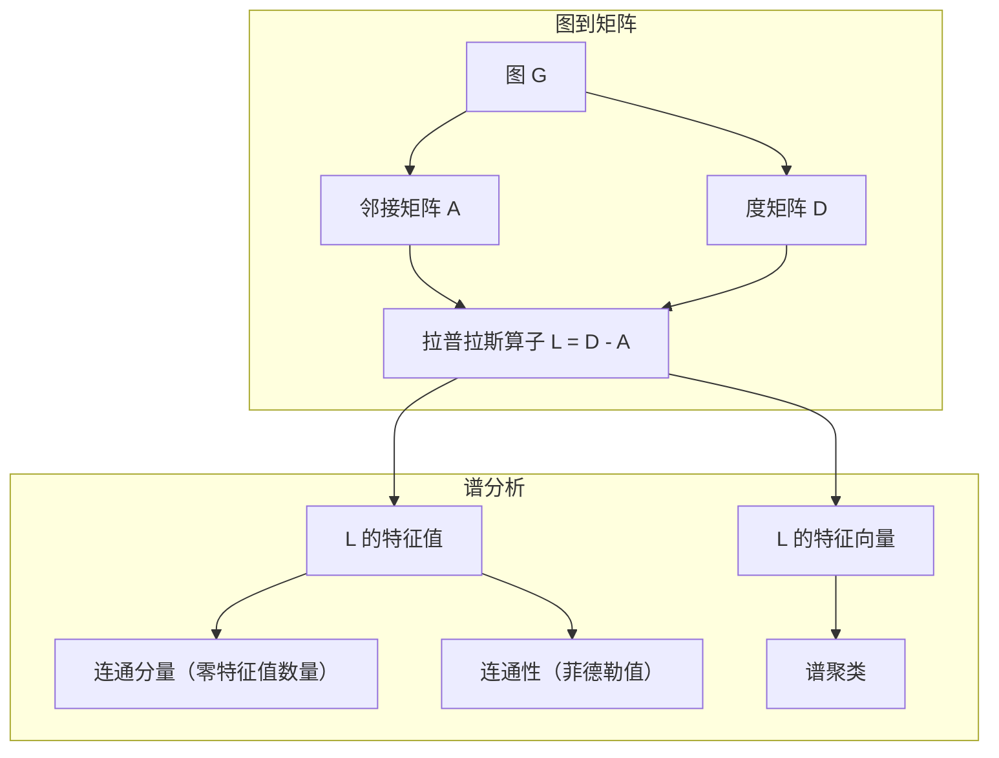
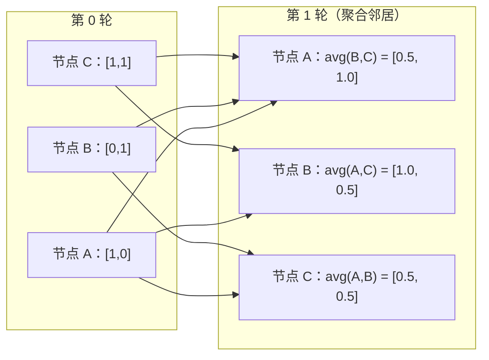

# 机器学习中的图论

> 图是关系的数据结构。如果你的数据有连接，你就需要图论。

**类型：** 构建
**语言：** Python
**前置知识：** 第一阶段，第 01-03 课（线性代数、矩阵）
**时长：** ~90 分钟

## 学习目标

- 构建带有邻接矩阵/邻接表表示的图类，并实现 BFS 和 DFS 遍历
- 计算图拉普拉斯算子，用其特征值检测连通分量并对节点聚类
- 将一轮 GNN 风格的消息传递实现为归一化邻接矩阵的乘法
- 使用菲德勒向量通过谱聚类对图进行分割

## 问题

社交网络、分子、知识库、引用网络、路线图——这些都是图。传统机器学习将数据视为平坦的表格，每行独立，每个特征是一列。但当连接结构本身携带信息时，表格就失效了。

考虑社交网络：你想预测用户会购买什么产品。他们自己的购买历史固然重要，但朋友的购买历史更重要。连接本身就是信号。

再考虑分子：你想预测它是否与蛋白质结合。原子很重要，但真正重要的是原子之间的键合方式。结构本身就是数据。

图神经网络（GNN）是深度学习中增长最快的领域，驱动着药物发现、社交推荐、欺诈检测和知识图谱推理。每个 GNN 都建立在相同的基础之上：基本图论。

你需要四样东西：
1. 将图表示为矩阵的方法（使其可以做矩阵乘法）
2. 探索图结构的遍历算法
3. 拉普拉斯算子——谱图理论中最重要的矩阵
4. 消息传递——使 GNN 工作的核心操作

## 概念

### 图：节点与边

图 G = (V, E) 由顶点（节点）V 和边 E 组成，每条边连接两个节点。

**有向图与无向图。** 在无向图中，边 (u, v) 表示 u 连接到 v，同时 v 也连接到 u。在有向图（digraph）中，边 (u, v) 表示 u 指向 v，但不一定反之。

**加权图与无权图。** 在无权图中，边只有存在或不存在两种状态；在加权图中，每条边有一个数值权重——距离、代价或强度。

| 图类型 | 示例 |
|--------|------|
| 无向、无权 | Facebook 好友网络 |
| 有向、无权 | Twitter 关注网络 |
| 无向、加权 | 路线图（距离）|
| 有向、加权 | 网页链接（PageRank 分数）|

### 邻接矩阵

邻接矩阵 A 是核心表示形式。对于有 n 个节点的图：

```
A[i][j] = 1    若节点 i 到节点 j 存在一条边
A[i][j] = 0    否则
```

对于无向图，A 是对称的：A[i][j] = A[j][i]。对于加权图，A[i][j] = 边 (i, j) 的权重。

**示例——三角形：**

```
节点：0、1、2
边：(0,1)、(1,2)、(0,2)

A = [[0, 1, 1],
     [1, 0, 1],
     [1, 1, 0]]
```

邻接矩阵是每个 GNN 的输入。对 A 的矩阵操作对应对图的操作。

### 度

节点的度是与其相连的边数。对于有向图，分为入度（incoming 边数）和出度（outgoing 边数）。

度矩阵 D 是对角矩阵：

```
D[i][i] = 节点 i 的度
D[i][j] = 0    当 i != j 时
```

对于三角形：D = diag(2, 2, 2)，因为每个节点与另外两个节点相连。

度反映节点的重要性：高度数 = 枢纽节点。网络的度分布揭示其结构。社交网络遵循幂律分布（少量枢纽，大量叶节点），随机图则服从泊松分布。

### BFS 与 DFS

两种基本图遍历算法，两者都需要掌握。

**广度优先搜索（BFS）：** 先探索所有邻居，再探索邻居的邻居。使用队列（FIFO）。

```
从节点 0 开始的 BFS：
  访问 0
  队列：[1, 2]        （0 的邻居）
  访问 1
  队列：[2, 3]        （加入 1 的邻居）
  访问 2
  队列：[3]           （2 的邻居已访问）
  访问 3
  队列：[]            （完成）
```

BFS 可以找到无权图中的最短路径：从起点到任意节点的距离等于该节点首次被发现时的 BFS 层级。这就是为什么 BFS 用于社交网络中的跳数距离计算。

**深度优先搜索（DFS）：** 尽可能深入探索，然后回溯。使用栈（LIFO）或递归。

```
从节点 0 开始的 DFS：
  访问 0
  栈：[1, 2]        （0 的邻居）
  访问 2             （从栈中弹出）
  栈：[1, 3]         （加入 2 的邻居）
  访问 3             （从栈中弹出）
  栈：[1]
  访问 1             （从栈中弹出）
  栈：[]             （完成）
```

DFS 的用途：
- 寻找连通分量（从未访问的节点运行 DFS）
- 环路检测（DFS 树中的后向边）
- 拓扑排序（DFS 完成时间的逆序）

| 算法 | 数据结构 | 用途 | 适用场景 |
|------|----------|------|----------|
| BFS | 队列 | 最短路径 | 社交网络距离、知识图谱遍历 |
| DFS | 栈 | 连通分量、环路 | 连通性、拓扑排序 |

### 图拉普拉斯算子

L = D - A，谱图理论中最重要的矩阵。

对于三角形：

```
D = [[2, 0, 0],    A = [[0, 1, 1],    L = [[2, -1, -1],
     [0, 2, 0],         [1, 0, 1],         [-1, 2, -1],
     [0, 0, 2]]         [1, 1, 0]]         [-1, -1,  2]]
```

拉普拉斯算子具有令人惊叹的性质：

1. **L 是半正定的。** 所有特征值 >= 0。

2. **零特征值的数量等于连通分量的数量。** 连通图恰好有一个零特征值；有 3 个不相连部分的图有三个零特征值。

3. **最小非零特征值（菲德勒值）衡量连通性。** 菲德勒值大意味着图连通良好；菲德勒值小意味着图有薄弱点——瓶颈。

4. **菲德勒值对应的特征向量（菲德勒向量）揭示最佳分割。** 值为正的节点划入一组，值为负的节点划入另一组。这就是谱聚类。



### 谱性质

邻接矩阵和拉普拉斯算子的特征值无需任何遍历即可揭示图的结构性质。

**谱聚类**的步骤：
1. 计算拉普拉斯算子 L
2. 找出 L 的 k 个最小特征向量（跳过第一个，对于连通图它是全 1 向量）
3. 将这些特征向量作为每个节点的新坐标
4. 在这些坐标上运行 k-means

为什么有效？L 的特征向量编码图上最"平滑"的函数。紧密连接的同一簇中的节点具有相似的特征向量值；被瓶颈分隔的节点具有不同的值，特征向量自然地分离出簇。

**与随机游走的联系。** 归一化拉普拉斯算子与图上的随机游走相关。随机游走的平稳分布与节点度成比例，混合时间（游走收敛的速度）取决于谱间隔（spectral gap）。

### 消息传递

图神经网络的核心操作。每个节点从邻居收集消息，聚合它们，然后更新自己的状态。

```
h_v^(k+1) = UPDATE(h_v^(k), AGGREGATE({h_u^(k) : u ∈ neighbors(v)}))
```

在最简单的形式中，AGGREGATE = 均值，UPDATE = 线性变换 + 激活函数：

```
h_v^(k+1) = sigma(W * mean({h_u^(k) : u ∈ neighbors(v)}))
```

这本质上是矩阵乘法。若 H 是所有节点特征的矩阵，A 是邻接矩阵：

```
H^(k+1) = sigma(A_norm * H^(k) * W)
```

其中 A_norm 是归一化邻接矩阵（每行之和为 1）。

一轮消息传递让每个节点"看到"其直接邻居；两轮让其看到邻居的邻居；K 轮给每个节点来自 K 跳邻域的信息。



### 概念与 ML 应用

| 概念 | ML 应用 |
|------|---------|
| 邻接矩阵 | GNN 输入表示 |
| 图拉普拉斯算子 | 谱聚类、社区检测 |
| BFS/DFS | 知识图谱遍历、路径查找 |
| 度分布 | 节点重要性、特征工程 |
| 消息传递 | GNN 层（GCN、GAT、GraphSAGE）|
| L 的特征值 | 社区检测、图分割 |
| 谱聚类 | 无监督节点分组 |
| PageRank | 节点重要性排序、网页搜索 |

## 动手实现

### 第一步：从零构建图类

```python
class Graph:
    def __init__(self, n_nodes, directed=False):
        self.n = n_nodes
        self.directed = directed
        self.adj = {i: {} for i in range(n_nodes)}

    def add_edge(self, u, v, weight=1.0):
        self.adj[u][v] = weight
        if not self.directed:
            self.adj[v][u] = weight

    def neighbors(self, node):
        return list(self.adj[node].keys())

    def degree(self, node):
        return len(self.adj[node])

    def adjacency_matrix(self):
        import numpy as np
        A = np.zeros((self.n, self.n))
        for u in range(self.n):
            for v, w in self.adj[u].items():
                A[u][v] = w
        return A

    def degree_matrix(self):
        import numpy as np
        D = np.zeros((self.n, self.n))
        for i in range(self.n):
            D[i][i] = self.degree(i)
        return D

    def laplacian(self):
        return self.degree_matrix() - self.adjacency_matrix()
```

邻接表（`self.adj`）高效地存储邻居。邻接矩阵转换使用 numpy，因为所有谱操作都需要它。

### 第二步：BFS 与 DFS

```python
from collections import deque

def bfs(graph, start):
    visited = set()
    order = []
    distances = {}
    queue = deque([(start, 0)])
    visited.add(start)
    while queue:
        node, dist = queue.popleft()
        order.append(node)
        distances[node] = dist
        for neighbor in graph.neighbors(node):
            if neighbor not in visited:
                visited.add(neighbor)
                queue.append((neighbor, dist + 1))
    return order, distances


def dfs(graph, start):
    visited = set()
    order = []
    stack = [start]
    while stack:
        node = stack.pop()
        if node in visited:
            continue
        visited.add(node)
        order.append(node)
        for neighbor in reversed(graph.neighbors(node)):
            if neighbor not in visited:
                stack.append(neighbor)
    return order
```

BFS 使用 deque（双端队列）以 O(1) 实现 popleft；DFS 使用列表作为栈。两者都对每个节点只访问一次，时间复杂度为 O(V + E)。

### 第三步：连通分量与拉普拉斯特征值

```python
def connected_components(graph):
    visited = set()
    components = []
    for node in range(graph.n):
        if node not in visited:
            order, _ = bfs(graph, node)
            visited.update(order)
            components.append(order)
    return components


def laplacian_eigenvalues(graph):
    import numpy as np
    L = graph.laplacian()
    eigenvalues = np.linalg.eigvalsh(L)
    return eigenvalues
```

`eigvalsh` 用于对称矩阵——无向图的拉普拉斯算子始终是对称的。它以升序返回特征值，统计零的个数即可找出连通分量数。

### 第四步：谱聚类

```python
def spectral_clustering(graph, k=2):
    import numpy as np
    L = graph.laplacian()
    eigenvalues, eigenvectors = np.linalg.eigh(L)
    features = eigenvectors[:, 1:k+1]

    labels = np.zeros(graph.n, dtype=int)
    for i in range(graph.n):
        if features[i, 0] >= 0:
            labels[i] = 0
        else:
            labels[i] = 1
    return labels
```

对于 k=2，菲德勒向量的符号将图分为两个簇。对于 k>2，需在前 k 个特征向量（排除全 1 的平凡特征向量）上运行 k-means。

### 第五步：消息传递

```python
def message_passing(graph, features, weight_matrix):
    import numpy as np
    A = graph.adjacency_matrix()
    row_sums = A.sum(axis=1, keepdims=True)
    row_sums[row_sums == 0] = 1
    A_norm = A / row_sums
    aggregated = A_norm @ features
    output = aggregated @ weight_matrix
    return output
```

这是一轮 GNN 消息传递：每个节点的新特征是其邻居特征的加权平均，再经过权重矩阵变换。叠加多轮可以传播更远的信息。

## 实际使用

使用 networkx 和 numpy，相同操作只需一行：

```python
import networkx as nx
import numpy as np

G = nx.karate_club_graph()

A = nx.adjacency_matrix(G).toarray()
L = nx.laplacian_matrix(G).toarray()

eigenvalues = np.linalg.eigvalsh(L.astype(float))
print(f"最小特征值：{eigenvalues[:5]}")
print(f"连通分量数：{nx.number_connected_components(G)}")

communities = nx.community.greedy_modularity_communities(G)
print(f"发现社区数：{len(communities)}")

pr = nx.pagerank(G)
top_nodes = sorted(pr.items(), key=lambda x: x[1], reverse=True)[:5]
print(f"PageRank 前 5 节点：{top_nodes}")
```

networkx 使用优化的 C 后端处理任意大小的图，生产中使用它。自己实现是为了理解原理。

### numpy 谱分析

```python
import numpy as np

A = np.array([
    [0, 1, 1, 0, 0],
    [1, 0, 1, 0, 0],
    [1, 1, 0, 1, 0],
    [0, 0, 1, 0, 1],
    [0, 0, 0, 1, 0]
])

D = np.diag(A.sum(axis=1))
L = D - A

eigenvalues, eigenvectors = np.linalg.eigh(L)
print(f"特征值：{np.round(eigenvalues, 4)}")
print(f"菲德勒值：{eigenvalues[1]:.4f}")
print(f"菲德勒向量：{np.round(eigenvectors[:, 1], 4)}")

fiedler = eigenvectors[:, 1]
group_a = np.where(fiedler >= 0)[0]
group_b = np.where(fiedler < 0)[0]
print(f"簇 A：{group_a}")
print(f"簇 B：{group_b}")
```

菲德勒向量承担主要工作：正值的节点在一个簇，负值的节点在另一个簇。无需迭代优化，一次特征分解即可。

## 交付

本课生成：
- `outputs/skill-graph-analysis.md` — 分析图结构数据的技能参考

## 关联

| 概念 | 在哪里出现 |
|------|-----------|
| 邻接矩阵 | GCN、GAT、GraphSAGE 输入 |
| 拉普拉斯算子 | 谱聚类、ChebNet 滤波器 |
| BFS | 知识图谱遍历、最短路径查询 |
| 消息传递 | 每个 GNN 层、神经消息传递 |
| 谱间隔 | 图连通性、随机游走的混合时间 |
| 度分布 | 幂律网络、节点特征工程 |
| 连通分量 | 预处理、处理非连通图 |
| PageRank | 节点重要性排序、注意力初始化 |

GNN 值得特别关注。GCN（Kipf & Welling, 2017）中的图卷积操作使用带有自环的邻接矩阵 A_hat = A + I：

```text
H^(l+1) = sigma(D_hat^(-1/2) * A_hat * D_hat^(-1/2) * H^(l) * W^(l))
```

其中 A_hat = A + I（邻接矩阵加上自环），D_hat 是 A_hat 的度矩阵。自环确保每个节点在聚合时包含自身特征。这正是具有对称归一化的消息传递，D_hat^(-1/2) * A_hat * D_hat^(-1/2) 是归一化邻接矩阵。拉普拉斯算子出现在这里，因为这种归一化与 L_sym = I - D^(-1/2) * A * D^(-1/2) 相关。理解拉普拉斯算子，就理解了 GCN 为什么有效。

## 练习

1. **从零实现 PageRank。** 从均匀分数开始，每步执行：score(v) = (1-d)/n + d * sum(score(u)/out_degree(u))，对所有指向 v 的 u 求和，使用 d=0.85，直到收敛（变化 < 1e-6）。在一个小的网络图上测试。

2. **用谱聚类发现社区。** 创建一个有两个明显分离簇的图（例如两个通过单条边连接的团）。运行谱聚类并验证找到了正确的分割。随着添加更多跨簇边，会发生什么？

3. **实现 Dijkstra 算法**，用于加权图中的最短路径查找。与在相同图（均匀权重）上的 BFS 结果比较。

4. **构建两层消息传递网络。** 用不同的权重矩阵应用两次消息传递，证明两轮后每个节点拥有来自其 2 跳邻域的信息。

5. **分析真实世界图。** 使用空手道俱乐部图（34 个节点，78 条边），计算度分布、拉普拉斯特征值和谱聚类结果，并与已知的实际分组比较。

## 关键术语

| 术语 | 通俗说法 | 实际含义 |
|------|----------|----------|
| 图 | "节点和边" | 数学结构 G=(V,E)，编码成对关系 |
| 邻接矩阵 | "连接表" | n×n 矩阵，A[i][j]=1 表示节点 i 和 j 相连 |
| 度 | "节点的连接数" | 与节点相接的边数 |
| 拉普拉斯算子 | "D 减 A" | L = D - A，特征值揭示图结构的矩阵 |
| 菲德勒值 | "代数连通性" | L 的最小非零特征值，衡量图的连通程度 |
| BFS | "逐层搜索" | 先访问所有邻居再深入，可找最短路径 |
| DFS | "先深后回" | 沿一条路径走到底再回溯 |
| 消息传递 | "节点与邻居交流" | 每个节点聚合邻居的信息，GNN 的核心 |
| 谱聚类 | "用特征向量聚类" | 用拉普拉斯算子的特征向量对图进行分割 |
| 连通分量 | "独立的片段" | 其中每个节点都可以到达其他每个节点的极大子图 |

## 延伸阅读

- **Kipf & Welling（2017）** — "Semi-Supervised Classification with Graph Convolutional Networks"。启动现代 GNN 的论文，证明谱图卷积可简化为消息传递。
- **Spielman（2012）** — "Spectral Graph Theory"讲义。拉普拉斯算子、谱间隔和图分割的权威入门。
- **Hamilton（2020）** — "Graph Representation Learning"。从基础到应用的 GNN 专著。
- **Bronstein 等（2021）** — "Geometric Deep Learning: Grids, Groups, Graphs, Geodesics, and Gauges"。统一框架论文。
- **Veličković 等（2018）** — "Graph Attention Networks"。将注意力机制扩展到消息传递。
