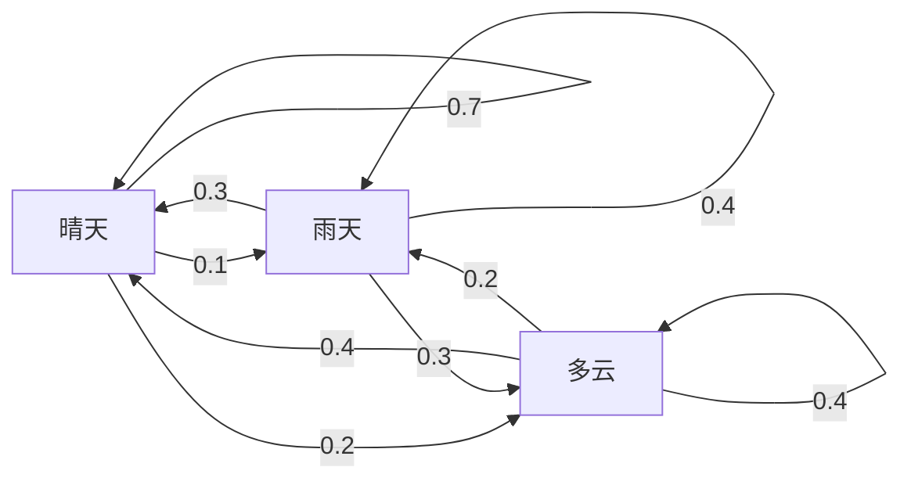
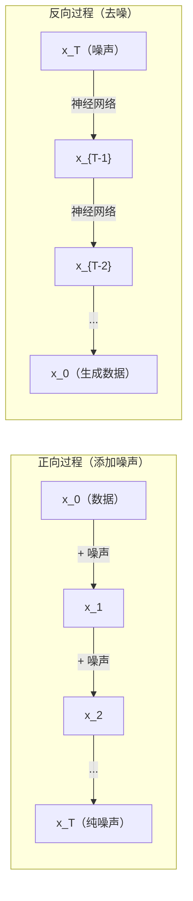

# 随机过程

> 有结构的随机性。随机游走、马尔可夫链和扩散模型背后的数学。

**类型：** 学习
**语言：** Python
**前置知识：** 第一阶段，第 06-07 课（概率、贝叶斯定理）
**时长：** ~75 分钟

## 学习目标

- 模拟一维和二维随机游走，并验证位移的 sqrt(n) 缩放规律
- 构建马尔可夫链模拟器，并通过特征分解计算其平稳分布
- 实现 Metropolis-Hastings MCMC 和朗之万动力学，从目标分布中采样
- 将正向扩散过程与布朗运动联系起来，并解释反向过程如何生成数据

## 问题

许多 AI 系统涉及随时间演变的随机性——不是静态的随机性，而是有结构的、序列性的随机性，其中每一步都依赖于前一步。

语言模型一次生成一个词元。每个词元依赖于之前的上下文：模型输出一个概率分布，从中采样，然后继续。这就是随机过程。

扩散模型逐步向图像添加噪声直至其变为纯噪声，然后逆向执行此过程，逐步去噪直至生成新图像。正向过程是马尔可夫链，反向过程是学习到的反向马尔可夫链。

强化学习智能体在环境中采取行动，每个行动以一定概率导致新的状态。智能体遵循随机策略处于随机世界中，整个系统是一个马尔可夫决策过程。

MCMC 采样——贝叶斯推断的骨干——构建一个平稳分布恰好是目标后验分布的马尔可夫链。

所有这些都建立在四个基础概念之上：
1. 随机游走——最简单的随机过程
2. 马尔可夫链——具有转移矩阵的结构化随机性
3. 朗之万动力学——带噪声的梯度下降
4. Metropolis-Hastings——从任意分布中采样

## 概念

### 随机游走

从位置 0 开始。每步抛一枚公平硬币：正面则向右（+1），反面则向左（-1）。

经过 n 步后，位置是 n 个随机 +/-1 值的和。期望位置为 0（游走是无偏的），但与原点的期望距离随 sqrt(n) 增长。

这违反直觉。游走是公平的——没有向任何方向的漂移。但随着时间推移，它距起点越来越远。n 步后的标准差为 sqrt(n)。

```
第 0 步：  位置 = 0
第 1 步：  位置 = +1 或 -1
第 2 步：  位置 = +2、0 或 -2
...
第 100 步：与原点的期望距离约为 10（sqrt(100)）
第 10000 步：与原点的期望距离约为 100（sqrt(10000)）
```

**在二维中**，游走以等概率向上、下、左、右移动，到原点距离的相同 sqrt(n) 缩放规律依然成立，路径呈现类似分形的形态。

**为什么是 sqrt(n)？** 每步为 +1 或 -1，概率相等。n 步后位置 S_n = X_1 + X_2 + ... + X_n，每个 X_i 为 +/-1。每步的方差为 1，步与步独立，所以 Var(S_n) = n，标准差 = sqrt(n)。由中心极限定理，S_n / sqrt(n) 收敛到标准正态分布。

这个 sqrt(n) 缩放在机器学习中无处不在：SGD 的噪声缩放为 1/sqrt(batch_size)，嵌入维度缩放为 sqrt(d)。平方根是独立随机叠加的标志。

**与布朗运动的联系。** 取步长为 1/sqrt(n)、每单位时间走 n 步的随机游走，当 n 趋向无穷时，游走收敛到布朗运动 B(t)——一个连续时间过程，其中 B(t) 服从均值为 0、方差为 t 的正态分布。

布朗运动是扩散的数学基础，模拟流体中粒子的随机抖动、股票价格的波动，以及——至关重要地——扩散模型中的噪声过程。

**赌徒破产问题。** 一个从位置 k 出发的随机游走者，在 0 和 N 处有吸收壁。他在到达 0 之前到达 N 的概率是多少？对于公平游走：P(到达 N) = k/N。这出奇地简洁，并与鞅理论相联系——公平随机游走是一个鞅（未来期望值 = 当前值）。

### 马尔可夫链

马尔可夫链是一个按固定概率在状态间转移的系统。关键性质：下一个状态只依赖于当前状态，而不依赖于历史。

```
P(X_{t+1} = j | X_t = i, X_{t-1} = ...) = P(X_{t+1} = j | X_t = i)
```

这是马尔可夫性质，意味着可以用转移矩阵 P 来描述全部动态：

```
P[i][j] = 从状态 i 转移到状态 j 的概率
```

P 的每一行之和为 1（必须去某个地方）。

**示例——天气：**

```
状态：晴天（0）、雨天（1）、多云（2）

P = [[0.7, 0.1, 0.2],    （晴天时：70% 晴天，10% 雨天，20% 多云）
     [0.3, 0.4, 0.3],    （雨天时：30% 晴天，40% 雨天，30% 多云）
     [0.4, 0.2, 0.4]]    （多云时：40% 晴天，20% 雨天，40% 多云）
```

从任意状态出发，经过多次转移后，状态分布收敛到平稳分布 pi，其中 pi * P = pi。这是 P 特征值为 1 的左特征向量。

对于天气链，平稳分布约为 [0.53, 0.18, 0.29]——从长期来看，无论从哪个状态开始，53% 的时间是晴天。



**计算平稳分布。** 有两种方法：

1. **幂法**：将任意初始分布反复乘以 P，经过足够多的迭代后收敛。
2. **特征值法**：找出 P 的特征值为 1 的左特征向量，即 P^T 的特征值为 1 的特征向量。

两种方法都要求链满足收敛条件。

**收敛条件。** 一个马尔可夫链收敛到唯一平稳分布，当且仅当它是：
- **不可约的（irreducible）**：每个状态都可以从其他任意状态到达
- **非周期的（aperiodic）**：链不以固定周期循环

机器学习中遇到的大多数链都满足这两个条件。

**吸收状态。** 一旦进入就不会离开的状态（P[i][i] = 1）。吸收马尔可夫链模拟具有终态的过程——结束的游戏、流失的用户、遇到序列终止词元的词元序列。

**混合时间。** 链需要多少步才能"接近"平稳分布？正式定义是与平稳分布的全变差距离降至某个阈值以下所需的步数。快速混合 = 需要较少步数。P 的谱间隔（1 减去第二大特征值的绝对值）控制混合时间：谱间隔越大，混合越快。

### 与语言模型的联系

语言模型中的词元生成近似是马尔可夫过程。给定当前上下文，模型输出下一个词元的概率分布，温度控制其锐度：

```
P(token_i) = exp(logit_i / temperature) / sum(exp(logit_j / temperature))
```

- 温度 = 1.0：标准分布
- 温度 < 1.0：更尖锐（更确定性）
- 温度 > 1.0：更平坦（更随机）
- 温度 → 0：argmax（贪心）

Top-k 采样截断到概率最高的 k 个词元；top-p（核采样）截断到累积概率超过 p 的最小词元集合，两者都修改了马尔可夫转移概率。

### 布朗运动

随机游走的连续时间极限。位置 B(t) 有三个性质：
1. B(0) = 0
2. B(t) - B(s) 服从均值为 0、方差为 t - s 的正态分布（t > s）
3. 不重叠区间上的增量相互独立

布朗运动是连续的但处处不可微——它在每个尺度上都在抖动。路径在平面上的分形维数为 2。

在离散模拟中，用以下方式近似布朗运动：

```
B(t + dt) = B(t) + sqrt(dt) * z，其中 z ~ N(0, 1)
```

sqrt(dt) 缩放很重要，它来自应用于随机游走的中心极限定理。

### 朗之万动力学

梯度下降寻找函数的最小值；朗之万动力学（Langevin dynamics）寻找正比于 exp(-U(x)/T) 的概率分布，其中 U 是能量函数，T 是温度。

```
x_{t+1} = x_t - dt * gradient(U(x_t)) + sqrt(2 * T * dt) * z_t
```

两种力作用于粒子：
1. **梯度力**（-dt * gradient(U)）：推向低能量区域（类似梯度下降）
2. **随机力**（sqrt(2*T*dt) * z）：向随机方向推（探索）

当温度 T = 0 时，这就是纯梯度下降；高温时，几乎是随机游走；适当温度下，粒子探索能量景观，在低能量区域停留更长时间。

**与扩散模型的联系。** 扩散模型的正向过程为：

```
x_t = sqrt(alpha_t) * x_{t-1} + sqrt(1 - alpha_t) * noise
```

这是一个逐渐将数据与噪声混合的马尔可夫链。经过足够多的步骤后，x_T 近似为纯高斯噪声。

反向过程——从噪声回到数据——也是马尔可夫链，但其转移概率由神经网络学习。网络学习预测每步添加的噪声，然后将其减去。



### MCMC：马尔可夫链蒙特卡洛

有时需要从一个可以评估（到归一化常数）但无法直接采样的分布 p(x) 中采样。贝叶斯后验是典型的例子——你知道似然乘以先验，但归一化常数难以处理。

**Metropolis-Hastings** 构造一个平稳分布为 p(x) 的马尔可夫链：

1. 从某个位置 x 开始
2. 从提议分布 Q(x'|x) 中提议新位置 x'
3. 计算接受率：a = p(x') * Q(x|x') / (p(x) * Q(x'|x))
4. 以概率 min(1, a) 接受 x'，否则停留在 x
5. 重复

若 Q 是对称的（如 Q(x'|x) = Q(x|x') = N(x, sigma^2)），比率简化为 a = p(x') / p(x)。只需概率的比值——归一化常数相互抵消。

在温和条件下，该链保证收敛到 p(x)。但若提议步长太小（随机游走）或太大（高拒绝率），收敛可能很慢。调整提议是 MCMC 的技艺所在。

**为什么有效。** 接受率确保了细致平衡：从 x 出发转移到 x' 的概率等于从 x' 出发转移到 x 的概率。细致平衡意味着 p(x) 是链的平稳分布，因此经过足够多的步骤后，样本来自 p(x)。

**实践注意事项：**
- **预热（burn-in）**：丢弃前 N 个样本。链需要时间从起始点到达平稳分布。
- **稀疏化（thinning）**：每隔 k 个样本保留一个，以减少自相关。
- **多条链**：从不同起始点运行几条链。若它们收敛到相同分布，就有了收敛的证据。
- **接受率**：对于 d 维高斯提议，最优接受率约为 23%（Roberts & Rosenthal, 2001）。太高意味着链几乎不移动；太低意味着几乎拒绝所有提议。

### 随机过程在 AI 中的应用

| 过程 | AI 应用 |
|------|---------|
| 随机游走 | 强化学习中的探索、Node2Vec 嵌入 |
| 马尔可夫链 | 文本生成、MCMC 采样 |
| 布朗运动 | 扩散模型（正向过程）|
| 朗之万动力学 | 基于得分的生成模型、SGLD |
| 马尔可夫决策过程 | 强化学习 |
| Metropolis-Hastings | 贝叶斯推断、后验采样 |

## 动手实现

### 第一步：随机游走模拟器

```python
import numpy as np

def random_walk_1d(n_steps, seed=None):
    rng = np.random.RandomState(seed)
    steps = rng.choice([-1, 1], size=n_steps)
    positions = np.concatenate([[0], np.cumsum(steps)])
    return positions


def random_walk_2d(n_steps, seed=None):
    rng = np.random.RandomState(seed)
    directions = rng.choice(4, size=n_steps)
    dx = np.zeros(n_steps)
    dy = np.zeros(n_steps)
    dx[directions == 0] = 1   # 右
    dx[directions == 1] = -1  # 左
    dy[directions == 2] = 1   # 上
    dy[directions == 3] = -1  # 下
    x = np.concatenate([[0], np.cumsum(dx)])
    y = np.concatenate([[0], np.cumsum(dy)])
    return x, y
```

一维游走存储累积和：每步为 +1 或 -1，n 步后位置为它们的和。方差随 n 线性增长，标准差随 sqrt(n) 增长。

### 第二步：马尔可夫链

```python
class MarkovChain:
    def __init__(self, transition_matrix, state_names=None):
        self.P = np.array(transition_matrix, dtype=float)
        self.n_states = len(self.P)
        self.state_names = state_names or [str(i) for i in range(self.n_states)]

    def step(self, current_state, rng=None):
        if rng is None:
            rng = np.random.RandomState()
        probs = self.P[current_state]
        return rng.choice(self.n_states, p=probs)

    def simulate(self, start_state, n_steps, seed=None):
        rng = np.random.RandomState(seed)
        states = [start_state]
        current = start_state
        for _ in range(n_steps):
            current = self.step(current, rng)
            states.append(current)
        return states

    def stationary_distribution(self):
        eigenvalues, eigenvectors = np.linalg.eig(self.P.T)
        idx = np.argmin(np.abs(eigenvalues - 1.0))
        stationary = np.real(eigenvectors[:, idx])
        stationary = stationary / stationary.sum()
        return np.abs(stationary)
```

平稳分布是 P 的特征值为 1 的左特征向量。通过计算 P^T（转置将左特征向量变为右特征向量）的特征向量来求解。

### 第三步：朗之万动力学

```python
def langevin_dynamics(grad_U, x0, dt, temperature, n_steps, seed=None):
    rng = np.random.RandomState(seed)
    x = np.array(x0, dtype=float)
    trajectory = [x.copy()]
    for _ in range(n_steps):
        noise = rng.randn(*x.shape)
        x = x - dt * grad_U(x) + np.sqrt(2 * temperature * dt) * noise
        trajectory.append(x.copy())
    return np.array(trajectory)
```

梯度将 x 推向低能量区域，噪声防止其陷入局部最小值。在平衡状态下，样本的分布正比于 exp(-U(x)/temperature)。

### 第四步：Metropolis-Hastings

```python
def metropolis_hastings(target_log_prob, proposal_std, x0, n_samples, seed=None):
    rng = np.random.RandomState(seed)
    x = np.array(x0, dtype=float)
    samples = [x.copy()]
    accepted = 0
    for _ in range(n_samples - 1):
        x_proposed = x + rng.randn(*x.shape) * proposal_std
        log_ratio = target_log_prob(x_proposed) - target_log_prob(x)
        if np.log(rng.rand()) < log_ratio:
            x = x_proposed
            accepted += 1
        samples.append(x.copy())
    acceptance_rate = accepted / (n_samples - 1)
    return np.array(samples), acceptance_rate
```

算法提议新点，检查其概率是否更高（或以正比于比率的概率接受），然后重复。接受率在 23-50% 之间表示混合良好。

## 实际使用

实际中使用成熟库，但理解底层机制对调试和调参至关重要。

```python
import numpy as np

rng = np.random.RandomState(42)
walk = np.cumsum(rng.choice([-1, 1], size=10000))
print(f"最终位置：{walk[-1]}")
print(f"期望距离：{np.sqrt(10000):.1f}")
print(f"实际距离：{abs(walk[-1])}")
```

### 用 numpy 处理转移矩阵

```python
import numpy as np

P = np.array([[0.7, 0.1, 0.2],
              [0.3, 0.4, 0.3],
              [0.4, 0.2, 0.4]])

distribution = np.array([1.0, 0.0, 0.0])
for _ in range(100):
    distribution = distribution @ P

print(f"平稳分布：{np.round(distribution, 4)}")
```

将初始分布反复乘以 P，经过足够多的迭代后，无论从哪里开始，都收敛到平稳分布。这是求主导左特征向量的幂法。

### 与实际框架的联系

- **PyTorch 扩散模型：** Hugging Face `diffusers` 中的 `DDPMScheduler` 实现正向和反向马尔可夫链
- **NumPyro / PyMC：** 使用 MCMC（NUTS 采样器，改进自 Metropolis-Hastings）进行贝叶斯推断
- **Gymnasium（强化学习）：** 环境的 step 函数定义了马尔可夫决策过程

### 验证马尔可夫链的收敛

```python
import numpy as np

P = np.array([[0.9, 0.1], [0.3, 0.7]])

eigenvalues = np.linalg.eigvals(P)
spectral_gap = 1 - sorted(np.abs(eigenvalues))[-2]
print(f"特征值：{eigenvalues}")
print(f"谱间隔：{spectral_gap:.4f}")
print(f"近似混合时间：{1/spectral_gap:.1f} 步")
```

谱间隔告诉你链遗忘初始状态的速度：间隔为 0.2 意味着约 5 步混合完成；间隔为 0.01 意味着约 100 步。运行长时间模拟之前务必检查这一点——混合缓慢的链会浪费大量计算。

## 交付

本课生成：
- `outputs/prompt-stochastic-process-advisor.md` — 帮助判断哪种随机过程框架适用于给定问题的提示词

## 关联

| 概念 | 在哪里出现 |
|------|-----------|
| 随机游走 | Node2Vec 图嵌入、强化学习中的探索 |
| 马尔可夫链 | 大语言模型的词元生成、MCMC 采样 |
| 布朗运动 | DDPM 中的正向扩散过程、基于 SDE 的模型 |
| 朗之万动力学 | 基于得分的生成模型、随机梯度朗之万动力学（SGLD）|
| 平稳分布 | MCMC 收敛目标、PageRank |
| Metropolis-Hastings | 贝叶斯后验采样、模拟退火 |
| 温度 | 大语言模型采样、强化学习中的玻尔兹曼探索、模拟退火 |
| 混合时间 | MCMC 收敛速度、谱间隔分析 |
| 吸收状态 | 序列结束词元、强化学习中的终态 |
| 细致平衡 | MCMC 采样器的正确性保证 |

扩散模型值得特别关注。DDPM（Ho et al., 2020）定义了一个正向马尔可夫链：

```
q(x_t | x_{t-1}) = N(x_t; sqrt(1-beta_t) * x_{t-1}, beta_t * I)
```

其中 beta_t 是噪声调度。经过 T 步后，x_T 近似为 N(0, I)。反向过程由神经网络参数化，预测噪声：

```
p_theta(x_{t-1} | x_t) = N(x_{t-1}; mu_theta(x_t, t), sigma_t^2 * I)
```

每一步生成都是学习到的马尔可夫链中的一步。理解马尔可夫链，就理解了扩散模型如何以及为何能生成数据。

SGLD（随机梯度朗之万动力学）将小批量梯度下降与朗之万噪声结合。不计算完整梯度，而是使用随机估计并添加经过校准的噪声。随着学习率衰减，SGLD 从优化过渡到采样——可以免费获得近似的贝叶斯后验样本，是从神经网络获取不确定性估计的最简单方法之一。

跨越所有这些联系的核心洞见：随机过程不只是理论工具，它们是现代 AI 系统内部的计算机制。调整大语言模型的温度时，你在调整马尔可夫链；训练扩散模型时，你在学习逆转类布朗运动的过程；运行贝叶斯推断时，你在构建一个收敛到后验分布的链。

## 练习

1. **模拟 1000 个随机游走，每个走 10000 步。** 绘制最终位置的分布，验证其近似服从均值为 0、标准差为 sqrt(10000) = 100 的正态分布。

2. **用马尔可夫链构建文本生成器。** 在一个小语料库上训练：统计每个单词到下一个单词的转移次数，构建转移矩阵，通过从链中采样来生成新句子。

3. **用 Metropolis-Hastings 实现模拟退火。** 从高温开始（几乎接受所有提议），然后逐渐降温（只接受改进）。用它寻找一个有许多局部极小值的函数的最小值。

4. **比较不同温度下的朗之万动力学。** 从双井势 U(x) = (x^2 - 1)^2 中采样。低温时样本聚集在一个井中；高温时扩散到两个井中。找到链在两个井之间混合的临界温度。

5. **实现正向扩散过程。** 从一维信号（如正弦波）开始，用线性噪声调度在 100 步内逐步添加噪声，展示信号如何退化为纯噪声，然后实现一个简单的去噪器来逆转该过程。

## 关键术语

| 术语 | 通俗说法 | 实际含义 |
|------|----------|----------|
| 随机游走 | "掷硬币式移动" | 位置在每步以随机增量变化的过程 |
| 马尔可夫性质 | "无记忆性" | 未来只依赖当前状态，而非历史 |
| 转移矩阵 | "概率表" | P[i][j] = 从状态 i 移动到状态 j 的概率 |
| 平稳分布 | "长期平均" | 满足 pi*P = pi 的分布 pi——链的均衡状态 |
| 布朗运动 | "随机抖动" | 随机游走的连续时间极限，B(t) ~ N(0, t) |
| 朗之万动力学 | "带噪声的梯度下降" | 结合确定性梯度和随机扰动的更新规则 |
| MCMC | "向目标游走" | 构建平稳分布即目标分布的马尔可夫链 |
| Metropolis-Hastings | "提议并接受/拒绝" | 利用接受率确保收敛的 MCMC 算法 |
| 温度 | "随机性调节旋钮" | 控制探索与利用之间权衡的参数 |
| 扩散过程 | "噪声进，噪声出" | 正向：逐步添加噪声；反向：逐步去除噪声；用于生成数据 |

## 延伸阅读

- **Ho, Jain, Abbeel（2020）** — "Denoising Diffusion Probabilistic Models"。引发扩散模型革命的 DDPM 论文，清晰推导了正向和反向马尔可夫链。
- **Song & Ermon（2019）** — "Generative Modeling by Estimating Gradients of the Data Distribution"。基于朗之万动力学采样的基于得分的生成方法。
- **Roberts & Rosenthal（2004）** — "General state space Markov chains and MCMC algorithms"。MCMC 何时以及为何有效的理论。
- **Norris（1997）** — "Markov Chains"。标准教材，涵盖收敛、平稳分布和命中时间。
- **Welling & Teh（2011）** — "Bayesian Learning via Stochastic Gradient Langevin Dynamics"。将 SGD 与朗之万动力学结合用于可扩展贝叶斯推断。
