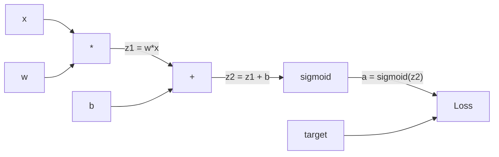
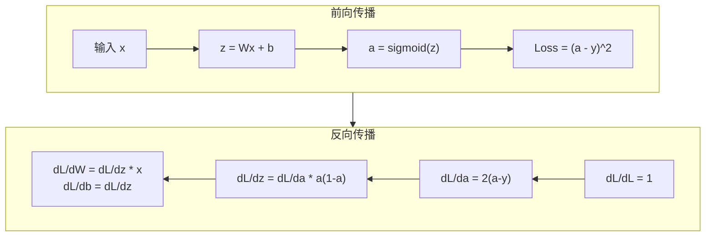
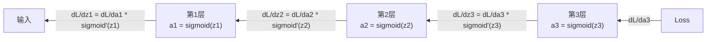

# 从零实现反向传播

> 反向传播是使学习成为可能的算法。没有它，神经网络只是昂贵的随机数生成器。

**类型：** 构建
**语言：** Python
**前置要求：** 第03.02课（多层网络）
**时长：** ~120 分钟

## 学习目标

- 实现一个基于 Value 的自动微分引擎，构建计算图并通过拓扑排序计算梯度
- 推导加法、乘法和 sigmoid 的反向传播，使用链式法则
- 仅使用从零实现的反向传播引擎，在 XOR 和圆形分类任务上训练多层网络
- 识别深层 sigmoid 网络中的梯度消失问题，并解释梯度为何呈指数级缩小

## 问题背景

你的网络有一个单隐藏层，768 个输入，3072 个输出。那就是 2,359,296 个权重。它做出了错误预测。哪些权重导致了这个错误？逐一测试每个权重意味着 230 万次前向传播。反向传播在一次反向传播中计算全部 230 万个梯度。这不是优化，而是可训练与不可能之间的区别。

朴素方法：取一个权重，微调它，再次运行前向传播，测量损失是否上升或下降。这给出了该权重的梯度。现在对网络中的每个权重都这样做。乘以数千个训练步骤和数百万个数据点，你需要地质纪元级别的时间来训练任何有用的东西。

反向传播解决了这个问题。一次前向传播，一次反向传播，所有梯度一次性计算。技巧在于微积分中的链式法则，系统地应用于计算图。这是使深度学习变得实用的算法。没有它，我们至今还困于玩具问题。

## 核心概念

### 应用于网络的链式法则

你在第1阶段第05课中学过链式法则。快速回顾：如果 y = f(g(x))，那么 dy/dx = f'(g(x)) * g'(x)。沿着链条乘以导数。

在神经网络中，"链条"是从输入到损失的操作序列。每一层应用权重，加偏置，通过激活函数。损失函数将最终输出与目标比较。反向传播沿这条链向后追踪，计算每个操作对误差的贡献。

### 计算图

每次前向传播都会构建一个图。每个节点是一个操作（乘法、加法、sigmoid）。每条边向前传递值，向后传递梯度。



前向传播：值从左向右流动。x 和 w 产生 z1 = w*x。加 b 得到 z2。sigmoid 给出激活值 a。用损失函数将 a 与目标 y 比较。

反向传播：梯度从右向左流动。从 dL/da（损失随激活的变化）开始。乘以 da/dz2（sigmoid 导数）得到 dL/dz2。分解为 dL/db（等于 dL/dz2，因为 z2 = z1 + b）和 dL/dz1。然后 dL/dw = dL/dz1 * x，dL/dx = dL/dz1 * w。

图中每个节点在反向传播时只做一件事：接收来自上游的梯度，乘以局部导数，向下传递。

### 前向传播与反向传播



前向传播存储每个中间值：z、a、每层的输入。反向传播需要这些存储的值来计算梯度。这是反向传播核心的内存-计算权衡：用内存（存储激活值）换取速度（一次传播而非数百万次）。

### 梯度在网络中的流动

对于 3 层网络，梯度通过每一层链式传播：



在每一层，梯度都被 sigmoid 导数乘以。sigmoid 导数是 a * (1 - a)，最大值为 0.25（当 a = 0.5 时）。三层深后，梯度最多被乘以 0.25^3 = 0.0156。十层深：0.25^10 = 0.000001。

### 梯度消失

这就是梯度消失问题。sigmoid 将输出压缩在 0 和 1 之间，其导数始终小于 0.25。堆叠足够多的 sigmoid 层，梯度收缩至几乎为零。早期层几乎不学习，因为它们接收到的梯度接近零。

```
sigmoid(z):     输出范围 [0, 1]
sigmoid'(z):    最大值 0.25（在 z = 0 时）

经过 5 层:   梯度 * 0.25^5 = 原始的 0.001 倍
经过 10 层:  梯度 * 0.25^10 = 原始的 0.000001 倍
```

这就是为什么深层 sigmoid 网络几乎不可能训练。解决方法——ReLU 及其变体——是第 04 课的主题。现在，理解反向传播本身工作完美。问题在于它传播经过的东西。

### 推导 2 层网络的梯度

具体数学：网络有输入 x，带 sigmoid 的隐藏层，带 sigmoid 的输出层，以及 MSE 损失。

前向传播：
```
z1 = W1 * x + b1
a1 = sigmoid(z1)
z2 = W2 * a1 + b2
a2 = sigmoid(z2)
L = (a2 - y)^2
```

反向传播（逐步应用链式法则）：
```
dL/da2 = 2(a2 - y)
da2/dz2 = a2 * (1 - a2)
dL/dz2 = dL/da2 * da2/dz2 = 2(a2 - y) * a2 * (1 - a2)

dL/dW2 = dL/dz2 * a1
dL/db2 = dL/dz2

dL/da1 = dL/dz2 * W2
da1/dz1 = a1 * (1 - a1)
dL/dz1 = dL/da1 * da1/dz1

dL/dW1 = dL/dz1 * x
dL/db1 = dL/dz1
```

每个梯度都是从损失向后追踪的局部导数之积。这就是反向传播的全部内容。

## 实现

### 第一步：Value 节点

计算中的每个数字都成为一个 Value。它存储自身的数据、梯度，以及它是如何被创建的（以便知道如何向后计算梯度）。

```python
class Value:
    def __init__(self, data, children=(), op=''):
        self.data = data
        self.grad = 0.0
        self._backward = lambda: None
        self._children = set(children)
        self._op = op

    def __repr__(self):
        return f"Value(data={self.data:.4f}, grad={self.grad:.4f})"
```

尚无梯度（0.0）。尚无反向函数（no-op）。`_children` 追踪哪些 Value 产生了这个 Value，以便之后对图进行拓扑排序。

### 第二步：带反向函数的操作

每个操作创建一个新的 Value，并定义梯度如何通过它向后流动。

```python
def __add__(self, other):
    other = other if isinstance(other, Value) else Value(other)
    out = Value(self.data + other.data, (self, other), '+')

    def _backward():
        self.grad += out.grad
        other.grad += out.grad

    out._backward = _backward
    return out

def __mul__(self, other):
    other = other if isinstance(other, Value) else Value(other)
    out = Value(self.data * other.data, (self, other), '*')

    def _backward():
        self.grad += other.data * out.grad
        other.grad += self.data * out.grad

    out._backward = _backward
    return out
```

对于加法：d(a+b)/da = 1，d(a+b)/db = 1。所以两个输入都直接获得输出的梯度。

对于乘法：d(a*b)/da = b，d(a*b)/db = a。每个输入获得另一方的值乘以输出梯度。

`+=` 至关重要。一个 Value 可能在多个操作中被使用。其梯度是所有路径梯度的总和。

### 第三步：Sigmoid 和损失

```python
import math

def sigmoid(self):
    x = self.data
    x = max(-500, min(500, x))
    s = 1.0 / (1.0 + math.exp(-x))
    out = Value(s, (self,), 'sigmoid')

    def _backward():
        self.grad += (s * (1 - s)) * out.grad

    out._backward = _backward
    return out
```

Sigmoid 导数：sigmoid(x) * (1 - sigmoid(x))。前向传播时我们已计算 sigmoid(x) = s，直接复用，无需额外工作。

```python
def mse_loss(predicted, target):
    diff = predicted + Value(-target)
    return diff * diff
```

单个输出的 MSE：(predicted - target)^2。我们将减法表示为与负值的加法。

### 第四步：反向传播

拓扑排序确保我们以正确的顺序处理节点——在传播梯度之前，节点的梯度已完全累积。

```python
def backward(self):
    topo = []
    visited = set()

    def build_topo(v):
        if v not in visited:
            visited.add(v)
            for child in v._children:
                build_topo(child)
            topo.append(v)

    build_topo(self)
    self.grad = 1.0
    for v in reversed(topo):
        v._backward()
```

从损失开始（梯度 = 1.0，因为 dL/dL = 1）。沿已排序的图向后遍历。每个节点的 `_backward` 将梯度推送给其子节点。

### 第五步：Layer 和 Network

```python
import random

class Neuron:
    def __init__(self, n_inputs):
        scale = (2.0 / n_inputs) ** 0.5
        self.weights = [Value(random.uniform(-scale, scale)) for _ in range(n_inputs)]
        self.bias = Value(0.0)

    def __call__(self, x):
        act = sum((wi * xi for wi, xi in zip(self.weights, x)), self.bias)
        return act.sigmoid()

    def parameters(self):
        return self.weights + [self.bias]


class Layer:
    def __init__(self, n_inputs, n_outputs):
        self.neurons = [Neuron(n_inputs) for _ in range(n_outputs)]

    def __call__(self, x):
        out = [n(x) for n in self.neurons]
        return out[0] if len(out) == 1 else out

    def parameters(self):
        params = []
        for n in self.neurons:
            params.extend(n.parameters())
        return params


class Network:
    def __init__(self, sizes):
        self.layers = []
        for i in range(len(sizes) - 1):
            self.layers.append(Layer(sizes[i], sizes[i + 1]))

    def __call__(self, x):
        for layer in self.layers:
            x = layer(x)
            if not isinstance(x, list):
                x = [x]
        return x[0] if len(x) == 1 else x

    def parameters(self):
        params = []
        for layer in self.layers:
            params.extend(layer.parameters())
        return params

    def zero_grad(self):
        for p in self.parameters():
            p.grad = 0.0
```

Neuron 接收输入，计算加权和加偏置，应用 sigmoid。权重初始化按 sqrt(2/n_inputs) 缩放，防止更深网络中的 sigmoid 饱和。Layer 是 Neuron 的列表。Network 是 Layer 的列表。`parameters()` 方法收集所有可学习的 Value，以便更新它们。

### 第六步：在 XOR 上训练

```python
random.seed(42)
net = Network([2, 4, 1])

xor_data = [
    ([0.0, 0.0], 0.0),
    ([0.0, 1.0], 1.0),
    ([1.0, 0.0], 1.0),
    ([1.0, 1.0], 0.0),
]

learning_rate = 1.0

for epoch in range(1000):
    total_loss = Value(0.0)
    for inputs, target in xor_data:
        x = [Value(i) for i in inputs]
        pred = net(x)
        loss = mse_loss(pred, target)
        total_loss = total_loss + loss

    net.zero_grad()
    total_loss.backward()

    for p in net.parameters():
        p.data -= learning_rate * p.grad

    if epoch % 100 == 0:
        print(f"Epoch {epoch:4d} | Loss: {total_loss.data:.6f}")

print("\nXOR Results:")
for inputs, target in xor_data:
    x = [Value(i) for i in inputs]
    pred = net(x)
    print(f"  {inputs} -> {pred.data:.4f} (expected {target})")
```

观察损失下降。从随机预测到正确的 XOR 输出，完全由反向传播计算梯度并将权重推向正确方向驱动。

### 第七步：圆形分类

第 02 课中，你手动调整权重进行圆形分类。现在让网络自己学习。

```python
random.seed(7)

def generate_circle_data(n=100):
    data = []
    for _ in range(n):
        x1 = random.uniform(-1.5, 1.5)
        x2 = random.uniform(-1.5, 1.5)
        label = 1.0 if x1 * x1 + x2 * x2 < 1.0 else 0.0
        data.append(([x1, x2], label))
    return data

circle_data = generate_circle_data(80)

circle_net = Network([2, 8, 1])
learning_rate = 0.5

for epoch in range(2000):
    random.shuffle(circle_data)
    total_loss_val = 0.0
    for inputs, target in circle_data:
        x = [Value(i) for i in inputs]
        pred = circle_net(x)
        loss = mse_loss(pred, target)
        circle_net.zero_grad()
        loss.backward()
        for p in circle_net.parameters():
            p.data -= learning_rate * p.grad
        total_loss_val += loss.data

    if epoch % 200 == 0:
        correct = 0
        for inputs, target in circle_data:
            x = [Value(i) for i in inputs]
            pred = circle_net(x)
            predicted_class = 1.0 if pred.data > 0.5 else 0.0
            if predicted_class == target:
                correct += 1
        accuracy = correct / len(circle_data) * 100
        print(f"Epoch {epoch:4d} | Loss: {total_loss_val:.4f} | Accuracy: {accuracy:.1f}%")
```

这里使用在线 SGD——每个样本后更新权重，而非积累完整批次。这能更快地打破对称性，避免在完整损失景观上的 sigmoid 饱和。每个 epoch 打乱数据，防止网络记忆顺序。

无需手动调整。网络自己发现圆形决策边界。这就是反向传播的力量：你定义架构、损失函数和数据，算法找到权重。

## 工程应用

PyTorch 用几行代码完成以上所有工作。核心思想完全相同——自动微分在前向传播时构建计算图，并沿其向后追踪以计算梯度。

```python
import torch
import torch.nn as nn

model = nn.Sequential(
    nn.Linear(2, 4),
    nn.Sigmoid(),
    nn.Linear(4, 1),
    nn.Sigmoid(),
)
optimizer = torch.optim.SGD(model.parameters(), lr=1.0)
criterion = nn.MSELoss()

X = torch.tensor([[0,0],[0,1],[1,0],[1,1]], dtype=torch.float32)
y = torch.tensor([[0],[1],[1],[0]], dtype=torch.float32)

for epoch in range(1000):
    pred = model(X)
    loss = criterion(pred, y)
    optimizer.zero_grad()
    loss.backward()
    optimizer.step()

print("PyTorch XOR Results:")
with torch.no_grad():
    for i in range(4):
        pred = model(X[i])
        print(f"  {X[i].tolist()} -> {pred.item():.4f} (expected {y[i].item()})")
```

`loss.backward()` 就是你的 `total_loss.backward()`。`optimizer.step()` 就是你手动写的 `p.data -= lr * p.grad`。`optimizer.zero_grad()` 就是你的 `net.zero_grad()`。同样的算法，工业级实现。PyTorch 处理 GPU 加速、混合精度、梯度检查点和数百种层类型。但反向传播过程与你手写的对同一计算图应用同样链式法则完全相同。

训练运行前向传播，然后反向传播，然后更新权重。推理只运行前向传播，没有梯度，没有更新。这个区别很重要，因为推理是生产环境中发生的事情。当你调用 Claude 或 GPT 这样的 API 时，你是在运行推理——你的提示向前流经网络，token 从另一端输出。没有权重改变。理解反向传播很重要，因为它塑造了那个网络中的每一个权重。

## 交付物

本课产出：
- `outputs/prompt-gradient-debugger.md` — 用于诊断任何神经网络中梯度问题（消失、爆炸、NaN）的可复用提示

## 练习

1. 为 Value 类添加 `__sub__` 方法（a - b = a + (-1 * b)），然后实现 `__neg__` 方法。通过与手动计算对比，验证梯度正确性（如简单表达式 (a - b)^2）。

2. 为 Value 添加 `relu` 方法（输出 max(0, x)，x > 0 时导数为 1，否则为 0）。在隐藏层中用 relu 替换 sigmoid，再次训练 XOR。比较收敛速度。你应该看到更快的训练——这预示着第 04 课的内容。

3. 在 Value 上为整数幂实现 `__pow__` 方法。用它将 `mse_loss` 替换为正规的 `(predicted - target) ** 2` 表达式。验证梯度与原实现一致。

4. 在训练循环中添加梯度裁剪：调用 `backward()` 后，将所有梯度裁剪到 [-1, 1]。训练更深的网络（4层以上带 sigmoid），比较有无裁剪的损失曲线。这是你对抗梯度爆炸的第一道防线。

5. 构建可视化：训练 XOR 后，打印网络中每个参数的梯度。找出哪一层的梯度最小。这展示了你在概念部分读到的梯度消失问题。

## 关键术语

| 术语 | 人们怎么说 | 实际含义 |
|------|-----------|---------|
| 反向传播（Backpropagation） | "网络在学习" | 通过对计算图应用链式法则向后传播，为每个权重计算 dL/dw 的算法 |
| 计算图（Computational graph） | "网络结构" | 有向无环图，节点为操作，边向前传递值，向后传递梯度 |
| 链式法则（Chain rule） | "乘以导数" | 如果 y = f(g(x))，则 dy/dx = f'(g(x)) * g'(x)——反向传播的数学基础 |
| 梯度（Gradient） | "最陡上升方向" | 损失相对于参数的偏导数——告诉你如何改变该参数以减少损失 |
| 梯度消失（Vanishing gradient） | "深层网络不学习" | 梯度通过具有饱和激活（如 sigmoid）的层时呈指数级缩小 |
| 前向传播（Forward pass） | "运行网络" | 通过依次应用每层操作并存储中间值，从输入计算输出 |
| 反向传播（Backward pass） | "计算梯度" | 反向遍历计算图，在每个节点使用链式法则累积梯度 |
| 学习率（Learning rate） | "学习速度" | 更新权重时控制步长的标量：w_new = w_old - lr * gradient |
| 拓扑排序（Topological sort） | "正确顺序" | 图节点的排序，每个节点出现在其所有依赖节点之后——确保梯度在传播前完全累积 |
| 自动微分（Autograd） | "自动求导" | 在前向计算时构建计算图，并自动计算梯度的系统——PyTorch 引擎所做的事 |

## 延伸阅读

- Rumelhart, Hinton & Williams，"Learning representations by back-propagating errors"（1986）——使反向传播成为主流并解锁多层网络训练的论文
- 3Blue1Brown，"Neural Networks" 系列（https://www.youtube.com/playlist?list=PLZHQObOWTQDNU6R1_67000Dx_ZCJB-3pi）——对反向传播和梯度在网络中流动的最佳可视化解释
