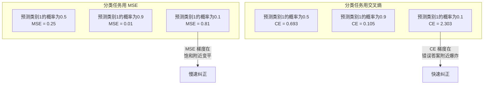
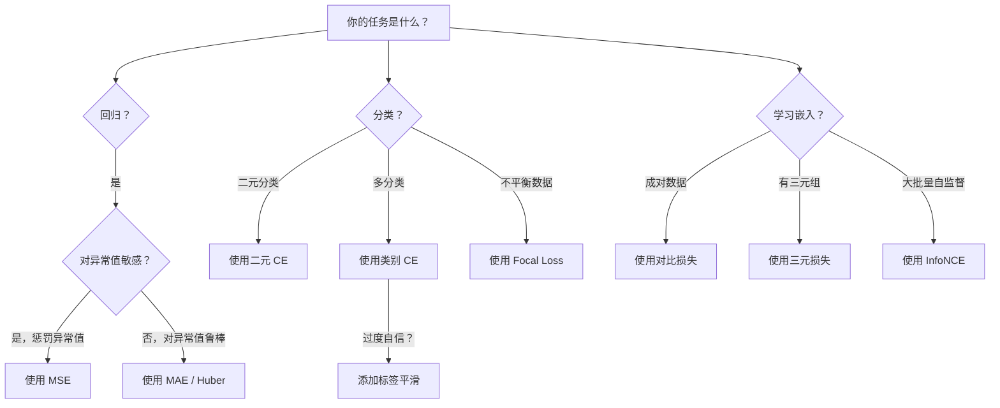
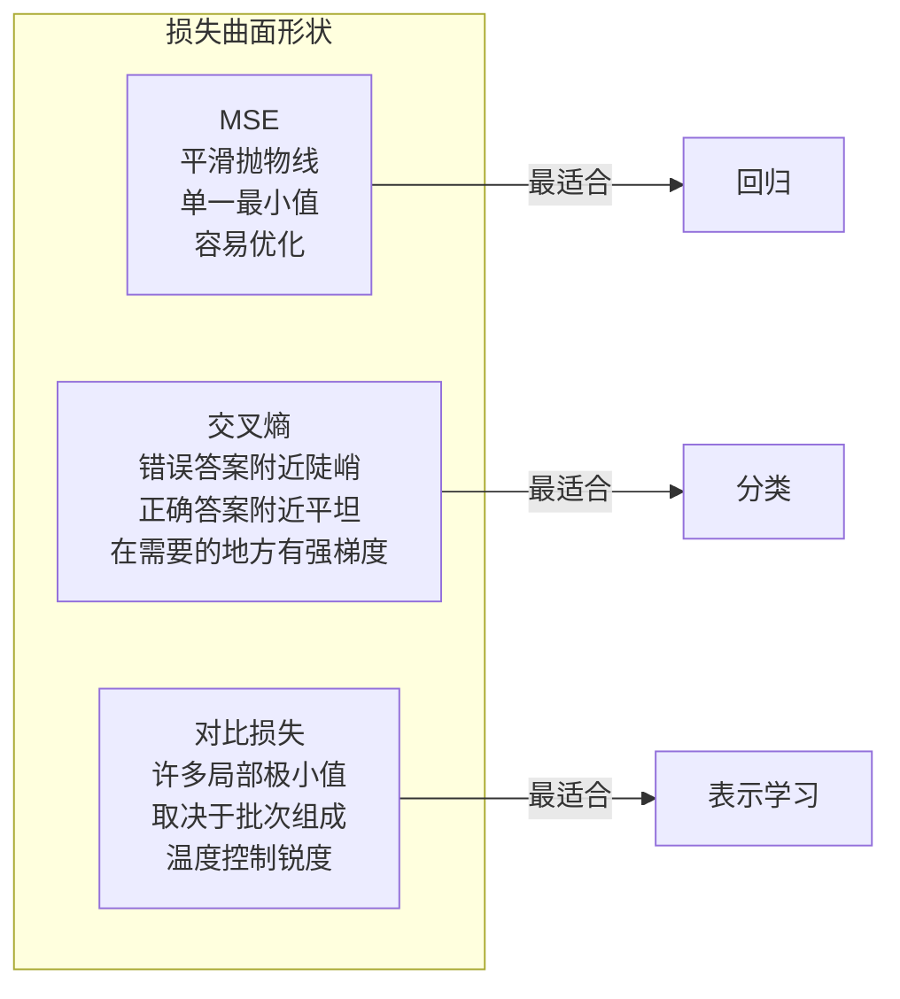

# 损失函数

> 模型做出预测。真实标签却说不是这样。它错得有多离谱？这个数字就是损失。选错了损失函数，你的模型就会完全优化错误的目标。

**类型：** 构建
**语言：** Python
**前置要求：** 第03.04课（激活函数）
**时长：** ~75 分钟

## 学习目标

- 从零实现 MSE、二元交叉熵、类别交叉熵和对比损失（InfoNCE）及其梯度
- 通过演示"对一切预测 0.5"的失败模式，解释 MSE 为何在分类任务中失效
- 对交叉熵应用标签平滑，描述它如何防止过度自信的预测
- 为回归、二元分类、多分类和嵌入学习任务选择正确的损失函数

## 问题背景

在分类问题上最小化 MSE 的模型，会自信地对所有输入预测 0.5。它确实在最小化损失，但这毫无用处。

损失函数是你的模型真正优化的唯一东西——不是准确率，不是 F1 分数，也不是你向上级汇报的任何指标。优化器对损失函数求梯度，并调整权重使这个数字变小。如果损失函数没有捕捉到你真正关心的东西，模型会找到数学上最廉价的方式来满足它，而这几乎从来不是你想要的。

一个具体例子：你有一个二元分类任务，两类各占 50%，你用 MSE 作为损失。模型对每个输入都预测 0.5。平均 MSE 是 0.25，这是在不学习任何东西的情况下可能达到的最小值。模型没有任何判别能力，但它在技术上最小化了你的损失函数。换成交叉熵后，相同的模型被迫将预测推向 0 或 1，因为 -log(0.5) = 0.693 是糟糕的损失，而 -log(0.99) = 0.01 奖励自信的正确预测。损失函数的选择，是一个能学习的模型和一个只在打游戏的模型之间的区别。

情况还会更糟。在自监督学习中，你甚至没有标签。对比损失完全定义学习信号：什么算相似，什么算不同，模型应该多用力地把它们推开。对比损失写错了，你的嵌入就会坍缩到单个点——每个输入都映射到同一个向量。技术上损失为零，完全一文不值。

## 核心概念

### 均方误差（MSE）

回归的默认选择。计算预测值与目标值之间的平方差，对所有样本取平均。

```
MSE = (1/n) * sum((y_pred - y_true)^2)
```

为什么要平方：它对大误差施以二次惩罚。误差为 2 的代价是误差为 1 的 4 倍，误差为 10 的代价是 100 倍。这使 MSE 对异常值敏感——单个严重错误的预测就会主导损失。

实际例子：如果你的模型预测房价，对大多数房子偏差 1 万美元，但对一栋豪宅偏差 20 万美元，MSE 会积极地尝试修正那栋豪宅，可能损害其他 99 栋房子的性能。

MSE 相对于预测值的梯度是：

```
dMSE/dy_pred = (2/n) * (y_pred - y_true)
```

对误差呈线性。更大的误差获得更大的梯度。这对回归是优点（大误差需要大纠正），对分类是缺点（你希望对自信的错误答案施以指数级惩罚，而不是线性惩罚）。

### 交叉熵损失

分类的损失函数，根植于信息论——它测量预测概率分布与真实分布之间的散度。

**二元交叉熵（BCE）：**

```
BCE = -(y * log(p) + (1 - y) * log(1 - p))
```

其中 y 是真实标签（0 或 1），p 是预测概率。

为什么 -log(p) 有效：当真实标签为 1 且你预测 p = 0.99 时，损失为 -log(0.99) = 0.01。当你预测 p = 0.01 时，损失为 -log(0.01) = 4.6。这 460 倍的差异就是交叉熵有效的原因。它残酷地惩罚自信的错误预测，几乎不惩罚自信的正确预测。

梯度也说明了同样的问题：

```
dBCE/dp = -(y/p) + (1-y)/(1-p)
```

当 y = 1 且 p 接近零时，梯度为 -1/p，趋向于负无穷。模型得到一个巨大的信号来纠正错误。当 p 接近 1 时，梯度很小——已经正确了，无需修正。

**类别交叉熵（Categorical Cross-Entropy）：**

用于带独热编码目标的多分类。

```
CCE = -sum(y_i * log(p_i))
```

只有真实类别对损失有贡献（因为其他所有 y_i 都为零）。如果有 10 个类别，正确类别的概率为 0.1（随机猜测），损失为 -log(0.1) = 2.3。如果正确类别的概率为 0.9，损失为 -log(0.9) = 0.105。模型学会将概率质量集中在正确答案上。

### 为何 MSE 在分类中失败



MSE 梯度在预测值接近 0 或 1 时变平（由于 sigmoid 饱和）。交叉熵梯度弥补了这一点——-log 抵消了 sigmoid 的平坦区域，在最需要的地方提供强梯度。

### 标签平滑

标准独热标签说"这 100% 是类别 3，其他类别 0%"。这是一个强烈的主张。标签平滑软化了它：

```
smooth_label = (1 - alpha) * one_hot + alpha / num_classes
```

alpha = 0.1，10 个类别时：原来的 [0, 0, 1, 0, ...] 变成 [0.01, 0.01, 0.91, 0.01, ...]。模型目标是 0.91 而非 1.0。

为什么这有效：通过 softmax 输出恰好 1.0 的模型需要将 logits 推向无穷大。这导致过度自信，损害泛化能力，使模型对分布偏移变得脆弱。标签平滑将目标限制在 0.9（alpha=0.1），使 logits 保持在合理范围内。GPT 和大多数现代模型使用标签平滑或其等价物。

### 对比损失

没有标签，没有类别。只有输入对和一个问题：这些相似还是不同？

**SimCLR 风格的对比损失（NT-Xent / InfoNCE）：**

取一张图像，创建它的两个增强视图（裁剪、旋转、颜色抖动）。这些是"正对"——它们应该有相似的嵌入。批次中的每张其他图像形成"负对"——它们应该有不同的嵌入。

```
L = -log(exp(sim(z_i, z_j) / tau) / sum(exp(sim(z_i, z_k) / tau)))
```

其中 sim() 是余弦相似度，z_i 和 z_j 是正对，求和是对所有负例，tau（温度）控制分布的锐度。温度越低 = 负例越难 = 分离越积极。

实际数字：批大小 256 意味着每个正对有 255 个负例。温度 tau = 0.07（SimCLR 默认值）。损失看起来像对相似度的 softmax——它希望正对的相似度在所有 256 个选项中最高。

**三元损失（Triplet Loss）：**

接受三个输入：锚点（anchor）、正例（与锚点同类）、负例（与锚点不同类）。

```
L = max(0, d(anchor, positive) - d(anchor, negative) + margin)
```

margin（通常 0.2-1.0）强制正负距离之间的最小差距。如果负例已经足够远，损失为零——没有梯度，没有更新。这使训练高效，但需要仔细进行三元组挖掘（选择接近锚点的困难负例）。

### Focal Loss

用于不平衡数据集。标准交叉熵对所有正确分类的样本一视同仁。Focal loss 降低容易样本的权重：

```
FL = -alpha * (1 - p_t)^gamma * log(p_t)
```

其中 p_t 是真实类别的预测概率，gamma 控制聚焦程度。当 gamma = 0 时，这就是标准交叉熵。当 gamma = 2（默认值）时：

- 容易样本（p_t = 0.9）：权重 = (0.1)^2 = 0.01，实际上被忽略
- 困难样本（p_t = 0.1）：权重 = (0.9)^2 = 0.81，完整梯度信号

Focal loss 由 Lin 等人为目标检测引入，其中 99% 的候选区域是背景（容易的负例）。没有 focal loss，模型会被容易的背景样本淹没，永远学不会检测目标。有了它，模型将能力集中在重要的困难、模糊案例上。

### 损失函数决策树



### 损失曲面形状



## 实现

### 第一步：MSE 及其梯度

```python
def mse(predictions, targets):
    n = len(predictions)
    total = 0.0
    for p, t in zip(predictions, targets):
        total += (p - t) ** 2
    return total / n

def mse_gradient(predictions, targets):
    n = len(predictions)
    grads = []
    for p, t in zip(predictions, targets):
        grads.append(2.0 * (p - t) / n)
    return grads
```

### 第二步：二元交叉熵

log(0) 问题是真实存在的。如果模型对正例预测恰好为 0，log(0) = 负无穷。截断防止这种情况。

```python
import math

def binary_cross_entropy(predictions, targets, eps=1e-15):
    n = len(predictions)
    total = 0.0
    for p, t in zip(predictions, targets):
        p_clipped = max(eps, min(1 - eps, p))
        total += -(t * math.log(p_clipped) + (1 - t) * math.log(1 - p_clipped))
    return total / n

def bce_gradient(predictions, targets, eps=1e-15):
    grads = []
    for p, t in zip(predictions, targets):
        p_clipped = max(eps, min(1 - eps, p))
        grads.append(-(t / p_clipped) + (1 - t) / (1 - p_clipped))
    return grads
```

### 第三步：带 Softmax 的类别交叉熵

Softmax 将原始 logits 转换为概率，然后计算与独热目标的交叉熵。

```python
def softmax(logits):
    max_val = max(logits)
    exps = [math.exp(x - max_val) for x in logits]
    total = sum(exps)
    return [e / total for e in exps]

def categorical_cross_entropy(logits, target_index, eps=1e-15):
    probs = softmax(logits)
    p = max(eps, probs[target_index])
    return -math.log(p)

def cce_gradient(logits, target_index):
    probs = softmax(logits)
    grads = list(probs)
    grads[target_index] -= 1.0
    return grads
```

softmax + 交叉熵的梯度有一个漂亮的简化：真实类别的梯度是（预测概率 - 1），所有其他类别是（预测概率）。这种优雅的简化不是巧合——这就是 softmax 和交叉熵配对使用的原因。

### 第四步：标签平滑

```python
def label_smoothed_cce(logits, target_index, num_classes, alpha=0.1, eps=1e-15):
    probs = softmax(logits)
    loss = 0.0
    for i in range(num_classes):
        if i == target_index:
            smooth_target = 1.0 - alpha + alpha / num_classes
        else:
            smooth_target = alpha / num_classes
        p = max(eps, probs[i])
        loss += -smooth_target * math.log(p)
    return loss
```

### 第五步：对比损失（简化 InfoNCE）

```python
def cosine_similarity(a, b):
    dot = sum(x * y for x, y in zip(a, b))
    norm_a = math.sqrt(sum(x * x for x in a))
    norm_b = math.sqrt(sum(x * x for x in b))
    if norm_a < 1e-10 or norm_b < 1e-10:
        return 0.0
    return dot / (norm_a * norm_b)

def contrastive_loss(anchor, positive, negatives, temperature=0.07):
    sim_pos = cosine_similarity(anchor, positive) / temperature
    sim_negs = [cosine_similarity(anchor, neg) / temperature for neg in negatives]

    max_sim = max(sim_pos, max(sim_negs)) if sim_negs else sim_pos
    exp_pos = math.exp(sim_pos - max_sim)
    exp_negs = [math.exp(s - max_sim) for s in sim_negs]
    total_exp = exp_pos + sum(exp_negs)

    return -math.log(max(1e-15, exp_pos / total_exp))
```

### 第六步：MSE vs 交叉熵的分类对比

用两种损失函数在圆形数据集上训练相同的网络，观察交叉熵收敛更快。

```python
import random

def sigmoid(x):
    x = max(-500, min(500, x))
    return 1.0 / (1.0 + math.exp(-x))

def make_circle_data(n=200, seed=42):
    random.seed(seed)
    data = []
    for _ in range(n):
        x = random.uniform(-2, 2)
        y = random.uniform(-2, 2)
        label = 1.0 if x * x + y * y < 1.5 else 0.0
        data.append(([x, y], label))
    return data


class LossComparisonNetwork:
    def __init__(self, loss_type="bce", hidden_size=8, lr=0.1):
        random.seed(0)
        self.loss_type = loss_type
        self.lr = lr
        self.hidden_size = hidden_size

        self.w1 = [[random.gauss(0, 0.5) for _ in range(2)] for _ in range(hidden_size)]
        self.b1 = [0.0] * hidden_size
        self.w2 = [random.gauss(0, 0.5) for _ in range(hidden_size)]
        self.b2 = 0.0

    def forward(self, x):
        self.x = x
        self.z1 = []
        self.h = []
        for i in range(self.hidden_size):
            z = self.w1[i][0] * x[0] + self.w1[i][1] * x[1] + self.b1[i]
            self.z1.append(z)
            self.h.append(max(0.0, z))

        self.z2 = sum(self.w2[i] * self.h[i] for i in range(self.hidden_size)) + self.b2
        self.out = sigmoid(self.z2)
        return self.out

    def backward(self, target):
        if self.loss_type == "mse":
            d_loss = 2.0 * (self.out - target)
        else:
            eps = 1e-15
            p = max(eps, min(1 - eps, self.out))
            d_loss = -(target / p) + (1 - target) / (1 - p)

        d_sigmoid = self.out * (1 - self.out)
        d_out = d_loss * d_sigmoid

        for i in range(self.hidden_size):
            d_relu = 1.0 if self.z1[i] > 0 else 0.0
            d_h = d_out * self.w2[i] * d_relu
            self.w2[i] -= self.lr * d_out * self.h[i]
            for j in range(2):
                self.w1[i][j] -= self.lr * d_h * self.x[j]
            self.b1[i] -= self.lr * d_h
        self.b2 -= self.lr * d_out

    def compute_loss(self, pred, target):
        if self.loss_type == "mse":
            return (pred - target) ** 2
        else:
            eps = 1e-15
            p = max(eps, min(1 - eps, pred))
            return -(target * math.log(p) + (1 - target) * math.log(1 - p))

    def train(self, data, epochs=200):
        losses = []
        for epoch in range(epochs):
            total_loss = 0.0
            correct = 0
            for x, y in data:
                pred = self.forward(x)
                self.backward(y)
                total_loss += self.compute_loss(pred, y)
                if (pred >= 0.5) == (y >= 0.5):
                    correct += 1
            avg_loss = total_loss / len(data)
            accuracy = correct / len(data) * 100
            losses.append((avg_loss, accuracy))
            if epoch % 50 == 0 or epoch == epochs - 1:
                print(f"    Epoch {epoch:3d}: loss={avg_loss:.4f}, accuracy={accuracy:.1f}%")
        return losses
```

## 工程应用

PyTorch 提供所有标准损失函数，内置数值稳定性：

```python
import torch
import torch.nn as nn
import torch.nn.functional as F

predictions = torch.tensor([0.9, 0.1, 0.7], requires_grad=True)
targets = torch.tensor([1.0, 0.0, 1.0])

mse_loss = F.mse_loss(predictions, targets)
bce_loss = F.binary_cross_entropy(predictions, targets)

logits = torch.randn(4, 10)
labels = torch.tensor([3, 7, 1, 9])
ce_loss = F.cross_entropy(logits, labels)
ce_smooth = F.cross_entropy(logits, labels, label_smoothing=0.1)
```

使用 `F.cross_entropy`（而非手动 softmax 后接 `F.nll_loss`）。它将 log-softmax 和负对数似然组合为一个数值稳定的操作。单独应用 softmax 再取对数数值稳定性更差——在大指数的减法中会损失精度。

对于对比学习，大多数团队使用自定义实现或 `lightly`、`pytorch-metric-learning` 等库。核心循环始终相同：计算成对相似度，对正例和负例创建 softmax，反向传播。

## 交付物

本课产出：
- `outputs/prompt-loss-function-selector.md` — 选择正确损失函数的可复用提示
- `outputs/prompt-loss-debugger.md` — 当你的损失曲线看起来不对劲时的诊断提示

## 练习

1. 实现 Huber 损失（Smooth L1 损失）：小误差时用 MSE，大误差时用 MAE。在预测 y = sin(x) 的回归网络上，当 5% 的训练目标添加随机噪声（异常值）时，比较 MSE 和 Huber 损失的最终测试误差。

2. 将 focal loss 添加到二元分类训练循环中。创建一个不平衡数据集（90% 类别 0，10% 类别 1）。比较标准 BCE 和 focal loss（gamma=2）在 200 个 epoch 后少数类的召回率。

3. 实现带半困难负例挖掘的三元损失。生成 5 个类别的二维嵌入数据。对每个锚点，找到比正例更远的最困难负例（半困难）。与随机三元组选择比较收敛情况。

4. 运行 MSE vs 交叉熵对比，但在训练过程中追踪每层的梯度量级。绘制每个 epoch 的平均梯度范数。验证交叉熵在早期 epoch（模型最不确定时）产生更大的梯度。

5. 实现 KL 散度损失，验证当真实分布是独热时，最小化 KL(true || predicted) 给出与交叉熵相同的梯度。然后尝试软目标（如知识蒸馏），其中"真实"分布来自教师模型的 softmax 输出。

## 关键术语

| 术语 | 人们怎么说 | 实际含义 |
|------|-----------|---------|
| 损失函数（Loss function） | "模型有多错" | 将预测和目标映射到标量的可微函数，优化器将其最小化 |
| MSE | "平均平方误差" | 预测值与目标值之差的均值；对大误差施以二次惩罚 |
| 交叉熵（Cross-entropy） | "分类损失" | 使用 -log(p) 测量预测概率分布与真实分布之间的散度 |
| 二元交叉熵（BCE） | "BCE" | 两类的交叉熵：-(y*log(p) + (1-y)*log(1-p)) |
| 标签平滑（Label smoothing） | "软化目标" | 将硬 0/1 目标替换为软值（如 0.1/0.9），防止过度自信并改善泛化 |
| 对比损失（Contrastive loss） | "拉近推远" | 通过使相似对在嵌入空间中接近、不相似对远离来学习表示的损失 |
| InfoNCE | "CLIP/SimCLR 损失" | 基于相似度分数的温度缩放归一化交叉熵；将对比学习视为分类 |
| Focal Loss | "不平衡数据修复" | 按 (1-p_t)^gamma 加权的交叉熵，降低容易样本的权重，聚焦困难样本 |
| 三元损失（Triplet loss） | "锚点-正例-负例" | 在嵌入空间中，将锚点推向比负例近至少一个 margin 的正例 |
| 温度（Temperature） | "锐度旋钮" | logits/相似度的标量除数，控制结果分布的峰度；越低越锐 |

## 延伸阅读

- Lin et al.，"Focal Loss for Dense Object Detection"（2017）——引入 focal loss 处理目标检测中的极端类别不平衡（RetinaNet）
- Chen et al.，"A Simple Framework for Contrastive Learning of Visual Representations"（SimCLR，2020）——定义了现代对比学习管道和 NT-Xent 损失
- Szegedy et al.，"Rethinking the Inception Architecture"（2016）——引入标签平滑作为正则化技术，现在是大多数大型模型的标准做法
- Hinton et al.，"Distilling the Knowledge in a Neural Network"（2015）——使用软目标和 KL 散度的知识蒸馏，模型压缩的基础工作
