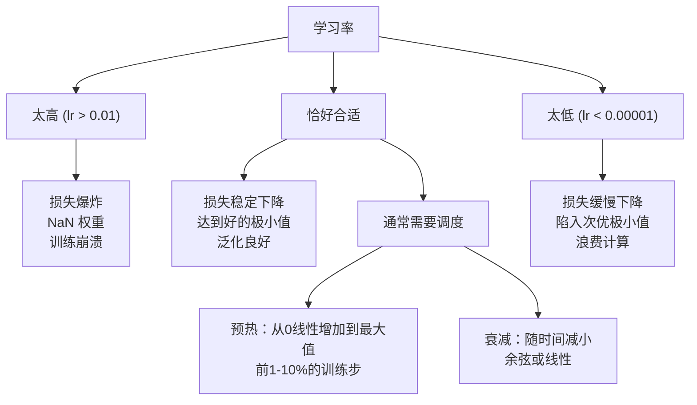
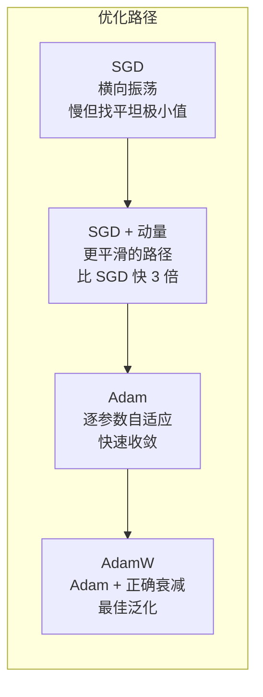
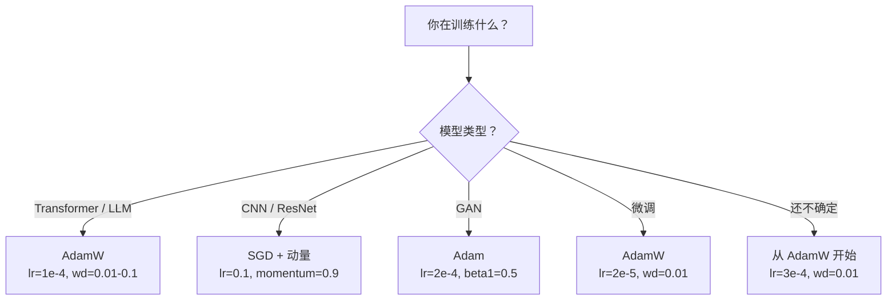

# 优化器

> 梯度下降告诉你往哪个方向走。它对走多远、走多快只字未提。SGD 是指南针。Adam 是带实时路况的 GPS。

**类型：** 构建
**语言：** Python
**前置要求：** 第03.05课（损失函数）
**时长：** ~75 分钟

## 学习目标

- 从零在 Python 中实现 SGD、带动量的 SGD、Adam 和 AdamW 优化器
- 解释 Adam 的偏置校正如何补偿早期训练步骤中零初始化的矩估计
- 在相同任务上证明 AdamW 比 Adam 加 L2 正则化具有更好的泛化能力
- 为 transformer、CNN、GAN 和微调选择合适的优化器和默认超参数

## 问题背景

你计算了梯度，知道权重 #4721 应该减少 0.003 以降低损失。但 0.003 是什么单位？如何缩放？第 1 步和第 1000 步应该移动相同的量吗？

普通梯度下降对每个参数的每一步都应用相同的学习率：w = w - lr * gradient。这在实践中造成了三个使神经网络训练痛苦的问题。

**第一，震荡。** 损失曲面很少是光滑碗形的，更像一个细长的山谷。梯度指向山谷横向（陡峭方向），而非沿山谷（平缓方向）。梯度下降在细窄维度来回弹跳，同时在有用方向几乎没有进展。你见过这种情况：损失快速下降后高原平稳，不是因为模型收敛了，而是因为它在振荡。

**第二，所有参数用同一学习率是错误的。** 有些权重需要大更新（它们还在早期欠拟合阶段），有些需要小更新（它们接近最优值）。适合前者的学习率会毁掉后者，反之亦然。

**第三，鞍点。** 在高维中，损失曲面有大片平坦区域，梯度接近零。普通 SGD 在这些区域以梯度的速度爬行，实际上约等于零。模型看起来卡住了，实际上没有——它在一个平坦区域，另一侧有有用的下降。但 SGD 没有穿越这些区域的机制。

Adam 解决了所有三个问题。它为每个参数维护两个运行平均值——均值梯度（动量，处理震荡）和均值平方梯度（自适应速率，处理不同尺度）。结合早期步骤的偏置校正，它提供了一个用默认超参数就能在 80% 问题上工作的单一优化器。本课从零构建它，让你理解它在另外 20% 的问题上何时以及为何失败。

## 核心概念

### 随机梯度下降（SGD）

最简单的优化器。在小批量数据上计算梯度，向相反方向步进。

```
w = w - lr * gradient
```

"随机"意味着你用数据的随机子集（小批量）来估计梯度，而非全部数据集。这种噪声实际上是有用的——它有助于逃离尖锐的局部极小值。但噪声也导致振荡。

学习率是唯一的旋钮。太高：损失发散。太低：训练永无止境。最优值取决于架构、数据、批大小和当前训练阶段。对于现代网络上的普通 SGD，典型值在 0.01 到 0.1 之间。但即使在单次训练运行中，理想的学习率也会变化。

### 动量（Momentum）

球滚下山坡的比喻被过度使用，但它是准确的。不仅仅依靠梯度步进，而是维护一个积累了过去梯度的速度。

```
m_t = beta * m_{t-1} + gradient
w = w - lr * m_t
```

Beta（通常 0.9）控制保留多少历史。beta = 0.9 时，动量大约是最后 10 个梯度的平均（1 / (1 - 0.9) = 10）。

为什么这能修复振荡：指向同一方向的梯度会积累，翻转方向的梯度会相互抵消。在细长山谷中，"横向"分量每步翻转符号并被衰减，"沿途"分量保持一致并被放大。结果是在有用方向上平滑加速。

实际数字：在条件不佳的损失曲面上，单独的 SGD 可能需要 10000 步，而带动量（beta=0.9）的 SGD 通常只需 3000-5000 步。加速不是微不足道的。

### RMSProp

第一个真正有效的逐参数自适应学习率方法。由 Hinton 在 Coursera 课程中提出（从未正式发表）。

```
s_t = beta * s_{t-1} + (1 - beta) * gradient^2
w = w - lr * gradient / (sqrt(s_t) + epsilon)
```

s_t 追踪梯度平方的运行平均值。梯度始终很大的参数除以一个大数（有效学习率更小）。梯度较小的参数除以一个小数（有效学习率更大）。

这解决了"所有参数用同一学习率"的问题。一直获得大更新的权重可能已接近目标——放慢它。一直获得小更新的权重可能训练不足——加速它。

Epsilon（通常 1e-8）防止当某个参数未被更新时除以零。

### Adam：动量 + RMSProp

Adam 结合了两个思想。它为每个参数维护两个指数移动平均值：

```
m_t = beta1 * m_{t-1} + (1 - beta1) * gradient        （一阶矩：均值）
v_t = beta2 * v_{t-1} + (1 - beta2) * gradient^2       （二阶矩：方差）
```

**偏置校正**是大多数解释跳过的关键细节。在第 1 步时，m_1 = (1 - beta1) * gradient。当 beta1 = 0.9 时，这是 0.1 * gradient——小了十倍。移动平均尚未预热。偏置校正进行补偿：

```
m_hat = m_t / (1 - beta1^t)
v_hat = v_t / (1 - beta2^t)
```

第 1 步，beta1 = 0.9：m_hat = m_1 / (1 - 0.9) = m_1 / 0.1 = 实际梯度。第 100 步：(1 - 0.9^100) 约等于 1.0，校正消失。偏置校正在前约 10 步很重要，约 50 步后无关紧要。

更新：

```
w = w - lr * m_hat / (sqrt(v_hat) + epsilon)
```

Adam 默认值：lr = 0.001，beta1 = 0.9，beta2 = 0.999，epsilon = 1e-8。这些默认值在 80% 的问题上有效。当它们不起效时，先改变 lr，然后是 beta2。几乎不需要改变 beta1 或 epsilon。

### AdamW：正确的权重衰减

L2 正则化将 lambda * w^2 添加到损失中。在普通 SGD 中，这等价于权重衰减（每步从权重中减去 lambda * w）。在 Adam 中，这种等价关系断裂。

Loshchilov 和 Hutter 的洞见：当你将 L2 添加到损失中，Adam 处理梯度时，自适应学习率也缩放了正则化项。梯度方差大的参数获得更少正则化，方差小的参数获得更多。这不是你想要的——你希望无论梯度统计如何，都有均匀的正则化。

AdamW 通过在 Adam 更新后直接对权重应用权重衰减来修复这个问题：

```
w = w - lr * m_hat / (sqrt(v_hat) + epsilon) - lr * lambda * w
```

权重衰减项（lr * lambda * w）不被 Adam 的自适应因子缩放。每个参数获得相同比例的缩减。

这似乎是个小细节，实则不然。AdamW 在几乎所有任务上收敛到比 Adam 加 L2 正则化更好的解。它是 PyTorch 训练 transformer、扩散模型和大多数现代架构的默认优化器。BERT、GPT、LLaMA、Stable Diffusion——都用 AdamW 训练。

### 学习率：最重要的超参数



如果你要调一个超参数，调学习率。学习率 10 倍的变化比你做的任何架构决策影响都大。常见默认值：

- SGD：lr = 0.01 到 0.1
- Adam/AdamW：lr = 1e-4 到 3e-4
- 微调预训练模型：lr = 1e-5 到 5e-5
- 学习率预热：前 1-10% 步骤线性增加

### 优化器对比



### 各优化器的适用场景



## 实现

### 第一步：普通 SGD

```python
class SGD:
    def __init__(self, lr=0.01):
        self.lr = lr

    def step(self, params, grads):
        for i in range(len(params)):
            params[i] -= self.lr * grads[i]
```

### 第二步：带动量的 SGD

```python
class SGDMomentum:
    def __init__(self, lr=0.01, beta=0.9):
        self.lr = lr
        self.beta = beta
        self.velocities = None

    def step(self, params, grads):
        if self.velocities is None:
            self.velocities = [0.0] * len(params)
        for i in range(len(params)):
            self.velocities[i] = self.beta * self.velocities[i] + grads[i]
            params[i] -= self.lr * self.velocities[i]
```

### 第三步：Adam

```python
import math

class Adam:
    def __init__(self, lr=0.001, beta1=0.9, beta2=0.999, epsilon=1e-8):
        self.lr = lr
        self.beta1 = beta1
        self.beta2 = beta2
        self.epsilon = epsilon
        self.m = None
        self.v = None
        self.t = 0

    def step(self, params, grads):
        if self.m is None:
            self.m = [0.0] * len(params)
            self.v = [0.0] * len(params)

        self.t += 1

        for i in range(len(params)):
            self.m[i] = self.beta1 * self.m[i] + (1 - self.beta1) * grads[i]
            self.v[i] = self.beta2 * self.v[i] + (1 - self.beta2) * grads[i] ** 2

            m_hat = self.m[i] / (1 - self.beta1 ** self.t)
            v_hat = self.v[i] / (1 - self.beta2 ** self.t)

            params[i] -= self.lr * m_hat / (math.sqrt(v_hat) + self.epsilon)
```

### 第四步：AdamW

```python
class AdamW:
    def __init__(self, lr=0.001, beta1=0.9, beta2=0.999, epsilon=1e-8, weight_decay=0.01):
        self.lr = lr
        self.beta1 = beta1
        self.beta2 = beta2
        self.epsilon = epsilon
        self.weight_decay = weight_decay
        self.m = None
        self.v = None
        self.t = 0

    def step(self, params, grads):
        if self.m is None:
            self.m = [0.0] * len(params)
            self.v = [0.0] * len(params)

        self.t += 1

        for i in range(len(params)):
            self.m[i] = self.beta1 * self.m[i] + (1 - self.beta1) * grads[i]
            self.v[i] = self.beta2 * self.v[i] + (1 - self.beta2) * grads[i] ** 2

            m_hat = self.m[i] / (1 - self.beta1 ** self.t)
            v_hat = self.v[i] / (1 - self.beta2 ** self.t)

            params[i] -= self.lr * m_hat / (math.sqrt(v_hat) + self.epsilon)
            params[i] -= self.lr * self.weight_decay * params[i]
```

### 第五步：训练对比

用所有四种优化器在第 05 课的圆形数据集上训练相同的两层网络，比较收敛情况。

```python
import random

def sigmoid(x):
    x = max(-500, min(500, x))
    return 1.0 / (1.0 + math.exp(-x))

def make_circle_data(n=200, seed=42):
    random.seed(seed)
    data = []
    for _ in range(n):
        x = random.uniform(-2, 2)
        y = random.uniform(-2, 2)
        label = 1.0 if x * x + y * y < 1.5 else 0.0
        data.append(([x, y], label))
    return data


class OptimizerTestNetwork:
    def __init__(self, optimizer, hidden_size=8):
        random.seed(0)
        self.hidden_size = hidden_size
        self.optimizer = optimizer

        self.w1 = [[random.gauss(0, 0.5) for _ in range(2)] for _ in range(hidden_size)]
        self.b1 = [0.0] * hidden_size
        self.w2 = [random.gauss(0, 0.5) for _ in range(hidden_size)]
        self.b2 = 0.0

    def get_params(self):
        params = []
        for row in self.w1:
            params.extend(row)
        params.extend(self.b1)
        params.extend(self.w2)
        params.append(self.b2)
        return params

    def set_params(self, params):
        idx = 0
        for i in range(self.hidden_size):
            for j in range(2):
                self.w1[i][j] = params[idx]
                idx += 1
        for i in range(self.hidden_size):
            self.b1[i] = params[idx]
            idx += 1
        for i in range(self.hidden_size):
            self.w2[i] = params[idx]
            idx += 1
        self.b2 = params[idx]

    def forward(self, x):
        self.x = x
        self.z1 = []
        self.h = []
        for i in range(self.hidden_size):
            z = self.w1[i][0] * x[0] + self.w1[i][1] * x[1] + self.b1[i]
            self.z1.append(z)
            self.h.append(max(0.0, z))

        self.z2 = sum(self.w2[i] * self.h[i] for i in range(self.hidden_size)) + self.b2
        self.out = sigmoid(self.z2)
        return self.out

    def compute_grads(self, target):
        eps = 1e-15
        p = max(eps, min(1 - eps, self.out))
        d_loss = -(target / p) + (1 - target) / (1 - p)
        d_sigmoid = self.out * (1 - self.out)
        d_out = d_loss * d_sigmoid

        grads = [0.0] * (self.hidden_size * 2 + self.hidden_size + self.hidden_size + 1)
        idx = 0
        for i in range(self.hidden_size):
            d_relu = 1.0 if self.z1[i] > 0 else 0.0
            d_h = d_out * self.w2[i] * d_relu
            grads[idx] = d_h * self.x[0]
            grads[idx + 1] = d_h * self.x[1]
            idx += 2

        for i in range(self.hidden_size):
            d_relu = 1.0 if self.z1[i] > 0 else 0.0
            grads[idx] = d_out * self.w2[i] * d_relu
            idx += 1

        for i in range(self.hidden_size):
            grads[idx] = d_out * self.h[i]
            idx += 1

        grads[idx] = d_out
        return grads

    def train(self, data, epochs=300):
        losses = []
        for epoch in range(epochs):
            total_loss = 0.0
            correct = 0
            for x, y in data:
                pred = self.forward(x)
                grads = self.compute_grads(y)
                params = self.get_params()
                self.optimizer.step(params, grads)
                self.set_params(params)

                eps = 1e-15
                p = max(eps, min(1 - eps, pred))
                total_loss += -(y * math.log(p) + (1 - y) * math.log(1 - p))
                if (pred >= 0.5) == (y >= 0.5):
                    correct += 1
            avg_loss = total_loss / len(data)
            accuracy = correct / len(data) * 100
            losses.append((avg_loss, accuracy))
            if epoch % 75 == 0 or epoch == epochs - 1:
                print(f"    Epoch {epoch:3d}: loss={avg_loss:.4f}, accuracy={accuracy:.1f}%")
        return losses
```

## 工程应用

PyTorch 优化器处理参数组、梯度裁剪和学习率调度：

```python
import torch
import torch.optim as optim

model = torch.nn.Sequential(
    torch.nn.Linear(784, 256),
    torch.nn.ReLU(),
    torch.nn.Linear(256, 10),
)

optimizer = optim.AdamW(model.parameters(), lr=3e-4, weight_decay=0.01)

scheduler = optim.lr_scheduler.CosineAnnealingLR(optimizer, T_max=100)

for epoch in range(100):
    optimizer.zero_grad()
    output = model(torch.randn(32, 784))
    loss = torch.nn.functional.cross_entropy(output, torch.randint(0, 10, (32,)))
    loss.backward()
    torch.nn.utils.clip_grad_norm_(model.parameters(), max_norm=1.0)
    optimizer.step()
    scheduler.step()
```

这个模式始终是：zero_grad、forward、loss、backward、（clip）、step、（schedule）。记住这个顺序。搞错（例如在 optimizer.step() 之前调用 scheduler.step()）是常见的微妙 bug 来源。

对于 CNN，许多从业者仍然偏好带动量的 SGD（lr=0.1，momentum=0.9，weight_decay=1e-4）加步进或余弦调度。SGD 找到更平坦的极小值，这通常泛化更好。对于 transformer 和 LLM，带预热和余弦衰减的 AdamW 是通用默认值。没有量化的理由，不要违背这个共识。

## 交付物

本课产出：
- `outputs/prompt-optimizer-selector.md` — 为任何架构选择正确优化器和学习率的决策提示

## 练习

1. 实现 Nesterov 动量：在"预看"位置（w - lr * beta * v）而非当前位置计算梯度。在圆形数据集上与标准动量比较收敛情况。

2. 实现学习率预热调度：前 10% 训练步从 0 线性增加到 max_lr，然后余弦衰减到 0。比较 Adam + 预热和不带预热的 Adam，测量在圆形数据集上达到 90% 准确率需要多少 epoch。

3. 在 Adam 训练过程中追踪每个参数的有效学习率。有效速率为 lr * m_hat / (sqrt(v_hat) + eps)。绘制 10、50 和 200 步后有效速率的分布。所有参数的更新速度相同吗？

4. 实现梯度裁剪（按全局范数裁剪），最大梯度范数设为 1.0。用高学习率（Adam 的 lr=0.01）进行有无裁剪的训练。统计在 10 个随机种子中，有无裁剪各有多少次运行发散（损失变为 NaN）。

5. 在大权重网络上比较 Adam 和 AdamW。将所有权重初始化为 [-5, 5] 中的随机值（远大于正常范围）。用 weight_decay=0.1 训练 200 个 epoch。绘制两种优化器训练过程中权重的 L2 范数。AdamW 应该显示更快的权重缩减。

## 关键术语

| 术语 | 人们怎么说 | 实际含义 |
|------|-----------|---------|
| 学习率（Learning rate） | "步长" | 梯度更新的标量乘数；训练中最具影响力的单一超参数 |
| SGD | "基础梯度下降" | 随机梯度下降：通过减去 lr * gradient 更新权重，梯度在小批量上计算 |
| 动量（Momentum） | "滚球比喻" | 过去梯度的指数移动平均；抑制振荡，在一致方向上加速 |
| RMSProp | "自适应学习率" | 每个参数的梯度除以其近期梯度的均方根；均衡学习率 |
| Adam | "默认优化器" | 结合动量（一阶矩）和 RMSProp（二阶矩），带有初始步骤的偏置校正 |
| AdamW | "做对了的 Adam" | 带解耦权重衰减的 Adam；直接将正则化应用于权重，而非通过梯度 |
| 偏置校正（Bias correction） | "运行平均的预热" | 除以 (1 - beta^t) 补偿 Adam 矩估计的零初始化 |
| 权重衰减（Weight decay） | "缩减权重" | 每步从权重值中减去一个分数；惩罚大权重的正则化器 |
| 学习率调度（Learning rate schedule） | "随时间改变 lr" | 训练期间调整学习率的函数；预热 + 余弦衰减是现代默认值 |
| 梯度裁剪（Gradient clipping） | "截断梯度范数" | 当梯度向量范数超过阈值时将其缩小；防止梯度爆炸更新 |

## 延伸阅读

- Kingma & Ba，"Adam: A Method for Stochastic Optimization"（2014）——带收敛分析和偏置校正推导的原始 Adam 论文
- Loshchilov & Hutter，"Decoupled Weight Decay Regularization"（2017）——证明 L2 正则化和权重衰减在 Adam 中不等价，并提出了 AdamW
- Smith，"Cyclical Learning Rates for Training Neural Networks"（2017）——引入 LR 范围测试和循环调度，消除了调整固定学习率的需要
- Ruder，"An Overview of Gradient Descent Optimization Algorithms"（2016）——所有优化器变体的最佳单一综述，带清晰的比较和直觉
