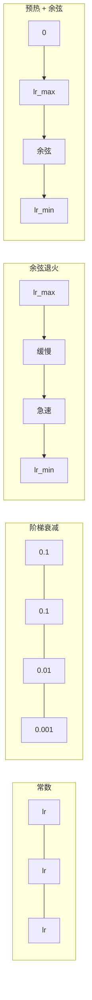
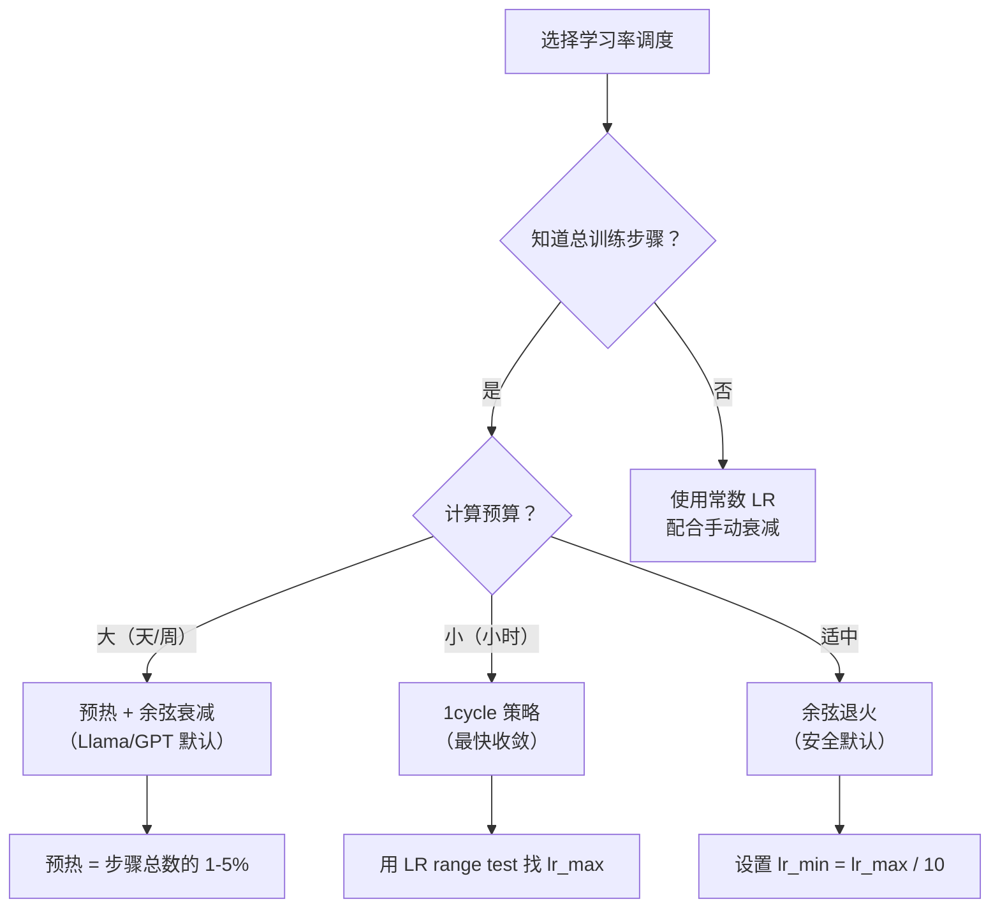
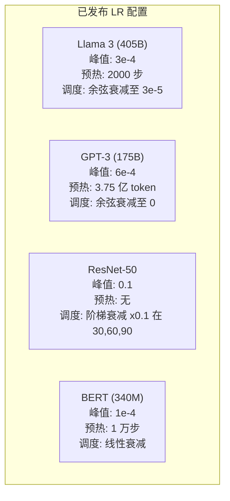

# 学习率调度与预热

> 学习率是最重要的超参数。不是架构，不是数据集大小，不是激活函数。是学习率。如果你只调整一个参数，就调整这个。

**类型：** 构建
**语言：** Python
**前置知识：** 课程 03.06（优化器）、课程 03.08（权重初始化）
**时间：** ~90 分钟

## 学习目标

- 从零实现常数、阶梯衰减、余弦退火、预热+余弦、1cycle 五种学习率调度
- 展示学习率选择的三种失败模式：发散（过高）、停滞（过低）和振荡（无衰减）
- 解释为什么 Adam 类优化器需要预热，以及它如何稳定早期训练
- 在同一任务上比较所有五种调度的收敛速度，并针对给定训练预算选择合适的调度

## 问题所在

将学习率设为 0.1，训练发散——损失在 3 步内跳至无穷。设为 0.0001，训练爬行——100 轮后模型几乎没有从随机状态移动。设为 0.01，训练在前 50 轮有效，然后损失在最小值附近振荡，因为步长太大而永远无法到达那里。

最优学习率不是常数。它在训练过程中变化。早期你希望大步快速覆盖范围，训练后期你希望小步沉入一个尖锐的最小值。90% 准确率和 95% 准确率的模型之间，差异往往只是调度策略。

过去三年发布的每个主要模型都使用了学习率调度。Llama 3 使用峰值 lr=3e-4，2000 步预热，余弦衰减至 3e-5。GPT-3 使用 lr=6e-4，在 3.75 亿 token 上进行预热。这些不是随意的选择，而是耗资数百万美元进行大量超参数搜索的结果。

你需要理解调度，因为默认值不适用于你的问题。微调预训练模型时，正确的调度与从头训练不同。增大批量时，预热周期需要改变。训练在步骤 10,000 时中断，你需要知道这是调度问题还是其他问题。

## 概念

### 常数学习率（Constant Learning Rate）

最简单的方法。选定一个数，每步都用它。

```
lr(t) = lr_0
```

很少是最优的。对训练末期来说太高（在最小值附近振荡），对训练开始时来说太低（在细小步骤上浪费算力）。对小模型和调试有效，对任何训练超过一小时的任务来说是糟糕的选择。

### 阶梯衰减（Step Decay）

ResNet 时代的老派方法。在固定轮次以某个因子（通常 10 倍）削减学习率。

```
lr(t) = lr_0 * gamma^(floor(epoch / step_size))
```

其中 gamma = 0.1，step_size = 30 表示：lr 每 30 轮下降 10 倍。ResNet-50 使用了这种方法——lr=0.1，在第 30、60、90 轮时下降 10 倍。

问题：最优衰减点取决于数据集和架构。换一个不同的问题就需要重新调整何时衰减。过渡是突兀的——当速率突然变化时损失可能激增。

### 余弦退火（Cosine Annealing）

从最大学习率平滑衰减至最小值，遵循余弦曲线：

```
lr(t) = lr_min + 0.5 * (lr_max - lr_min) * (1 + cos(pi * t / T))
```

其中 t 是当前步骤，T 是总步骤数。

t=0 时，余弦项为 1，所以 lr = lr_max。t=T 时，余弦项为 -1，所以 lr = lr_min。衰减在开始时平缓，中间加速，接近末尾再次平缓。

这是大多数现代训练的默认选择。除 lr_max 和 lr_min 外无需调整其他超参数。余弦形状符合经验观察——大部分学习发生在训练中段，你希望在这个关键时期有合理的步长。

### 预热：为什么从小开始

Adam 和其他自适应优化器维护梯度均值和方差的运行估计值。在步骤 0，这些估计值被初始化为零。最初几次梯度更新基于错误的统计。如果在此期间学习率很大，模型会迈出巨大而方向错误的步伐。

预热（Warmup）解决了这个问题。从极小的学习率（通常是 lr_max / warmup_steps 甚至为零）开始，在前 N 步线性增长至 lr_max。当达到完整学习率时，Adam 的统计数据已经稳定。

```
lr(t) = lr_max * (t / warmup_steps)     对于 t < warmup_steps
```

典型预热：总训练步骤的 1-5%。Llama 3 训练了约 1.8 万亿 token，预热了 2000 步。GPT-3 在 3.75 亿 token 上进行了预热。

### 线性预热 + 余弦衰减（Linear Warmup + Cosine Decay）

现代默认方案。线性增长，然后余弦衰减：

```
if t < warmup_steps:
    lr(t) = lr_max * (t / warmup_steps)
else:
    progress = (t - warmup_steps) / (total_steps - warmup_steps)
    lr(t) = lr_min + 0.5 * (lr_max - lr_min) * (1 + cos(pi * progress))
```

这是 Llama、GPT、PaLM 和大多数现代 transformer 使用的方案。预热防止早期不稳定，余弦衰减让模型沉入一个好的最小值。

### 1cycle 策略（1cycle Policy）

Leslie Smith 的发现（2018）：在训练前半段将学习率从低值增加至高值，然后在后半段回落。违反直觉——为什么要在训练中途*提高*学习率？

理论：高学习率通过在优化轨迹中添加噪声来充当正则化。模型在上升阶段探索更多损失景观，找到更好的吸引子。下降阶段然后在找到的最佳吸引子内精化。

```
阶段 1（0 到 T/2）：lr 从 lr_max/25 升至 lr_max
阶段 2（T/2 到 T）：lr 从 lr_max 降至 lr_max/10000
```

在固定计算预算下，1cycle 通常比余弦退火收敛更快。权衡：你必须提前知道总步骤数。

### 调度形状



### 决策流程图



### 已发布模型的真实数据



## 构建

### 步骤 1：调度函数

每个函数接收当前步骤并返回该步骤的学习率。

```python
import math


def constant_schedule(step, lr=0.01, **kwargs):
    return lr


def step_decay_schedule(step, lr=0.1, step_size=100, gamma=0.1, **kwargs):
    return lr * (gamma ** (step // step_size))


def cosine_schedule(step, lr=0.01, total_steps=1000, lr_min=1e-5, **kwargs):
    if step >= total_steps:
        return lr_min
    return lr_min + 0.5 * (lr - lr_min) * (1 + math.cos(math.pi * step / total_steps))


def warmup_cosine_schedule(step, lr=0.01, total_steps=1000, warmup_steps=100, lr_min=1e-5, **kwargs):
    if total_steps <= warmup_steps:
        return lr * (step / max(warmup_steps, 1))
    if step < warmup_steps:
        return lr * step / warmup_steps
    progress = (step - warmup_steps) / (total_steps - warmup_steps)
    return lr_min + 0.5 * (lr - lr_min) * (1 + math.cos(math.pi * progress))


def one_cycle_schedule(step, lr=0.01, total_steps=1000, **kwargs):
    mid = max(total_steps // 2, 1)
    if step < mid:
        return (lr / 25) + (lr - lr / 25) * step / mid
    else:
        progress = (step - mid) / max(total_steps - mid, 1)
        return lr * (1 - progress) + (lr / 10000) * progress
```

### 步骤 2：可视化所有调度

打印基于文本的图表，展示每种调度在训练过程中的演变。

```python
def visualize_schedule(name, schedule_fn, total_steps=500, **kwargs):
    steps = list(range(0, total_steps, total_steps // 20))
    if total_steps - 1 not in steps:
        steps.append(total_steps - 1)

    lrs = [schedule_fn(s, total_steps=total_steps, **kwargs) for s in steps]
    max_lr = max(lrs) if max(lrs) > 0 else 1.0

    print(f"\n{name}:")
    for s, lr_val in zip(steps, lrs):
        bar_len = int(lr_val / max_lr * 40)
        bar = "#" * bar_len
        print(f"  Step {s:4d}: lr={lr_val:.6f} {bar}")
```

### 步骤 3：训练网络

在圆形数据集上训练简单的两层网络（与前几课相同），但现在我们变换调度策略。

```python
import random


def sigmoid(x):
    x = max(-500, min(500, x))
    return 1.0 / (1.0 + math.exp(-x))


def relu(x):
    return max(0.0, x)


def relu_deriv(x):
    return 1.0 if x > 0 else 0.0


def make_circle_data(n=200, seed=42):
    random.seed(seed)
    data = []
    for _ in range(n):
        x = random.uniform(-2, 2)
        y = random.uniform(-2, 2)
        label = 1.0 if x * x + y * y < 1.5 else 0.0
        data.append(([x, y], label))
    return data


def train_with_schedule(schedule_fn, schedule_name, data, epochs=300, base_lr=0.05, **kwargs):
    random.seed(0)
    hidden_size = 8
    total_steps = epochs * len(data)

    std = math.sqrt(2.0 / 2)
    w1 = [[random.gauss(0, std) for _ in range(2)] for _ in range(hidden_size)]
    b1 = [0.0] * hidden_size
    w2 = [random.gauss(0, std) for _ in range(hidden_size)]
    b2 = 0.0

    step = 0
    epoch_losses = []

    for epoch in range(epochs):
        total_loss = 0
        correct = 0

        for x, target in data:
            lr = schedule_fn(step, lr=base_lr, total_steps=total_steps, **kwargs)

            z1 = []
            h = []
            for i in range(hidden_size):
                z = w1[i][0] * x[0] + w1[i][1] * x[1] + b1[i]
                z1.append(z)
                h.append(relu(z))

            z2 = sum(w2[i] * h[i] for i in range(hidden_size)) + b2
            out = sigmoid(z2)

            error = out - target
            d_out = error * out * (1 - out)

            for i in range(hidden_size):
                d_h = d_out * w2[i] * relu_deriv(z1[i])
                w2[i] -= lr * d_out * h[i]
                for j in range(2):
                    w1[i][j] -= lr * d_h * x[j]
                b1[i] -= lr * d_h
            b2 -= lr * d_out

            total_loss += (out - target) ** 2
            if (out >= 0.5) == (target >= 0.5):
                correct += 1
            step += 1

        avg_loss = total_loss / len(data)
        accuracy = correct / len(data) * 100
        epoch_losses.append(avg_loss)

    return epoch_losses
```

### 步骤 4：比较所有调度

用每种调度训练同一网络，比较最终损失和收敛行为。

```python
def compare_schedules(data):
    configs = [
        ("Constant", constant_schedule, {}),
        ("Step Decay", step_decay_schedule, {"step_size": 15000, "gamma": 0.1}),
        ("Cosine", cosine_schedule, {"lr_min": 1e-5}),
        ("Warmup+Cosine", warmup_cosine_schedule, {"warmup_steps": 3000, "lr_min": 1e-5}),
        ("1cycle", one_cycle_schedule, {}),
    ]

    print(f"\n{'Schedule':<20} {'Start Loss':>12} {'Mid Loss':>12} {'End Loss':>12} {'Best Loss':>12}")
    print("-" * 70)

    for name, schedule_fn, extra_kwargs in configs:
        losses = train_with_schedule(schedule_fn, name, data, epochs=300, base_lr=0.05, **extra_kwargs)
        mid_idx = len(losses) // 2
        best = min(losses)
        print(f"{name:<20} {losses[0]:>12.6f} {losses[mid_idx]:>12.6f} {losses[-1]:>12.6f} {best:>12.6f}")
```

### 步骤 5：学习率过高 vs 过低

演示三种失败模式：过高（发散）、过低（爬行）和恰到好处。

```python
def lr_sensitivity(data):
    learning_rates = [1.0, 0.1, 0.01, 0.001, 0.0001]

    print("\nLR Sensitivity (constant schedule, 100 epochs):")
    print(f"  {'LR':>10} {'Start Loss':>12} {'End Loss':>12} {'Status':>15}")
    print("  " + "-" * 52)

    for lr in learning_rates:
        losses = train_with_schedule(constant_schedule, f"lr={lr}", data, epochs=100, base_lr=lr)
        start = losses[0]
        end = losses[-1]

        if end > start or math.isnan(end) or end > 1.0:
            status = "DIVERGED"
        elif end > start * 0.9:
            status = "BARELY MOVED"
        elif end < 0.15:
            status = "CONVERGED"
        else:
            status = "LEARNING"

        end_str = f"{end:.6f}" if not math.isnan(end) else "NaN"
        print(f"  {lr:>10.4f} {start:>12.6f} {end_str:>12} {status:>15}")
```

## 实际应用

PyTorch 在 `torch.optim.lr_scheduler` 中提供了调度器：

```python
import torch
import torch.optim as optim
from torch.optim.lr_scheduler import CosineAnnealingLR, OneCycleLR, StepLR

model = nn.Sequential(nn.Linear(10, 64), nn.ReLU(), nn.Linear(64, 1))
optimizer = optim.Adam(model.parameters(), lr=3e-4)

scheduler = CosineAnnealingLR(optimizer, T_max=1000, eta_min=1e-5)

for step in range(1000):
    loss = train_step(model, optimizer)
    scheduler.step()
```

对于预热 + 余弦，使用 lambda 调度器或 HuggingFace 的 `get_cosine_schedule_with_warmup`：

```python
from transformers import get_cosine_schedule_with_warmup

scheduler = get_cosine_schedule_with_warmup(
    optimizer,
    num_warmup_steps=2000,
    num_training_steps=100000,
)
```

HuggingFace 函数是大多数 Llama 和 GPT 微调脚本使用的。如有疑问，使用预热 + 余弦，预热 = 总步骤的 3-5%。它几乎适用于所有情况。

## 交付物

本课程产出：
- `outputs/prompt-lr-schedule-advisor.md`——一个根据你的训练设置推荐正确学习率调度和超参数的提示词

## 练习

1. 实现指数衰减：lr(t) = lr_0 * gamma^t，其中 gamma = 0.999。与圆形数据集上的余弦退火进行比较。

2. 实现学习率范围测试（Leslie Smith）：训练几百步，同时从 1e-7 到 1 指数递增 LR。绘制损失 vs LR 图。最优最大 LR 就在损失开始增加之前。

3. 使用预热 + 余弦训练，但改变预热长度：总步骤的 0%、1%、5%、10%、20%。找到训练最稳定的最佳比例。

4. 实现带热重启的余弦退火（SGDR）：每 T 步将学习率重置为 lr_max 并再次衰减。与标准余弦在更长训练运行上进行比较。

5. 构建一个"调度医生"，它监控训练损失，当损失稳定时自动从预热切换到余弦，并在损失长期停滞时降低 lr。

## 关键术语

| 术语 | 人们怎么说 | 实际含义 |
|------|------------|---------|
| 学习率（Learning rate） | "模型学习的速度" | 与梯度相乘以确定参数更新大小的标量 |
| 调度（Schedule） | "随时间改变 LR" | 将训练步骤映射到学习率的函数，旨在优化收敛 |
| 预热（Warmup） | "从小 LR 开始" | 在前 N 步将 LR 从接近零线性增加到目标值，以稳定优化器统计 |
| 余弦退火（Cosine annealing） | "平滑 LR 衰减" | 在训练过程中沿余弦曲线将 LR 从 lr_max 降至 lr_min |
| 阶梯衰减（Step decay） | "在里程碑处降低 LR" | 在固定轮次间隔将 LR 乘以某个因子（通常 0.1） |
| 1cycle 策略（1cycle policy） | "先升后降" | Leslie Smith 的方法：在单个周期内将 LR 先升后降以加速收敛 |
| LR 范围测试（LR range test） | "找到最佳学习率" | 在短暂增加 LR 期间训练，找到损失开始发散的值 |
| 带热重启的余弦（Cosine with warm restarts） | "重置并重复" | 定期将 LR 重置为 lr_max 并再次衰减（SGDR） |
| Eta min | "LR 的下限" | 调度衰减到的最小学习率 |
| 峰值学习率（Peak learning rate） | "最大 LR" | 训练期间达到的最高 LR，通常在预热之后 |

## 延伸阅读

- Loshchilov & Hutter，"SGDR: Stochastic Gradient Descent with Warm Restarts"（2017）——引入了余弦退火和热重启
- Smith，"Super-Convergence: Very Fast Training of Neural Networks Using Large Learning Rates"（2018）——1cycle 策略论文
- Touvron et al.，"Llama 2: Open Foundation and Fine-Tuned Chat Models"（2023）——记录了大规模使用的预热 + 余弦调度
- Goyal et al.，"Accurate, Large Minibatch SGD: Training ImageNet in 1 Hour"（2017）——大批量训练的线性缩放规则和预热
