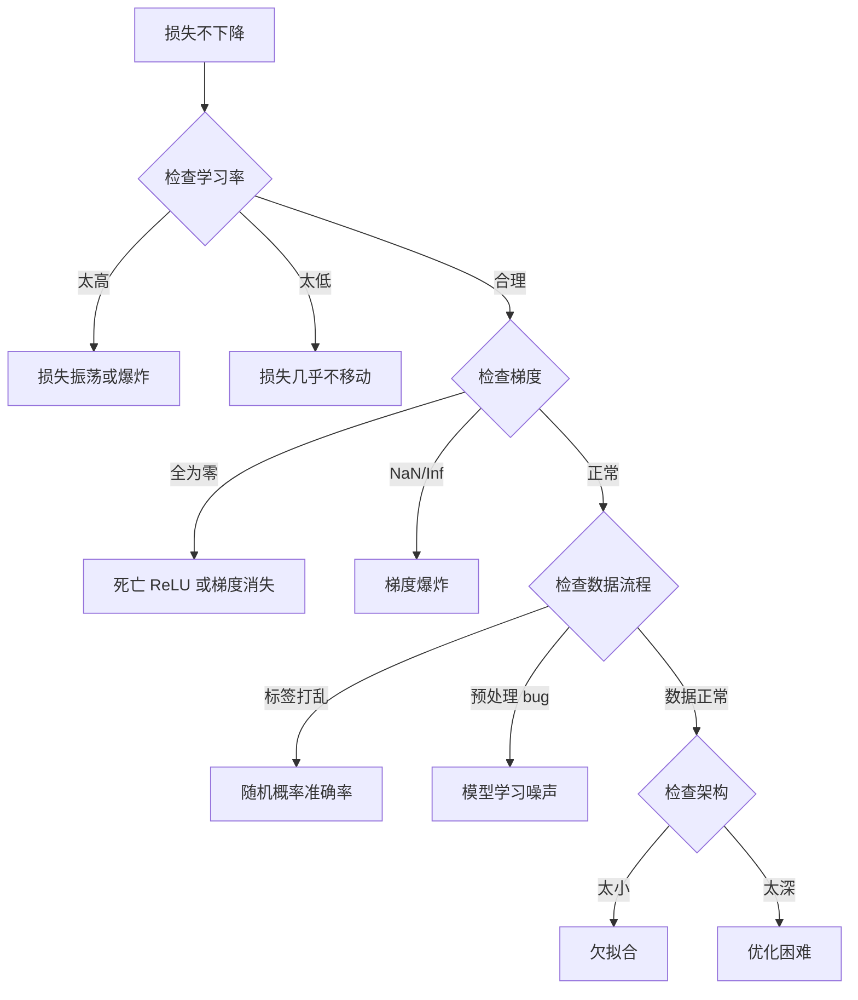
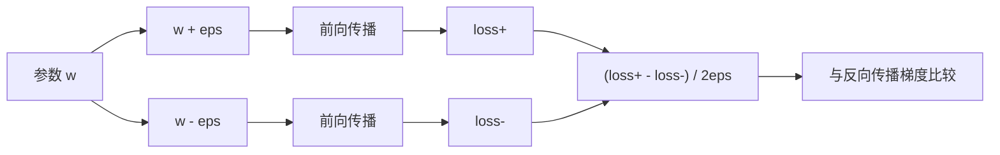
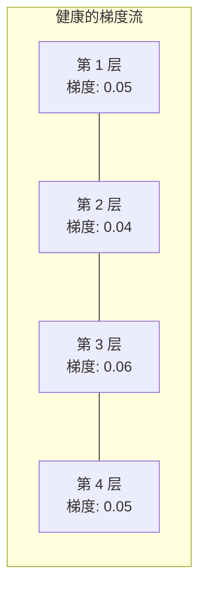
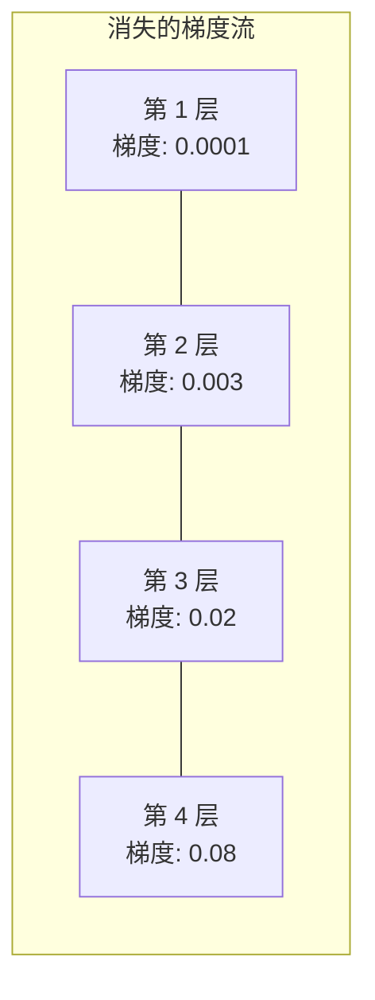
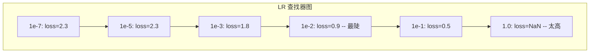

# 调试神经网络

> 你的网络编译了，运行了，产生了一个数字。这个数字是错的，但没有任何崩溃。欢迎来到最难的那种调试——没有错误消息的那种。

**类型：** 实践
**语言：** Python, PyTorch
**前置知识：** Phase 03 课程 01-10（尤其是反向传播、损失函数、优化器）
**时间：** ~90 分钟

## 学习目标

- 使用系统性调试策略诊断常见的神经网络故障（NaN 损失、平坦损失曲线、过拟合、振荡）
- 应用"用一个批次过拟合"技术来验证你的模型架构和训练循环是否正确
- 检查梯度幅度、激活分布和权重范数，识别梯度消失/爆炸问题
- 构建涵盖数据流程、模型架构、损失函数、优化器和学习率问题的调试清单

## 问题所在

传统软件在出错时会崩溃。空指针会抛出异常，类型不匹配在编译时失败，差一错误会产生明显错误的输出。

神经网络不给你这种奢侈。

一个损坏的神经网络会运行到完成，打印一个损失值，并输出预测。损失可能在下降。预测可能看起来合理。但模型悄悄地在犯错——学习捷径，记忆噪声，或收敛到无用的局部最小值。Google 研究人员估计，60-70% 的机器学习调试时间花在"静默"bug 上——这些 bug 不产生错误但会降低模型质量。

工作模型和损坏模型之间的差异往往只是一行代码的位置：缺少 `zero_grad()`、转置的维度、相差 10 倍的学习率。经典的"训练神经网络的诀窍"（2019）开篇就说："最常见的神经网络错误是不崩溃的 bug。"

本课程教你找到这些 bug。

## 概念

### 调试思维方式

忘掉打印然后祈祷式的调试方式。神经网络调试需要系统性方法，因为反馈循环很慢（每次训练运行需要几分钟到几小时），症状也含糊（坏损失可能意味着 20 种不同的事情）。

黄金法则：**从简单开始，一次添加一个复杂性，并独立验证每个部分。**



### 症状 1：损失不下降

这是最常见的问题。训练循环运行，epoch 走过，但损失保持不动或剧烈振荡。

**学习率错误。** 太高：损失振荡或跳到 NaN。太低：损失下降得如此缓慢以至于看起来是平的。对于 Adam，从 1e-3 开始；对于 SGD，从 1e-1 或 1e-2 开始。在得出其他结论之前，始终尝试跨越 10 倍的 3 个学习率（例如 1e-2、1e-3、1e-4）。

**死亡 ReLU。** 如果一个 ReLU 神经元接受到大的负输入，它输出 0 并且梯度为 0。它再也不会激活了。如果足够多的神经元死亡，网络就无法学习。检查方法：在每个 ReLU 层之后打印激活值中恰好为 0 的比例。如果 >50% 是死的，切换到 LeakyReLU 或降低学习率。

**梯度消失。** 在使用 sigmoid 或 tanh 激活的深层网络中，梯度在反向传播时以指数方式缩小。到达第一层时，它们约为 0。前几层停止学习。修复：使用 ReLU/GELU，添加残差连接，或使用批归一化。

**梯度爆炸。** 相反的问题——梯度以指数方式增长。在 RNN 和非常深的网络中很常见。损失跳到 NaN。修复：梯度裁剪（`torch.nn.utils.clip_grad_norm_`）、降低学习率，或添加归一化。

### 症状 2：损失下降但模型很差

损失在下降。训练准确率达到 99%。但测试准确率是 55%。或者模型在真实数据上产生无意义的输出。

**过拟合。** 模型记忆训练数据而非学习模式。训练和验证损失之间的差距随时间增长。修复：更多数据、dropout、权重衰减、早停、数据增强。

**数据泄漏。** 测试数据泄漏到训练中。准确率高得可疑。常见原因：分割前打乱、使用完整数据集统计进行预处理、不同分割之间有重复样本。修复：先分割，再预处理，检查重复。

**标签错误。** 大多数真实数据集中 5-10% 的标签是错误的（Northcutt et al., 2021——"测试集中普遍存在的标签错误"）。模型学习噪声。修复：使用置信学习找到并修复错误标注的样本，或使用损失截断忽略高损失样本。

### 症状 3：损失中的 NaN 或 Inf

损失值变为 `nan` 或 `inf`。训练死了。

**学习率太高。** 梯度更新大幅越过，权重爆炸。修复：减少 10 倍。

**log(0) 或 log(负数)。** 交叉熵损失计算 `log(p)`。如果你的模型输出恰好 0 或负概率，log 会爆炸。修复：将预测限制在 `[eps, 1-eps]`，其中 `eps=1e-7`。

**除以零。** 批归一化除以标准差。值为常数的批次的 std=0。修复：在分母中添加 epsilon（PyTorch 默认这样做，但自定义实现可能不）。

**数值溢出。** 大的激活值喂给 `exp()` 会产生 Inf。Softmax 特别容易出现这个问题。修复：指数化之前减去最大值（log-sum-exp 技巧）。

### 技术 1：梯度检验

将你的解析梯度（来自反向传播）与数值梯度（来自有限差分）比较。如果它们不一致，你的反向传播有 bug。

参数 `w` 的数值梯度：

```
grad_numerical = (loss(w + eps) - loss(w - eps)) / (2 * eps)
```

一致性指标（相对差异）：

```
rel_diff = |grad_analytical - grad_numerical| / max(|grad_analytical|, |grad_numerical|, 1e-8)
```

如果 `rel_diff < 1e-5`：正确。如果 `rel_diff > 1e-3`：几乎肯定有 bug。



### 技术 2：激活统计

在训练期间监控每层之后激活值的均值和标准差。健康网络保持激活值均值接近 0，标准差接近 1（归一化后）或至少有界。

| 健康指标 | 均值 | 标准差 | 诊断 |
|---------|------|-------|------|
| 健康 | ~0 | ~1 | 网络正常学习 |
| 饱和 | >>0 或 <<0 | ~0 | 激活值卡在极端值 |
| 死亡 | 0 | 0 | 神经元死亡（全为零） |
| 爆炸 | >>10 | >>10 | 激活值无界增长 |

### 技术 3：梯度流可视化

绘制每层的平均梯度幅度。在健康网络中，各层的梯度幅度应该大致相似。如果早期层的梯度比后期层小 1000 倍，你有梯度消失问题。





### 技术 4：用一个批次过拟合测试

深度学习中最重要的单一调试技术。

取一个小批次（8-32 个样本）。在它上面训练 100+ 次迭代。损失应该接近零，训练准确率应该达到 100%。如果不是，你的模型或训练循环有根本性的 bug——不要继续全量训练。

这个测试能抓住：
- 损坏的损失函数
- 损坏的反向传播
- 架构太小无法表示数据
- 优化器未连接到模型参数
- 数据和标签未对齐

这需要 30 秒运行，能节省数小时的全量训练调试。

### 技术 5：学习率查找器

Leslie Smith（2017）提出在一个 epoch 内将学习率从极小（1e-7）扫到极大（10），同时记录损失。绘制损失 vs 学习率图。最优学习率大约是损失开始最快下降处的 10 倍小。



此例中最佳 LR：~1e-3（最陡点前一个数量级）。

### 常见 PyTorch Bug

这些是 PyTorch 社区集体浪费时间最多的 bug：

| Bug | 症状 | 修复 |
|-----|------|------|
| 忘记 `optimizer.zero_grad()` | 梯度跨批次积累，损失振荡 | 在 `loss.backward()` 之前添加 `optimizer.zero_grad()` |
| 测试时忘记 `model.eval()` | Dropout 和批归一化行为不同，测试准确率在各次运行间变化 | 添加 `model.eval()` 和 `torch.no_grad()` |
| 错误的张量形状 | 静默广播产生错误结果，无报错 | 调试时在每次操作后打印形状 |
| CPU/GPU 不匹配 | `RuntimeError: expected CUDA tensor` | 对模型和数据都使用 `.to(device)` |
| 不分离张量 | 计算图永远增长，OOM | 使用 `.detach()` 或 `with torch.no_grad()` |
| 原地操作破坏 autograd | `RuntimeError: modified by in-place operation` | 将 `x += 1` 替换为 `x = x + 1` |
| 数据未归一化 | 损失卡在随机概率水平 | 将输入归一化到均值=0，标准差=1 |
| 标签是错误的数据类型 | 交叉熵期望 `Long`，得到 `Float` | 转换标签：`labels.long()` |

### 主调试表

| 症状 | 可能原因 | 首先尝试 |
|------|---------|---------|
| 损失卡在 -log(1/类别数) | 模型预测均匀分布 | 检查数据流程，验证标签与输入匹配 |
| 几步后损失 NaN | 学习率太高 | 将 LR 降低 10 倍 |
| 立即损失 NaN | log(0) 或除以零 | 在 log/除法操作中添加 epsilon |
| 损失剧烈振荡 | LR 太高或批量太小 | 降低 LR，增加批量大小 |
| 损失下降后停滞 | LR 对微调阶段太高 | 添加 LR 调度（余弦或阶梯衰减） |
| 训练准确率高，测试准确率低 | 过拟合 | 添加 dropout、权重衰减、更多数据 |
| 训练准确率 = 测试准确率 = 随机概率 | 模型什么都没学到 | 运行用一个批次过拟合测试 |
| 训练准确率 = 测试准确率但都很低 | 欠拟合 | 更大的模型、更多层、更多特征 |
| 梯度全为零 | 死亡 ReLU 或分离的计算图 | 切换到 LeakyReLU，检查 `.requires_grad` |
| 训练时内存不足 | 批量太大或图未释放 | 减小批量大小，评估时使用 `torch.no_grad()` |

## 构建

一个监控激活值、梯度和损失曲线的诊断工具包。你将故意破坏一个网络并使用工具包诊断每个问题。

### 步骤 1：NetworkDebugger 类

通过钩子连接到 PyTorch 模型，按层记录激活值和梯度统计。

```python
import torch
import torch.nn as nn
import math


class NetworkDebugger:
    def __init__(self, model):
        self.model = model
        self.activation_stats = {}
        self.gradient_stats = {}
        self.loss_history = []
        self.lr_losses = []
        self.hooks = []
        self._register_hooks()

    def _register_hooks(self):
        for name, module in self.model.named_modules():
            if isinstance(module, (nn.Linear, nn.Conv2d, nn.ReLU, nn.LeakyReLU)):
                hook = module.register_forward_hook(self._make_activation_hook(name))
                self.hooks.append(hook)
                hook = module.register_full_backward_hook(self._make_gradient_hook(name))
                self.hooks.append(hook)

    def _make_activation_hook(self, name):
        def hook(module, input, output):
            with torch.no_grad():
                out = output.detach().float()
                self.activation_stats[name] = {
                    "mean": out.mean().item(),
                    "std": out.std().item(),
                    "fraction_zero": (out == 0).float().mean().item(),
                    "min": out.min().item(),
                    "max": out.max().item(),
                }
        return hook

    def _make_gradient_hook(self, name):
        def hook(module, grad_input, grad_output):
            if grad_output[0] is not None:
                with torch.no_grad():
                    grad = grad_output[0].detach().float()
                    self.gradient_stats[name] = {
                        "mean": grad.mean().item(),
                        "std": grad.std().item(),
                        "abs_mean": grad.abs().mean().item(),
                        "max": grad.abs().max().item(),
                    }
        return hook

    def record_loss(self, loss_value):
        self.loss_history.append(loss_value)

    def check_loss_health(self):
        if len(self.loss_history) < 2:
            return "NOT_ENOUGH_DATA"
        recent = self.loss_history[-10:]
        if any(math.isnan(v) or math.isinf(v) for v in recent):
            return "NAN_OR_INF"
        if len(self.loss_history) >= 20:
            first_half = sum(self.loss_history[:10]) / 10
            second_half = sum(self.loss_history[-10:]) / 10
            if second_half >= first_half * 0.99:
                return "NOT_DECREASING"
        if len(recent) >= 5:
            diffs = [recent[i+1] - recent[i] for i in range(len(recent)-1)]
            if max(diffs) - min(diffs) > 2 * abs(sum(diffs) / len(diffs)):
                return "OSCILLATING"
        return "HEALTHY"

    def check_activations(self):
        issues = []
        for name, stats in self.activation_stats.items():
            if stats["fraction_zero"] > 0.5:
                issues.append(f"DEAD_NEURONS: {name} has {stats['fraction_zero']:.0%} zero activations")
            if abs(stats["mean"]) > 10:
                issues.append(f"EXPLODING_ACTIVATIONS: {name} mean={stats['mean']:.2f}")
            if stats["std"] < 1e-6:
                issues.append(f"COLLAPSED_ACTIVATIONS: {name} std={stats['std']:.2e}")
        return issues if issues else ["HEALTHY"]

    def check_gradients(self):
        issues = []
        grad_magnitudes = []
        for name, stats in self.gradient_stats.items():
            grad_magnitudes.append((name, stats["abs_mean"]))
            if stats["abs_mean"] < 1e-7:
                issues.append(f"VANISHING_GRADIENT: {name} abs_mean={stats['abs_mean']:.2e}")
            if stats["abs_mean"] > 100:
                issues.append(f"EXPLODING_GRADIENT: {name} abs_mean={stats['abs_mean']:.2e}")
        if len(grad_magnitudes) >= 2:
            first_mag = grad_magnitudes[0][1]
            last_mag = grad_magnitudes[-1][1]
            if last_mag > 0 and first_mag / last_mag > 100:
                issues.append(f"GRADIENT_RATIO: first/last = {first_mag/last_mag:.0f}x (vanishing)")
        return issues if issues else ["HEALTHY"]

    def print_report(self):
        print("\n=== NETWORK DEBUGGER REPORT ===")
        print(f"\nLoss health: {self.check_loss_health()}")
        if self.loss_history:
            print(f"  Last 5 losses: {[f'{v:.4f}' for v in self.loss_history[-5:]]}")
        print("\nActivation diagnostics:")
        for item in self.check_activations():
            print(f"  {item}")
        print("\nGradient diagnostics:")
        for item in self.check_gradients():
            print(f"  {item}")
        print("\nPer-layer activation stats:")
        for name, stats in self.activation_stats.items():
            print(f"  {name}: mean={stats['mean']:.4f} std={stats['std']:.4f} zero={stats['fraction_zero']:.1%}")
        print("\nPer-layer gradient stats:")
        for name, stats in self.gradient_stats.items():
            print(f"  {name}: abs_mean={stats['abs_mean']:.2e} max={stats['max']:.2e}")

    def remove_hooks(self):
        for hook in self.hooks:
            hook.remove()
        self.hooks.clear()
```

### 步骤 2：用一个批次过拟合测试

```python
def overfit_one_batch(model, x_batch, y_batch, criterion, lr=0.01, steps=200):
    optimizer = torch.optim.Adam(model.parameters(), lr=lr)
    model.train()
    print("\n=== OVERFIT ONE BATCH TEST ===")
    print(f"Batch size: {x_batch.shape[0]}, Steps: {steps}")

    for step in range(steps):
        optimizer.zero_grad()
        output = model(x_batch)
        loss = criterion(output, y_batch)
        loss.backward()
        optimizer.step()

        if step % 50 == 0 or step == steps - 1:
            with torch.no_grad():
                preds = (output > 0).float() if output.shape[-1] == 1 else output.argmax(dim=1)
                targets = y_batch if y_batch.dim() == 1 else y_batch.squeeze()
                acc = (preds.squeeze() == targets).float().mean().item()
            print(f"  Step {step:3d} | Loss: {loss.item():.6f} | Accuracy: {acc:.1%}")

    final_loss = loss.item()
    if final_loss > 0.1:
        print(f"\n  FAIL: Loss did not converge ({final_loss:.4f}). Model or training loop is broken.")
        return False
    print(f"\n  PASS: Loss converged to {final_loss:.6f}")
    return True
```

### 步骤 3：学习率查找器

```python
def find_learning_rate(model, x_data, y_data, criterion, start_lr=1e-7, end_lr=10, steps=100):
    import copy
    original_state = copy.deepcopy(model.state_dict())
    optimizer = torch.optim.SGD(model.parameters(), lr=start_lr)
    lr_mult = (end_lr / start_lr) ** (1 / steps)

    model.train()
    results = []
    best_loss = float("inf")
    current_lr = start_lr

    print("\n=== LEARNING RATE FINDER ===")

    for step in range(steps):
        optimizer.zero_grad()
        output = model(x_data)
        loss = criterion(output, y_data)

        if math.isnan(loss.item()) or loss.item() > best_loss * 10:
            break

        best_loss = min(best_loss, loss.item())
        results.append((current_lr, loss.item()))

        loss.backward()
        optimizer.step()

        current_lr *= lr_mult
        for param_group in optimizer.param_groups:
            param_group["lr"] = current_lr

    model.load_state_dict(original_state)

    if len(results) < 10:
        print("  Could not complete LR sweep -- loss diverged too quickly")
        return results

    min_loss_idx = min(range(len(results)), key=lambda i: results[i][1])
    suggested_lr = results[max(0, min_loss_idx - 10)][0]

    print(f"  Swept {len(results)} steps from {start_lr:.0e} to {results[-1][0]:.0e}")
    print(f"  Minimum loss {results[min_loss_idx][1]:.4f} at lr={results[min_loss_idx][0]:.2e}")
    print(f"  Suggested learning rate: {suggested_lr:.2e}")

    return results
```

### 步骤 4：梯度检验

```python
def _flat_to_multi_index(flat_idx, shape):
    multi_idx = []
    remaining = flat_idx
    for dim in reversed(shape):
        multi_idx.insert(0, remaining % dim)
        remaining //= dim
    return tuple(multi_idx)


def gradient_check(model, x, y, criterion, eps=1e-4):
    model.train()
    x_double = x.double()
    y_double = y.double()
    model_double = model.double()

    print("\n=== GRADIENT CHECK ===")
    overall_max_diff = 0
    checked = 0

    for name, param in model_double.named_parameters():
        if not param.requires_grad:
            continue

        layer_max_diff = 0

        model_double.zero_grad()
        output = model_double(x_double)
        loss = criterion(output, y_double)
        loss.backward()
        analytical_grad = param.grad.clone()

        num_checks = min(5, param.numel())
        for i in range(num_checks):
            idx = _flat_to_multi_index(i, param.shape)
            original = param.data[idx].item()

            param.data[idx] = original + eps
            with torch.no_grad():
                loss_plus = criterion(model_double(x_double), y_double).item()

            param.data[idx] = original - eps
            with torch.no_grad():
                loss_minus = criterion(model_double(x_double), y_double).item()

            param.data[idx] = original

            numerical = (loss_plus - loss_minus) / (2 * eps)
            analytical = analytical_grad[idx].item()

            denom = max(abs(numerical), abs(analytical), 1e-8)
            rel_diff = abs(numerical - analytical) / denom

            layer_max_diff = max(layer_max_diff, rel_diff)
            checked += 1

        overall_max_diff = max(overall_max_diff, layer_max_diff)
        status = "OK" if layer_max_diff < 1e-5 else "MISMATCH"
        print(f"  {name}: max_rel_diff={layer_max_diff:.2e} [{status}]")

    model.float()

    print(f"\n  Checked {checked} parameters")
    if overall_max_diff < 1e-5:
        print("  PASS: Gradients match (rel_diff < 1e-5)")
    elif overall_max_diff < 1e-3:
        print("  WARN: Small differences (1e-5 < rel_diff < 1e-3)")
    else:
        print("  FAIL: Gradient mismatch detected (rel_diff > 1e-3)")
    return overall_max_diff
```

### 步骤 5：故意损坏的网络

现在将工具包应用于损坏的网络并诊断每个问题。

```python
def demo_broken_networks():
    torch.manual_seed(42)
    x = torch.randn(64, 10)
    y = (x[:, 0] > 0).long()

    print("\n" + "=" * 60)
    print("BUG 1: Learning rate too high (lr=10)")
    print("=" * 60)
    model1 = nn.Sequential(nn.Linear(10, 32), nn.ReLU(), nn.Linear(32, 2))
    debugger1 = NetworkDebugger(model1)
    optimizer1 = torch.optim.SGD(model1.parameters(), lr=10.0)
    criterion = nn.CrossEntropyLoss()
    for step in range(20):
        optimizer1.zero_grad()
        out = model1(x)
        loss = criterion(out, y)
        debugger1.record_loss(loss.item())
        loss.backward()
        optimizer1.step()
    debugger1.print_report()
    debugger1.remove_hooks()

    print("\n" + "=" * 60)
    print("BUG 2: Dead ReLUs from bad initialization")
    print("=" * 60)
    model2 = nn.Sequential(nn.Linear(10, 32), nn.ReLU(), nn.Linear(32, 32), nn.ReLU(), nn.Linear(32, 2))
    with torch.no_grad():
        for m in model2.modules():
            if isinstance(m, nn.Linear):
                m.weight.fill_(-1.0)
                m.bias.fill_(-5.0)
    debugger2 = NetworkDebugger(model2)
    optimizer2 = torch.optim.Adam(model2.parameters(), lr=1e-3)
    for step in range(50):
        optimizer2.zero_grad()
        out = model2(x)
        loss = criterion(out, y)
        debugger2.record_loss(loss.item())
        loss.backward()
        optimizer2.step()
    debugger2.print_report()
    debugger2.remove_hooks()

    print("\n" + "=" * 60)
    print("BUG 3: Missing zero_grad (gradients accumulate)")
    print("=" * 60)
    model3 = nn.Sequential(nn.Linear(10, 32), nn.ReLU(), nn.Linear(32, 2))
    debugger3 = NetworkDebugger(model3)
    optimizer3 = torch.optim.SGD(model3.parameters(), lr=0.01)
    for step in range(50):
        out = model3(x)
        loss = criterion(out, y)
        debugger3.record_loss(loss.item())
        loss.backward()
        optimizer3.step()
    debugger3.print_report()
    debugger3.remove_hooks()

    print("\n" + "=" * 60)
    print("HEALTHY NETWORK: Correct setup for comparison")
    print("=" * 60)
    model_good = nn.Sequential(nn.Linear(10, 32), nn.ReLU(), nn.Linear(32, 2))
    debugger_good = NetworkDebugger(model_good)
    optimizer_good = torch.optim.Adam(model_good.parameters(), lr=1e-3)
    for step in range(50):
        optimizer_good.zero_grad()
        out = model_good(x)
        loss = criterion(out, y)
        debugger_good.record_loss(loss.item())
        loss.backward()
        optimizer_good.step()
    debugger_good.print_report()
    debugger_good.remove_hooks()

    print("\n" + "=" * 60)
    print("OVERFIT-ONE-BATCH TEST (healthy model)")
    print("=" * 60)
    model_test = nn.Sequential(nn.Linear(10, 32), nn.ReLU(), nn.Linear(32, 2))
    overfit_one_batch(model_test, x[:8], y[:8], criterion)

    print("\n" + "=" * 60)
    print("LEARNING RATE FINDER")
    print("=" * 60)
    model_lr = nn.Sequential(nn.Linear(10, 32), nn.ReLU(), nn.Linear(32, 2))
    find_learning_rate(model_lr, x, y, criterion)

    print("\n" + "=" * 60)
    print("GRADIENT CHECK")
    print("=" * 60)
    model_grad = nn.Sequential(nn.Linear(10, 8), nn.ReLU(), nn.Linear(8, 2))
    gradient_check(model_grad, x[:4], y[:4], criterion)
```

## 实际应用

### PyTorch 内置工具

```python
import torch
import torch.nn as nn

model = nn.Sequential(
    nn.Linear(768, 256),
    nn.ReLU(),
    nn.Linear(256, 10),
)

with torch.autograd.detect_anomaly():
    output = model(input_tensor)
    loss = criterion(output, target)
    loss.backward()

for name, param in model.named_parameters():
    if param.grad is not None:
        print(f"{name}: grad_mean={param.grad.abs().mean():.2e}")
```

### Weights & Biases 集成

```python
import wandb

wandb.init(project="debug-training")

for epoch in range(100):
    loss = train_one_epoch()
    wandb.log({
        "loss": loss,
        "lr": optimizer.param_groups[0]["lr"],
        "grad_norm": torch.nn.utils.clip_grad_norm_(model.parameters(), float("inf")),
    })

    for name, param in model.named_parameters():
        if param.grad is not None:
            wandb.log({f"grad/{name}": wandb.Histogram(param.grad.cpu().numpy())})
```

### TensorBoard

```python
from torch.utils.tensorboard import SummaryWriter

writer = SummaryWriter("runs/debug_experiment")

for epoch in range(100):
    loss = train_one_epoch()
    writer.add_scalar("Loss/train", loss, epoch)

    for name, param in model.named_parameters():
        writer.add_histogram(f"weights/{name}", param, epoch)
        if param.grad is not None:
            writer.add_histogram(f"gradients/{name}", param.grad, epoch)
```

### 调试清单（全量训练前）

1. 运行用一个批次过拟合测试。如果失败，停止。
2. 打印模型摘要——验证参数数量是否合理。
3. 用随机数据运行单次前向传播——检查输出形状。
4. 训练 5 轮——验证损失下降。
5. 检查激活统计——没有死亡层，没有爆炸。
6. 检查梯度流——没有消失，没有爆炸。
7. 验证数据流程——打印 5 个随机样本及其标签。

## 交付物

本课程产出：
- `outputs/prompt-nn-debugger.md`——诊断神经网络训练失败的提示词
- `outputs/skill-debug-checklist.md`——调试训练问题的决策树清单

调试的关键部署模式：
- 在生产训练脚本中添加监控钩子
- 每 N 步将激活值和梯度统计记录到 W&B 或 TensorBoard
- 对 NaN 损失、死亡神经元（>80% 为零）或梯度爆炸实现自动告警
- 更改架构或数据流程时始终运行用一个批次过拟合测试

## 练习

1. **添加爆炸梯度检测器。** 修改 `NetworkDebugger` 以检测梯度超过阈值时，并自动建议梯度裁剪值。在没有归一化的 20 层网络上测试它。

2. **构建死亡神经元复活器。** 编写一个函数，识别死亡的 ReLU 神经元（始终输出 0）并用 Kaiming 初始化重新初始化其输入权重。展示这如何恢复一个 >70% 神经元死亡的网络。

3. **实现带绘图的学习率查找器。** 扩展 `find_learning_rate` 以将结果保存为 CSV，并编写一个单独的脚本，读取 CSV 并使用 matplotlib 显示 LR vs 损失曲线。找出 CIFAR-10 上 ResNet-18 的最优 LR。

4. **创建数据流程验证器。** 编写一个函数，检查：训练/测试分割之间的重复样本、标签分布不平衡（>10:1 比例）、输入归一化（均值接近 0，标准差接近 1）以及数据中的 NaN/Inf 值。在故意损坏的数据集上运行它。

5. **调试真实故障。** 取课程 10 的迷你框架，引入一个细微的 bug（例如，在 backward 中转置权重矩阵），并使用梯度检验找到确切哪个参数有不正确的梯度。记录调试过程。

## 关键术语

| 术语 | 人们怎么说 | 实际含义 |
|------|------------|---------|
| 静默 bug（Silent bug） | "它运行但给出坏结果" | 不产生错误但降低模型质量的 bug——机器学习中的主要失败模式 |
| 死亡 ReLU（Dead ReLU） | "神经元死了" | 输入始终为负的 ReLU 神经元，因此永久输出 0 并接收 0 梯度 |
| 梯度消失（Vanishing gradients） | "早期层停止学习" | 梯度通过层以指数方式缩小，使早期层的权重实际上被冻结 |
| 梯度爆炸（Exploding gradients） | "损失变成了 NaN" | 梯度通过层以指数方式增长，导致权重更新大到溢出 |
| 梯度检验（Gradient checking） | "验证反向传播是正确的" | 将反向传播的解析梯度与有限差分的数值梯度比较 |
| 用一个批次过拟合（Overfit-one-batch） | "最重要的调试测试" | 在单个小批次上训练以验证模型能学习——如果不能，说明有根本性的问题 |
| LR 查找器（LR finder） | "扫描找到正确的学习率" | 在一个 epoch 内以指数增加学习率，选取损失开始发散之前的速率 |
| 数据泄漏（Data leakage） | "测试数据泄漏到训练中" | 测试集中的信息污染训练，产生人为高准确率 |
| 激活统计（Activation statistics） | "监控层健康" | 追踪每层输出的均值、标准差和零比例，检测死亡、饱和或爆炸的神经元 |
| 梯度裁剪（Gradient clipping） | "限制梯度幅度" | 当梯度的范数超过阈值时将其缩小，防止梯度爆炸更新 |

## 延伸阅读

- Smith，"Cyclical Learning Rates for Training Neural Networks"（2017）——引入学习率范围测试（LR 查找器）的论文
- Northcutt et al.，"Pervasive Label Errors in Test Sets Destabilize Machine Learning Benchmarks"（2021）——证明 ImageNet、CIFAR-10 和其他主要基准测试中 3-6% 的标签是错误的
- Zhang et al.，"Understanding Deep Learning Requires Rethinking Generalization"（2017）——证明神经网络可以记忆随机标签的论文，这解释了为什么用一个批次过拟合测试有效
- PyTorch `torch.autograd.detect_anomaly` 和 `torch.autograd.set_detect_anomaly` 文档，用于内置的 NaN/Inf 检测
