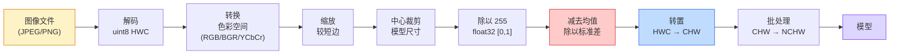
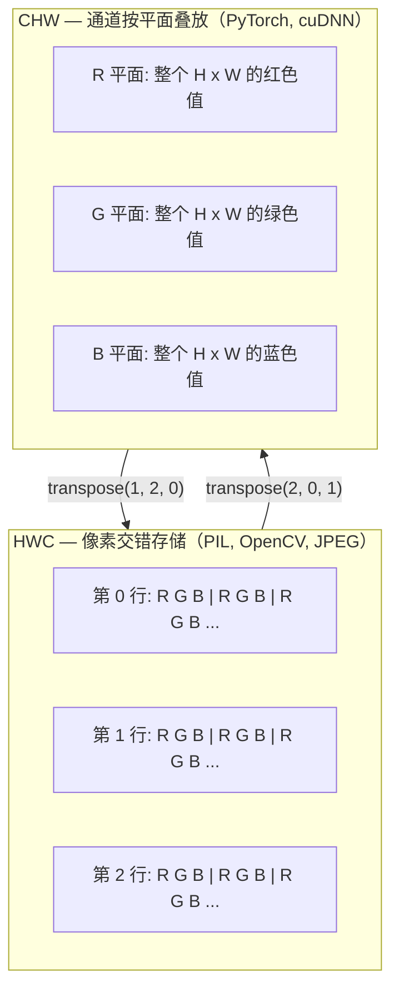

# 图像基础——像素、通道与色彩空间

> 图像是光采样的张量。你将使用的每一个视觉模型都从这个事实出发。

**类型：** 构建
**语言：** Python
**前置知识：** 第 1 阶段课程 12（张量操作）、第 3 阶段课程 11（PyTorch 入门）
**时间：** ~45 分钟

## 学习目标

- 解释连续场景如何被离散化为像素，以及为什么采样/量化决策决定了所有下游模型的上限
- 将图像作为 NumPy 数组读取、切片和检查，并在 HWC 和 CHW 布局之间灵活切换
- 在 RGB、灰度、HSV 和 YCbCr 之间转换，并说明每种色彩空间存在的理由
- 按照 torchvision 期望的方式应用像素级预处理（归一化、标准化、缩放、通道优先）

## 问题所在

你将阅读的每篇论文、下载的每个预训练权重、调用的每个视觉 API 都假设输入有特定的编码方式。在模型期望 `float32` 的地方传入 `uint8` 图像，代码仍会运行——然后悄悄输出垃圾。将 BGR 传给用 RGB 训练的网络，准确率会下降十个点。当模型期望通道优先（channels-first）时传入通道最后（channels-last）的输入，第一个卷积层会将高度当作特征通道来处理。这些都不会报错，只会破坏你的指标，然后你花一周时间寻找一个藏在文件加载方式里的 bug。

一旦你知道卷积在滑动什么，它就并不复杂。难点在于"一张图像"对相机、JPEG 解码器、PIL、OpenCV、torchvision 和 CUDA 内核意味着不同的事情。每个技术栈都有自己的轴顺序、字节范围和通道约定。一个无法清楚区分这些的视觉工程师只会构建出损坏的流程。

本课程修复基础，让本阶段的其余内容可以在此之上构建。学完后，你将知道什么是像素、为什么每个像素有三个数字而不是一个、"使用 ImageNet 统计进行归一化"实际上做了什么，以及如何在本阶段其他所有课程都会假设的两三种布局之间移动。

## 概念

### 完整预处理流程一览

每个生产视觉系统都是相同的可逆变换序列。搞错一步，模型看到的输入就与训练时不同。



红框和蓝框是 80% 静默失败发生的地方：缺少标准化和错误的布局。

### 像素是一个采样，不是一个方块

相机传感器计算落在微小探测器网格上的光子数。每个探测器在一小段时间内积分光，并发出与接收光子数成比例的电压。传感器然后将该电压量化为整数。一个探测器变成一个像素。

```
连续场景                      传感器网格                    数字图像
（无限细节）                  （H x W 探测器）              （H x W 整数）

    ~~~~~                     +--+--+--+--+--+              210 198 180 155 120
   ~   ~   ~                  |  |  |  |  |  |              205 195 178 152 118
  ~ light ~      ---->        +--+--+--+--+--+    ---->     200 190 175 150 115
   ~~~~~                      |  |  |  |  |  |              195 185 170 148 112
                              +--+--+--+--+--+              188 180 165 145 108
```

这一步有两个选择，它们固定了所有下游的上限：

- **空间采样（Spatial sampling）** 决定每度场景有多少探测器。太少，边缘变得锯齿状（混叠）；太多，存储和计算爆炸。
- **强度量化（Intensity quantization）** 决定电压被分成多少桶。8 位给出 256 个级别，是显示的标准。10、12、16 位给出更平滑的梯度，对医学成像、HDR 和原始传感器流程很重要。

像素不是有面积的彩色方块，它是一个单独的测量值。当你缩放或旋转时，你是在对测量网格进行重新采样。

### 为什么有三个通道

一个探测器计算整个可见光谱的光子——那就是灰度。为了获得颜色，传感器在网格上覆盖红、绿、蓝滤镜的马赛克。去马赛克后，每个空间位置有三个整数：红色滤镜探测器、绿色滤镜和蓝色滤镜附近探测器的响应。这三个整数就是一个像素的 RGB 三元组。

```
内存中的一个像素：

    (R, G, B) = (210, 140, 30)   <- 橙红色

一张 H x W RGB 图像：

    形状 (H, W, 3)    存储为    H 行，每行 W 个像素，每像素 3 个值
                               uint8 时每个值在 [0, 255]
```

三不是魔法数字。深度相机添加 Z 通道，卫星添加红外和紫外波段，医学扫描通常有一个通道（X 射线、CT）或多个通道（高光谱）。通道数是最后一个轴，卷积层学习跨通道混合。

### 两种布局约定：HWC 和 CHW

同一个张量，两种顺序。每个库选择其中一种。

```
HWC（高度、宽度、通道）                CHW（通道、高度、宽度）

   W ->                                H ->
  +-----+-----+-----+                 +-----+-----+
H |R G B|R G B|R G B|               C |R R R R R R|
| +-----+-----+-----+               | +-----+-----+
v |R G B|R G B|R G B|               v |G G G G G G|
  +-----+-----+-----+                 +-----+-----+
                                      |B B B B B B|
                                      +-----+-----+

   PIL、OpenCV、matplotlib，          PyTorch、大多数深度学习
   几乎所有磁盘上的图像文件             框架、cuDNN 内核
```

CHW 存在是因为卷积核在 H 和 W 上滑动。将通道轴放在第一位意味着每个核在每个通道看到一个连续的 2D 平面，这能干净地向量化。磁盘格式保留 HWC 是因为这与传感器扫描线出来的方式匹配。

你将输入上千次的一行转换：

```
img_chw = img_hwc.transpose(2, 0, 1)      # NumPy
img_chw = img_hwc.permute(2, 0, 1)        # PyTorch tensor
```

内存布局可视化：



### 字节范围和数据类型

三种约定占主导地位：

| 约定 | dtype | 范围 | 在哪里见到 |
|------|-------|------|----------|
| 原始（Raw） | `uint8` | [0, 255] | 磁盘上的文件、PIL、OpenCV 输出 |
| 归一化（Normalized） | `float32` | [0.0, 1.0] | 执行 `img.astype('float32') / 255` 之后 |
| 标准化（Standardized） | `float32` | 大致 [-2, +2] | 减去均值并除以标准差之后 |

卷积网络是在标准化输入上训练的。ImageNet 统计 `mean=[0.485, 0.456, 0.406]`、`std=[0.229, 0.224, 0.225]` 是对 [0, 1] 归一化像素在整个 ImageNet 训练集上计算的三个通道的算术均值和标准差。将原始 `uint8` 传给期望标准化 float 的模型，是应用视觉中最常见的静默失败。

### 色彩空间及其存在的原因

RGB 是捕获格式，但对于模型来说并不总是最有用的表示。

```
 RGB               HSV                       YCbCr / YUV

 R 红              H 色相（角度 0-360）        Y 亮度（明亮度）
 G 绿              S 饱和度（0-1）             Cb 色度蓝-黄
 B 蓝              V 值/亮度（0-1）            Cr 色度红-绿

 线性对应           将颜色与亮度分离。          将亮度与颜色分离。
 传感器输出         适用于颜色阈值、UI          JPEG 和大多数视频
                   滑块、简单滤镜              编解码器对色度通道
                                             压缩更多，因为人眼
                                             对色度细节不如对 Y 敏感
```

对于大多数现代 CNN，你传入 RGB。在以下情况你会遇到其他色彩空间：

- **HSV**——经典 CV 代码、基于颜色的分割、白平衡。
- **YCbCr**——读取 JPEG 内部、视频流程、仅在 Y 上操作的超分辨率模型。
- **灰度（Grayscale）**——OCR、文档模型、任何颜色是干扰变量而非信号的情况。

从 RGB 得到灰度是加权和，不是平均，因为人眼对绿色比对红色或蓝色更敏感：

```
Y = 0.299 R + 0.587 G + 0.114 B       （ITU-R BT.601，经典权重）
```

### 宽高比、缩放与插值

每个模型都有固定的输入尺寸（大多数 ImageNet 分类器是 224x224，现代检测器是 384x384 或 512x512）。你的图像很少匹配。三种重要的缩放选择：

- **缩放较短边，然后中心裁剪**——标准 ImageNet 方案。保留宽高比，丢弃边缘像素条带。
- **缩放并填充**——保留宽高比和每个像素，添加黑条。检测和 OCR 的标准。
- **直接缩放到目标**——拉伸图像。便宜，扭曲几何，对许多分类任务足够。

插值方法决定当新网格与旧网格不对齐时如何计算中间像素：

```
最近邻（Nearest neighbour）     最快，块状，掩码/标签的唯一选择
双线性（Bilinear）              快速，平滑，大多数图像缩放的默认选择
双三次（Bicubic）               较慢，放大时更锐利
Lanczos                        最慢，最高质量，用于最终显示
```

经验法则：训练用双线性，你会看到的资产用双三次或 lanczos，包含整数类 ID 的任何内容用最近邻。

## 构建

### 步骤 1：加载图像并检查其形状

使用 Pillow 加载任何 JPEG 或 PNG，转换为 NumPy，打印你得到的内容。为了一个确定性的离线示例，合成一个。

```python
import numpy as np
from PIL import Image

def synthetic_rgb(h=128, w=192, seed=0):
    rng = np.random.default_rng(seed)
    yy, xx = np.meshgrid(np.linspace(0, 1, h), np.linspace(0, 1, w), indexing="ij")
    r = (np.sin(xx * 6) * 0.5 + 0.5) * 255
    g = yy * 255
    b = (1 - yy) * xx * 255
    rgb = np.stack([r, g, b], axis=-1) + rng.normal(0, 6, (h, w, 3))
    return np.clip(rgb, 0, 255).astype(np.uint8)

arr = synthetic_rgb()
# 或从磁盘加载：
# arr = np.asarray(Image.open("your_image.jpg").convert("RGB"))

print(f"type:   {type(arr).__name__}")
print(f"dtype:  {arr.dtype}")
print(f"shape:  {arr.shape}     # (H, W, C)")
print(f"min:    {arr.min()}")
print(f"max:    {arr.max()}")
print(f"pixel at (0, 0): {arr[0, 0]}")
```

预期输出：`shape: (H, W, 3)`，`dtype: uint8`，范围 `[0, 255]`。无论字节来自相机、JPEG 解码器还是合成生成器，这都是规范的磁盘表示。

### 步骤 2：分离通道并重新排列布局

分别提取 R、G、B，然后从 HWC 转换到 CHW 供 PyTorch 使用。

```python
R = arr[:, :, 0]
G = arr[:, :, 1]
B = arr[:, :, 2]
print(f"R shape: {R.shape}, mean: {R.mean():.1f}")
print(f"G shape: {G.shape}, mean: {G.mean():.1f}")
print(f"B shape: {B.shape}, mean: {B.mean():.1f}")

arr_chw = arr.transpose(2, 0, 1)
print(f"\nHWC shape: {arr.shape}")
print(f"CHW shape: {arr_chw.shape}")
```

每个通道三个灰度平面。CHW 只是重新排列轴，当内存布局允许时不需要严格地复制数据。

### 步骤 3：灰度和 HSV 转换

加权和灰度转换，然后手动 RGB 到 HSV。

```python
def rgb_to_grayscale(rgb):
    weights = np.array([0.299, 0.587, 0.114], dtype=np.float32)
    return (rgb.astype(np.float32) @ weights).astype(np.uint8)

def rgb_to_hsv(rgb):
    rgb_f = rgb.astype(np.float32) / 255.0
    r, g, b = rgb_f[..., 0], rgb_f[..., 1], rgb_f[..., 2]
    cmax = np.max(rgb_f, axis=-1)
    cmin = np.min(rgb_f, axis=-1)
    delta = cmax - cmin

    h = np.zeros_like(cmax)
    mask = delta > 0
    rmax = mask & (cmax == r)
    gmax = mask & (cmax == g)
    bmax = mask & (cmax == b)
    h[rmax] = ((g[rmax] - b[rmax]) / delta[rmax]) % 6
    h[gmax] = ((b[gmax] - r[gmax]) / delta[gmax]) + 2
    h[bmax] = ((r[bmax] - g[bmax]) / delta[bmax]) + 4
    h = h * 60.0

    s = np.where(cmax > 0, delta / cmax, 0)
    v = cmax
    return np.stack([h, s, v], axis=-1)

gray = rgb_to_grayscale(arr)
hsv = rgb_to_hsv(arr)
print(f"gray shape: {gray.shape}, range: [{gray.min()}, {gray.max()}]")
print(f"hsv   shape: {hsv.shape}")
print(f"hue range: [{hsv[..., 0].min():.1f}, {hsv[..., 0].max():.1f}] degrees")
print(f"sat range: [{hsv[..., 1].min():.2f}, {hsv[..., 1].max():.2f}]")
print(f"val range: [{hsv[..., 2].min():.2f}, {hsv[..., 2].max():.2f}]")
```

色相以度为单位输出，饱和度和值在 [0, 1]。这与 OpenCV `hsv_full` 约定匹配。

### 步骤 4：归一化、标准化及其逆操作

从原始字节到预训练 ImageNet 模型期望的精确张量，然后再转回来。

```python
mean = np.array([0.485, 0.456, 0.406], dtype=np.float32)
std = np.array([0.229, 0.224, 0.225], dtype=np.float32)

def preprocess_imagenet(rgb_uint8):
    x = rgb_uint8.astype(np.float32) / 255.0
    x = (x - mean) / std
    x = x.transpose(2, 0, 1)
    return x

def deprocess_imagenet(chw_float32):
    x = chw_float32.transpose(1, 2, 0)
    x = x * std + mean
    x = np.clip(x * 255.0, 0, 255).astype(np.uint8)
    return x

x = preprocess_imagenet(arr)
print(f"preprocessed shape: {x.shape}     # (C, H, W)")
print(f"preprocessed dtype: {x.dtype}")
print(f"preprocessed mean per channel:  {x.mean(axis=(1, 2)).round(3)}")
print(f"preprocessed std  per channel:  {x.std(axis=(1, 2)).round(3)}")

roundtrip = deprocess_imagenet(x)
max_diff = np.abs(roundtrip.astype(int) - arr.astype(int)).max()
print(f"roundtrip max pixel diff: {max_diff}    # should be 0 or 1")
```

每通道均值应接近零，标准差接近一。preprocess/deprocess 对正是每个 torchvision `transforms.Normalize` 调用在底层做的事情。

### 步骤 5：三种插值方法的缩放比较

在放大上比较最近邻、双线性和双三次，使差异可见。

```python
target = (arr.shape[0] * 3, arr.shape[1] * 3)

nearest = np.asarray(Image.fromarray(arr).resize(target[::-1], Image.NEAREST))
bilinear = np.asarray(Image.fromarray(arr).resize(target[::-1], Image.BILINEAR))
bicubic = np.asarray(Image.fromarray(arr).resize(target[::-1], Image.BICUBIC))

def local_roughness(x):
    gy = np.diff(x.astype(float), axis=0)
    gx = np.diff(x.astype(float), axis=1)
    return float(np.abs(gy).mean() + np.abs(gx).mean())

for name, out in [("nearest", nearest), ("bilinear", bilinear), ("bicubic", bicubic)]:
    print(f"{name:>8}  shape={out.shape}  roughness={local_roughness(out):6.2f}")
```

最近邻的粗糙度得分最高，因为它保留了硬边缘。双线性最平滑。双三次介于两者之间，在没有阶梯状伪影的情况下保留了感知锐度。

## 实际应用

`torchvision.transforms` 将上述所有内容打包成一个可组合的流程。下面的代码完全复现了 `preprocess_imagenet` 的功能，外加缩放和裁剪。

```python
import torch
from torchvision import transforms
from PIL import Image

img = Image.fromarray(synthetic_rgb(256, 256))

pipeline = transforms.Compose([
    transforms.Resize(256),
    transforms.CenterCrop(224),
    transforms.ToTensor(),
    transforms.Normalize(mean=[0.485, 0.456, 0.406], std=[0.229, 0.224, 0.225]),
])

x = pipeline(img)
print(f"tensor type:  {type(x).__name__}")
print(f"tensor dtype: {x.dtype}")
print(f"tensor shape: {tuple(x.shape)}      # (C, H, W)")
print(f"per-channel mean: {x.mean(dim=(1, 2)).tolist()}")
print(f"per-channel std:  {x.std(dim=(1, 2)).tolist()}")

batch = x.unsqueeze(0)
print(f"\nbatched shape: {tuple(batch.shape)}   # (N, C, H, W) — ready for a model")
```

四个步骤，按这个确切的顺序：`Resize(256)` 将较短边缩放到 256；`CenterCrop(224)` 从中间取一个 224x224 的块；`ToTensor()` 除以 255 并将 HWC 转换到 CHW；`Normalize` 减去 ImageNet 均值并除以标准差。颠倒这个顺序会悄悄改变到达模型的内容。

## 交付物

本课程产出：

- `outputs/prompt-vision-preprocessing-audit.md`——一个将任何模型卡或数据集卡转化为团队必须遵守的精确预处理不变量清单的提示词。
- `outputs/skill-image-tensor-inspector.md`——一个技能，给定任何图像形状的张量或数组，报告 dtype、布局、范围以及看起来是原始的、归一化的还是标准化的。

## 练习

1. **（简单）** 用 OpenCV（`cv2.imread`）和 Pillow 分别加载一张 JPEG。打印两种形状和 `(0, 0)` 处的像素。解释通道顺序的差异，然后写一行转换使 OpenCV 数组与 Pillow 数组相同。
2. **（中等）** 编写 `standardize(img, mean, std)` 及其逆函数，这两个函数在任何 uint8 图像上共同通过 `roundtrip_max_diff <= 1` 测试。你的函数必须在 HWC 的单张图像和 NCHW 的批次上使用相同调用方式。
3. **（困难）** 取一个 3 通道 ImageNet 标准化张量，通过一个 1x1 卷积将 RGB 加权混合成单个灰度通道。将权重初始化为 `[0.299, 0.587, 0.114]`，冻结它们，并验证输出与你手动实现的 `rgb_to_grayscale` 在浮点误差范围内匹配。还有哪些其他经典色彩空间变换可以写成 1x1 卷积？

## 关键术语

| 术语 | 人们怎么说 | 实际含义 |
|------|------------|---------|
| 像素（Pixel） | "一个彩色方块" | 一个网格位置上一次光强度采样——彩色三个数字，灰度一个数字 |
| 通道（Channel） | "颜色" | 叠放成图像张量的并行空间网格之一；HWC 中是最后一个轴，CHW 中是第一个 |
| HWC / CHW | "形状" | 图像张量的轴顺序；磁盘和 PIL 使用 HWC，PyTorch 和 cuDNN 使用 CHW |
| 归一化（Normalize） | "缩放图像" | 除以 255 使像素在 [0, 1] 中——必要但不充分 |
| 标准化（Standardize） | "零中心化" | 每通道减去均值并除以标准差，使输入分布与模型训练时看到的一致 |
| 灰度转换（Grayscale conversion） | "平均通道" | 使用系数 0.299/0.587/0.114 的加权和，匹配人类亮度感知 |
| 插值（Interpolation） | "缩放时如何选择像素" | 决定新网格与旧网格不对齐时输出值的规则——标签用最近邻，训练用双线性，显示用双三次 |
| 宽高比（Aspect ratio） | "宽度比高度" | 区分"缩放并填充"和"缩放并拉伸"的比值 |

## 延伸阅读

- Charles Poynton——《色彩空间导览》——关于为什么有这么多色彩空间以及各自何时重要的最清晰技术论述
- PyTorch Vision Transforms 文档——你在生产中实际会组合的完整变换流程
- How JPEG Works（Colt McAnlis）——色度子采样、DCT 以及 JPEG 为何编码 YCbCr 而非 RGB 的生动视觉之旅
- ImageNet 预处理约定（torchvision 模型）——`mean=[0.485, 0.456, 0.406]` 及每个 zoo 中模型期望它的原因的真实来源
