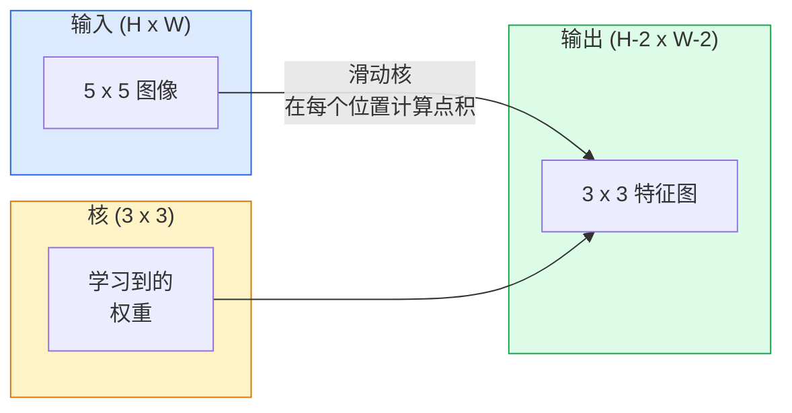
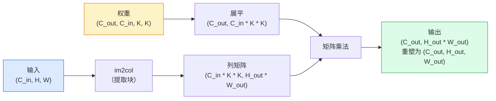

# 从零构建卷积

> 卷积是一个在图像上滑动的微型全连接层，在每个位置共享相同的权重。

**类型：** 构建
**语言：** Python
**前置知识：** 第 3 阶段（深度学习核心）、第 4 阶段课程 01（图像基础）
**时间：** ~75 分钟

## 学习目标

- 仅用 NumPy 从零实现 2D 卷积，包括嵌套循环版本和向量化的 `im2col` 版本
- 对任意输入尺寸、核尺寸、填充和步长的组合计算输出空间尺寸，并证明 `(H - K + 2P) / S + 1` 公式
- 手工设计核（边缘、模糊、锐化、Sobel），并解释为什么每个核产生它所产生的激活模式
- 将卷积堆叠成特征提取器，并将堆叠深度与感受野大小联系起来

## 问题所在

在 224x224 RGB 图像上的全连接层每个神经元需要 224 * 224 * 3 = 150,528 个输入权重。一个有 1,000 个单元的单隐层已经有 1.5 亿个参数——在你学到任何有用的东西之前。更糟的是，这层没有任何概念认为左上角的狗和右下角的狗是同一个模式。它把每个像素位置视为独立的，而这对图像来说恰恰是错的：将一只猫平移三个像素不应该迫使网络重新学习这个概念。

图像模型需要的两个属性是**平移等变性**（输入移动时输出也移动）和**参数共享**（相同的特征检测器在任何地方运行）。全连接层两者都不给你。卷积免费给你两者。

卷积不是为深度学习发明的。它是驱动 JPEG 压缩、Photoshop 中高斯模糊、工业视觉中边缘检测以及有史以来发布的每个音频滤波器的相同操作。CNN 从 2012 年到 2020 年主导 ImageNet 的原因是：对于附近值相关且同一模式可能出现在任何地方的数据，卷积是正确的先验。

## 概念

### 一个核，滑动

2D 卷积取一个称为核（或滤波器）的小权重矩阵，在输入上滑动，在每个位置计算逐元素乘积之和。那个和成为一个输出像素。



在 5x5 输入上的 3x3 具体示例（无填充，步长 1）：

```
输入 X (5 x 5):                核 W (3 x 3):

  1  2  0  1  2                   1  0 -1
  0  1  3  1  0                   2  0 -2
  2  1  0  2  1                   1  0 -1
  1  0  2  1  3
  2  1  1  0  1

核在每个有效的 3 x 3 窗口上滑动。输出 Y 是 3 x 3：

 Y[0,0] = sum( W * X[0:3, 0:3] )
 Y[0,1] = sum( W * X[0:3, 1:4] )
 Y[0,2] = sum( W * X[0:3, 2:5] )
 Y[1,0] = sum( W * X[1:4, 0:3] )
 ... 以此类推
```

那个公式——**共享权重、局部性、滑动窗口**——就是整个想法。其余的都是记账工作。

### 输出尺寸公式

给定输入空间尺寸 `H`、核尺寸 `K`、填充 `P`、步长 `S`：

```
H_out = floor( (H - K + 2P) / S ) + 1
```

记住这个公式。你在每个架构中都会计算它几十次。

| 场景 | H | K | P | S | H_out |
|------|---|---|---|---|-------|
| 有效卷积，无填充 | 32 | 3 | 0 | 1 | 30 |
| 同尺寸卷积（保留尺寸） | 32 | 3 | 1 | 1 | 32 |
| 下采样 2 倍 | 32 | 3 | 1 | 2 | 16 |
| 池化 2x2 | 32 | 2 | 0 | 2 | 16 |
| 大感受野 | 32 | 7 | 3 | 2 | 16 |

"同尺寸填充"（same padding）意味着当 S==1 时选择 P 使得 H_out==H。对于奇数 K，P = (K - 1) / 2。这就是 3x3 核占主导地位的原因——它是仍然有中心的最小奇数核。

### 填充（Padding）

没有填充，每次卷积都会缩小特征图。堆叠 20 个，你的 224x224 图像变成 184x184，这浪费了边界处的计算，并使需要匹配形状的残差连接复杂化。

```
在 5 x 5 输入上零填充 (P = 1)：

  0  0  0  0  0  0  0
  0  1  2  0  1  2  0
  0  0  1  3  1  0  0
  0  2  1  0  2  1  0       现在核可以以像素 (0, 0) 为中心
  0  1  0  2  1  3  0       并且仍然有三行三列可以相乘的值。
  0  2  1  1  0  1  0
  0  0  0  0  0  0  0
```

实践中遇到的模式：`zero`（最常见）、`reflect`（镜像边缘，避免生成模型中的硬边界）、`replicate`（复制边缘）、`circular`（环绕，用于环形问题）。

### 步长（Stride）

步长是滑动的步进大小。`stride=1` 是默认值。`stride=2` 将空间维度减半，是在 CNN 内部下采样的经典方式，无需单独的池化层——每个现代架构（ResNet、ConvNeXt、MobileNet）都在某处使用步进卷积代替最大池化。

```
在 5 x 5 输入上步长 1，3 x 3 核：

  起始位置：(0,0) (0,1) (0,2)    -> 输出行 0
            (1,0) (1,1) (1,2)    -> 输出行 1
            (2,0) (2,1) (2,2)    -> 输出行 2

  输出：3 x 3

相同输入步长 2：

  起始位置：(0,0) (0,2)          -> 输出行 0
            (2,0) (2,2)          -> 输出行 1

  输出：2 x 2
```

### 多输入通道

真实图像有三个通道。对 RGB 输入的 3x3 卷积实际上是一个 3x3x3 的体积：每个输入通道一个 3x3 切片。在每个空间位置，你对所有三个切片进行乘法和求和，然后加一个偏置。

```
输入：  (C_in,  H,  W)        3 x 5 x 5
核：    (C_in,  K,  K)        3 x 3 x 3（一个核）
输出：  (1,     H', W')       2D 特征图

对于产生 C_out 个输出通道的层，你堆叠 C_out 个核：

权重：  (C_out, C_in, K, K)   例如 64 x 3 x 3 x 3
输出：  (C_out, H', W')       64 x 3 x 3

参数数量：C_out * C_in * K * K + C_out   （+ C_out 是偏置）
```

最后一行是你在规划模型时要计算的。3 通道输入的 64 通道 3x3 卷积有 `64 * 3 * 3 * 3 + 64 = 1,792` 个参数。非常便宜。

### im2col 技巧

嵌套循环易于阅读但很慢。GPU 需要大型矩阵乘法。技巧：将输入的每个感受野窗口展平成一个大矩阵的一列，将核展平成一行，整个卷积就变成了单个矩阵乘法。



每个生产卷积实现都是这个的某种变体，加上缓存平铺技巧（直接卷积、Winograd、大核的 FFT 卷积）。理解 im2col 你就理解了核心。

### 感受野（Receptive Field）

单个 3x3 卷积看 9 个输入像素。堆叠两个 3x3 卷积，第二层中的一个神经元看 5x5 个输入像素。三个 3x3 卷积给出 7x7。一般来说：

```
L 个堆叠 K x K 卷积（步长 1）后的感受野 = 1 + L * (K - 1)

有步长时：感受野沿每层步长乘法增长。
```

"一路用 3x3"（VGG、ResNet、ConvNeXt）有效的全部原因是：两个 3x3 卷积看到与一个 5x5 卷积相同的输入区域，但参数更少，中间还有额外的非线性。

## 构建

### 步骤 1：填充数组

从最小的原语开始：一个在 H x W 数组周围用零填充的函数。

```python
import numpy as np

def pad2d(x, p):
    if p == 0:
        return x
    h, w = x.shape[-2:]
    out = np.zeros(x.shape[:-2] + (h + 2 * p, w + 2 * p), dtype=x.dtype)
    out[..., p:p + h, p:p + w] = x
    return out

x = np.arange(9).reshape(3, 3)
print(x)
print()
print(pad2d(x, 1))
```

尾轴技巧 `x.shape[:-2]` 意味着同一个函数无需修改就可以在 `(H, W)`、`(C, H, W)` 或 `(N, C, H, W)` 上工作。

### 步骤 2：嵌套循环实现的 2D 卷积

参考实现——慢，但无歧义。这是 `torch.nn.functional.conv2d` 在原理上做的事。

```python
def conv2d_naive(x, w, b=None, stride=1, padding=0):
    c_in, h, w_in = x.shape
    c_out, c_in_w, kh, kw = w.shape
    assert c_in == c_in_w

    x_pad = pad2d(x, padding)
    h_out = (h + 2 * padding - kh) // stride + 1
    w_out = (w_in + 2 * padding - kw) // stride + 1

    out = np.zeros((c_out, h_out, w_out), dtype=np.float32)
    for oc in range(c_out):
        for i in range(h_out):
            for j in range(w_out):
                hs = i * stride
                ws = j * stride
                patch = x_pad[:, hs:hs + kh, ws:ws + kw]
                out[oc, i, j] = np.sum(patch * w[oc])
        if b is not None:
            out[oc] += b[oc]
    return out
```

四个嵌套循环（输出通道、行、列，加上隐式的 C_in、kh、kw 上的求和）。这是你将用来检验每个更快实现的基准真实。

### 步骤 3：用手工设计的核验证

构建一个垂直 Sobel 核，将其应用于合成阶梯图像，并观察垂直边缘亮起来。

```python
def synthetic_step_image():
    img = np.zeros((1, 16, 16), dtype=np.float32)
    img[:, :, 8:] = 1.0
    return img

sobel_x = np.array([
    [[-1, 0, 1],
     [-2, 0, 2],
     [-1, 0, 1]]
], dtype=np.float32)[None]

x = synthetic_step_image()
y = conv2d_naive(x, sobel_x, padding=1)
print(y[0].round(1))
```

期望在第 7 列看到大的正值（从左到右亮度增加），其他地方为零。这个单行打印是你验证数学正确性的理智检查。

### 步骤 4：im2col

将输入中每个核大小的窗口转换为矩阵的一列。对于 `C_in=3, K=3`，每列是 27 个数字。

```python
def im2col(x, kh, kw, stride=1, padding=0):
    c_in, h, w = x.shape
    x_pad = pad2d(x, padding)
    h_out = (h + 2 * padding - kh) // stride + 1
    w_out = (w + 2 * padding - kw) // stride + 1

    cols = np.zeros((c_in * kh * kw, h_out * w_out), dtype=x.dtype)
    col = 0
    for i in range(h_out):
        for j in range(w_out):
            hs = i * stride
            ws = j * stride
            patch = x_pad[:, hs:hs + kh, ws:ws + kw]
            cols[:, col] = patch.reshape(-1)
            col += 1
    return cols, h_out, w_out
```

这仍然是一个 Python 循环，但现在繁重的工作将是单个向量化的矩阵乘法。

### 步骤 5：通过 im2col + 矩阵乘法实现快速卷积

用一个矩阵乘法替代四重循环。

```python
def conv2d_im2col(x, w, b=None, stride=1, padding=0):
    c_out, c_in, kh, kw = w.shape
    cols, h_out, w_out = im2col(x, kh, kw, stride, padding)
    w_flat = w.reshape(c_out, -1)
    out = w_flat @ cols
    if b is not None:
        out += b[:, None]
    return out.reshape(c_out, h_out, w_out)
```

正确性检查：运行两种实现并比较。

```python
rng = np.random.default_rng(0)
x = rng.normal(0, 1, (3, 16, 16)).astype(np.float32)
w = rng.normal(0, 1, (8, 3, 3, 3)).astype(np.float32)
b = rng.normal(0, 1, (8,)).astype(np.float32)

y_naive = conv2d_naive(x, w, b, padding=1)
y_im2col = conv2d_im2col(x, w, b, padding=1)

print(f"max abs diff: {np.max(np.abs(y_naive - y_im2col)):.2e}")
```

`max abs diff` 应该在 `1e-5` 左右——差异是浮点积累顺序，不是 bug。

### 步骤 6：手工设计核库

五个滤波器，展示单个卷积层在任何训练之前可以表达什么。

```python
KERNELS = {
    "identity": np.array([[0, 0, 0], [0, 1, 0], [0, 0, 0]], dtype=np.float32),
    "blur_3x3": np.ones((3, 3), dtype=np.float32) / 9.0,
    "sharpen": np.array([[0, -1, 0], [-1, 5, -1], [0, -1, 0]], dtype=np.float32),
    "sobel_x": np.array([[-1, 0, 1], [-2, 0, 2], [-1, 0, 1]], dtype=np.float32),
    "sobel_y": np.array([[-1, -2, -1], [0, 0, 0], [1, 2, 1]], dtype=np.float32),
}

def apply_kernel(img2d, kernel):
    x = img2d[None].astype(np.float32)
    w = kernel[None, None]
    return conv2d_im2col(x, w, padding=1)[0]
```

应用于任何灰度图像，blur 软化，sharpen 使边缘更清晰，Sobel-x 使垂直边缘亮起来，Sobel-y 使水平边缘亮起来。这些正是 AlexNet 和 VGG 中第一个训练好的卷积层最终学到的模式——因为一个好的图像模型无论后来要完成什么任务，都需要边缘和斑点检测器。

## 实际应用

PyTorch 的 `nn.Conv2d` 将相同的操作与 autograd、CUDA 内核和 cuDNN 优化包装在一起。形状语义完全相同。

```python
import torch
import torch.nn as nn

conv = nn.Conv2d(in_channels=3, out_channels=64, kernel_size=3, stride=1, padding=1)
print(conv)
print(f"weight shape: {tuple(conv.weight.shape)}   # (C_out, C_in, K, K)")
print(f"bias shape:   {tuple(conv.bias.shape)}")
print(f"param count:  {sum(p.numel() for p in conv.parameters())}")

x = torch.randn(8, 3, 224, 224)
y = conv(x)
print(f"\ninput  shape: {tuple(x.shape)}")
print(f"output shape: {tuple(y.shape)}")
```

将 `padding=1` 换成 `padding=0`，输出降到 222x222。将 `stride=1` 换成 `stride=2`，降到 112x112。与你上面记忆的公式相同。

## 交付物

本课程产出：

- `outputs/prompt-cnn-architect.md`——一个提示词，给定输入尺寸、参数预算和目标感受野，在每一步设计具有正确 K/S/P 的 `Conv2d` 层堆叠。
- `outputs/skill-conv-shape-calculator.md`——一个技能，逐层遍历网络规格并返回每个块的输出形状、感受野和参数数量。

## 练习

1. **（简单）** 给定 128x128 灰度输入和 `[Conv3x3(s=1,p=1), Conv3x3(s=2,p=1), Conv3x3(s=1,p=1), Conv3x3(s=2,p=1)]` 的堆叠，手动计算每层的输出空间尺寸和感受野。用虚拟卷积的 PyTorch `nn.Sequential` 验证。
2. **（中等）** 扩展 `conv2d_naive` 和 `conv2d_im2col` 以接受 `groups` 参数。证明 `groups=C_in=C_out` 重现了深度可分离卷积，其参数数量是 `C * K * K` 而不是 `C * C * K * K`。
3. **（困难）** 手动实现 `conv2d_im2col` 的反向传播：给定输出的梯度，计算 `x` 和 `w` 的梯度。与相同输入和权重上的 `torch.autograd.grad` 验证。技巧：im2col 的梯度是 `col2im`，它必须累积重叠窗口。

## 关键术语

| 术语 | 人们怎么说 | 实际含义 |
|------|------------|---------|
| 卷积（Convolution） | "滑动滤波器" | 在每个空间位置以共享权重应用的可学习点积；数学上是互相关，但每个人都叫它卷积 |
| 核/滤波器（Kernel/filter） | "特征检测器" | 形状为 (C_in, K, K) 的小权重张量，与输入窗口的点积产生一个输出像素 |
| 步长（Stride） | "你跳多远" | 连续核放置之间的步进大小；步长 2 将每个空间维度减半 |
| 填充（Padding） | "边缘的零" | 在输入周围添加的额外值，使核可以以边界像素为中心；`same` 填充使输出尺寸等于输入尺寸 |
| 感受野（Receptive field） | "神经元看多大范围" | 给定输出激活所依赖的原始输入块，随深度和步长增长 |
| im2col | "GEMM 技巧" | 将每个感受野窗口重排为列，使卷积变成一个大矩阵乘法——每个快速卷积核的核心 |
| 深度可分离卷积（Depthwise conv） | "每通道一个核" | `groups == C_in` 的卷积，仅从匹配的输入通道计算每个输出通道；MobileNet 和 ConvNeXt 的骨干 |
| 平移等变性（Translation equivariance） | "移入，移出" | 将输入移动 k 个像素会将输出移动 k 个像素的属性；共享权重免费提供 |

## 延伸阅读

- Dumoulin & Visin（2016），《深度学习卷积运算指南》——填充/步长/扩张的权威图解，每门课程都在悄悄复制
- CS231n：视觉识别的卷积神经网络——经典讲义，包括原始 im2col 解释
- 带注释的 ConvNet（fast.ai）——从手动卷积到训练好的数字分类器的 notebook
- CNN 感受野运算（Dang Ha The Hien）——感受野计算的论文质量交互解释器
