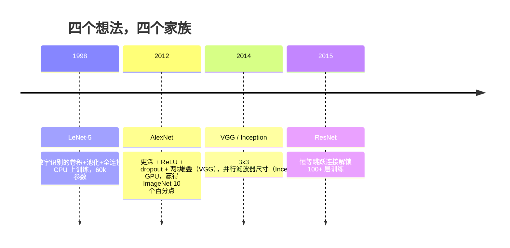
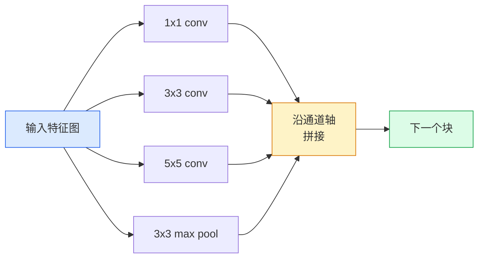
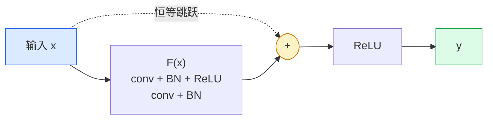

# CNN：从 LeNet 到 ResNet

> 过去三十年里每一个主要的 CNN，都是同一个卷积-非线性-下采样配方加上一个新想法。按顺序学习这些想法。

**类型：** 学习 + 构建
**语言：** Python
**前置条件：** 第 3 阶段第 11 课（PyTorch）、第 4 阶段第 01 课（图像基础）、第 4 阶段第 02 课（从零实现卷积）
**时间：** ~75 分钟

## 学习目标

- 追溯架构谱系 LeNet-5 -> AlexNet -> VGG -> Inception -> ResNet，说出每个家族贡献的那一个新想法
- 用 PyTorch 实现 LeNet-5、VGG 风格块和 ResNet BasicBlock，每个不超过 40 行
- 解释为什么残差连接（residual connections）能将一个 1000 层的网络从无法训练变为最先进水平
- 阅读一个现代骨干网络（ResNet-18、ResNet-50），在查看源码之前预测其输出形状、感受野和参数量

## 问题所在

2011 年，最好的 ImageNet 分类器 top-5 准确率约为 74%。2012 年 AlexNet 达到 85%。2015 年 ResNet 达到 96%。没有新数据，没有新一代 GPU。这些提升来自架构思想。一名合格的视觉工程师必须知道哪个想法来自哪篇论文，因为你在 2026 年部署的每一个生产骨干网络都是这些相同构件的重新组合——而且这些想法不断迁移：分组卷积从 CNN 转移到了 Transformer，残差连接从 ResNet 转移到了每一个现存的 LLM，批归一化（batch normalization）存在于扩散模型中。

按顺序研究这些网络也能让你免疫一个常见错误：在 LeNet 大小的网络就能解决问题时却去用最大的可用模型。MNIST 不需要 ResNet。了解每个家族的扩展曲线能告诉你应该坐在哪个位置。

## 核心概念

### 改变视觉的四个想法



经典视觉领域没有任何其他东西的重要性比得上这四次飞跃。

### LeNet-5（1998）

Yann LeCun 的数字识别器。60,000 个参数。两个卷积-池化块，两个全连接层，tanh 激活函数。它定义了每个 CNN 继承的模板：

```
输入 (1, 32, 32)
  conv 5x5 -> (6, 28, 28)
  avg pool 2x2 -> (6, 14, 14)
  conv 5x5 -> (16, 10, 10)
  avg pool 2x2 -> (16, 5, 5)
  flatten -> 400
  dense -> 120
  dense -> 84
  dense -> 10
```

现代世界所称的 CNN——交替的卷积和下采样，接入一个小型分类器头——都是有更多层、更大通道和更好激活函数的 LeNet。

### AlexNet（2012）

共同打破 ImageNet 的三个改变：

1. **ReLU** 代替 tanh。梯度不再消失。训练速度提升六倍。
2. **Dropout** 加入全连接头。正则化成为一个层，而非一个技巧。
3. **深度和宽度**。五个卷积层，三个全连接层，6000 万参数，在两块 GPU 上训练，模型在 GPU 间分割。

论文的图 2 仍然展示着 GPU 分割的两个并行流。这种并行性是硬件上的权宜之计，而非架构洞见——但上面三个想法至今仍存在于你使用的每一个模型中。

### VGG（2014）

VGG 的问题是：如果只用 3x3 卷积并且让网络变深，会发生什么？

```
块：   conv 3x3 -> conv 3x3 -> pool 2x2
重复：  16 或 19 个卷积层
```

两个 3x3 卷积与一个 5x5 卷积看到同样的 5x5 输入区域，但参数更少（2\*9\*C² = 18C² vs 25\*C²），且中间多一个 ReLU。VGG 将这个观察转化为一整个架构。这种简洁性——一种块类型反复堆叠——使它成为此后一切的参照点。

代价：1.38 亿参数，训练慢，推理成本高。

### Inception（2014，同年）

Google 对"我该用什么卷积核尺寸？"的回答是：全部用，并行使用。



每个分支专门负责——1x1 用于通道混合，3x3 用于局部纹理，5x5 用于更大的模式，池化用于平移不变特征——拼接让下一层选择哪个分支有用。Inception v1 在每个分支内使用 1x1 卷积作为瓶颈，以保持参数量合理。

### 退化问题（degradation problem）

到 2015 年，VGG-19 有效而 VGG-32 无效。深度本应有帮助，但超过约 20 层后，训练和测试损失都变得更差。这不是过拟合。这是优化器因为梯度在每一层都成倍缩小而无法找到有用权重。

```
普通深度网络：
  y = f_L( f_{L-1}( ... f_1(x) ... ) )

关于早期层的梯度：
  dL/dW_1 = dL/dy * df_L/df_{L-1} * ... * df_2/df_1 * df_1/dW_1

每个乘法项的量级约为（权重量级）*（激活增益）。
将 100 个增益 < 1 的项叠加，梯度实际上变为零。
```

VGG 在 19 层时有效，是因为批归一化（同时发布）保持了激活的良好缩放。但即使是批归一化也无法在超过约 30 层后拯救深度。

### ResNet（2015）

He、Zhang、Ren、Sun 提出了一个修复一切的改变：

```
标准块：   y = F(x)
残差块：   y = F(x) + x
```

`+ x` 意味着层可以通过将 `F(x)` 驱动为零来选择什么都不做。一个 1000 层的 ResNet 现在最差也和一个 1 层网络一样好，因为每个额外的块都有一个平凡的逃生出口。有了这个保证，优化器愿意让每个块*稍微*有用——而稍微有用，叠加 100 次，就是最先进水平。



块的两种变体随处可见：

- **BasicBlock**（ResNet-18、ResNet-34）：两个 3x3 卷积，跳跃绕过两者。
- **Bottleneck**（ResNet-50、-101、-152）：1x1 降维，3x3 中间，1x1 升维，跳跃绕过三者。在通道数较高时更省参数。

当跳跃需要跨越下采样（stride=2）时，恒等路径被替换为 1x1 stride=2 的卷积以匹配形状。

### 为什么残差在视觉之外也重要

这个想法实际上不是关于图像分类的。它是关于将深度网络从"交叉手指希望梯度能存活"变成可靠的、可扩展的工程工具。你在下一阶段将读到的每一个 Transformer，在每个块中都有完全相同的跳跃连接。没有 ResNet，就没有 GPT。

## 动手构建

### 步骤 1：LeNet-5

一个最小的、忠实的 LeNet。tanh 激活，平均池化。对现代性的唯一让步是我们在下游使用 `nn.CrossEntropyLoss` 而非原始的高斯连接。

```python
import torch
import torch.nn as nn
import torch.nn.functional as F

class LeNet5(nn.Module):
    def __init__(self, num_classes=10):
        super().__init__()
        self.conv1 = nn.Conv2d(1, 6, kernel_size=5)
        self.conv2 = nn.Conv2d(6, 16, kernel_size=5)
        self.pool = nn.AvgPool2d(2)
        self.fc1 = nn.Linear(16 * 5 * 5, 120)
        self.fc2 = nn.Linear(120, 84)
        self.fc3 = nn.Linear(84, num_classes)

    def forward(self, x):
        x = self.pool(torch.tanh(self.conv1(x)))
        x = self.pool(torch.tanh(self.conv2(x)))
        x = torch.flatten(x, 1)
        x = torch.tanh(self.fc1(x))
        x = torch.tanh(self.fc2(x))
        return self.fc3(x)

net = LeNet5()
x = torch.randn(1, 1, 32, 32)
print(f"输出: {net(x).shape}")
print(f"参数: {sum(p.numel() for p in net.parameters()):,}")
```

预期输出：`输出: torch.Size([1, 10])`，`参数: 61,706`。这就是启动现代视觉的整个数字分类器。

### 步骤 2：VGG 块

一个可复用的块：两个 3x3 卷积，ReLU，批归一化，最大池化。

```python
class VGGBlock(nn.Module):
    def __init__(self, in_c, out_c):
        super().__init__()
        self.conv1 = nn.Conv2d(in_c, out_c, kernel_size=3, padding=1)
        self.bn1 = nn.BatchNorm2d(out_c)
        self.conv2 = nn.Conv2d(out_c, out_c, kernel_size=3, padding=1)
        self.bn2 = nn.BatchNorm2d(out_c)
        self.pool = nn.MaxPool2d(2)

    def forward(self, x):
        x = F.relu(self.bn1(self.conv1(x)))
        x = F.relu(self.bn2(self.conv2(x)))
        return self.pool(x)

class MiniVGG(nn.Module):
    def __init__(self, num_classes=10):
        super().__init__()
        self.stack = nn.Sequential(
            VGGBlock(3, 32),
            VGGBlock(32, 64),
            VGGBlock(64, 128),
        )
        self.head = nn.Sequential(
            nn.AdaptiveAvgPool2d(1),
            nn.Flatten(),
            nn.Linear(128, num_classes),
        )

    def forward(self, x):
        return self.head(self.stack(x))

net = MiniVGG()
x = torch.randn(1, 3, 32, 32)
print(f"输出: {net(x).shape}")
print(f"参数: {sum(p.numel() for p in net.parameters()):,}")
```

三个 VGG 块作用于 CIFAR 大小的输入，一个自适应池化，一个线性层。约 29 万参数。对 CIFAR-10 来说绰绰有余。

### 步骤 3：ResNet BasicBlock

ResNet-18 和 ResNet-34 的核心构建块。

```python
class BasicBlock(nn.Module):
    def __init__(self, in_c, out_c, stride=1):
        super().__init__()
        self.conv1 = nn.Conv2d(in_c, out_c, kernel_size=3, stride=stride, padding=1, bias=False)
        self.bn1 = nn.BatchNorm2d(out_c)
        self.conv2 = nn.Conv2d(out_c, out_c, kernel_size=3, stride=1, padding=1, bias=False)
        self.bn2 = nn.BatchNorm2d(out_c)
        if stride != 1 or in_c != out_c:
            self.shortcut = nn.Sequential(
                nn.Conv2d(in_c, out_c, kernel_size=1, stride=stride, bias=False),
                nn.BatchNorm2d(out_c),
            )
        else:
            self.shortcut = nn.Identity()

    def forward(self, x):
        out = F.relu(self.bn1(self.conv1(x)))
        out = self.bn2(self.conv2(out))
        out = out + self.shortcut(x)
        return F.relu(out)
```

卷积层上的 `bias=False` 是批归一化的惯例——BN 的 beta 参数已经处理偏置，再带卷积偏置是浪费。`shortcut` 只在步长或通道数变化时需要真正的卷积；否则它是一个无操作的恒等映射。

### 步骤 4：小型 ResNet

堆叠四组 BasicBlock，得到一个适用于 CIFAR 大小输入的有效 ResNet。

```python
class TinyResNet(nn.Module):
    def __init__(self, num_classes=10):
        super().__init__()
        self.stem = nn.Sequential(
            nn.Conv2d(3, 32, kernel_size=3, stride=1, padding=1, bias=False),
            nn.BatchNorm2d(32),
            nn.ReLU(inplace=True),
        )
        self.layer1 = self._make_group(32, 32, num_blocks=2, stride=1)
        self.layer2 = self._make_group(32, 64, num_blocks=2, stride=2)
        self.layer3 = self._make_group(64, 128, num_blocks=2, stride=2)
        self.layer4 = self._make_group(128, 256, num_blocks=2, stride=2)
        self.head = nn.Sequential(
            nn.AdaptiveAvgPool2d(1),
            nn.Flatten(),
            nn.Linear(256, num_classes),
        )

    def _make_group(self, in_c, out_c, num_blocks, stride):
        blocks = [BasicBlock(in_c, out_c, stride=stride)]
        for _ in range(num_blocks - 1):
            blocks.append(BasicBlock(out_c, out_c, stride=1))
        return nn.Sequential(*blocks)

    def forward(self, x):
        x = self.stem(x)
        x = self.layer1(x)
        x = self.layer2(x)
        x = self.layer3(x)
        x = self.layer4(x)
        return self.head(x)

net = TinyResNet()
x = torch.randn(1, 3, 32, 32)
print(f"输出: {net(x).shape}")
print(f"参数: {sum(p.numel() for p in net.parameters()):,}")
```

四组，每组两个块。在第 2、3、4 组的开始处 stride=2。通道数在每次下采样时翻倍。约 280 万参数。这是干净地扩展到 ResNet-152 的标准配方。

### 步骤 5：比较参数与特征效率

对所有三个网络运行相同的输入，比较参数量。

```python
def summary(name, net, x):
    y = net(x)
    params = sum(p.numel() for p in net.parameters())
    print(f"{name:12s}  输入 {tuple(x.shape)} -> 输出 {tuple(y.shape)}  参数 {params:>10,}")

x = torch.randn(1, 3, 32, 32)
summary("LeNet5",     LeNet5(),       torch.randn(1, 1, 32, 32))
summary("MiniVGG",    MiniVGG(),      x)
summary("TinyResNet", TinyResNet(),   x)
```

三个模型，三个时代，参数量相差三个数量级。对于 CIFAR-10 准确率，大致需要：LeNet 60%，MiniVGG 89%，TinyResNet 训练几个 epoch 后 93%。

## 实际使用

`torchvision.models` 提供了上述所有网络的预训练版本。各家族的调用接口完全相同，这正是骨干网络抽象的意义所在。

```python
from torchvision.models import resnet18, ResNet18_Weights, vgg16, VGG16_Weights

r18 = resnet18(weights=ResNet18_Weights.IMAGENET1K_V1)
r18.eval()

print(f"ResNet-18 参数: {sum(p.numel() for p in r18.parameters()):,}")
print(r18.layer1[0])
print()

v16 = vgg16(weights=VGG16_Weights.IMAGENET1K_V1)
v16.eval()
print(f"VGG-16   参数: {sum(p.numel() for p in v16.parameters()):,}")
```

ResNet-18 有 1170 万参数。VGG-16 有 1.38 亿。ImageNet top-1 准确率相近（69.8% vs 71.6%）。残差连接带来 12 倍的参数效率提升。这就是为什么 ResNet 变体从 2016 年到 ViT 在 2021 年出现之前一直占主导地位——在计算资源受限的实际部署中至今仍如此。

迁移学习（transfer learning）的配方始终相同：加载预训练模型，冻结骨干网络，替换分类器头。

```python
for p in r18.parameters():
    p.requires_grad = False
r18.fc = nn.Linear(r18.fc.in_features, 10)
```

三行代码。你现在有了一个 10 分类的 CIFAR 分类器，继承了 ImageNet 花费代价换来的表征。

## 交付成果

本课产生：

- `outputs/prompt-backbone-selector.md` — 一个提示词，根据任务、数据集大小和计算预算选择正确的 CNN 家族（LeNet/VGG/ResNet/MobileNet/ConvNeXt）。
- `outputs/skill-residual-block-reviewer.md` — 一个技能，读取 PyTorch 模块并标记跳跃连接错误（stride 变化时缺少 shortcut、shortcut 激活顺序错误、BN 相对于加法的位置错误）。

## 练习

1. **（简单）** 逐层手动计算 `TinyResNet` 的参数量。与 `sum(p.numel() for p in net.parameters())` 比较。大部分参数预算花在哪里——卷积、BN 还是分类器头？
2. **（中等）** 实现 Bottleneck 块（1x1 -> 3x3 -> 1x1 带跳跃），用它为 CIFAR 构建 ResNet-50 风格的网络。与 `TinyResNet` 比较参数量。
3. **（困难）** 从 `BasicBlock` 中移除跳跃连接，在 CIFAR-10 上各训练 10 个 epoch 的 34 块"普通"网络和 34 块 ResNet。绘制两者的训练损失 vs epoch 图。复现 He 等人图 1 的结果——普通深层网络收敛到比其更浅的孪生网络更高的损失。

## 关键术语

| 术语 | 人们怎么说 | 实际含义 |
|------|-----------|---------|
| 骨干网络（Backbone） | "模型" | 产生输入任务头的特征图的卷积块堆叠 |
| 残差连接（Residual connection） | "跳跃连接" | `y = F(x) + x`；通过将 F 设为零来学习恒等映射，使任意深度可训练 |
| BasicBlock | "两个带跳跃的 3x3 卷积" | ResNet-18/34 的构建块：conv-BN-ReLU-conv-BN-add-ReLU |
| Bottleneck | "1x1 降维，3x3，1x1 升维" | ResNet-50/101/152 的块；在高通道数时因 3x3 在较小宽度上运行而更省参数 |
| 退化问题（Degradation problem） | "越深越差" | 超过约 20 个普通卷积层后，训练和测试误差都会上升；由残差连接而非更多数据解决 |
| 主干（Stem） | "第一层" | 将 3 通道输入转换为基础特征宽度的初始卷积；ImageNet 通常用 7x7 stride=2，CIFAR 用 3x3 stride=1 |
| 头（Head） | "分类器" | 最终骨干块之后的层：自适应池化、展平、线性层 |
| 迁移学习（Transfer learning） | "预训练权重" | 加载在 ImageNet 上训练的骨干，只对任务的头进行微调 |

## 延伸阅读

- [Deep Residual Learning for Image Recognition（He 等，2015）](https://arxiv.org/abs/1512.03385) — ResNet 论文；每张图都值得研究
- [Very Deep Convolutional Networks（Simonyan & Zisserman，2014）](https://arxiv.org/abs/1409.1556) — VGG 论文；仍是"为什么用 3x3"的最佳参考
- [ImageNet Classification with Deep CNNs（Krizhevsky 等，2012）](https://papers.nips.cc/paper_files/paper/2012/hash/c399862d3b9d6b76c8436e924a68c45b-Abstract.html) — AlexNet；终结手工特征时代的论文
- [Going Deeper with Convolutions（Szegedy 等，2014）](https://arxiv.org/abs/1409.4842) — Inception v1；仍出现在视觉 Transformer 中的并行滤波器想法
