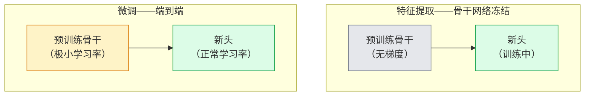

# 迁移学习与微调

> 别人花了一百万 GPU 小时教一个网络识别边缘、纹理和物体部件。你应该先借用这些特征，再开始自己的训练。

**类型：** 构建
**语言：** Python
**前置条件：** 第 4 阶段第 03 课（CNN）、第 4 阶段第 04 课（图像分类）
**时间：** ~75 分钟

## 学习目标

- 区分特征提取与微调（fine-tuning），根据数据集大小、领域距离和计算预算选择正确的方式
- 加载预训练骨干网络，替换其分类器头，在不足 20 行代码内将头训练到可用基线
- 使用判别学习率（discriminative learning rates）逐步解冻层，使早期通用特征获得比后期任务特定特征更小的更新
- 诊断三种常见故障：解冻块上学习率过高导致的特征漂移、小数据集上 BN 统计崩溃、灾难性遗忘

## 问题所在

在 ImageNet 上训练 ResNet-50 大约需要 2000 GPU 小时。很少有团队有预算为每个任务都做这件事。几乎每个团队实际发布的是：一个预训练骨干网络，加上在几百或几千张任务特定图像上训练的新头。

这不是捷径。任何 ImageNet 训练的 CNN 的第一个卷积块学习边缘和类 Gabor 滤波器。接下来几个块学习纹理和简单图案。中间块学习物体部件。最后几个块学习开始看起来像 1000 个 ImageNet 类别的组合。层次结构的前 90% 几乎不改变地迁移到医学成像、工业检测、卫星数据和其他所有视觉任务——因为自然界的边缘和纹理词汇量有限。你实际训练的是最后 10%。

正确地做迁移有三个等待着你的 bug：用过高的学习率破坏预训练特征，通过冻结过多使模型缺乏信息，以及让 BatchNorm 的运行统计数据漂移到网络其他部分从未学习过的小数据集。本课故意演示每一个。

## 核心概念

### 特征提取 vs 微调

两种模式，根据你对预训练特征的信任程度和拥有的数据量来选择。



经验法则：

| 数据集大小 | 领域距离 | 配方 |
|-----------|---------|------|
| < 1k 图像 | 接近 ImageNet | 冻结骨干，只训练头 |
| 1k-10k | 接近 | 冻结前 2-3 个阶段，微调其余部分 |
| 10k-100k | 任意 | 使用判别学习率端到端微调 |
| 100k+ | 较远 | 微调所有内容；如果领域足够远，考虑从头训练 |

"接近 ImageNet"大致意味着带有类对象内容的自然 RGB 照片。医学 CT 扫描、航拍卫星图像和显微镜图像是远距离领域——特征仍然有帮助，但需要让更多层适应。

### 为什么冻结在任何情况下都有效

CNN 学习到的 ImageNet 特征并不专门针对 1000 个类别，而是专门针对自然图像的统计特性：特定方向的边缘、纹理、对比度模式、形状基元。这些统计数据在几乎每一个人类能命名的视觉领域都是稳定的。这就是为什么在 ImageNet 上训练的模型，仅用新的线性头（不微调骨干）在 CIFAR-10 上零样本评估，能达到 80% 以上的准确率。头正在学习为当前任务对哪些已学特征进行加权。

### 判别学习率

当你确实解冻时，早期层应该比后期层训练得慢。早期层编码通用特征，你想要保留；后期层编码任务特定结构，需要移动很多。

```
典型配方：

  阶段 0（主干 + 第一组）：lr = base_lr / 100    （大部分固定）
  阶段 1：                  lr = base_lr / 10
  阶段 2：                  lr = base_lr / 3
  阶段 3（最后一个骨干组）：lr = base_lr
  头：                      lr = base_lr  （或稍高）
```

在 PyTorch 中，这只是传给优化器的一组参数组列表。一个模型，五个学习率，零额外代码。

### BatchNorm 问题

BN 层持有在 ImageNet 上计算的 `running_mean` 和 `running_var` 缓冲区。如果你的任务有不同的像素分布——不同的光照、不同的传感器、不同的颜色空间——这些缓冲区是错的。按优先级排列的三个选项：

1. **以训练模式微调 BN。** 让 BN 随其他内容一起更新其运行统计数据。当任务数据集中等大小（>= 5k 样本）时的默认选择。
2. **以 eval 模式冻结 BN。** 保留 ImageNet 统计数据，只训练权重。当数据集足够小使得 BN 的移动平均会有噪声时是正确的。
3. **用 GroupNorm 替换 BN。** 完全消除移动平均问题。用于每 GPU 批次大小很小的检测和分割骨干。

搞错这个会悄悄使准确率下降 5-15%。

### 头的设计

分类器头是 1-3 个线性层加上可选的 dropout。每个 torchvision 骨干都附带你需要替换的默认头：

```
backbone.fc = nn.Linear(backbone.fc.in_features, num_classes)          # ResNet
backbone.classifier[1] = nn.Linear(..., num_classes)                    # EfficientNet, MobileNet
backbone.heads.head = nn.Linear(..., num_classes)                       # torchvision ViT
```

对于小数据集，单个线性层通常就足够了。当任务分布距骨干训练分布较远时，添加一个隐藏层（Linear -> ReLU -> Dropout -> Linear）有帮助。

### 逐层学习率衰减

判别学习率的更平滑版本，用于现代微调（BEiT、DINOv2、ViT-B 微调）。不是将层分组为阶段，而是给每一层比上面那层稍小的学习率：

```
lr_layer_k = base_lr * decay^(L - k)
```

decay = 0.75，L = 12 个 Transformer 块时，第一个块以 `0.75^11 ≈ 0.04x` 头的学习率训练。对 Transformer 微调比对 CNN 更重要，CNN 通常阶段分组学习率就足够了。

### 评估什么

迁移学习运行需要两个你在从头训练时不会追踪的数字：

- **仅预训练准确率** — 骨干冻结时头的准确率。这是你的下限。
- **微调准确率** — 端到端训练后同一模型的准确率。这是你的上限。

如果微调低于仅预训练，你有学习率或 BN 的 bug。始终打印两者。

## 动手构建

### 步骤 1：加载预训练骨干并检查

```python
import torch
import torch.nn as nn
from torchvision.models import resnet18, ResNet18_Weights

backbone = resnet18(weights=ResNet18_Weights.IMAGENET1K_V1)
print(backbone)
print()
print("分类器头:", backbone.fc)
print("特征维度:", backbone.fc.in_features)
```

`ResNet18` 有四个阶段（`layer1..layer4`）加上一个主干（stem）和一个 `fc` 头。每个 torchvision 分类骨干都有类似的结构。

### 步骤 2：特征提取——冻结所有内容，替换头

```python
def make_feature_extractor(num_classes=10):
    model = resnet18(weights=ResNet18_Weights.IMAGENET1K_V1)
    for p in model.parameters():
        p.requires_grad = False
    model.fc = nn.Linear(model.fc.in_features, num_classes)
    return model

model = make_feature_extractor(num_classes=10)
trainable = sum(p.numel() for p in model.parameters() if p.requires_grad)
frozen = sum(p.numel() for p in model.parameters() if not p.requires_grad)
print(f"可训练: {trainable:>10,}")
print(f"冻结:   {frozen:>10,}")
```

只有 `model.fc` 是可训练的。骨干是一个冻结的特征提取器。

### 步骤 3：判别微调

一个工具函数，用特定阶段的学习率构建参数组。

```python
def discriminative_param_groups(model, base_lr=1e-3, decay=0.3):
    stages = [
        ["conv1", "bn1"],
        ["layer1"],
        ["layer2"],
        ["layer3"],
        ["layer4"],
        ["fc"],
    ]
    groups = []
    for i, names in enumerate(stages):
        lr = base_lr * (decay ** (len(stages) - 1 - i))
        params = [p for n, p in model.named_parameters()
                  if any(n.startswith(k) for k in names)]
        if params:
            groups.append({"params": params, "lr": lr, "name": "_".join(names)})
    return groups

model = resnet18(weights=ResNet18_Weights.IMAGENET1K_V1)
model.fc = nn.Linear(model.fc.in_features, 10)
for p in model.parameters():
    p.requires_grad = True

groups = discriminative_param_groups(model)
for g in groups:
    print(f"{g['name']:>10s}  lr={g['lr']:.2e}  params={sum(p.numel() for p in g['params']):>8,}")
```

`decay=0.3` 意味着每个阶段以下一阶段 30% 的速率训练。`fc` 获得 `base_lr`，`layer4` 获得 `0.3 * base_lr`，`conv1` 获得 `0.3^5 * base_lr ≈ 0.00243 * base_lr`。听起来极端；实证上有效。

### 步骤 4：BatchNorm 处理

一个冻结 BN 运行统计数据而不冻结其权重的辅助函数。

```python
def freeze_bn_stats(model):
    for m in model.modules():
        if isinstance(m, (nn.BatchNorm1d, nn.BatchNorm2d, nn.BatchNorm3d)):
            m.eval()
            for p in m.parameters():
                p.requires_grad = False
    return model
```

在每个 epoch 开始时的 `model.train()` 之后调用它。`model.train()` 将所有内容切换到训练模式；这只对 BN 层反转它。

### 步骤 5：最小端到端微调循环

```python
from torch.optim import SGD
from torch.utils.data import DataLoader
from torch.optim.lr_scheduler import CosineAnnealingLR
import torch.nn.functional as F

def fine_tune(model, train_loader, val_loader, device, epochs=5, base_lr=1e-3, freeze_bn=False):
    model = model.to(device)
    groups = discriminative_param_groups(model, base_lr=base_lr)
    optimizer = SGD(groups, momentum=0.9, weight_decay=1e-4, nesterov=True)
    scheduler = CosineAnnealingLR(optimizer, T_max=epochs)

    for epoch in range(epochs):
        model.train()
        if freeze_bn:
            freeze_bn_stats(model)
        tr_loss, tr_correct, tr_total = 0.0, 0, 0
        for x, y in train_loader:
            x, y = x.to(device), y.to(device)
            logits = model(x)
            loss = F.cross_entropy(logits, y, label_smoothing=0.1)
            optimizer.zero_grad()
            loss.backward()
            optimizer.step()
            tr_loss += loss.item() * x.size(0)
            tr_total += x.size(0)
            tr_correct += (logits.argmax(-1) == y).sum().item()
        scheduler.step()

        model.eval()
        va_total, va_correct = 0, 0
        with torch.no_grad():
            for x, y in val_loader:
                x, y = x.to(device), y.to(device)
                pred = model(x).argmax(-1)
                va_total += x.size(0)
                va_correct += (pred == y).sum().item()
        print(f"epoch {epoch}  train {tr_loss/tr_total:.3f}/{tr_correct/tr_total:.3f}  "
              f"val {va_correct/va_total:.3f}")
    return model
```

在 CIFAR-10 上使用上述配方进行五个 epoch，将 `ResNet18-IMAGENET1K_V1` 从约 70% 的零样本线性探测准确率提升到约 93% 的微调准确率。仅靠头，在不接触骨干的情况下，会在约 86% 处达到瓶颈。

### 步骤 6：渐进式解冻

一个每 epoch 从末端向开始解冻一个阶段的调度器。以一些额外 epoch 为代价减轻特征漂移。

```python
def progressive_unfreeze_schedule(model):
    stages = ["layer4", "layer3", "layer2", "layer1"]
    yielded = set()

    def start():
        for p in model.parameters():
            p.requires_grad = False
        for p in model.fc.parameters():
            p.requires_grad = True

    def unfreeze(epoch):
        if epoch < len(stages):
            name = stages[epoch]
            yielded.add(name)
            for n, p in model.named_parameters():
                if n.startswith(name):
                    p.requires_grad = True
            return name
        return None

    return start, unfreeze
```

在第一个 epoch 之前调用一次 `start()`。在每个 epoch 开始时调用 `unfreeze(epoch)`。每当可训练参数集发生变化时重建优化器，否则冻结的参数仍会持有混淆优化器的缓存动量。

## 实际使用

对于大多数真实任务，`torchvision.models` 加三行代码就足够了。上面更重的机制在库默认值无法修复的问题时才重要。

```python
from torchvision.models import resnet50, ResNet50_Weights

model = resnet50(weights=ResNet50_Weights.IMAGENET1K_V2)
model.fc = nn.Linear(model.fc.in_features, num_classes)
optimizer = torch.optim.AdamW(model.parameters(), lr=1e-4, weight_decay=1e-4)
```

另外两个生产级默认值：

- `timm` 提供约 800 个带有一致 API 的预训练视觉骨干（`timm.create_model("resnet50", pretrained=True, num_classes=10)`）。对于 torchvision zoo 之外的任何微调，它是标准选择。
- 对于 Transformer，`transformers.AutoModelForImageClassification.from_pretrained(name, num_labels=N)` 给你带有与文本模型相同加载语义的 ViT / BEiT / DeiT。

## 交付成果

本课产生：

- `outputs/prompt-fine-tune-planner.md` — 一个提示词，根据数据集大小、领域距离和计算预算选择特征提取、渐进式或端到端微调。
- `outputs/skill-freeze-inspector.md` — 一个技能，给定 PyTorch 模型，报告哪些参数是可训练的，哪些 BatchNorm 层处于 eval 模式，以及优化器是否真的在处理可训练参数。

## 练习

1. **（简单）** 在同一合成 CIFAR 数据集上，将 `ResNet18` 作为线性探测（骨干冻结）和完全微调各训练一次。并排报告两种准确率。解释哪个差距告诉你特征迁移良好，哪个告诉你不然。
2. **（中等）** 故意引入一个 bug：在骨干阶段而非头上设置 `base_lr = 1e-1`。展示训练损失爆炸，然后通过应用 `discriminative_param_groups` 辅助函数恢复。记录每个阶段开始发散的学习率。
3. **（困难）** 取一个医学成像数据集（如 CheXpert-small、PatchCamelyon 或 HAM10000），比较三种模式：(a) ImageNet 预训练冻结骨干 + 线性头；(b) ImageNet 预训练端到端微调；(c) 从头训练。报告每种情况的准确率和计算成本。在什么数据集大小下从头训练变得有竞争力？

## 关键术语

| 术语 | 人们怎么说 | 实际含义 |
|------|-----------|---------|
| 特征提取（Feature extraction） | "冻结并训练头" | 骨干参数冻结，只有新的分类器头接收梯度 |
| 微调（Fine-tuning） | "端到端重训练" | 所有参数可训练，通常比从头训练的学习率小得多 |
| 判别学习率（Discriminative LR） | "早期层用更小的学习率" | 优化器参数组，其中早期阶段学习率是后期阶段学习率的一小部分 |
| 逐层学习率衰减（Layer-wise LR decay） | "平滑的学习率梯度" | 每层学习率乘以 decay^(L - k)；常见于 Transformer 微调 |
| 灾难性遗忘（Catastrophic forgetting） | "模型失去了 ImageNet" | 过高的学习率在新任务信号被学习之前覆盖了预训练特征 |
| BN 统计漂移（BN statistics drift） | "运行均值错误" | 在与当前任务不同分布上计算的 BatchNorm running_mean/var，悄悄损害准确率 |
| 线性探测（Linear probe） | "冻结骨干 + 线性头" | 预训练特征的评估——在冻结表征之上最佳线性分类器的准确率 |
| 灾难性崩溃（Catastrophic collapse） | "一切都预测同一类" | 当微调学习率高到在头的梯度稳定之前破坏特征时发生 |

## 延伸阅读

- [深度神经网络中特征的可迁移性（Yosinski 等，2014）](https://arxiv.org/abs/1411.1792) — 量化跨层特征可迁移性的论文
- [通用语言模型微调（ULMFiT，Howard & Ruder，2018）](https://arxiv.org/abs/1801.06146) — 原始判别学习率/渐进式解冻配方；这些想法直接迁移到视觉
- [timm 文档](https://huggingface.co/docs/timm) — 现代视觉骨干和它们训练时精确微调默认值的参考
- [线性探测评估的简单框架（Kornblith 等，2019）](https://arxiv.org/abs/1805.08974) — 为什么线性探测准确率重要以及如何正确报告它
