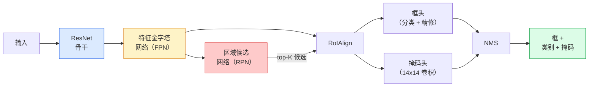

# 实例分割——Mask R-CNN

> 在 Faster R-CNN 检测器上添加一个微小的掩码分支，你就有了实例分割。难点在于 RoIAlign，而它比看起来更难。

**类型：** 构建 + 学习
**语言：** Python
**前置条件：** 第 4 阶段第 06 课（YOLO）、第 4 阶段第 07 课（U-Net）
**时间：** ~75 分钟

## 学习目标

- 端到端追踪 Mask R-CNN 架构：骨干、FPN、RPN、RoIAlign、框头、掩码头
- 从零实现 RoIAlign，解释为什么不再使用 RoIPool
- 使用 torchvision `maskrcnn_resnet50_fpn_v2` 预训练模型实现生产质量的实例掩码，并正确读取其输出格式
- 通过替换框头和掩码头并保持骨干冻结，在小型自定义数据集上微调 Mask R-CNN

## 问题所在

语义分割给你每类一个掩码。实例分割给你每个目标一个掩码，即使两个目标共享同一类别。计数个体、跨帧跟踪和测量（墙上每块砖的边界框、显微镜图像中每个细胞）都需要实例分割。

Mask R-CNN（He 等，2017）通过将实例分割重新定义为检测加掩码来解决这个问题。设计如此简洁，以至于此后五年几乎每篇实例分割论文都是 Mask R-CNN 的变体，torchvision 实现对中小型数据集来说仍是生产默认值。

难以解决的工程问题是采样：如何从角点不与像素边界对齐的候选框中裁剪出固定大小的特征区域？搞错这个会在整个流程中损失十分之一的 mAP 点。RoIAlign 是答案。

## 核心概念

### 架构



需要理解的五个部分：

1. **骨干（Backbone）** — 在 ImageNet 上训练的 ResNet-50 或 ResNet-101。在步长 4、8、16、32 处生成特征图层次结构。
2. **FPN（特征金字塔网络）** — 自顶向下 + 横向连接，为每个层级提供 C 个语义丰富特征的通道。检测查询与目标大小匹配的 FPN 层级。
3. **RPN（区域候选网络）** — 一个小型卷积头，在每个锚框位置预测"这里有目标吗？"和"如何精修框？"每张图像产生约 1000 个候选。
4. **RoIAlign** — 从任意 FPN 层级上的任意框采样固定大小（如 7x7）的特征块。双线性采样，无量化。
5. **头（Heads）** — 精修框并选择类别的两层框头，加上为每个候选输出 `28x28` 二进制掩码的小型卷积头。

### 为什么用 RoIAlign 而非 RoIPool

原始 Fast R-CNN 使用 RoIPool，它将候选框分割成网格，取每个单元中的最大特征，并将所有坐标四舍五入到整数。这种四舍五入将特征图与输入像素坐标错位多达一个完整的特征图像素——在 224x224 图像上影响小，当特征图步长为 32 时则是灾难性的。

```
RoIPool：
  框 (34.7, 51.3, 98.2, 142.9)
  四舍五入 -> (34, 51, 98, 142)
  分割网格 -> 对每个单元边界四舍五入
  每步累积错位

RoIAlign：
  框 (34.7, 51.3, 98.2, 142.9)
  在精确的浮点坐标使用双线性插值采样
  任何地方都不四舍五入
```

RoIAlign 在 COCO 上免费提升约 3-4 个掩码 AP 点。每个关注定位的检测器现在都使用它——YOLOv7 seg、RT-DETR、Mask2Former 都是如此。

### RPN 简述

在特征图的每个位置放置 K 个不同大小和形状的锚框。预测每个锚框的目标性分数和将锚框变为更合适框的回归偏移。按分数保留约 1000 个最高分框，在 IoU 0.7 处应用 NMS，将幸存者传递给头。RPN 用其自己的迷你损失训练——与第 6 课 YOLO 损失的结构相同，只是有两个类别（目标/非目标）。

### 掩码头

对于每个候选（经过 RoIAlign 后），掩码头是一个微小的 FCN：四个 3x3 卷积，一个 2x 转置卷积，最后一个 1x1 卷积在 `28x28` 分辨率产生 `num_classes` 个输出通道。只保留与预测类别对应的通道；其他通道被忽略。这将掩码预测与分类解耦。

将 28x28 掩码上采样到候选的原始像素大小以生成最终的二进制掩码。

### 损失函数

Mask R-CNN 有四个损失相加：

```
L = L_rpn_cls + L_rpn_box + L_box_cls + L_box_reg + L_mask
```

- `L_rpn_cls`、`L_rpn_box` — RPN 候选的目标性 + 框回归。
- `L_box_cls` — 头分类器上 (C+1) 个类别（包括背景）的交叉熵。
- `L_box_reg` — 头框精修的平滑 L1。
- `L_mask` — 28x28 掩码输出上的逐像素二进制交叉熵。

每个损失都有自己的默认权重；torchvision 实现将它们作为构造函数参数公开。

### 输出格式

`torchvision.models.detection.maskrcnn_resnet50_fpn_v2` 返回一个字典列表，每张图像一个：

```
{
    "boxes":  (N, 4)，像素坐标中的 (x1, y1, x2, y2)，
    "labels": (N,) 类别 ID，0 = 背景，所以索引从 1 开始，
    "scores": (N,) 置信度分数，
    "masks":  (N, 1, H, W)，[0, 1] 中的浮点掩码——在 0.5 处阈值化为二进制，
}
```

掩码已经是完整图像分辨率。28x28 头输出已在内部上采样。

## 动手构建

### 步骤 1：从零实现 RoIAlign

这是 Mask R-CNN 中作为代码比作为文字更容易理解的组件。

```python
import torch
import torch.nn.functional as F

def roi_align_single(feature, box, output_size=7, spatial_scale=1 / 16.0):
    """
    feature: (C, H, W) 单图像特征图
    box: (x1, y1, x2, y2) 原始图像像素坐标
    output_size: 输出网格的边长（框头为 7，掩码头为 14）
    spatial_scale: 特征图步长的倒数
    """
    C, H, W = feature.shape
    x1, y1, x2, y2 = [c * spatial_scale - 0.5 for c in box]
    bin_w = (x2 - x1) / output_size
    bin_h = (y2 - y1) / output_size

    grid_y = torch.linspace(y1 + bin_h / 2, y2 - bin_h / 2, output_size)
    grid_x = torch.linspace(x1 + bin_w / 2, x2 - bin_w / 2, output_size)
    yy, xx = torch.meshgrid(grid_y, grid_x, indexing="ij")

    gx = 2 * (xx + 0.5) / W - 1
    gy = 2 * (yy + 0.5) / H - 1
    grid = torch.stack([gx, gy], dim=-1).unsqueeze(0)
    sampled = F.grid_sample(feature.unsqueeze(0), grid, mode="bilinear",
                            align_corners=False)
    return sampled.squeeze(0)
```

每个数字都在双线性采样的位置。没有四舍五入，没有量化，没有丢失的梯度。

### 步骤 2：与 torchvision 的 RoIAlign 比较

```python
from torchvision.ops import roi_align

feature = torch.randn(1, 16, 50, 50)
boxes = torch.tensor([[0, 10, 20, 100, 90]], dtype=torch.float32)  # (batch_idx, x1, y1, x2, y2)

ours = roi_align_single(feature[0], boxes[0, 1:].tolist(), output_size=7, spatial_scale=1/4)
theirs = roi_align(feature, boxes, output_size=(7, 7), spatial_scale=1/4, sampling_ratio=1, aligned=True)[0]

print(f"我们的形状:   {tuple(ours.shape)}")
print(f"他们的形状:   {tuple(theirs.shape)}")
print(f"最大|差值|:   {(ours - theirs).abs().max().item():.3e}")
```

使用 `sampling_ratio=1` 和 `aligned=True`，两者匹配到 `1e-5` 以内。

### 步骤 3：加载预训练 Mask R-CNN

```python
import torch
from torchvision.models.detection import maskrcnn_resnet50_fpn_v2, MaskRCNN_ResNet50_FPN_V2_Weights

model = maskrcnn_resnet50_fpn_v2(weights=MaskRCNN_ResNet50_FPN_V2_Weights.DEFAULT)
model.eval()
print(f"参数: {sum(p.numel() for p in model.parameters()):,}")
```

4600 万参数，91 个类（COCO）。第一个类（ID 0）是背景；模型实际检测的所有内容从 ID 1 开始。

### 步骤 4：运行推理

```python
with torch.no_grad():
    x = torch.randn(3, 400, 600)
    predictions = model([x])
p = predictions[0]
print(f"boxes:  {tuple(p['boxes'].shape)}")
print(f"labels: {tuple(p['labels'].shape)}")
print(f"scores: {tuple(p['scores'].shape)}")
print(f"masks:  {tuple(p['masks'].shape)}")
```

掩码张量形状为 `(N, 1, H, W)`。在 0.5 处阈值化得到每个目标的二进制掩码：

```python
binary_masks = (p['masks'] > 0.5).squeeze(1)  # (N, H, W) 布尔值
```

### 步骤 5：替换头以使用自定义类别数

常见微调配方：复用骨干、FPN 和 RPN；替换两个分类器头。

```python
from torchvision.models.detection.faster_rcnn import FastRCNNPredictor
from torchvision.models.detection.mask_rcnn import MaskRCNNPredictor

def build_custom_maskrcnn(num_classes):
    model = maskrcnn_resnet50_fpn_v2(weights=MaskRCNN_ResNet50_FPN_V2_Weights.DEFAULT)
    in_features = model.roi_heads.box_predictor.cls_score.in_features
    model.roi_heads.box_predictor = FastRCNNPredictor(in_features, num_classes)
    in_features_mask = model.roi_heads.mask_predictor.conv5_mask.in_channels
    hidden_layer = 256
    model.roi_heads.mask_predictor = MaskRCNNPredictor(in_features_mask, hidden_layer, num_classes)
    return model

custom = build_custom_maskrcnn(num_classes=5)
print(f"自定义 cls_score.out_features: {custom.roi_heads.box_predictor.cls_score.out_features}")
```

`num_classes` 必须包含背景类，所以有 4 个目标类的数据集使用 `num_classes=5`。

### 步骤 6：冻结不需要训练的部分

在小数据集上，冻结骨干和 FPN。只有 RPN 目标性 + 回归和两个头学习。

```python
def freeze_backbone_and_fpn(model):
    # torchvision Mask R-CNN 将 FPN 打包在 `model.backbone` 内
    # （作为 `model.backbone.fpn`），所以迭代 `model.backbone.parameters()`
    # 同时覆盖 ResNet 特征层和 FPN 横向/输出卷积。
    for p in model.backbone.parameters():
        p.requires_grad = False
    return model

custom = freeze_backbone_and_fpn(custom)
trainable = sum(p.numel() for p in custom.parameters() if p.requires_grad)
print(f"冻结后可训练参数: {trainable:,}")
```

在 500 张图像的数据集上，这是收敛和过拟合之间的区别。

## 实际使用

torchvision 中 Mask R-CNN 的完整训练循环是 40 行，在任务之间不会有实质性变化——替换数据集即可。

```python
def train_step(model, images, targets, optimizer):
    model.train()
    loss_dict = model(images, targets)
    losses = sum(loss for loss in loss_dict.values())
    optimizer.zero_grad()
    losses.backward()
    optimizer.step()
    return {k: v.item() for k, v in loss_dict.items()}
```

`targets` 列表必须包含每张图像的字典，其中有 `boxes`、`labels` 和 `masks`（作为 `(num_instances, H, W)` 二进制张量）。模型在训练时返回四个损失的字典，在评估时返回预测列表，由 `model.training` 键控。

`pycocotools` 评估器对框和掩码都产生 mAP@IoU=0.5:0.95；你需要两个数字才能知道框头还是掩码头是瓶颈。

## 交付成果

本课产生：

- `outputs/prompt-instance-vs-semantic-router.md` — 一个提示词，问三个问题并选择实例 vs 语义 vs 全景，以及要开始的精确模型。
- `outputs/skill-mask-rcnn-head-swapper.md` — 一个技能，给定新的 `num_classes`，生成在任何 torchvision 检测模型上替换头的 10 行代码。

## 练习

1. **（简单）** 在 100 个随机框上验证你的 RoIAlign 与 `torchvision.ops.roi_align`。报告最大绝对差。也运行 RoIPool（2017 年前的行为），显示它在边界附近的框上偏差约 1-2 个特征图像素。
2. **（中等）** 在 50 张图像的自定义数据集（任意两个类：气球、鱼、坑洼、标志）上微调 `maskrcnn_resnet50_fpn_v2`。冻结骨干，训练 20 个 epoch，报告掩码 AP@0.5。
3. **（困难）** 将 Mask R-CNN 的掩码头替换为预测 56x56 而非 28x28 的版本。测量前后的 mAP@IoU=0.75。解释为什么增益（或缺乏增益）与预期的边界精度/内存权衡相匹配。

## 关键术语

| 术语 | 人们怎么说 | 实际含义 |
|------|-----------|---------|
| Mask R-CNN | "检测加掩码" | Faster R-CNN + 为每个候选每个类别预测 28x28 掩码的小型 FCN 头 |
| FPN（特征金字塔网络） | "特征金字塔" | 自顶向下 + 横向连接，为每个步长层级提供 C 个语义丰富特征的通道 |
| RPN（区域候选网络） | "区域候选器" | 每张图像产生约 1000 个目标/非目标候选的小型卷积头 |
| RoIAlign | "无四舍五入裁剪" | 从任意浮点坐标框双线性采样固定大小的特征网格 |
| RoIPool | "2017 年前的裁剪" | 与 RoIAlign 目的相同但四舍五入框坐标；已过时 |
| 掩码 AP（Mask AP） | "实例 mAP" | 用掩码 IoU 而非框 IoU 计算的平均精度；COCO 实例分割指标 |
| 二进制掩码头（Binary mask head） | "逐类掩码" | 为每个候选每个类别预测一个二进制掩码；只保留预测类别的通道 |
| 背景类（Background class） | "类别 0" | 包罗万象的"无目标"类别；真实类别的索引从 1 开始 |

## 延伸阅读

- [Mask R-CNN（He 等，2017）](https://arxiv.org/abs/1703.06870) — 论文；第 3 节关于 RoIAlign 是关键阅读
- [FPN：特征金字塔网络（Lin 等，2017）](https://arxiv.org/abs/1612.03144) — FPN 论文；每个现代检测器都使用它
- [torchvision Mask R-CNN 教程](https://pytorch.org/tutorials/intermediate/torchvision_tutorial.html) — 微调循环的参考
- [Detectron2 模型库](https://github.com/facebookresearch/detectron2/blob/main/MODEL_ZOO.md) — 生产实现，带有几乎所有检测和分割变体的训练权重
