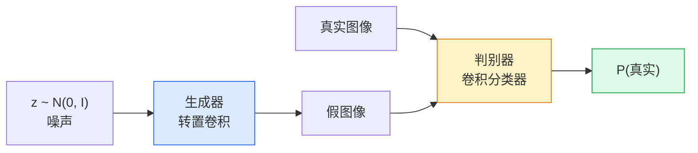
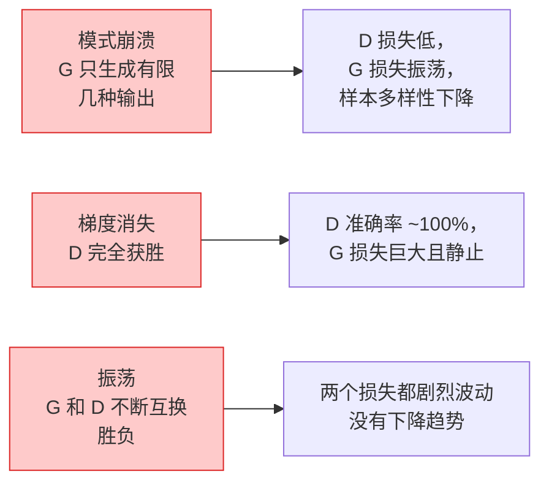

# 图像生成——GAN

> GAN 是两个神经网络的固定博弈。一个绘画，一个评判。它们共同进步，直到画作能欺骗评判者。

**类型：** 构建
**语言：** Python
**前置条件：** 第 4 阶段第 03 课（CNN）、第 3 阶段第 06 课（优化器）、第 3 阶段第 07 课（正则化）
**时间：** ~75 分钟

## 学习目标

- 解释生成器和判别器之间的极大极小博弈，以及为什么均衡对应于 p_model = p_data
- 在 PyTorch 中实现 DCGAN，60 行以内让它生成连贯的 32x32 合成图像
- 用三个标准技巧稳定 GAN 训练：非饱和损失、谱归一化、TTUR（双时间尺度更新规则）
- 读取能区分健康收敛、模式崩溃、振荡和判别器完全获胜的训练曲线

## 问题所在

分类训练网络将图像映射到标签。生成将问题反转：采样看起来来自同一分布的新图像。没有"正确"的输出可以对比；只有你想要模仿的分布。

标准损失函数（MSE、交叉熵）无法衡量"这个样本是否来自真实分布。"最小化逐像素误差产生模糊的平均值，而非真实样本。突破在于学习损失：训练第二个网络，其工作是区分真实和虚假，并用其判断来推动生成器。

GAN（Goodfellow 等，2014）定义了这个框架。到 2018 年，StyleGAN 生成了与照片无法区分的 1024x1024 人脸。扩散模型此后在质量和可控性上夺取了王座，但使扩散实用的每一个技巧——归一化选择、潜在空间、特征损失——都最先在 GAN 上被理解。

## 核心概念

### 两个网络



**生成器** G 接收噪声向量 `z` 并输出图像。**判别器** D 接收图像并输出单个标量：图像是真实的概率。

### 博弈

G 想让 D 犯错。D 想要正确。正式地：

```
min_G max_D  E_x[log D(x)] + E_z[log(1 - D(G(z)))]
```

从右往左读：D 在最大化对真实（`log D(real)`）和假（`log (1 - D(fake))`）图像的准确率。G 在最小化 D 对假图像的准确率——它想让 `D(G(z))` 高。

Goodfellow 证明这个极大极小博弈有一个全局均衡，其中 `p_G = p_data`，D 到处输出 0.5，生成分布和真实分布之间的 Jensen-Shannon 散度为零。难点在于到达那里。

### 非饱和损失

上面的形式数值不稳定。训练初期，对每个假图像 `D(G(z))` 接近零，所以 `log(1 - D(G(z)))` 对 G 的梯度消失。修复方法：翻转 G 的损失。

```
L_D = -E_x[log D(x)] - E_z[log(1 - D(G(z)))]
L_G = -E_z[log D(G(z))]                          # 非饱和
```

现在当 `D(G(z))` 接近零时，G 的损失很大，其梯度提供有效信息。每个现代 GAN 都用这个变体训练。

### DCGAN 架构规则

Radford、Metz、Chintala（2015）将多年的失败实验提炼为使 GAN 训练稳定的五条规则：

1. 用步长卷积替换池化（两个网络都是）。
2. 在生成器和判别器中都使用批归一化，G 的输出层和 D 的输入层除外。
3. 在更深的架构中移除全连接层。
4. G 在所有层使用 ReLU，输出层除外（输出层用 tanh 使输出在 [-1, 1]）。
5. D 在所有层使用 LeakyReLU（negative_slope=0.2）。

每个现代基于卷积的 GAN（StyleGAN、BigGAN、GigaGAN）仍然从这些规则开始，然后逐一替换各个部分。

### 失败模式及其特征



- **模式崩溃**：G 找到一张能欺骗 D 的图像，只产生这一张。修复：添加小批量判别、谱归一化或标签条件化。
- **判别器获胜**：D 变得太强太快，G 的梯度消失。修复：更小的 D、更低的 D 学习率，或在真实标签上应用标签平滑。
- **振荡**：两个网络不断互换胜负，永远不接近均衡。修复：TTUR（D 的学习速度比 G 快 2-4 倍），或切换到 Wasserstein 损失。

### 评估

GAN 没有真实值，那你怎么知道它们在运作？

- **样本检查** — 每个 epoch 结束时直接查看 64 个样本。不可或缺。
- **FID（Fréchet Inception 距离）** — 真实集和生成集的 Inception-v3 特征分布之间的距离。越低越好。社区标准。
- **Inception Score** — 较旧，更脆弱；优先选 FID。
- **生成模型的精确率/召回率** — 分别测量质量（精确率）和覆盖率（召回率）。比单独 FID 更有信息量。

对于小规模合成数据运行，样本检查就足够了。

## 动手构建

### 步骤 1：生成器

一个接收 64 维噪声并生成 32x32 图像的小型 DCGAN 生成器。

```python
import torch
import torch.nn as nn

class Generator(nn.Module):
    def __init__(self, z_dim=64, img_channels=3, feat=64):
        super().__init__()
        self.net = nn.Sequential(
            nn.ConvTranspose2d(z_dim, feat * 4, kernel_size=4, stride=1, padding=0, bias=False),
            nn.BatchNorm2d(feat * 4),
            nn.ReLU(inplace=True),
            nn.ConvTranspose2d(feat * 4, feat * 2, kernel_size=4, stride=2, padding=1, bias=False),
            nn.BatchNorm2d(feat * 2),
            nn.ReLU(inplace=True),
            nn.ConvTranspose2d(feat * 2, feat, kernel_size=4, stride=2, padding=1, bias=False),
            nn.BatchNorm2d(feat),
            nn.ReLU(inplace=True),
            nn.ConvTranspose2d(feat, img_channels, kernel_size=4, stride=2, padding=1, bias=False),
            nn.Tanh(),
        )

    def forward(self, z):
        return self.net(z.view(z.size(0), -1, 1, 1))
```

四个转置卷积，每个 `kernel_size=4, stride=2, padding=1`，使其整洁地将空间大小翻倍。通过 tanh 使输出激活在 [-1, 1]。

### 步骤 2：判别器

生成器的镜像。LeakyReLU，步长卷积，以标量对数几率结束。

```python
class Discriminator(nn.Module):
    def __init__(self, img_channels=3, feat=64):
        super().__init__()
        self.net = nn.Sequential(
            nn.Conv2d(img_channels, feat, kernel_size=4, stride=2, padding=1),
            nn.LeakyReLU(0.2, inplace=True),
            nn.Conv2d(feat, feat * 2, kernel_size=4, stride=2, padding=1, bias=False),
            nn.BatchNorm2d(feat * 2),
            nn.LeakyReLU(0.2, inplace=True),
            nn.Conv2d(feat * 2, feat * 4, kernel_size=4, stride=2, padding=1, bias=False),
            nn.BatchNorm2d(feat * 4),
            nn.LeakyReLU(0.2, inplace=True),
            nn.Conv2d(feat * 4, 1, kernel_size=4, stride=1, padding=0),
        )

    def forward(self, x):
        return self.net(x).view(-1)
```

最后一个卷积将 `4x4` 特征图减少到 `1x1`。输出是每张图像一个标量；只在损失计算时应用 sigmoid。

### 步骤 3：训练步骤

交替进行：每批次更新一次 D，然后更新一次 G。

```python
import torch.nn.functional as F

def train_step(G, D, real, z, opt_g, opt_d, device):
    real = real.to(device)
    bs = real.size(0)

    # D 步骤
    opt_d.zero_grad()
    d_real = D(real)
    d_fake = D(G(z).detach())
    loss_d = (F.binary_cross_entropy_with_logits(d_real, torch.ones_like(d_real))
              + F.binary_cross_entropy_with_logits(d_fake, torch.zeros_like(d_fake)))
    loss_d.backward()
    opt_d.step()

    # G 步骤
    opt_g.zero_grad()
    d_fake = D(G(z))
    loss_g = F.binary_cross_entropy_with_logits(d_fake, torch.ones_like(d_fake))
    loss_g.backward()
    opt_g.step()

    return loss_d.item(), loss_g.item()
```

D 步骤中的 `G(z).detach()` 至关重要：我们不想在其更新期间让梯度流入 G。忘记这一点是经典的初学者 bug。

### 步骤 4：在合成形状上的完整训练循环

```python
from torch.utils.data import DataLoader, TensorDataset
import numpy as np

def synthetic_images(num=2000, size=32, seed=0):
    rng = np.random.default_rng(seed)
    imgs = np.zeros((num, 3, size, size), dtype=np.float32) - 1.0
    for i in range(num):
        r = rng.uniform(6, 12)
        cx, cy = rng.uniform(r, size - r, size=2)
        yy, xx = np.meshgrid(np.arange(size), np.arange(size), indexing="ij")
        mask = (xx - cx) ** 2 + (yy - cy) ** 2 < r ** 2
        color = rng.uniform(-0.5, 1.0, size=3)
        for c in range(3):
            imgs[i, c][mask] = color[c]
    return torch.from_numpy(imgs)

device = "cuda" if torch.cuda.is_available() else "cpu"
data = synthetic_images()
loader = DataLoader(TensorDataset(data), batch_size=64, shuffle=True)

G = Generator(z_dim=64, img_channels=3, feat=32).to(device)
D = Discriminator(img_channels=3, feat=32).to(device)
opt_g = torch.optim.Adam(G.parameters(), lr=2e-4, betas=(0.5, 0.999))
opt_d = torch.optim.Adam(D.parameters(), lr=2e-4, betas=(0.5, 0.999))

for epoch in range(10):
    for (batch,) in loader:
        z = torch.randn(batch.size(0), 64, device=device)
        ld, lg = train_step(G, D, batch, z, opt_g, opt_d, device)
    print(f"epoch {epoch}  D {ld:.3f}  G {lg:.3f}")
```

`Adam(lr=2e-4, betas=(0.5, 0.999))` 是 DCGAN 默认值——低 beta1 防止动量项过度稳定对抗博弈。

### 步骤 5：采样

```python
@torch.no_grad()
def sample(G, n=16, z_dim=64, device="cpu"):
    G.eval()
    z = torch.randn(n, z_dim, device=device)
    imgs = G(z)
    imgs = (imgs + 1) / 2
    return imgs.clamp(0, 1)
```

采样前始终切换到 eval 模式。对于 DCGAN，这很重要，因为批归一化会使用运行统计数据而非批次的统计数据。

### 步骤 6：谱归一化

判别器中 BN 的即插即用替换，保证网络是 1-Lipschitz 的。修复大多数"D 获胜太强"的失败。

```python
from torch.nn.utils import spectral_norm

def build_sn_discriminator(img_channels=3, feat=64):
    return nn.Sequential(
        spectral_norm(nn.Conv2d(img_channels, feat, 4, 2, 1)),
        nn.LeakyReLU(0.2, inplace=True),
        spectral_norm(nn.Conv2d(feat, feat * 2, 4, 2, 1)),
        nn.LeakyReLU(0.2, inplace=True),
        spectral_norm(nn.Conv2d(feat * 2, feat * 4, 4, 2, 1)),
        nn.LeakyReLU(0.2, inplace=True),
        spectral_norm(nn.Conv2d(feat * 4, 1, 4, 1, 0)),
    )
```

将 `Discriminator` 换成 `build_sn_discriminator()`，你通常不再需要 TTUR 技巧。谱归一化是你可以应用的最简单的单一鲁棒性升级。

## 实际使用

对于严肃的生成，使用预训练权重或切换到扩散模型。两个标准库：

- `torch_fidelity` 无需编写自定义评估代码即可计算生成器的 FID / IS。
- `pytorch-gan-zoo`（遗留）和 `StudioGAN` 提供了 DCGAN、WGAN-GP、SN-GAN、StyleGAN 和 BigGAN 的经过测试的实现。

在 2026 年，GAN 仍然是以下场景的最佳选择：实时图像生成（延迟 <10 ms）、风格迁移、具有精确控制的图像到图像翻译（Pix2Pix、CycleGAN）。扩散在照片真实感和文本条件化方面占优。

## 交付成果

本课产生：

- `outputs/prompt-gan-training-triage.md` — 一个提示词，读取训练曲线描述，选择失败模式（模式崩溃、D 获胜、振荡）以及单一推荐修复方案。
- `outputs/skill-dcgan-scaffold.md` — 一个技能，根据 `z_dim`、目标 `image_size` 和 `num_channels` 编写 DCGAN 脚手架，包括训练循环和样本保存器。

## 练习

1. **（简单）** 在合成圆形数据集上训练上述 DCGAN，在每个 epoch 结束时保存 16 个样本的网格。到第几个 epoch 生成的圆形变得明显是圆形的？
2. **（中等）** 用谱归一化替换判别器的批归一化。并排训练两个版本。哪个收敛更快？哪个在三个种子上方差更小？
3. **（困难）** 实现条件 DCGAN：将类别标签输入 G 和 D（在 G 中将 one-hot 拼接到噪声，在 D 中拼接一个类别嵌入通道）。在第 7 课的合成"圆形 vs 方形"数据集上训练，通过用特定标签采样证明类别条件化有效。

## 关键术语

| 术语 | 人们怎么说 | 实际含义 |
|------|-----------|---------|
| 生成器（Generator, G） | "画东西的网络" | 将噪声映射到图像；训练来欺骗判别器 |
| 判别器（Discriminator, D） | "批评者" | 二元分类器；训练来区分真实图像和生成图像 |
| 极大极小（Minimax） | "博弈" | G 最小化、D 最大化对抗损失；均衡是 p_G = p_data |
| 非饱和损失（Non-saturating loss） | "数值上合理的版本" | G 的损失是 -log(D(G(z))) 而非 log(1 - D(G(z)))，以避免训练早期梯度消失 |
| 模式崩溃（Mode collapse） | "生成器只生成一种东西" | G 只生成数据分布的小子集；用 SN、小批量判别或更大批次修复 |
| TTUR | "两个学习率" | D 的学习速度比 G 快，通常快 2-4 倍；稳定训练 |
| 谱归一化（Spectral norm） | "1-Lipschitz 层" | 限制每层 Lipschitz 常数的权重归一化；防止 D 变得任意陡峭 |
| FID（Fréchet Inception 距离） | "Fréchet Inception 距离" | 真实集和生成集的 Inception-v3 特征分布之间的距离；标准评估指标 |

## 延伸阅读

- [生成对抗网络（Goodfellow 等，2014）](https://arxiv.org/abs/1406.2661) — 一切开始的论文
- [DCGAN（Radford、Metz、Chintala，2015）](https://arxiv.org/abs/1511.06434) — 使 GAN 可训练的架构规则
- [GAN 的谱归一化（Miyato 等，2018）](https://arxiv.org/abs/1802.05957) — 单一最有用的稳定化技巧
- [StyleGAN3（Karras 等，2021）](https://arxiv.org/abs/2106.12423) — SOTA GAN；读起来像过去十年每个技巧的精华集
