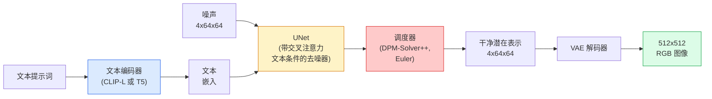

# Stable Diffusion — 架构与微调

> Stable Diffusion 是一个运行在预训练 VAE 潜在空间中的 DDPM，通过交叉注意力接受文本条件，使用快速确定性 ODE 求解器采样，并由无分类器引导（classifier-free guidance）控制。

**类型：** 学习 + 使用
**语言：** Python
**前置条件：** Phase 4 第 10 课（扩散模型）、Phase 7 第 02 课（自注意力）
**时长：** 约 75 分钟

## 学习目标

- 梳理 Stable Diffusion 流程的五个组件：VAE、文本编码器、U-Net、调度器、安全检查器——以及它们各自的实际作用
- 解释潜在扩散（latent diffusion）的原理，以及为何在 4×64×64 的潜在空间（而非 3×512×512 的图像空间）中训练能在不损失质量的情况下将计算量降低 48 倍
- 使用 `diffusers` 生成图像，执行图像到图像（img2img）、图像修复（inpainting）和 ControlNet 引导生成
- 在小型自定义数据集上使用 LoRA 微调 Stable Diffusion，并在推理时加载 LoRA 适配器

## 问题背景

直接在 512×512 RGB 图像上训练 DDPM 的代价极高。每个训练步需要通过一个接收 3×512×512=786,432 个输入值的 U-Net 进行反向传播，而采样需要对同一个 U-Net 进行 50+ 次前向传播。在 Stable Diffusion 1.5（2022 年发布）的质量水平下，像素空间的扩散训练大约需要 256 GPU 月，在消费级 GPU 上每张图像需要 10-30 秒。

使开源文本到图像生成变得可行的关键技巧是**潜在扩散**（latent diffusion，Rombach 等，CVPR 2022）。先训练一个 VAE，将 3×512×512 的图像映射到 4×64×64 的潜在张量（latent tensor）再映射回来，然后在潜在空间中进行扩散。计算量降低了 `(3×512×512)/(4×64×64)=48` 倍。采样时间从十几秒降至同一 GPU 上不到两秒。

几乎所有现代图像生成模型——SDXL、SD3、FLUX、HunyuanDiT、Wan-Video——都是潜在扩散模型，在自动编码器、去噪器（U-Net 或 DiT）和文本条件方面各有变化。学会 Stable Diffusion，就掌握了这一模板。

## 核心概念

### 流程架构



- **VAE** — 冻结的自动编码器。编码器将图像转换为潜在表示（用于 img2img 和训练），解码器将潜在表示还原为图像。
- **文本编码器（text encoder）** — SD 1.x/2.x 使用 CLIP 文本编码器，SDXL 使用 CLIP-L + CLIP-G，SD3/FLUX 使用 T5-XXL。输出 token 嵌入序列。
- **U-Net** — 去噪器。每个分辨率层级都有交叉注意力层，从潜在特征出发关注文本嵌入。
- **调度器（scheduler）** — 采样算法（DDIM、Euler、DPM-Solver++），选择 sigma，将预测噪声混回潜在表示。
- **安全检查器（safety checker）** — 可选的 NSFW/违规内容过滤器，作用于输出图像。

### 无分类器引导（Classifier-Free Guidance，CFG）

普通文本条件为每个提示词 `c` 学习 `epsilon_theta(x_t, t, c)`。CFG 使用同一个网络，训练时 10% 的情况下丢弃 `c`（替换为空嵌入），得到一个能同时预测条件噪声和无条件噪声的单一模型。推理时：

```
eps = eps_uncond + w * (eps_cond - eps_uncond)
```

`w` 是引导强度（guidance scale）。`w=0` 为无条件，`w=1` 为普通条件，`w>1` 以牺牲多样性为代价让输出"更贴近提示词"。SD 默认 `w=7.5`。

CFG 是文本到图像生成能达到生产质量的核心原因。没有它，提示词对输出的影响很弱；有了它，提示词主导输出。

### 潜在空间的几何性质

VAE 的 4 通道潜在表示不只是一个压缩图像，它是一个流形（manifold），其中的算术运算大致对应语义编辑（提示词工程和插值都在这里进行），扩散 U-Net 也将全部建模能力用于此空间。随机解码一个 4×64×64 的潜在张量不会得到随机图像——只会得到乱码，因为只有潜在空间中特定子流形上的点才能解码为有效图像。

两个重要结论：

1. **Img2img（图像到图像）** = 将图像编码为潜在表示，添加部分噪声，运行去噪器，再解码。由于编码几乎可逆，图像结构得以保留；内容根据提示词变化。
2. **Inpainting（图像修复）** = 与 img2img 类似，但去噪器只更新遮罩区域；未遮罩区域保持编码后的潜在表示不变。

### U-Net 架构

SD 的 U-Net 是第 10 课 TinyUNet 的大型版本，增加了三项内容：

- 每个空间分辨率的 **Transformer 块（transformer blocks）**，包含自注意力和对文本嵌入的交叉注意力。
- 通过 MLP 处理正弦编码的**时间嵌入（time embedding）**。
- 在匹配分辨率的编码器和解码器之间的**跳跃连接（skip connections）**。

SD 1.5 总参数量约 860M，SDXL 约 2.6B，FLUX 约 12B。参数量的跳增主要来自注意力层。

### LoRA 微调

对 Stable Diffusion 进行全量微调需要 20+ GB 的显存并更新 860M 个参数。LoRA（低秩适应，Low-Rank Adaptation）保持基础模型冻结，在注意力层中注入小型秩分解矩阵。SD 的 LoRA 适配器通常大小为 10-50 MB，在单个消费级 GPU 上训练仅需 10-60 分钟，推理时作为即插即用的修改直接加载。

```
原始：W_q : (d_in, d_out)   冻结
LoRA：W_q + alpha * (A @ B)   其中 A : (d_in, r), B : (r, d_out)

r 通常为 4-32
```

LoRA 是几乎所有社区微调模型的分发方式。CivitAI 和 Hugging Face 上托管了数百万个 LoRA。

### 常见调度器

- **DDIM** — 确定性，约 50 步，简单易用。
- **Euler ancestral（祖先 Euler）** — 随机性，30-50 步，样本略有更多创意。
- **DPM-Solver++ 2M Karras** — 确定性，20-30 步，生产环境默认选择。
- **LCM / TCD / Turbo** — 一致性模型和蒸馏变体，1-4 步，但质量有所牺牲。

在 `diffusers` 中切换调度器只需一行代码，有时无需重新训练就能解决采样问题。

## 动手实现

本课使用 `diffusers` 端到端完成，而非从头重建 Stable Diffusion。重建所需的组件（VAE、文本编码器、U-Net、调度器）各有专门课程；此处的目标是熟练掌握生产 API。

### 步骤一：文字生成图像

```python
import torch
from diffusers import StableDiffusionPipeline

pipe = StableDiffusionPipeline.from_pretrained(
    "runwayml/stable-diffusion-v1-5",
    torch_dtype=torch.float16,
).to("cuda")

image = pipe(
    prompt="a dog riding a skateboard in tokyo, studio ghibli style",
    guidance_scale=7.5,
    num_inference_steps=25,
    generator=torch.Generator("cuda").manual_seed(42),
).images[0]
image.save("dog.png")
```

`float16` 将显存减半且几乎无质量损失。使用默认 DPM-Solver++ 时，`num_inference_steps=25` 效果等同于 DDIM 的 `num_inference_steps=50`。

### 步骤二：切换调度器

```python
from diffusers import DPMSolverMultistepScheduler, EulerAncestralDiscreteScheduler

pipe.scheduler = DPMSolverMultistepScheduler.from_config(pipe.scheduler.config)
pipe.scheduler = EulerAncestralDiscreteScheduler.from_config(pipe.scheduler.config)
```

调度器状态与 U-Net 权重解耦。可以用 DDPM 训练，然后用任意调度器采样。

### 步骤三：图像到图像

```python
from diffusers import StableDiffusionImg2ImgPipeline
from PIL import Image

img2img = StableDiffusionImg2ImgPipeline.from_pretrained(
    "runwayml/stable-diffusion-v1-5",
    torch_dtype=torch.float16,
).to("cuda")

init_image = Image.open("dog.png").convert("RGB").resize((512, 512))
out = img2img(
    prompt="a dog riding a skateboard, oil painting",
    image=init_image,
    strength=0.6,
    guidance_scale=7.5,
).images[0]
```

`strength` 控制去噪前添加多少噪声（0.0=不变，1.0=完全重新生成）。0.5-0.7 是风格迁移的标准范围。

### 步骤四：图像修复（Inpainting）

```python
from diffusers import StableDiffusionInpaintPipeline

inpaint = StableDiffusionInpaintPipeline.from_pretrained(
    "runwayml/stable-diffusion-inpainting",
    torch_dtype=torch.float16,
).to("cuda")

image = Image.open("dog.png").convert("RGB").resize((512, 512))
mask = Image.open("dog_mask.png").convert("L").resize((512, 512))

out = inpaint(
    prompt="a cat",
    image=image,
    mask_image=mask,
    guidance_scale=7.5,
).images[0]
```

遮罩中白色像素的区域会被重新生成，黑色像素的区域保持不变。

### 步骤五：加载 LoRA

```python
pipe.load_lora_weights("sayakpaul/sd-lora-ghibli")
pipe.fuse_lora(lora_scale=0.8)

image = pipe(prompt="a village square in ghibli style").images[0]
```

`lora_scale` 控制强度：0.0=无效果，1.0=完全生效。`fuse_lora` 将适配器直接融合进权重以提升速度，但会阻止后续切换。加载其他适配器前需先调用 `pipe.unfuse_lora()`。

### 步骤六：LoRA 训练（概要）

实际 LoRA 训练位于 `peft` 或 `diffusers.training` 中。流程概要：

```python
# 伪代码
for step, batch in enumerate(dataloader):
    images, prompts = batch
    latents = vae.encode(images).latent_dist.sample() * 0.18215

    t = torch.randint(0, num_train_timesteps, (batch_size,))
    noise = torch.randn_like(latents)
    noisy_latents = scheduler.add_noise(latents, noise, t)

    text_emb = text_encoder(tokenizer(prompts))

    pred_noise = unet(noisy_latents, t, text_emb)  # LoRA 权重在此注入

    loss = F.mse_loss(pred_noise, noise)
    loss.backward()
    optimizer.step()
```

只有 LoRA 矩阵接收梯度；基础 U-Net、VAE 和文本编码器保持冻结。批量大小为 1 并开启梯度检查点（gradient checkpointing）时，可以在 8 GB 显存内完成训练。

## 生产实践

在生产环境中，你需要做的实际决策：

- **模型系列**：SD 1.5 适合开源社区微调，SDXL 提供更高保真度，SD3/FLUX 提供最先进的效果，并满足严格的许可证要求。
- **调度器**：20-30 步时选 DPM-Solver++ 2M Karras，延迟要求在 1 秒以下时选 LCM-LoRA。
- **精度**：4080/4090 上用 `float16`，A100 及更新型号上用 `bfloat16`，显存不足时用 `int8`（通过 `bitsandbytes` 或 `compel`）。
- **条件控制**：纯文本基本够用；需要更强控制时，在基础流程上加 ControlNet（Canny 边缘、深度图、姿态）。

批量生成时，社区工具选 `AUTO1111`/`ComfyUI`；生产 API 使用 `diffusers` + `accelerate` 或带 TensorRT 编译的 `optimum-nvidia`。

## 关键术语

| 术语 | 常见说法 | 实际含义 |
|------|---------|---------|
| 潜在扩散（Latent diffusion） | "在潜在表示中扩散" | 在 VAE 潜在空间（4×64×64）而非像素空间（3×512×512）运行整个 DDPM；计算量节省 48 倍 |
| VAE 缩放因子（VAE scale factor） | "0.18215" | 将 VAE 原始潜在表示重新缩放至约单位方差的常数；在所有 SD 流程中硬编码 |
| 无分类器引导（Classifier-free guidance） | "CFG" | 混合条件和无条件噪声预测；推理中影响最大的单一旋钮 |
| 调度器（Scheduler） | "采样器" | 将噪声和模型预测转换为去噪潜在轨迹的算法 |
| LoRA | "低秩适配器" | 在注意力层中注入小型秩分解矩阵，不修改基础权重的微调方法 |
| 交叉注意力（Cross-attention） | "文本-图像注意力" | 从潜在 token 出发关注文本 token；在每个 U-Net 层级注入提示词信息 |
| ControlNet | "结构条件控制" | 独立训练的适配器，通过额外输入（Canny 边缘、深度图、姿态、分割）引导 SD |
| DPM-Solver++ | "默认调度器" | 二阶确定性 ODE 求解器；2026 年在低步数（20-30 步）下质量最佳 |

## 延伸阅读

- [High-Resolution Image Synthesis with Latent Diffusion (Rombach et al., 2022)](https://arxiv.org/abs/2112.10752) — Stable Diffusion 论文，包含验证所有设计选择的消融实验
- [Classifier-Free Diffusion Guidance (Ho & Salimans, 2022)](https://arxiv.org/abs/2207.12598) — CFG 论文
- [LoRA: Low-Rank Adaptation of Large Language Models (Hu et al., 2021)](https://arxiv.org/abs/2106.09685) — LoRA 最初用于 NLP，几乎无需修改就迁移到了 SD
- [diffusers documentation](https://huggingface.co/docs/diffusers) — 每个 SD/SDXL/SD3/FLUX 流程的参考文档
