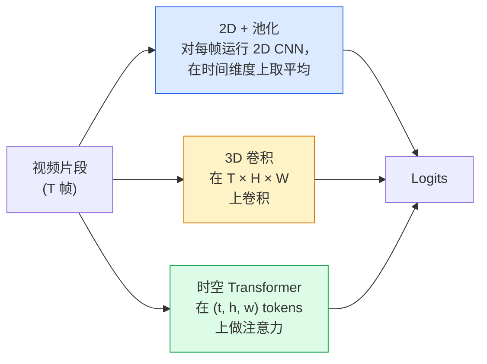

# 视频理解 — 时序建模

> 视频是一系列图像加上连接它们的物理规律。每种视频模型要么将时间视为额外的轴（3D 卷积），要么将其视为需要注意力处理的序列（Transformer），要么将其视为提取一次后进行池化的特征（2D+池化）。

**类型：** 学习 + 构建
**语言：** Python
**前置条件：** Phase 4 第 03 课（CNN），Phase 4 第 04 课（图像分类）
**时长：** 约 45 分钟

## 学习目标

- 区分三种主要的视频建模方法（2D+池化、3D 卷积、时空 Transformer），并预测其计算成本和精度的权衡
- 用 PyTorch 实现帧采样、时序池化和 2D+池化基线分类器
- 解释 I3D 的"膨胀（inflate）"3D 卷积核为何能从 ImageNet 权重迁移，以及分解（2+1)D 卷积的不同之处
- 了解标准动作识别数据集和评估指标：Kinetics-400/600、UCF101、Something-Something V2；片段级和视频级 top-1 准确率

## 问题背景

30 fps 的 30 秒视频包含 900 帧图像。朴素地看，视频分类就是对 900 张图像分别做图像分类，再做某种聚合。当动作在几乎每一帧都可见时（运动、烹饪、健身视频），这种方法有效；而当动作本身由运动定义时，这种方法就会失败：比如"把东西从左推到右"，在每一帧中看起来都只是两个静止的物体。

每种视频架构的核心问题是：时序结构何时被建模，以何种方式建模？这个答案决定了一切——计算成本、预训练策略、是否能复用 ImageNet 权重、模型在哪些数据集上训练。

本课有意比静态图像课程更短。核心图像机制已经就位，视频理解主要关注时序方面：采样、建模和聚合。

## 核心概念

### 三种架构家族



### 2D + 池化

取一个 2D CNN（ResNet、EfficientNet、ViT），对每个采样帧独立运行，对每帧嵌入做平均（或最大池化、注意力池化），将池化后的向量送入分类器。

优点：
- ImageNet 预训练权重可直接迁移。
- 实现最简单。
- 代价低：T 帧 × 单图推理成本。

缺点：
- 无法建模运动。动作 = 外观的聚合。
- 时序池化对顺序不敏感："开门"和"关门"看起来一样。

适用场景：外观主导的任务、在小型视频数据集上做迁移学习、初始基线。

### 3D 卷积

将 2D（H, W）卷积核替换为 3D（T, H, W）卷积核，网络同时在空间和时间上卷积。早期代表：C3D、I3D、SlowFast。

I3D 的技巧：取一个预训练的 2D ImageNet 模型，沿新的时间轴复制每个 2D 卷积核，将其"膨胀"为 3D 卷积核。3×3 的 2D 卷积变成 3×3×3 的 3D 卷积。这使 3D 模型拥有强大的预训练权重，无需从头训练。

优点：
- 直接建模运动。
- I3D 膨胀实现免费的迁移学习。

缺点：
- 比 2D 对应模型多 T/8 倍的 FLOPs（时间卷积核为 3，堆叠 3 次）。
- 时间卷积核较小；长程运动需要金字塔或双流方案。

适用场景：运动是信号的动作识别任务（Something-Something V2、Kinetics 中运动密集的类别）。

### 时空 Transformer

将视频分词为时空 patch 的网格，在所有 token 上做注意力。代表：TimeSformer、ViViT、Video Swin、VideoMAE。

重要的注意力模式：
- **联合（Joint）** — 在 (t, h, w) 上做一个大型注意力。关于 `T×H×W` 的二次复杂度，开销大。
- **分治（Divided）** — 每个块两次注意力：一次跨时间，一次跨空间。近似线性扩展。
- **分解（Factorised）** — 时间注意力和空间注意力在各块之间交替进行。

优点：
- 在所有主要基准上达到 SOTA 精度。
- 通过 patch 膨胀从图像 Transformer（ViT）迁移。
- 支持通过稀疏注意力处理长上下文视频。

缺点：
- 计算量大。
- 需要仔细选择注意力模式，否则运行时间会激增。

适用场景：大型数据集、高保真视频理解、多模态视频+文本任务。

### 帧采样

30 fps 的 10 秒片段有 300 帧，将全部 300 帧送入任何模型都是浪费。标准策略：

- **均匀采样（Uniform sampling）** — 在整个片段中均匀选取 T 帧。2D+池化的默认方式。
- **密集采样（Dense sampling）** — 随机选取连续的 T 帧窗口。3D 卷积常用，因为运动需要相邻帧。
- **多片段（Multi-clip）** — 从同一视频采样多个 T 帧窗口，对每个片段分类，测试时平均预测。

T 通常为 8、16、32 或 64。T 越大 = 时序信号越多，计算量也越大。

### 评估

两个层级：
- **片段级准确率（Clip-level accuracy）** — 模型看到一个 T 帧片段，报告 top-k。
- **视频级准确率（Video-level accuracy）** — 对每个视频的多个片段的预测取平均；更高且更稳定。

两者都需报告。片段/视频准确率为 78%/82% 的模型严重依赖测试时平均；80%/81% 的模型每个片段更鲁棒。

### 你会遇到的数据集

- **Kinetics-400/600/700** — 通用动作数据集。40 万个视频片段；YouTube URL（许多现已失效）。
- **Something-Something V2** — 运动定义的动作（"把 X 从左移到右"）。2D+池化无法解决。
- **UCF-101**、**HMDB-51** — 较旧、较小，仍有报告。
- **AVA** — 时空中的动作*定位*；比分类更难。

## 动手实现

### 步骤一：帧采样器

均匀采样和密集采样，适用于帧列表（或视频张量）。

```python
import numpy as np

def sample_uniform(num_frames_total, T):
    if num_frames_total <= T:
        return list(range(num_frames_total)) + [num_frames_total - 1] * (T - num_frames_total)
    step = num_frames_total / T
    return [int(i * step) for i in range(T)]


def sample_dense(num_frames_total, T, rng=None):
    rng = rng or np.random.default_rng()
    if num_frames_total <= T:
        return list(range(num_frames_total)) + [num_frames_total - 1] * (T - num_frames_total)
    start = int(rng.integers(0, num_frames_total - T + 1))
    return list(range(start, start + T))
```

两者都返回 `T` 个索引，用于切片视频张量。

### 步骤二：2D+池化基线

对每帧运行 2D ResNet-18，对特征做平均池化，再分类。

```python
import torch
import torch.nn as nn
from torchvision.models import resnet18, ResNet18_Weights

class FramePool(nn.Module):
    def __init__(self, num_classes=400, pretrained=True):
        super().__init__()
        weights = ResNet18_Weights.IMAGENET1K_V1 if pretrained else None
        backbone = resnet18(weights=weights)
        self.features = nn.Sequential(*(list(backbone.children())[:-1]))  # 保留全局平均池化
        self.head = nn.Linear(512, num_classes)

    def forward(self, x):
        # x: (N, T, 3, H, W)
        N, T = x.shape[:2]
        x = x.view(N * T, *x.shape[2:])
        feats = self.features(x).view(N, T, -1)
        pooled = feats.mean(dim=1)
        return self.head(pooled)

model = FramePool(num_classes=10)
x = torch.randn(2, 8, 3, 224, 224)
print(f"output: {model(x).shape}")
print(f"params: {sum(p.numel() for p in model.parameters()):,}")
```

一千一百万个参数，ImageNet 预训练，逐帧运行，取平均，分类。在外观主导的任务上，这个基线通常在正式 3D 模型的 5-10 个百分点以内——有时甚至更好，因为它复用了更强的 ImageNet 骨干。

### 步骤三：I3D 风格的膨胀 3D 卷积

通过沿新的时间轴重复权重，将单个 2D 卷积转换为 3D 卷积。

```python
def inflate_2d_to_3d(conv2d, time_kernel=3):
    out_c, in_c, kh, kw = conv2d.weight.shape
    weight_3d = conv2d.weight.data.unsqueeze(2)  # (out, in, 1, kh, kw)
    weight_3d = weight_3d.repeat(1, 1, time_kernel, 1, 1) / time_kernel
    conv3d = nn.Conv3d(in_c, out_c, kernel_size=(time_kernel, kh, kw),
                        padding=(time_kernel // 2, conv2d.padding[0], conv2d.padding[1]),
                        stride=(1, conv2d.stride[0], conv2d.stride[1]),
                        bias=False)
    conv3d.weight.data = weight_3d
    return conv3d

conv2d = nn.Conv2d(3, 64, kernel_size=3, padding=1, bias=False)
conv3d = inflate_2d_to_3d(conv2d, time_kernel=3)
print(f"2D weight shape:  {tuple(conv2d.weight.shape)}")
print(f"3D weight shape:  {tuple(conv3d.weight.shape)}")
x = torch.randn(1, 3, 8, 56, 56)
print(f"3D output shape:  {tuple(conv3d(x).shape)}")
```

除以 `time_kernel` 保持激活值大致恒定——对于第一次前向传播不破坏批归一化统计至关重要。

### 步骤四：分解（2+1)D 卷积

将 3D 卷积拆分为一个 2D（空间）卷积和一个 1D（时间）卷积。相同的感受野，参数更少，在某些基准上精度更高。

```python
class Conv2Plus1D(nn.Module):
    def __init__(self, in_c, out_c, kernel_size=3):
        super().__init__()
        mid_c = (in_c * out_c * kernel_size * kernel_size * kernel_size) \
                // (in_c * kernel_size * kernel_size + out_c * kernel_size)
        self.spatial = nn.Conv3d(in_c, mid_c, kernel_size=(1, kernel_size, kernel_size),
                                 padding=(0, kernel_size // 2, kernel_size // 2), bias=False)
        self.bn = nn.BatchNorm3d(mid_c)
        self.act = nn.ReLU(inplace=True)
        self.temporal = nn.Conv3d(mid_c, out_c, kernel_size=(kernel_size, 1, 1),
                                  padding=(kernel_size // 2, 0, 0), bias=False)

    def forward(self, x):
        return self.temporal(self.act(self.bn(self.spatial(x))))

c = Conv2Plus1D(3, 64)
x = torch.randn(1, 3, 8, 56, 56)
print(f"(2+1)D output: {tuple(c(x).shape)}")
```

完整的 R(2+1)D 网络与 ResNet-18 相同，只是将每个 3×3 卷积替换为 `Conv2Plus1D`。

## 生产实践

两个库涵盖了生产视频工作：

- `torchvision.models.video` — R(2+1)D、MViT、Swin3D，带有预训练的 Kinetics 权重。与图像模型相同的 API。
- `pytorchvideo`（Meta）— 模型库，Kinetics/SSv2/AVA 的数据加载器，标准变换。

对于视觉-语言视频模型（视频描述、视频问答），使用 `transformers`（`VideoMAE`、`VideoLLaMA`、`InternVideo`）。

## 关键术语

| 术语 | 常见说法 | 实际含义 |
|------|---------|---------|
| 2D + 池化 | "逐帧分类器" | 对每个采样帧运行 2D CNN，在时间维度上平均池化特征，分类 |
| 3D 卷积（3D convolution） | "时空卷积核" | 在 (T, H, W) 上卷积的卷积核；可以原生建模运动 |
| 膨胀（Inflation） | "将 2D 权重提升到 3D" | 通过沿新时间轴重复 2D 卷积权重来初始化 3D 卷积权重，再除以 kernel_T 以保持激活尺度 |
| (2+1)D | "分解卷积" | 将 3D 分解为 2D 空间 + 1D 时间；参数更少，两者之间有额外的非线性 |
| 分治注意力（Divided attention） | "先时间后空间" | Transformer 块中每层有两次注意力：一次跨同一帧的 token，一次跨同一位置的 token |
| 片段（Clip） | "T 帧窗口" | 采样得到的 T 帧子序列；视频模型处理的单元 |
| 片段 vs 视频准确率 | "两种评估设置" | 片段 = 每个视频一次采样，视频 = 多个采样片段的平均 |
| Kinetics | "视频界的 ImageNet" | 400-700 个动作类别，30 万+ YouTube 视频片段，标准视频预训练数据集 |

## 延伸阅读

- [I3D: Quo Vadis, Action Recognition (Carreira & Zisserman, 2017)](https://arxiv.org/abs/1705.07750) — 引入膨胀技术和 Kinetics 数据集
- [R(2+1)D: A Closer Look at Spatiotemporal Convolutions (Tran et al., 2018)](https://arxiv.org/abs/1711.11248) — 分解卷积，至今仍是强基线
- [TimeSformer: Is Space-Time Attention All You Need? (Bertasius et al., 2021)](https://arxiv.org/abs/2102.05095) — 第一个强力视频 Transformer
- [VideoMAE (Tong et al., 2022)](https://arxiv.org/abs/2203.12602) — 视频的掩码自编码器预训练；当前主流预训练方法
