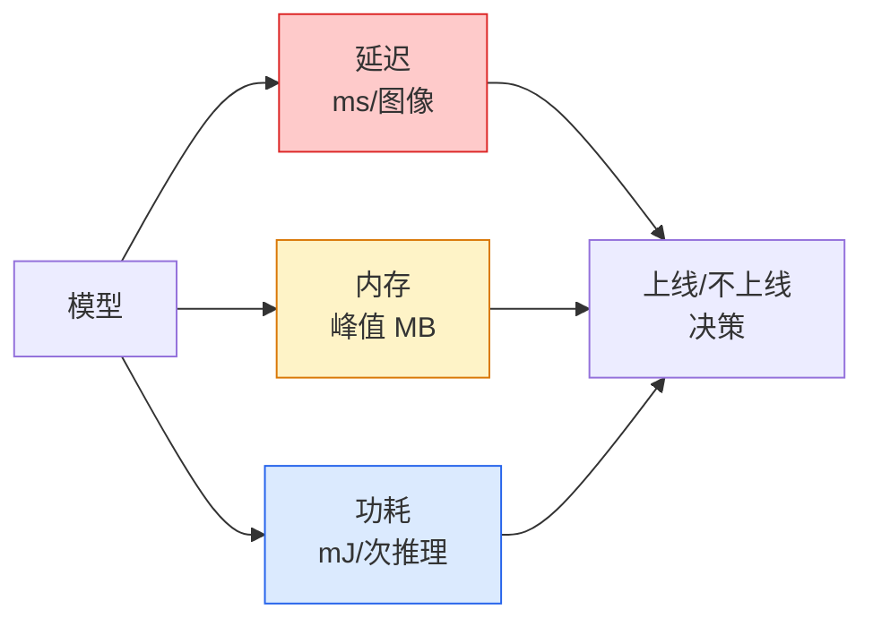

# 实时视觉 — 边缘部署

> 边缘推理是让一个 90% 精度的模型在 2 GB 内存的设备上以 30 fps 运行的工程学。每一个百分点的精度都要换算成毫秒级的延迟。

**类型：** 学习 + 构建
**语言：** Python
**前置条件：** Phase 4 第 04 课（图像分类），Phase 10 第 11 课（量化）
**时长：** 约 75 分钟

## 学习目标

- 测量任意 PyTorch 模型的推理延迟、峰值内存和吞吐量，并理解 FLOPs/参数量/延迟的权衡
- 使用 PyTorch 的训练后量化（PTQ）将视觉模型量化到 INT8，并验证精度损失 < 1%
- 导出到 ONNX 并用 ONNX Runtime 或 TensorRT 编译；列举三种最常见的导出失败及其修复方法
- 解释何时为边缘约束选择 MobileNetV3、EfficientNet-Lite、ConvNeXt-Tiny 或 MobileViT

## 问题背景

训练时的视觉模型是一个浮点怪兽。1 亿个参数，每次前向传播 10 GFLOPs，2 GB 的显存。这些都放不进手机、汽车娱乐系统、工业相机或无人机。交付一个视觉系统意味着在小 100 倍的预算内提供相同的预测能力。

三个旋钮完成大部分工作：模型选择（相同方案下更小的架构）、量化（INT8 代替 FP32）和推理运行时（ONNX Runtime、TensorRT、Core ML、TFLite）。调对它们是工作站演示和在 30 美元摄像头模块上出货的产品之间的区别。

本课先建立测量规范（无法测量的东西无法优化），然后依次介绍这三个旋钮。目标不是学会每种边缘运行时，而是了解有哪些杠杆，以及如何验证每个杠杆达到了预期效果。

## 核心概念

### 三种预算



- **延迟**：p50、p95、p99。仅平均 p50 会隐藏对实时系统至关重要的尾部行为。
- **峰值内存**：设备曾经见到的最大值，而非稳态平均值。重要，因为嵌入式目标上的内存溢出（OOM）是致命的。
- **功耗/能耗**：电池供电设备上每次推理的毫焦耳。通常用 CPU/GPU 利用率 × 时间来代理。

（模型, 延迟, 内存, 精度）的表格是边缘决策所依据的依据。每个单元格都在目标设备上测量，而非在工作站上。

### 测量规范

每个边缘性能分析都应遵循的三条规则：

1. 在测量前用 5-10 次虚拟前向传播**预热（warm up）**模型。冷缓存和 JIT 编译会产生不具代表性的初始数据。
2. 在定时块前后用 `torch.cuda.synchronize()` **同步** GPU 工作负载。没有同步，测量的是内核分发（dispatch），而非内核执行（execution）。
3. **固定输入尺寸**为生产分辨率。224×224 的延迟不是 512×512 的延迟。

### FLOPs 作为代理指标

FLOPs（每次推理的浮点运算次数）是一种便宜的、与设备无关的延迟代理。适合架构比较，作为绝对挂钟时间会有误导性。FLOPs 多 10% 的模型在实践中可能快 2 倍，因为它使用了硬件友好的算子（深度卷积编译良好，大的 7×7 卷积则不然）。

规则：架构搜索用 FLOPs，部署决策用设备上的延迟。

### 量化一段话

用 INT8 替换 FP32 权重和激活。模型大小减少 4 倍，内存带宽减少 4 倍，在有 INT8 内核的硬件上计算减少 2-4 倍（每个现代移动 SoC、每个带 Tensor Core 的 NVIDIA GPU）。使用训练后静态量化（PTQ），视觉任务的精度损失通常为 0.1-1 个百分点。

类型：

- **动态（Dynamic）** — 将权重量化为 INT8，激活用 FP 计算。容易，加速效果小。
- **静态训练后（Static PTQ）** — 量化权重 + 在小型校准集上校准激活范围。比动态量化快得多。
- **量化感知训练（QAT，Quantisation-aware training）** — 在训练期间模拟量化，使模型学会适应。精度最好，需要标注数据。

对于视觉任务，训练后静态量化以 5% 的工作量获得 95% 的收益。仅在 PTQ 的精度损失不可接受时才使用 QAT。

### 剪枝和蒸馏

- **剪枝（Pruning）** — 移除不重要的权重（基于幅度）或通道（结构化）。对过参数化的模型效果好；对已经紧凑的架构用处不大。
- **蒸馏（Distillation）** — 训练小型学生模型模仿大型教师模型的 logits。通常能恢复大部分因缩小模型而损失的精度。生产边缘模型的标准做法。

### 推理运行时

- **PyTorch eager** — 慢，不用于部署。仅用于开发。
- **TorchScript** — 遗留方案。已被 `torch.compile` 和 ONNX 导出取代。
- **ONNX Runtime** — 中立运行时。CPU、CUDA、CoreML、TensorRT、OpenVINO 都有 ONNX provider。从这里开始。
- **TensorRT** — NVIDIA 的编译器。NVIDIA GPU（工作站和 Jetson）上延迟最低。与 ONNX Runtime 集成或独立使用。
- **Core ML** — Apple 用于 iOS/macOS 的运行时。需要 `.mlmodel` 或 `.mlpackage`。
- **TFLite** — Google 用于 Android/ARM 的运行时。需要 `.tflite`。
- **OpenVINO** — Intel 用于 CPU/VPU 的运行时。需要 `.xml` + `.bin`。

实践中：导出 PyTorch → ONNX → 选择目标平台的运行时。ONNX 是通用语言。

### 边缘架构选择

| 预算 | 模型 | 理由 |
|------|------|------|
| < 300 万参数 | MobileNetV3-Small | 随处编译，良好基线 |
| 300-1000 万 | EfficientNet-Lite-B0 | TFLite 上精度/参数比最佳 |
| 1000-2000 万 | ConvNeXt-Tiny | 精度/参数比最佳，CPU 友好 |
| 2000-3000 万 | MobileViT-S 或 EfficientViT | 具有 ImageNet 精度的 Transformer |
| 3000-8000 万 | Swin-V2-Tiny | 若技术栈支持窗口注意力 |

除非有特殊原因，否则对所有这些模型量化到 INT8。

## 动手实现

### 步骤一：正确测量延迟

```python
import time
import torch

def measure_latency(model, input_shape, device="cpu", warmup=10, iters=50):
    model = model.to(device).eval()
    x = torch.randn(input_shape, device=device)
    with torch.no_grad():
        for _ in range(warmup):
            model(x)
        if device == "cuda":
            torch.cuda.synchronize()
        times = []
        for _ in range(iters):
            if device == "cuda":
                torch.cuda.synchronize()
            t0 = time.perf_counter()
            model(x)
            if device == "cuda":
                torch.cuda.synchronize()
            times.append((time.perf_counter() - t0) * 1000)
    times.sort()
    return {
        "p50_ms": times[len(times) // 2],
        "p95_ms": times[int(len(times) * 0.95)],
        "p99_ms": times[int(len(times) * 0.99)],
        "mean_ms": sum(times) / len(times),
    }
```

预热，同步，使用 `time.perf_counter()`。报告百分位数，而非仅仅均值。

### 步骤二：参数量和 FLOPs 计数

```python
def parameter_count(model):
    return sum(p.numel() for p in model.parameters())

def flops_estimate(model, input_shape):
    """
    仅针对卷积/线性层的粗略 FLOP 计数。生产中使用 `fvcore` 或 `ptflops`。
    """
    total = 0
    def conv_hook(m, inp, out):
        nonlocal total
        c_out, c_in, kh, kw = m.weight.shape
        h, w = out.shape[-2:]
        total += 2 * c_in * c_out * kh * kw * h * w
    def linear_hook(m, inp, out):
        nonlocal total
        total += 2 * m.in_features * m.out_features
    hooks = []
    for m in model.modules():
        if isinstance(m, torch.nn.Conv2d):
            hooks.append(m.register_forward_hook(conv_hook))
        elif isinstance(m, torch.nn.Linear):
            hooks.append(m.register_forward_hook(linear_hook))
    model.eval()
    with torch.no_grad():
        model(torch.randn(input_shape))
    for h in hooks:
        h.remove()
    return total
```

实际项目中使用 `fvcore.nn.FlopCountAnalysis` 或 `ptflops`；它们能正确处理每种模块类型。

### 步骤三：训练后静态量化

```python
def quantise_ptq(model, calibration_loader, backend="x86"):
    import torch.ao.quantization as tq
    model = model.eval().cpu()
    model.qconfig = tq.get_default_qconfig(backend)
    tq.prepare(model, inplace=True)
    with torch.no_grad():
        for x, _ in calibration_loader:
            model(x)
    tq.convert(model, inplace=True)
    return model
```

三个步骤：配置、准备（插入观测器）、用真实数据校准、转换（融合 + 量化）。需要模型已融合（`Conv -> BN -> ReLU` → `ConvBnReLU`），`torch.ao.quantization.fuse_modules` 可处理此问题。

### 步骤四：导出到 ONNX

```python
def export_onnx(model, sample_input, path="model.onnx"):
    model = model.eval()
    torch.onnx.export(
        model,
        sample_input,
        path,
        input_names=["input"],
        output_names=["output"],
        dynamic_axes={"input": {0: "batch"}, "output": {0: "batch"}},
        opset_version=17,
    )
    return path
```

`opset_version=17` 是 2026 年的安全默认值。`dynamic_axes` 允许用任意批量大小运行 ONNX 模型。

### 步骤五：基准测试和比较不同方案

```python
import torch.nn as nn
from torchvision.models import mobilenet_v3_small

def compare_regimes():
    model = mobilenet_v3_small(weights=None, num_classes=10)
    params = parameter_count(model)
    flops = flops_estimate(model, (1, 3, 224, 224))
    lat_fp32 = measure_latency(model, (1, 3, 224, 224), device="cpu")
    print(f"FP32 MobileNetV3-Small: {params:,} params  {flops/1e9:.2f} GFLOPs  "
          f"p50={lat_fp32['p50_ms']:.2f}ms  p95={lat_fp32['p95_ms']:.2f}ms")
```

对 `resnet50`、`efficientnet_v2_s` 和 `convnext_tiny` 运行同一函数，就得到了部署决策所需的对比表格。

## 生产实践

生产技术栈收敛在三条路径之一：

- **Web/无服务器**：PyTorch → ONNX → ONNX Runtime（CPU 或 CUDA provider）。最简单，大多数场景足够。
- **NVIDIA 边缘（Jetson、GPU 服务器）**：PyTorch → ONNX → TensorRT。延迟最低，工程投入最大。
- **移动端**：PyTorch → ONNX → Core ML（iOS）或 TFLite（Android）。导出前先量化。

测量方面，`torch-tb-profiler`、`nvprof`/`nsys` 和 macOS 上的 Instruments 提供逐层分解。`benchmark_app`（OpenVINO）和 `trtexec`（TensorRT）提供独立的命令行性能数字。

## 关键术语

| 术语 | 常见说法 | 实际含义 |
|------|---------|---------|
| 延迟（Latency） | "有多快" | 从输入到输出的时间；p50/p95/p99 百分位数，而非均值 |
| FLOPs | "模型大小" | 每次前向传播的浮点运算次数；计算成本的粗略代理 |
| INT8 量化 | "8 位" | 用 8 位整数替换 FP32 权重/激活；约小 4 倍，快 2-4 倍 |
| PTQ | "训练后量化" | 无需重新训练地量化已训练模型；简单，通常足够 |
| QAT | "量化感知训练" | 训练期间模拟量化；精度最好，需要标注数据 |
| ONNX | "中立格式" | 每种主流推理运行时都支持的模型交换格式 |
| TensorRT | "NVIDIA 编译器" | 将 ONNX 编译为针对 NVIDIA GPU 优化的引擎 |
| 蒸馏（Distillation） | "教师→学生" | 训练小模型模仿大模型的 logits；恢复大部分精度损失 |

## 延伸阅读

- [EfficientNet (Tan & Le, 2019)](https://arxiv.org/abs/1905.11946) — 用于高效架构的复合缩放
- [MobileNetV3 (Howard et al., 2019)](https://arxiv.org/abs/1905.02244) — 带有 h-swish 和 squeeze-excite 的移动优先架构
- [A Practical Guide to TensorRT Optimization (NVIDIA)](https://developer.nvidia.com/blog/accelerating-model-inference-with-tensorrt-tips-and-best-practices-for-pytorch-users/) — 如何实际获得论文中的吞吐量数据
- [ONNX Runtime docs](https://onnxruntime.ai/docs/) — 量化、图优化、provider 选择
