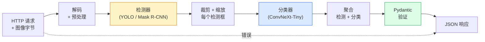

# 构建完整视觉流程 — 综合项目

> 生产级视觉系统是一条由数据契约串联而成的模型和规则链。Phase 4 中的各个组件已经准备就绪；综合项目将它们端到端地连接起来。

**类型：** 构建
**语言：** Python
**前置条件：** Phase 4 第 01-15 课
**时长：** 约 120 分钟

## 学习目标

- 设计一个生产视觉流程，检测目标、分类并输出结构化 JSON——处理每种失败路径
- 将检测器（Mask R-CNN 或 YOLO）、分类器（ConvNeXt-Tiny）和数据契约（Pydantic）接入同一个服务
- 对端到端流程进行基准测试，找出第一个瓶颈（通常是预处理，其次是检测器）
- 交付一个最小 FastAPI 服务，接受图像上传、运行流程，并返回带分类的检测结果

## 问题背景

单个视觉模型是有用的；视觉产品是它们的链条。零售货架审计是检测器 + 商品分类器 + 价格 OCR 流程。自动驾驶是 2D 检测器 + 3D 检测器 + 分割器 + 跟踪器 + 规划器。医疗预筛查是分割器 + 区域分类器 + 临床医生界面。

连接这些链条是将 ML 原型与产品区分开的关键。模型之间的每个接口都是新的 bug 发生地。每次坐标变换、每次归一化、每次掩码缩放都是潜在的静默失败点。流程的强度取决于其最薄弱的接口。

本综合项目建立最小可行流程：检测 + 分类 + 结构化输出 + 服务层。Phase 4 中的其他一切都可以插入这个骨架：将 Mask R-CNN 换成 YOLOv8，增加 OCR 头，增加分割分支，增加跟踪器。架构稳定，组件可替换。

## 核心概念

### 流程架构



七个阶段。两个模型阶段代价高昂；其余五个阶段是 bug 聚集的地方。

### 用 Pydantic 实现数据契约

每个模型边界变成一个类型化对象。这将静默失败转变为响亮的失败。

```
Detection(
    box: tuple[float, float, float, float],   # (x1, y1, x2, y2)，绝对像素坐标
    score: float,                              # [0, 1]
    class_id: int,                             # 来自检测器的标签映射
    mask: Optional[list[list[int]]],           # 若存在则为 RLE 编码
)

PipelineResult(
    image_id: str,
    detections: list[Detection],
    classifications: list[Classification],
    inference_ms: float,
)
```

当检测器返回的框格式是 `(cx, cy, w, h)` 而非 `(x1, y1, x2, y2)` 时，Pydantic 的验证在边界处失败，你会立即发现问题，而不是调试一个静默返回空区域的下游裁剪。

### 延迟分布

几乎所有视觉流程都适用以下三个规律：

1. **预处理通常是最大的单一瓶颈。** 解码 JPEG、转换色彩空间、缩放——这些都是 CPU 密集型且容易被忽视。
2. **检测器占据主要 GPU 时间。** 70-90% 的 GPU 时间用于检测前向传播。
3. **后处理（NMS、RLE 编解码）在 GPU 上很便宜，在 CPU 上很昂贵。** 务必用实际目标设备分析。

了解延迟分布将优化工作转变为优先级列表。

### 失败模式

- **空检测** — 返回空列表，不要崩溃。记录日志。
- **越界框** — 裁剪前钳制到图像大小。
- **微小裁剪** — 对小于分类器最小输入的框跳过分类。
- **损坏上传** — 返回 400（附带特定错误码），而非 500。
- **模型加载失败** — 在服务启动时失败，而非在第一次请求时。

生产流程处理上述每种情况，而不是写一个通用的 `try/except` 来隐藏失败。每种失败都有命名代码和响应。

### 批处理

生产服务同时为多个客户端服务。跨请求批量处理检测和分类可以成倍提升吞吐量。权衡：等待批次填满会增加额外延迟。典型配置：收集最多 20ms 内的请求，批量处理，分发响应。`torchserve` 和 `triton` 原生支持此功能；负载可预测的小服务可以自己实现微型批处理器。

## 动手实现

### 步骤一：数据契约

```python
from pydantic import BaseModel, Field
from typing import List, Optional, Tuple

class Detection(BaseModel):
    box: Tuple[float, float, float, float]
    score: float = Field(ge=0, le=1)
    class_id: int = Field(ge=0)
    mask_rle: Optional[str] = None


class Classification(BaseModel):
    detection_index: int
    class_id: int
    class_name: str
    score: float = Field(ge=0, le=1)


class PipelineResult(BaseModel):
    image_id: str
    detections: List[Detection]
    classifications: List[Classification]
    inference_ms: float
```

五秒钟的代码节省任何正式流程中一小时的调试时间。

### 步骤二：最小 Pipeline 类

```python
import time
import numpy as np
import torch
from PIL import Image

class VisionPipeline:
    def __init__(self, detector, classifier, class_names,
                 device="cpu", min_crop=32):
        self.detector = detector.to(device).eval()
        self.classifier = classifier.to(device).eval()
        self.class_names = class_names
        self.device = device
        self.min_crop = min_crop

    def preprocess(self, image):
        """
        image: PIL.Image 或 np.ndarray (H, W, 3) uint8
        returns: CHW float tensor on device
        """
        if isinstance(image, Image.Image):
            image = np.asarray(image.convert("RGB"))
        tensor = torch.from_numpy(image).permute(2, 0, 1).float() / 255.0
        return tensor.to(self.device)

    @torch.no_grad()
    def detect(self, image_tensor):
        return self.detector([image_tensor])[0]

    @torch.no_grad()
    def classify(self, crops):
        if len(crops) == 0:
            return []
        batch = torch.stack(crops).to(self.device)
        logits = self.classifier(batch)
        probs = logits.softmax(-1)
        scores, cls = probs.max(-1)
        return list(zip(cls.tolist(), scores.tolist()))

    def run(self, image, image_id="anonymous"):
        t0 = time.perf_counter()
        tensor = self.preprocess(image)
        det = self.detect(tensor)

        crops = []
        detections = []
        valid_indices = []
        for i, (box, score, cls) in enumerate(zip(det["boxes"], det["scores"], det["labels"])):
            x1, y1, x2, y2 = [max(0, int(b)) for b in box.tolist()]
            x2 = min(x2, tensor.shape[-1])
            y2 = min(y2, tensor.shape[-2])
            detections.append(Detection(
                box=(x1, y1, x2, y2),
                score=float(score),
                class_id=int(cls),
            ))
            if (x2 - x1) < self.min_crop or (y2 - y1) < self.min_crop:
                continue
            crop = tensor[:, y1:y2, x1:x2]
            crop = torch.nn.functional.interpolate(
                crop.unsqueeze(0),
                size=(224, 224),
                mode="bilinear",
                align_corners=False,
            )[0]
            crops.append(crop)
            valid_indices.append(i)

        class_preds = self.classify(crops)

        classifications = []
        for valid_idx, (cls_id, cls_score) in zip(valid_indices, class_preds):
            classifications.append(Classification(
                detection_index=valid_idx,
                class_id=int(cls_id),
                class_name=self.class_names[cls_id],
                score=float(cls_score),
            ))

        return PipelineResult(
            image_id=image_id,
            detections=detections,
            classifications=classifications,
            inference_ms=(time.perf_counter() - t0) * 1000,
        )
```

每个接口都是类型化的。每条失败路径都有特定的处理决策。

### 步骤三：接入检测器和分类器

```python
from torchvision.models.detection import maskrcnn_resnet50_fpn_v2
from torchvision.models import convnext_tiny

# 使用 ImageNet 预训练权重创建真实流程，无需训练
detector = maskrcnn_resnet50_fpn_v2(weights="DEFAULT")
classifier = convnext_tiny(weights="DEFAULT")
class_names = [f"imagenet_class_{i}" for i in range(1000)]

pipe = VisionPipeline(detector, classifier, class_names)

# 用合成图像做冒烟测试
test_image = (np.random.rand(400, 600, 3) * 255).astype(np.uint8)
result = pipe.run(test_image, image_id="demo")
print(result.model_dump_json(indent=2)[:500])
```

### 步骤四：FastAPI 服务

```python
from fastapi import FastAPI, UploadFile, HTTPException
from io import BytesIO

app = FastAPI()
pipe = None  # 在启动时初始化

@app.on_event("startup")
def load():
    global pipe
    detector = maskrcnn_resnet50_fpn_v2(weights="DEFAULT").eval()
    classifier = convnext_tiny(weights="DEFAULT").eval()
    pipe = VisionPipeline(detector, classifier, class_names=[f"c{i}" for i in range(1000)])

@app.post("/detect")
async def detect_endpoint(file: UploadFile):
    if file.content_type not in {"image/jpeg", "image/png", "image/webp"}:
        raise HTTPException(status_code=400, detail="unsupported image type")
    data = await file.read()
    try:
        img = Image.open(BytesIO(data)).convert("RGB")
    except Exception:
        raise HTTPException(status_code=400, detail="cannot decode image")
    result = pipe.run(img, image_id=file.filename or "upload")
    return result.model_dump()
```

使用 `uvicorn main:app --host 0.0.0.0 --port 8000` 运行。用 `curl -F 'file=@dog.jpg' http://localhost:8000/detect` 测试。

### 步骤五：基准测试流程

```python
import time

def benchmark(pipe, num_runs=20, image_size=(400, 600)):
    img = (np.random.rand(*image_size, 3) * 255).astype(np.uint8)
    pipe.run(img)  # 预热

    stages = {"preprocess": [], "detect": [], "classify": [], "total": []}
    for _ in range(num_runs):
        t0 = time.perf_counter()
        tensor = pipe.preprocess(img)
        t1 = time.perf_counter()
        det = pipe.detect(tensor)
        t2 = time.perf_counter()
        crops = []
        for box in det["boxes"]:
            x1, y1, x2, y2 = [max(0, int(b)) for b in box.tolist()]
            x2 = min(x2, tensor.shape[-1])
            y2 = min(y2, tensor.shape[-2])
            if (x2 - x1) >= pipe.min_crop and (y2 - y1) >= pipe.min_crop:
                crop = tensor[:, y1:y2, x1:x2]
                crop = torch.nn.functional.interpolate(
                    crop.unsqueeze(0), size=(224, 224), mode="bilinear", align_corners=False
                )[0]
                crops.append(crop)
        pipe.classify(crops)
        t3 = time.perf_counter()
        stages["preprocess"].append((t1 - t0) * 1000)
        stages["detect"].append((t2 - t1) * 1000)
        stages["classify"].append((t3 - t2) * 1000)
        stages["total"].append((t3 - t0) * 1000)

    for stage, times in stages.items():
        times.sort()
        print(f"{stage:12s}  p50={times[len(times)//2]:7.1f} ms  p95={times[int(len(times)*0.95)]:7.1f} ms")
```

CPU 上的典型输出：预处理约 3ms，检测 300-500ms，分类 20-40ms，总计 350-550ms。GPU 上检测为 20-40ms，预处理和分类在相对比例上开始变得更重要。

## 生产实践

生产模板收敛到相同的结构，另外还需要：

- **模型版本控制** — 在响应中始终记录模型名称和权重哈希。
- **按请求追踪 ID** — 记录每次请求每个阶段的计时，以便将慢响应与阶段关联。
- **降级路径** — 如果分类器超时，返回不带分类的检测结果，而非让整个请求失败。
- **安全过滤器** — NSFW/PII 过滤器在分类后、响应离开服务前运行。
- **批量端点** — 接受图像 URL 列表进行批量处理的 `/detect_batch`。

对于生产部署，`torchserve`、`Triton Inference Server` 和 `BentoML` 开箱即用地处理批处理、版本控制、指标和健康检查。直接运行 `FastAPI` 适合原型和小规模产品。

## 关键术语

| 术语 | 常见说法 | 实际含义 |
|------|---------|---------|
| 流程（Pipeline） | "系统" | 有序的预处理、推理和后处理步骤链，每对步骤之间有类型化接口 |
| 数据契约（Data contract） | "模式（Schema）" | 每个阶段输入输出所遵循的 Pydantic/dataclass 定义；在边界处捕获集成 bug |
| 预处理（Preprocessing） | "模型前" | 解码、色彩转换、缩放、归一化；通常是最大的 CPU 时间消耗 |
| 后处理（Postprocessing） | "模型后" | NMS、掩码缩放、阈值过滤、RLE 编码；GPU 上便宜，CPU 上昂贵 |
| 微型批处理器（Microbatcher） | "收集后转发" | 在固定窗口内等待多个请求，运行单次批量前向传播的聚合器 |
| 追踪 ID（Trace ID） | "请求 ID" | 每个阶段都记录的按请求标识符，便于端到端追踪慢请求 |
| 失败代码（Failure code） | "命名错误" | 每种失败类别的特定错误码，而非通用 500；使客户端能正确响应 |
| 健康检查（Health check） | "就绪探针" | 报告服务是否能够响应的轻量端点；负载均衡器依赖此接口 |

## 延伸阅读

- [Full Stack Deep Learning — Deploying Models](https://fullstackdeeplearning.com/course/2022/lecture-5-deployment/) — 生产 ML 部署的权威概述
- [BentoML docs](https://docs.bentoml.com) — 带批处理、版本控制和指标的服务框架
- [torchserve docs](https://pytorch.org/serve/) — PyTorch 官方服务库
- [NVIDIA Triton Inference Server](https://developer.nvidia.com/triton-inference-server) — 带批处理和多模型支持的高吞吐量服务
