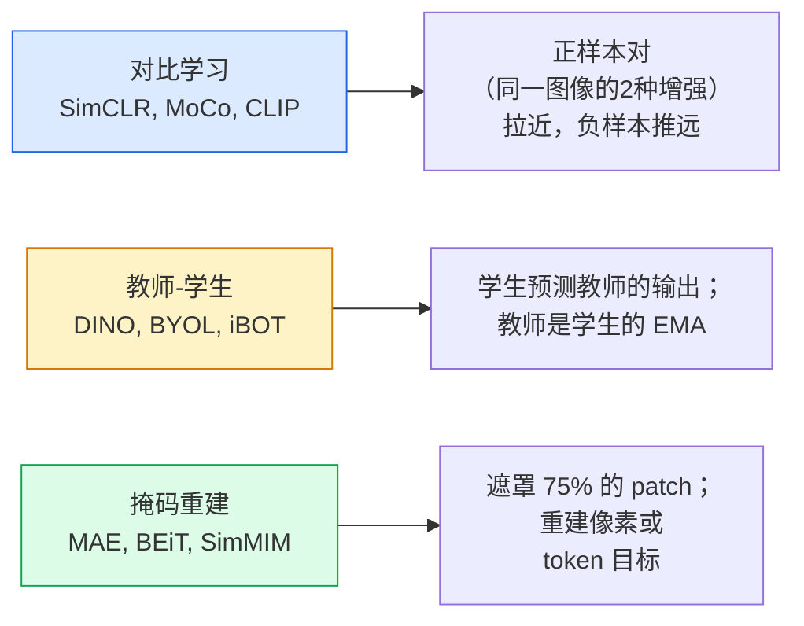

# 自监督视觉 — SimCLR、DINO、MAE

> 标签是监督视觉的瓶颈。自监督预训练消除了这个瓶颈：从 1 亿张无标签图像中学习视觉特征，然后在 1 万张有标签图像上微调。

**类型：** 学习 + 构建
**语言：** Python
**前置条件：** Phase 4 第 04 课（图像分类），Phase 4 第 14 课（ViT）
**时长：** 约 75 分钟

## 学习目标

- 梳理三大自监督学习家族——对比学习（SimCLR）、教师-学生（DINO）、掩码重建（MAE）——并说明每种方法的优化目标
- 从头实现 InfoNCE 损失，并解释为何批量大小 512 有效而 32 会失败
- 解释 MAE 的 75% 遮罩率并非随意选择，以及它与 BERT 的 15% 文本遮罩有何不同
- 使用 DINOv2 或 MAE ImageNet 检查点进行线性探测（linear probing）和零样本检索

## 问题背景

有监督的 ImageNet 有 130 万张标注图像，估计标注成本为 1000 万美元。医疗和工业数据集更小，标注成本更高。每个视觉团队都在问：我们能否在廉价的无标签数据——YouTube 帧、网络爬取、摄像头录像、卫星扫描——上预训练，然后在小型标注集上微调？

自监督学习（Self-supervised learning，SSL）是答案。在 LAION 或 JFT 上训练的现代自监督 ViT，微调后能够达到或超越有监督的 ImageNet 精度。它还比有监督预训练更好地迁移到下游任务（检测、分割、深度估计）。DINOv2（Meta，2023）和 MAE（Meta，2022）是当前可迁移视觉特征的生产默认选择。

概念上的转变是：借口任务（pretext task，模型被训练完成的任务）不必与下游任务相同。重要的是它迫使模型学习有用的特征。预测灰度图的颜色、旋转图像并要求模型预测旋转角度、遮罩 patch 并重建——这些都有效。能够规模化的三种方法是：对比学习、教师-学生蒸馏和掩码重建。

## 核心概念

### 三大家族



### 对比学习（SimCLR）

取一张图像，应用两种随机增强，得到两个视图。将两者都通过同一个编码器加投影头。最小化一个损失，该损失要求"这两个嵌入应该相近"以及"该嵌入应该远离批次中所有其他图像的嵌入"。

```
批次中 2N 个视图的正样本对 (z_i, z_j) 的损失：

   L_ij = -log( exp(sim(z_i, z_j) / tau) / sum_k in batch \ {i} exp(sim(z_i, z_k) / tau) )

sim = 余弦相似度
tau = 温度系数（标准值 0.1）
```

这就是 InfoNCE 损失。它需要每个正样本有很多负样本，因此批量大小很重要——SimCLR 需要 512-8192。MoCo 引入了过去批次的动量队列，将负样本数与批量大小解耦。

### 教师-学生（DINO）

两个架构相同的网络：学生和教师。教师是学生权重的指数移动平均（EMA）。两者都看到图像的增强视图。学生的输出被训练为匹配教师的输出——没有显式的负样本。

```
loss = CE( student_output(view_1),  teacher_output(view_2) )
     + CE( student_output(view_2),  teacher_output(view_1) )

teacher_weights = m * teacher_weights + (1 - m) * student_weights   (m ≈ 0.996)
```

为什么不会崩溃到"预测一个常数"：教师的输出经过了中心化（减去每维度均值）和锐化（除以小温度）。中心化防止某一维度主导；锐化防止输出崩溃为均匀分布。

DINO 是 DINOv2 放大的版本，在 1.42 亿张精选图像上训练。得到的特征是当前零样本视觉检索和密集预测的 SOTA。

### 掩码重建（MAE）

遮罩 ViT 输入的 75% 的 patch。只将可见的 25% 通过编码器。一个小型解码器接收编码器的输出加上被遮罩位置的掩码 token，并被训练以重建被遮罩 patch 的像素。

```
编码器：可见的 25% patch -> 特征
解码器：特征 + 被遮罩位置的掩码 token -> 重建的像素
损失：  仅在被遮罩的 patch 上计算重建像素与原始像素之间的 MSE
```

使 MAE 有效的关键设计选择：

- **75% 遮罩率** — 高。迫使编码器学习语义特征；重建 25% 近乎微不足道（相邻像素高度相关，CNN 可以轻松做到）。
- **非对称编码器/解码器** — 大型 ViT 编码器只看可见 patch；小型解码器（8 层，512 维）处理重建。比朴素 BEiT 预训练快 3 倍。
- **像素空间重建目标** — 比 BEiT 的 token 化目标更简单，在 ViT 上效果更好。

预训练后，丢弃解码器。编码器就是特征提取器。

### 为什么是 75% 而非 15%

BERT 遮罩 15% 的 token。MAE 遮罩 75%。差异在于信息密度。

- 自然语言每个 token 具有高熵。预测 15% 的 token 仍然困难，因为每个被遮罩的位置有很多合理的补全。
- 图像 patch 具有低熵——未遮罩的邻域通常几乎完全决定了被遮罩 patch 的像素。要让预测需要语义理解，必须大幅遮罩。

75% 足够高，使得简单的空间外推无法解决任务；编码器必须表示图像内容。

### 线性探测评估

自监督预训练后，标准评估是**线性探测（linear probe）**：冻结编码器，在其上训练单个线性分类器（使用 ImageNet 标签）。报告 top-1 准确率。

- SimCLR ResNet-50：约 71%（2020 年）
- DINO ViT-S/16：约 77%（2021 年）
- MAE ViT-L/16：约 76%（2022 年）
- DINOv2 ViT-g/14：约 86%（2023 年）

线性探测是特征质量的纯粹度量；微调通常额外提升 2-5 个点，但也混入了头部重新训练的效果。

## 动手实现

### 步骤一：双视图增强流程

```python
import torch
import torchvision.transforms as T

two_view_train = lambda: T.Compose([
    T.RandomResizedCrop(96, scale=(0.2, 1.0)),
    T.RandomHorizontalFlip(),
    T.ColorJitter(0.4, 0.4, 0.4, 0.1),
    T.RandomGrayscale(p=0.2),
    T.ToTensor(),
])


class TwoViewDataset(torch.utils.data.Dataset):
    def __init__(self, base):
        self.base = base
        self.aug = two_view_train()

    def __len__(self):
        return len(self.base)

    def __getitem__(self, i):
        img, _ = self.base[i]
        v1 = self.aug(img)
        v2 = self.aug(img)
        return v1, v2
```

每个 `__getitem__` 返回同一图像的两个增强视图；不需要标签。

### 步骤二：InfoNCE 损失

```python
import torch.nn.functional as F

def info_nce(z1, z2, tau=0.1):
    """
    z1, z2: (N, D) L2 归一化后的配对视图嵌入
    """
    N, D = z1.shape
    z = torch.cat([z1, z2], dim=0)  # (2N, D)
    sim = z @ z.T / tau              # (2N, 2N)

    mask = torch.eye(2 * N, dtype=torch.bool, device=z.device)
    sim = sim.masked_fill(mask, float("-inf"))

    targets = torch.cat([torch.arange(N, 2 * N), torch.arange(0, N)]).to(z.device)
    return F.cross_entropy(sim, targets)
```

调用前先对嵌入做 L2 归一化。`tau=0.1` 是 SimCLR 的默认值；越小损失越尖锐，需要更多负样本。

### 步骤三：InfoNCE 健全性检查

```python
z1 = F.normalize(torch.randn(16, 32), dim=-1)
z2 = z1.clone()
loss_same = info_nce(z1, z2, tau=0.1).item()
z2_random = F.normalize(torch.randn(16, 32), dim=-1)
loss_random = info_nce(z1, z2_random, tau=0.1).item()
print(f"InfoNCE with identical pairs:  {loss_same:.3f}")
print(f"InfoNCE with random pairs:     {loss_random:.3f}")
```

完全相同的配对应产生低损失（对于大批次和低温度接近 0）。随机配对应产生 log(2N-1) ≈ log(31) ≈ 3.4（16 对批次）。

### 步骤四：MAE 风格的遮罩

```python
def random_mask_indices(num_patches, mask_ratio=0.75, seed=0):
    g = torch.Generator().manual_seed(seed)
    n_keep = int(num_patches * (1 - mask_ratio))
    perm = torch.randperm(num_patches, generator=g)
    visible = perm[:n_keep]
    masked = perm[n_keep:]
    return visible.sort().values, masked.sort().values


num_patches = 196
visible, masked = random_mask_indices(num_patches, mask_ratio=0.75)
print(f"visible: {len(visible)} / {num_patches}")
print(f"masked:  {len(masked)} / {num_patches}")
```

简单、快速，对给定种子具有确定性。真实 MAE 实现对此进行批量处理，并保留每样本的遮罩。

## 生产实践

DINOv2 是 2026 年的生产标准：

```python
import torch
from transformers import AutoImageProcessor, AutoModel

processor = AutoImageProcessor.from_pretrained("facebook/dinov2-base")
model = AutoModel.from_pretrained("facebook/dinov2-base")
model.eval()

# 用于零样本检索的逐图像嵌入
with torch.no_grad():
    inputs = processor(images=[pil_image], return_tensors="pt")
    outputs = model(**inputs)
    embedding = outputs.last_hidden_state[:, 0]  # CLS token
```

得到的 768 维嵌入是现代图像检索、密集对应和零样本迁移流程的骨干。微调到下游任务通常只需要一个线性头。

对于图像-文本嵌入，SigLIP 或 OpenCLIP 是等价方案；对于 MAE 风格的微调，`timm` 库提供所有 MAE 检查点。

## 关键术语

| 术语 | 常见说法 | 实际含义 |
|------|---------|---------|
| 自监督（Self-supervised） | "无标签" | 从无标签数据产生有用表示的借口任务 |
| 借口任务（Pretext task） | "伪任务" | SSL 期间使用的目标（重建 patch、匹配视图）；预训练后丢弃 |
| 线性探测（Linear probe） | "冻结编码器 + 线性头" | 标准 SSL 评估：在冻结特征上只训练线性分类器 |
| InfoNCE | "对比损失" | 余弦相似度上的 softmax；正样本对是目标类，其他所有是负样本 |
| EMA 教师（EMA teacher） | "移动平均教师" | 权重是学生权重的指数移动平均的教师；被 BYOL、MoCo、DINO 使用 |
| 遮罩率（Mask ratio） | "% 的 patch 被隐藏" | MAE 期间遮罩的 patch 比例；视觉为 75%，文本为 15% |
| 表示坍塌（Representation collapse） | "常数输出" | 编码器对所有输入输出常数向量的 SSL 失败；通过中心化、锐化或负样本来预防 |
| DINOv2 | "生产 SSL 骨干" | Meta 2023 年的自监督 ViT；2026 年最强的通用图像特征 |

## 延伸阅读

- [SimCLR (Chen et al., 2020)](https://arxiv.org/abs/2002.05709) — 对比学习参考
- [DINO (Caron et al., 2021)](https://arxiv.org/abs/2104.14294) — 带动量、中心化、锐化的教师-学生
- [MAE (He et al., 2022)](https://arxiv.org/abs/2111.06377) — ViT 的掩码自编码器预训练
- [DINOv2 (Oquab et al., 2023)](https://arxiv.org/abs/2304.07193) — 将自监督 ViT 规模化到生产特征
