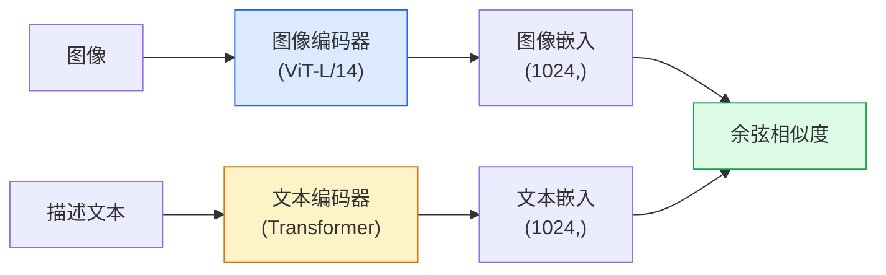

# 开放词汇视觉 — CLIP

> 将图像编码器和文本编码器联合训练，使匹配的（图像, 描述）对落在共享空间的同一点。这就是全部的技巧。

**类型：** 构建 + 使用
**语言：** Python
**前置条件：** Phase 4 第 14 课（ViT），Phase 4 第 17 课（自监督学习）
**时长：** 约 45 分钟

## 学习目标

- 解释 CLIP 的双塔架构和对比训练目标
- 使用预训练的 CLIP（或 SigLIP）在无需任何任务特定训练的情况下进行零样本分类
- 从头实现零样本分类：编码类别提示词、计算余弦相似度、取 argmax
- 区分 CLIP、SigLIP、OpenCLIP 和 LLaVA/LLaMA-vision 模型——2026 年各自的用途

## 问题背景

传统分类器是封闭词汇的：1000 类的 ImageNet 模型只能预测 1000 个标签。每个新类别都需要标注数据和重新训练的分类头。

CLIP（Radford 等，OpenAI 2021）展示了：在从网络抓取的 4 亿个（图像, 描述）对上训练，可以产生一个在推理时能分类到任意类别集合的模型，这些类别完全用自然语言描述。通过写一句话就能给它一个新类别。

这种能力——零样本迁移（zero-shot transfer）——是每个现代视觉系统都以 CLIP 家族检查点为起点的原因。检测（Grounding DINO、OWL-ViT）、分割（CLIPSeg、SAM）、检索、内容审核、视觉语言模型（VLM）和文字到图像生成，都建立在 CLIP 风格的联合嵌入之上。

## 核心概念

### 双塔架构



两个编码器都以线性投影层结尾，投影到相同的嵌入维度（CLIP-B/32 为 512，CLIP-L/14 为 1024）。L2 归一化后计算余弦相似度。

### 训练目标

给定一批 N 个（图像, 描述）对，构建 N×N 相似度矩阵。训练两个编码器，使对角线（匹配对）具有高相似度，非对角线（不匹配）具有低相似度。

```
sim_matrix = image_embeddings @ text_embeddings.T / tau

loss_i2t = cross_entropy(sim_matrix,       targets=arange(N))
loss_t2i = cross_entropy(sim_matrix.T,     targets=arange(N))
loss = (loss_i2t + loss_t2i) / 2
```

对称的，因为图像到文本和文本到图像的检索都应该有效。`tau`（温度）通常作为标量参数学习，初始化为 0.07。

### SigLIP：更好的损失

SigLIP（Zhai 等，2023）用逐对 sigmoid 替换了 softmax：

```
loss = mean over pairs of log(1 + exp(-y_ij * sim_ij))
y_ij = +1（若匹配），-1（若不匹配）
```

逐对损失去除了 CLIP 所需的批次级归一化。SigLIP 在小批量下训练效果更好，在相同数据下与 CLIP 相当或更优。

### 零样本分类

给定训练好的 CLIP：

1. 为每个类别组成提示词："a photo of a {类别}"。
2. 用文本编码器编码所有类别提示词 -> 形状 `T` 为 (C, d)。
3. 编码测试图像 -> 形状 `I` 为 (1, d)。
4. 相似度 = `I @ T.T`，形状为 (1, C)。
5. Argmax -> 预测类别。

提示词工程很重要。OpenAI 为 ImageNet 发布了 80 个提示词模板（"a photo of a {}"、"a blurry photo of a {}"、"a sketch of a {}" 等）。对每个类别的所有模板嵌入取平均，可额外提升 1-3% 的 top-1 精度。

### CLIP 风格模型在 2026 年的应用

- **零样本分类** — 直接使用。
- **图像检索** — 一次性编码所有图像，推理时嵌入查询。
- **文本条件检测** — Grounding DINO、OWL-ViT 在检测器外包裹 CLIP 文本塔。
- **文本条件分割** — CLIPSeg；SAM 通过 CLIP 使用文本提示输入。
- **VLM** — LLaVA、Qwen-VL、InternVL 将 CLIP 家族视觉编码器接入 LLM。
- **文字到图像生成** — Stable Diffusion、DALL-E 3 在 CLIP 文本嵌入上做条件控制。

一旦拥有共享嵌入空间，每个视觉+语言任务都变成一次距离计算。

## 动手实现

### 步骤一：微型双塔模型

真实的 CLIP 是 ViT + Transformer。本课的塔是预提取特征上的小型 MLP，使训练信号在 CPU 上可见。

```python
import torch
import torch.nn as nn
import torch.nn.functional as F


class TwoTower(nn.Module):
    def __init__(self, img_in=128, txt_in=64, emb=64):
        super().__init__()
        self.image_proj = nn.Sequential(nn.Linear(img_in, 128), nn.ReLU(), nn.Linear(128, emb))
        self.text_proj = nn.Sequential(nn.Linear(txt_in, 128), nn.ReLU(), nn.Linear(128, emb))
        self.logit_scale = nn.Parameter(torch.ones([]) * 2.6592)  # ln(1/0.07)

    def forward(self, img_feats, txt_feats):
        i = F.normalize(self.image_proj(img_feats), dim=-1)
        t = F.normalize(self.text_proj(txt_feats), dim=-1)
        return i, t, self.logit_scale.exp()
```

两个投影，共享维度输出，可学习温度。与真实 CLIP API 形状相同。

### 步骤二：对比损失

```python
def clip_loss(image_emb, text_emb, logit_scale):
    N = image_emb.size(0)
    sim = logit_scale * image_emb @ text_emb.T
    targets = torch.arange(N, device=sim.device)
    l_i = F.cross_entropy(sim, targets)
    l_t = F.cross_entropy(sim.T, targets)
    return (l_i + l_t) / 2
```

对称的。logit_scale 越高 = softmax 越尖锐 = 越自信，但有不稳定风险。

### 步骤三：零样本分类器

```python
@torch.no_grad()
def zero_shot_classify(model, image_feats, class_text_feats, class_names):
    """
    image_feats:      (N, img_in)
    class_text_feats: (C, txt_in)   每个类别一个平均嵌入
    """
    i = F.normalize(model.image_proj(image_feats), dim=-1)
    t = F.normalize(model.text_proj(class_text_feats), dim=-1)
    sim = i @ t.T
    pred = sim.argmax(dim=-1)
    return [class_names[p] for p in pred.tolist()]
```

每步一行代码。这与生产 CLIP 检查点使用的确切零样本流程相同。

### 步骤四：健全性检查

```python
torch.manual_seed(0)
model = TwoTower()

img = torch.randn(8, 128)
txt = torch.randn(8, 64)
i, t, scale = model(img, txt)
loss = clip_loss(i, t, scale)
print(f"batch size: {i.size(0)}   loss: {loss.item():.3f}")
```

随机初始化模型的损失应接近 `log(N) = log(8) = 2.08`——这是尚未学到任何结构时对称交叉熵的目标值。

## 生产实践

OpenCLIP 是 2026 年的社区默认选择：

```python
import open_clip
import torch
from PIL import Image

model, _, preprocess = open_clip.create_model_and_transforms("ViT-B-32", pretrained="laion2b_s34b_b79k")
tokenizer = open_clip.get_tokenizer("ViT-B-32")

image = preprocess(Image.open("dog.jpg")).unsqueeze(0)
text = tokenizer(["a photo of a dog", "a photo of a cat", "a photo of a car"])

with torch.no_grad():
    image_features = model.encode_image(image)
    text_features = model.encode_text(text)
    image_features = image_features / image_features.norm(dim=-1, keepdim=True)
    text_features = text_features / text_features.norm(dim=-1, keepdim=True)
    probs = (100.0 * image_features @ text_features.T).softmax(dim=-1)

print(probs)
```

SigLIP 更新，在小规模下训练效果更好，新工作优先选择：`google/siglip-base-patch16-224`。Hugging Face 两者都提供。

## 关键术语

| 术语 | 常见说法 | 实际含义 |
|------|---------|---------|
| 双塔（Two-tower） | "双编码器" | 分离的图像和文本编码器，以共享维度投影头结尾 |
| 零样本（Zero-shot） | "无任务特定训练" | 仅凭文本描述在推理时分类到未见过的类别；不接触标签 |
| 温度/logit_scale | "tau" | 在 softmax 前缩放相似度矩阵的可学习标量 |
| 提示词模板（Prompt template） | "A photo of a {}" | 包裹类别名称的自然语言框架；对多个模板取平均可提升零样本精度 |
| CLIP | "图像+文本模型" | 2021 年 OpenAI 的模型；2026 年该领域的通用术语 |
| SigLIP | "Sigmoid CLIP" | 将 softmax 换成逐对 sigmoid；在小批次下训练效果更好 |
| OpenCLIP | "开源复现" | 在 LAION 上训练的社区 CLIP 变体；开源流程的生产默认选择 |
| VLM | "视觉语言模型" | CLIP 家族编码器加 LLM，训练为回答关于图像的问题 |

## 延伸阅读

- [CLIP: Learning Transferable Visual Models from Natural Language Supervision (Radford et al., 2021)](https://arxiv.org/abs/2103.00020)
- [SigLIP: Sigmoid Loss for Language-Image Pre-Training (Zhai et al., 2023)](https://arxiv.org/abs/2303.15343)
- [OpenCLIP](https://github.com/mlfoundations/open_clip) — 社区代码库
- [DINOv2 vs CLIP vs MAE: a features comparison](https://huggingface.co/blog/dinov2) — HF 并排用例指南
