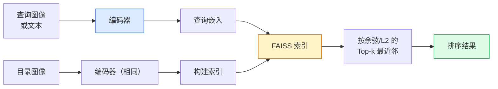

# 图像检索与度量学习

> 检索系统按嵌入空间中的距离对候选项排序。度量学习（metric learning）是塑造该空间使距离具有所需含义的学科。

**类型：** 构建
**语言：** Python
**前置条件：** Phase 4 第 14 课（ViT），Phase 4 第 18 课（CLIP）
**时长：** 约 45 分钟

## 学习目标

- 解释三元组（triplet）、对比（contrastive）和基于代理（proxy-based）的度量学习损失，并为给定数据集选择合适的损失
- 正确实现 L2 归一化和余弦相似度，并区分"同一物品"和"同一类别"检索的差异
- 构建 FAISS 索引，通过文本和图像查询，并对保留查询集报告 recall@K
- 使用 DINOv2、CLIP 和 SigLIP 作为现成的嵌入骨干，并知道各自的适用场景

## 问题背景

检索在生产视觉中无处不在：重复检测、反向图像搜索、视觉搜索（"找相似商品"）、人脸重识别（face re-ID）、监控中的行人重识别（person re-ID）、电商中的实例级匹配。产品问题始终相同："给定这张查询图像，在我的目录中排序。"

两个设计决策决定整个系统。嵌入——什么模型产生向量。索引——如何大规模找到最近邻。两者在 2026 年都已是商品化（嵌入用 DINOv2，索引用 FAISS），这提高了门槛：困难的部分是为你的应用定义*什么算相似*，然后塑造嵌入空间使距离与之匹配。

这种塑造就是度量学习。这是一个小但高杠杆的学科。

## 核心概念

### 检索一览



### 四种损失家族

| 损失 | 需要 | 优点 | 缺点 |
|------|------|------|------|
| **对比（Contrastive）** | （锚点, 正样本）+ 负样本 | 简单，适用于任何配对标签 | 没有大量负样本收敛慢 |
| **三元组（Triplet）** | （锚点, 正样本, 负样本） | 直觉直接；边距可控 | 难样本挖掘（hard triplet mining）开销大 |
| **NT-Xent / InfoNCE** | 配对 + 批次挖掘负样本 | 可扩展到大批次 | 需要大批次或动量队列 |
| **基于代理（ProxyNCA）** | 仅类别标签 | 快速、稳定、无需挖掘 | 在小数据集上可能对代理过拟合 |

对于大多数生产场景，从预训练骨干开始，只在现成嵌入在测试集上表现不佳时才添加度量学习微调。

### 三元组损失正式定义

```
L = max(0, ||f(a) - f(p)||^2 - ||f(a) - f(n)||^2 + margin)
```

将锚点 `a` 拉近正样本 `p`，推离负样本 `n`，`margin` 确保保持一定间隔。三图像结构可推广到任何相似度排序。

挖掘至关重要：容易三元组（`n` 已经远离 `a`）贡献零损失；只有困难三元组才能教导网络。半困难挖掘（semi-hard mining，`n` 比 `p` 更远但在边距内）是 2016 年 FaceNet 的方法，至今仍占主导。

### 余弦相似度 vs L2

两种度量，两种约定：

- **余弦**：向量之间的角度。需要 L2 归一化的嵌入。
- **L2**：欧几里得距离。适用于原始或归一化嵌入，但通常与 L2 归一化 + 平方 L2 配合使用。

对于大多数现代网络，当 `||a|| = ||b|| = 1` 时，两者等价：`||a - b||^2 = 2 - 2 cos(a, b)`。选择与你的嵌入训练匹配的约定；混合使用会静默地改变"最近"的含义。

### Recall@K

标准检索指标：

```
recall@K = 至少有一个正确匹配在 Top-K 结果中的查询比例
```

并排报告 recall@1、@5、@10。recall@10 超过 0.95 而 recall@1 低于 0.5，意味着嵌入空间结构正确，但排序有噪声——尝试更长的微调或重排序步骤。

对于重复检测，precision@K 更重要，因为每个误报都是用户可见的错误。对于视觉搜索，recall@K 是产品信号。

### FAISS 一段话

Facebook AI 相似度搜索（Facebook AI Similarity Search）。事实上的最近邻搜索库。三种索引选择：

- `IndexFlatIP` / `IndexFlatL2` — 暴力搜索，精确，无需训练。用于最多约 100 万个向量。
- `IndexIVFFlat` — 分区为 K 个单元，只搜索最近的几个单元。近似，快速，需要训练数据。
- `IndexHNSW` — 基于图，多次查询最快，但索引大小较大。

10 万个向量可能需要 `IndexFlatIP`（余弦相似度）。1000 万个向量需要 `IndexIVFFlat`。1 亿+ 个向量结合乘积量化（`IndexIVFPQ`）。

### 实例级 vs 类别级检索

同名但截然不同的两个问题：

- **类别级（Category-level）** — "在我的目录中找猫。"类条件相似度；现成的 CLIP/DINOv2 嵌入效果好。
- **实例级（Instance-level）** — "在我的目录中找*这个确切的产品*。"需要对同一类别中视觉相似的对象进行细粒度区分；现成嵌入表现不佳；度量学习微调很重要。

在选择模型之前，始终先明确你在解决哪种问题。

## 动手实现

### 步骤一：三元组损失

```python
import torch
import torch.nn.functional as F

def triplet_loss(anchor, positive, negative, margin=0.2):
    d_ap = F.pairwise_distance(anchor, positive, p=2)
    d_an = F.pairwise_distance(anchor, negative, p=2)
    return F.relu(d_ap - d_an + margin).mean()
```

一行代码。适用于 L2 归一化或原始嵌入。

### 步骤二：半困难挖掘

给定一批嵌入和标签，为每个锚点找到最困难的半困难负样本。

```python
def semi_hard_negatives(emb, labels, margin=0.2):
    dist = torch.cdist(emb, emb)
    same_class = labels[:, None] == labels[None, :]
    diff_class = ~same_class
    N = emb.size(0)

    positives = dist.clone()
    positives[~same_class] = float("-inf")
    positives.fill_diagonal_(float("-inf"))
    pos_idx = positives.argmax(dim=1)

    semi_hard = dist.clone()
    semi_hard[same_class] = float("inf")
    d_ap = dist[torch.arange(N), pos_idx].unsqueeze(1)
    semi_hard[dist <= d_ap] = float("inf")
    neg_idx = semi_hard.argmin(dim=1)

    fallback_mask = semi_hard[torch.arange(N), neg_idx] == float("inf")
    if fallback_mask.any():
        hardest = dist.clone()
        hardest[same_class] = float("inf")
        neg_idx = torch.where(fallback_mask, hardest.argmin(dim=1), neg_idx)
    return pos_idx, neg_idx
```

每个锚点获得类内最困难的正样本，以及一个比正样本更远但在边距内的半困难负样本。

### 步骤三：Recall@K

```python
def recall_at_k(query_emb, gallery_emb, query_labels, gallery_labels, k=1):
    sim = query_emb @ gallery_emb.T
    _, top_k = sim.topk(k, dim=-1)
    matches = (gallery_labels[top_k] == query_labels[:, None]).any(dim=-1)
    return matches.float().mean().item()
```

L2 归一化嵌入上按内积的 top-k 等于按余弦的 top-k。报告至少有一个正确邻居的查询比例。

### 步骤四：整合在一起

```python
import torch
import torch.nn as nn
from torch.optim import Adam

class Encoder(nn.Module):
    def __init__(self, in_dim=128, emb_dim=64):
        super().__init__()
        self.net = nn.Sequential(
            nn.Linear(in_dim, 128), nn.ReLU(),
            nn.Linear(128, emb_dim),
        )

    def forward(self, x):
        return F.normalize(self.net(x), dim=-1)

torch.manual_seed(0)
num_classes = 6
protos = F.normalize(torch.randn(num_classes, 128), dim=-1)

def sample_batch(bs=32):
    labels = torch.randint(0, num_classes, (bs,))
    x = protos[labels] + 0.15 * torch.randn(bs, 128)
    return x, labels

enc = Encoder()
opt = Adam(enc.parameters(), lr=3e-3)

for step in range(200):
    x, y = sample_batch(32)
    emb = enc(x)
    pos_idx, neg_idx = semi_hard_negatives(emb, y)
    loss = triplet_loss(emb, emb[pos_idx], emb[neg_idx])
    opt.zero_grad(); loss.backward(); opt.step()
```

几百步后，嵌入聚类形成每个类一个簇。

## 生产实践

2026 年的生产技术栈：

- **DINOv2 + FAISS** — 通用视觉检索。现成可用。
- **CLIP + FAISS** — 当查询是文本时。
- **微调 DINOv2 + FAISS** — 实例级检索、人脸重识别、时尚、电商。
- **Milvus / Weaviate / Qdrant** — FAISS 或 HNSW 的托管向量数据库封装。

对于 SOTA 实例检索，方案是：DINOv2 骨干，添加嵌入头，用实例标注对的三元组或 InfoNCE 损失微调，在 FAISS 中建索引。

## 关键术语

| 术语 | 常见说法 | 实际含义 |
|------|---------|---------|
| 度量学习（Metric learning） | "塑造空间" | 训练编码器使其输出空间中的距离反映目标相似度 |
| 三元组损失（Triplet loss） | "拉近推远" | L = max(0, d(a, p) - d(a, n) + margin)；经典度量学习损失 |
| 半困难挖掘（Semi-hard mining） | "有用的负样本" | 比正样本更远但在边距内的负样本；经验上信息量最大 |
| 基于代理的损失（Proxy-based loss） | "类别原型" | 每个类别一个可学习代理；对相似度到代理的交叉熵；无需配对挖掘 |
| Recall@K | "Top-K 命中率" | Top-K 中至少有一个正确结果的查询比例 |
| 实例检索（Instance retrieval） | "找这个确切的东西" | 细粒度匹配；现成特征通常表现不佳 |
| FAISS | "NN 库" | Facebook 的最近邻搜索库；支持精确和近似索引 |
| HNSW | "图索引" | 分层可导航小世界；内存开销小的快速近似 NN |

## 延伸阅读

- [FaceNet: A Unified Embedding for Face Recognition (Schroff et al., 2015)](https://arxiv.org/abs/1503.03832) — 三元组损失/半困难挖掘论文
- [In Defense of the Triplet Loss for Person Re-Identification (Hermans et al., 2017)](https://arxiv.org/abs/1703.07737) — 三元组微调实践指南
- [FAISS documentation](https://github.com/facebookresearch/faiss/wiki) — 每种索引，每种权衡
- [SMoT: Metric Learning Taxonomy (Kim et al., 2021)](https://arxiv.org/abs/2010.06927) — 现代损失及其联系综述
