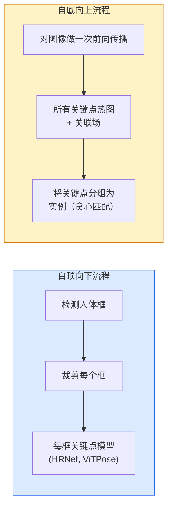

# 关键点检测与姿态估计

> 姿态是一组有序的关键点。关键点检测器是一个热图（heatmap）回归器。其他一切都是记账工作。

**类型：** 构建
**语言：** Python
**前置条件：** Phase 4 第 06 课（目标检测），Phase 4 第 07 课（U-Net）
**时长：** 约 45 分钟

## 学习目标

- 区分自顶向下（top-down）和自底向上（bottom-up）的姿态估计，并说明各自的适用场景
- 用每个关键点一个高斯目标的方式回归 K 个关键点的热图，并在推理时提取关键点坐标
- 解释部件亲和场（PAF，Part Affinity Fields）及自底向上流程如何将关键点关联为实例
- 使用 MediaPipe Pose 或 MMPose 进行生产关键点估计，并理解其输出格式

## 问题背景

关键点任务以多种名称存在：人体姿态（17 个身体关节）、人脸关键点（68 或 478 个点）、手部（21 个点）、动物姿态、机器人物体姿态、医学解剖标志点。它们都有相同的结构：检测对象上的 K 个离散点并输出其 (x, y) 坐标。

姿态估计是动作捕捉、健身应用、运动分析、手势控制、动画、AR 试穿和机器人抓取的基础。2D 情况已经成熟；3D 姿态（从单个相机估计世界坐标中的关节位置）是当前研究前沿。

工程问题是规模。单图像、单人姿态是 20ms 的问题。密集人群中 30 fps 的多人姿态是一个不同的问题，需要不同的架构。

## 核心概念

### 自顶向下 vs 自底向上



- **自顶向下** — 先检测人体，然后对每个裁剪运行每人关键点模型。精度最高；随人数线性扩展。
- **自底向上** — 一次前向传播预测所有关键点加关联场；然后分组。无论人群大小，运行时间恒定。

自顶向下（HRNet、ViTPose）是精度领跑者；自底向上（OpenPose、HigherHRNet）是密集人群场景的吞吐量领跑者。

### 热图回归

不直接回归 `(x, y)`，而是为每个关键点预测一张 `H×W` 的热图，以真实位置为中心放置一个高斯斑点。

```
target[k, y, x] = exp(-((x - cx_k)^2 + (y - cy_k)^2) / (2 sigma^2))
```

推理时，每张热图的 argmax 就是预测的关键点位置。

为什么热图比直接回归效果更好：网络的空间结构（卷积特征图）与空间输出自然对齐。高斯目标也起到正则化作用——小的定位误差产生小的损失，而非零。

### 亚像素定位

Argmax 给出整数坐标。对于亚像素精度，可以通过对 argmax 及其邻居拟合抛物线来细化，或使用已知的偏移方法 `(dx, dy) = 0.25 * (heatmap[y, x+1] - heatmap[y, x-1], ...)` 方向。

### 部件亲和场（PAF）

OpenPose 用于自底向上关联的技巧。对于每对相连的关键点（如左肩到左肘），预测一个 2 通道场，编码从一个点指向另一个点的单位向量。要将一个肩膀与其对应的肘部关联，沿连接候选对的线积分 PAF；积分最高的对被匹配。

```
对于每个连接（肢体）：
  PAF 通道：2（单位向量 x, y）
  线积分：沿采样点的 (PAF · 线方向) 之和
  积分越高 = 匹配越强
```

优雅且可扩展到任意人群大小，无需逐人裁剪。

### COCO 关键点

标准人体姿态数据集：每人 17 个关键点，PCK（正确关键点百分比）和 OKS（目标关键点相似度）作为指标。OKS 是关键点版本的 IoU，是 COCO mAP@OKS 所报告的内容。

### 2D vs 3D

- **2D 姿态** — 图像坐标；生产质量已解决（MediaPipe、HRNet、ViTPose）。
- **3D 姿态** — 世界/相机坐标；仍是活跃研究。常见方法：
  - 用小型 MLP 将 2D 预测提升到 3D（VideoPose3D）。
  - 从图像直接回归 3D（PyMAF、MHFormer）。
  - 多视角设置（CMU Panoptic）用于获取真实标注。

## 动手实现

### 步骤一：高斯热图目标

```python
import numpy as np
import torch

def gaussian_heatmap(size, cx, cy, sigma=2.0):
    yy, xx = np.meshgrid(np.arange(size), np.arange(size), indexing="ij")
    return np.exp(-((xx - cx) ** 2 + (yy - cy) ** 2) / (2 * sigma ** 2)).astype(np.float32)

hm = gaussian_heatmap(64, 32, 32, sigma=2.0)
print(f"peak: {hm.max():.3f} at ({hm.argmax() % 64}, {hm.argmax() // 64})")
```

沿通道轴堆叠的逐关键点热图给出完整的目标张量。

### 步骤二：微型关键点头

输出 K 个热图通道的 U-Net 风格模型。

```python
import torch.nn as nn
import torch.nn.functional as F

class TinyKeypointNet(nn.Module):
    def __init__(self, num_keypoints=4, base=16):
        super().__init__()
        self.down1 = nn.Sequential(nn.Conv2d(3, base, 3, 2, 1), nn.ReLU(inplace=True))
        self.down2 = nn.Sequential(nn.Conv2d(base, base * 2, 3, 2, 1), nn.ReLU(inplace=True))
        self.mid = nn.Sequential(nn.Conv2d(base * 2, base * 2, 3, 1, 1), nn.ReLU(inplace=True))
        self.up1 = nn.ConvTranspose2d(base * 2, base, 2, 2)
        self.up2 = nn.ConvTranspose2d(base, num_keypoints, 2, 2)

    def forward(self, x):
        h1 = self.down1(x)
        h2 = self.down2(h1)
        h3 = self.mid(h2)
        u1 = self.up1(h3)
        return self.up2(u1)
```

输入 `(N, 3, H, W)`，输出 `(N, K, H, W)`。损失是相对于高斯目标的逐像素 MSE。

### 步骤三：推理——提取关键点坐标

```python
def heatmap_to_coords(heatmaps):
    """
    heatmaps: (N, K, H, W)
    returns:  (N, K, 2) 图像像素中的浮点坐标
    """
    N, K, H, W = heatmaps.shape
    hm = heatmaps.reshape(N, K, -1)
    idx = hm.argmax(dim=-1)
    ys = (idx // W).float()
    xs = (idx % W).float()
    return torch.stack([xs, ys], dim=-1)

coords = heatmap_to_coords(torch.randn(2, 4, 32, 32))
print(f"coords: {coords.shape}")  # (2, 4, 2)
```

推理一行代码。对于亚像素细化，在 argmax 附近插值。

### 步骤四：合成关键点数据集

简单：在白色画布上画四个点并学习预测它们。

```python
def make_synthetic_sample(size=64):
    img = np.ones((3, size, size), dtype=np.float32)
    rng = np.random.default_rng()
    kps = rng.integers(8, size - 8, size=(4, 2))
    for cx, cy in kps:
        img[:, cy - 2:cy + 2, cx - 2:cx + 2] = 0.0
    hms = np.stack([gaussian_heatmap(size, cx, cy) for cx, cy in kps])
    return img, hms, kps
```

足够简单，让微型模型在一分钟内学会。

### 步骤五：训练

```python
model = TinyKeypointNet(num_keypoints=4)
opt = torch.optim.Adam(model.parameters(), lr=3e-3)

for step in range(200):
    batch = [make_synthetic_sample() for _ in range(16)]
    imgs = torch.from_numpy(np.stack([b[0] for b in batch]))
    hms = torch.from_numpy(np.stack([b[1] for b in batch]))
    pred = model(imgs)
    # 将预测上采样到完整分辨率
    pred = F.interpolate(pred, size=hms.shape[-2:], mode="bilinear", align_corners=False)
    loss = F.mse_loss(pred, hms)
    opt.zero_grad(); loss.backward(); opt.step()
```

## 生产实践

- **MediaPipe Pose** — Google 的生产姿态估计器；提供 WebGL + 移动运行时，延迟低于 10ms。
- **MMPose**（OpenMMLab）— 综合研究代码库；每种 SOTA 架构都带有预训练权重。
- **YOLOv8-pose** — 单次前向传播的最快实时多人姿态。
- **transformers HumanDPT / PoseAnything** — 用于开放词汇姿态（任意对象、任意关键点集合）的新型视觉语言方法。

## 关键术语

| 术语 | 常见说法 | 实际含义 |
|------|---------|---------|
| 关键点（Keypoint） | "标志点" | 对象上的特定有序点（关节、角点、特征点） |
| 姿态（Pose） | "骨架" | 属于一个实例的有序关键点集合 |
| 自顶向下（Top-down） | "先检测再估姿" | 两阶段流程：人体检测器 + 逐裁剪关键点模型；精度最高 |
| 自底向上（Bottom-up） | "先估姿再分组" | 单次全关键点预测 + 分组；人群大小下运行时间恒定 |
| 热图（Heatmap） | "高斯目标" | 每关键点一张 H×W 张量，在真实位置有峰值；首选回归目标 |
| PAF | "部件亲和场" | 编码肢体方向的 2 通道单位向量场；用于将关键点分组为实例 |
| OKS | "关键点 IoU" | 目标关键点相似度；COCO 姿态指标 |
| HRNet | "高分辨率网络" | 主导的自顶向下关键点架构；全程保持高分辨率特征 |

## 延伸阅读

- [OpenPose (Cao et al., 2017)](https://arxiv.org/abs/1812.08008) — 带 PAF 的自底向上；仍是该方法最佳的论文描述
- [HRNet (Sun et al., 2019)](https://arxiv.org/abs/1902.09212) — 自顶向下的参考架构
- [ViTPose (Xu et al., 2022)](https://arxiv.org/abs/2204.12484) — 作为姿态骨干的普通 ViT；当前许多基准上的 SOTA
- [MediaPipe Pose](https://developers.google.com/mediapipe/solutions/vision/pose_landmarker) — 生产实时姿态；2026 年部署最快的技术栈
