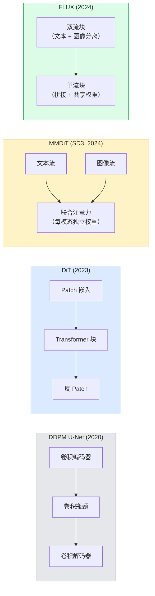

# 扩散 Transformer 与整流流

> U-Net 不是扩散的秘密。将它替换为 Transformer，把噪声调度换成直线流，你就得到了 SD3、FLUX 以及 2026 年所有文本到图像模型。

**类型：** 学习 + 构建
**语言：** Python
**前置条件：** Phase 4 第 10 课（扩散 DDPM），Phase 4 第 14 课（ViT），Phase 7 第 02 课（自注意力）
**时长：** 约 75 分钟

## 学习目标

- 梳理从 U-Net DDPM（第 10 课）到扩散 Transformer（DiT）、MMDiT（SD3）和单流 + 双流 DiT（FLUX）的演化过程
- 解释整流流（rectified flow）：为何数据与噪声之间的直线轨迹让模型能以 20 步代替 1000 步采样
- 在 100 行以内实现一个微型 DiT 块和整流流训练循环
- 通过架构、参数量和许可证区分各模型变体（SD3、FLUX.1-dev、FLUX.1-schnell、Z-Image、Qwen-Image）

## 问题背景

第 10 课用 U-Net 去噪器构建了 DDPM。这个方案主导了 2020-2023 年：U-Net + beta 调度 + 噪声预测损失。它产生了 Stable Diffusion 1.5、2.1 和 DALL-E 2。

2026 年的每个最先进文本到图像模型都已超越它。Stable Diffusion 3、FLUX、SD4、Z-Image、Qwen-Image、Hunyuan-Image——没有一个使用 U-Net。它们使用扩散 Transformer（DiT）。SD3 和 FLUX 还将 DDPM 噪声调度替换为整流流，将噪声到数据的路径拉直，并通过一致性或蒸馏变体实现 1-4 步推理。

这一转变很重要，因为它是扩散图像生成变得可控、提示准确（SD3/SD4 解决了文本渲染）且生产速度快的原因。理解 DiT + 整流流就是理解 2026 年的生成图像技术栈。

## 核心概念

### 从 U-Net 到 Transformer



- **DiT**（Peebles & Xie，2023）——用类 ViT 的 Transformer 替换 U-Net，在潜在 patch 上操作。通过自适应层归一化（AdaLN）进行条件控制。
- **MMDiT**（SD3，Esser 等，2024）——文本和图像 token 使用独立权重的两个流，共享联合注意力。
- **FLUX**（Black Forest Labs，2024）——前 N 个块像 SD3 一样双流，后面的块拼接并共享权重（单流），在更深层时提高效率。
- **Z-Image**（2025）——高效的 60 亿参数单流 DiT，挑战"不惜代价扩展规模"的做法。

### 整流流一段话

DDPM 将前向过程定义为噪声 SDE，`x_t` 逐渐被破坏。学习到的逆过程是第二个 SDE，通过 1000 个小步求解。

整流流定义了清晰数据与纯噪声之间的**直线**插值：

```
x_t = (1 - t) * x_0 + t * epsilon,     t in [0, 1]
```

训练网络预测速度 `v_theta(x_t, t) = epsilon - x_0`——沿从清晰数据到噪声的直线路径的前向方向（`dx_t/dt`）。在采样时，将此速度反向积分，从噪声向数据迈步。由此产生的 ODE 更接近直线，因此采样所需的积分步数大大减少。

SD3 将此称为**整流流匹配（Rectified Flow Matching）**。FLUX、Z-Image 和大多数 2026 年模型使用相同的目标。典型推理：20-30 步欧拉步（确定性）对比旧 DDPM 模式的 50+ DDIM 步。蒸馏 / turbo / schnell / LCM 变体可进一步缩短到 1-4 步。

### AdaLN 条件控制

DiT 通过**自适应层归一化（adaptive layer norm）**在时间步和类别/文本上进行条件控制：从条件向量预测 `scale`（缩放）和 `shift`（偏移），并在 LayerNorm 之后应用。比 U-Net 中的 FiLM 风格调制简洁得多，是每个现代 DiT 的默认方案。

```
cond -> MLP -> (scale, shift, gate)
norm(x) * (1 + scale) + shift，然后残差加 * gate
```

### SD3 和 FLUX 中的文本编码器

- **SD3** 使用三个文本编码器：两个 CLIP 模型 + T5-XXL。嵌入拼接后作为文本条件送入图像流。
- **FLUX** 使用一个 CLIP-L + T5-XXL。
- **Qwen-Image / Z-Image** 变体使用其自研的与其基础 LLM 对齐的文本编码器。

文本编码器是 SD3/FLUX 对提示词的理解比 SD1.5 好得多的重要原因。仅 T5-XXL 就有 47 亿参数。

### 无分类器引导仍然有效

整流流改变了采样器，而非条件控制。无分类器引导（CFG，训练时以 10% 概率丢弃文本，推理时混合条件和无条件预测）与整流流完全相同地工作。大多数 2026 年模型使用引导尺度 3.5-5——低于 SD1.5 的 7.5，因为整流流模型默认更紧密地遵循提示词。

### 一致性、Turbo、Schnell、LCM

四个名称代表同一个思路：将慢速多步模型蒸馏为快速少步模型。

- **LCM（潜在一致性模型）** — 训练一个学生，使其一步从任意中间 `x_t` 预测最终 `x_0`。
- **SDXL Turbo / FLUX schnell** — 用对抗扩散蒸馏训练的 1-4 步模型。
- **SD Turbo** — 适配到潜在扩散的 OpenAI 风格一致性模型。

任何新模型的生产部署都会同时提供"完整质量"检查点和"turbo / schnell"变体。Schnell（德语"快速"，Black Forest Labs 的惯例）在 1-4 步内运行，适合实时管线。

### 2026 年的模型格局

| 模型 | 大小 | 架构 | 许可证 |
|------|------|------|--------|
| Stable Diffusion 3 Medium | 20 亿 | MMDiT | SAI Community |
| Stable Diffusion 3.5 Large | 80 亿 | MMDiT | SAI Community |
| FLUX.1-dev | 120 亿 | 双流 + 单流 DiT | 非商业 |
| FLUX.1-schnell | 120 亿 | 同上，蒸馏版 | Apache 2.0 |
| FLUX.2 | — | FLUX.1 迭代版 | 混合 |
| Z-Image | 60 亿 | S3-DiT（可扩展单流） | 宽松 |
| Qwen-Image | ~200 亿 | DiT + Qwen 文本塔 | Apache 2.0 |
| Hunyuan-Image-3.0 | ~800 亿 | DiT | 研究 |
| SD4 Turbo | 30 亿 | DiT + 蒸馏 | SAI Commercial |

FLUX.1-schnell 是 2026 年的开源默认方案。Z-Image 是效率领头羊。FLUX.2 和 SD4 是当前质量尖端。

### 为何这一相变很重要

DDPM + U-Net 有效。DiT + 整流流**更好、更快、扩展更简洁**。这一转变与 NLP 中从 RNN 到 Transformer 的转变类似：两种架构都解决了相同的问题，但 Transformer 更易扩展，如今占据主导。2026 年每篇关于图像、视频或 3D 生成的论文都使用 DiT 形状的去噪器，通常使用整流流目标。U-Net DDPM 现在主要用于教学（第 10 课）。

## 动手实现

### 步骤一：带 AdaLN 的 DiT 块

```python
import torch
import torch.nn as nn


class AdaLNZero(nn.Module):
    """
    Adaptive LayerNorm with a gate. Predicts (scale, shift, gate) from the conditioning.
    Init such that the whole block starts as identity ("zero init").
    """

    def __init__(self, dim, cond_dim):
        super().__init__()
        self.norm = nn.LayerNorm(dim, elementwise_affine=False)
        self.mlp = nn.Linear(cond_dim, dim * 3)
        nn.init.zeros_(self.mlp.weight)
        nn.init.zeros_(self.mlp.bias)

    def forward(self, x, cond):
        scale, shift, gate = self.mlp(cond).chunk(3, dim=-1)
        h = self.norm(x) * (1 + scale.unsqueeze(1)) + shift.unsqueeze(1)
        return h, gate.unsqueeze(1)


class DiTBlock(nn.Module):
    def __init__(self, dim=192, heads=3, mlp_ratio=4, cond_dim=192):
        super().__init__()
        self.adaln1 = AdaLNZero(dim, cond_dim)
        self.attn = nn.MultiheadAttention(dim, heads, batch_first=True)
        self.adaln2 = AdaLNZero(dim, cond_dim)
        self.mlp = nn.Sequential(
            nn.Linear(dim, dim * mlp_ratio),
            nn.GELU(),
            nn.Linear(dim * mlp_ratio, dim),
        )

    def forward(self, x, cond):
        h, gate1 = self.adaln1(x, cond)
        a, _ = self.attn(h, h, h, need_weights=False)
        x = x + gate1 * a
        h, gate2 = self.adaln2(x, cond)
        x = x + gate2 * self.mlp(h)
        return x
```

`AdaLNZero` 起始时是恒等映射，因为其 MLP 权重初始化为零。训练逐渐将块从恒等映射偏移；这显著稳定了深度 Transformer 扩散模型。

### 步骤二：微型 DiT

```python
def timestep_embedding(t, dim):
    import math
    half = dim // 2
    freqs = torch.exp(-math.log(10000) * torch.arange(half, device=t.device) / half)
    args = t[:, None].float() * freqs[None]
    return torch.cat([args.sin(), args.cos()], dim=-1)


class TinyDiT(nn.Module):
    def __init__(self, image_size=16, patch_size=2, in_channels=3, dim=96, depth=4, heads=3):
        super().__init__()
        self.patch_size = patch_size
        self.num_patches = (image_size // patch_size) ** 2
        self.patch = nn.Conv2d(in_channels, dim, kernel_size=patch_size, stride=patch_size)
        self.pos = nn.Parameter(torch.zeros(1, self.num_patches, dim))
        self.time_mlp = nn.Sequential(
            nn.Linear(dim, dim * 2),
            nn.SiLU(),
            nn.Linear(dim * 2, dim),
        )
        self.blocks = nn.ModuleList([DiTBlock(dim, heads, cond_dim=dim) for _ in range(depth)])
        self.norm_out = nn.LayerNorm(dim, elementwise_affine=False)
        self.head = nn.Linear(dim, patch_size * patch_size * in_channels)

    def forward(self, x, t):
        n = x.size(0)
        x = self.patch(x)
        x = x.flatten(2).transpose(1, 2) + self.pos
        t_emb = self.time_mlp(timestep_embedding(t, self.pos.size(-1)))
        for blk in self.blocks:
            x = blk(x, t_emb)
        x = self.norm_out(x)
        x = self.head(x)
        return self._unpatchify(x, n)

    def _unpatchify(self, x, n):
        p = self.patch_size
        h = w = int(self.num_patches ** 0.5)
        x = x.view(n, h, w, p, p, -1).permute(0, 5, 1, 3, 2, 4).reshape(n, -1, h * p, w * p)
        return x
```

### 步骤三：整流流训练

```python
import torch.nn.functional as F

def rectified_flow_train_step(model, x0, optimizer, device):
    model.train()
    x0 = x0.to(device)
    n = x0.size(0)
    t = torch.rand(n, device=device)
    epsilon = torch.randn_like(x0)
    x_t = (1 - t[:, None, None, None]) * x0 + t[:, None, None, None] * epsilon

    target_velocity = epsilon - x0
    pred_velocity = model(x_t, t)

    loss = F.mse_loss(pred_velocity, target_velocity)
    optimizer.zero_grad()
    loss.backward()
    optimizer.step()
    return loss.item()
```

与第 10 课的 DDPM 噪声预测损失对比：结构相同，目标不同。不是预测噪声 `epsilon`，而是预测**速度** `epsilon - x_0`，它沿直线插值从数据指向噪声。

### 步骤四：欧拉采样器

整流流是一个 ODE。欧拉方法最简单，对于训练良好的整流流模型，在 20+ 步时几乎与高阶求解器一样准确。

```python
@torch.no_grad()
def rectified_flow_sample(model, shape, steps=20, device="cpu"):
    model.eval()
    x = torch.randn(shape, device=device)
    dt = 1.0 / steps
    t = torch.ones(shape[0], device=device)
    for _ in range(steps):
        v = model(x, t)
        x = x - dt * v
        t = t - dt
    return x
```

20 步。在训练好的模型上，这产生的样本可与 1000 步 DDPM 相媲美。

### 步骤五：端到端冒烟测试

```python
import numpy as np

def synthetic_blobs(num=200, size=16, seed=0):
    rng = np.random.default_rng(seed)
    out = np.zeros((num, 3, size, size), dtype=np.float32)
    yy, xx = np.meshgrid(np.arange(size), np.arange(size), indexing="ij")
    for i in range(num):
        cx, cy = rng.uniform(4, size - 4, size=2)
        r = rng.uniform(2, 4)
        mask = (xx - cx) ** 2 + (yy - cy) ** 2 < r ** 2
        colour = rng.uniform(-1, 1, size=3)
        for c in range(3):
            out[i, c][mask] = colour[c]
    return torch.from_numpy(out)
```

在此数据上用整流流训练 `TinyDiT`。经过 500 步后，采样输出应看起来像模糊的色斑。

## 生产使用

对于使用 FLUX / SD3 / Z-Image 的真实图像生成，`diffusers` 通过统一 API 支持所有模型：

```python
from diffusers import FluxPipeline, StableDiffusion3Pipeline
import torch

pipe = FluxPipeline.from_pretrained(
    "black-forest-labs/FLUX.1-schnell",
    torch_dtype=torch.bfloat16,
).to("cuda")

out = pipe(
    prompt="a golden retriever surfing a tsunami, hyperrealistic, studio lighting",
    guidance_scale=0.0,           # schnell was trained without CFG
    num_inference_steps=4,
    max_sequence_length=256,
).images[0]
out.save("surf.png")
```

三行代码。`FLUX.1-schnell` 四步完成。将模型 id 换成 `black-forest-labs/FLUX.1-dev` 可在 20-30 步 CFG 下获得更高质量。

对于 SD3：

```python
pipe = StableDiffusion3Pipeline.from_pretrained(
    "stabilityai/stable-diffusion-3.5-large",
    torch_dtype=torch.bfloat16,
).to("cuda")
out = pipe(prompt, guidance_scale=3.5, num_inference_steps=28).images[0]
```

## 关键术语

| 术语 | 常见说法 | 实际含义 |
|------|---------|---------|
| DiT | "扩散 Transformer" | 替代 U-Net 作为扩散去噪器的 Transformer；在 patch 化的潜在空间上操作 |
| AdaLN | "自适应层归一化" | 通过 LayerNorm 后应用的学习尺度、偏移、门控实现时间步/文本条件控制；每个现代 DiT 的标准配置 |
| MMDiT | "多模态 DiT（SD3）" | 文本和图像 token 的独立权重流，共享联合自注意力 |
| 单流 / 双流 | "FLUX 技巧" | 前 N 块双流（每模态独立权重），后续块单流（拼接 + 共享权重），兼顾效率 |
| 整流流（Rectified flow） | "直线噪声到数据" | 数据与噪声之间的线性插值；网络预测速度；推理时所需 ODE 步数更少 |
| 速度目标（Velocity target） | "epsilon - x_0" | 整流流中的回归目标；从清晰数据指向噪声 |
| CFG 引导 | "无分类器引导" | 混合条件和无条件预测；在整流流模型中仍然使用 |
| Schnell / turbo / LCM | "1-4 步蒸馏" | 从完整质量模型蒸馏的少步变体；生产实时方案 |

## 延伸阅读

- [Scalable Diffusion Models with Transformers (Peebles & Xie, 2023)](https://arxiv.org/abs/2212.09748) — DiT 论文
- [Scaling Rectified Flow Transformers (Esser et al., SD3 paper)](https://arxiv.org/abs/2403.03206) — 规模化的 MMDiT 与整流流
- [FLUX.1 model card and technical report (Black Forest Labs)](https://huggingface.co/black-forest-labs/FLUX.1-dev) — 双流 + 单流细节
- [Z-Image: Efficient Image Generation Foundation Model (2025)](https://arxiv.org/html/2511.22699v1) — 60 亿参数单流 DiT
- [Elucidating the Design Space of Diffusion (Karras et al., 2022)](https://arxiv.org/abs/2206.00364) — 每个扩散设计权衡的参考
- [Latent Consistency Models (Luo et al., 2023)](https://arxiv.org/abs/2310.04378) — LCM-LoRA 如何实现 4 步推理
