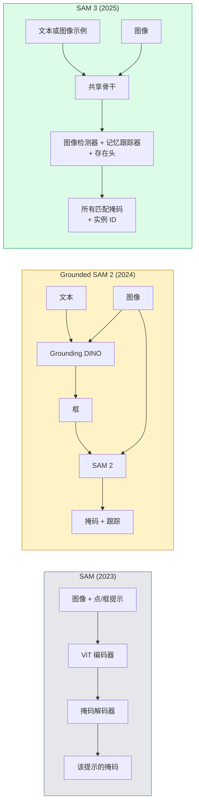

# SAM 3 与开放词汇分割

> 给模型一个文本提示词和一张图像，获取所有匹配对象的掩码。SAM 3 使这成为单次前向传播。

**类型：** 使用 + 构建
**语言：** Python
**前置条件：** Phase 4 第 07 课（U-Net），Phase 4 第 08 课（Mask R-CNN），Phase 4 第 18 课（CLIP）
**时长：** 约 60 分钟

## 学习目标

- 区分 SAM（仅视觉提示）、Grounded SAM / SAM 2（检测器 + SAM）和 SAM 3（通过可提示概念分割（PCS）的原生文本提示）
- 解释 SAM 3 架构：共享骨干 + 图像检测器 + 基于记忆的视频跟踪器 + 存在头 + 解耦检测器-跟踪器设计
- 使用 Hugging Face `transformers` SAM 3 集成进行文本提示的检测、分割和视频跟踪
- 根据延迟、概念复杂度和部署目标在 SAM 3、Grounded SAM 2、YOLO-World 和 SAM-MI 之间选择

## 问题背景

2023 年的 SAM 是一个仅限视觉提示的模型：点击一个点或画一个框，它返回一个掩码。对于"给我这张照片中所有的橙子"，你需要一个检测器（Grounding DINO）生成框，然后用 SAM 分割每一个。Grounded SAM 将其变成了一个管线，但它是两个冻结模型的级联，不可避免地积累错误。

SAM 3（Meta，2025 年 11 月，ICLR 2026）折叠了这个级联。它接受一个简短的名词短语或图像示例作为提示，并在单次前向传播中返回所有匹配的掩码和实例 ID。这就是**可提示概念分割（Promptable Concept Segmentation，PCS）**。结合 2026 年 3 月的 Object Multiplex 更新（SAM 3.1），它能高效地在视频中跟踪同一概念的多个实例。

本课关注这一结构性转变。2D 分割、检测和文本-图像对齐已合并为一个模型。生产问题不再是"我应该串联哪个管线"，而是"哪个可提示模型能端到端处理我的用例"。

## 核心概念

### 三代模型



### 可提示概念分割

"概念提示"是一个简短的名词短语（`"黄色校车"`、`"条纹红雨伞"`、`"手持马克杯"`）或图像示例。模型返回图像中所有匹配该概念的实例的分割掩码，以及每个匹配的唯一实例 ID。

这与经典的视觉提示 SAM 有三点不同：

1. 无需逐实例提示——一个文本提示返回所有匹配。
2. 开放词汇——概念可以是任何可用自然语言描述的事物。
3. 一次返回多个实例，而非每个提示一个掩码。

### 关键架构组件

- **共享骨干** — 一个 ViT 处理图像。检测头和基于记忆的跟踪器都从中读取。
- **存在头（Presence head）** — 预测概念是否存在于图像中。将"这里有吗？"与"在哪里？"解耦。减少缺席概念的假阳性。
- **解耦检测器-跟踪器** — 图像级检测和视频级跟踪有独立的头，互不干扰。
- **记忆库（Memory bank）** — 跨帧存储每个实例的特征用于视频跟踪（与 SAM 2 使用的机制相同）。

### 规模化训练

SAM 3 在由数据引擎生成的**400 万个独特概念**上训练，该引擎通过 AI + 人工审查迭代标注和修正。新的 **SA-CO 基准**包含 27 万个独特概念，比之前的基准大 50 倍。SAM 3 在 SA-CO 上达到人类性能的 75-80%，在图像 + 视频 PCS 上使现有系统翻倍。

### SAM 3.1 Object Multiplex

2026 年 3 月更新：**Object Multiplex** 引入共享记忆机制，用于同时联合跟踪同一概念的多个实例。此前，跟踪 N 个实例意味着 N 个独立记忆库。Multiplex 将其折叠为一个具有逐实例查询的共享记忆。结果：多目标跟踪速度大幅提升，同时不牺牲精度。

### Grounded SAM 在 2026 年仍然重要的场景

- 当你需要换入特定的开放词汇检测器（DINO-X、Florence-2）时。
- 当 SAM 3 许可证（在 HF 上受限）是障碍时。
- 当你需要比 SAM 3 提供的更多对检测器阈值的控制时。
- 用于检测器组件的研究/消融工作。

模块化管线仍有一席之地。对于大多数生产工作，SAM 3 是更简单的答案。

### YOLO-World vs SAM 3

- **YOLO-World** — 仅开放词汇检测器（无掩码）。实时。当你需要高帧率框检测时最佳。
- **SAM 3** — 完整分割 + 跟踪。较慢，但输出更丰富。

生产分工：YOLO-World 用于快速仅检测管线（机器人导航、快速仪表盘），SAM 3 用于任何需要掩码或跟踪的场景。

### SAM-MI 效率

SAM-MI（2025-2026）解决了 SAM 解码器瓶颈。核心思路：

- **稀疏点提示** — 使用少量精心选择的点代替密集提示；减少解码器调用 96%。
- **浅层掩码聚合** — 将粗糙掩码预测合并为一个更清晰的掩码。
- **解耦掩码注入** — 解码器接收预计算的掩码特征，而非重新运行。

结果：在开放词汇基准上比 Grounded-SAM 加速约 1.6 倍。

### 三种模型的输出格式

所有模型返回相同的通用结构（框 + 标签 + 分数 + 掩码 + ID），这很方便——你的下游管线不需要根据运行的是哪个模型而分支。

## 动手实现

### 步骤一：提示词构建

构建一个将用户句子转换为 SAM 3 概念提示列表的辅助函数。这是"用户输入的内容"与"模型消费的内容"之间的边界。

```python
def split_concepts(sentence):
    """
    Heuristic splitter for multi-concept prompts.
    Returns list of short noun phrases.
    """
    for sep in [",", ";", "and", "or", "&"]:
        if sep in sentence:
            parts = [p.strip() for p in sentence.replace("and ", ",").split(",")]
            return [p for p in parts if p]
    return [sentence.strip()]

print(split_concepts("cats, dogs and balloons"))
```

SAM 3 每次前向传播接受一个概念；对于多概念查询，循环或批量处理。

### 步骤二：后处理辅助函数

将 SAM 3 的原始输出转换为符合 Phase 4 第 16 课管线约定的干净检测列表。

```python
from dataclasses import dataclass
from typing import List

@dataclass
class ConceptDetection:
    concept: str
    instance_id: int
    box: tuple          # (x1, y1, x2, y2)
    score: float
    mask_rle: str       # run-length encoded

def rle_encode(binary_mask):
    flat = binary_mask.flatten().astype("uint8")
    runs = []
    prev, count = flat[0], 0
    for v in flat:
        if v == prev:
            count += 1
        else:
            runs.append((int(prev), count))
            prev, count = v, 1
    runs.append((int(prev), count))
    return ";".join(f"{v}x{c}" for v, c in runs)
```

RLE 即使对许多高分辨率掩码也能保持响应负载较小。同一格式适用于 SAM 2、SAM 3 和 Grounded SAM 2。

### 步骤三：统一的开放词汇分割接口

将任何后端（SAM 3、Grounded SAM 2、YOLO-World + SAM 2）封装在一个方法后面。当后端更换时，你的下游代码无需变动。

```python
from abc import ABC, abstractmethod
import numpy as np

class OpenVocabSeg(ABC):
    @abstractmethod
    def detect(self, image: np.ndarray, concept: str) -> List[ConceptDetection]:
        ...


class StubOpenVocabSeg(OpenVocabSeg):
    """
    Deterministic stub used for pipeline testing when real models are not loaded.
    """
    def detect(self, image, concept):
        h, w = image.shape[:2]
        return [
            ConceptDetection(
                concept=concept,
                instance_id=0,
                box=(w * 0.2, h * 0.3, w * 0.5, h * 0.8),
                score=0.89,
                mask_rle="0x100;1x50;0x200",
            ),
            ConceptDetection(
                concept=concept,
                instance_id=1,
                box=(w * 0.55, h * 0.25, w * 0.85, h * 0.75),
                score=0.74,
                mask_rle="0x80;1x40;0x220",
            ),
        ]
```

真实的 `SAM3OpenVocabSeg` 子类将封装 `transformers.Sam3Model` 和 `Sam3Processor`。

### 步骤四：Hugging Face SAM 3 使用（参考）

对于实际模型，`transformers` 集成如下：

```python
from transformers import Sam3Processor, Sam3Model
import torch

processor = Sam3Processor.from_pretrained("facebook/sam3")
model = Sam3Model.from_pretrained("facebook/sam3").eval()

inputs = processor(images=pil_image, return_tensors="pt")
inputs = processor.set_text_prompt(inputs, "yellow school bus")

with torch.no_grad():
    outputs = model(**inputs)

masks = processor.post_process_masks(
    outputs.masks, inputs.original_sizes, inputs.reshaped_input_sizes
)
boxes = outputs.boxes
scores = outputs.scores
```

一个提示词，所有匹配在一次调用中返回。

### 步骤五：衡量 Grounded SAM 2 的优势

一个诚实的基准：当你在真实管线中用 SAM 3 替换 Grounded SAM 2 时会发生什么？

- 延迟：SAM 3 节省一次前向传播（无需独立检测器），但模型本身更重；通常延迟持平或略有改善。
- 精度：SAM 3 在罕见或组合概念（"条纹红雨伞"）上明显更好。在常见单词概念上相似。
- 灵活性：Grounded SAM 2 可以换入检测器（DINO-X、Florence-2、Grounding DINO 1.5）；SAM 3 是单体架构。

结论：SAM 3 是 2026 年开放词汇分割的默认方案。当你需要检测器灵活性或不同许可证条款时，Grounded SAM 2 仍是正确答案。

## 生产使用

生产部署模式：

- **实时标注** — SAM 3 + CVAT 的文本提示标签功能。标注员选择标签名称；SAM 3 预标注每个匹配实例，人工审查和修正。
- **视频分析** — SAM 3.1 Object Multiplex 用于多目标跟踪；将帧送入基于记忆的跟踪器。
- **机器人** — SAM 3 用于开放词汇操作（"拿起红色杯子"）；作为规划原语运行。
- **医学影像** — 在医学概念上微调的 SAM 3；需要在 HF 上申请访问权限。

Ultralytics 将 SAM 3 封装在其 Python 包中：

```python
from ultralytics import SAM

model = SAM("sam3.pt")
results = model(image_path, prompts="yellow school bus")
```

与 YOLO 和 SAM 2 相同的接口。

## 关键术语

| 术语 | 常见说法 | 实际含义 |
|------|---------|---------|
| 开放词汇分割（Open-vocabulary segmentation） | "按文本分割" | 为自然语言描述的对象生成掩码，而非固定标签集 |
| PCS | "可提示概念分割" | SAM 3 的核心任务——给定名词短语或图像示例，分割所有匹配实例 |
| 概念提示（Concept prompt） | "文本输入" | 简短的名词短语或图像示例；不是完整句子 |
| 存在头（Presence head） | "它在这里吗？" | 在定位之前决定概念是否存在于图像中的 SAM 3 模块 |
| SA-CO | "SAM 3 基准" | 27 万概念的开放词汇分割基准；比之前的开放词汇基准大 50 倍 |
| Object Multiplex | "SAM 3.1 更新" | 共享记忆多目标跟踪；快速联合跟踪多个实例 |
| Grounded SAM 2 | "模块化管线" | 检测器 + SAM 2 级联；当检测器替换重要时仍然相关 |
| SAM-MI | "高效 SAM 变体" | 掩码注入，比 Grounded-SAM 加速 1.6 倍 |

## 延伸阅读

- [SAM 3: Segment Anything with Concepts (arXiv 2511.16719)](https://arxiv.org/abs/2511.16719)
- [SAM 3.1 Object Multiplex (Meta AI, March 2026)](https://ai.meta.com/blog/segment-anything-model-3/)
- [SAM 3 model page on Hugging Face](https://huggingface.co/facebook/sam3)
- [Grounded SAM 2 tutorial (PyImageSearch)](https://pyimagesearch.com/2026/01/19/grounded-sam-2-from-open-set-detection-to-segmentation-and-tracking/)
- [Ultralytics SAM 3 docs](https://docs.ultralytics.com/models/sam-3/)
- [SAM3-I: Instruction-aware SAM (arXiv 2512.04585)](https://arxiv.org/abs/2512.04585)
