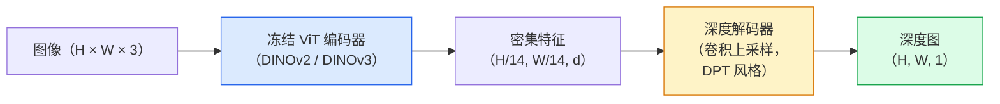

# 单目深度与几何估计

> 深度图是单通道图像，每个像素是距相机的距离。从单张 RGB 帧预测深度曾经在没有立体或 LiDAR 的情况下是不可能的。2026 年，一个冻结的 ViT 编码器加上轻量级头部能达到接近真实值几个百分点的精度。

**类型：** 构建 + 使用
**语言：** Python
**前置条件：** Phase 4 第 14 课（ViT），Phase 4 第 17 课（自监督视觉），Phase 4 第 07 课（U-Net）
**时长：** 约 60 分钟

## 学习目标

- 区分相对深度和度量深度，并说明每个生产模型（MiDaS、Marigold、Depth Anything V3、ZoeDepth）解决哪一类问题
- 使用 Depth Anything V3（DINOv2 骨干）在无需标定的情况下预测任意单张图像的深度
- 解释为何单目深度能从单张图像推断（透视线索、纹理梯度、学到的先验），以及它无法恢复什么（绝对尺度、遮挡几何）
- 使用深度图和针孔相机内参将 2D 检测提升到 3D 点

## 问题背景

深度是 2D 计算机视觉中缺失的轴。给定 RGB，你知道事物在图像平面上的位置；你不知道它们有多远。深度传感器（立体装置、LiDAR、飞行时间）直接解决这个问题，但成本高、易损坏、范围有限。

单目深度估计——从单张 RGB 帧预测深度——曾产生模糊、不可靠的输出。到 2026 年，大型预训练编码器改变了这一局面：Depth Anything V3 使用冻结的 DINOv2 骨干，生成能在室内、室外、医学和卫星领域泛化的深度图。Marigold 将深度重新定义为条件扩散问题。ZoeDepth 回归真实度量距离。

深度也是 2D 检测与 3D 理解之间的桥梁：将检测框的像素乘以深度，就能将 2D 对象提升到 3D 点云。这是每个 AR 遮挡系统、每个避障管线以及每个"拿起杯子"机器人的核心。

## 核心概念

### 相对深度 vs 度量深度

- **相对深度（Relative depth）** — 没有实际单位的有序 `z` 值。"像素 A 比像素 B 更近，但距离比率未锚定到米。"
- **度量深度（Metric depth）** — 从相机算起的绝对米距离。需要模型学习图像线索与真实距离之间的统计关系。

MiDaS 和 Depth Anything V3 生成相对深度。Marigold 生成相对深度。ZoeDepth、UniDepth 和 Metric3D 生成度量深度。度量模型对相机内参敏感；相对模型不敏感。

### 编码器-解码器模式



Depth Anything V3 冻结编码器，仅训练 DPT 风格的解码器。编码器提供丰富特征；解码器将其插值回图像分辨率并回归深度。

### 为何单张图像能产生深度

2D 图像包含许多与深度相关的单目线索：

- **透视（Perspective）** — 3D 中的平行线在 2D 中汇聚。
- **纹理梯度（Texture gradient）** — 远处的表面纹理更小、更密集。
- **遮挡顺序（Occlusion order）** — 近处对象遮挡远处对象。
- **尺寸恒常性（Size constancy）** — 已知对象（汽车、人类）给出近似尺度。
- **大气透视（Atmospheric perspective）** — 室外场景中远处对象看起来更模糊、更蓝。

在数十亿图像上训练的 ViT 将这些线索内化。有足够数据和强大骨干，单目深度无需任何显式 3D 监督就能达到合理精度。

### 单目深度做不到的事

- **绝对度量尺度** — 没有内参或场景中已知对象时无法确定。网络可以预测"杯子是勺子距离的两倍远"，而不知道杯子是 1 米还是 10 米远。
- **遮挡几何** — 椅子的背面不可见，无法可靠推断。
- **真正无纹理/反射表面** — 镜子、玻璃、均匀墙壁。网络报告貌似合理但错误的深度。

### 2026 年的 Depth Anything V3

- 使用普通 DINOv2 ViT-L/14 作为编码器（冻结）。
- DPT 解码器。
- 在来自多样来源的配对图像上训练（只需光度一致性，无需显式深度监督）。
- 对**任意数量视觉输入（已知或未知相机位姿）**预测空间一致的几何。
- 在单目深度、任意视角几何、视觉渲染、相机位姿估计上达到 SOTA。

这是 2026 年需要深度时直接调用的模型。

### Marigold——扩散用于深度

Marigold（Ke 等，CVPR 2024）将深度估计重新定义为条件图像到图像扩散。条件：RGB。目标：深度图。使用预训练的 Stable Diffusion 2 U-Net 作为骨干。输出深度图在物体边界处非常清晰。权衡：推理比前馈模型慢（10-50 次去噪步骤）。

### 内参和针孔相机

将深度为 `d` 的像素 `(u, v)` 提升到相机坐标中的 3D 点 `(X, Y, Z)`：

```
fx, fy, cx, cy = 相机内参
X = (u - cx) * d / fx
Y = (v - cy) * d / fy
Z = d
```

内参来自 EXIF 元数据、标定图案或单目内参估计器（Perspective Fields、UniDepth）。没有内参，你仍然可以通过假设 60-70° FOV 和适中分辨率主点来渲染点云——可用于可视化，但不适用于测量。

### 评估

两个标准指标：

- **AbsRel**（绝对相对误差）：`mean(|d_pred - d_gt| / d_gt)`。越低越好。生产模型为 0.05-0.1。
- **delta < 1.25**（阈值精度）：`max(d_pred/d_gt, d_gt/d_pred) < 1.25` 的像素比例。越高越好。SOTA 为 0.9+。

对于相对深度（Depth Anything V3、MiDaS），评估使用两个指标的尺度和偏移不变版本。

## 动手实现

### 步骤一：深度指标

```python
import torch

def abs_rel_error(pred, target, mask=None):
    if mask is not None:
        pred = pred[mask]
        target = target[mask]
    return (torch.abs(pred - target) / target.clamp(min=1e-6)).mean().item()


def delta_accuracy(pred, target, threshold=1.25, mask=None):
    if mask is not None:
        pred = pred[mask]
        target = target[mask]
    ratio = torch.maximum(pred / target.clamp(min=1e-6), target / pred.clamp(min=1e-6))
    return (ratio < threshold).float().mean().item()
```

评估前始终遮蔽无效深度像素（零、NaN、饱和）。

### 步骤二：尺度和偏移对齐

对于相对深度模型，在计算指标之前将预测与真实值对齐。对 `a * pred + b = target` 进行最小二乘拟合：

```python
def align_scale_shift(pred, target, mask=None):
    if mask is not None:
        p = pred[mask]
        t = target[mask]
    else:
        p = pred.flatten()
        t = target.flatten()
    A = torch.stack([p, torch.ones_like(p)], dim=1)
    coeffs, *_ = torch.linalg.lstsq(A, t.unsqueeze(-1))
    a, b = coeffs[:2, 0]
    return a * pred + b
```

评估 MiDaS / Depth Anything 时，在 `abs_rel_error` 之前运行 `align_scale_shift`。

### 步骤三：将深度提升为点云

```python
import numpy as np

def depth_to_point_cloud(depth, intrinsics):
    H, W = depth.shape
    fx, fy, cx, cy = intrinsics
    v, u = np.meshgrid(np.arange(H), np.arange(W), indexing="ij")
    z = depth
    x = (u - cx) * z / fx
    y = (v - cy) * z / fy
    return np.stack([x, y, z], axis=-1)


depth = np.random.uniform(0.5, 4.0, (240, 320))
intr = (320.0, 320.0, 160.0, 120.0)
pc = depth_to_point_cloud(depth, intr)
print(f"point cloud shape: {pc.shape}  (H, W, 3)")
```

一个函数，适用于所有 3D 提升应用。将点云导出为 `.ply` 并在 MeshLab 或 CloudCompare 中查看。

### 步骤四：合成深度场景冒烟测试

```python
def synthetic_depth(size=96):
    yy, xx = np.meshgrid(np.arange(size), np.arange(size), indexing="ij")
    # Floor: linear gradient from near (top) to far (bottom)
    depth = 1.0 + (yy / size) * 4.0
    # Box in the middle: closer
    mask = (np.abs(xx - size / 2) < size / 6) & (np.abs(yy - size * 0.6) < size / 6)
    depth[mask] = 2.0
    return depth.astype(np.float32)


gt = torch.from_numpy(synthetic_depth(96))
pred = gt + 0.3 * torch.randn_like(gt)  # simulated prediction
aligned = align_scale_shift(pred, gt)
print(f"before align  absRel = {abs_rel_error(pred, gt):.3f}")
print(f"after align   absRel = {abs_rel_error(aligned, gt):.3f}")
```

### 步骤五：Depth Anything V3 使用（参考）

```python
import torch
from transformers import pipeline
from PIL import Image

pipe = pipeline(task="depth-estimation", model="LiheYoung/depth-anything-v2-large")

image = Image.open("street.jpg").convert("RGB")
out = pipe(image)
depth_np = np.array(out["depth"])
```

三行代码。`out["depth"]` 是 PIL 灰度图；转换为 numpy 进行数学运算。对于 Depth Anything V3，发布后更换模型 id；API 不变。

## 生产使用

- **Depth Anything V3**（Meta AI / ByteDance，2024-2026）— 相对深度的默认方案。生产中最快的 ViT-large 骨干模型。
- **Marigold**（ETH，2024）— 最高视觉质量，推理慢。
- **UniDepth**（ETH，2024）— 带相机内参估计的度量深度。
- **ZoeDepth**（Intel，2023）— 度量深度；较旧，仍然可靠。
- **MiDaS v3.1** — 遗留但稳定；用于对比的良好基线。

典型集成模式：

1. RGB 帧到达。
2. 深度模型生成深度图。
3. 检测器生成框。
4. 通过深度将框质心提升到 3D；如果可用，与点云合并。
5. 下游：AR 遮挡、路径规划、对象尺寸估计、立体替代。

对于实时使用，Depth Anything V2 Small（INT8 量化）在消费级 GPU 上以 518×518 分辨率达到约 30fps。

## 关键术语

| 术语 | 常见说法 | 实际含义 |
|------|---------|---------|
| 单目深度（Monocular depth） | "单图像深度" | 从一张 RGB 帧估计深度，无立体或 LiDAR |
| 相对深度（Relative depth） | "有序深度" | 没有实际单位的有序 z 值 |
| 度量深度（Metric depth） | "绝对距离" | 以米为单位的深度；需要标定或使用度量监督训练的模型 |
| AbsRel | "绝对相对误差" | |d_pred - d_gt| / d_gt 的均值；标准深度指标 |
| Delta 精度 | "delta < 1.25" | 预测值在真实值 25% 以内的像素比例 |
| 针孔相机（Pinhole camera） | "fx, fy, cx, cy" | 用于将 (u, v, d) 提升到 (X, Y, Z) 的相机模型 |
| DPT | "密集预测 Transformer" | 用于在冻结 ViT 编码器之上进行深度预测的基于卷积的解码器 |
| DINOv2 骨干 | "它工作的原因" | 跨领域泛化的自监督特征，无需深度标签 |

## 延伸阅读

- [Depth Anything V3 paper page](https://depth-anything.github.io/) — 使用 DINOv2 编码器的 SOTA 单目深度
- [Marigold (Ke et al., CVPR 2024)](https://marigoldmonodepth.github.io/) — 基于扩散的深度估计
- [UniDepth (Piccinelli et al., 2024)](https://arxiv.org/abs/2403.18913) — 带内参的度量深度
- [MiDaS v3.1 (Intel ISL)](https://github.com/isl-org/MiDaS) — 经典相对深度基线
- [DINOv3 blog post (Meta)](https://ai.meta.com/blog/dinov3-self-supervised-vision-model/) — 提升深度精度的编码器系列
