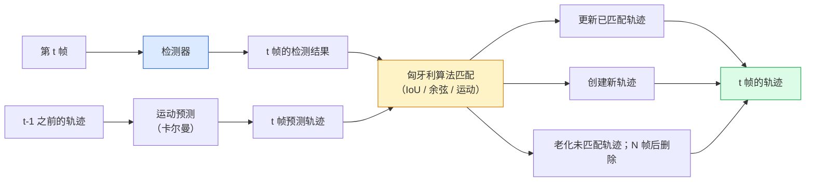

# 多目标跟踪与视频记忆

> 跟踪是检测加关联。检测每一帧。将这一帧的检测与上一帧的跟踪轨迹按 ID 匹配。

**类型：** 构建
**语言：** Python
**前置条件：** Phase 4 第 06 课（YOLO 检测），Phase 4 第 08 课（Mask R-CNN），Phase 4 第 24 课（SAM 3）
**时长：** 约 60 分钟

## 学习目标

- 区分检测式跟踪和查询式跟踪，并说出算法家族（SORT、DeepSORT、ByteTrack、BoT-SORT、SAM 2 记忆跟踪器、SAM 3.1 Object Multiplex）
- 从零实现 IoU + 匈牙利算法匹配，用于经典检测式跟踪
- 解释 SAM 2 的记忆库及其为何比基于 IoU 的关联更好地处理遮挡
- 读懂三种跟踪指标（MOTA、IDF1、HOTA），并为给定用例选择合适的指标

## 问题背景

检测器告诉你单帧中对象在哪里。跟踪器告诉你第 `t` 帧中的哪个检测结果与第 `t-1` 帧中的检测结果是同一个对象。没有它，你无法计数越过线的对象、跟随球穿过遮挡，或知道"4 号车在车道中已经 8 秒了"。

跟踪对每个面向视频的产品都是必不可少的：体育分析、监控、自动驾驶、医学视频分析、野生动物监测、水印计数。核心构建块是共享的：逐帧检测器、运动模型（卡尔曼滤波器或更丰富的东西）、关联步骤（在 IoU / 余弦 / 学习特征上的匈牙利算法）和轨迹生命周期（出生、更新、消亡）。

2026 年带来了两种新模式：**SAM 2 基于记忆的跟踪**（特征记忆代替运动模型关联）和 **SAM 3.1 Object Multiplex**（同一概念多个实例的共享记忆）。本课先介绍经典技术栈，再介绍基于记忆的方法。

## 核心概念

### 检测式跟踪



2026 年你遇到的每个跟踪器都是这个循环的变体。区别：

- **SORT**（2016）：卡尔曼滤波器 + IoU 匈牙利算法。简单、快速、无外观模型。
- **DeepSORT**（2017）：SORT + 每个轨迹一个基于 CNN 的外观特征（ReID 嵌入）。更好地处理交叉。
- **ByteTrack**（2021）：将低置信度检测作为第二阶段进行关联；无需外观特征，但在 MOT17 上表现最佳。
- **BoT-SORT**（2022）：ByteTrack + 相机运动补偿 + ReID。
- **StrongSORT / OC-SORT** — ByteTrack 的后代，具有更好的运动和外观处理。

### 卡尔曼滤波器一段话

卡尔曼滤波器为每个轨迹维护状态 `(x, y, w, h, dx, dy, dw, dh)` 及其协方差。在每一帧，用常速度模型**预测**状态，然后用匹配的检测**更新**。当预测不确定性高时，更新更信任检测。这给出平滑的轨迹和在短暂遮挡（1-5 帧）中继续跟踪的能力。

每个经典跟踪器都在运动预测步骤中使用卡尔曼滤波器。

### 匈牙利算法

给定一个 `M × N` 代价矩阵（轨迹 × 检测），找到最小化总代价的一对一分配。代价通常是 `1 - IoU(track_bbox, detection_bbox)` 或外观特征的负余弦相似度。运行时间为 O((M+N)^3)；对于 M、N 最多约 1000 的情况，通过 `scipy.optimize.linear_sum_assignment` 在 Python 中足够快。

### ByteTrack 的核心思想

标准跟踪器丢弃低置信度检测（< 0.5）。ByteTrack 将它们保留为**第二阶段候选**：在将轨迹与高置信度检测匹配后，未匹配的轨迹尝试以稍宽松的 IoU 阈值匹配低置信度检测。恢复短暂遮挡，减少拥挤场景附近的 ID 切换。

### SAM 2 基于记忆的跟踪

SAM 2 通过保存每个实例的**记忆库**（逐实例时空特征）来处理视频。给定一帧上的提示（点击、框、文本），它将实例编码到记忆中。在后续帧上，记忆与新帧的特征做交叉注意力，解码器为新帧中的同一实例生成掩码。

没有卡尔曼滤波器，没有匈牙利算法。关联隐含在记忆注意力操作中。

优点：
- 对大遮挡鲁棒（记忆跨多帧保持实例身份）。
- 与 SAM 3 文本提示结合时支持开放词汇。
- 不需要独立运动模型。

缺点：
- 对于多对象跟踪，比 ByteTrack 慢。
- 记忆库增长；限制上下文窗口。

### SAM 3.1 Object Multiplex

先前的 SAM 2 / SAM 3 跟踪为每个实例保留一个独立记忆库。50 个对象需要 50 个记忆库。Object Multiplex（2026 年 3 月）将它们折叠为一个共享记忆，使用**逐实例查询 token**。成本随实例数量次线性扩展。

Multiplex 是 2026 年人群跟踪的新默认方案：演唱会人群、仓库工人、交通路口。

### 三个需要了解的指标

- **MOTA（多目标跟踪精度）** — 1 - (FN + FP + ID 切换) / GT。按错误类型加权；将检测和关联失败混为一谈的单一指标。
- **IDF1（ID F1）** — ID 精度和召回率的调和均值。专注于每个真实轨迹随时间保持其 ID 的程度。对于 ID 切换敏感任务比 MOTA 更好。
- **HOTA（高阶跟踪精度）** — 分解为检测精度（DetA）和关联精度（AssA）。2020 年以来的社区标准；最全面。

对于监控（谁是谁）：报告 IDF1。对于体育分析（计数传球）：HOTA。对于一般学术对比：HOTA。

## 动手实现

### 步骤一：基于 IoU 的代价矩阵

```python
import numpy as np


def bbox_iou(a, b):
    """
    a, b: (N, 4) arrays of [x1, y1, x2, y2].
    Returns (N_a, N_b) IoU matrix.
    """
    ax1, ay1, ax2, ay2 = a[:, 0], a[:, 1], a[:, 2], a[:, 3]
    bx1, by1, bx2, by2 = b[:, 0], b[:, 1], b[:, 2], b[:, 3]
    inter_x1 = np.maximum(ax1[:, None], bx1[None, :])
    inter_y1 = np.maximum(ay1[:, None], by1[None, :])
    inter_x2 = np.minimum(ax2[:, None], bx2[None, :])
    inter_y2 = np.minimum(ay2[:, None], by2[None, :])
    inter = np.clip(inter_x2 - inter_x1, 0, None) * np.clip(inter_y2 - inter_y1, 0, None)
    area_a = (ax2 - ax1) * (ay2 - ay1)
    area_b = (bx2 - bx1) * (by2 - by1)
    union = area_a[:, None] + area_b[None, :] - inter
    return inter / np.clip(union, 1e-8, None)
```

### 步骤二：最简 SORT 风格跟踪器

为简洁起见省略固定常速度卡尔曼——这里使用简单 IoU 关联；在生产中卡尔曼预测是必需的。`sort` Python 包提供完整版本。

```python
from scipy.optimize import linear_sum_assignment


class Track:
    def __init__(self, tid, bbox, frame):
        self.id = tid
        self.bbox = bbox
        self.last_frame = frame
        self.hits = 1

    def update(self, bbox, frame):
        self.bbox = bbox
        self.last_frame = frame
        self.hits += 1


class SimpleTracker:
    def __init__(self, iou_threshold=0.3, max_age=5):
        self.tracks = []
        self.next_id = 1
        self.iou_threshold = iou_threshold
        self.max_age = max_age

    def step(self, detections, frame):
        if not self.tracks:
            for d in detections:
                self.tracks.append(Track(self.next_id, d, frame))
                self.next_id += 1
            return [(t.id, t.bbox) for t in self.tracks]

        track_boxes = np.array([t.bbox for t in self.tracks])
        det_boxes = np.array(detections) if len(detections) else np.empty((0, 4))

        iou = bbox_iou(track_boxes, det_boxes) if len(det_boxes) else np.zeros((len(track_boxes), 0))
        cost = 1 - iou
        cost[iou < self.iou_threshold] = 1e6

        matched_track = set()
        matched_det = set()
        if cost.size > 0:
            row, col = linear_sum_assignment(cost)
            for r, c in zip(row, col):
                if cost[r, c] < 1.0:
                    self.tracks[r].update(det_boxes[c], frame)
                    matched_track.add(r); matched_det.add(c)

        for i, d in enumerate(det_boxes):
            if i not in matched_det:
                self.tracks.append(Track(self.next_id, d, frame))
                self.next_id += 1

        self.tracks = [t for t in self.tracks if frame - t.last_frame <= self.max_age]
        return [(t.id, t.bbox) for t in self.tracks]
```

60 行。接受逐帧检测，返回逐帧轨迹 ID。真实系统会添加卡尔曼预测、ByteTrack 的第二阶段重匹配和外观特征。

### 步骤三：合成轨迹测试

```python
def synthetic_frames(num_frames=20, num_objects=3, H=240, W=320, seed=0):
    rng = np.random.default_rng(seed)
    starts = rng.uniform(20, 200, size=(num_objects, 2))
    velocities = rng.uniform(-5, 5, size=(num_objects, 2))
    frames = []
    for f in range(num_frames):
        dets = []
        for i in range(num_objects):
            cx, cy = starts[i] + f * velocities[i]
            dets.append([cx - 10, cy - 10, cx + 10, cy + 10])
        frames.append(dets)
    return frames


tracker = SimpleTracker()
for f, dets in enumerate(synthetic_frames()):
    tracks = tracker.step(dets, f)
```

三个沿直线移动的对象应该在所有 20 帧中保持其 ID。

### 步骤四：ID 切换指标

```python
def count_id_switches(tracks_per_frame, gt_per_frame):
    """
    tracks_per_frame:  list of list of (track_id, bbox)
    gt_per_frame:      list of list of (gt_id, bbox)
    Returns number of ID switches.
    """
    prev_assignment = {}
    switches = 0
    for tracks, gts in zip(tracks_per_frame, gt_per_frame):
        if not tracks or not gts:
            continue
        t_boxes = np.array([b for _, b in tracks])
        g_boxes = np.array([b for _, b in gts])
        iou = bbox_iou(g_boxes, t_boxes)
        for g_idx, (gt_id, _) in enumerate(gts):
            j = iou[g_idx].argmax()
            if iou[g_idx, j] > 0.5:
                t_id = tracks[j][0]
                if gt_id in prev_assignment and prev_assignment[gt_id] != t_id:
                    switches += 1
                prev_assignment[gt_id] = t_id
    return switches
```

这是简化的类 IDF1 指标：计算真实对象改变其分配的预测轨迹 ID 的次数。真实的 MOTA / IDF1 / HOTA 工具在 `py-motmetrics` 和 `TrackEval` 中。

## 生产使用

2026 年的生产跟踪器：

- `ultralytics` — YOLOv8 + 内置 ByteTrack / BoT-SORT。`results = model.track(source, tracker="bytetrack.yaml")`。默认方案。
- `supervision`（Roboflow）— ByteTrack 封装加标注工具。
- SAM 2 / SAM 3.1 — 通过 `processor.track()` 进行基于记忆的跟踪。
- 自定义技术栈：检测器（YOLOv8 / RT-DETR）+ `sort-tracker` / `OC-SORT` / `StrongSORT`。

选择：

- 行人 / 汽车 / 框在 30+ fps：**使用 ultralytics 的 ByteTrack**。
- 人群中同一类别的多个实例：**SAM 3.1 Object Multiplex**。
- 有可识别外观的重度遮挡：**DeepSORT / StrongSORT**（ReID 特征）。
- 体育 / 复杂交互：**BoT-SORT** 或学习型跟踪器（MOTRv3）。

## 关键术语

| 术语 | 常见说法 | 实际含义 |
|------|---------|---------|
| 检测式跟踪（Tracking-by-detection） | "先检测后关联" | 逐帧检测器 + 在 IoU / 外观上的匈牙利算法 |
| 卡尔曼滤波器（Kalman filter） | "运动预测" | 线性动力学 + 协方差，用于平滑轨迹预测和遮挡处理 |
| 匈牙利算法（Hungarian algorithm） | "最优分配" | 解决最小代价二部图匹配问题；`scipy.optimize.linear_sum_assignment` |
| ByteTrack | "低置信度第二轮" | 将未匹配轨迹重新与低置信度检测匹配，恢复短暂遮挡 |
| DeepSORT | "SORT + 外观" | 添加 ReID 特征用于跨帧匹配；更好地保持 ID |
| 记忆库（Memory bank） | "SAM 2 技巧" | 跨帧存储的逐实例时空特征；交叉注意力替代显式关联 |
| Object Multiplex | "SAM 3.1 共享记忆" | 单个共享记忆加逐实例查询，用于快速多对象跟踪 |
| HOTA | "现代跟踪指标" | 分解为检测和关联精度；社区标准 |

## 延伸阅读

- [SORT (Bewley et al., 2016)](https://arxiv.org/abs/1602.00763) — 最简检测式跟踪论文
- [DeepSORT (Wojke et al., 2017)](https://arxiv.org/abs/1703.07402) — 添加外观特征
- [ByteTrack (Zhang et al., 2022)](https://arxiv.org/abs/2110.06864) — 低置信度第二轮
- [BoT-SORT (Aharon et al., 2022)](https://arxiv.org/abs/2206.14651) — 相机运动补偿
- [HOTA (Luiten et al., 2020)](https://arxiv.org/abs/2009.07736) — 分解跟踪指标
- [SAM 2 video segmentation (Meta, 2024)](https://ai.meta.com/sam2/) — 基于记忆的跟踪器
- [SAM 3.1 Object Multiplex (Meta, March 2026)](https://ai.meta.com/blog/segment-anything-model-3/)
