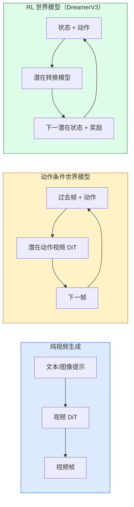

# 世界模型与视频扩散

> 预测场景接下来几秒的视频模型就是一个世界模拟器。将该预测基于动作进行条件控制，你就得到了一个学习型游戏引擎。

**类型：** 学习 + 构建
**语言：** Python
**前置条件：** Phase 4 第 10 课（扩散），Phase 4 第 12 课（视频理解），Phase 4 第 23 课（DiT + 整流流）
**时长：** 约 75 分钟

## 学习目标

- 解释纯视频生成模型（Sora 2）和动作条件世界模型（Genie 3、DreamerV3）的区别
- 描述视频 DiT：时空 patch、3D 位置编码、跨 (T, H, W) token 的联合注意力
- 追踪世界模型如何接入机器人：VLM 规划 → 视频模型模拟 → 逆动力学发出动作
- 为给定用例（创意视频、交互仿真、自动驾驶合成）在 Sora 2、Genie 3、Runway GWM-1 Worlds、Wan-Video 和 HunyuanVideo 之间做选择

## 问题背景

视频生成和世界建模在 2026 年融合了。能够生成连贯的一分钟视频的模型，从某种意义上说，已经学会了世界的运动方式：对象永久性、重力、因果关系、风格。如果你将该预测基于动作（向左走、开门）进行条件控制，视频模型就变成了可学习的模拟器，可以替代游戏引擎、驾驶模拟器或机器人环境。

赌注是具体的。Genie 3 从单张图像生成可玩环境。Runway GWM-1 Worlds 合成无限可探索场景。Sora 2 生成带同步音频和建模物理的长达一分钟的视频。NVIDIA Cosmos-Drive、Wayve Gaia-2 和 Tesla DrivingWorld 为自动驾驶汽车训练数据生成逼真的驾驶视频。世界模型范式正在悄悄地接管机器人的仿真到现实迁移。

本课是 Phase 4 的"宏观图景"课程。它将图像生成、视频理解和智能体推理连接成当前主导研究正在走向的架构模式。

## 核心概念

### 世界建模的三个家族



- **Sora 2** 是基于提示词的纯视频生成。没有动作接口。你无法在生成途中"引导"它。
- **Genie 3**、**GWM-1 Worlds**、**Mirage / Magica** 是动作条件世界模型。从观察到的视频推断潜在动作，然后基于动作对未来帧预测进行条件控制。可交互——你按键或移动相机，场景随之响应。
- **DreamerV3** 和经典 RL 世界模型家族在潜在空间中预测，具有显式动作条件控制，在奖励信号上训练。视觉性较弱；对样本高效 RL 更有用。

### 视频 DiT 架构

```
视频潜在:          (C, T, H, W)
空间 patch 化:     每帧 P_h × P_w 个 patch 的网格
时间 patch 化:     将 P_t 帧分组为一个时间 patch
得到的 token:      (T / P_t) * (H / P_h) * (W / P_w) 个 token
```

位置编码是 3D 的：每个 (t, h, w) 坐标的旋转或学习嵌入。注意力可以是：

- **完全联合** — 所有 token 相互注意。N 个 token 的 O(N^2)。对于长视频不可行。
- **分离** — 交替进行时间注意力（同一空间位置，跨时间：`(H*W) * T^2`）和空间注意力（同一时间步，跨空间：`T * (H*W)^2`）。被 TimeSformer 和大多数视频 DiT 使用。
- **窗口** — (t, h, w) 中的局部窗口。被 Video Swin 使用。

2026 年每个视频扩散模型都使用这三种模式之一，加上 AdaLN 条件控制（第 23 课）和整流流。

### 基于动作的条件控制：潜在动作模型

Genie 通过判别性地预测连续帧对之间的动作来学习每帧的**潜在动作**。模型的解码器然后基于推断的潜在动作进行条件控制——而非基于显式键盘按键。在推理时，用户可以指定潜在动作（或从新先验中采样一个），模型生成与该动作一致的下一帧。

Sora 完全跳过动作接口。其解码器从过去的时空 token 预测下一个时空 token。提示词条件控制起始；没有什么在生成途中引导它。

### 物理合理性

Sora 2 的 2026 版本明确宣传了**物理合理性**：重量、平衡、对象永久性、因果关系。由团队通过手动评分的合理性分数测量；与 Sora 1 相比，模型在掉落物体、角色碰撞和"故意失败"（跳跃失误）上明显改善。

合理性仍然是主要的失败模式。2024-2025 年关于人们吃意大利面或从玻璃杯喝水的视频揭示了模型缺乏持久对象表示的问题。2026 年模型（Sora 2、Runway Gen-5、HunyuanVideo）减少但未消除这些问题。

### 自动驾驶世界模型

驾驶世界模型基于轨迹、边界框或导航地图生成逼真的道路场景。用途：

- **Cosmos-Drive-Dreams**（NVIDIA）— 为 RL 训练生成分钟级驾驶视频。
- **Gaia-2**（Wayve）— 轨迹条件场景合成用于策略评估。
- **DrivingWorld**（Tesla）— 模拟多变天气、一天中的时段、交通状况。
- **Vista**（ByteDance）— 反应式驾驶场景合成。

它们替代了边角情况的昂贵真实世界数据收集——夜间行人乱穿马路、结冰路口、不寻常车辆类型——否则这些情况需要数百万英里的驾驶。

### 机器人技术栈：VLM + 视频模型 + 逆动力学

新兴的三组件机器人循环：

1. **VLM** 解析目标（"拿起红色杯子"），规划高层动作序列。
2. **视频生成模型** 模拟执行每个动作会是什么样子——提前预测 N 帧的观察。
3. **逆动力学模型** 提取会产生这些观察的具体电机命令。

这取代了奖励塑造和样本密集型 RL。世界模型负责想象；逆动力学闭合驱动的循环。Genie Envisioner 是一个实例；许多研究组正在向这个结构靠拢。

### 评估

- **视觉质量** — FVD（Fréchet 视频距离）、用户研究。
- **提示词对齐** — 每帧的 CLIPScore、VQA 风格评估。
- **物理合理性** — 在基准套件上手动评分（Sora 2 的内部基准、VBench）。
- **可控性**（对于交互式世界模型）— 动作 → 观察一致性；你能回到先前状态吗？

### 2026 年的模型格局

| 模型 | 用途 | 参数量 | 输出 | 许可证 |
|------|------|--------|------|--------|
| Sora 2 | 文本到视频，音频 | — | 1 分钟 1080p + 音频 | 仅 API |
| Runway Gen-5 | 文本/图像到视频 | — | 10 秒片段 | API |
| Runway GWM-1 Worlds | 交互式世界 | — | 无限 3D 展开 | API |
| Genie 3 | 从图像生成交互式世界 | 110 亿+ | 可玩帧 | 研究预览 |
| Wan-Video 2.1 | 开源文本到视频 | 140 亿 | 高质量片段 | 非商业 |
| HunyuanVideo | 开源文本到视频 | 130 亿 | 10 秒片段 | 宽松 |
| Cosmos / Cosmos-Drive | 自动驾驶仿真 | 70-140 亿 | 驾驶场景 | NVIDIA 开源 |
| Magica / Mirage 2 | AI 原生游戏引擎 | — | 可修改世界 | 商业产品 |

## 动手实现

### 步骤一：视频的 3D Patch 化

```python
import torch
import torch.nn as nn


class VideoPatch3D(nn.Module):
    def __init__(self, in_channels=4, dim=64, patch_t=2, patch_h=2, patch_w=2):
        super().__init__()
        self.proj = nn.Conv3d(
            in_channels, dim,
            kernel_size=(patch_t, patch_h, patch_w),
            stride=(patch_t, patch_h, patch_w),
        )
        self.patch_t = patch_t
        self.patch_h = patch_h
        self.patch_w = patch_w

    def forward(self, x):
        # x: (N, C, T, H, W)
        x = self.proj(x)
        n, c, t, h, w = x.shape
        tokens = x.reshape(n, c, t * h * w).transpose(1, 2)
        return tokens, (t, h, w)
```

步长等于核的 3D 卷积充当时空 patch 化器。`(T, H, W) -> (T/2, H/2, W/2)` 的 token 网格。

### 步骤二：3D 旋转位置编码

沿 `t`、`h`、`w` 轴分别应用旋转位置嵌入（RoPE）：

```python
def rope_3d(tokens, t_dim, h_dim, w_dim, grid):
    """
    tokens: (N, T*H*W, D)
    grid: (T, H, W) sizes
    t_dim + h_dim + w_dim == D
    """
    T, H, W = grid
    n, seq, d = tokens.shape
    if t_dim + h_dim + w_dim != d:
        raise ValueError(f"t_dim+h_dim+w_dim ({t_dim}+{h_dim}+{w_dim}) must equal D={d}")
    assert seq == T * H * W
    t_idx = torch.arange(T, device=tokens.device).repeat_interleave(H * W)
    h_idx = torch.arange(H, device=tokens.device).repeat_interleave(W).repeat(T)
    w_idx = torch.arange(W, device=tokens.device).repeat(T * H)
    # Simplified: just scale channels by frequencies. Real RoPE rotates pairs.
    freqs_t = torch.exp(-torch.log(torch.tensor(10000.0)) * torch.arange(t_dim // 2, device=tokens.device) / (t_dim // 2))
    freqs_h = torch.exp(-torch.log(torch.tensor(10000.0)) * torch.arange(h_dim // 2, device=tokens.device) / (h_dim // 2))
    freqs_w = torch.exp(-torch.log(torch.tensor(10000.0)) * torch.arange(w_dim // 2, device=tokens.device) / (w_dim // 2))
    emb_t = torch.cat([torch.sin(t_idx[:, None] * freqs_t), torch.cos(t_idx[:, None] * freqs_t)], dim=-1)
    emb_h = torch.cat([torch.sin(h_idx[:, None] * freqs_h), torch.cos(h_idx[:, None] * freqs_h)], dim=-1)
    emb_w = torch.cat([torch.sin(w_idx[:, None] * freqs_w), torch.cos(w_idx[:, None] * freqs_w)], dim=-1)
    return tokens + torch.cat([emb_t, emb_h, emb_w], dim=-1)
```

简化的加法形式。真实 RoPE 在频率处旋转配对通道；位置信息是相同的。

### 步骤三：分离注意力块

```python
class DividedAttentionBlock(nn.Module):
    def __init__(self, dim=64, heads=2):
        super().__init__()
        self.time_attn = nn.MultiheadAttention(dim, heads, batch_first=True)
        self.space_attn = nn.MultiheadAttention(dim, heads, batch_first=True)
        self.ln1 = nn.LayerNorm(dim)
        self.ln2 = nn.LayerNorm(dim)
        self.ln3 = nn.LayerNorm(dim)
        self.mlp = nn.Sequential(nn.Linear(dim, 4 * dim), nn.GELU(), nn.Linear(4 * dim, dim))

    def forward(self, x, grid):
        T, H, W = grid
        n, seq, d = x.shape
        # time attention: same (h, w), across t
        xt = x.view(n, T, H * W, d).permute(0, 2, 1, 3).reshape(n * H * W, T, d)
        a, _ = self.time_attn(self.ln1(xt), self.ln1(xt), self.ln1(xt), need_weights=False)
        xt = (xt + a).reshape(n, H * W, T, d).permute(0, 2, 1, 3).reshape(n, seq, d)
        # space attention: same t, across (h, w)
        xs = xt.view(n, T, H * W, d).reshape(n * T, H * W, d)
        a, _ = self.space_attn(self.ln2(xs), self.ln2(xs), self.ln2(xs), need_weights=False)
        xs = (xs + a).reshape(n, T, H * W, d).reshape(n, seq, d)
        xs = xs + self.mlp(self.ln3(xs))
        return xs
```

时间注意力在每个空间位置跨时间做注意力；空间注意力在每一帧跨位置做注意力。两个 O(T^2 + (HW)^2) 操作代替一个 O((THW)^2)。这是 TimeSformer 和每个现代视频 DiT 的核心。

### 步骤四：组合微型视频 DiT

```python
class TinyVideoDiT(nn.Module):
    def __init__(self, in_channels=4, dim=64, depth=2, heads=2):
        super().__init__()
        self.patch = VideoPatch3D(in_channels=in_channels, dim=dim, patch_t=2, patch_h=2, patch_w=2)
        self.blocks = nn.ModuleList([DividedAttentionBlock(dim, heads) for _ in range(depth)])
        self.out = nn.Linear(dim, in_channels * 2 * 2 * 2)

    def forward(self, x):
        tokens, grid = self.patch(x)
        for blk in self.blocks:
            tokens = blk(tokens, grid)
        return self.out(tokens), grid
```

不是一个可工作的视频生成器；是每个部件形状正确的结构演示。

### 步骤五：检查形状

```python
vid = torch.randn(1, 4, 8, 16, 16)  # (N, C, T, H, W)
model = TinyVideoDiT()
out, grid = model(vid)
print(f"input  {tuple(vid.shape)}")
print(f"tokens grid {grid}")
print(f"output {tuple(out.shape)}")
```

patch 化后期望 `grid = (4, 8, 8)` 和 `out = (1, 256, 32)`；头部然后投影到逐 token 的时空 patch，准备好反 patch 化回视频。

## 生产使用

2026 年的生产访问模式：

- **Sora 2 API**（OpenAI）— 文本到视频，同步音频。高级定价。
- **Runway Gen-5 / GWM-1**（Runway）— 图像到视频，交互式世界。
- **Wan-Video 2.1 / HunyuanVideo** — 开源自托管。
- **Cosmos / Cosmos-Drive**（NVIDIA）— 驾驶仿真开放权重。
- **Genie 3** — 研究预览，申请访问。

构建交互式世界模型演示：从 Wan-Video 开始获取质量，在其上叠加潜在动作适配器实现交互性。对于自动驾驶仿真：Cosmos-Drive 是 2026 年的开源参考。

机器人的实际技术栈：

1. 语言目标 -> VLM（Qwen3-VL）-> 高层计划。
2. 计划 -> 潜在动作视频模型 -> 想象的展开。
3. 展开 -> 逆动力学模型 -> 低层动作。
4. 动作执行 -> 观察反馈到步骤 1。

## 关键术语

| 术语 | 常见说法 | 实际含义 |
|------|---------|---------|
| 世界模型（World model） | "学习型模拟器" | 给定状态和动作预测未来观察的模型 |
| 视频 DiT（Video DiT） | "时空 Transformer" | 带 3D patch 化和分离注意力的扩散 Transformer |
| 潜在动作（Latent action） | "推断控制" | 从帧对推断的离散或连续动作潜变量；用于条件下一帧生成 |
| 分离注意力（Divided attention） | "先时间后空间" | 每块两次注意力操作——先跨时间后跨空间——使 O(N^2) 可管理 |
| 对象永久性（Object permanence） | "事物保持真实" | 视频模型必须学习的场景属性；食物、玻璃器皿的经典失败模式 |
| FVD | "Fréchet 视频距离" | FID 的视频等价物；主要视觉质量指标 |
| 逆动力学模型（Inverse dynamics model） | "观察到动作" | 给定（状态，下一状态），输出连接它们的动作；闭合机器人循环 |
| Cosmos-Drive | "NVIDIA 驾驶仿真" | 用于 RL 和评估的开放权重自动驾驶世界模型 |

## 延伸阅读

- [Sora technical report (OpenAI)](https://openai.com/index/video-generation-models-as-world-simulators/)
- [Genie: Generative Interactive Environments (Bruce et al., 2024)](https://arxiv.org/abs/2402.15391) — 潜在动作世界模型
- [TimeSformer (Bertasius et al., 2021)](https://arxiv.org/abs/2102.05095) — 视频 Transformer 的分离注意力
- [DreamerV3 (Hafner et al., 2023)](https://arxiv.org/abs/2301.04104) — RL 的世界模型
- [Cosmos-Drive-Dreams (NVIDIA, 2025)](https://research.nvidia.com/labs/toronto-ai/cosmos-drive-dreams/) — 驾驶世界模型
- [Top 10 Video Generation Models 2026 (DataCamp)](https://www.datacamp.com/blog/top-video-generation-models)
- [From Video Generation to World Model — survey repo](https://github.com/ziqihuangg/Awesome-From-Video-Generation-to-World-Model/)
