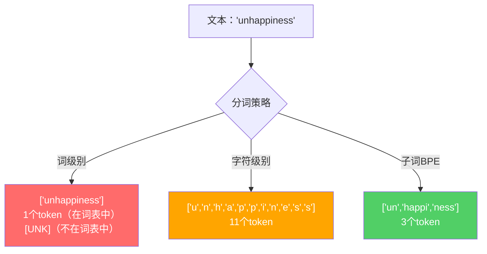
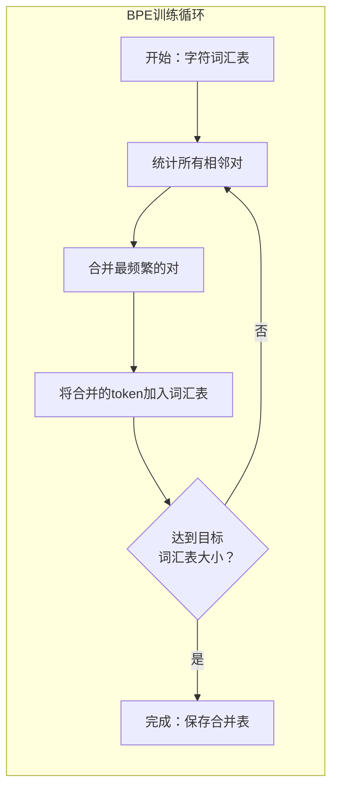
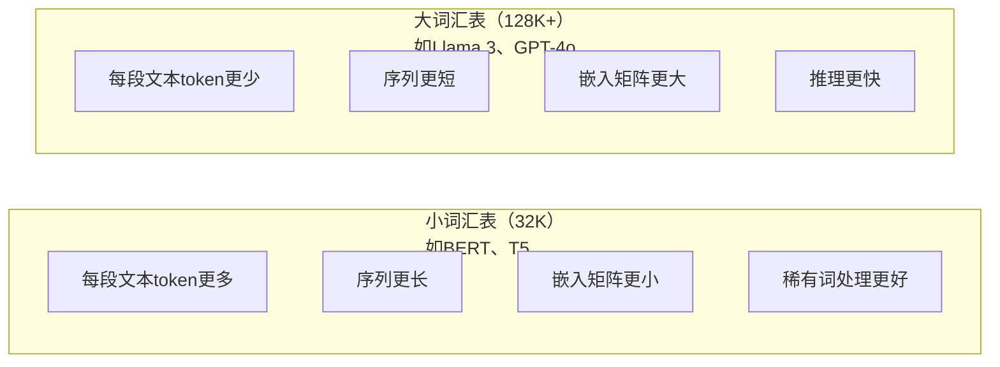

# 分词器：BPE、WordPiece、SentencePiece

> 你的大语言模型不阅读英语。它阅读整数。分词器决定这些整数是在传递意义，还是在浪费它。

**类型：** 构建
**语言：** Python
**前置条件：** Phase 05（NLP 基础）
**时长：** 约 90 分钟

## 学习目标

- 从零实现 BPE、WordPiece 和 Unigram 分词算法，比较它们的合并策略
- 解释词汇表大小如何影响模型效率：太小导致序列过长，太大浪费嵌入参数
- 分析跨语言和代码的分词异常，找出特定分词器失效的场景
- 使用 tiktoken 和 sentencepiece 库对文本进行分词并检查结果的 token ID

## 问题背景

你的大语言模型不阅读英语。它不阅读任何语言。它阅读数字。

从"Hello, world!"到 [15496, 11, 995, 0] 之间的鸿沟就是分词器。每个单词、每个空格、每个标点符号都必须在模型处理之前转换为整数。这种转换不是中立的。它将假设烘焙进模型，之后无法撤销。

做错了，模型会浪费容量用多个 token 来编码常见单词。"unfortunately" 变成四个 token 而不是一个。你的 128K 上下文窗口对于多音节词密集的文本刚刚缩小了 75%。做对了，同样的上下文窗口能承载两倍的意义。"这个模型在代码上表现很好"和"这个模型在 Python 上卡住了"之间的区别往往在于分词器的训练方式。

你向 GPT-4 或 Claude 发出的每个 API 调用都按 token 计费。你的模型生成的每个 token 都消耗计算资源。表示输出所需的 token 越少，端到端推理越快。分词不是预处理，它是架构。

## 核心概念

### 三种失败的方法（以及一种成功的方法）

将文本转换为数字有三种显而易见的方式。其中两种在规模上不奏效。

**词级别分词（Word-level tokenization）** 按空格和标点分割。"The cat sat" 变为 ["The", "cat", "sat"]。简单。但"tokenization"怎么办？或"GPT-4o"？或德语复合词"Geschwindigkeitsbegrenzung"？词级别需要庞大的词汇表来覆盖每种语言中的每个单词。遇到不在词表中的词就会得到可怕的 `[UNK]` token——模型说"我完全不知道这是什么"的方式。仅英语就有超过一百万种词形。添加代码、URL、科学记数法和 100 种其他语言，你需要无限的词汇表。

**字符级别分词（Character-level tokenization）** 走向另一个极端。"hello" 变为 ["h", "e", "l", "l", "o"]。词汇表很小（几百个字符）。永远不会有未知 token。但序列变得极长。一个 10 个词级别 token 的句子变成 50 个字符级别 token。模型必须学习"t"、"h"、"e"合在一起意味着"the"——将注意力容量消耗在三岁孩子就能学会的事情上。

**子词分词（Subword tokenization）** 找到了甜蜜点。常见词保持完整："the" 是一个 token。罕见词分解为有意义的片段："unhappiness" 变为 ["un", "happi", "ness"]。词汇表保持可管理（30K 到 128K token）。序列保持简短。未知 token 实际上消失了，因为任何词都可以从子词片段构建。

每个现代大语言模型都使用子词分词：GPT-2、GPT-4、BERT、Llama 3、Claude——全部都是。问题是使用哪种算法。



### BPE：字节对编码（Byte Pair Encoding）

BPE 是一种被重新用于分词的贪婪压缩算法。思路很简单，可以写在一张索引卡上。

从单个字符开始。统计训练语料中每对相邻字符的出现次数。将最频繁的对合并为一个新 token。重复，直到达到目标词汇表大小。

以下是 BPE 在包含单词"lower"、"lowest"和"newest"的微型语料上的运行过程：

```
语料（带词频）：
  "lower"  x5
  "lowest" x2
  "newest" x6

步骤0 — 从字符开始：
  l o w e r       (x5)
  l o w e s t     (x2)
  n e w e s t     (x6)

步骤1 — 统计相邻对：
  (e,s): 8    (s,t): 8    (l,o): 7    (o,w): 7
  (w,e): 13   (e,r): 5    (n,e): 6    ...

步骤2 — 合并最频繁对 (w,e) -> "we"：
  l o we r        (x5)
  l o we s t      (x2)
  n e we s t      (x6)

步骤3 — 重新统计并合并 (e,s) -> "es"：
  实际追踪：
  "we"合并后，剩余对：
  (l,o): 7   (o,we): 7   (we,r): 5   (we,s): 8
  (s,t): 8   (n,e): 6    (e,we): 6

步骤3 — 合并 (we,s) -> "wes"（与(s,t)并列取前者）：
  l o we r        (x5)
  l o wes t       (x2)
  n e wes t       (x6)

步骤4 — 合并 (wes,t) -> "west"：
  l o we r        (x5)
  l o west        (x2)
  n e west        (x6)

...继续直到达到目标词汇表大小。
```

合并表就是分词器。对新文本编码时，按学习的顺序应用合并。训练语料决定了哪些合并存在，这个选择永久地塑造了模型所"看到"的内容。



### 字节级别 BPE（GPT-2、GPT-3、GPT-4）

标准 BPE 在 Unicode 字符上操作。字节级别 BPE（Byte-level BPE）在原始字节（0-255）上操作。这给你恰好 256 个基础词汇，能处理任何语言或编码，且永远不会产生未知 token。

GPT-2 引入了这种方法。基础词汇覆盖所有可能的字节。BPE 合并在此之上构建。OpenAI 的 tiktoken 库实现了字节级别 BPE，词汇表大小如下：

- GPT-2：50,257 个 token
- GPT-3.5/GPT-4：约 100,256 个 token（cl100k_base 编码）
- GPT-4o：200,019 个 token（o200k_base 编码）

### WordPiece（BERT）

WordPiece 与 BPE 类似，但选择合并的方式不同。它不是按原始频率，而是最大化训练数据的似然：

```
BPE合并标准：      count(A, B)
WordPiece合并标准：count(AB) / (count(A) * count(B))
```

BPE 问："哪对出现最频繁？" WordPiece 问："哪对比随机预期共现更频繁？"这个微妙的差异产生了不同的词汇表。WordPiece 偏好共现令人惊讶的合并，而不仅仅是频繁的合并。

WordPiece 还使用"##"前缀表示连续子词：

```
"unhappiness" -> ["un", "##happi", "##ness"]
"embedding"   -> ["em", "##bed", "##ding"]
```

"##"前缀表示这个片段继续前一个 token。BERT 使用 WordPiece，词汇表 30,522 个 token。每个 BERT 变体——DistilBERT、RoBERTa 的分词器实际上是 BPE，但 BERT 本身是 WordPiece。

### SentencePiece（Llama、T5）

SentencePiece 将输入视为原始 Unicode 字符流，包括空白字符。没有预分词步骤，没有关于词边界的语言特定规则。这使它真正与语言无关——适用于中文、日语、泰语和其他不用空格分隔单词的语言。

SentencePiece 支持两种算法：
- **BPE 模式**：与标准 BPE 相同的合并逻辑，应用于原始字符序列
- **Unigram 模式**：从大型词汇表开始，迭代地删除对整体似然影响最小的 token。与 BPE 相反——剪枝而非合并。

Llama 2 使用带 32,000 个 token 词汇表的 SentencePiece BPE。T5 使用带 32,000 个 token 词汇表的 SentencePiece Unigram。注意：Llama 3 切换到基于 tiktoken 的字节级别 BPE 分词器，词汇表 128,256 个 token。

### 词汇表大小权衡

这是一个有可测量后果的真实工程决策。



具体数字：对于 128K 词汇表和 4,096 维嵌入，仅嵌入矩阵就是 128,000 x 4,096 = 5.24 亿参数。对于 32K 词汇表，是 1.31 亿参数。这是仅由分词器选择带来的 4 亿参数差异。

但更大的词汇表更积极地压缩文本。同样一段英文，用 32K 词汇表可能需要 100 个 token，用 128K 词汇表可能只需要 70 个 token。这意味着生成时减少了 30% 的前向传播次数。对于服务数百万请求的模型来说，这是计算成本的直接降低。

趋势很明显：词汇表大小在增长。GPT-2 用 50,257。GPT-4 用约 100K。Llama 3 用 128K。GPT-4o 用 200K。

| 模型 | 词汇表大小 | 分词器类型 | 每个英语词的平均token数 |
|------|-----------|-----------|----------------------|
| BERT | 30,522 | WordPiece | ~1.4 |
| GPT-2 | 50,257 | 字节级别 BPE | ~1.3 |
| Llama 2 | 32,000 | SentencePiece BPE | ~1.4 |
| GPT-4 | ~100,256 | 字节级别 BPE | ~1.2 |
| Llama 3 | 128,256 | 字节级别 BPE（tiktoken） | ~1.1 |
| GPT-4o | 200,019 | 字节级别 BPE | ~1.0 |

### 多语言税

主要在英语上训练的分词器对其他语言非常不友好。GPT-2 的分词器对韩语文本平均每个词 2-3 个 token。中文可能更糟。这意味着韩语用户实际上的上下文窗口是英语用户的一半——以相同的价格获得更少的信息密度。

这就是 Llama 3 将词汇表从 32K 扩大到 128K 的原因。更多专用于非英语字符的 token 意味着跨语言更公平的压缩。

## 动手实现

### 步骤一：字符级别分词器

从基础开始。字符级别分词器将每个字符映射到其 Unicode 码点。无需训练，无未知 token，只是直接映射。

```python
class CharTokenizer:
    def encode(self, text):
        return [ord(c) for c in text]

    def decode(self, tokens):
        return "".join(chr(t) for t in tokens)
```

"hello" 变为 [104, 101, 108, 108, 111]。每个字符是自己的 token。这是我们要改进的基线。

### 步骤二：从零实现 BPE 分词器

真正的实现。我们在原始字节上训练（像 GPT-2 一样），统计对，合并最频繁的，并按顺序记录每次合并。合并表就是分词器。

```python
from collections import Counter

class BPETokenizer:
    def __init__(self):
        self.merges = {}
        self.vocab = {}

    def _get_pairs(self, tokens):
        pairs = Counter()
        for i in range(len(tokens) - 1):
            pairs[(tokens[i], tokens[i + 1])] += 1
        return pairs

    def _merge_pair(self, tokens, pair, new_token):
        merged = []
        i = 0
        while i < len(tokens):
            if i < len(tokens) - 1 and tokens[i] == pair[0] and tokens[i + 1] == pair[1]:
                merged.append(new_token)
                i += 2
            else:
                merged.append(tokens[i])
                i += 1
        return merged

    def train(self, text, num_merges):
        tokens = list(text.encode("utf-8"))
        self.vocab = {i: bytes([i]) for i in range(256)}

        for i in range(num_merges):
            pairs = self._get_pairs(tokens)
            if not pairs:
                break
            best_pair = max(pairs, key=pairs.get)
            new_token = 256 + i
            tokens = self._merge_pair(tokens, best_pair, new_token)
            self.merges[best_pair] = new_token
            self.vocab[new_token] = self.vocab[best_pair[0]] + self.vocab[best_pair[1]]

        return self

    def encode(self, text):
        tokens = list(text.encode("utf-8"))
        for pair, new_token in self.merges.items():
            tokens = self._merge_pair(tokens, pair, new_token)
        return tokens

    def decode(self, tokens):
        byte_sequence = b"".join(self.vocab[t] for t in tokens)
        return byte_sequence.decode("utf-8", errors="replace")
```

训练循环是 BPE 的核心：统计对，合并赢家，重复。每次合并减少总 token 数。经过 `num_merges` 轮后，词汇表从 256（基础字节）增长到 256 + num_merges。

编码按学习的确切顺序应用合并。这很重要。如果合并 1 创建了"th"，合并 5 创建了"the"，编码必须先应用合并 1，以便在合并 5 中"the"可以从"th"+"e"形成。

解码是逆过程：在词汇表中查找每个 token ID，连接字节，解码为 UTF-8。

### 步骤三：编码和解码往返测试

```python
corpus = (
    "The cat sat on the mat. The cat ate the rat. "
    "The dog sat on the log. The dog ate the frog. "
    "Natural language processing is the study of how computers "
    "understand and generate human language. "
    "Tokenization is the first step in any NLP pipeline."
)

tokenizer = BPETokenizer()
tokenizer.train(corpus, num_merges=40)

test_sentences = [
    "The cat sat on the mat.",
    "Natural language processing",
    "tokenization pipeline",
    "unhappiness",
]

for sentence in test_sentences:
    encoded = tokenizer.encode(sentence)
    decoded = tokenizer.decode(encoded)
    raw_bytes = len(sentence.encode("utf-8"))
    ratio = len(encoded) / raw_bytes
    print(f"'{sentence}'")
    print(f"  Token数: {len(encoded)}（来自{raw_bytes}字节）-- 比率: {ratio:.2f}")
    print(f"  往返: {'通过' if decoded == sentence else '失败'}")
```

压缩比告诉你分词器有多有效。比率 0.50 意味着分词器将文本压缩到原始字节数的一半。越低越好。在训练语料上，比率会很好。对于"unhappiness"等分布外文本（未出现在语料中），比率会更差——分词器对未见过的模式回退到字符级别编码。

### 步骤四：与 tiktoken 比较

```python
import tiktoken

enc = tiktoken.get_encoding("cl100k_base")

texts = [
    "The cat sat on the mat.",
    "unhappiness",
    "Hello, world!",
    "def fibonacci(n): return n if n < 2 else fibonacci(n-1) + fibonacci(n-2)",
    "Geschwindigkeitsbegrenzung",
]

for text in texts:
    our_tokens = tokenizer.encode(text)
    tiktoken_tokens = enc.encode(text)
    tiktoken_pieces = [enc.decode([t]) for t in tiktoken_tokens]
    print(f"'{text}'")
    print(f"  我们的BPE:  {len(our_tokens)} token")
    print(f"  tiktoken:  {len(tiktoken_tokens)} token -> {tiktoken_pieces}")
```

tiktoken 使用完全相同的算法，但在数百 GB 文本上用 100,000 次合并训练。算法相同，差异在于训练数据和合并次数。用 40 次合并在一个段落上训练的分词器无法与 tiktoken 在大型语料库上的 100K 次合并竞争，但机制是相同的。

### 步骤五：词汇表分析

```python
def analyze_vocabulary(tokenizer, test_texts):
    total_tokens = 0
    total_chars = 0
    token_usage = Counter()

    for text in test_texts:
        encoded = tokenizer.encode(text)
        total_tokens += len(encoded)
        total_chars += len(text)
        for t in encoded:
            token_usage[t] += 1

    print(f"词汇表大小: {len(tokenizer.vocab)}")
    print(f"所有文本的总token数: {total_tokens}")
    print(f"总字符数: {total_chars}")
    print(f"平均每字符token数: {total_tokens / total_chars:.2f}")

    print(f"\n最常用的token:")
    for token_id, count in token_usage.most_common(10):
        token_bytes = tokenizer.vocab[token_id]
        display = token_bytes.decode("utf-8", errors="replace")
        print(f"  Token {token_id:4d}: '{display}'（使用{count}次）")

    unused = [t for t in tokenizer.vocab if t not in token_usage]
    print(f"\n未使用的token: {len(unused)}个，共{len(tokenizer.vocab)}个")
```

这揭示了词汇表中的齐夫分布（Zipf distribution）。少数 token 主导（空格、"the"、"e"）。大多数 token 很少使用。生产分词器针对这种分布进行优化——常见模式获得短 token ID，罕见模式获得更长的表示。

## 生产工具

你的从零实现 BPE 已经可以用了。现在看看生产工具是什么样子的。

### tiktoken（OpenAI）

```python
import tiktoken

enc = tiktoken.get_encoding("cl100k_base")

text = "Tokenizers convert text to integers"
tokens = enc.encode(text)
print(f"Token: {tokens}")
print(f"片段: {[enc.decode([t]) for t in tokens]}")
print(f"往返: {enc.decode(tokens)}")
```

tiktoken 用 Rust 编写，带 Python 绑定。每秒编码数百万个 token。相同的 BPE 算法，工业强度的实现。

### Hugging Face tokenizers

```python
from tokenizers import Tokenizer
from tokenizers.models import BPE
from tokenizers.trainers import BpeTrainer
from tokenizers.pre_tokenizers import ByteLevel

tokenizer = Tokenizer(BPE())
tokenizer.pre_tokenizer = ByteLevel()

trainer = BpeTrainer(vocab_size=1000, special_tokens=["<pad>", "<eos>", "<unk>"])
tokenizer.train(["corpus.txt"], trainer)

output = tokenizer.encode("The cat sat on the mat.")
print(f"Token: {output.tokens}")
print(f"ID: {output.ids}")
```

Hugging Face tokenizers 库底层也是 Rust。可以在几秒内在 GB 级语料上训练 BPE。这是你在训练自己的模型时使用的工具。

### 加载 Llama 的分词器

```python
from transformers import AutoTokenizer

tokenizer = AutoTokenizer.from_pretrained("meta-llama/Llama-3.1-8B")

text = "Tokenizers are the unsung heroes of LLMs"
tokens = tokenizer.encode(text)
print(f"Token ID: {tokens}")
print(f"Token: {tokenizer.convert_ids_to_tokens(tokens)}")
print(f"词汇表大小: {tokenizer.vocab_size}")

multilingual = ["Hello world", "Hola mundo", "Bonjour le monde"]
for text in multilingual:
    ids = tokenizer.encode(text)
    print(f"'{text}' -> {len(ids)} 个token")
```

Llama 3 的 128K 词汇表比 GPT-2 的 50K 词汇表更好地压缩非英语文本。你可以自己验证——用多种语言编码同一句话并计数 token。

## 上手实践

本课产生 `outputs/prompt-tokenizer-analyzer.md`——一个可复用的提示词，用于分析任何文本和模型组合的分词效率。输入文本样本，它告诉你哪个模型的分词器处理得最好。

## 练习

1. 修改 BPE 分词器，在每个合并步骤后打印词汇表。观察"t"+"h"如何变成"th"，然后"th"+"e"变成"the"。逐步跟踪常见英语词如何被组装起来。

2. 为 BPE 分词器添加特殊 token（`<pad>`、`<eos>`、`<unk>`）。将它们分配 ID 0、1、2 并相应移动所有其他 token。实现一个在运行 BPE 之前按空格分割的预分词步骤。

3. 实现 WordPiece 合并标准（似然比而非频率）。在同一语料上用相同合并次数训练 BPE 和 WordPiece。比较结果词汇表——哪个产生语言上更有意义的子词？

4. 构建多语言分词器效率基准。取英语、西班牙语、中文、韩语和阿拉伯语各 10 个句子。用 tiktoken（cl100k_base）对每个分词，测量每字符的平均 token 数。量化每种语言的"多语言税"。

5. 在更大的语料（下载一篇维基百科文章）上训练你的 BPE 分词器。调整合并次数，使压缩比在同一文本上与 tiktoken 相差 10% 以内。这迫使你理解语料大小、合并次数和压缩质量之间的关系。

## 关键术语

| 术语 | 常见说法 | 实际含义 |
|------|---------|---------|
| Token | "一个词" | 模型词汇表中的一个单元——可以是字符、子词、单词或多词块 |
| BPE | "某种压缩技术" | 字节对编码——迭代合并最频繁的相邻 token 对，直到达到目标词汇表大小 |
| WordPiece | "BERT 的分词器" | 类似 BPE 但合并最大化似然比 count(AB)/(count(A)*count(B)) 而非原始频率 |
| SentencePiece | "一个分词器库" | 在原始 Unicode 上操作而无需预分词的语言无关分词器，支持 BPE 和 Unigram 算法 |
| 词汇表大小（Vocabulary size） | "它知道多少词" | 唯一 token 的总数：GPT-2 有 50,257，BERT 有 30,522，Llama 3 有 128,256 |
| 生育率（Fertility） | "不是分词器术语" | 每个词的平均 token 数——衡量跨语言的分词器效率（1.0 是完美，3.0 意味着模型工作量多三倍） |
| 字节级别 BPE（Byte-level BPE） | "GPT 的分词器" | 在原始字节（0-255）而非 Unicode 字符上操作的 BPE，保证任何输入都没有未知 token |
| 合并表（Merge table） | "分词器文件" | 训练期间学习到的有序对合并列表——这就是分词器，顺序很重要 |
| 预分词（Pre-tokenization） | "按空格分割" | 子词分词之前应用的规则：空白分割、数字分离、标点处理 |
| 压缩比（Compression ratio） | "分词器有多高效" | 产生的 token 数除以输入字节数——越低意味着压缩越好，推理越快 |

## 延伸阅读

- [Sennrich et al., 2016 — "Neural Machine Translation of Rare Words with Subword Units"](https://arxiv.org/abs/1508.07909) — 将 BPE 引入 NLP 的论文，将 1994 年的压缩算法变成现代分词的基础
- [Kudo & Richardson, 2018 — "SentencePiece: A simple and language independent subword tokenizer"](https://arxiv.org/abs/1808.06226) — 使多语言模型实用化的语言无关分词
- [OpenAI tiktoken repository](https://github.com/openai/tiktoken) — 带 Python 绑定的 Rust 生产 BPE 实现，GPT-3.5/4/4o 使用
- [Hugging Face Tokenizers documentation](https://huggingface.co/docs/tokenizers) — 带 Rust 性能的生产级分词器训练
