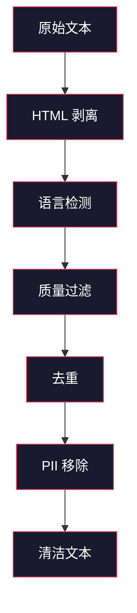
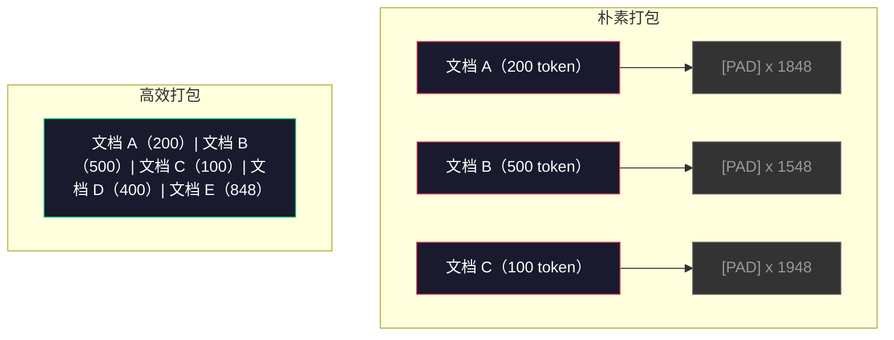

# 预训练数据流水线

> 模型是一面镜子。它反映你喂给它的任何数据。喂给它垃圾，它就以完美的流畅性反映垃圾。

**类型：** 构建
**语言：** Python
**前置条件：** Phase 10 · 01-02（分词器、构建分词器）
**时长：** 约 90 分钟

## 学习目标

- 构建一个流式数据流水线，能在不将全部数据加载到内存的情况下，对 TB 级文本进行分词、分块、打乱和批处理
- 实现真实预训练流水线中使用的数据质量过滤器（去重、语言检测、内容过滤）
- 创建固定长度的训练序列，带有正确的注意力掩码和文档边界处理
- 分析流水线吞吐量，确保数据加载器能跟上 GPU 训练速度

## 问题背景

你有了分词器，现在需要数据。

不是一个数据集，不是一个 CSV 文件，而是 TB 级别的文本——清洗过、去重过、经过质量过滤、分词为固定长度序列，并以足够快的随机批次形式提供，使你的 8-GPU 集群永远不需要等待下一批数据。

大多数人认为训练大语言模型的关键在于模型架构，实则不然。Llama 3 使用了 15.6 万亿 token，GPT-3 使用了 3000 亿，DeepSeek-V2 使用了 8.1 万亿。三者的架构大致相同：堆叠的 Transformer 块，带有注意力层和前馈层。输出质量的差异几乎完全来自数据。

DeepMind 的 Chinchilla 论文对此做出了精确说明。对于给定的计算预算，模型参数量与训练 token 数有一个最优比例。Chinchilla 显示，2022 年大多数模型严重训练不足——它们的参数量相对于所见数据量来说太多了。在 1.4 万亿 token 上训练的 700 亿参数模型（Chinchilla 最优）胜过了在 3000 亿 token 上训练的 2800 亿参数模型（Gopher）。

你的数据流水线决定了你的模型是学习语言还是学习噪声。

## 核心概念

### 数据来源

每个大语言模型都在多种来源的混合数据上训练。对大多数实验室来说，确切的组成是严格保密的，但我们了解到足够的信息来理解各类别：

| 来源 | 规模 | 质量 | 使用者 |
|------|------|------|--------|
| Common Crawl | 约 250 TB 原始数据 | 低（需要大量过滤） | GPT-3、Llama、大多数开源模型 |
| 维基百科 | 约 20 GB | 高 | 所有主要大语言模型 |
| GitHub 代码 | 约 1 TB+ | 中等（大量重复、死代码） | StarCoder、CodeLlama、DeepSeek-Coder |
| 书籍（BookCorpus、Pile） | 约 100 GB | 高 | GPT-2、GPT-3、早期模型 |
| 学术论文（arXiv、S2ORC） | 约 100 GB | STEM 领域高 | Llama、Galactica |
| StackOverflow、Reddit | 约 100 GB | 中等 | Llama、Falcon |
| 精选网页（C4、RefinedWeb） | 约 5 TB | 中-高（预过滤） | T5、Falcon |

Llama 3 披露了其数据混合比例：约 50% 网页数据、25% 代码、13% 书籍和学术论文、8% 数学数据、4% 多语言网页数据。总计来自超过 5 TB 原始文本的 15.6 万亿 token。

比例与总量同样重要。网页数据太多，模型就变成 Reddit 复读机。代码太少，它就不会编程。数学太少，它就不擅长推理。把这个混合比例搞对是训练大语言模型最难的部分之一，没有公式——需要实验和评估。

### 数据清洗

原始网页数据非常脏。典型的 Common Crawl 转储包含：

- HTML 标签和 JavaScript
- 样板式页眉、页脚、导航菜单
- 重复页面（精确和近似重复）
- 机器生成的垃圾信息
- 个人身份信息（PII）
- 低质量文本（关键词列表、SEO 垃圾）
- 编码为文本的非文本内容

清洗不是可选的，它决定了模型是生成连贯段落还是输出混合着产品列表的 HTML 标签。



每个步骤消除一类噪声：

**HTML 剥离：** 移除所有标记，只保留可见文本内容。`trafilatura` 或 `readability` 等库可以提取文章内容，同时丢弃导航、广告和样板。

**语言检测：** 使用 fastText 的语言识别模型（lid.176.bin）对每个文档进行分类。过滤到目标语言。置信度低于 0.8 的英语分类文档可能不是干净的英语。

**质量过滤：** 这是最有趣的地方。RefinedWeb（Falcon 背后的数据集）使用基于困惑度（perplexity）的过滤器：在维基百科上训练一个小型语言模型，然后给每个文档打分。困惑度高意味着文档与维基百科不同——很可能是垃圾信息、关键词列表或机器生成的内容。困惑度超过阈值的文档被移除。

**去重：** 单一影响最大的清洗步骤。Common Crawl 包含大量重复页面——法律免责声明、Cookie 通知、服务条款。训练重复内容会浪费计算资源，并可能导致模型逐字记忆和复述特定段落。

**PII 移除：** 姓名、电子邮件地址、电话号码、社会安全号码。对结构化 PII 使用基于正则表达式的检测，对上下文中的姓名使用 NER 模型。

### 用 MinHash 去重

精确去重很简单：对每个文档哈希，删除重复项。但近似重复才是真正的问题。同一篇新闻文章的两个副本，周围的广告略有不同，就是近似重复——内容 95% 相同，但逐字节地有所不同。

MinHash（最小哈希）+ LSH（局部敏感哈希）能高效解决这个问题。


基本思路：

1. **Shingling：** 将每个文档转换为 n-gram 集合（例如词或字符的 5-gram）。"the quick brown fox"的 3-词 shingle 变为 `{"the quick brown", "quick brown fox"}`。

2. **MinHash：** 对每个文档的 shingle 集合，计算 k 个哈希值。每个哈希值是在不同哈希函数下所有 shingle 的最小哈希值。这创建了一个固定大小的"签名"，近似任意两个文档之间的 Jaccard 相似度。

3. **LSH：** 根据 MinHash 签名的分段将文档分组到桶中。同一桶中的文档是候选近似重复项。这避免了比较每一对——你只需要比较候选对。

4. **验证：** 对每个候选对，计算精确 Jaccard 相似度。如果相似度超过阈值（通常为 0.8），删除一个副本。

Llama 团队报告通过去重移除了约 38% 的网页数据。这不是个小数字——Common Crawl 中超过三分之一的内容是重复或近似重复的。

### 序列打包

你的模型期望固定长度的输入序列，而你的文档是变长的——有的 50 个 token，有的 50,000 个 token。

朴素方法：将每个文档填充到最大序列长度。这在对学习毫无贡献的填充 token 上浪费了大量计算。

更好的方法：将多个文档打包到一个序列中，用序列结束 token 分隔。一个 2048 token 的序列可能包含三个短文档，之间用 [EOS] token 连接。



注意力掩码必须正确设置。同一个打包序列中，文档 A 的 token 不应该关注文档 B 的 token，这需要块对角注意力掩码。

长文档在序列边界处被截断或分割成块。分割点很重要：在句子中间分割会迫使模型看到不完整的思想。一些流水线尽可能在段落或句子边界处对齐分割。

### Chinchilla 缩放定律

对于固定计算预算 C（以 FLOPs 衡量），最优模型大小 N 和数据集大小 D 遵循：

```
N_opt ~ C^0.5
D_opt ~ C^0.5
```

在实践中，这意味着你应该大致同等地扩展模型大小和数据集大小。参数量多 10 倍的模型需要大约多 10 倍的训练 token 才能达到相同的损失。

| 模型 | 参数量 | 训练 Token 数 | Chinchilla 最优？ |
|------|-------|--------------|-----------------|
| GPT-3 | 1750 亿 | 3000 亿 | 否（训练不足 3-4 倍） |
| Chinchilla | 700 亿 | 1.4 万亿 | 是（按设计） |
| Llama 2 | 700 亿 | 2 万亿 | 过度训练（有意为之） |
| Llama 3 | 700 亿 | 15 万亿 | 严重过度训练 |

Llama 3 故意违反 Chinchilla 定律。Meta 发现，在更多数据上过度训练——远超计算最优比例——对推理产生更好的模型。额外的训练成本只付一次，但较小的模型永远更便宜服务。这有时被称为"推理最优"缩放方法，自 2024 年以来已成为行业标准。

## 动手构建

### 步骤一：文本清洗

剥离 HTML，规范化空白，移除非文本内容。我们使用公共领域文本（Project Gutenberg）作为小型语料库。

```python
import re

def clean_text(text):
    text = re.sub(r"<[^>]+>", "", text)
    text = re.sub(r"http\S+", "", text)
    text = re.sub(r"[^\x20-\x7E\n]", "", text)
    text = re.sub(r"\n{3,}", "\n\n", text)
    text = re.sub(r" {2,}", " ", text)
    return text.strip()

def quality_filter(text, min_words=50, max_ratio_caps=0.3, max_ratio_special=0.1):
    words = text.split()
    if len(words) < min_words:
        return False
    caps_ratio = sum(1 for w in words if w.isupper()) / len(words)
    if caps_ratio > max_ratio_caps:
        return False
    special_chars = sum(1 for c in text if not c.isalnum() and not c.isspace())
    if special_chars / max(len(text), 1) > max_ratio_special:
        return False
    return True
```

质量过滤器能捕获 SEO 垃圾（全部大写）、机器生成的噪声（特殊字符比例高）和存根页面（太短）。仅这三个检查就能从网页抓取中移除令人惊讶数量的垃圾。

### 步骤二：MinHash 去重

从零实现 MinHash，不需要外部库——只需要 `hashlib`。

```python
import hashlib
from collections import defaultdict

def get_shingles(text, k=5):
    words = text.lower().split()
    if len(words) < k:
        return set()
    return {" ".join(words[i:i+k]) for i in range(len(words) - k + 1)}

def minhash_signature(shingles, num_hashes=128):
    signature = []
    for i in range(num_hashes):
        min_hash = float("inf")
        for shingle in shingles:
            h = int(hashlib.sha256(f"{i}:{shingle}".encode()).hexdigest(), 16)
            min_hash = min(min_hash, h)
        signature.append(min_hash)
    return signature

def lsh_buckets(signature, bands=16):
    rows_per_band = len(signature) // bands
    buckets = []
    for b in range(bands):
        start = b * rows_per_band
        band_data = tuple(signature[start:start + rows_per_band])
        bucket_hash = hashlib.md5(str(band_data).encode()).hexdigest()
        buckets.append((b, bucket_hash))
    return buckets

def deduplicate(documents, threshold=0.8, num_hashes=128, bands=16):
    signatures = []
    shingle_sets = []
    for doc in documents:
        shingles = get_shingles(doc)
        shingle_sets.append(shingles)
        signatures.append(minhash_signature(shingles, num_hashes))

    bucket_map = defaultdict(list)
    for doc_idx, sig in enumerate(signatures):
        for band_id, bucket_hash in lsh_buckets(sig, bands):
            bucket_map[(band_id, bucket_hash)].append(doc_idx)

    duplicate_pairs = set()
    for bucket_docs in bucket_map.values():
        if len(bucket_docs) < 2:
            continue
        for i in range(len(bucket_docs)):
            for j in range(i + 1, len(bucket_docs)):
                duplicate_pairs.add((bucket_docs[i], bucket_docs[j]))

    removed = set()
    for i, j in duplicate_pairs:
        if i in removed or j in removed:
            continue
        s1, s2 = shingle_sets[i], shingle_sets[j]
        if not s1 or not s2:
            continue
        jaccard = len(s1 & s2) / len(s1 | s2)
        if jaccard >= threshold:
            removed.add(j)

    return [doc for idx, doc in enumerate(documents) if idx not in removed], len(removed)
```

`num_hashes=128` 和 `bands=16` 参数控制精度-召回率权衡。哈希数越多，相似度估计越准确。频带数越多，召回率越高（能发现更多重复项），但误报也更多。这些值对典型的网页文本效果很好。

### 步骤三：分词并打包序列

将干净的、去重后的文本分词，并打包成固定长度的训练序列。

```python
def tokenize_corpus(documents, tokenizer):
    all_tokens = []
    for doc in documents:
        tokens = tokenizer.encode(doc)
        all_tokens.extend(tokens)
        all_tokens.append(tokenizer.eos_id)
    return all_tokens

def pack_sequences(token_ids, seq_length, pad_id=0):
    sequences = []
    attention_masks = []
    for i in range(0, len(token_ids), seq_length):
        seq = token_ids[i:i + seq_length]
        mask = [1] * len(seq)
        if len(seq) < seq_length:
            pad_count = seq_length - len(seq)
            seq = seq + [pad_id] * pad_count
            mask = mask + [0] * pad_count
        sequences.append(seq)
        attention_masks.append(mask)
    return sequences, attention_masks
```

### 步骤四：训练用 DataLoader

生成打包序列的随机批次，这是训练循环消耗的内容。

```python
import random

class PreTrainingDataLoader:
    def __init__(self, sequences, attention_masks, batch_size, shuffle=True):
        self.sequences = sequences
        self.attention_masks = attention_masks
        self.batch_size = batch_size
        self.shuffle = shuffle

    def __len__(self):
        return (len(self.sequences) + self.batch_size - 1) // self.batch_size

    def __iter__(self):
        indices = list(range(len(self.sequences)))
        if self.shuffle:
            random.shuffle(indices)
        for start in range(0, len(indices), self.batch_size):
            batch_idx = indices[start:start + self.batch_size]
            batch_seqs = [self.sequences[i] for i in batch_idx]
            batch_masks = [self.attention_masks[i] for i in batch_idx]
            yield batch_seqs, batch_masks
```

### 步骤五：数据集统计

计算关键数字：总 token 数、唯一 token 数、压缩率、文档长度分布。

```python
from collections import Counter

def compute_statistics(documents, token_ids, sequences, tokenizer_vocab_size):
    total_chars = sum(len(d) for d in documents)
    total_tokens = len(token_ids)
    unique_tokens = len(set(token_ids))
    compression_ratio = total_chars / total_tokens

    doc_lengths = [len(d.split()) for d in documents]
    avg_doc_length = sum(doc_lengths) / max(len(doc_lengths), 1)
    max_doc_length = max(doc_lengths) if doc_lengths else 0
    min_doc_length = min(doc_lengths) if doc_lengths else 0

    token_counts = Counter(token_ids)
    top_tokens = token_counts.most_common(10)

    non_pad_tokens = sum(sum(1 for t in seq if t != 0) for seq in sequences)
    total_positions = sum(len(seq) for seq in sequences)
    utilization = non_pad_tokens / max(total_positions, 1)

    stats = {
        "total_documents": len(documents),
        "total_characters": total_chars,
        "total_tokens": total_tokens,
        "unique_tokens": unique_tokens,
        "vocab_utilization": unique_tokens / tokenizer_vocab_size,
        "compression_ratio": compression_ratio,
        "avg_doc_length_words": avg_doc_length,
        "max_doc_length_words": max_doc_length,
        "min_doc_length_words": min_doc_length,
        "num_sequences": len(sequences),
        "sequence_utilization": utilization,
        "top_10_tokens": top_tokens,
    }
    return stats
```

压缩率告诉你分词器在这个语料库上的效率。英语文本通常压缩到每个 token 约 3-4 个字符。如果你看到每个 token 只有 1.5 个字符，说明分词器分割得过于激进。如果看到 8+，说明它学到了非常特定领域的合并规则。

序列利用率告诉你打包序列中有多少是真实数据而不是填充。低于 90% 意味着你的打包效率低下——你在填充 token 上浪费了计算资源。

## 实际使用

### 与 HuggingFace Datasets 对比

通过 HuggingFace 的 datasets 库加载同一语料库，比较流水线速度。

```python
from datasets import load_dataset
from transformers import AutoTokenizer

ds = load_dataset("wikitext", "wikitext-2-raw-v1", split="train")
tokenizer = AutoTokenizer.from_pretrained("meta-llama/Meta-Llama-3-8B")

import time

start = time.time()
tokenized = ds.map(
    lambda x: tokenizer(x["text"], truncation=True, max_length=2048),
    batched=True,
    num_proc=4,
)
hf_time = time.time() - start
total_tokens = sum(len(t) for t in tokenized["input_ids"])
print(f"HuggingFace: {total_tokens:,} 个 token，耗时 {hf_time:.2f}s（{total_tokens/hf_time:,.0f} token/秒）")
```

HuggingFace 流水线底层使用 Rust 分词器，并在 4 个核上并行处理。你的纯 Python 流水线会慢 10-50 倍。这就是为什么生产团队使用编译好的分词器——算法是相同的，实现语言才是区别所在。

## 产出物

本课产出一个用于验证和调试大语言模型训练流水线中数据质量的提示词。参见 `outputs/prompt-data-quality-checker.md`。

## 练习

1. **简单。** 使用简单启发式方法（字符集分析）在清洗流水线中添加语言检测。过滤到只保留英文文档，并测量有多少文档被移除。
2. **中等。** 与 MinHash 近似去重一起实现基于 SHA-256 哈希的精确去重。比较两种方法在网络抓取语料库上各自发现的重复数量。
3. **困难。** 构建基于困惑度的质量过滤器。在维基百科文本上训练一个小型二元语言模型，对每个文档打困惑度分，移除底部 20%。比较在过滤与未过滤数据上训练的模型输出质量。

## 关键术语

| 术语 | 常见说法 | 实际含义 |
|------|---------|---------|
| Common Crawl | "互联网" | 一个每月爬取网络的非营利组织——约 250TB 原始数据，是大多数大语言模型训练数据的起点 |
| MinHash | "某种哈希技巧" | 一种使用固定大小签名估计集合之间 Jaccard 相似度的技术——支持大规模近似重复检测 |
| LSH | "局部敏感哈希" | 一种将相似项分到同一桶的方法——将两两比较从 O(n²) 减少到接近线性 |
| 序列打包（Sequence packing） | "连接文档" | 将多个文档放入固定长度序列，带有正确的注意力掩码——消除填充浪费 |
| Chinchilla 缩放 | "训练更多数据" | 对于固定计算预算，最优性能需要大致同等地扩展模型大小和训练 token 数 |
| 生育率（Fertility） | "每词 token 数" | 平均每词 token 数——GPT-4 处理英语约为 1.3，非拉丁文字更高 |
| 数据混合（Data mixing） | "选择训练数据" | 代码、文本、数学、多语言数据的比例——没有公式，需要实验 |
| 困惑度过滤器（Perplexity filter） | "质量评分" | 用小型语言模型对文档打分——高困惑度意味着文本与干净参考数据不同 |
| 去重（Deduplication） | "删除副本" | 消除精确和近似重复文档——通常删除 30-40% 的原始网页数据 |
| 注意力掩码（Attention mask） | "哪些 token 可以关注" | 一个二值掩码，防止打包序列中跨文档边界的注意力 |

## 延伸阅读

- [Hoffmann 等，2022——训练计算最优大语言模型（Chinchilla）](https://arxiv.org/abs/2203.15556) — 改变我们对数据规模思考的论文
- [Penedo 等，2023——Falcon 大语言模型的 RefinedWeb 数据集](https://arxiv.org/abs/2306.01116) — 如何将 Common Crawl 过滤到高质量
- [Touvron 等，2023——Llama 2](https://arxiv.org/abs/2307.09288) — Llama 2 的数据流水线详情
- [Lee 等，2022——训练数据去重使语言模型更好](https://arxiv.org/abs/2107.06499) — 为什么去重比你想象的更重要
- [Broder，1997——文档的相似性与包含性](https://ieeexplore.ieee.org/document/666900) — 原始 MinHash 论文
- [Meta，2024——Llama 3 技术报告](https://arxiv.org/abs/2407.21783) — 15.6 万亿 token、数据混合比例、过滤流水线
