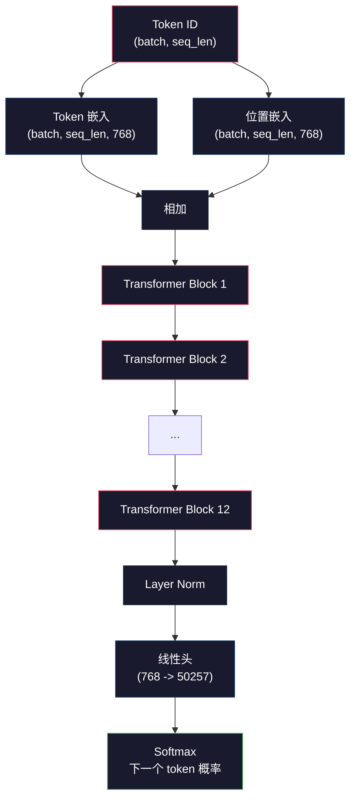
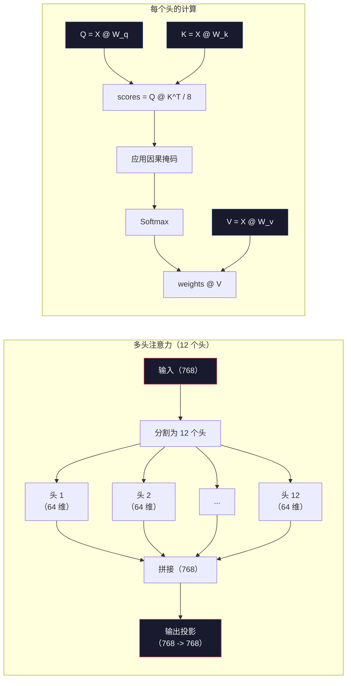
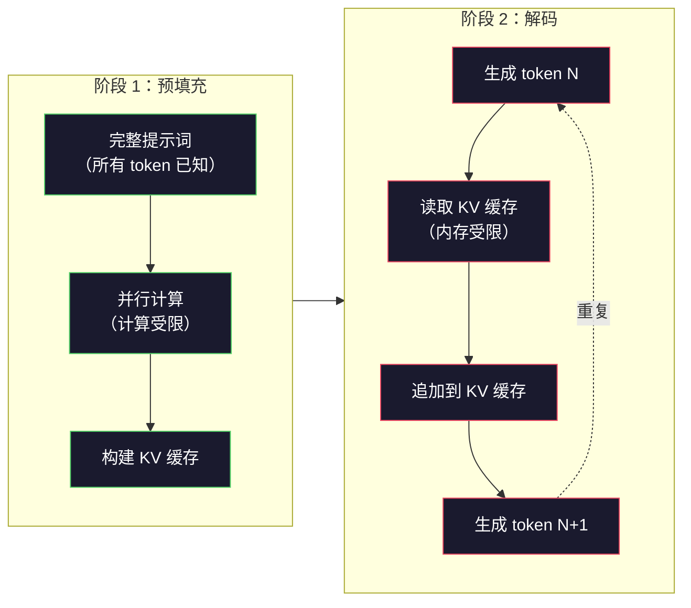

# 预训练迷你 GPT（1.24 亿参数）

> GPT-2 Small 有 1.24 亿个参数。这意味着 12 个 Transformer 层、12 个注意力头和 768 维嵌入。你可以在单个 GPU 上几小时内从零训练它。大多数人从不这样做，他们使用预训练的检查点。但如果你从未自己训练过，你就不真正理解你用来构建产品的模型内部发生了什么。

**类型：** 构建
**语言：** Python（使用 numpy）
**前置条件：** Phase 10 · 01-03（分词器、构建分词器、数据流水线）
**时长：** 约 120 分钟

## 学习目标

- 从零实现完整的 GPT-2 架构（1.24 亿参数）：token 嵌入、位置嵌入、Transformer 块和语言模型头
- 使用下一个 token 预测与交叉熵损失在文本语料库上训练 GPT 模型
- 实现带温度采样和 top-k/top-p 过滤的自回归文本生成
- 监控训练损失曲线，验证模型学习到了连贯的语言模式

## 问题背景

你知道什么是 Transformer，你读过那些图，你会背"Attention Is All You Need"，能在白板上画出标记着"Multi-Head Attention"的方框。

但这些都不意味着你理解模型生成文本时发生了什么。

GPT-2 Small（带权重绑定）有 124,438,272 个参数，每一个都是通过运行训练循环设置的：前向传播、计算损失、反向传播、更新权重。十二个 Transformer 块，每个块十二个注意力头，768 维嵌入空间，50,257 个 token 的词汇表。每次模型生成一个 token，全部 1.24 亿个参数都参与一次矩阵乘法链，接受一个 token ID 序列，输出下一个 token 的概率分布。

如果你从未自己构建过这个，你就是在用一个黑盒。你可以调用 API，可以微调，但当出现问题时——当模型产生幻觉、当它重复自己、当它拒绝遵循指令——你没有理解*为什么*的心智模型。

本课从零构建 GPT-2 Small，不用 PyTorch，用 numpy。每一次矩阵乘法都是可见的，每一个梯度都由你的代码计算。你将看到 1.24 亿个数字是如何协同预测下一个词的。

## 核心概念

### GPT 架构

GPT 是一个自回归（autoregressive）语言模型。"自回归"意味着它一次生成一个 token，每个 token 以所有之前的 token 为条件。架构是一叠 Transformer 解码器块。

以下是从 token ID 到下一个 token 概率的完整计算图：

1. Token ID 输入，形状：`(batch_size, seq_len)`
2. Token 嵌入查找，每个 ID 映射到一个 768 维向量，形状：`(batch_size, seq_len, 768)`
3. 位置嵌入查找，每个位置（0, 1, 2, ...）映射到一个 768 维向量，形状相同
4. 将 token 嵌入 + 位置嵌入相加
5. 通过 12 个 Transformer 块
6. 最终层归一化
7. 线性投影到词汇表大小，形状：`(batch_size, seq_len, vocab_size)`
8. Softmax 得到概率

这就是整个模型。没有卷积，没有循环，只有嵌入、注意力、前馈网络和层归一化叠加 12 次。



### Transformer 块

12 个块中的每一个都遵循相同的模式。预归一化架构（GPT-2 使用预归一化，而不是原始 Transformer 的后归一化）：

1. LayerNorm
2. 多头自注意力
3. 残差连接（将输入加回）
4. LayerNorm
5. 前馈网络（MLP）
6. 残差连接（将输入加回）

残差连接至关重要。没有它们，梯度在反向传播到第1块时就会消失。有了它们，梯度可以通过"跳跃"路径直接从损失流向任何层。这就是为什么你可以堆叠 12、32 甚至 96 块（据说 GPT-4 使用 120 块）。

### 注意力：核心机制

自注意力让每个 token 能看到所有之前的 token，并决定对每个 token 的关注程度。数学如下。

对每个 token 位置，从输入计算三个向量：
- **查询（Q）**："我在寻找什么？"
- **键（K）**："我包含什么？"
- **值（V）**："我携带什么信息？"

```
Q = input @ W_q    (768 -> 768)
K = input @ W_k    (768 -> 768)
V = input @ W_v    (768 -> 768)

attention_scores = Q @ K^T / sqrt(d_k)
attention_scores = mask(attention_scores)   # 因果掩码：对未来位置设为 -inf
attention_weights = softmax(attention_scores)
output = attention_weights @ V
```

因果掩码让 GPT 具有自回归性。位置 5 可以关注位置 0-5，但不能关注 6、7、8 等。这防止模型在训练时通过看未来的 token 来"作弊"。

**多头注意力**将 768 维空间分割成 12 个各 64 维的头。每个头学习不同的注意力模式。一个头可能追踪句法关系（主谓一致），另一个追踪语义相似性（同义词），还有一个追踪位置邻近性（相邻词）。所有 12 个头的输出被拼接后投影回 768 维。



除以 sqrt(d_k)（sqrt(64) = 8）是缩放操作。没有它，高维向量的点积会很大，将 softmax 推入梯度几乎为零的区域。这是原始"Attention Is All You Need"论文中的关键洞见之一。

### KV 缓存：为什么推理很快

训练时，你一次处理整个序列。推理时，你一次生成一个 token。如果不优化，生成第 N 个 token 需要对所有 N-1 个之前的 token 重新计算注意力，每生成一个 token 的复杂度是 O(N²)，长度为 N 的序列总复杂度是 O(N³)。

KV 缓存（KV Cache）解决了这个问题。计算每个 token 的 K 和 V 后将其存储。生成第 N+1 个 token 时，只需计算新 token 的 Q，并查找之前所有 token 的缓存 K 和 V。这将每个 token 的 K、V 计算成本从 O(N) 降至 O(1)。注意力分数计算仍然是 O(N)（因为你要关注所有之前的位置），但避免了对输入的冗余矩阵乘法。

对于有 12 层 12 头的 GPT-2，KV 缓存每个 token 存储 2（K + V）× 12 层 × 12 头 × 64 维 = 18,432 个值。对于 1024 token 的序列，FP32 下约为 75MB。对于有 128 层的 Llama 3 405B，单个序列的 KV 缓存可能超过 10GB。这就是为什么长上下文推理受内存限制。

### 预填充与解码：推理的两个阶段

当你向大语言模型发送提示词时，推理分两个截然不同的阶段进行。

**预填充（Prefill）**并行处理整个提示词。所有 token 都是已知的，因此模型可以同时计算所有位置的注意力。这个阶段是计算受限的——GPU 以全吞吐量进行矩阵乘法。对于 A100 上的 1000 token 提示词，预填充大约需要 20-50ms。

**解码（Decode）**逐个生成 token。每个新 token 依赖所有之前的 token。这个阶段是内存受限的——瓶颈是从 GPU 内存读取模型权重和 KV 缓存，而不是矩阵计算本身。GPU 的计算核心大部分时间闲置，等待内存读取。对于 GPT-2，每个解码步骤所需时间大致相同，不管矩阵乘法需要多少 FLOPs，因为内存带宽是约束所在。

这个区别对生产系统很重要。预填充吞吐量随 GPU 计算能力扩展（FLOPS 越多，预填充越快）。解码吞吐量随内存带宽扩展（内存越快，解码越快）。这就是为什么 NVIDIA H100 专注于比 A100 更好的内存带宽改进——它直接加速了 token 生成。



### 训练循环

训练大语言模型就是下一个 token 预测。给定 token [0, 1, 2, ..., N-1]，预测 token [1, 2, 3, ..., N]。损失函数是模型预测概率分布与实际下一个 token 之间的交叉熵。

一个训练步骤：

1. **前向传播**：将批次通过所有 12 个块，获得每个位置的 logit（softmax 前的分数）
2. **计算损失**：logit 与目标 token（输入向右移一位）之间的交叉熵
3. **反向传播**：使用反向传播计算全部 1.24 亿个参数的梯度
4. **优化器步骤**：更新权重。GPT-2 使用带学习率预热和余弦衰减的 Adam

学习率调度比你想象的更重要。GPT-2 在前 2,000 步从 0 预热到峰值学习率，然后按余弦曲线衰减。从高学习率开始会导致模型发散，保持恒定的高学习率会导致后期训练震荡。这种预热后衰减的模式被每个主要大语言模型使用。

### GPT-2 Small：参数细节

| 组件 | 形状 | 参数数量 |
|------|------|---------|
| Token 嵌入 | (50257, 768) | 38,597,376 |
| 位置嵌入 | (1024, 768) | 786,432 |
| 每块注意力（W_q, W_k, W_v, W_out） | 4 × (768, 768) | 2,359,296 |
| 每块 FFN（上投影 + 下投影） | (768, 3072) + (3072, 768) | 4,718,592 |
| 每块 LayerNorm（2 个） | 2 × 768 × 2 | 3,072 |
| 最终 LayerNorm | 768 × 2 | 1,536 |
| **每块总计** | | **7,080,960** |
| **总计（12 块）** | | **85,054,464 + 39,383,808 = 124,438,272** |

输出投影（logit 头）与 token 嵌入矩阵共享权重。这叫做权重绑定（weight tying）——减少了 3800 万个参数，并因为强制模型对输入和输出使用相同的表示空间而提升了性能。

## 动手构建

### 步骤一：嵌入层

Token 嵌入将 50,257 个可能的 token 中的每一个映射到 768 维向量。位置嵌入添加关于每个 token 在序列中位置的信息。两者相加。

```python
import numpy as np

class Embedding:
    def __init__(self, vocab_size, embed_dim, max_seq_len):
        self.token_embed = np.random.randn(vocab_size, embed_dim) * 0.02
        self.pos_embed = np.random.randn(max_seq_len, embed_dim) * 0.02

    def forward(self, token_ids):
        seq_len = token_ids.shape[-1]
        tok_emb = self.token_embed[token_ids]
        pos_emb = self.pos_embed[:seq_len]
        return tok_emb + pos_emb
```

0.02 的标准差初始化来自 GPT-2 论文。太大则初始前向传播产生极端值，破坏训练稳定性；太小则所有输入的初始输出几乎相同，使早期梯度信号无用。

### 步骤二：带因果掩码的自注意力

先实现单头注意力。因果掩码在 softmax 之前将未来位置设为负无穷，确保每个位置只能关注自身和更早的位置。

```python
def attention(Q, K, V, mask=None):
    d_k = Q.shape[-1]
    scores = Q @ K.transpose(0, -1, -2 if Q.ndim == 4 else 1) / np.sqrt(d_k)
    if mask is not None:
        scores = scores + mask
    weights = np.exp(scores - scores.max(axis=-1, keepdims=True))
    weights = weights / weights.sum(axis=-1, keepdims=True)
    return weights @ V
```

softmax 实现在求指数前减去最大值。没有这一步，exp(大数) 会溢出为无穷大。这是一个数值稳定性技巧，不会改变输出，因为对任意常数 c，softmax(x - c) = softmax(x)。

### 步骤三：多头注意力

将 768 维输入分割成 12 个各 64 维的头。每个头独立计算注意力，拼接结果后投影回 768 维。

```python
class MultiHeadAttention:
    def __init__(self, embed_dim, num_heads):
        self.num_heads = num_heads
        self.head_dim = embed_dim // num_heads
        self.W_q = np.random.randn(embed_dim, embed_dim) * 0.02
        self.W_k = np.random.randn(embed_dim, embed_dim) * 0.02
        self.W_v = np.random.randn(embed_dim, embed_dim) * 0.02
        self.W_out = np.random.randn(embed_dim, embed_dim) * 0.02

    def forward(self, x, mask=None):
        batch, seq_len, d = x.shape
        Q = (x @ self.W_q).reshape(batch, seq_len, self.num_heads, self.head_dim).transpose(0, 2, 1, 3)
        K = (x @ self.W_k).reshape(batch, seq_len, self.num_heads, self.head_dim).transpose(0, 2, 1, 3)
        V = (x @ self.W_v).reshape(batch, seq_len, self.num_heads, self.head_dim).transpose(0, 2, 1, 3)

        scores = Q @ K.transpose(0, 1, 3, 2) / np.sqrt(self.head_dim)
        if mask is not None:
            scores = scores + mask
        weights = np.exp(scores - scores.max(axis=-1, keepdims=True))
        weights = weights / weights.sum(axis=-1, keepdims=True)
        attn_out = weights @ V

        attn_out = attn_out.transpose(0, 2, 1, 3).reshape(batch, seq_len, d)
        return attn_out @ self.W_out
```

reshape-transpose-reshape 操作是多头注意力中最令人困惑的部分。发生了什么：`(batch, seq_len, 768)` 张量变为 `(batch, seq_len, 12, 64)`，再变为 `(batch, 12, seq_len, 64)`。现在 12 个头中的每一个都有自己的 `(seq_len, 64)` 矩阵来运行注意力。注意力后，我们逆向操作：`(batch, 12, seq_len, 64)` 变为 `(batch, seq_len, 12, 64)` 变为 `(batch, seq_len, 768)`。

### 步骤四：Transformer 块

一个完整的 Transformer 块：LayerNorm、带残差的多头注意力、LayerNorm、带残差的前馈网络。

```python
class LayerNorm:
    def __init__(self, dim, eps=1e-5):
        self.gamma = np.ones(dim)
        self.beta = np.zeros(dim)
        self.eps = eps

    def forward(self, x):
        mean = x.mean(axis=-1, keepdims=True)
        var = x.var(axis=-1, keepdims=True)
        return self.gamma * (x - mean) / np.sqrt(var + self.eps) + self.beta


class FeedForward:
    def __init__(self, embed_dim, ff_dim):
        self.W1 = np.random.randn(embed_dim, ff_dim) * 0.02
        self.b1 = np.zeros(ff_dim)
        self.W2 = np.random.randn(ff_dim, embed_dim) * 0.02
        self.b2 = np.zeros(embed_dim)

    def forward(self, x):
        h = x @ self.W1 + self.b1
        h = np.maximum(0, h)  # 简化起见使用 ReLU，原版为 GELU
        return h @ self.W2 + self.b2


class TransformerBlock:
    def __init__(self, embed_dim, num_heads, ff_dim):
        self.ln1 = LayerNorm(embed_dim)
        self.attn = MultiHeadAttention(embed_dim, num_heads)
        self.ln2 = LayerNorm(embed_dim)
        self.ffn = FeedForward(embed_dim, ff_dim)

    def forward(self, x, mask=None):
        x = x + self.attn.forward(self.ln1.forward(x), mask)
        x = x + self.ffn.forward(self.ln2.forward(x))
        return x
```

前馈网络将 768 维输入扩展到 3,072 维（4 倍），应用非线性，然后投影回 768 维。这种扩展-压缩模式让模型在每个位置都有一个更宽的内部表示空间来工作。GPT-2 使用 GELU 激活，但为了简洁我们这里使用 ReLU——对理解架构来说差别很小。

### 步骤五：完整 GPT 模型

叠加 12 个 Transformer 块，前面加上嵌入层，后面加上输出投影。

```python
class MiniGPT:
    def __init__(self, vocab_size=50257, embed_dim=768, num_heads=12,
                 num_layers=12, max_seq_len=1024, ff_dim=3072):
        self.embedding = Embedding(vocab_size, embed_dim, max_seq_len)
        self.blocks = [
            TransformerBlock(embed_dim, num_heads, ff_dim)
            for _ in range(num_layers)
        ]
        self.ln_f = LayerNorm(embed_dim)
        self.vocab_size = vocab_size
        self.embed_dim = embed_dim

    def forward(self, token_ids):
        seq_len = token_ids.shape[-1]
        mask = np.triu(np.full((seq_len, seq_len), -1e9), k=1)

        x = self.embedding.forward(token_ids)
        for block in self.blocks:
            x = block.forward(x, mask)
        x = self.ln_f.forward(x)

        logits = x @ self.embedding.token_embed.T
        return logits

    def count_parameters(self):
        total = 0
        total += self.embedding.token_embed.size
        total += self.embedding.pos_embed.size
        for block in self.blocks:
            total += block.attn.W_q.size + block.attn.W_k.size
            total += block.attn.W_v.size + block.attn.W_out.size
            total += block.ffn.W1.size + block.ffn.b1.size
            total += block.ffn.W2.size + block.ffn.b2.size
            total += block.ln1.gamma.size + block.ln1.beta.size
            total += block.ln2.gamma.size + block.ln2.beta.size
        total += self.ln_f.gamma.size + self.ln_f.beta.size
        return total
```

注意权重绑定：`logits = x @ self.embedding.token_embed.T`。输出投影重用了 token 嵌入矩阵（转置）。这不只是节省参数的技巧，它意味着模型对理解 token（嵌入）和预测 token（输出）使用相同的向量空间。

### 步骤六：训练循环

对 1.24 亿参数的真实训练运行，你需要 GPU 和 PyTorch。这个训练循环展示了在纯 numpy 小模型上的机制。我们使用一个小模型（4 层、4 头、128 维）使其可行。

```python
def cross_entropy_loss(logits, targets):
    batch, seq_len, vocab_size = logits.shape
    logits_flat = logits.reshape(-1, vocab_size)
    targets_flat = targets.reshape(-1)

    max_logits = logits_flat.max(axis=-1, keepdims=True)
    log_softmax = logits_flat - max_logits - np.log(
        np.exp(logits_flat - max_logits).sum(axis=-1, keepdims=True)
    )

    loss = -log_softmax[np.arange(len(targets_flat)), targets_flat].mean()
    return loss


def train_mini_gpt(text, vocab_size=256, embed_dim=128, num_heads=4,
                   num_layers=4, seq_len=64, num_steps=200, lr=3e-4):
    tokens = np.array(list(text.encode("utf-8")[:2048]))
    model = MiniGPT(
        vocab_size=vocab_size, embed_dim=embed_dim, num_heads=num_heads,
        num_layers=num_layers, max_seq_len=seq_len, ff_dim=embed_dim * 4
    )

    print(f"模型参数：{model.count_parameters():,}")
    print(f"训练 token 数：{len(tokens):,}")
    print(f"配置：{num_layers} 层，{num_heads} 头，{embed_dim} 维")
    print()

    for step in range(num_steps):
        start_idx = np.random.randint(0, max(1, len(tokens) - seq_len - 1))
        batch_tokens = tokens[start_idx:start_idx + seq_len + 1]

        input_ids = batch_tokens[:-1].reshape(1, -1)
        target_ids = batch_tokens[1:].reshape(1, -1)

        logits = model.forward(input_ids)
        loss = cross_entropy_loss(logits, target_ids)

        if step % 20 == 0:
            print(f"步骤 {step:4d} | 损失：{loss:.4f}")

    return model
```

损失从 ln(vocab_size) 附近开始——对 256 token 的字节级词汇表，这是 ln(256) = 5.55。随机模型对每个 token 分配相同的概率。随着训练进行，损失下降，因为模型学会预测常见模式："t"后跟"h"、句号后跟空格，等等。

在生产环境中，你会使用带梯度累积、学习率预热和梯度裁剪的 Adam 优化器。前向传播-损失-反向传播-更新的循环是相同的，优化器更复杂一些。

### 步骤七：文本生成

生成使用训练好的模型一次预测一个 token，每个预测从输出分布中采样（或以 argmax 的方式贪婪取得）。

```python
def generate(model, prompt_tokens, max_new_tokens=100, temperature=0.8):
    tokens = list(prompt_tokens)
    seq_len = model.embedding.pos_embed.shape[0]

    for _ in range(max_new_tokens):
        context = np.array(tokens[-seq_len:]).reshape(1, -1)
        logits = model.forward(context)
        next_logits = logits[0, -1, :]

        next_logits = next_logits / temperature
        probs = np.exp(next_logits - next_logits.max())
        probs = probs / probs.sum()

        next_token = np.random.choice(len(probs), p=probs)
        tokens.append(next_token)

    return tokens
```

温度（temperature）控制随机性。温度 1.0 使用原始分布，0.5 使其更尖锐（更确定性——模型更频繁地选择排名靠前的选项），1.5 使其更平坦（更随机——低概率 token 获得更大机会）。温度 0.0 是贪婪解码（总是选择概率最高的 token）。

`tokens[-seq_len:]` 窗口是必要的，因为模型有最大上下文长度（GPT-2 为 1024）。一旦超过，就必须丢弃最旧的 token。这就是大家都在谈论的"上下文窗口"。

## 实际使用

### 完整训练和生成演示

```python
corpus = """The transformer architecture has revolutionized natural language processing.
Attention mechanisms allow the model to focus on relevant parts of the input.
Self-attention computes relationships between all pairs of positions in a sequence.
Multi-head attention splits the representation into multiple subspaces.
Each attention head can learn different types of relationships.
The feedforward network provides nonlinear transformations at each position.
Residual connections enable gradient flow through deep networks.
Layer normalization stabilizes training by normalizing activations.
Position embeddings give the model information about token ordering.
The causal mask ensures autoregressive generation during training.
Pre-training on large text corpora teaches the model general language understanding.
Fine-tuning adapts the pre-trained model to specific downstream tasks."""

model = train_mini_gpt(corpus, num_steps=200)

prompt = list("The transformer".encode("utf-8"))
output_tokens = generate(model, prompt, max_new_tokens=100, temperature=0.8)
generated_text = bytes(output_tokens).decode("utf-8", errors="replace")
print(f"\n生成结果：{generated_text}")
```

在小语料库和小模型上，生成的文本顶多是半连贯的。它会从训练文本中学到一些字节级模式，但无法像 GPT-2 用 40GB 训练数据和完整 1.24 亿参数架构那样泛化。关键不在于输出质量，而在于你能追踪每一步：嵌入查找、注意力计算、前馈变换、logit 投影、softmax 和采样。每个操作都是可见的。

## 产出物

本课产出 `outputs/prompt-gpt-architecture-analyzer.md`——一个分析任何 GPT 风格模型架构选择的提示词。输入模型卡片或技术报告，它会分解参数分配、注意力设计和缩放决策。

## 练习

1. 将模型修改为 24 层 16 头，而不是 12/12。统计参数数量。将深度翻倍与宽度翻倍（嵌入维度）相比如何？

2. 实现 GELU 激活函数（GELU(x) = x × 0.5 × (1 + erf(x / sqrt(2)))），替换前馈网络中的 ReLU。分别用每种激活训练 500 步并比较最终损失。

3. 为生成函数添加 KV 缓存。在第一次前向传播后存储每层的 K 和 V 张量，并在后续 token 中复用。测量加速效果：分别有无缓存生成 200 个 token，比较挂钟时间。

4. 实现 top-k 采样（只考虑概率最高的 k 个 token）和 top-p 采样（核采样：考虑累积概率超过 p 的最小 token 集合）。在温度 0.8 下比较 top-k=50 与 top-p=0.95 的输出质量。

5. 构建训练损失曲线绘图器。训练模型 1000 步并绘制损失 vs 步骤图。识别三个阶段：快速初始下降（学习常见字节）、较慢的中间阶段（学习字节模式）和平台期（在小语料库上过拟合）。这个曲线的形状无论是 128 维模型还是 GPT-4 都是相同的。

## 关键术语

| 术语 | 常见说法 | 实际含义 |
|------|---------|---------|
| 自回归（Autoregressive） | "一次生成一个词" | 每个输出 token 以所有之前的 token 为条件——模型预测 P(token_n \| token_0, ..., token_{n-1}) |
| 因果掩码（Causal mask） | "它看不到未来" | 一个上三角形的 -∞ 值矩阵，防止训练期间关注未来位置 |
| 多头注意力（Multi-head attention） | "多种注意力模式" | 将 Q、K、V 分割成并行头（如 GPT-2 的 12 个各 64 维的头），每个头可以学习不同的关系类型 |
| KV 缓存（KV Cache） | "为了速度的缓存" | 存储之前 token 的 Key 和 Value 张量以避免自回归生成中的冗余计算 |
| 预填充（Prefill） | "处理提示词" | 并行处理所有提示词 token 的第一推理阶段——GPU FLOPS 计算受限 |
| 解码（Decode） | "生成 token" | 逐个生成 token 的第二推理阶段——GPU 带宽内存受限 |
| 权重绑定（Weight tying） | "共享嵌入" | 对输入 token 嵌入和输出投影头使用同一矩阵——在 GPT-2 中节省 3800 万参数 |
| 残差连接（Residual connection） | "跳跃连接" | 将输入直接加到子层的输出上（x + sublayer(x)）——支持深层网络中的梯度流 |
| 层归一化（Layer normalization） | "规范化激活" | 跨特征维度规范化为均值 0 和方差 1，带有可学习的缩放和偏置参数 |
| 交叉熵损失（Cross-entropy loss） | "预测有多错" | -log（分配给正确下一个 token 的概率），在所有位置取平均——标准的大语言模型训练目标 |

## 延伸阅读

- [Radford 等，2019——"语言模型是无监督多任务学习者"（GPT-2）](https://cdn.openai.com/better-language-models/language_models_are_unsupervised_multitask_learners.pdf) — 引入 124M 到 1.5B 参数家族的 GPT-2 论文
- [Vaswani 等，2017——"Attention Is All You Need"](https://arxiv.org/abs/1706.03762) — 带缩放点积注意力和多头注意力的原始 Transformer 论文
- [Llama 3 技术报告](https://arxiv.org/abs/2407.21783) — Meta 如何用 16K GPU 将 GPT 架构扩展到 4050 亿参数
- [Pope 等，2022——"高效扩展 Transformer 推理"](https://arxiv.org/abs/2211.05102) — 形式化了预填充 vs 解码和 KV 缓存分析的论文
